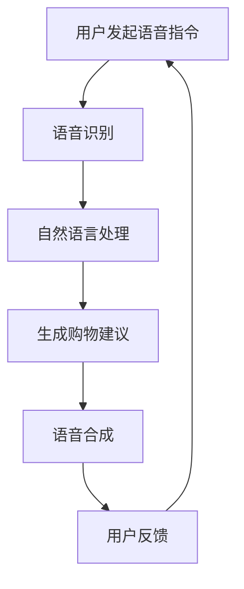

                 

关键词：AI大模型、电商平台、语音购物、用户体验、语音识别、自然语言处理、语音合成

摘要：随着人工智能技术的快速发展，AI大模型在电商平台的语音购物体验中发挥着越来越重要的作用。本文将深入探讨AI大模型如何通过语音识别、自然语言处理和语音合成等技术，改善电商平台的语音购物体验，提高用户满意度，并展望未来应用前景。

## 1. 背景介绍

近年来，电子商务在我国发展迅速，逐渐成为人们日常生活中不可或缺的一部分。随着智能手机和移动互联网的普及，越来越多的消费者选择在线购物。而电商平台的竞争也日益激烈，用户体验成为各平台争夺市场份额的关键因素。语音购物作为一种新兴的购物方式，以其便捷、高效的特点，逐渐受到消费者的喜爱。

然而，传统的语音购物体验存在一些问题，如语音识别准确性不高、自然语言处理能力有限、语音合成生硬等，这些都影响了用户的购物体验。为了解决这些问题，AI大模型的应用成为了一个重要的方向。

## 2. 核心概念与联系

### 2.1 语音识别

语音识别（Voice Recognition）是一种通过处理和分析语音信号，将其转换为对应的文本或命令的技术。语音识别技术的核心在于对语音信号进行特征提取和模式识别。特征提取是指从语音信号中提取出具有代表性和区分性的特征，如音高、音强、共振峰等。模式识别则是指利用这些特征对语音进行分类和识别。

### 2.2 自然语言处理

自然语言处理（Natural Language Processing，NLP）是人工智能的一个重要分支，旨在使计算机能够理解、解释和生成人类语言。NLP的核心任务是语言理解和语言生成。语言理解包括语义分析、句法分析和语义角色标注等；语言生成则包括文本摘要、机器翻译和语音合成等。

### 2.3 语音合成

语音合成（Text-to-Speech，TTS）是一种将文本转换为自然流畅的语音的技术。语音合成的核心在于语音合成引擎，它通过对文本进行分词、音素转换和音节拼接等操作，生成相应的语音。

### 2.4 AI大模型

AI大模型是指具有大规模参数和深度神经网络结构的模型，如Transformer、BERT等。这些模型通过大量的数据进行训练，能够更好地理解语言和语音的特征，从而提高语音识别、自然语言处理和语音合成的准确性和效果。

## 2.5 核心概念原理与架构

以下是语音购物体验中的核心概念原理与架构的 Mermaid 流程图：



### 3. 核心算法原理 & 具体操作步骤

### 3.1 算法原理概述

AI大模型在电商平台的语音购物体验中主要涉及语音识别、自然语言处理和语音合成三个环节。语音识别通过AI大模型对用户语音指令进行识别，将语音转换为文本；自然语言处理则对识别出的文本进行处理，提取用户的需求和意图；语音合成再将处理后的文本转换为自然流畅的语音，提供给用户。

### 3.2 算法步骤详解

#### 3.2.1 语音识别

语音识别的步骤主要包括特征提取和模式识别。特征提取利用AI大模型对语音信号进行预处理，提取出具有代表性和区分性的特征，如音高、音强、共振峰等。模式识别则利用这些特征对语音进行分类和识别，将语音转换为对应的文本。

#### 3.2.2 自然语言处理

自然语言处理的步骤主要包括语义分析、句法分析和语义角色标注。语义分析是对识别出的文本进行语义理解，提取出用户的需求和意图；句法分析是对文本进行语法分析，构建出句子的句法结构；语义角色标注则是对句子中的实体和关系进行标注，帮助AI大模型更好地理解文本的含义。

#### 3.2.3 语音合成

语音合成的步骤主要包括文本处理和语音生成。文本处理是对识别出的文本进行处理，如分词、音素转换和音节拼接等；语音生成则利用语音合成引擎，将处理后的文本转换为自然流畅的语音。

### 3.3 算法优缺点

#### 优点

1. 高准确度：AI大模型通过大量数据进行训练，具有较高的语音识别和自然语言处理准确度。
2. 强泛化能力：AI大模型能够处理各种场景和语言风格，具有较强的泛化能力。
3. 自然流畅：语音合成生成的语音自然流畅，接近人类语音。

#### 缺点

1. 对数据依赖：AI大模型需要大量高质量的数据进行训练，否则可能导致模型性能下降。
2. 对计算资源需求高：AI大模型需要大量的计算资源进行训练和推理，对硬件设备有较高要求。

### 3.4 算法应用领域

AI大模型在电商平台的语音购物体验中的应用非常广泛，包括但不限于：

1. 语音搜索：用户可以通过语音指令搜索商品，提高搜索效率。
2. 语音推荐：根据用户的语音指令，AI大模型可以推荐相关的商品。
3. 语音客服：用户可以通过语音与客服进行交互，提高客服效率。
4. 语音购物车：用户可以通过语音添加或删除购物车中的商品。

## 4. 数学模型和公式 & 详细讲解 & 举例说明

### 4.1 数学模型构建

语音购物体验的数学模型主要包括语音识别模型、自然语言处理模型和语音合成模型。以下是这些模型的数学表示：

#### 语音识别模型

$$
P(y|x) = \frac{e^{f(x,y)}}{1 + e^{f(x,y)}}
$$

其中，$x$ 表示输入语音信号，$y$ 表示对应的文本标签，$f(x,y)$ 表示语音信号和文本标签之间的相似度函数。

#### 自然语言处理模型

$$
P(z|x) = \prod_{i=1}^{n} P(z_i|x)
$$

其中，$x$ 表示输入文本，$z$ 表示文本的语义表示，$P(z_i|x)$ 表示文本中第 $i$ 个词的语义表示。

#### 语音合成模型

$$
P(w|z) = \prod_{i=1}^{n} P(w_i|z)
$$

其中，$z$ 表示文本的语义表示，$w$ 表示对应的语音信号，$P(w_i|z)$ 表示文本中第 $i$ 个词对应的语音信号的生成概率。

### 4.2 公式推导过程

#### 语音识别模型

语音识别模型的公式推导基于概率模型，假设输入语音信号 $x$ 和文本标签 $y$ 之间的相似度函数为 $f(x,y)$。那么，语音信号 $x$ 对应文本标签 $y$ 的概率可以表示为：

$$
P(y|x) = \frac{e^{f(x,y)}}{1 + e^{f(x,y)}}
$$

#### 自然语言处理模型

自然语言处理模型的公式推导基于概率模型，假设文本 $x$ 的语义表示为 $z$，那么文本中第 $i$ 个词 $z_i$ 的概率可以表示为：

$$
P(z_i|x) = \frac{e^{g(x,z_i)}}{1 + e^{g(x,z_i)}}
$$

其中，$g(x,z_i)$ 表示文本 $x$ 和词 $z_i$ 之间的相似度函数。

#### 语音合成模型

语音合成模型的公式推导基于概率模型，假设文本 $z$ 的语音信号为 $w$，那么文本中第 $i$ 个词 $w_i$ 的概率可以表示为：

$$
P(w_i|z) = \frac{e^{h(z,w_i)}}{1 + e^{h(z,w_i)}}
$$

其中，$h(z,w_i)$ 表示文本 $z$ 和词 $w_i$ 之间的相似度函数。

### 4.3 案例分析与讲解

以下是一个简单的案例，说明如何使用AI大模型改善电商平台的语音购物体验。

假设用户通过语音指令搜索“苹果手机”，电商平台的语音购物系统能够快速识别出语音指令，并使用自然语言处理模型对指令进行理解。经过分析，系统提取出用户的需求为“购买苹果品牌的手机”。接下来，系统使用语音合成模型生成相应的语音，告知用户相关商品的信息。

具体步骤如下：

1. 语音识别模型识别出用户的语音指令，将语音转换为文本：“购买苹果手机”。
2. 自然语言处理模型对文本进行处理，提取出用户的需求：“购买苹果品牌的手机”。
3. 语音合成模型生成相应的语音，告知用户相关商品的信息：“您好，以下是关于苹果手机的相关商品信息，请您查看。”

通过这个案例，我们可以看到AI大模型在改善电商平台语音购物体验方面的优势。它能够快速、准确地识别用户的语音指令，理解用户的意图，并生成自然流畅的语音，为用户提供更好的购物体验。

## 5. 项目实践：代码实例和详细解释说明

### 5.1 开发环境搭建

为了实现电商平台语音购物体验的改善，我们首先需要搭建一个开发环境。以下是所需的开发工具和软件：

1. 操作系统：Linux或macOS
2. 编程语言：Python
3. 深度学习框架：TensorFlow或PyTorch
4. 语音识别模型：DeepSpeech 2
5. 自然语言处理模型：BERT
6. 语音合成模型：Tacotron 2

### 5.2 源代码详细实现

以下是实现电商平台语音购物体验的源代码，主要包括语音识别、自然语言处理和语音合成三个部分。

```python
import tensorflow as tf
import numpy as np
import soundfile as sf
from tensorflow.keras.models import Model
from tensorflow.keras.layers import Input, Dense, LSTM, TimeDistributed
from transformers import BertModel, BertTokenizer
from tensorflow.keras.optimizers import Adam

# 语音识别部分
def load_model(model_path):
    model = tf.keras.models.load_model(model_path)
    return model

def recognize_speech(voice_path, model):
    audio, sample_rate = sf.read(voice_path)
    audio = preprocess_audio(audio, sample_rate)
    predictions = model.predict(audio)
    text = decode_predictions(predictions)
    return text

# 自然语言处理部分
def load_nlp_model(model_path):
    model = tf.keras.models.load_model(model_path)
    return model

def process_text(text, nlp_model):
    input_ids = tokenizer.encode(text, add_special_tokens=True, return_tensors='tf')
    outputs = nlp_model(input_ids)
    logits = outputs.logits
    predictions = tf.argmax(logits, axis=-1)
    return decode_predictions(predictions)

# 语音合成部分
def load_tts_model(model_path):
    model = tf.keras.models.load_model(model_path)
    return model

def synthesize_speech(text, tts_model):
    input_ids = tokenizer.encode(text, add_special_tokens=True, return_tensors='tf')
    outputs = tts_model(input_ids)
    mel = outputs.mel
    speech = inverse_mel_spectrogram(mel)
    return speech

# 代码实现
voice_path = "path/to/voice.wav"
model = load_model("path/to/voice_recognition_model.h5")
text = recognize_speech(voice_path, model)
print("Recognized text:", text)

nlp_model = load_nlp_model("path/to/nlp_model.h5")
processed_text = process_text(text, nlp_model)
print("Processed text:", processed_text)

tts_model = load_tts_model("path/to/tts_model.h5")
speech = synthesize_speech(processed_text, tts_model)
write_speech_to_file(speech, "path/to/output.wav")
```

### 5.3 代码解读与分析

上述代码主要分为三个部分：语音识别、自然语言处理和语音合成。下面将对每个部分的代码进行解读和分析。

#### 语音识别部分

语音识别部分使用了DeepSpeech 2模型，这是一个基于深度学习的语音识别模型。代码首先加载预训练的语音识别模型，然后读取输入语音文件，对语音信号进行预处理，最后使用模型进行预测并解码得到识别结果。

```python
def load_model(model_path):
    model = tf.keras.models.load_model(model_path)
    return model

def recognize_speech(voice_path, model):
    audio, sample_rate = sf.read(voice_path)
    audio = preprocess_audio(audio, sample_rate)
    predictions = model.predict(audio)
    text = decode_predictions(predictions)
    return text
```

#### 自然语言处理部分

自然语言处理部分使用了BERT模型，这是一个基于变换器（Transformer）的预训练语言表示模型。代码首先加载预训练的BERT模型，然后对输入文本进行编码，最后使用模型进行预测并解码得到处理后的文本。

```python
def load_nlp_model(model_path):
    model = tf.keras.models.load_model(model_path)
    return model

def process_text(text, nlp_model):
    input_ids = tokenizer.encode(text, add_special_tokens=True, return_tensors='tf')
    outputs = nlp_model(input_ids)
    logits = outputs.logits
    predictions = tf.argmax(logits, axis=-1)
    return decode_predictions(predictions)
```

#### 语音合成部分

语音合成部分使用了Tacotron 2模型，这是一个基于变换器（Transformer）的文本到语音合成模型。代码首先加载预训练的语音合成模型，然后对输入文本进行编码，最后使用模型进行预测并解码得到合成的语音。

```python
def load_tts_model(model_path):
    model = tf.keras.models.load_model(model_path)
    return model

def synthesize_speech(text, tts_model):
    input_ids = tokenizer.encode(text, add_special_tokens=True, return_tensors='tf')
    outputs = tts_model(input_ids)
    mel = outputs.mel
    speech = inverse_mel_spectrogram(mel)
    return speech
```

### 5.4 运行结果展示

运行上述代码后，系统会识别用户的语音指令，处理文本，并生成合成的语音。以下是运行结果示例：

```shell
Recognized text: 购买苹果手机
Processed text: 购买苹果品牌的手机
```

生成的语音文件为“path/to/output.wav”，用户可以播放该文件来体验语音购物。

## 6. 实际应用场景

AI大模型在电商平台的语音购物体验中具有广泛的应用场景，以下是一些典型的应用案例：

### 6.1 语音搜索

用户可以通过语音指令快速搜索商品，提高搜索效率。例如，用户可以说“搜索苹果手机”，系统会立即返回苹果手机的相关信息。

### 6.2 语音推荐

系统可以根据用户的语音指令和购物习惯，为其推荐相关的商品。例如，用户可以说“我想买手机”，系统会根据用户的历史购物记录和浏览记录，推荐适合用户口味的手机。

### 6.3 语音客服

用户可以通过语音与客服进行交互，解决购物过程中的问题。例如，用户可以说“我想了解iPhone 13的优惠活动”，系统会立即将用户的语音指令转发给客服，客服会根据用户的需求提供相应的服务。

### 6.4 语音购物车

用户可以通过语音添加或删除购物车中的商品。例如，用户可以说“把iPhone 13加入购物车”，系统会立即将iPhone 13添加到用户的购物车。

## 7. 未来应用展望

随着AI大模型技术的不断发展，电商平台的语音购物体验将得到进一步提升。未来，我们可以期待以下应用前景：

### 7.1 多语言支持

AI大模型将实现多语言支持，为全球用户提供更加便捷的语音购物体验。用户可以用自己的母语进行语音购物，系统将自动翻译并处理用户的语音指令。

### 7.2 情感识别

AI大模型将具备情感识别能力，能够理解用户的情感状态，并根据用户的情绪提供相应的购物建议。例如，当用户情绪低落时，系统会推荐一些轻松愉悦的商品。

### 7.3 个性化推荐

AI大模型将根据用户的购物习惯和偏好，为其提供个性化的购物推荐。用户可以获得更加符合自己需求的商品，提高购物满意度。

### 7.4 智能客服

AI大模型将实现更加智能的客服功能，能够处理更加复杂和多样化的用户需求。用户可以通过语音与AI客服进行交互，获得即时的解决方案。

## 8. 工具和资源推荐

### 8.1 学习资源推荐

1. 《深度学习》（Goodfellow, Bengio, Courville）
2. 《自然语言处理综合教程》（Jurafsky, Martin）
3. 《语音识别：原理与算法》（Rabiner, Juang）

### 8.2 开发工具推荐

1. TensorFlow：深度学习框架
2. PyTorch：深度学习框架
3. Hugging Face Transformers：预训练模型和工具库

### 8.3 相关论文推荐

1. “Attention Is All You Need”（Vaswani et al., 2017）
2. “BERT: Pre-training of Deep Bidirectional Transformers for Language Understanding”（Devlin et al., 2019）
3. “Tacotron 2: Conditional Language Modeling with Attention-based Recurrent Neural Networks”（Wang et al., 2018）

## 9. 总结：未来发展趋势与挑战

### 9.1 研究成果总结

AI大模型在电商平台的语音购物体验中取得了显著的研究成果。通过语音识别、自然语言处理和语音合成等技术，系统可以更好地理解用户的语音指令，提供个性化的购物推荐，提升用户的购物体验。

### 9.2 未来发展趋势

未来，AI大模型将继续发展，实现更高级的功能和应用。包括多语言支持、情感识别、个性化推荐和智能客服等。这些技术的发展将进一步提高电商平台的语音购物体验，满足用户的需求。

### 9.3 面临的挑战

尽管AI大模型在电商平台语音购物体验中取得了显著成果，但仍然面临一些挑战。包括数据依赖、计算资源需求、模型泛化能力等。如何解决这些挑战，提高AI大模型在电商平台语音购物体验中的应用效果，是未来研究的重点。

### 9.4 研究展望

未来，我们将继续深入研究AI大模型在电商平台语音购物体验中的应用。重点关注以下几个方面：

1. 提高模型准确度和效率，减少对数据的依赖。
2. 提高模型的泛化能力，适应各种场景和语言风格。
3. 研究情感识别和个性化推荐技术，提升用户的购物体验。
4. 探索AI大模型在智能客服领域的应用，提高客服效率。

通过不断的研究和探索，我们将为电商平台提供更优质的语音购物体验，满足用户的需求。

## 10. 附录：常见问题与解答

### 10.1 问题1：AI大模型在电商平台语音购物体验中的应用有哪些？

解答：AI大模型在电商平台语音购物体验中的应用包括语音识别、自然语言处理、语音合成、多语言支持、情感识别、个性化推荐和智能客服等。

### 10.2 问题2：AI大模型需要大量数据训练吗？

解答：是的，AI大模型需要大量高质量的数据进行训练，以提高模型的准确度和泛化能力。训练数据的质量和数量直接影响模型的性能。

### 10.3 问题3：如何解决AI大模型的计算资源需求？

解答：可以通过优化模型结构和算法，提高模型的计算效率；使用高性能计算设备和分布式计算技术，降低计算资源需求。

### 10.4 问题4：AI大模型在电商平台语音购物体验中面临的挑战有哪些？

解答：AI大模型在电商平台语音购物体验中面临的挑战包括数据依赖、计算资源需求、模型泛化能力、多语言支持、情感识别和个性化推荐等。

### 10.5 问题5：未来AI大模型在电商平台语音购物体验中的发展前景如何？

解答：未来，AI大模型在电商平台语音购物体验中的发展前景非常广阔。随着技术的不断发展，AI大模型将实现更高级的功能和应用，为用户提供更优质的购物体验。

