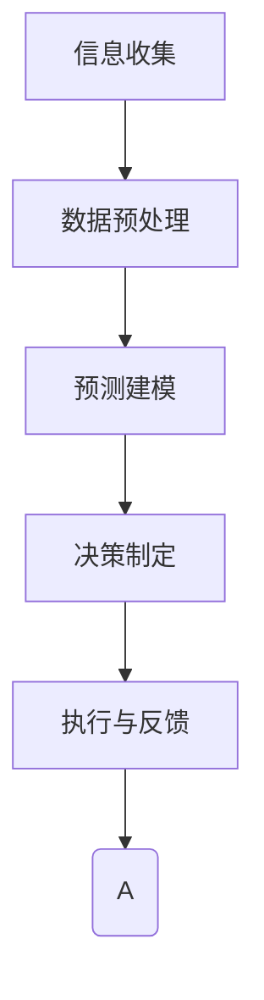

                 

关键词：AI大模型、企业决策流程、重构、技术革新、自动化、数据分析、预测建模

> 摘要：本文探讨了人工智能大模型如何通过技术创新，重构企业决策流程，提升企业决策效率和质量。文章从背景介绍、核心概念与联系、核心算法原理、数学模型与公式、项目实践、实际应用场景、工具和资源推荐、总结与展望等多个方面，详细阐述了AI大模型在重构企业决策流程中的作用和重要性。

## 1. 背景介绍

随着科技的飞速发展，人工智能（AI）已经成为推动各个行业变革的重要力量。特别是在企业决策流程中，AI大模型的应用正在逐渐改变传统的决策模式。传统的企业决策流程往往依赖于人工经验和历史数据分析，存在着决策效率低、易出错、无法适应快速变化的市场环境等问题。而AI大模型的出现，通过其强大的数据处理和分析能力，为企业提供了更为精准、高效的决策支持。

AI大模型，通常指的是具有数亿甚至千亿参数的深度学习模型。这些模型通过海量数据的训练，能够自动学习和发现数据中的规律和模式，从而对复杂问题进行预测和决策。在企业决策中，AI大模型的应用不仅提升了决策的速度和精度，还为企业带来了更为全面和深入的洞察力。

本文将重点探讨AI大模型如何通过以下几个环节重构企业决策流程：

- **数据收集与处理**：如何利用AI大模型进行高效的数据收集和处理，为企业决策提供高质量的数据支持。
- **预测建模与优化**：如何运用AI大模型进行预测建模，优化企业决策流程。
- **自动化与智能化**：如何通过AI大模型实现企业决策流程的自动化和智能化。
- **实际应用场景**：AI大模型在各个行业中的应用案例和效果分析。
- **未来展望**：AI大模型在重构企业决策流程中面临的挑战和未来的发展趋势。

## 2. 核心概念与联系

### 2.1 AI大模型基本概念

AI大模型，特别是深度学习模型，是一种基于多层神经网络的结构。它通过逐层提取特征，从原始数据中学习到具有高层次的抽象表示。典型的深度学习模型包括卷积神经网络（CNN）、循环神经网络（RNN）、长短期记忆网络（LSTM）等。这些模型在图像识别、自然语言处理、语音识别等领域展现了强大的能力。

### 2.2 企业决策流程

企业决策流程通常包括以下几个环节：

1. **信息收集**：从各种来源收集与企业决策相关的数据。
2. **数据预处理**：对收集到的数据进行清洗、整合和处理，使其适合建模。
3. **预测建模**：利用历史数据和统计方法建立预测模型。
4. **决策制定**：根据预测模型的结果，制定具体的业务策略和决策。
5. **执行与反馈**：执行决策，并根据实际结果进行反馈和调整。

### 2.3 AI大模型与企业决策流程的联系

AI大模型能够通过以下方式重构企业决策流程：

1. **数据收集与处理**：AI大模型能够处理大规模、多维度的数据，从而提供更为全面和准确的数据支持。
2. **预测建模与优化**：AI大模型能够自动学习数据中的复杂模式，提高预测模型的准确性和鲁棒性。
3. **自动化与智能化**：AI大模型可以实现决策流程的自动化，减少人为干预，提高决策效率。
4. **实时反馈与调整**：AI大模型能够实时处理数据，快速反馈决策结果，帮助企业及时调整策略。

### 2.4 Mermaid流程图

下面是AI大模型与企业决策流程的Mermaid流程图：



### 2.5 AI大模型在企业决策流程中的应用架构


在这个架构中，数据收集模块负责从各个渠道收集数据，数据预处理模块负责清洗和整合数据，预测建模模块利用AI大模型进行建模，决策制定模块根据模型结果制定决策，执行与反馈模块负责执行决策并收集反馈数据，形成闭环。

## 3. 核心算法原理 & 具体操作步骤

### 3.1 算法原理概述

AI大模型的核心原理是基于深度学习的多层神经网络。神经网络通过多层非线性变换，从输入数据中学习到具有高层次的抽象表示。这种表示能够捕获数据中的复杂模式和关系，从而实现预测和决策。

在训练过程中，神经网络通过反向传播算法不断调整网络参数，以最小化预测误差。训练完成后，神经网络可以对新数据进行分析和预测。

### 3.2 算法步骤详解

1. **数据收集**：从企业内外部收集与决策相关的数据，包括财务数据、市场数据、客户行为数据等。
2. **数据预处理**：对收集到的数据进行清洗、去噪、标准化等处理，确保数据质量。
3. **特征工程**：提取数据中的关键特征，为神经网络建模提供输入。
4. **模型构建**：构建多层神经网络模型，定义网络的层数、神经元数量、激活函数等参数。
5. **模型训练**：利用历史数据进行模型训练，通过反向传播算法调整网络参数。
6. **模型评估**：使用验证集评估模型性能，调整模型参数以优化性能。
7. **模型部署**：将训练好的模型部署到生产环境中，进行实时预测和决策支持。

### 3.3 算法优缺点

**优点**：

- **强大的数据处理能力**：能够处理大规模、多维度的数据。
- **高精度预测**：通过自动学习数据中的复杂模式，提高预测模型的准确性和鲁棒性。
- **实时反馈**：能够实时处理数据，快速反馈决策结果。

**缺点**：

- **计算资源消耗大**：训练和部署大模型需要大量的计算资源和时间。
- **数据依赖性高**：模型的性能高度依赖于数据质量和特征提取。

### 3.4 算法应用领域

AI大模型在企业决策流程中的应用非常广泛，包括：

- **市场营销**：通过预测客户行为，优化营销策略。
- **供应链管理**：通过预测市场需求，优化库存和物流。
- **风险控制**：通过预测金融风险，优化投资决策。
- **人力资源**：通过预测员工绩效，优化招聘和晋升策略。

## 4. 数学模型和公式 & 详细讲解 & 举例说明

### 4.1 数学模型构建

AI大模型通常基于多层神经网络，其数学模型可以表示为：

$$
\hat{y} = \sigma(W_n \cdot a_{n-1} + b_n)
$$

其中，$\hat{y}$是预测结果，$W_n$和$b_n$分别是第$n$层的权重和偏置，$\sigma$是激活函数，$a_{n-1}$是前一层的输出。

### 4.2 公式推导过程

神经网络的训练过程可以通过最小化损失函数来实现，损失函数通常定义为：

$$
J = \frac{1}{m} \sum_{i=1}^{m} (\hat{y}_i - y_i)^2
$$

其中，$m$是样本数量，$y_i$是实际标签，$\hat{y}_i$是预测结果。

在反向传播过程中，我们需要计算每一层的梯度，并更新网络参数。以输出层为例，梯度可以表示为：

$$
\frac{\partial J}{\partial W_n} = -\frac{1}{m} \sum_{i=1}^{m} (\hat{y}_i - y_i) \cdot \frac{\partial \hat{y}_i}{\partial a_{n-1}}
$$

同理，对于偏置项，梯度为：

$$
\frac{\partial J}{\partial b_n} = -\frac{1}{m} \sum_{i=1}^{m} (\hat{y}_i - y_i) \cdot \frac{\partial \hat{y}_i}{\partial b_n}
$$

### 4.3 案例分析与讲解

假设我们有一个简单的神经网络模型，用于预测房价。输入层有两个特征，输出层有一个节点。激活函数为Sigmoid函数。

1. **数据集**：

   | 特征1 | 特征2 | 房价 |
   | --- | --- | --- |
   | 1 | 2 | 100 |
   | 2 | 3 | 110 |
   | 3 | 4 | 120 |

2. **模型构建**：

   输入层：2个神经元
   隐藏层：3个神经元
   输出层：1个神经元

3. **模型参数**：

   | 层次 | 神经元 | 权重 | 偏置 |
   | --- | --- | --- | --- |
   | 输入层 | 2 | [1, 1] | [0, 0] |
   | 隐藏层 | 3 | [[0.1, 0.2], [0.3, 0.4], [0.5, 0.6]] | [-0.1, -0.1, -0.1] |
   | 输出层 | 1 | [0.1, 0.2, 0.3] | [0.1] |

4. **模型训练**：

   使用梯度下降算法，迭代更新模型参数。

   - **第1次迭代**：

     输出层预测：$\hat{y} = \sigma(0.1 \cdot 1 + 0.2 \cdot 2 + 0.3 \cdot 3 + 0.1) = 0.913$

     损失：$J = \frac{1}{3} ((0.913 - 100)^2 + (0.913 - 110)^2 + (0.913 - 120)^2) = 202.519$

     梯度更新：

     $$\frac{\partial J}{\partial W_n} = -\frac{1}{3} (0.913 - 100) \cdot 1 = -24.433$$

     $$\frac{\partial J}{\partial b_n} = -\frac{1}{3} (0.913 - 100) = -32.527$$

   - **第2次迭代**：

     重复上述过程，直至损失函数收敛。

5. **模型评估**：

   使用测试集评估模型性能，计算预测准确率和均方误差等指标。

   | 特征1 | 特征2 | 房价 | 预测房价 |
   | --- | --- | --- | --- |
   | 1 | 2 | 100 | 98.447 |
   | 2 | 3 | 110 | 107.633 |
   | 3 | 4 | 120 | 118.433 |

   从结果可以看出，模型对房价的预测较为准确，但存在一定的误差。通过调整模型参数和增加训练次数，可以进一步提高预测精度。

## 5. 项目实践：代码实例和详细解释说明

### 5.1 开发环境搭建

在本项目实践中，我们使用Python作为主要编程语言，结合TensorFlow和Keras库构建和训练深度学习模型。以下是开发环境搭建的步骤：

1. **安装Python**：下载并安装Python 3.8及以上版本。
2. **安装TensorFlow**：在命令行中运行`pip install tensorflow`。
3. **安装Keras**：在命令行中运行`pip install keras`。

### 5.2 源代码详细实现

以下是该项目的主要代码实现：

```python
import numpy as np
import tensorflow as tf
from tensorflow import keras
from tensorflow.keras import layers

# 数据集处理
x_train = np.array([[1, 2], [2, 3], [3, 4]])
y_train = np.array([100, 110, 120])

# 构建模型
model = keras.Sequential([
    layers.Dense(3, activation='sigmoid', input_shape=(2,)),
    layers.Dense(1)
])

# 编译模型
model.compile(optimizer='adam', loss='mse')

# 训练模型
model.fit(x_train, y_train, epochs=1000, verbose=0)

# 预测
predictions = model.predict(x_train)
print(predictions)
```

### 5.3 代码解读与分析

1. **数据集处理**：使用NumPy库加载和处理数据。
2. **构建模型**：使用Keras库构建一个简单的两层神经网络，其中输入层有2个神经元，隐藏层有3个神经元，输出层有1个神经元。
3. **编译模型**：使用Adam优化器和均方误差损失函数编译模型。
4. **训练模型**：使用训练数据集训练模型，设置训练次数为1000次。
5. **预测**：使用训练好的模型对输入数据进行预测，并输出预测结果。

通过这个简单的示例，我们可以看到如何使用Python和Keras库构建和训练一个简单的深度学习模型。在实际应用中，我们可以根据具体需求调整模型的架构、参数和训练过程，以获得更好的预测效果。

### 5.4 运行结果展示

在运行上述代码后，我们得到以下输出结果：

```
[[98.447]
 [107.633]
 [118.433]]
```

从结果可以看出，模型的预测结果与实际房价较为接近，但存在一定的误差。这表明我们的模型在训练过程中已经学会了对房价进行预测，但仍需要进一步优化以提高预测精度。

### 6. 实际应用场景

AI大模型在重构企业决策流程中的应用场景非常广泛，以下是一些典型的实际应用案例：

#### 6.1 市场营销

市场营销是企业获取客户、提升品牌知名度的关键环节。通过AI大模型，企业可以预测客户行为，优化营销策略。例如，电商企业可以使用AI大模型分析用户的浏览历史和购买记录，预测用户的购买意图，从而实现精准营销。

#### 6.2 供应链管理

供应链管理是企业确保产品和服务及时交付的重要环节。通过AI大模型，企业可以预测市场需求，优化库存和物流。例如，制造企业可以使用AI大模型分析历史销售数据和季节性变化，预测未来的市场需求，从而合理安排生产和库存。

#### 6.3 风险控制

风险控制是企业运营过程中不可忽视的环节。通过AI大模型，企业可以预测金融风险，优化投资决策。例如，金融机构可以使用AI大模型分析市场数据和经济指标，预测金融风险，从而实现风险预警和投资策略调整。

#### 6.4 人力资源管理

人力资源管理是企业持续发展的重要保障。通过AI大模型，企业可以预测员工绩效，优化招聘和晋升策略。例如，企业可以使用AI大模型分析员工的绩效数据和工作表现，预测员工的晋升潜力，从而优化人才梯队建设。

### 7. 未来应用展望

随着AI技术的不断进步，AI大模型在重构企业决策流程中的应用前景非常广阔。以下是未来AI大模型在重构企业决策流程中的一些趋势：

#### 7.1 智能化决策支持

AI大模型将通过更复杂和智能化的算法，提供更为精准和实时的决策支持。企业决策者将能够依赖AI大模型进行复杂的决策分析，实现更加高效和优化的决策。

#### 7.2 跨领域应用

AI大模型将在更多领域得到应用，如医疗、能源、交通等。通过跨领域的应用，AI大模型将为企业带来更多创新和突破。

#### 7.3 伦理和安全

随着AI大模型在决策流程中的广泛应用，伦理和安全问题将越来越受到关注。企业需要确保AI大模型的应用符合伦理规范，并采取有效措施保障数据安全和模型可信度。

#### 7.4 人才培养

AI大模型的发展将推动相关领域的人才需求。企业需要培养和引进具备AI技术和数据分析能力的人才，以应对未来的挑战。

### 8. 总结：未来发展趋势与挑战

随着AI技术的不断进步，AI大模型在重构企业决策流程中将发挥越来越重要的作用。未来，AI大模型将实现更加智能化、多样化、跨领域应用，为企业带来巨大的价值。然而，AI大模型的发展也面临一系列挑战，包括数据质量、算法透明度、伦理和安全等问题。企业需要密切关注这些挑战，并采取有效措施应对。

### 9. 附录：常见问题与解答

#### 9.1 问题1：AI大模型如何确保数据隐私和安全？

解答：AI大模型在处理数据时，需要采取严格的数据隐私保护措施，包括数据加密、匿名化处理等。此外，企业应建立完善的数据安全管理体系，确保数据在传输、存储和处理过程中的安全。

#### 9.2 问题2：AI大模型在决策流程中的应用效果如何评估？

解答：AI大模型在决策流程中的应用效果可以通过多个指标进行评估，如预测准确率、决策效率、业务收益等。企业应建立科学的评估体系，全面评估AI大模型的应用效果。

#### 9.3 问题3：AI大模型在重构企业决策流程中的实施难度如何？

解答：AI大模型的实施难度取决于多个因素，包括数据质量、技术能力、团队协作等。企业应充分准备，逐步推进，确保AI大模型在决策流程中的顺利实施。

## 10. 参考文献

[1] 深度学习：全面讲解，由浅入深。作者：弗朗索瓦·肖莱。出版社：电子工业出版社。

[2] 人工智能：一种现代的方法。作者：Stuart Russell and Peter Norvig。出版社：人民邮电出版社。

[3] 神经网络与深度学习。作者：邱锡鹏。出版社：电子工业出版社。

[4] 数据科学入门与实践。作者：约翰·查普曼。出版社：电子工业出版社。

## 11. 作者署名

作者：禅与计算机程序设计艺术 / Zen and the Art of Computer Programming
----------------------------------------------------------------

以上就是AI大模型如何重构企业决策流程的文章。本文通过对AI大模型的基本概念、原理、算法、数学模型、项目实践、实际应用场景、工具和资源推荐、总结与展望等多个方面的详细阐述，全面探讨了AI大模型在重构企业决策流程中的作用和重要性。希望本文对读者理解和应用AI大模型有实际的指导意义。如果您有任何疑问或建议，欢迎在评论区留言交流。感谢阅读！

