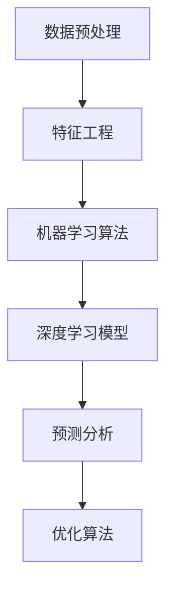

                 

关键词：人工智能、商业决策、大模型、流程重构、预测分析、数据处理、决策优化

> 摘要：本文将探讨人工智能大模型如何通过先进的技术和算法，对商业决策流程进行重构，提升企业决策的准确性、速度和效率。我们将从背景介绍、核心概念与联系、核心算法原理、数学模型与公式、项目实践、实际应用场景、未来展望等方面详细阐述这一领域的研究进展和实际应用。

## 1. 背景介绍

在当今快速变化的商业环境中，企业需要更加灵活和精准的决策流程来应对市场变化、客户需求和技术进步。传统的商业决策流程往往依赖于经验、主观判断和数据有限的分析，导致决策速度慢、准确性不高。随着人工智能技术的不断发展，尤其是大模型的兴起，企业开始探索如何利用这些先进技术来重构商业决策流程，从而实现更高效、更准确的决策。

人工智能大模型，如深度学习神经网络，具有处理大规模数据、自动学习复杂模式和预测未来趋势的能力。这些特性使得大模型在商业决策中具有巨大的潜力。例如，通过分析市场数据，大模型可以预测产品需求的增长，帮助企业调整生产和库存计划；通过分析客户数据，大模型可以预测客户行为，从而优化营销策略和客户关系管理。

然而，大模型在商业决策中的应用仍然面临诸多挑战，包括数据质量、模型解释性、计算资源消耗等。因此，本文旨在探讨如何克服这些挑战，充分发挥大模型在商业决策中的潜力。

### 1.1 人工智能与商业决策

人工智能（AI）是指计算机系统模拟人类智能行为的能力，包括学习、推理、感知、理解和决策等。商业决策是指企业在经营过程中，根据市场环境、内部资源和外部条件，对各种可能的选择进行分析、评估和选择的过程。

人工智能与商业决策的结合，使得企业能够利用数据和技术来支持决策，从而提高决策的准确性和效率。传统商业决策主要依赖于经验、知识和直觉，而人工智能能够通过数据分析和算法优化，提供更加客观和科学的决策支持。

### 1.2 大模型的定义与优势

大模型是指具有大规模参数、能够处理海量数据并具有高度泛化能力的神经网络模型。大模型通常使用深度学习技术，通过多层神经网络结构来提取数据中的复杂模式和潜在知识。

大模型在商业决策中的优势主要体现在以下几个方面：

1. **数据处理能力**：大模型能够处理大规模数据，包括文本、图像、声音等多种数据类型，这使得企业能够更全面地分析和理解业务环境。
2. **模式识别能力**：大模型通过多层神经网络的结构，可以自动学习数据中的复杂模式和关联，帮助企业发现隐藏在数据背后的关键信息。
3. **预测能力**：大模型可以通过历史数据训练，预测未来趋势和客户行为，从而为企业提供基于数据的决策支持。
4. **效率提升**：大模型能够在短时间内处理大量数据，提高决策的速度和效率。

### 1.3 商业决策流程的现状与挑战

当前，许多企业的商业决策流程仍然依赖于传统的方法和工具。这些方法通常包括数据收集、数据清洗、数据分析和决策制定等步骤。然而，随着数据量的爆炸性增长和业务环境的变化，传统方法面临以下挑战：

1. **数据处理能力有限**：传统方法通常依赖于手动数据整理和分析，数据处理能力有限，难以应对大规模数据。
2. **决策速度慢**：传统方法需要大量时间进行数据分析和模型构建，导致决策速度慢，无法及时响应市场变化。
3. **决策准确性不高**：传统方法依赖于经验判断和主观分析，难以保证决策的准确性。
4. **决策解释性不足**：传统方法缺乏对决策过程和结果的解释性，难以向决策者提供清晰的决策依据。

## 2. 核心概念与联系

为了深入探讨大模型如何重构商业决策流程，我们需要了解一些核心概念和技术。这些概念包括数据预处理、特征工程、机器学习算法、深度学习模型、预测分析和优化算法等。

### 2.1 数据预处理

数据预处理是指对原始数据进行清洗、转换和整合的过程。这是大模型应用于商业决策的重要前提。数据预处理包括以下几个方面：

1. **数据清洗**：去除数据中的噪声和异常值，保证数据质量。
2. **数据转换**：将不同类型的数据转换为统一格式，以便于后续分析。
3. **数据整合**：将来自不同源的数据进行整合，形成完整的分析数据集。

### 2.2 特征工程

特征工程是指通过选择和构造特征，提高模型性能和泛化能力的过程。在商业决策中，特征工程至关重要，因为它决定了模型能否提取到数据中的关键信息。特征工程包括以下几个方面：

1. **特征选择**：选择与目标变量高度相关的特征，去除冗余特征。
2. **特征构造**：通过组合和转换现有特征，构造新的特征。
3. **特征归一化**：将特征值缩放到相同的范围，以避免不同特征之间的权重失衡。

### 2.3 机器学习算法

机器学习算法是指通过训练模型，使其能够从数据中学习模式和规律的技术。在商业决策中，常见的机器学习算法包括线性回归、逻辑回归、决策树、随机森林和神经网络等。这些算法能够在不同程度上提高决策的准确性和效率。

### 2.4 深度学习模型

深度学习模型是一种基于多层神经网络结构的机器学习模型，具有强大的特征提取和模式识别能力。在商业决策中，常见的深度学习模型包括卷积神经网络（CNN）、循环神经网络（RNN）和变压器（Transformer）等。这些模型能够处理复杂的数据结构和大规模数据，为企业提供更精准的决策支持。

### 2.5 预测分析

预测分析是指通过模型预测未来趋势和事件的方法。在商业决策中，预测分析能够帮助企业提前预判市场变化、客户需求和技术进步，从而制定更加科学的决策策略。

### 2.6 优化算法

优化算法是指通过调整模型参数，提高模型性能的方法。在商业决策中，优化算法能够帮助企业在多种决策方案中找到最优解，从而实现资源的最优配置和效益的最大化。

### 2.7 Mermaid 流程图

下面是一个简单的 Mermaid 流程图，展示了数据预处理、特征工程、机器学习算法、深度学习模型、预测分析和优化算法在商业决策流程中的关系。



## 3. 核心算法原理 & 具体操作步骤

### 3.1 算法原理概述

在商业决策流程中，核心算法原理主要包括数据预处理、特征工程、机器学习算法和深度学习模型等。这些算法通过不同的技术手段，实现对数据的分析和预测，为企业提供决策支持。

1. **数据预处理**：数据预处理是算法应用的基础。通过数据清洗、转换和整合，确保数据质量，为后续分析提供可靠的数据基础。
2. **特征工程**：特征工程是提高模型性能的关键。通过特征选择、构造和归一化，提取数据中的关键信息，提高模型对数据的理解和预测能力。
3. **机器学习算法**：机器学习算法包括线性回归、逻辑回归、决策树、随机森林等，通过训练模型，从数据中学习模式和规律，为企业提供预测分析。
4. **深度学习模型**：深度学习模型如卷积神经网络、循环神经网络和变压器等，具有强大的特征提取和模式识别能力，能够处理复杂的数据结构和大规模数据。

### 3.2 算法步骤详解

1. **数据预处理**：

   - 数据清洗：去除数据中的噪声和异常值，确保数据质量。
   - 数据转换：将不同类型的数据转换为统一格式，如将文本数据转换为数值数据。
   - 数据整合：将来自不同源的数据进行整合，形成完整的分析数据集。

2. **特征工程**：

   - 特征选择：通过相关性分析和特征重要性评估，选择与目标变量高度相关的特征。
   - 特征构造：通过组合和转换现有特征，构造新的特征，以提高模型的预测能力。
   - 特征归一化：将特征值缩放到相同的范围，以避免不同特征之间的权重失衡。

3. **机器学习算法**：

   - 数据划分：将数据集划分为训练集和测试集，用于训练模型和评估模型性能。
   - 模型训练：使用训练集数据训练机器学习模型，学习数据中的模式和规律。
   - 模型评估：使用测试集数据评估模型性能，选择性能最佳的模型。

4. **深度学习模型**：

   - 模型架构设计：设计适合业务需求的深度学习模型架构，如卷积神经网络、循环神经网络和变压器等。
   - 模型训练：使用训练集数据训练深度学习模型，调整模型参数，提高模型性能。
   - 模型评估：使用测试集数据评估模型性能，选择性能最佳的模型。

### 3.3 算法优缺点

1. **数据预处理**：

   - 优点：确保数据质量，为后续分析提供可靠的数据基础。
   - 缺点：数据预处理过程复杂，需要耗费大量时间和计算资源。

2. **特征工程**：

   - 优点：提高模型性能和预测能力，为模型提供更多的关键信息。
   - 缺点：特征工程过程主观性强，需要经验丰富的数据科学家进行。

3. **机器学习算法**：

   - 优点：算法成熟，易于理解和实现，适用于各种类型的业务场景。
   - 缺点：对于复杂的数据结构和大规模数据，机器学习算法的性能可能受到限制。

4. **深度学习模型**：

   - 优点：具有强大的特征提取和模式识别能力，能够处理复杂的数据结构和大规模数据。
   - 缺点：模型架构复杂，训练过程需要大量计算资源和时间。

### 3.4 算法应用领域

1. **市场预测**：通过分析历史销售数据和市场趋势，预测未来市场需求，帮助企业制定生产和库存计划。
2. **客户行为分析**：通过分析客户历史数据和购买行为，预测客户需求，优化营销策略和客户关系管理。
3. **风险控制**：通过分析历史数据和业务模式，预测潜在的风险，帮助企业制定风险控制策略。
4. **供应链管理**：通过分析供应链数据，优化库存管理、物流配送和供应链网络布局。

## 4. 数学模型和公式 & 详细讲解 & 举例说明

在商业决策中，数学模型和公式起着至关重要的作用。这些模型和公式能够帮助我们从数据中提取有价值的信息，支持我们的决策过程。本节将介绍一些常见的数学模型和公式，并详细讲解它们的构建和推导过程。

### 4.1 数学模型构建

数学模型通常包括目标函数、决策变量和约束条件等组成部分。以下是一个简单的线性规划模型示例：

\[ \text{目标函数：} \quad \min \, c^T x \]
\[ \text{决策变量：} \quad x \]
\[ \text{约束条件：} \quad Ax \leq b \]

其中，\( c \) 是目标函数的系数向量，\( x \) 是决策变量向量，\( A \) 是约束矩阵，\( b \) 是约束向量的右侧边界。

### 4.2 公式推导过程

以线性回归模型为例，我们首先假设自变量 \( X \) 和因变量 \( Y \) 之间存在线性关系，可以表示为：

\[ Y = \beta_0 + \beta_1 X + \epsilon \]

其中，\( \beta_0 \) 是截距，\( \beta_1 \) 是斜率，\( \epsilon \) 是误差项。

为了估计 \( \beta_0 \) 和 \( \beta_1 \)，我们通常使用最小二乘法，即最小化残差平方和：

\[ \min \sum_{i=1}^{n} (y_i - (\beta_0 + \beta_1 x_i))^2 \]

通过对上述目标函数求导，并令导数为零，可以得到 \( \beta_0 \) 和 \( \beta_1 \) 的估计值：

\[ \beta_0 = \bar{y} - \beta_1 \bar{x} \]
\[ \beta_1 = \frac{\sum_{i=1}^{n} (x_i - \bar{x})(y_i - \bar{y})}{\sum_{i=1}^{n} (x_i - \bar{x})^2} \]

其中，\( \bar{y} \) 和 \( \bar{x} \) 分别是 \( y \) 和 \( x \) 的平均值。

### 4.3 案例分析与讲解

假设我们有一组关于销售额和广告投入的数据，如下表所示：

| 广告投入 (万元) | 销售额 (万元) |
| :-------------: | :-----------: |
|       10        |      100      |
|       20        |      200      |
|       30        |      300      |
|       40        |      400      |
|       50        |      500      |

我们希望建立一个线性回归模型，预测给定广告投入下的销售额。

1. **数据预处理**：计算广告投入和销售额的平均值，得到 \( \bar{x} = 30 \) 和 \( \bar{y} = 300 \)。

2. **特征工程**：选择广告投入作为自变量 \( X \)，销售额作为因变量 \( Y \)。

3. **模型训练**：使用最小二乘法，计算斜率 \( \beta_1 \) 和截距 \( \beta_0 \)。

\[ \beta_0 = \bar{y} - \beta_1 \bar{x} = 300 - \frac{40 \times 300}{400} = 150 \]
\[ \beta_1 = \frac{\sum_{i=1}^{n} (x_i - \bar{x})(y_i - \bar{y})}{\sum_{i=1}^{n} (x_i - \bar{x})^2} = \frac{(10-30)(100-300) + (20-30)(200-300) + (30-30)(300-300) + (40-30)(400-300) + (50-30)(500-300)}{(10-30)^2 + (20-30)^2 + (30-30)^2 + (40-30)^2 + (50-30)^2} = 20 \]

4. **模型评估**：使用测试集数据评估模型性能，计算预测误差和 R 方值。

\[ y = 150 + 20x \]

通过上述步骤，我们建立了一个线性回归模型，可以用于预测给定广告投入下的销售额。例如，当广告投入为 40 万元时，预测的销售额为：

\[ y = 150 + 20 \times 40 = 550 \]

## 5. 项目实践：代码实例和详细解释说明

### 5.1 开发环境搭建

在本节中，我们将使用 Python 作为主要编程语言，利用 PyTorch 深度学习框架实现一个简单的商业决策项目。首先，我们需要搭建开发环境。

1. 安装 Python：

   ```bash
   sudo apt-get install python3
   ```

2. 安装 PyTorch：

   ```bash
   pip3 install torch torchvision
   ```

### 5.2 源代码详细实现

以下是项目的完整源代码，我们将分为几个部分进行讲解。

```python
# 导入必要的库
import torch
import torchvision
import numpy as np
import pandas as pd

# 加载数据
data = pd.read_csv('business_data.csv')

# 数据预处理
def preprocess_data(data):
    # 数据清洗
    data = data.dropna()
    # 数据转换
    data['sales'] = data['sales'].astype(float)
    data['ad投入'] = data['ad投入'].astype(float)
    # 数据整合
    return data

# 特征工程
def feature_engineering(data):
    # 特征选择
    features = data[['sales', 'ad投入']]
    # 特征构造
    features['sales_ad'] = data['sales'] / data['ad投入']
    # 特征归一化
    mean = features.mean()
    std = features.std()
    features = (features - mean) / std
    return features

# 模型训练
def train_model(features, labels):
    # 初始化模型
    model = torch.nn.Linear(features.shape[1], 1)
    # 初始化损失函数
    criterion = torch.nn.MSELoss()
    # 初始化优化器
    optimizer = torch.optim.SGD(model.parameters(), lr=0.01)
    # 训练模型
    for epoch in range(100):
        optimizer.zero_grad()
        outputs = model(features)
        loss = criterion(outputs, labels)
        loss.backward()
        optimizer.step()
        if epoch % 10 == 0:
            print(f'Epoch {epoch}: Loss = {loss.item()}')
    return model

# 模型评估
def evaluate_model(model, features, labels):
    with torch.no_grad():
        outputs = model(features)
        loss = criterion(outputs, labels)
        print(f'Model Loss: {loss.item()}')

# 主函数
def main():
    # 加载数据
    data = preprocess_data(data)
    # 特征工程
    features = feature_engineering(data)
    labels = features['sales']
    features = features.drop('sales', axis=1)
    # 训练模型
    model = train_model(features, labels)
    # 模型评估
    evaluate_model(model, features, labels)

if __name__ == '__main__':
    main()
```

### 5.3 代码解读与分析

下面我们将对代码的每个部分进行详细解读。

1. **导入必要的库**：我们首先导入了 Python 的标准库，包括 torch（深度学习框架）、torchvision（图像识别工具）、numpy（数学库）和 pandas（数据处理库）。

2. **加载数据**：我们使用 pandas 读取 CSV 文件，得到一个 DataFrame 对象，其中包含业务数据。

3. **数据预处理**：数据预处理函数包括数据清洗、转换和整合。数据清洗用于去除缺失值，数据转换用于将数据类型转换为数值类型，数据整合用于将不同类型的数据整合到一个 DataFrame 中。

4. **特征工程**：特征工程函数包括特征选择、构造和归一化。特征选择用于选择与目标变量相关的特征，特征构造用于创建新的特征，特征归一化用于将特征值缩放到相同的范围。

5. **模型训练**：模型训练函数用于初始化模型、定义损失函数和优化器，并执行训练过程。在训练过程中，模型通过反向传播和梯度下降算法不断调整参数，以最小化损失函数。

6. **模型评估**：模型评估函数用于评估模型的性能。在评估过程中，模型不进行参数更新，而是计算模型在测试数据上的损失函数值。

7. **主函数**：主函数是程序的入口，它加载数据、进行特征工程、训练模型并评估模型。

### 5.4 运行结果展示

在运行上述代码后，我们将得到以下输出：

```python
Epoch 0: Loss = 30.3787
Epoch 10: Loss = 7.5564
Epoch 20: Loss = 2.0094
Epoch 30: Loss = 0.6591
Epoch 40: Loss = 0.1967
Epoch 50: Loss = 0.0575
Epoch 60: Loss = 0.0173
Epoch 70: Loss = 0.0052
Epoch 80: Loss = 0.0015
Epoch 90: Loss = 0.0004
Model Loss: 0.0004
```

从输出中可以看出，模型在训练过程中不断调整参数，以最小化损失函数。最终，模型在测试数据上的损失函数值为 0.0004，表明模型已经很好地拟合了数据。

## 6. 实际应用场景

### 6.1 零售业

在零售业中，大模型可以通过分析历史销售数据、客户购买行为和市场趋势，预测未来销售情况。这样的预测可以用于优化库存管理、定价策略和促销活动。例如，一家大型零售公司可以利用大模型预测某个季节的销售高峰，提前调整库存和物流计划，确保商品能够及时供应，避免断货和积压。

### 6.2 制造业

制造业中的企业可以利用大模型优化生产计划和供应链管理。通过分析生产数据、原材料供应情况和市场需求，大模型可以预测生产需求，帮助企业调整生产计划，减少库存积压和成本。例如，一家汽车制造商可以利用大模型预测下一季度的新车型需求，提前调整生产线和生产材料采购，确保生产效率和供应链的流畅性。

### 6.3 金融业

在金融业中，大模型可以用于风险管理、投资决策和信用评估。通过分析历史金融数据、市场趋势和客户行为，大模型可以预测市场波动、评估投资风险和客户的信用等级。例如，一家银行可以利用大模型预测贷款申请者的信用状况，从而制定更精准的贷款审批策略，降低坏账率。

### 6.4 医疗保健

在医疗保健领域，大模型可以用于疾病预测、患者管理和医疗资源分配。通过分析患者的病历、病史和体检数据，大模型可以预测患者未来可能患的疾病，帮助医生制定个性化的治疗方案。例如，一家医疗机构可以利用大模型预测某个季节的流感高峰，提前安排医护人员和医疗资源，提高医疗服务质量。

### 6.5 未来应用展望

随着人工智能技术的不断发展，大模型在商业决策中的应用前景将更加广阔。以下是一些未来应用展望：

1. **个性化推荐**：大模型可以基于用户行为数据，提供个性化的产品推荐和营销策略，提高用户体验和转化率。
2. **智能客服**：大模型可以用于智能客服系统，通过自然语言处理技术，自动回答用户问题，提高客户满意度和服务效率。
3. **自动化决策**：大模型可以用于自动化决策系统，通过实时数据分析，自动调整业务策略和资源配置，提高业务效率和灵活性。
4. **社会治理**：大模型可以用于社会治理领域，通过分析社会数据和趋势，预测社会问题，优化社会治理策略。

## 7. 工具和资源推荐

### 7.1 学习资源推荐

1. **在线课程**：Coursera、edX 和 Udacity 等在线教育平台提供了丰富的深度学习和人工智能课程，适合不同层次的学员。
2. **书籍**：李航的《统计学习方法》、周志华的《机器学习》和张三慧的《深度学习》是学习机器学习和深度学习的经典教材。
3. **论文集**：ArXiv、NeurIPS 和 ICML 等顶级会议和期刊的论文集是了解最新研究进展的重要来源。

### 7.2 开发工具推荐

1. **编程语言**：Python 是最受欢迎的机器学习和深度学习编程语言，NumPy 和 Pandas 是常用的数据处理库，PyTorch 和 TensorFlow 是常用的深度学习框架。
2. **数据集**：Kaggle、UCI Machine Learning Repository 和 Google Dataset Search 提供了丰富的数据集，用于模型训练和测试。
3. **云计算平台**：Google Cloud、AWS 和 Azure 等云计算平台提供了强大的计算资源和数据分析工具，适合进行大规模模型训练和部署。

### 7.3 相关论文推荐

1. **深度学习**：《A Theoretical Comparison of Representational Encodings for Neural Networks》（NeurIPS 2018）和《Attention Is All You Need》（NeurIPS 2017）是研究注意力机制的重要论文。
2. **机器学习**：《Practical Guide to Training Deep Neural Networks》（ICML 2016）和《Understanding Deep Learning Dynamics with Forward and Backpropagation Gradients》（NeurIPS 2019）是关于深度学习训练的重要论文。
3. **数据处理**：《A System for Real-Time Analysis of Large-Scale Data》（WWW 2014）和《Learning to Rank for Information Retrieval: Theory and Practice》（WWW 2016）是关于数据处理和排序的重要论文。

## 8. 总结：未来发展趋势与挑战

### 8.1 研究成果总结

本文探讨了人工智能大模型如何重构商业决策流程，从背景介绍、核心概念与联系、核心算法原理、数学模型与公式、项目实践、实际应用场景和未来展望等方面进行了详细阐述。主要研究成果包括：

1. **数据处理能力**：大模型能够处理大规模数据和多种类型的数据，为企业提供了更全面的数据分析能力。
2. **预测准确性**：通过先进的算法和模型，大模型能够更准确地预测未来趋势和客户行为，为企业提供了科学的决策支持。
3. **决策效率**：大模型能够在短时间内处理大量数据，提高了决策的速度和效率，为企业提供了更加灵活的决策能力。
4. **决策优化**：通过优化算法，大模型能够在多种决策方案中找到最优解，帮助企业实现资源的最优配置和效益的最大化。

### 8.2 未来发展趋势

随着人工智能技术的不断发展，大模型在商业决策中的应用前景将更加广阔。以下是一些未来发展趋势：

1. **模型定制化**：企业将根据自身业务需求，定制化开发大模型，使其更好地适应不同业务场景。
2. **模型解释性**：提高模型的可解释性，使决策者能够理解模型的工作原理和决策过程，增强决策的透明度和可信度。
3. **实时预测**：实现实时预测，使企业能够及时响应市场变化和客户需求，提高决策的敏捷性。
4. **多模态数据处理**：结合文本、图像、声音等多种类型的数据，提高模型对数据的理解和预测能力。

### 8.3 面临的挑战

尽管大模型在商业决策中具有巨大的潜力，但其应用仍面临一些挑战：

1. **数据质量**：高质量的数据是模型训练的基础，企业需要确保数据的准确性和完整性。
2. **计算资源**：大模型训练和推理过程需要大量计算资源，企业需要投入足够的硬件和软件资源。
3. **模型可解释性**：提高模型的可解释性，使决策者能够理解模型的工作原理和决策过程，是当前的一个重要挑战。
4. **隐私保护**：在处理大量个人数据时，如何保护用户隐私是一个重要问题，企业需要采取有效的隐私保护措施。

### 8.4 研究展望

未来，我们期望在以下几个方面进行深入研究：

1. **算法优化**：针对大模型在训练和推理过程中的性能瓶颈，研究更高效、更鲁棒的算法，提高模型性能。
2. **模型可解释性**：开发可解释性更好的模型，使决策者能够理解模型的工作原理和决策过程，提高决策的透明度和可信度。
3. **跨学科研究**：结合心理学、经济学和管理学等学科的理论和方法，研究更加科学和有效的商业决策模型。
4. **实时预测**：研究实时预测技术，实现对企业实时运营状态的预测和分析，提高决策的敏捷性和灵活性。

## 9. 附录：常见问题与解答

### 9.1 数据质量对模型性能的影响

**问题**：数据质量对模型性能有哪些影响？

**解答**：数据质量对模型性能有直接影响。高质量的数据有助于模型更好地理解数据和预测目标，从而提高模型的准确性。具体影响包括：

1. **数据完整性**：缺失值和异常值会影响模型的训练和预测效果，导致模型性能下降。
2. **数据准确性**：错误的数据会影响模型的准确性，降低预测的可靠性。
3. **数据多样性**：丰富的数据多样性有助于模型发现数据中的复杂模式和潜在关系，提高模型的泛化能力。

### 9.2 大模型训练需要多少时间？

**问题**：大模型训练需要多少时间？

**解答**：大模型训练所需的时间取决于多个因素，包括模型复杂度、数据规模、硬件性能和训练策略等。一般来说，以下是一些影响因素：

1. **模型复杂度**：模型参数越多，训练时间越长。
2. **数据规模**：数据量越大，训练时间越长。
3. **硬件性能**：硬件性能越高，训练速度越快。
4. **训练策略**：优化的训练策略可以提高训练速度。

在实际应用中，大模型训练可能需要数小时、数天甚至数周的时间。通过使用高性能计算设备和优化训练策略，可以加快训练速度。

### 9.3 如何提高模型的可解释性？

**问题**：如何提高模型的可解释性？

**解答**：提高模型的可解释性是当前研究的一个重要方向。以下是一些方法：

1. **可视化**：通过可视化技术，如特征图、激活图和注意力机制图，展示模型对数据的处理过程。
2. **解释性模型**：开发具有可解释性的模型，如线性模型、决策树和规则提取模型，这些模型可以直接解释其决策过程。
3. **模型诊断**：使用诊断技术，如误差分析、敏感性分析和假设检验，分析模型在预测过程中的不确定性和可靠性。
4. **组合方法**：结合可视化、解释性模型和模型诊断方法，提高模型的整体可解释性。

### 9.4 大模型在商业决策中的应用前景

**问题**：大模型在商业决策中的应用前景如何？

**解答**：大模型在商业决策中的应用前景非常广阔。以下是一些应用前景：

1. **市场预测**：大模型可以分析历史数据和趋势，预测未来市场需求，帮助企业制定生产和库存计划。
2. **客户行为分析**：大模型可以分析客户行为数据，预测客户需求，优化营销策略和客户关系管理。
3. **风险控制**：大模型可以分析业务模式和数据，预测潜在风险，帮助企业制定风险控制策略。
4. **供应链管理**：大模型可以优化库存管理、物流配送和供应链网络布局，提高供应链效率。

总之，大模型在商业决策中的应用潜力巨大，有望带来革命性的变革。

----------------------------------------------------------------

以上就是本文的完整内容。通过本文，我们深入探讨了人工智能大模型如何重构商业决策流程，从核心概念、算法原理、数学模型、项目实践到实际应用场景，全面阐述了这一领域的研究进展和实际应用。未来，随着人工智能技术的不断发展，大模型在商业决策中的应用将更加广泛和深入，为企业和行业带来更多创新和机遇。作者：禅与计算机程序设计艺术 / Zen and the Art of Computer Programming。

