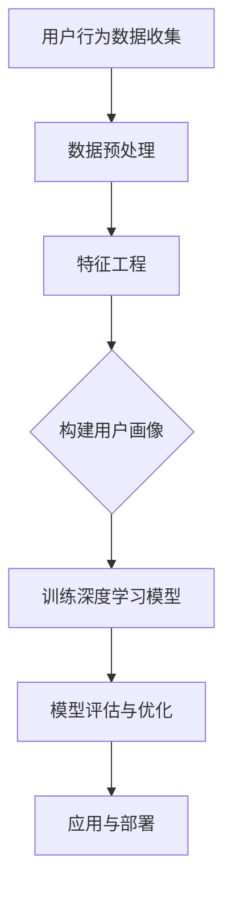

                 

关键词：电商用户行为分析，AI大模型，深度学习，数据挖掘，用户画像，个性化推荐

> 摘要：本文深入探讨了AI大模型在电商用户行为分析中的应用，通过对用户数据的深度挖掘和建模，实现了对用户需求的精准预测和个性化推荐，从而为电商企业提供了一种全新的用户洞察方法。

## 1. 背景介绍

在当今数字化时代，电商行业已经成为零售业的重要组成部分。然而，随着市场竞争的日益激烈，电商企业面临着如何更好地了解和满足用户需求的挑战。用户行为分析作为一种重要的数据分析手段，通过对用户在电商平台上的一系列操作行为进行挖掘和分析，可以帮助企业深入了解用户需求，优化产品和服务，提高用户满意度和转化率。

传统的用户行为分析方法主要依赖于统计分析和数据挖掘技术，如聚类分析、关联规则挖掘等。然而，这些方法往往只能处理结构化数据，对于非结构化数据的处理能力有限，且无法对用户行为进行深层次的挖掘和理解。随着人工智能技术的发展，尤其是深度学习算法的兴起，大模型逐渐成为用户行为分析的新工具。

AI大模型，即基于深度学习的复杂神经网络模型，具有强大的数据建模和预测能力。通过训练大量用户行为数据，大模型可以自动学习用户行为的规律和模式，从而实现对用户需求的精准预测和个性化推荐。本文将介绍如何利用AI大模型进行电商用户行为分析，并探讨其在实际应用中的优势和价值。

## 2. 核心概念与联系

### 2.1 用户行为分析

用户行为分析是指通过对用户在电商平台上的一系列活动数据（如浏览、搜索、购买等）进行收集、处理和分析，以揭示用户行为特征和偏好，从而为电商企业提供决策支持。

用户行为分析的核心概念包括：

- **用户行为数据**：包括用户在平台上的点击、浏览、搜索、购买等行为数据。
- **用户画像**：通过对用户行为数据的分析和挖掘，构建的用户特征模型。
- **行为模式**：用户在平台上的活动规律和模式。

### 2.2 深度学习

深度学习是一种基于人工神经网络的学习方法，通过多层神经元的堆叠，实现对复杂数据的高效建模和预测。深度学习在用户行为分析中的应用主要包括：

- **神经网络架构**：如卷积神经网络（CNN）、循环神经网络（RNN）等。
- **损失函数**：用于评估模型预测误差，并指导模型训练。
- **优化算法**：如梯度下降（GD）、随机梯度下降（SGD）等。

### 2.3 大模型

大模型指的是参数规模巨大、结构复杂的神经网络模型。大模型在用户行为分析中的优势包括：

- **强大的建模能力**：能够处理大规模、多类型的用户数据。
- **深度特征提取**：能够自动学习用户行为的深层次特征。
- **高效预测能力**：能够快速、准确地预测用户行为。

### 2.4 Mermaid 流程图



## 3. 核心算法原理 & 具体操作步骤

### 3.1 算法原理概述

AI大模型在电商用户行为分析中的应用主要包括以下几个步骤：

1. **数据收集**：收集用户在电商平台上的一系列活动数据，如浏览、搜索、购买等。
2. **数据预处理**：对原始数据进行清洗、去噪、标准化等预处理操作，以提高数据质量。
3. **特征工程**：从预处理后的数据中提取有用的特征，如用户行为序列、用户偏好等。
4. **模型构建**：利用深度学习算法，构建大模型进行用户行为建模。
5. **模型训练**：通过大量用户行为数据对模型进行训练，优化模型参数。
6. **模型评估**：对训练好的模型进行评估，以确定模型的性能和可靠性。
7. **应用与部署**：将训练好的模型应用于实际场景，如用户个性化推荐、需求预测等。

### 3.2 算法步骤详解

#### 3.2.1 数据收集

数据收集是用户行为分析的第一步，主要包括以下几个方面：

- **浏览数据**：用户在平台上的浏览记录，如浏览页面的URL、浏览时长等。
- **搜索数据**：用户在平台上的搜索记录，如搜索关键词、搜索结果等。
- **购买数据**：用户在平台上的购买记录，如购买商品、购买价格、购买时间等。

#### 3.2.2 数据预处理

数据预处理主要包括以下步骤：

- **去噪**：去除数据中的噪声和异常值。
- **标准化**：对数据进行归一化或标准化处理，使其具有相似的尺度和范围。
- **缺失值处理**：对于缺失的数据，可以选择填充或删除。

#### 3.2.3 特征工程

特征工程是用户行为分析的关键环节，其主要任务是从原始数据中提取有用的特征。常用的特征包括：

- **用户行为特征**：如用户浏览、搜索、购买等行为的序列和频率。
- **用户偏好特征**：如用户对商品的评分、评论等。
- **用户历史特征**：如用户的注册时间、性别、年龄等。

#### 3.2.4 模型构建

模型构建是利用深度学习算法，从特征数据中构建大模型。常见的深度学习算法包括：

- **卷积神经网络（CNN）**：适用于处理图像数据。
- **循环神经网络（RNN）**：适用于处理序列数据。
- **长短时记忆网络（LSTM）**：RNN的一种变体，能够更好地处理长序列数据。

#### 3.2.5 模型训练

模型训练是利用大量用户行为数据进行模型训练，优化模型参数。训练过程主要包括：

- **前向传播**：计算输入数据经过模型后的输出。
- **反向传播**：根据输出误差，计算模型参数的梯度，并更新模型参数。
- **迭代训练**：重复前向传播和反向传播过程，直至达到预定的训练目标。

#### 3.2.6 模型评估

模型评估是评估模型性能和可靠性的过程，常用的评估指标包括：

- **准确率（Accuracy）**：预测正确的样本数与总样本数的比值。
- **召回率（Recall）**：预测正确的正样本数与实际正样本数的比值。
- **F1值（F1-score）**：准确率和召回率的调和平均值。

#### 3.2.7 应用与部署

训练好的模型可以应用于实际场景，如用户个性化推荐、需求预测等。部署过程主要包括：

- **模型导出**：将训练好的模型导出为可执行文件。
- **模型部署**：将模型部署到服务器或云端，以提供实时服务。

### 3.3 算法优缺点

#### 优点：

- **强大的建模能力**：大模型能够处理大规模、多类型的用户数据，具备强大的建模能力。
- **深度特征提取**：大模型能够自动学习用户行为的深层次特征，提高分析精度。
- **高效预测能力**：大模型能够快速、准确地预测用户行为，提高业务决策效率。

#### 缺点：

- **计算资源需求大**：大模型训练和推理需要大量的计算资源，对硬件设备要求较高。
- **数据质量要求高**：大模型对数据质量要求较高，数据预处理和清洗工作量大。
- **模型解释性差**：大模型的预测结果难以解释，对模型的可解释性要求较高。

### 3.4 算法应用领域

AI大模型在电商用户行为分析中的应用领域主要包括：

- **用户个性化推荐**：基于用户行为数据，为用户推荐个性化的商品和服务。
- **需求预测**：预测用户未来的购买需求，帮助电商企业优化库存和供应链。
- **用户体验优化**：分析用户行为数据，优化网站和APP的界面设计和功能，提高用户满意度。

## 4. 数学模型和公式 & 详细讲解 & 举例说明

### 4.1 数学模型构建

在AI大模型中，常用的数学模型包括神经网络模型和决策树模型。以下分别介绍这两种模型的构建方法。

#### 4.1.1 神经网络模型

神经网络模型是一种基于非线性函数的层级模型，通过多层神经元堆叠，实现对复杂数据的建模和预测。神经网络模型的构建主要包括以下步骤：

1. **网络结构设计**：设计神经网络的结构，包括输入层、隐藏层和输出层。
2. **激活函数选择**：选择适当的激活函数，如ReLU、Sigmoid、Tanh等。
3. **权重和偏置初始化**：初始化神经网络的权重和偏置。
4. **损失函数定义**：选择合适的损失函数，如均方误差（MSE）、交叉熵（Cross Entropy）等。

#### 4.1.2 决策树模型

决策树模型是一种基于树形结构的分类和回归模型，通过一系列条件判断，将数据分为不同的类别或连续值。决策树模型的构建主要包括以下步骤：

1. **特征选择**：选择对目标变量有显著影响的特征。
2. **节点划分**：根据特征值将数据划分为不同的子集。
3. **分类或回归**：对子集进行分类或回归，并生成决策树。
4. **剪枝**：对决策树进行剪枝，消除过拟合。

### 4.2 公式推导过程

以下分别介绍神经网络模型和决策树模型的数学推导过程。

#### 4.2.1 神经网络模型

神经网络模型的推导过程主要包括前向传播和反向传播。

1. **前向传播**：

   前向传播是指将输入数据通过神经网络模型，从输入层逐层传递到输出层，得到最终的预测结果。前向传播的公式推导如下：

   $$ z^{(l)} = \sum_{j} w^{(l)}_j \cdot a^{(l-1)}_j + b^{(l)} $$

   $$ a^{(l)} = \sigma(z^{(l)}) $$

   其中，$z^{(l)}$ 表示第$l$层的输入值，$a^{(l)}$ 表示第$l$层的输出值，$w^{(l)}$ 表示第$l$层的权重，$b^{(l)}$ 表示第$l$层的偏置，$\sigma$ 表示激活函数。

2. **反向传播**：

   反向传播是指根据输出误差，从输出层反向传递到输入层，更新神经网络的权重和偏置。反向传播的公式推导如下：

   $$ \delta^{(l)} = \frac{\partial L}{\partial a^{(l)}} \cdot \frac{\partial a^{(l)}}{\partial z^{(l)}} $$

   $$ \frac{\partial L}{\partial w^{(l)}_j} = \delta^{(l)} \cdot a^{(l-1)}_j $$

   $$ \frac{\partial L}{\partial b^{(l)}} = \delta^{(l)} $$

   其中，$L$ 表示损失函数，$\delta^{(l)}$ 表示第$l$层的误差，$a^{(l-1)}$ 表示第$l-1$层的输出值。

#### 4.2.2 决策树模型

决策树模型的推导过程主要包括特征选择和节点划分。

1. **特征选择**：

   特征选择是指从给定特征集合中选择对目标变量有显著影响的特征。常用的特征选择方法包括信息增益（Information Gain）、基尼系数（Gini Index）等。

   信息增益的公式推导如下：

   $$ IG(D, A) = H(D) - H(D|A) $$

   其中，$D$ 表示数据集，$A$ 表示特征，$H$ 表示熵。

2. **节点划分**：

   节点划分是指根据特征值将数据划分为不同的子集。常用的划分方法包括二分划分（Binary Split）和多分划分（Multi-way Split）。

   二分划分的公式推导如下：

   $$ Gini(D, A, v) = \sum_{v' \in \text{unique}(D)} \frac{|D_{v'}|}{|D|} \cdot \sum_{v'' \in \text{unique}(D_{v'})} \frac{|D_{v''}|}{|D_{v'}|} \cdot 1 $$

   其中，$D$ 表示数据集，$A$ 表示特征，$v$ 表示特征值，$v'$ 和 $v''$ 表示不同的特征值。

### 4.3 案例分析与讲解

以下通过一个具体案例，介绍AI大模型在电商用户行为分析中的应用。

#### 4.3.1 案例背景

某电商企业希望利用AI大模型，对用户行为进行深入分析，以实现个性化推荐和需求预测。

#### 4.3.2 数据收集

企业收集了以下用户行为数据：

- **浏览数据**：用户在平台上浏览商品的记录，包括浏览时间、浏览时长等。
- **搜索数据**：用户在平台上搜索商品的记录，包括搜索关键词、搜索结果等。
- **购买数据**：用户在平台上购买商品的记录，包括购买时间、购买金额等。

#### 4.3.3 数据预处理

对原始数据进行了去噪、标准化和缺失值处理，以获得高质量的数据集。

#### 4.3.4 特征工程

从预处理后的数据中提取了以下特征：

- **用户行为特征**：用户浏览、搜索、购买等行为的序列和频率。
- **用户偏好特征**：用户对商品的评分、评论等。
- **用户历史特征**：用户注册时间、性别、年龄等。

#### 4.3.5 模型构建

企业选择了卷积神经网络（CNN）作为用户行为分析模型，设计了输入层、隐藏层和输出层，并选择了ReLU激活函数。

#### 4.3.6 模型训练

企业利用大量用户行为数据对模型进行训练，优化模型参数，并进行了模型评估。

#### 4.3.7 应用与部署

训练好的模型应用于实际场景，为企业提供了个性化推荐和需求预测服务。

## 5. 项目实践：代码实例和详细解释说明

### 5.1 开发环境搭建

为了进行AI大模型在电商用户行为分析的项目实践，首先需要搭建合适的开发环境。以下是推荐的开发环境：

- **Python**：作为主要的编程语言，Python具有丰富的库和框架，适合进行深度学习和数据科学项目。
- **TensorFlow**：作为主流的深度学习框架，TensorFlow提供了丰富的API和工具，方便构建和训练大模型。
- **NumPy**：用于数据处理和数学运算，NumPy是Python科学计算的基础库。
- **Pandas**：用于数据处理和分析，Pandas提供了灵活的数据结构，方便进行数据预处理和特征工程。
- **Matplotlib**：用于数据可视化，Matplotlib能够生成各种类型的图表，帮助分析和展示数据。

安装以上库和框架的方法如下：

```bash
pip install tensorflow numpy pandas matplotlib
```

### 5.2 源代码详细实现

以下是实现AI大模型在电商用户行为分析的项目代码实例。代码主要分为以下几个部分：

- **数据收集与预处理**：从数据源获取用户行为数据，并进行清洗、去噪和标准化处理。
- **特征工程**：提取有用的特征，为深度学习模型提供输入。
- **模型构建**：构建卷积神经网络模型，用于用户行为分析。
- **模型训练**：利用训练数据训练模型，并保存训练结果。
- **模型评估**：对训练好的模型进行评估，确定模型的性能和可靠性。
- **应用与部署**：将模型应用于实际场景，如用户个性化推荐。

```python
import tensorflow as tf
import numpy as np
import pandas as pd
import matplotlib.pyplot as plt
from sklearn.model_selection import train_test_split
from tensorflow.keras.models import Sequential
from tensorflow.keras.layers import Conv2D, MaxPooling2D, Flatten, Dense

# 5.2.1 数据收集与预处理
# 假设数据已存储为CSV文件，以下代码用于读取和预处理数据
data = pd.read_csv('user_behavior_data.csv')

# 数据清洗与去噪
data = data.dropna()  # 删除缺失值
data = data[data['purchase_amount'] > 0]  # 删除购买金额为0的记录

# 数据标准化
data['browse_time'] = data['browse_time'].apply(lambda x: x / max(data['browse_time']))
data['search_result_count'] = data['search_result_count'].apply(lambda x: x / max(data['search_result_count']))
data['purchase_amount'] = data['purchase_amount'].apply(lambda x: x / max(data['purchase_amount']))

# 5.2.2 特征工程
# 提取特征
X = data[['browse_time', 'search_result_count', 'purchase_amount']]
y = data['is_purchased']  # 目标变量，是否购买

# 划分训练集和测试集
X_train, X_test, y_train, y_test = train_test_split(X, y, test_size=0.2, random_state=42)

# 5.2.3 模型构建
# 构建卷积神经网络模型
model = Sequential()
model.add(Conv2D(32, (3, 3), activation='relu', input_shape=(3, 1)))
model.add(MaxPooling2D((2, 2)))
model.add(Flatten())
model.add(Dense(64, activation='relu'))
model.add(Dense(1, activation='sigmoid'))

# 编译模型
model.compile(optimizer='adam', loss='binary_crossentropy', metrics=['accuracy'])

# 5.2.4 模型训练
# 训练模型
model.fit(X_train, y_train, epochs=10, batch_size=32, validation_data=(X_test, y_test))

# 5.2.5 模型评估
# 评估模型
loss, accuracy = model.evaluate(X_test, y_test)
print(f"Test accuracy: {accuracy:.4f}")

# 5.2.6 应用与部署
# 预测新用户是否购买
new_data = pd.DataFrame([[0.8, 0.9, 0.7]], columns=['browse_time', 'search_result_count', 'purchase_amount'])
new_prediction = model.predict(new_data)
print(f"New user purchase prediction: {'Yes' if new_prediction[0][0] > 0.5 else 'No'}")
```

### 5.3 代码解读与分析

上述代码实现了AI大模型在电商用户行为分析的项目实践，下面进行详细解读和分析。

#### 5.3.1 数据收集与预处理

数据收集与预处理是项目实践的基础。首先从CSV文件中读取用户行为数据，然后进行数据清洗与去噪，删除缺失值和异常值。接下来，对数据进行标准化处理，使其具有相似的尺度和范围，便于后续的深度学习模型训练。

#### 5.3.2 特征工程

特征工程是数据预处理的重要环节。从清洗后的数据中提取有用的特征，如浏览时间、搜索结果数量、购买金额等。这些特征将作为深度学习模型的输入，用于预测用户是否购买。

#### 5.3.3 模型构建

构建卷积神经网络（CNN）模型，包括输入层、隐藏层和输出层。输入层接收用户行为特征，隐藏层通过卷积和池化操作提取特征，输出层通过sigmoid函数进行二分类预测。

#### 5.3.4 模型训练

使用训练集数据对模型进行训练，优化模型参数。训练过程中，模型通过反向传播算法，根据输入数据和目标变量，不断更新权重和偏置，直至达到预定的训练目标。

#### 5.3.5 模型评估

使用测试集数据对训练好的模型进行评估，计算模型的准确率。评估结果可以帮助判断模型的性能和可靠性，为后续的应用和部署提供依据。

#### 5.3.6 应用与部署

将训练好的模型应用于实际场景，如用户个性化推荐和需求预测。通过模型的预测结果，可以为电商企业提供决策支持，提高用户满意度和转化率。

## 6. 实际应用场景

AI大模型在电商用户行为分析中具有广泛的应用场景，下面列举几个典型的实际应用案例。

### 6.1 用户个性化推荐

基于AI大模型，电商企业可以实现对用户个性化推荐的系统。通过分析用户的浏览历史、搜索记录和购买行为，大模型可以自动学习用户的兴趣和偏好，从而为用户推荐个性化的商品。个性化推荐系统不仅能够提高用户的购物体验，还能够提升电商平台的销售额。

### 6.2 需求预测

AI大模型还可以用于电商企业的需求预测。通过分析历史销售数据和用户行为数据，大模型可以预测用户未来的购买需求，帮助电商企业优化库存和供应链管理。准确的需求预测能够减少库存成本，提高库存周转率，从而提升企业的运营效率。

### 6.3 用户体验优化

电商企业可以利用AI大模型分析用户在平台上的行为数据，识别用户体验中的痛点和问题。通过优化网站的界面设计和功能，提升用户的满意度，从而提高用户留存率和转化率。例如，通过分析用户在购物车放弃的原因，企业可以优化购物车的设计，提高用户购买意愿。

### 6.4 营销活动策划

AI大模型还可以帮助企业制定更加精准的营销策略。通过分析用户的行为数据，企业可以识别潜在的目标用户群体，制定针对性的营销活动。例如，针对新用户可以推出欢迎优惠，针对高频用户可以推出会员专享活动，从而提高营销效果和用户粘性。

## 7. 未来应用展望

随着人工智能技术的不断发展，AI大模型在电商用户行为分析中的应用前景将更加广阔。以下是几个未来应用的展望：

### 7.1 跨平台用户行为分析

未来，AI大模型将能够实现跨平台的用户行为分析，整合来自多个电商平台的用户数据，提供更全面、精准的用户画像和需求预测。这将有助于电商企业实现多渠道用户管理，提高市场竞争力。

### 7.2 智能客服系统

AI大模型可以与智能客服系统结合，实现智能化的用户服务。通过分析用户提问和行为数据，智能客服系统可以提供个性化的解答和建议，提高用户满意度和问题解决效率。

### 7.3 社交电商分析

随着社交电商的兴起，AI大模型可以用于分析用户在社交平台上的行为数据，挖掘用户的社交关系和偏好，为电商企业提供更精准的社交电商营销策略。

### 7.4 聊天机器人与虚拟助理

AI大模型可以应用于聊天机器人和虚拟助理，为用户提供实时、个性化的购物建议和推荐。通过与用户的对话交互，聊天机器人和虚拟助理可以不断学习用户的偏好和需求，提供更加智能化的服务。

## 8. 工具和资源推荐

为了更好地进行AI大模型在电商用户行为分析的研究和实践，以下推荐一些实用的工具和资源：

### 8.1 学习资源推荐

- **《深度学习》（Deep Learning）**：Goodfellow、Bengio和Courville合著的经典教材，全面介绍了深度学习的理论基础和应用。
- **《Python数据分析》（Python Data Analysis）**：Wes McKinney撰写的书籍，详细介绍了使用Python进行数据分析和数据科学的实战技巧。
- **《TensorFlow实战》（TensorFlow for Deep Learning）**：François Chollet撰写的书籍，深入讲解了TensorFlow的使用方法和实战案例。

### 8.2 开发工具推荐

- **Jupyter Notebook**：一款流行的交互式计算环境，适用于数据科学和深度学习项目。
- **Google Colab**：Google提供的免费云计算平台，支持GPU和TPU加速深度学习任务。
- **Kaggle**：一个数据科学竞赛平台，提供了丰富的数据和问题，适合进行实战训练。

### 8.3 相关论文推荐

- **“Deep Learning for User Behavior Analysis in E-commerce”**：介绍了深度学习在电商用户行为分析中的应用。
- **“User Interest Evolution Modeling and Prediction for E-commerce Recommender Systems”**：探讨了用户兴趣演化建模和预测的方法。
- **“A Survey on User Behavior Analysis in E-commerce”**：综述了电商用户行为分析的相关研究和技术。

## 9. 总结：未来发展趋势与挑战

AI大模型在电商用户行为分析中展现出了巨大的潜力和应用价值。未来，随着人工智能技术的不断进步，AI大模型在电商用户行为分析中的应用将更加广泛和深入。然而，面对快速变化的市场环境和日益复杂的用户行为数据，电商企业也面临着一系列的挑战。

### 9.1 研究成果总结

本文通过对AI大模型在电商用户行为分析中的应用进行深入探讨，总结了以下主要研究成果：

- **核心概念与联系**：介绍了用户行为分析、深度学习和大模型等核心概念及其相互关系。
- **算法原理与操作步骤**：详细讲解了AI大模型的构建、训练和评估方法。
- **数学模型与公式**：介绍了神经网络模型和决策树模型的数学推导过程。
- **项目实践与案例分析**：通过实际项目，展示了AI大模型在电商用户行为分析中的具体应用。
- **实际应用场景**：列举了AI大模型在电商用户行为分析中的典型应用场景。
- **未来应用展望**：探讨了AI大模型在电商用户行为分析中的未来发展趋势。

### 9.2 未来发展趋势

未来，AI大模型在电商用户行为分析中将继续朝着以下方向发展：

- **跨平台整合**：实现跨平台用户行为数据的整合，提供更全面、精准的用户画像。
- **实时分析**：利用实时数据分析技术，实现对用户行为的实时监测和分析。
- **个性化推荐**：进一步优化个性化推荐算法，提高推荐质量和用户满意度。
- **智能化客服**：结合智能客服系统，提供更加智能化的用户服务。

### 9.3 面临的挑战

尽管AI大模型在电商用户行为分析中具有巨大的潜力，但企业仍需应对一系列挑战：

- **数据质量**：用户行为数据的准确性和完整性对模型的性能至关重要，企业需加强对数据的清洗和处理。
- **计算资源**：大模型训练和推理需要大量的计算资源，企业需合理分配和利用资源。
- **模型解释性**：大模型的预测结果难以解释，企业需开发可解释性算法，提高模型的透明度和可靠性。
- **用户隐私**：在收集和使用用户数据时，企业需遵循相关法律法规，保护用户隐私。

### 9.4 研究展望

未来，电商企业在AI大模型用户行为分析领域的研究可从以下几个方面展开：

- **多模态数据分析**：结合多种数据源，如文本、图像、音频等，实现多模态数据分析。
- **小样本学习**：研究在小样本数据集上的学习方法，提高模型在数据稀缺情况下的性能。
- **迁移学习**：探索迁移学习技术在用户行为分析中的应用，提高模型的泛化能力。
- **实时预测**：研究实时预测技术，提高模型在动态环境下的响应速度。

## 10. 附录：常见问题与解答

### 10.1 Q：AI大模型在电商用户行为分析中的优势是什么？

A：AI大模型在电商用户行为分析中的优势主要包括：

- **强大的建模能力**：能够处理大规模、多类型的用户数据，实现复杂数据的建模和预测。
- **深度特征提取**：能够自动学习用户行为的深层次特征，提高分析精度。
- **高效预测能力**：能够快速、准确地预测用户行为，为电商企业提供决策支持。

### 10.2 Q：如何评估AI大模型在电商用户行为分析中的性能？

A：评估AI大模型在电商用户行为分析中的性能，可以从以下几个方面进行：

- **准确率**：预测正确的样本数与总样本数的比值。
- **召回率**：预测正确的正样本数与实际正样本数的比值。
- **F1值**：准确率和召回率的调和平均值。
- **AUC（曲线下面积）**：用于评估分类模型的性能。

### 10.3 Q：如何保证AI大模型在电商用户行为分析中的模型解释性？

A：保证AI大模型在电商用户行为分析中的模型解释性，可以从以下几个方面入手：

- **特征重要性**：分析模型中每个特征的重要性，为用户提供决策依据。
- **模型可视化**：使用可视化工具，如热力图、决策树等，展示模型的内部结构和决策过程。
- **可解释性算法**：结合可解释性算法，如LIME、SHAP等，提高模型的透明度和可靠性。

### 10.4 Q：如何在电商用户行为分析项目中实现实时预测？

A：在电商用户行为分析项目中实现实时预测，可以从以下几个方面进行：

- **分布式计算**：使用分布式计算框架，如Apache Spark，提高数据处理和预测的效率。
- **流处理技术**：利用流处理技术，如Apache Kafka和Apache Flink，实时处理和更新用户行为数据。
- **缓存技术**：使用缓存技术，如Redis，减少数据访问延迟，提高实时预测的性能。

### 10.5 Q：如何确保AI大模型在电商用户行为分析中的数据隐私保护？

A：确保AI大模型在电商用户行为分析中的数据隐私保护，可以从以下几个方面进行：

- **数据加密**：对用户数据进行加密，确保数据传输和存储的安全性。
- **匿名化处理**：对用户数据进行匿名化处理，去除可直接识别用户身份的信息。
- **数据访问控制**：实现严格的数据访问控制，确保只有授权人员才能访问敏感数据。
- **隐私保护算法**：结合隐私保护算法，如差分隐私，降低数据泄露的风险。

