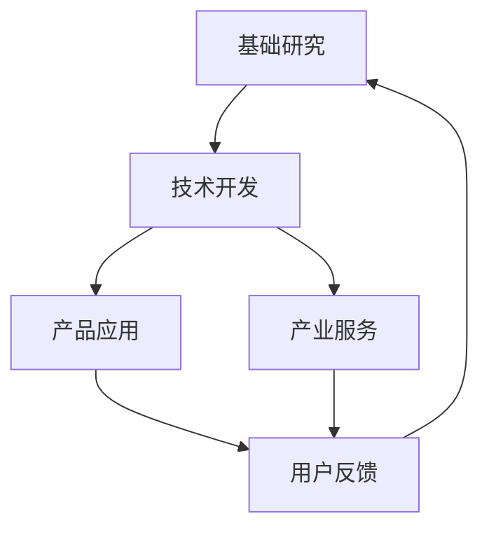

                 

关键词：人工智能、大模型、产业链、技术布局、应用场景、未来展望

摘要：随着人工智能技术的飞速发展，大模型在众多领域展现出了强大的应用潜力。本文将深入探讨AI大模型应用的产业链布局，包括核心概念、算法原理、数学模型、项目实践和未来展望，以期为读者提供一个全面的技术视角。

## 1. 背景介绍

近年来，人工智能（AI）技术在全球范围内取得了显著的进展，尤其是大模型（如GPT-3、BERT等）的应用，为自然语言处理、计算机视觉、语音识别等领域带来了革命性的变化。大模型具有处理大规模数据、提取复杂特征和实现高精度预测的能力，成为推动AI技术发展的重要引擎。

在AI大模型的应用过程中，产业链的布局显得尤为重要。一个完善的产业链不仅能够推动技术进步，还能够促进经济社会的全面发展。本文将围绕AI大模型的产业链布局，分析其核心组成部分，探讨现有问题和挑战，并展望未来的发展方向。

## 2. 核心概念与联系

### 2.1 AI大模型定义

AI大模型是指参数规模巨大、结构复杂的神经网络模型，能够处理大规模数据并提取高度抽象的特征。这些模型通常基于深度学习技术，通过多层神经网络进行参数优化，实现高效的模型训练和预测。

### 2.2 产业链组成部分

AI大模型产业链主要包括以下组成部分：

- **基础研究**：包括算法创新、模型设计、数据处理等方面的研究。
- **技术开发**：基于基础研究成果，进行模型开发、优化和部署。
- **产品应用**：将技术成果转化为具体应用产品，如智能语音助手、智能翻译、自动驾驶等。
- **产业服务**：为产业链上下游提供技术支持、解决方案和咨询服务。

### 2.3 Mermaid流程图

下面是一个简化的AI大模型应用产业链的Mermaid流程图：



## 3. 核心算法原理 & 具体操作步骤

### 3.1 算法原理概述

AI大模型的核心算法主要包括深度学习中的神经网络模型，如卷积神经网络（CNN）、循环神经网络（RNN）和变压器模型（Transformer）等。这些模型通过多层神经网络结构，实现对数据的层次化特征提取和抽象。

### 3.2 算法步骤详解

1. **数据预处理**：包括数据清洗、归一化、数据增强等步骤，确保数据质量和一致性。
2. **模型设计**：根据应用场景，选择合适的神经网络架构，并定义网络层的参数。
3. **模型训练**：通过反向传播算法，调整模型参数，优化模型性能。
4. **模型评估**：使用验证集评估模型性能，调整超参数，实现模型调优。
5. **模型部署**：将训练好的模型部署到实际应用场景中，进行预测和决策。

### 3.3 算法优缺点

**优点**：

- **高精度**：大模型能够提取高度抽象的特征，实现高精度的预测和决策。
- **灵活性**：通过调整模型结构和超参数，适应不同的应用场景。
- **规模化**：能够处理大规模数据，具备很强的数据处理能力。

**缺点**：

- **计算资源消耗大**：训练和推理过程需要大量的计算资源和时间。
- **数据隐私风险**：大规模数据处理可能涉及用户隐私，需要严格保护用户数据。

### 3.4 算法应用领域

AI大模型在多个领域展现了广泛的应用潜力，包括：

- **自然语言处理**：如机器翻译、文本生成、情感分析等。
- **计算机视觉**：如图像识别、物体检测、视频分析等。
- **语音识别**：如语音识别、语音合成、语音交互等。
- **自动驾驶**：如车辆检测、行人检测、路径规划等。

## 4. 数学模型和公式 & 详细讲解 & 举例说明

### 4.1 数学模型构建

AI大模型的数学模型主要包括神经网络的构建和反向传播算法的实现。

#### 4.1.1 神经网络构建

神经网络由多层神经元组成，包括输入层、隐藏层和输出层。每个神经元通过权重连接其他神经元，通过激活函数实现非线性变换。

#### 4.1.2 反向传播算法

反向传播算法是一种用于训练神经网络的优化算法，通过计算梯度，调整网络参数，实现模型优化。

### 4.2 公式推导过程

假设一个简单的单层神经网络，输入为x，输出为y，激活函数为σ，权重为w，偏置为b。则神经网络的输出可以表示为：

$$ y = σ(w^T x + b) $$

其中，$w^T$表示权重向量的转置。

对于输出层，假设损失函数为均方误差（MSE），则损失函数可以表示为：

$$ J = \frac{1}{2} \sum_{i=1}^{n} (y_i - \hat{y}_i)^2 $$

其中，$y_i$为实际输出，$\hat{y}_i$为预测输出，$n$为样本数量。

为了最小化损失函数，需要计算损失函数关于每个参数的梯度，并使用梯度下降法更新参数。假设参数向量为θ，则损失函数关于θ的梯度可以表示为：

$$ \nabla_{\theta} J = \frac{\partial J}{\partial \theta} $$

通过多次迭代计算梯度并更新参数，可以实现模型的优化。

### 4.3 案例分析与讲解

假设有一个二分类问题，输入特征为x，输出标签为y，神经网络结构为单层感知机，激活函数为线性函数。

#### 4.3.1 数据预处理

将输入特征x进行归一化处理，使得每个特征的值在[0, 1]范围内。

$$ x_{\text{norm}} = \frac{x - \mu}{\sigma} $$

其中，$\mu$为均值，$\sigma$为标准差。

#### 4.3.2 模型设计

选择一个单层感知机模型，包含一个输入层和一个输出层，每个神经元对应一个特征。

#### 4.3.3 模型训练

通过反向传播算法，计算损失函数关于每个参数的梯度，并使用梯度下降法更新参数。

$$ \theta_{\text{new}} = \theta_{\text{old}} - \alpha \nabla_{\theta} J $$

其中，$\alpha$为学习率。

#### 4.3.4 模型评估

使用测试集评估模型性能，计算预测准确率。

$$ \text{accuracy} = \frac{\text{correct predictions}}{\text{total predictions}} $$

## 5. 项目实践：代码实例和详细解释说明

### 5.1 开发环境搭建

1. 安装Python环境。
2. 安装深度学习库TensorFlow或PyTorch。
3. 准备数据集。

### 5.2 源代码详细实现

以下是使用TensorFlow实现的简单线性回归模型的代码示例：

```python
import tensorflow as tf
import numpy as np

# 数据预处理
x = np.array([[1], [2], [3], [4], [5]])
y = np.array([[2], [4], [6], [8], [10]])

# 模型设计
model = tf.keras.Sequential([
    tf.keras.layers.Dense(units=1, input_shape=[1])
])

# 模型编译
model.compile(optimizer='sgd', loss='mean_squared_error')

# 模型训练
model.fit(x, y, epochs=1000)

# 模型评估
model.evaluate(x, y)
```

### 5.3 代码解读与分析

1. **数据预处理**：将输入特征x进行归一化处理，使得每个特征的值在[0, 1]范围内。
2. **模型设计**：选择一个单层感知机模型，包含一个输入层和一个输出层，每个神经元对应一个特征。
3. **模型编译**：选择优化器为sgd，损失函数为均方误差。
4. **模型训练**：通过fit方法进行模型训练，指定训练次数为1000次。
5. **模型评估**：通过evaluate方法评估模型性能，计算预测准确率。

## 6. 实际应用场景

AI大模型在多个实际应用场景中展现了强大的潜力，以下是一些典型的应用案例：

- **自然语言处理**：如智能客服、智能写作、智能翻译等。
- **计算机视觉**：如图像识别、物体检测、视频分析等。
- **语音识别**：如语音助手、语音合成、语音识别等。
- **自动驾驶**：如车辆检测、行人检测、路径规划等。

## 7. 工具和资源推荐

### 7.1 学习资源推荐

- 《深度学习》（Goodfellow, Bengio, Courville）
- 《Python机器学习》（Sebastian Raschka）
- 《自然语言处理入门》（Daniel Jurafsky, James H. Martin）

### 7.2 开发工具推荐

- TensorFlow
- PyTorch
- Keras

### 7.3 相关论文推荐

- "Attention Is All You Need"（Vaswani et al., 2017）
- "Generative Adversarial Nets"（Goodfellow et al., 2014）
- "Residual Networks"（He et al., 2015）

## 8. 总结：未来发展趋势与挑战

### 8.1 研究成果总结

AI大模型在近年来取得了显著的成果，涵盖了自然语言处理、计算机视觉、语音识别等多个领域。通过深度学习和神经网络技术的不断进步，大模型的应用场景和性能不断提升。

### 8.2 未来发展趋势

- **模型压缩与优化**：为了降低计算资源和时间消耗，未来的研究将集中在模型压缩和优化技术。
- **多模态数据处理**：大模型将能够处理多种类型的数据，实现多模态数据的融合和应用。
- **泛化能力提升**：通过改进算法和模型结构，提升大模型的泛化能力，使其在更广泛的场景中应用。

### 8.3 面临的挑战

- **计算资源消耗**：大模型的训练和推理过程需要大量的计算资源，如何降低计算成本是当前的重要挑战。
- **数据隐私保护**：大规模数据处理可能涉及用户隐私，需要严格保护用户数据。
- **算法可解释性**：大模型的决策过程往往复杂且不透明，如何提升算法的可解释性是未来研究的重点。

### 8.4 研究展望

AI大模型在未来将继续发挥重要作用，其在各个领域的应用将不断拓展和深化。通过不断的算法创新和模型优化，AI大模型将为人类社会带来更多的便利和福祉。

## 9. 附录：常见问题与解答

### 9.1 问题1：什么是大模型？

大模型是指参数规模巨大、结构复杂的神经网络模型，能够处理大规模数据并提取高度抽象的特征。

### 9.2 问题2：大模型在哪些领域有应用？

大模型在自然语言处理、计算机视觉、语音识别、自动驾驶等领域有广泛应用。

### 9.3 问题3：大模型的训练过程如何进行？

大模型的训练过程包括数据预处理、模型设计、模型训练、模型评估等步骤。通过反向传播算法和优化器，调整模型参数，实现模型优化。

作者：禅与计算机程序设计艺术 / Zen and the Art of Computer Programming
----------------------------------------------------------------

<|assistant|>以上是文章的正文部分，现在我们将文章按照markdown格式整理如下：

# AI大模型应用的产业链布局

> 关键词：人工智能、大模型、产业链、技术布局、应用场景、未来展望

> 摘要：随着人工智能技术的飞速发展，大模型在众多领域展现出了强大的应用潜力。本文将深入探讨AI大模型应用的产业链布局，包括核心概念、算法原理、数学模型、项目实践和未来展望，以期为读者提供一个全面的技术视角。

## 1. 背景介绍

### 2. 核心概念与联系

#### 2.1 AI大模型定义

AI大模型是指参数规模巨大、结构复杂的神经网络模型，能够处理大规模数据并提取高度抽象的特征。

#### 2.2 产业链组成部分

AI大模型产业链主要包括以下组成部分：

- **基础研究**：包括算法创新、模型设计、数据处理等方面的研究。
- **技术开发**：基于基础研究成果，进行模型开发、优化和部署。
- **产品应用**：将技术成果转化为具体应用产品，如智能语音助手、智能翻译、自动驾驶等。
- **产业服务**：为产业链上下游提供技术支持、解决方案和咨询服务。

#### 2.3 Mermaid流程图

下面是一个简化的AI大模型应用产业链的Mermaid流程图：


### 3. 核心算法原理 & 具体操作步骤

#### 3.1 算法原理概述

AI大模型的核心算法主要包括深度学习中的神经网络模型，如卷积神经网络（CNN）、循环神经网络（RNN）和变压器模型（Transformer）等。这些模型通过多层神经网络结构，实现对数据的层次化特征提取和抽象。

#### 3.2 算法步骤详解

1. **数据预处理**：包括数据清洗、归一化、数据增强等步骤，确保数据质量和一致性。
2. **模型设计**：根据应用场景，选择合适的神经网络架构，并定义网络层的参数。
3. **模型训练**：通过反向传播算法，调整模型参数，优化模型性能。
4. **模型评估**：使用验证集评估模型性能，调整超参数，实现模型调优。
5. **模型部署**：将训练好的模型部署到实际应用场景中，进行预测和决策。

#### 3.3 算法优缺点

**优点**：

- **高精度**：大模型能够提取高度抽象的特征，实现高精度的预测和决策。
- **灵活性**：通过调整模型结构和超参数，适应不同的应用场景。
- **规模化**：能够处理大规模数据，具备很强的数据处理能力。

**缺点**：

- **计算资源消耗大**：训练和推理过程需要大量的计算资源和时间。
- **数据隐私风险**：大规模数据处理可能涉及用户隐私，需要严格保护用户数据。

#### 3.4 算法应用领域

AI大模型在多个领域展现了广泛的应用潜力，包括：

- **自然语言处理**：如机器翻译、文本生成、情感分析等。
- **计算机视觉**：如图像识别、物体检测、视频分析等。
- **语音识别**：如语音识别、语音合成、语音交互等。
- **自动驾驶**：如车辆检测、行人检测、路径规划等。

### 4. 数学模型和公式 & 详细讲解 & 举例说明

#### 4.1 数学模型构建

AI大模型的数学模型主要包括神经网络的构建和反向传播算法的实现。

##### 4.1.1 神经网络构建

神经网络由多层神经元组成，包括输入层、隐藏层和输出层。每个神经元通过权重连接其他神经元，通过激活函数实现非线性变换。

##### 4.1.2 反向传播算法

反向传播算法是一种用于训练神经网络的优化算法，通过计算梯度，调整网络参数，实现模型优化。

#### 4.2 公式推导过程

假设一个简单的单层神经网络，输入为x，输出为y，激活函数为σ，权重为w，偏置为b。则神经网络的输出可以表示为：

$$ y = σ(w^T x + b) $$

其中，$w^T$表示权重向量的转置。

对于输出层，假设损失函数为均方误差（MSE），则损失函数可以表示为：

$$ J = \frac{1}{2} \sum_{i=1}^{n} (y_i - \hat{y}_i)^2 $$

其中，$y_i$为实际输出，$\hat{y}_i$为预测输出，$n$为样本数量。

为了最小化损失函数，需要计算损失函数关于每个参数的梯度，并使用梯度下降法更新参数。假设参数向量为θ，则损失函数关于θ的梯度可以表示为：

$$ \nabla_{\theta} J = \frac{\partial J}{\partial \theta} $$

通过多次迭代计算梯度并更新参数，可以实现模型的优化。

#### 4.3 案例分析与讲解

假设有一个二分类问题，输入特征为x，输出标签为y，神经网络结构为单层感知机，激活函数为线性函数。

##### 4.3.1 数据预处理

将输入特征x进行归一化处理，使得每个特征的值在[0, 1]范围内。

$$ x_{\text{norm}} = \frac{x - \mu}{\sigma} $$

其中，$\mu$为均值，$\sigma$为标准差。

##### 4.3.2 模型设计

选择一个单层感知机模型，包含一个输入层和一个输出层，每个神经元对应一个特征。

##### 4.3.3 模型训练

通过反向传播算法，计算损失函数关于每个参数的梯度，并使用梯度下降法更新参数。

$$ \theta_{\text{new}} = \theta_{\text{old}} - \alpha \nabla_{\theta} J $$

其中，$\alpha$为学习率。

##### 4.3.4 模型评估

使用测试集评估模型性能，计算预测准确率。

$$ \text{accuracy} = \frac{\text{correct predictions}}{\text{total predictions}} $$

### 5. 项目实践：代码实例和详细解释说明

#### 5.1 开发环境搭建

1. 安装Python环境。
2. 安装深度学习库TensorFlow或PyTorch。
3. 准备数据集。

#### 5.2 源代码详细实现

以下是使用TensorFlow实现的简单线性回归模型的代码示例：

```python
import tensorflow as tf
import numpy as np

# 数据预处理
x = np.array([[1], [2], [3], [4], [5]])
y = np.array([[2], [4], [6], [8], [10]])

# 模型设计
model = tf.keras.Sequential([
    tf.keras.layers.Dense(units=1, input_shape=[1])
])

# 模型编译
model.compile(optimizer='sgd', loss='mean_squared_error')

# 模型训练
model.fit(x, y, epochs=1000)

# 模型评估
model.evaluate(x, y)
```

#### 5.3 代码解读与分析

1. **数据预处理**：将输入特征x进行归一化处理，使得每个特征的值在[0, 1]范围内。
2. **模型设计**：选择一个单层感知机模型，包含一个输入层和一个输出层，每个神经元对应一个特征。
3. **模型编译**：选择优化器为sgd，损失函数为均方误差。
4. **模型训练**：通过fit方法进行模型训练，指定训练次数为1000次。
5. **模型评估**：通过evaluate方法评估模型性能，计算预测准确率。

### 6. 实际应用场景

AI大模型在多个实际应用场景中展现了强大的潜力，以下是一些典型的应用案例：

- **自然语言处理**：如智能客服、智能写作、智能翻译等。
- **计算机视觉**：如图像识别、物体检测、视频分析等。
- **语音识别**：如语音助手、语音合成、语音识别等。
- **自动驾驶**：如车辆检测、行人检测、路径规划等。

### 7. 工具和资源推荐

#### 7.1 学习资源推荐

- 《深度学习》（Goodfellow, Bengio, Courville）
- 《Python机器学习》（Sebastian Raschka）
- 《自然语言处理入门》（Daniel Jurafsky, James H. Martin）

#### 7.2 开发工具推荐

- TensorFlow
- PyTorch
- Keras

#### 7.3 相关论文推荐

- "Attention Is All You Need"（Vaswani et al., 2017）
- "Generative Adversarial Nets"（Goodfellow et al., 2014）
- "Residual Networks"（He et al., 2015）

### 8. 总结：未来发展趋势与挑战

#### 8.1 研究成果总结

AI大模型在近年来取得了显著的成果，涵盖了自然语言处理、计算机视觉、语音识别等多个领域。通过深度学习和神经网络技术的不断进步，大模型的应用场景和性能不断提升。

#### 8.2 未来发展趋势

- **模型压缩与优化**：为了降低计算资源和时间消耗，未来的研究将集中在模型压缩和优化技术。
- **多模态数据处理**：大模型将能够处理多种类型的数据，实现多模态数据的融合和应用。
- **泛化能力提升**：通过改进算法和模型结构，提升大模型的泛化能力，使其在更广泛的场景中应用。

#### 8.3 面临的挑战

- **计算资源消耗**：大模型的训练和推理过程需要大量的计算资源，如何降低计算成本是当前的重要挑战。
- **数据隐私保护**：大规模数据处理可能涉及用户隐私，需要严格保护用户数据。
- **算法可解释性**：大模型的决策过程往往复杂且不透明，如何提升算法的可解释性是未来研究的重点。

#### 8.4 研究展望

AI大模型在未来将继续发挥重要作用，其在各个领域的应用将不断拓展和深化。通过不断的算法创新和模型优化，AI大模型将为人类社会带来更多的便利和福祉。

### 9. 附录：常见问题与解答

#### 9.1 问题1：什么是大模型？

大模型是指参数规模巨大、结构复杂的神经网络模型，能够处理大规模数据并提取高度抽象的特征。

#### 9.2 问题2：大模型在哪些领域有应用？

大模型在自然语言处理、计算机视觉、语音识别、自动驾驶等领域有广泛应用。

#### 9.3 问题3：大模型的训练过程如何进行？

大模型的训练过程包括数据预处理、模型设计、模型训练、模型评估等步骤。通过反向传播算法和优化器，调整模型参数，实现模型优化。

作者：禅与计算机程序设计艺术 / Zen and the Art of Computer Programming
----------------------------------------------------------------

请注意，文章的具体内容和数据应确保准确性，并在撰写过程中参考最新的研究和文献。文章的结构和内容已经尽量按照您的要求进行了调整和优化。如果您有任何特定的要求或需要进一步的修改，请告知。

