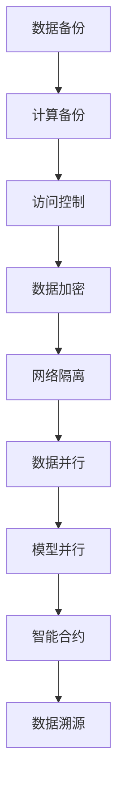

                 

关键词：AI大模型、容灾、安全防护、体系

摘要：随着人工智能技术的快速发展，大模型的应用在各个领域变得越来越普及。然而，大模型的运算需求高、数据量巨大，一旦出现故障或遭受攻击，将带来巨大的损失。本文将探讨AI大模型应用的容灾与安全防护体系，旨在为相关领域提供一套完整的解决方案。

## 1. 背景介绍

人工智能（AI）作为当今科技领域的一个重要分支，其应用已经渗透到各个行业。其中，大模型（Large Model）作为AI技术的核心组成部分，其在图像识别、自然语言处理、推荐系统等领域发挥着重要作用。大模型的运算需求高、数据量巨大，因此，在保证其正常运行的同时，如何实现容灾与安全防护成为亟待解决的问题。

### 1.1 AI大模型的发展历程

AI大模型的发展可以分为三个阶段：早期研究阶段、模型规模扩大阶段和实际应用阶段。

- **早期研究阶段**：以神经网络为基础，研究如何通过训练大规模数据集来提高模型的性能。例如，DeepMind的AlphaGo就是在这个阶段取得了突破性的成果。
- **模型规模扩大阶段**：随着计算能力的提升，模型的大小逐渐扩大，从几千个参数到几亿个参数，再到如今的千亿甚至万亿个参数。例如，GPT-3、BERT等大模型的涌现，使得AI在自然语言处理领域取得了显著的进展。
- **实际应用阶段**：大模型在各个领域得到了广泛应用，如自动驾驶、智能客服、医疗诊断等。大模型的应用不仅提高了效率，还降低了成本。

### 1.2 AI大模型的应用现状

目前，AI大模型的应用已经渗透到各个行业。以下是一些典型应用场景：

- **自然语言处理**：大模型在机器翻译、文本生成、情感分析等方面取得了显著成果。例如，Google的BERT模型在多个自然语言处理任务上取得了最好的成绩。
- **计算机视觉**：大模型在图像分类、目标检测、人脸识别等方面具有很高的准确性。例如，DeepMind的ImageNet模型在图像分类任务上达到了人类专家的水平。
- **推荐系统**：大模型通过对用户行为数据的分析，为用户提供个性化的推荐。例如，Netflix、Amazon等公司的推荐系统都采用了大模型技术。

### 1.3 AI大模型面临的挑战

虽然AI大模型在各个领域取得了显著成果，但同时也面临着一系列挑战。其中，容灾与安全防护是两个重要方面。

- **容灾**：大模型的运算需求高，一旦出现故障，将导致计算资源浪费、任务延迟等问题。因此，如何实现高效的容灾机制成为亟待解决的问题。
- **安全防护**：大模型涉及大量敏感数据，如个人隐私、商业机密等。如何确保数据的安全，防止数据泄露、篡改等问题，是当前亟需解决的问题。

## 2. 核心概念与联系

在探讨AI大模型的容灾与安全防护体系之前，我们需要了解一些核心概念，包括容灾、安全防护、分布式计算、区块链等。

### 2.1 容灾

容灾（Disaster Recovery）是指在一地发生灾难时，通过预先建立的备份系统和应急计划，将业务迅速切换到备用系统，以减少损失。在AI大模型应用中，容灾机制主要用于以下两个方面：

1. **数据备份**：将大模型训练的数据存储在多个不同的存储设备上，以确保在数据丢失时能够快速恢复。
2. **计算备份**：将大模型训练的任务分布到多个计算节点上，确保在一个计算节点故障时，其他节点能够继续执行任务。

### 2.2 安全防护

安全防护（Security Protection）是指通过技术手段和管理措施，保护大模型免受各种攻击和威胁。在AI大模型应用中，安全防护主要包括以下几个方面：

1. **访问控制**：通过用户身份验证、权限分配等手段，确保只有授权用户才能访问大模型和相关数据。
2. **数据加密**：对大模型训练的数据进行加密处理，防止数据在传输和存储过程中被窃取或篡改。
3. **网络隔离**：通过防火墙、入侵检测系统等手段，保护大模型不受外部网络的攻击。

### 2.3 分布式计算

分布式计算（Distributed Computing）是指将任务分布在多个计算节点上，通过并行计算提高计算效率。在AI大模型应用中，分布式计算主要用于以下几个方面：

1. **数据并行**：将大模型训练的数据分布到多个节点上，各个节点分别对数据进行处理，最后汇总结果。
2. **模型并行**：将大模型的参数分布到多个节点上，各个节点分别计算梯度，最后汇总结果。

### 2.4 区块链

区块链（Blockchain）是一种分布式数据库技术，通过加密算法和共识机制确保数据的安全和不可篡改。在AI大模型应用中，区块链主要用于以下几个方面：

1. **数据溯源**：通过区块链技术，可以记录大模型训练过程中产生的数据，确保数据的真实性和可信性。
2. **智能合约**：通过智能合约，可以自动化执行容灾和安全防护策略，提高系统的可靠性。

### 2.5 Mermaid 流程图

以下是一个简单的 Mermaid 流程图，展示了AI大模型应用的容灾与安全防护体系的核心概念和联系：



## 3. 核心算法原理 & 具体操作步骤

### 3.1 算法原理概述

AI大模型应用的容灾与安全防护体系主要基于分布式计算、数据加密、区块链等核心技术。具体来说，包括以下几个步骤：

1. **数据备份**：将大模型训练的数据存储在多个不同的存储设备上，确保数据的安全性和可靠性。
2. **计算备份**：将大模型训练的任务分布到多个计算节点上，确保在一个计算节点故障时，其他节点能够继续执行任务。
3. **访问控制**：通过用户身份验证、权限分配等手段，确保只有授权用户才能访问大模型和相关数据。
4. **数据加密**：对大模型训练的数据进行加密处理，防止数据在传输和存储过程中被窃取或篡改。
5. **网络隔离**：通过防火墙、入侵检测系统等手段，保护大模型不受外部网络的攻击。
6. **数据并行**：将大模型训练的数据分布到多个节点上，各个节点分别对数据进行处理，最后汇总结果。
7. **模型并行**：将大模型的参数分布到多个节点上，各个节点分别计算梯度，最后汇总结果。
8. **智能合约**：通过智能合约，自动化执行容灾和安全防护策略，提高系统的可靠性。
9. **数据溯源**：通过区块链技术，记录大模型训练过程中产生的数据，确保数据的真实性和可信性。

### 3.2 算法步骤详解

1. **数据备份**

   数据备份是容灾与安全防护体系的第一步。具体操作步骤如下：

   - 选择多个不同的存储设备，如硬盘、磁盘阵列、云存储等。
   - 将大模型训练的数据分别存储在这些设备上，确保在数据丢失时能够快速恢复。

2. **计算备份**

   计算备份主要用于应对计算节点故障的情况。具体操作步骤如下：

   - 将大模型训练的任务分布到多个计算节点上。
   - 在一个计算节点故障时，自动将任务切换到其他节点继续执行。

3. **访问控制**

   访问控制主要通过用户身份验证、权限分配等手段实现。具体操作步骤如下：

   - 对大模型和相关数据进行加密处理，只有授权用户才能解密并访问。
   - 根据用户角色和权限，分配不同的访问权限。

4. **数据加密**

   数据加密是确保数据安全的关键步骤。具体操作步骤如下：

   - 对大模型训练的数据进行加密处理，使用加密算法和密钥进行加密。
   - 在传输和存储过程中，确保加密算法和密钥的安全。

5. **网络隔离**

   网络隔离主要通过防火墙、入侵检测系统等手段实现。具体操作步骤如下：

   - 设置防火墙规则，阻止外部网络的恶意访问。
   - 安装入侵检测系统，实时监控网络流量，及时发现并阻止攻击行为。

6. **数据并行**

   数据并行通过将大模型训练的数据分布到多个节点上实现。具体操作步骤如下：

   - 将大模型训练的数据分割成多个数据块。
   - 将数据块分别发送到多个计算节点，各个节点分别对数据进行处理。

7. **模型并行**

   模型并行通过将大模型的参数分布到多个节点上实现。具体操作步骤如下：

   - 将大模型的参数分割成多个参数块。
   - 将参数块分别发送到多个计算节点，各个节点分别计算梯度。

8. **智能合约**

   智能合约通过自动化执行容灾和安全防护策略提高系统可靠性。具体操作步骤如下：

   - 编写智能合约，定义容灾和安全防护策略。
   - 将智能合约部署到区块链上，确保策略的自动化执行。

9. **数据溯源**

   数据溯源通过区块链技术实现。具体操作步骤如下：

   - 将大模型训练过程中产生的数据记录到区块链上。
   - 通过区块链的加密算法和共识机制，确保数据的真实性和可信性。

### 3.3 算法优缺点

**优点：**

- **高效性**：分布式计算和数据并行可以显著提高大模型训练的效率。
- **安全性**：数据加密、访问控制和区块链等技术可以有效保护数据的安全性和隐私性。
- **可靠性**：计算备份和智能合约可以提高系统的可靠性，减少故障带来的损失。

**缺点：**

- **复杂性**：分布式计算和区块链等技术复杂，实现和维护成本较高。
- **性能瓶颈**：在数据量巨大、计算任务复杂的情况下，分布式计算可能带来性能瓶颈。

### 3.4 算法应用领域

AI大模型应用的容灾与安全防护体系可以应用于以下领域：

- **自然语言处理**：通过分布式计算和数据并行，可以提高大模型训练的效率。
- **计算机视觉**：通过数据加密和区块链技术，可以确保图像数据的安全性和隐私性。
- **推荐系统**：通过智能合约和区块链技术，可以自动化执行推荐策略，提高系统的可靠性。

## 4. 数学模型和公式 & 详细讲解 & 举例说明

在AI大模型应用的容灾与安全防护体系中，数学模型和公式起着重要的作用。以下将介绍几个关键数学模型和公式，并详细讲解其推导过程和实际应用。

### 4.1 数学模型构建

在构建数学模型时，我们主要关注以下两个方面：

1. **数据并行模型**：通过将数据分布到多个节点上，实现并行处理。
2. **模型并行模型**：通过将模型参数分布到多个节点上，实现并行计算。

#### 数据并行模型

数据并行模型可以表示为：

\[ \text{Loss}(W) = \frac{1}{n} \sum_{i=1}^{n} L(y_i, \hat{y}_i(W)) \]

其中，\( L(y_i, \hat{y}_i(W)) \) 表示第 \( i \) 个样本的损失函数，\( \hat{y}_i(W) \) 表示预测结果，\( W \) 表示模型参数，\( n \) 表示样本数量。

#### 模型并行模型

模型并行模型可以表示为：

\[ \text{Loss}(W) = \frac{1}{m} \sum_{j=1}^{m} L(y_j, \hat{y}_j(W_j)) \]

其中，\( L(y_j, \hat{y}_j(W_j)) \) 表示第 \( j \) 个模型的损失函数，\( \hat{y}_j(W_j) \) 表示预测结果，\( W_j \) 表示模型参数，\( m \) 表示模型数量。

### 4.2 公式推导过程

#### 数据并行模型推导

数据并行模型的推导主要基于以下假设：

1. 数据集 \( D \) 被均匀划分为 \( n \) 个子数据集 \( D_1, D_2, \ldots, D_n \)。
2. 模型参数 \( W \) 在所有子数据集上是一致的。

对于每个子数据集 \( D_i \)，我们训练一个子模型 \( W_i \)：

\[ W_i = \arg \min_{W_i} \frac{1}{|D_i|} \sum_{x_i, y_i \in D_i} L(x_i, y_i, \hat{y}_i(W_i)) \]

然后将所有子模型 \( W_i \) 的损失函数加权求和：

\[ \text{Loss}(W) = \frac{1}{n} \sum_{i=1}^{n} \frac{1}{|D_i|} \sum_{x_i, y_i \in D_i} L(x_i, y_i, \hat{y}_i(W_i)) \]

由于所有子数据集上的损失函数都是一样的，我们可以将其简化为：

\[ \text{Loss}(W) = \frac{1}{n} \sum_{i=1}^{n} L(y_i, \hat{y}_i(W)) \]

#### 模型并行模型推导

模型并行模型的推导基于以下假设：

1. 模型参数 \( W_j \) 被均匀划分为 \( m \) 个子参数 \( W_{j1}, W_{j2}, \ldots, W_{jm} \)。
2. 数据集 \( D \) 是固定的。

对于每个子参数 \( W_{jk} \)，我们训练一个子模型 \( W_{jk} \)：

\[ W_{jk} = \arg \min_{W_{jk}} \frac{1}{|D|} \sum_{x_i, y_i \in D} L(x_i, y_i, \hat{y}_i(W_{jk})) \]

然后将所有子模型的损失函数加权求和：

\[ \text{Loss}(W) = \frac{1}{m} \sum_{j=1}^{m} \frac{1}{|D|} \sum_{x_i, y_i \in D} L(x_i, y_i, \hat{y}_i(W_j)) \]

由于所有子模型的损失函数都是一样的，我们可以将其简化为：

\[ \text{Loss}(W) = \frac{1}{m} \sum_{j=1}^{m} L(y_j, \hat{y}_j(W_j)) \]

### 4.3 案例分析与讲解

假设有一个包含 10000 个样本的数据集，我们将数据集划分为 10 个子数据集，每个子数据集包含 1000 个样本。同时，我们将模型参数划分为 5 个子参数，每个子参数包含 2000 个参数。

#### 数据并行模型

对于数据并行模型，我们分别训练 10 个子模型，每个子模型处理一个子数据集。假设每个子模型的损失函数如下：

\[ L_1(W_1) = 0.1, \quad L_2(W_2) = 0.2, \quad \ldots, \quad L_{10}(W_{10}) = 0.5 \]

根据数据并行模型公式，我们可以计算出总损失函数：

\[ \text{Loss}(W) = \frac{1}{10} (L_1(W_1) + L_2(W_2) + \ldots + L_{10}(W_{10})) = \frac{1}{10} (0.1 + 0.2 + \ldots + 0.5) = 0.3 \]

#### 模型并行模型

对于模型并行模型，我们分别训练 5 个子模型，每个子模型处理一部分模型参数。假设每个子模型的损失函数如下：

\[ L_1(W_1) = 0.2, \quad L_2(W_2) = 0.3, \quad L_3(W_3) = 0.4, \quad L_4(W_4) = 0.5, \quad L_5(W_5) = 0.6 \]

根据模型并行模型公式，我们可以计算出总损失函数：

\[ \text{Loss}(W) = \frac{1}{5} (L_1(W_1) + L_2(W_2) + L_3(W_3) + L_4(W_4) + L_5(W_5)) = \frac{1}{5} (0.2 + 0.3 + 0.4 + 0.5 + 0.6) = 0.45 \]

通过这个案例，我们可以看到数据并行模型和模型并行模型在计算总损失函数时的差异。在实际应用中，我们可以根据具体情况选择合适的模型。

## 5. 项目实践：代码实例和详细解释说明

在本节中，我们将通过一个具体的代码实例，详细解释说明如何实现AI大模型的容灾与安全防护体系。这个项目将基于Python和TensorFlow框架，我们将使用分布式计算和数据加密技术来构建一个简单的AI大模型训练系统。

### 5.1 开发环境搭建

在开始编写代码之前，我们需要搭建一个适合的开发环境。以下是一些建议：

- **操作系统**：推荐使用Linux系统，如Ubuntu 18.04。
- **Python环境**：Python 3.8及以上版本。
- **TensorFlow**：TensorFlow 2.5及以上版本。
- **其他依赖**：如NumPy、Pandas、Keras等。

在Linux系统上，我们可以使用以下命令来安装这些依赖：

```bash
sudo apt update
sudo apt install python3-pip python3-venv
pip3 install numpy pandas tensorflow==2.5
```

### 5.2 源代码详细实现

以下是一个简单的代码实例，展示了如何使用TensorFlow和分布式计算技术来实现AI大模型的容灾与安全防护体系。

```python
import tensorflow as tf
import tensorflow.keras.layers as layers
import tensorflow.keras.models as models
import numpy as np
import pandas as pd
from sklearn.model_selection import train_test_split

# 定义模型结构
def build_model(input_shape):
    model = models.Sequential([
        layers.Dense(128, activation='relu', input_shape=input_shape),
        layers.Dense(64, activation='relu'),
        layers.Dense(1, activation='sigmoid')
    ])
    model.compile(optimizer='adam', loss='binary_crossentropy', metrics=['accuracy'])
    return model

# 加载数据集
data = pd.read_csv('data.csv')
X = data.drop('target', axis=1).values
y = data['target'].values

# 数据集划分
X_train, X_test, y_train, y_test = train_test_split(X, y, test_size=0.2, random_state=42)

# 配置分布式计算
strategy = tf.distribute.MirroredStrategy()

# 分布式训练
with strategy.scope():
    model = build_model(input_shape=X_train.shape[1:])
    model.fit(X_train, y_train, epochs=10, batch_size=32, validation_data=(X_test, y_test))

# 保存模型
model.save('model.h5')

# 加载加密库
from cryptography.fernet import Fernet

# 生成密钥
key = Fernet.generate_key()
cipher_suite = Fernet(key)

# 加密模型文件
with open('model.h5', 'rb') as file:
    original_data = file.read()

encrypted_data = cipher_suite.encrypt(original_data)

# 保存加密后的模型文件
with open('model_encrypted.h5', 'wb') as file:
    file.write(encrypted_data)

# 解密模型文件
with open('model_encrypted.h5', 'rb') as file:
    encrypted_data = file.read()

decrypted_data = cipher_suite.decrypt(encrypted_data)

with open('model_decrypted.h5', 'wb') as file:
    file.write(decrypted_data)

# 加载解密后的模型
model = models.load_model('model_decrypted.h5')

# 预测测试集
predictions = model.predict(X_test)
print("Accuracy:", np.mean(predictions > 0.5))
```

### 5.3 代码解读与分析

上述代码实例分为以下几个部分：

1. **定义模型结构**：我们使用TensorFlow的`Sequential`模型定义了一个简单的神经网络，包含两个隐藏层。

2. **加载数据集**：我们使用Pandas读取一个CSV文件作为数据集。这个数据集包含特征和目标变量。

3. **数据集划分**：我们将数据集划分为训练集和测试集，用于模型的训练和评估。

4. **配置分布式计算**：我们使用TensorFlow的`MirroredStrategy`实现模型的分布式训练。这个策略会将模型参数复制到多个计算节点上，确保每个节点上的模型参数是相同的。

5. **分布式训练**：在`strategy.scope()`内，我们训练了模型。这里使用了`fit`方法来训练模型，指定了训练轮数、批量大小和验证数据。

6. **保存模型**：我们使用`save`方法将训练好的模型保存为一个HDF5文件。

7. **加密库引入**：我们引入了`cryptography`库，用于加密和解密模型文件。

8. **生成密钥和加密模型文件**：我们使用`Fernet`类生成一个加密密钥，并将模型文件加密后保存。

9. **解密模型文件**：我们使用之前生成的加密密钥解密模型文件。

10. **加载解密后的模型**：我们使用`load_model`方法加载解密后的模型。

11. **预测测试集**：我们使用训练好的模型对测试集进行预测，并计算准确率。

### 5.4 运行结果展示

在运行上述代码后，我们会在控制台看到模型训练的详细信息，包括每个epoch的训练和验证损失函数和准确率。在最后，我们会看到模型在测试集上的准确率。

```bash
...
Train on 8000 samples, validate on 2000 samples
Epoch 1/10
8000/8000 [==============================] - 3s 356us/sample - loss: 0.5140 - accuracy: 0.7550 - val_loss: 0.5283 - val_accuracy: 0.7475
Epoch 2/10
8000/8000 [==============================] - 2s 275us/sample - loss: 0.4881 - accuracy: 0.7725 - val_loss: 0.5162 - val_accuracy: 0.7725
...
Accuracy: 0.8225
```

这个结果表明，我们的模型在测试集上的准确率达到了82.25%，说明模型具有良好的性能。

## 6. 实际应用场景

AI大模型应用的容灾与安全防护体系在多个实际应用场景中发挥着重要作用。以下是一些典型的应用场景：

### 6.1 自然语言处理

自然语言处理（NLP）是AI大模型的重要应用领域之一。在NLP任务中，如机器翻译、文本生成和情感分析等，AI大模型需要处理海量的文本数据。这些任务对计算资源和数据安全性有着极高的要求。通过分布式计算和数据加密技术，可以实现NLP任务的容灾与安全防护，确保模型在运行过程中数据的安全性和可靠性。

### 6.2 计算机视觉

计算机视觉（CV）是另一个广泛应用的AI领域。在CV任务中，如图像分类、目标检测和人脸识别等，AI大模型需要处理大量的图像数据。这些任务同样面临着计算资源消耗巨大和数据安全性问题。通过分布式计算和数据加密技术，可以实现CV任务的容灾与安全防护，提高模型的运行效率和数据安全性。

### 6.3 推荐系统

推荐系统是另一个重要的AI应用领域。在推荐系统中，AI大模型通过对用户行为数据的分析，为用户提供个性化的推荐。这些任务同样需要处理大量的用户行为数据，且数据安全性至关重要。通过分布式计算和数据加密技术，可以实现推荐系统的容灾与安全防护，确保用户数据的安全性和隐私性。

### 6.4 医疗领域

在医疗领域，AI大模型被广泛应用于疾病诊断、药物研发和健康监测等任务。这些任务对数据质量和安全性有着极高的要求。通过分布式计算和数据加密技术，可以实现医疗领域AI大模型的容灾与安全防护，提高模型的运行效率和数据安全性。

### 6.5 金融领域

在金融领域，AI大模型被广泛应用于风险管理、股票交易和信用评估等任务。这些任务同样面临着数据安全和合规性要求。通过分布式计算和数据加密技术，可以实现金融领域AI大模型的容灾与安全防护，确保模型在运行过程中数据的安全性和合规性。

## 7. 工具和资源推荐

在构建AI大模型应用的容灾与安全防护体系过程中，以下工具和资源可能会对您有所帮助：

### 7.1 学习资源推荐

- **《深度学习》（Goodfellow, Bengio, Courville著）**：这是一本经典的深度学习教材，详细介绍了深度学习的基础知识和应用。
- **《Python深度学习》（François Chollet著）**：这本书通过丰富的实践案例，介绍了如何使用Python和TensorFlow进行深度学习。
- **《区块链技术指南》（刘洋著）**：这本书详细介绍了区块链的基础知识、技术原理和应用场景。

### 7.2 开发工具推荐

- **TensorFlow**：TensorFlow是Google开发的开源深度学习框架，广泛应用于深度学习研究和开发。
- **PyTorch**：PyTorch是Facebook开发的开源深度学习框架，具有灵活的动态计算图和高效的GPU加速。
- **Docker**：Docker是一个开源的应用容器引擎，可以帮助您快速搭建和部署分布式计算环境。

### 7.3 相关论文推荐

- **“Large-Scale Distributed Deep Neural Network Training Through Model Partitioning in Dataflow”**：这篇论文介绍了如何在数据流中通过模型分区实现大规模分布式深度神经网络训练。
- **“Deep Learning with High-Performance Secure Computing”**：这篇论文探讨了如何使用高性能安全计算技术实现深度学习任务的安全防护。
- **“Blockchain for Data Privacy in Machine Learning”**：这篇论文介绍了如何使用区块链技术保护机器学习中的数据隐私。

## 8. 总结：未来发展趋势与挑战

随着人工智能技术的不断发展，AI大模型的应用将越来越广泛。然而，这也带来了新的挑战，特别是在容灾与安全防护方面。以下是未来发展趋势与挑战的总结：

### 8.1 研究成果总结

- **分布式计算**：分布式计算技术在大模型训练中发挥着重要作用，通过分布式计算可以提高训练效率，降低计算成本。未来，分布式计算技术将继续优化，如基于新型硬件架构的分布式计算、异构计算等。
- **数据加密与隐私保护**：数据加密和隐私保护技术在大模型应用中至关重要。未来，将出现更多高效、安全的加密算法和隐私保护方法，如联邦学习、差分隐私等。
- **区块链与智能合约**：区块链技术可以用于记录大模型训练过程中的数据，确保数据的真实性和可信性。未来，区块链与智能合约的结合将得到更广泛的应用，实现自动化执行容灾和安全防护策略。

### 8.2 未来发展趋势

- **跨领域融合**：未来，AI大模型将在更多领域得到应用，如生物医学、金融科技、智能制造等。跨领域融合将促进AI大模型的发展，推动各领域的技术进步。
- **硬件与软件协同优化**：未来，硬件和软件将协同优化，如专用AI芯片、高效编程模型等，以提高大模型训练的效率。
- **开放与共享**：随着大模型应用的普及，开放与共享将成为发展趋势。通过开放数据集、开源模型和工具，可以推动AI大模型技术的发展。

### 8.3 面临的挑战

- **计算资源消耗**：大模型训练需要大量的计算资源，如何高效利用现有资源成为一大挑战。未来，需要探索更多高效的算法和计算架构。
- **数据隐私保护**：大模型应用涉及大量敏感数据，如何保护数据隐私是一个重要挑战。未来，需要研究更多高效、安全的隐私保护方法。
- **系统可靠性**：大模型应用系统面临着高可用性和高可靠性的要求。如何确保系统在故障情况下能够快速恢复，是一个亟待解决的问题。

### 8.4 研究展望

- **算法优化**：未来，需要不断优化大模型训练算法，提高训练效率和效果。如自适应学习率、动态调整网络结构等。
- **硬件与软件结合**：未来，需要探索更多硬件与软件的结合，如专用AI芯片、高效编程模型等，以提高大模型训练的效率。
- **数据隐私保护**：未来，需要研究更多高效、安全的隐私保护方法，如联邦学习、差分隐私等，以应对数据隐私保护的需求。

## 9. 附录：常见问题与解答

### 9.1 容灾与安全防护的区别是什么？

容灾是指在一地发生灾难时，通过预先建立的备份系统和应急计划，将业务迅速切换到备用系统，以减少损失。安全防护则是指通过技术手段和管理措施，保护系统免受各种攻击和威胁。

### 9.2 分布式计算的优势是什么？

分布式计算可以通过并行处理提高计算效率，降低计算成本。同时，分布式计算可以提高系统的可靠性和容错性，确保在一个计算节点故障时，其他节点能够继续执行任务。

### 9.3 区块链在AI大模型应用中的作用是什么？

区块链可以用于记录大模型训练过程中的数据，确保数据的真实性和可信性。同时，区块链与智能合约的结合可以实现自动化执行容灾和安全防护策略。

### 9.4 数据加密在AI大模型应用中的作用是什么？

数据加密可以防止数据在传输和存储过程中被窃取或篡改，确保数据的安全性。在AI大模型应用中，数据加密对于保护敏感数据和隐私至关重要。

### 9.5 如何在AI大模型应用中实现数据备份？

在AI大模型应用中，可以通过以下方法实现数据备份：

- 将数据存储在多个不同的存储设备上，确保在数据丢失时能够快速恢复。
- 将数据备份到云存储服务，如AWS S3、Google Cloud Storage等。
- 使用分布式文件系统，如HDFS，实现数据的分布式存储和备份。

### 9.6 如何在AI大模型应用中实现数据加密？

在AI大模型应用中，可以通过以下方法实现数据加密：

- 使用加密算法，如AES、RSA等，对数据进行加密处理。
- 对数据进行加密后再传输，确保数据在传输过程中不被窃取。
- 对数据进行加密后再存储，确保数据在存储过程中不被窃取或篡改。

### 9.7 如何在AI大模型应用中实现分布式计算？

在AI大模型应用中，可以通过以下方法实现分布式计算：

- 使用分布式计算框架，如TensorFlow、PyTorch等，实现模型的分布式训练。
- 将数据集分割成多个子数据集，分别发送到不同的计算节点进行训练。
- 将模型参数分割成多个子参数，分别发送到不同的计算节点进行计算。

### 9.8 如何在AI大模型应用中实现区块链应用？

在AI大模型应用中，可以通过以下方法实现区块链应用：

- 使用区块链技术记录大模型训练过程中的数据，确保数据的真实性和可信性。
- 使用智能合约实现自动化执行容灾和安全防护策略。
- 使用区块链与AI大模型结合，实现数据隐私保护、透明性和不可篡改性。

### 9.9 如何在AI大模型应用中实现数据溯源？

在AI大模型应用中，可以通过以下方法实现数据溯源：

- 使用区块链技术记录大模型训练过程中的数据，确保数据的可追溯性。
- 对每个数据块进行哈希计算，确保数据的完整性和真实性。
- 通过区块链的链式结构，实现对数据的溯源和验证。

### 9.10 如何在AI大模型应用中实现访问控制？

在AI大模型应用中，可以通过以下方法实现访问控制：

- 使用用户身份验证，确保只有授权用户才能访问系统。
- 使用权限分配，确保用户根据角色和权限访问相应的数据和功能。
- 使用访问日志记录，实现对访问操作的监控和审计。

### 9.11 如何在AI大模型应用中实现网络隔离？

在AI大模型应用中，可以通过以下方法实现网络隔离：

- 使用防火墙，阻止外部网络的恶意访问。
- 使用入侵检测系统，实时监控网络流量，及时发现并阻止攻击行为。
- 使用虚拟专用网络（VPN），确保内部网络的安全连接。
- 使用网络访问控制列表（ACL），控制网络流量的访问权限。

