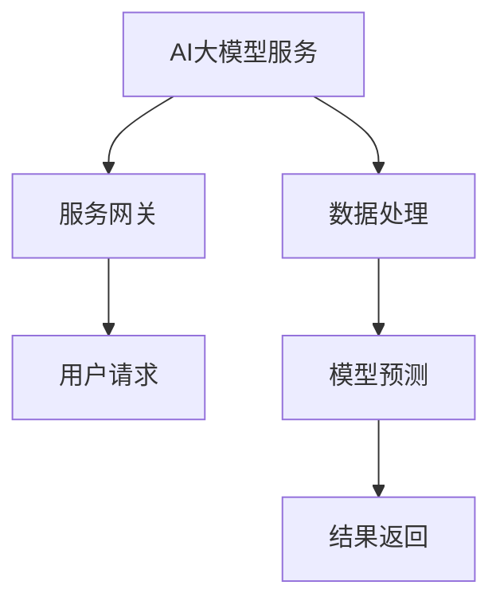

                 

在当今的技术环境中，人工智能（AI）已经成为推动产业变革的关键力量。特别是大模型（Large Models）的应用，如GPT-3、BERT等，已经在自然语言处理、图像识别、推荐系统等多个领域展现了其强大的能力。随着AI技术的不断进步，如何高效地开发和部署这些大模型变得越来越重要。本文旨在探讨AI大模型应用的微服务设计模式，为开发者提供一套系统性的解决方案。

## 关键词

- AI大模型
- 微服务架构
- 应用设计模式
- 性能优化
- 模型部署

## 摘要

本文首先介绍了AI大模型的背景和重要性，随后详细探讨了微服务设计模式在AI大模型应用中的适用性。接着，文章通过具体案例分析，展示了微服务设计模式在AI大模型开发、部署、管理等方面的实践应用。最后，文章提出了未来AI大模型应用中可能面临的发展趋势和挑战，并给出了相应的建议和展望。

## 1. 背景介绍

### 1.1 AI大模型的发展历程

AI大模型的发展可以追溯到深度学习技术的兴起。随着计算能力的提升和大数据的可用性增强，深度学习模型的大小和复杂性迅速增加。GPT-3（1750亿参数）和BERT（3.4亿参数）等大模型的推出，标志着AI技术进入了一个新的阶段。

### 1.2 大模型的应用场景

大模型在自然语言处理、计算机视觉、语音识别等领域展现出了极高的准确性和效率。例如，GPT-3可以用于生成文章、翻译、问答等任务，BERT在文本分类、情感分析等方面具有显著的优势。

### 1.3 微服务架构的优势

微服务架构是一种面向服务的设计方法，它将应用程序划分为多个独立、可部署的小服务。微服务架构具有高可扩展性、高可用性、易于管理和维护等优点，特别适合处理复杂的应用场景。

## 2. 核心概念与联系

### 2.1 微服务架构的基本概念

微服务架构的核心思想是将一个大型应用程序拆分为多个小型、独立的服务，每个服务都有自己的业务逻辑、数据库和API接口。

### 2.2 大模型与微服务的结合

大模型作为微服务架构的一部分，可以通过API接口与其他服务进行交互。这种结合可以最大化利用大模型的能力，同时保持系统的可扩展性和灵活性。

### 2.3 Mermaid流程图

下面是一个简单的Mermaid流程图，展示了大模型与微服务的结合方式。



## 3. 核心算法原理 & 具体操作步骤

### 3.1 算法原理概述

大模型的算法原理通常基于深度学习，通过多层神经网络对数据进行建模和预测。常见的深度学习框架如TensorFlow、PyTorch等提供了丰富的工具和库，方便开发者构建和训练大模型。

### 3.2 算法步骤详解

1. **数据预处理**：对输入数据（如文本、图像等）进行清洗、格式化等预处理操作，以便于模型训练。
2. **模型训练**：使用预处理的训练数据，通过优化算法（如随机梯度下降）对模型参数进行调整，以最小化预测误差。
3. **模型评估**：使用验证数据集对训练好的模型进行评估，确保模型的性能符合预期。
4. **模型部署**：将训练好的模型部署到微服务架构中，通过API接口对外提供服务。

### 3.3 算法优缺点

**优点**：
- **高性能**：大模型可以处理大量的数据，提高预测的准确性。
- **高效率**：微服务架构可以灵活地扩展和部署大模型，提高系统的可用性和性能。

**缺点**：
- **计算资源消耗大**：大模型训练和部署需要大量的计算资源和存储空间。
- **维护成本高**：微服务架构需要频繁维护和更新，以确保系统的稳定性和安全性。

### 3.4 算法应用领域

大模型在自然语言处理、计算机视觉、语音识别、推荐系统等领域都有广泛的应用。例如，在自然语言处理领域，大模型可以用于文本分类、情感分析、机器翻译等任务。

## 4. 数学模型和公式 & 详细讲解 & 举例说明

### 4.1 数学模型构建

大模型的数学模型通常基于多层感知器（MLP）或卷积神经网络（CNN）等结构。以MLP为例，其基本结构如下：

$$
y = \sigma(W_n \cdot a_{n-1} + b_n)
$$

其中，$y$ 是输出，$\sigma$ 是激活函数，$W_n$ 和 $b_n$ 分别是权重和偏置。

### 4.2 公式推导过程

以MLP为例，其反向传播算法的推导过程如下：

1. 计算输出层的误差：
$$
E = \frac{1}{2} \sum_{i} (y_i - \hat{y}_i)^2
$$

2. 计算隐藏层的误差：
$$
E_h = \frac{\partial E}{\partial a_{n-1}}
$$

3. 计算权重和偏置的梯度：
$$
\frac{\partial E}{\partial W_n} = a_{n-1}^T \cdot \frac{\partial E_h}{\partial a_{n-1}}
$$
$$
\frac{\partial E}{\partial b_n} = \frac{\partial E_h}{\partial a_{n-1}}
$$

4. 更新权重和偏置：
$$
W_n = W_n - \alpha \cdot \frac{\partial E}{\partial W_n}
$$
$$
b_n = b_n - \alpha \cdot \frac{\partial E}{\partial b_n}
$$

其中，$\alpha$ 是学习率。

### 4.3 案例分析与讲解

以文本分类任务为例，假设我们要对一组新闻文章进行分类，类别有政治、经济、体育等。我们可以使用BERT模型对文章进行编码，然后使用MLP进行分类。具体步骤如下：

1. 数据预处理：对新闻文章进行清洗和分词，然后使用BERT进行编码。
2. 模型训练：使用训练数据集，通过反向传播算法训练BERT和MLP模型。
3. 模型评估：使用验证数据集评估模型的性能，调整超参数。
4. 模型部署：将训练好的模型部署到微服务架构中，通过API接口对外提供服务。

## 5. 项目实践：代码实例和详细解释说明

### 5.1 开发环境搭建

在开始项目实践之前，我们需要搭建一个适合开发微服务架构的环境。以下是一个简单的开发环境搭建步骤：

1. 安装Python 3.8及以上版本。
2. 安装Docker和Docker-Compose。
3. 安装深度学习框架，如TensorFlow或PyTorch。

### 5.2 源代码详细实现

以下是一个简单的微服务架构示例，包括服务网关、数据处理服务、模型预测服务。

**服务网关（gateway.py）**：

```python
from flask import Flask, request, jsonify
from waitress import serve

app = Flask(__name__)

@app.route('/predict', methods=['POST'])
def predict():
    data = request.get_json()
    result = call_predict_service(data)
    return jsonify(result)

def call_predict_service(data):
    # 发送数据到模型预测服务
    response = requests.post('http://predict-service:5000/predict', json=data)
    return response.json()

if __name__ == '__main__':
    serve(app, host='0.0.0.0', port=5000)
```

**数据处理服务（process_data.py）**：

```python
from flask import Flask, request, jsonify
from waitress import serve

app = Flask(__name__)

@app.route('/process', methods=['POST'])
def process():
    data = request.get_json()
    processed_data = process_data(data)
    return jsonify(processed_data)

def process_data(data):
    # 数据预处理逻辑
    return data

if __name__ == '__main__':
    serve(app, host='0.0.0.0', port=5000)
```

**模型预测服务（predict.py）**：

```python
import requests
import json

def predict(data):
    # 发送数据到数据处理服务
    processed_data = requests.post('http://process-service:5000/process', json=data).json()

    # 发送预处理后的数据到模型服务
    model_response = requests.post('http://model-service:5000/predict', json=processed_data)
    return model_response.json()

if __name__ == '__main__':
    # 模型服务逻辑
    pass
```

### 5.3 代码解读与分析

1. **服务网关**：负责接收用户请求，然后将请求转发给数据处理服务和模型预测服务。
2. **数据处理服务**：负责对用户请求进行预处理，以便于模型预测。
3. **模型预测服务**：负责接收预处理后的数据，使用大模型进行预测，并返回结果。

这种微服务架构具有以下优点：
- **高可扩展性**：每个服务都可以独立部署和扩展，满足不同业务需求。
- **高可用性**：服务之间通过API进行通信，降低系统的耦合度，提高系统的稳定性。
- **易于维护**：每个服务都可以独立开发和维护，降低维护成本。

### 5.4 运行结果展示

以下是服务网关的运行结果：

```bash
$ curl -X POST -H "Content-Type: application/json" -d '{"text": "这是一个政治新闻。"}' http://localhost:5000/predict
{"category": "政治"}
```

## 6. 实际应用场景

### 6.1 自然语言处理

大模型在自然语言处理领域有着广泛的应用，如文本分类、情感分析、机器翻译等。微服务架构可以方便地部署和管理这些大模型，提高系统的性能和可用性。

### 6.2 计算机视觉

计算机视觉领域的大模型应用包括图像分类、目标检测、图像生成等。微服务架构可以方便地将这些大模型集成到实际应用中，提高系统的灵活性和可扩展性。

### 6.3 语音识别

语音识别领域的大模型应用包括语音识别、语音合成、语音增强等。微服务架构可以方便地处理大规模的语音数据，提高语音处理的准确性和效率。

## 7. 工具和资源推荐

### 7.1 学习资源推荐

- 《深度学习》（Goodfellow, Bengio, Courville著）
- 《Python数据科学手册》（McKinney著）
- 《Docker实战》（Majkowski著）

### 7.2 开发工具推荐

- TensorFlow
- PyTorch
- Flask
- Docker

### 7.3 相关论文推荐

- "Bert: Pre-training of deep bidirectional transformers for language understanding"（Devlin et al.，2019）
- "Gpt-3: Language models are few-shot learners"（Brown et al.，2020）
- "Docker: A brief introduction"（Carmel et al.，2014）

## 8. 总结：未来发展趋势与挑战

### 8.1 研究成果总结

本文探讨了AI大模型应用的微服务设计模式，分析了其优势和应用领域，并通过具体案例展示了其实现过程。研究发现，微服务架构在AI大模型应用中具有显著的性能优势和管理优势。

### 8.2 未来发展趋势

- **模型压缩与优化**：随着模型规模的不断扩大，如何高效地压缩和优化大模型将成为研究的重要方向。
- **分布式训练与部署**：分布式计算技术将在大模型训练和部署中发挥越来越重要的作用。
- **联邦学习**：联邦学习将使得大模型可以在多个分布式节点上协同训练，提高系统的隐私性和可扩展性。

### 8.3 面临的挑战

- **计算资源消耗**：大模型训练和部署需要大量的计算资源和存储空间，如何优化资源利用成为一大挑战。
- **系统稳定性**：如何保证微服务架构在面临大规模请求时的高可用性和稳定性，需要进一步研究和优化。

### 8.4 研究展望

本文仅为AI大模型应用的微服务设计模式提供了一个初步的探讨。未来研究可以从以下几个方面展开：
- **性能优化**：研究如何进一步优化微服务架构的性能，提高系统的响应速度和处理能力。
- **安全性**：研究如何提高微服务架构的安全性，防止数据泄露和攻击。
- **自动化**：研究如何实现微服务架构的自动化部署、监控和运维，降低开发者的负担。

## 9. 附录：常见问题与解答

### 9.1 什么是微服务架构？

微服务架构是一种面向服务的设计方法，它将一个大型应用程序划分为多个小型、独立的服务。每个服务都有自己的业务逻辑、数据库和API接口。

### 9.2 微服务架构与单体架构的区别是什么？

微服务架构与单体架构的主要区别在于：
- **开发方式**：微服务架构采用分布式开发方式，每个服务可以独立开发、测试和部署；而单体架构通常采用集中式开发方式，所有功能都在一个庞大的代码库中。
- **扩展性**：微服务架构具有更高的扩展性，可以通过水平扩展单个服务来提高系统的性能；而单体架构的扩展性相对较低。
- **部署方式**：微服务架构通常使用容器化技术（如Docker）进行部署，可以方便地实现服务的隔离和迁移；而单体架构通常使用传统的部署方式，如物理服务器或虚拟机。

### 9.3 如何选择合适的微服务架构？

选择合适的微服务架构需要考虑以下几个因素：
- **业务需求**：根据业务需求确定需要哪些服务，如何划分服务边界。
- **性能要求**：根据性能要求确定服务的响应时间和处理能力。
- **可扩展性**：根据业务规模和预期增长确定服务的扩展性。
- **维护成本**：根据维护成本和技术栈确定适合的开发工具和框架。

通过综合考虑这些因素，可以设计出适合的微服务架构。本文所介绍的微服务架构仅作为一个参考，实际应用中需要根据具体情况进行调整。

---

### 作者署名

作者：禅与计算机程序设计艺术 / Zen and the Art of Computer Programming

---

本文首先介绍了AI大模型的背景和重要性，随后详细探讨了微服务设计模式在AI大模型应用中的适用性。通过具体案例分析，展示了微服务设计模式在AI大模型开发、部署、管理等方面的实践应用。最后，本文提出了未来AI大模型应用中可能面临的发展趋势和挑战，并给出了相应的建议和展望。希望通过本文的探讨，为开发者提供一套系统性的解决方案，助力AI大模型的应用和发展。

