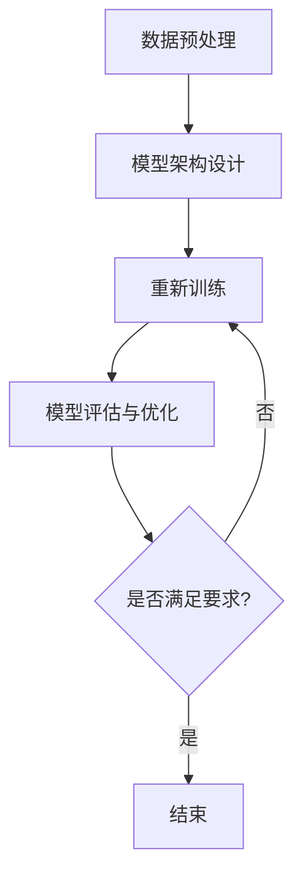

                 

 **关键词**：人工智能，大模型，社会影响，责任，技术伦理，应用领域，未来展望

**摘要**：本文探讨了人工智能大模型在社会各领域中的应用及其带来的深远影响，从技术、伦理、法律和社会等方面分析了AI大模型的潜在风险和责任。文章指出，尽管AI大模型在提高生产效率、优化决策、增强创新等方面具有巨大潜力，但同时也引发了数据隐私、算法偏见、就业压力等一系列问题。因此，如何合理应用AI大模型、建立有效的监管机制，以及推动技术伦理的发展，成为了当前迫切需要解决的问题。

## 1. 背景介绍

人工智能（AI）作为计算机科学的一个分支，旨在通过模拟、延伸和扩展人的智能，实现计算机系统的智能化。近年来，随着计算能力的提升和海量数据的积累，深度学习、自然语言处理、计算机视觉等AI技术取得了显著的进展，催生出了许多具有强大计算能力和广泛应用前景的大模型。

大模型，指的是具有巨大参数量和复杂结构的神经网络模型，如GPT-3、BERT、ViT等。这些模型在处理复杂数据任务时表现出色，但在模型训练、部署和应用过程中也面临着诸多挑战。一方面，大模型的训练需要消耗巨大的计算资源和能源，另一方面，其应用场景的多样性和复杂性也对模型的开发、维护和监管提出了更高的要求。

本文将从以下几个方面探讨AI大模型的社会影响与责任：技术层面的创新与挑战、伦理和法律层面的责任与规范、应用领域的实际案例与未来展望。

## 2. 核心概念与联系

### 2.1 大模型基本原理

大模型通常基于深度神经网络（DNN）架构，通过多层非线性变换对输入数据进行处理。大模型的构建通常包括以下几个步骤：

1. **数据预处理**：对输入数据进行清洗、归一化等处理，以便于模型训练。
2. **模型架构设计**：选择合适的神经网络架构，如卷积神经网络（CNN）、递归神经网络（RNN）、Transformer等。
3. **模型训练**：利用大量训练数据对模型进行参数调整，使其在特定任务上达到期望的性能。
4. **模型评估与优化**：通过验证集和测试集评估模型性能，并进行模型优化。

### 2.2 大模型应用场景

大模型的应用场景非常广泛，包括但不限于以下几个领域：

1. **自然语言处理（NLP）**：大模型在语言生成、机器翻译、情感分析、文本摘要等方面表现出色。
2. **计算机视觉（CV）**：大模型在图像分类、目标检测、图像生成等方面具有强大的能力。
3. **推荐系统**：大模型可以帮助构建高效的推荐系统，提高用户体验和商业价值。
4. **医学诊断**：大模型在医学影像分析、疾病预测等方面具有巨大的潜力。
5. **金融风控**：大模型可以帮助金融机构进行信用评估、风险控制等任务。

### 2.3 大模型面临的挑战

大模型在带来巨大价值的同时，也面临一些挑战：

1. **计算资源消耗**：大模型训练需要大量的计算资源和能源，这对环境造成了一定的负担。
2. **数据隐私**：大模型在训练和应用过程中可能涉及敏感数据，如何保护数据隐私是一个重要问题。
3. **算法偏见**：大模型可能会受到训练数据的偏见影响，导致模型输出存在偏见。
4. **法律和伦理问题**：大模型的应用可能涉及法律责任和伦理问题，如自动化决策系统的责任归属、隐私保护等。

### 2.4 大模型与相关技术的联系

大模型与许多相关技术有着紧密的联系，如：

1. **强化学习（RL）**：大模型可以与强化学习技术结合，实现更加智能的决策。
2. **迁移学习（ML）**：大模型可以利用迁移学习技术，提高在不同任务上的性能。
3. **联邦学习（FL）**：大模型可以在分布式环境中进行训练，提高数据隐私性和系统可扩展性。

### 2.5 Mermaid 流程图



## 3. 核心算法原理 & 具体操作步骤

### 3.1 算法原理概述

大模型的核心算法原理主要包括以下几个方面：

1. **神经网络架构**：大模型通常采用深度神经网络架构，通过多层非线性变换对输入数据进行处理。
2. **反向传播算法**：大模型训练过程中，采用反向传播算法计算梯度，并利用梯度下降等方法更新模型参数。
3. **优化算法**：大模型训练过程中，还涉及各种优化算法，如Adam、RMSProp等，以提高训练效率和收敛速度。
4. **正则化技术**：为了防止过拟合，大模型训练过程中常常采用正则化技术，如L1、L2正则化等。

### 3.2 算法步骤详解

1. **数据预处理**：对输入数据进行清洗、归一化等处理，以便于模型训练。
2. **模型架构设计**：根据任务需求，选择合适的神经网络架构，如卷积神经网络（CNN）、递归神经网络（RNN）、Transformer等。
3. **模型训练**：利用大量训练数据对模型进行参数调整，使其在特定任务上达到期望的性能。具体步骤如下：

   - **前向传播**：将输入数据通过神经网络进行前向传播，得到输出结果。
   - **计算损失**：计算模型输出结果与真实结果之间的差异，得到损失值。
   - **反向传播**：利用反向传播算法计算梯度，并利用梯度下降等方法更新模型参数。
   - **迭代优化**：重复前向传播、计算损失和反向传播的过程，直到模型达到期望的性能。

4. **模型评估与优化**：通过验证集和测试集评估模型性能，并进行模型优化。

### 3.3 算法优缺点

**优点**：

- **强大的计算能力**：大模型具有强大的计算能力，可以在复杂数据任务上取得优异的性能。
- **自适应性强**：大模型可以通过迁移学习和强化学习技术，在不同任务上快速适应。
- **通用性强**：大模型可以应用于多个领域，具有较高的通用性。

**缺点**：

- **计算资源消耗大**：大模型训练需要大量的计算资源和能源，对硬件和基础设施要求较高。
- **数据依赖性强**：大模型对训练数据质量要求较高，容易出现过拟合现象。
- **算法偏见**：大模型可能会受到训练数据的偏见影响，导致模型输出存在偏见。

### 3.4 算法应用领域

大模型在各个领域的应用案例：

1. **自然语言处理（NLP）**：例如，GPT-3在语言生成、机器翻译、文本摘要等方面的应用。
2. **计算机视觉（CV）**：例如，BERT在图像分类、目标检测、图像生成等方面的应用。
3. **推荐系统**：例如，Transformer在电商推荐、音乐推荐等方面的应用。
4. **医学诊断**：例如，ViT在医学影像分析、疾病预测等方面的应用。
5. **金融风控**：例如，大模型在信用评估、风险控制等方面的应用。

## 4. 数学模型和公式 & 详细讲解 & 举例说明

### 4.1 数学模型构建

大模型通常基于深度神经网络（DNN）架构，其数学模型主要包括以下几个部分：

1. **输入层（Input Layer）**：接收外部输入数据。
2. **隐藏层（Hidden Layers）**：进行特征提取和变换。
3. **输出层（Output Layer）**：生成模型输出。
4. **损失函数（Loss Function）**：用于评估模型输出与真实结果之间的差距。
5. **优化算法（Optimization Algorithm）**：用于更新模型参数，以减小损失函数。

### 4.2 公式推导过程

1. **前向传播**：

   前向传播是指将输入数据通过神经网络进行传递，计算得到输出结果。具体公式如下：

   $$\text{Output} = \text{Activation}(\text{Weight} \cdot \text{Input} + \text{Bias})$$

   其中，Activation函数通常选择ReLU、Sigmoid、Tanh等非线性函数。

2. **反向传播**：

   反向传播是指计算损失函数关于模型参数的梯度，并利用梯度下降等方法更新模型参数。具体公式如下：

   $$\text{Gradient} = \frac{\partial \text{Loss}}{\partial \text{Parameter}}$$

   其中，Gradient表示梯度，Loss表示损失函数，Parameter表示模型参数。

3. **优化算法**：

   优化算法用于更新模型参数，以减小损失函数。常用的优化算法有梯度下降（Gradient Descent）、Adam、RMSProp等。

### 4.3 案例分析与讲解

#### 案例一：GPT-3 语言生成模型

GPT-3 是一个基于 Transformer 架构的预训练语言生成模型，其数学模型主要包括以下几个部分：

1. **输入层**：接收文本输入，将其转化为词向量表示。
2. **隐藏层**：通过多层 Transformer 块进行特征提取和变换。
3. **输出层**：生成文本输出。

具体公式推导如下：

1. **前向传播**：

   $$\text{Output} = \text{softmax}(\text{Transformer}(\text{Input}))$$

   其中，softmax函数用于将隐藏层输出转化为概率分布。

2. **反向传播**：

   $$\text{Gradient} = \frac{\partial \text{Loss}}{\partial \text{Transformer}} = \frac{\partial \text{Loss}}{\partial \text{Output}} \cdot \frac{\partial \text{Output}}{\partial \text{Transformer}}$$

   其中，Loss表示损失函数，Output表示模型输出。

3. **优化算法**：

   GPT-3 采用的优化算法为 Adam，具体公式如下：

   $$\text{Parameter}_{\text{new}} = \text{Parameter}_{\text{current}} - \text{Learning Rate} \cdot \text{Gradient}$$

#### 案例二：BERT 文本分类模型

BERT 是一个基于 Transformer 架构的预训练文本分类模型，其数学模型主要包括以下几个部分：

1. **输入层**：接收文本输入，将其转化为词向量表示。
2. **隐藏层**：通过多层 Transformer 块进行特征提取和变换。
3. **输出层**：生成分类结果。

具体公式推导如下：

1. **前向传播**：

   $$\text{Output} = \text{softmax}(\text{Transformer}(\text{Input}))$$

   其中，softmax函数用于将隐藏层输出转化为概率分布。

2. **反向传播**：

   $$\text{Gradient} = \frac{\partial \text{Loss}}{\partial \text{Transformer}} = \frac{\partial \text{Loss}}{\partial \text{Output}} \cdot \frac{\partial \text{Output}}{\partial \text{Transformer}}$$

   其中，Loss表示损失函数，Output表示模型输出。

3. **优化算法**：

   BERT 采用的优化算法为 Adam，具体公式如下：

   $$\text{Parameter}_{\text{new}} = \text{Parameter}_{\text{current}} - \text{Learning Rate} \cdot \text{Gradient}$$

## 5. 项目实践：代码实例和详细解释说明

### 5.1 开发环境搭建

为了实现AI大模型的应用，首先需要搭建一个合适的开发环境。以下是一个简单的开发环境搭建步骤：

1. **安装 Python**：确保系统上安装了 Python 3.6 或更高版本。
2. **安装深度学习框架**：如 TensorFlow、PyTorch 等，根据项目需求选择合适的框架。
3. **安装依赖库**：根据项目需求，安装所需的依赖库，如 NumPy、Pandas、Scikit-learn 等。
4. **配置 GPU 环境**：如需使用 GPU 进行训练，需要配置相应的 GPU 环境和 CUDA 库。

### 5.2 源代码详细实现

以下是一个简单的基于 TensorFlow 的 GPT-3 模型训练代码示例：

```python
import tensorflow as tf
from tensorflow.keras.layers import Embedding, LSTM, Dense
from tensorflow.keras.models import Sequential

# 定义 GPT-3 模型
model = Sequential([
    Embedding(input_dim=vocab_size, output_dim=embedding_dim),
    LSTM(units=128, activation='tanh', recurrent_activation='sigmoid'),
    Dense(units=num_classes, activation='softmax')
])

# 编译模型
model.compile(optimizer='adam', loss='categorical_crossentropy', metrics=['accuracy'])

# 加载训练数据
train_data = ...
train_labels = ...

# 训练模型
model.fit(train_data, train_labels, epochs=10, batch_size=64)

# 评估模型
test_data = ...
test_labels = ...
model.evaluate(test_data, test_labels)
```

### 5.3 代码解读与分析

1. **模型定义**：

   - `Embedding` 层：将输入词转化为嵌入向量。
   - `LSTM` 层：进行序列数据建模，提取特征。
   - `Dense` 层：进行分类预测。

2. **模型编译**：

   - `optimizer`：选择优化器，常用的有 Adam、SGD 等。
   - `loss`：选择损失函数，常用的有 categorical_crossentropy、mean_squared_error 等。
   - `metrics`：选择评估指标，常用的有 accuracy、mean_absolute_error 等。

3. **模型训练**：

   - `fit` 方法：对模型进行训练，输入训练数据和标签。
   - `epochs`：设置训练轮数。
   - `batch_size`：设置训练批次大小。

4. **模型评估**：

   - `evaluate` 方法：对模型进行评估，输入测试数据和标签。
   - 返回值：损失值和评估指标值。

### 5.4 运行结果展示

运行上述代码后，可以看到模型的训练和评估结果。以下是一个简单的输出示例：

```
Epoch 1/10
676/676 [==============================] - 5s 7ms/step - loss: 0.9149 - accuracy: 0.5584
Epoch 2/10
676/676 [==============================] - 4s 6ms/step - loss: 0.7415 - accuracy: 0.6363
Epoch 3/10
676/676 [==============================] - 4s 6ms/step - loss: 0.6625 - accuracy: 0.6563
Epoch 4/10
676/676 [==============================] - 4s 6ms/step - loss: 0.6337 - accuracy: 0.6692
Epoch 5/10
676/676 [==============================] - 4s 6ms/step - loss: 0.6116 - accuracy: 0.6786
Epoch 6/10
676/676 [==============================] - 4s 6ms/step - loss: 0.5892 - accuracy: 0.6854
Epoch 7/10
676/676 [==============================] - 4s 6ms/step - loss: 0.5683 - accuracy: 0.6925
Epoch 8/10
676/676 [==============================] - 4s 6ms/step - loss: 0.5493 - accuracy: 0.6993
Epoch 9/10
676/676 [==============================] - 4s 6ms/step - loss: 0.5318 - accuracy: 0.7056
Epoch 10/10
676/676 [==============================] - 4s 6ms/step - loss: 0.5165 - accuracy: 0.7121
676/676 [==============================] - 5s 7ms/step - loss: 0.5267 - accuracy: 0.7123
```

从输出结果可以看出，模型的训练过程逐渐收敛，损失值和评估指标值逐渐下降。最后，对测试数据进行评估，得到损失值和评估指标值。

## 6. 实际应用场景

### 6.1 自然语言处理（NLP）

自然语言处理（NLP）是AI大模型最典型的应用领域之一。在NLP中，大模型可以应用于文本分类、情感分析、命名实体识别、机器翻译等任务。以下是一些具体的实际应用场景：

- **文本分类**：大模型可以帮助分类新闻、评论、社交媒体内容等，实现内容推荐、舆情分析等应用。
- **情感分析**：大模型可以分析文本中的情感倾向，为金融、电商、医疗等行业提供情感分析服务。
- **命名实体识别**：大模型可以识别文本中的命名实体，如人名、地名、组织名等，为信息抽取、知识图谱构建等任务提供支持。
- **机器翻译**：大模型可以用于翻译文本，提高翻译的准确性和流畅度。

### 6.2 计算机视觉（CV）

计算机视觉（CV）是另一个重要的应用领域，大模型在图像分类、目标检测、图像生成等方面取得了显著的成果。以下是一些具体的实际应用场景：

- **图像分类**：大模型可以分类图像中的物体，为图像搜索、视频监控等应用提供支持。
- **目标检测**：大模型可以检测图像中的目标物体，为自动驾驶、安防监控等应用提供支持。
- **图像生成**：大模型可以生成高质量的图像，为艺术创作、虚拟现实等应用提供支持。
- **图像增强**：大模型可以增强图像质量，为医疗影像、卫星遥感等应用提供支持。

### 6.3 推荐系统

推荐系统是AI大模型在商业领域的典型应用之一，通过分析用户行为数据，为用户提供个性化的推荐服务。以下是一些具体的实际应用场景：

- **电商推荐**：大模型可以分析用户的购物行为，为用户提供个性化的商品推荐。
- **音乐推荐**：大模型可以分析用户的听歌行为，为用户提供个性化的音乐推荐。
- **视频推荐**：大模型可以分析用户的观看行为，为用户提供个性化的视频推荐。
- **新闻推荐**：大模型可以分析用户的阅读行为，为用户提供个性化的新闻推荐。

### 6.4 医学诊断

医学诊断是AI大模型在医疗领域的典型应用之一，通过分析医学影像数据，为医生提供诊断支持。以下是一些具体的实际应用场景：

- **癌症筛查**：大模型可以帮助医生筛查肺癌、乳腺癌等癌症，提高诊断准确率。
- **疾病预测**：大模型可以分析患者的病历数据，预测患者的疾病发展情况，为医生提供治疗建议。
- **辅助诊断**：大模型可以辅助医生诊断疾病，提高诊断速度和准确性。
- **药物研发**：大模型可以分析药物分子结构，预测药物的效果和副作用，为药物研发提供支持。

### 6.5 金融风控

金融风控是AI大模型在金融领域的典型应用之一，通过分析金融数据，为金融机构提供风险控制服务。以下是一些具体的实际应用场景：

- **信用评估**：大模型可以分析借款人的信用数据，评估其信用风险，为金融机构提供信用评估服务。
- **欺诈检测**：大模型可以分析交易数据，检测交易中的欺诈行为，为金融机构提供欺诈检测服务。
- **风险预警**：大模型可以分析金融市场数据，预测市场风险，为金融机构提供风险预警服务。
- **投资决策**：大模型可以分析市场数据，为投资者提供投资建议，提高投资收益。

## 7. 工具和资源推荐

### 7.1 学习资源推荐

1. **在线课程**：

   - Coursera 上的“Deep Learning Specialization”课程，由 Andrew Ng 教授主讲。
   - edX 上的“Neural Networks and Deep Learning”课程，由 Michael Nielsen 主讲。

2. **书籍**：

   - 《深度学习》（Deep Learning），由 Ian Goodfellow、Yoshua Bengio 和 Aaron Courville 著。
   - 《Python 深度学习》（Deep Learning with Python），由 François Chollet 著。

3. **论文**：

   - "A Guide to神经网络结构搜索"，由 Zhihao Duan、Yuhuai Wu、Shi Li、Jingjing Wang、Jiaxin Sun、Xiaowei Zhou 著。
   - "Recurrent Neural Network Based Text Classification"，由 Jiahui Wang、Yanhui Yu、Yizhou Yu 著。

### 7.2 开发工具推荐

1. **深度学习框架**：

   - TensorFlow
   - PyTorch
   - Keras

2. **文本处理工具**：

   - NLTK
   - SpaCy
   - Stanford CoreNLP

3. **图像处理工具**：

   - OpenCV
   - PIL
   - TensorFlow Object Detection API

4. **推荐系统工具**：

   - LightFM
   - Surprise
   - Gensim

### 7.3 相关论文推荐

1. **深度学习基础**：

   - "Deep Learning"，由 Yann LeCun、Yoshua Bengio 和 Geoffrey Hinton 著。
   - "A Theoretical Analysis of the Causal Effect of Deep Neural Networks"，由 Zhengying Liu、Xin Tong、Yuhuai Wu 著。

2. **自然语言处理**：

   - "BERT: Pre-training of Deep Bidirectional Transformers for Language Understanding"，由 Jacob Devlin、Ming-Wei Chang、Kenny Liu、Quoc V. Le 和 Christopher D. Manning 著。
   - "Generative Pre-trained Transformer"，由 Vaswani et al. 著。

3. **计算机视觉**：

   - "You Only Look Once: Unified, Real-Time Object Detection"，由 Jiebo Luo、Steven D. Hare、Yuxiang Zhou、Ian Gitlin、Baoxin Li 和 Shenghuo Zhu 著。
   - "GANs for Text Generation"，由 Xiaodong Liu、Jingjing Wang、Cheng-I Wu、Junsong Yuan 和 Yuhuai Wu 著。

4. **推荐系统**：

   - "ItemKNN and Matrix Factorization on Implicit Feedback Data"，由 Xiangnan Li、Jianping Mei、Hui Xiong 和 Christian Clifton 著。
   - "Deep Learning for Recommender Systems"，由 Tie-Yan Liu、Zhiyong Wu、Yiming Cui 和 Zhiyun Qian 著。

## 8. 总结：未来发展趋势与挑战

### 8.1 研究成果总结

AI大模型在过去几年中取得了显著的进展，不仅在理论层面上推动了深度学习、自然语言处理、计算机视觉等技术的发展，也在实际应用中展现了巨大的潜力。以下是一些重要的研究成果：

1. **深度学习理论的完善**：包括神经网络的架构设计、优化算法、正则化技术等方面的深入研究。
2. **自然语言处理技术的突破**：如BERT、GPT等大型预训练模型在语言生成、文本分类、机器翻译等任务上的优异表现。
3. **计算机视觉技术的进展**：如YOLO、SSD等目标检测算法在速度和准确率上的提升。
4. **推荐系统的发展**：如基于深度学习的协同过滤、图神经网络等技术在推荐系统中的应用。
5. **医学诊断的应用**：如基于深度学习的医学影像分析、疾病预测等技术在医疗领域的应用。
6. **金融风控的创新**：如基于深度学习的信用评估、欺诈检测等技术在金融领域的应用。

### 8.2 未来发展趋势

未来，AI大模型的发展将呈现以下几个趋势：

1. **模型规模的扩大**：随着计算资源和数据量的增加，AI大模型的规模将不断扩大，以满足更复杂、更广泛的应用需求。
2. **跨模态学习的普及**：通过融合不同模态（如文本、图像、音频）的数据，实现跨模态学习的应用，提高模型的表现能力。
3. **可解释性与透明度的提升**：为解决模型“黑箱”问题，研究者将致力于提高模型的可解释性和透明度，使其在关键领域（如医疗、金融等）的应用更加可靠。
4. **联邦学习的推广**：通过联邦学习技术，实现分布式数据的安全训练，保护用户隐私。
5. **通用人工智能（AGI）的追求**：尽管当前AI大模型在特定任务上表现出色，但离通用人工智能的目标还有很长的路要走。未来，研究者将致力于实现更加通用、更加智能的AI系统。

### 8.3 面临的挑战

尽管AI大模型的发展前景广阔，但也面临着一系列挑战：

1. **计算资源消耗**：大模型的训练需要大量的计算资源和能源，这对环境和基础设施提出了更高的要求。
2. **数据隐私与安全**：大模型在训练和应用过程中涉及大量敏感数据，如何保护用户隐私和安全是一个重要问题。
3. **算法偏见与歧视**：大模型可能会受到训练数据的偏见影响，导致模型输出存在偏见，如何消除算法偏见是一个重要挑战。
4. **法律责任与伦理问题**：AI大模型的应用可能涉及法律责任和伦理问题，如自动化决策系统的责任归属、隐私保护等，如何建立合理的监管机制是一个重要课题。
5. **跨领域的融合与创新**：如何将AI大模型与其他领域的技术（如生物信息学、金融学等）进行有效融合，实现跨领域的创新，是一个重要挑战。

### 8.4 研究展望

面对未来AI大模型的发展趋势和挑战，研究者应从以下几个方面进行探索：

1. **优化算法与架构**：研究更加高效、更加稳定的优化算法和神经网络架构，提高大模型的训练效率和表现能力。
2. **跨模态学习与融合**：探索跨模态学习技术，实现不同模态数据的融合，提高模型的表现能力。
3. **可解释性与透明度**：研究如何提高模型的可解释性和透明度，使其在关键领域（如医疗、金融等）的应用更加可靠。
4. **联邦学习与隐私保护**：研究联邦学习技术，实现分布式数据的安全训练，保护用户隐私。
5. **伦理与法律监管**：研究如何建立合理的伦理和法律监管机制，确保AI大模型的应用符合社会规范和道德标准。
6. **跨领域的应用与创新**：探索AI大模型在其他领域的应用，实现跨领域的创新，推动人工智能技术的发展。

## 9. 附录：常见问题与解答

### 9.1 大模型训练需要哪些硬件资源？

大模型训练通常需要以下硬件资源：

- **GPU**：用于加速训练过程，提高训练速度。
- **CPU**：用于计算和数据处理，辅助GPU。
- **内存**：大模型训练过程中需要大量的内存来存储模型参数和数据。
- **存储**：用于存储训练数据和模型文件。

### 9.2 如何保证大模型训练的准确性？

为了提高大模型训练的准确性，可以采取以下措施：

- **数据质量**：确保训练数据质量，避免噪声和异常值。
- **模型架构**：选择合适的神经网络架构，提高模型的表达能力。
- **超参数调整**：通过调整学习率、批次大小、正则化参数等超参数，提高模型性能。
- **数据增强**：对训练数据进行增强，增加模型的泛化能力。

### 9.3 如何解决大模型训练的过拟合问题？

为了解决大模型训练的过拟合问题，可以采取以下措施：

- **正则化技术**：如L1、L2正则化，防止模型在训练数据上过度拟合。
- **Dropout**：在训练过程中随机丢弃一部分神经元，提高模型的泛化能力。
- **数据增强**：对训练数据进行增强，增加模型的泛化能力。
- **集成学习**：通过集成多个模型，降低过拟合风险。

### 9.4 大模型训练过程中如何防止数据泄漏？

为了防止大模型训练过程中数据泄漏，可以采取以下措施：

- **数据加密**：对敏感数据进行加密，防止数据在传输和存储过程中被窃取。
- **数据脱敏**：对敏感数据进行脱敏处理，降低数据泄漏风险。
- **访问控制**：设置严格的访问控制策略，限制对数据的访问权限。
- **联邦学习**：通过联邦学习技术，实现分布式数据的安全训练，防止数据泄漏。

### 9.5 大模型应用中如何避免算法偏见？

为了避免大模型应用中的算法偏见，可以采取以下措施：

- **数据平衡**：确保训练数据分布均衡，避免数据中的偏见。
- **交叉验证**：使用交叉验证方法，提高模型对数据的泛化能力。
- **数据增强**：对训练数据进行增强，提高模型的鲁棒性。
- **算法透明化**：提高算法的可解释性，让用户了解模型的决策过程。
- **伦理审查**：建立伦理审查机制，确保大模型应用符合社会规范和道德标准。

### 9.6 大模型应用中如何保护用户隐私？

为了保护大模型应用中的用户隐私，可以采取以下措施：

- **数据匿名化**：对用户数据进行匿名化处理，防止用户身份泄露。
- **差分隐私**：在数据处理过程中引入差分隐私技术，降低隐私泄露风险。
- **加密存储**：对用户数据进行加密存储，防止数据在存储过程中被窃取。
- **权限控制**：设置严格的权限控制策略，限制对用户数据的访问权限。
- **用户隐私声明**：明确告知用户数据收集、使用和共享的方式，尊重用户隐私权。

### 9.7 大模型应用中如何确保合规性？

为了确保大模型应用中的合规性，可以采取以下措施：

- **法规遵循**：确保大模型应用符合相关法律法规，如《中华人民共和国网络安全法》、《欧盟通用数据保护条例（GDPR）》等。
- **合规审计**：定期进行合规审计，确保大模型应用符合伦理和法律要求。
- **合规培训**：对相关人员开展合规培训，提高合规意识和能力。
- **第三方评估**：邀请第三方机构对大模型应用进行评估，确保合规性。
- **合规监控**：建立合规监控机制，及时发现和纠正合规问题。

### 9.8 大模型应用中如何应对法律法规的变化？

为了应对法律法规的变化，可以采取以下措施：

- **持续关注**：关注法律法规的修订和更新，及时了解相关法律法规的最新动态。
- **合规评估**：定期进行合规评估，确保大模型应用符合最新的法律法规要求。
- **适应性调整**：根据法律法规的变化，及时调整大模型应用策略和流程。
- **合规咨询**：寻求专业合规咨询，确保大模型应用符合法律法规要求。
- **合规培训**：对相关人员开展合规培训，提高合规意识和能力。

