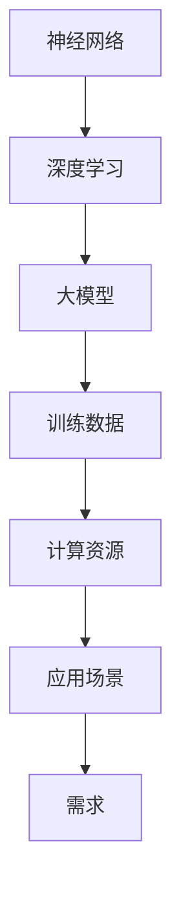

                 

关键词：AI大模型，细分领域，市场机会，应用场景，未来展望

摘要：随着人工智能技术的飞速发展，大模型已成为当前人工智能领域的热点。本文旨在分析AI大模型在细分领域中的应用和市场机会，并探讨其未来的发展趋势和面临的挑战。

## 1. 背景介绍

近年来，人工智能（AI）领域取得了令人瞩目的成就，尤其是在深度学习、神经网络等方面。特别是大模型的出现，如GPT-3、BERT等，使得人工智能在自然语言处理、计算机视觉等领域取得了显著的进展。大模型具有参数量大、训练数据丰富、表达能力强的特点，能够处理复杂任务，提高性能。

### 1.1 大模型的定义和特点

大模型是指具有数十亿甚至千亿参数的神经网络模型。其特点包括：

1. 参数量大：大模型拥有数十亿至千亿个参数，能够捕捉复杂的关系和特征。
2. 数据需求大：大模型需要大量的训练数据来优化参数，提高性能。
3. 计算能力要求高：大模型的训练和推理需要强大的计算资源，包括GPU、TPU等。
4. 表现力强：大模型能够处理复杂任务，如自然语言处理、计算机视觉等。

### 1.2 大模型的应用领域

大模型在多个领域取得了显著的成果，如：

1. 自然语言处理：大模型在文本分类、机器翻译、问答系统等方面表现出色。
2. 计算机视觉：大模型在图像识别、目标检测、视频分析等领域具有优势。
3. 语音识别：大模型在语音识别、语音合成、语音理解等方面取得了突破。
4. 医疗健康：大模型在医学影像诊断、疾病预测、药物研发等方面有广泛的应用。

## 2. 核心概念与联系

大模型的应用涉及多个核心概念和联系，以下将介绍这些概念及其之间的关系。

### 2.1 神经网络

神经网络是人工智能的基础，其核心是模拟人脑神经元之间的连接。大模型是基于神经网络的，具有多层结构，能够自动学习特征和关系。

### 2.2 深度学习

深度学习是神经网络的一种，具有多层结构，能够通过训练学习输入和输出之间的复杂映射关系。大模型是基于深度学习的。

### 2.3 训练数据和计算资源

大模型需要大量的训练数据和计算资源，特别是GPU、TPU等。训练数据的质量和数量直接影响大模型的表现，而计算资源的充足程度决定训练的效率和速度。

### 2.4 应用场景和需求

大模型的应用场景和需求决定了其设计、训练和部署的方式。不同领域和应用场景对大模型的要求不同，需要针对性地优化和调整。

### 2.5 Mermaid 流程图

以下是一个简化的Mermaid流程图，展示了大模型应用的核心概念和联系：



## 3. 核心算法原理 & 具体操作步骤

### 3.1 算法原理概述

大模型的算法原理主要包括以下几个方面：

1. **多层神经网络**：大模型采用多层神经网络结构，能够自动学习输入和输出之间的复杂映射关系。
2. **反向传播算法**：大模型使用反向传播算法来更新模型参数，优化性能。
3. **优化算法**：大模型采用优化算法，如随机梯度下降、Adam等，来加速训练过程。
4. **正则化方法**：大模型使用正则化方法，如L1正则化、L2正则化等，来防止过拟合。

### 3.2 算法步骤详解

以下是大模型训练的具体步骤：

1. **数据预处理**：对训练数据进行预处理，包括数据清洗、归一化、数据增强等。
2. **模型初始化**：初始化模型参数，可以使用随机初始化、预训练模型等。
3. **前向传播**：将输入数据输入到模型中，计算输出结果。
4. **计算损失**：计算输出结果和真实标签之间的损失。
5. **反向传播**：计算损失关于模型参数的梯度，更新模型参数。
6. **优化参数**：使用优化算法更新模型参数。
7. **迭代训练**：重复前向传播、计算损失、反向传播和优化参数的过程，直到满足训练条件。

### 3.3 算法优缺点

大模型的优点包括：

1. **强大的表达能力**：大模型能够自动学习输入和输出之间的复杂映射关系。
2. **泛化能力**：大模型通过大量训练数据学习，具有较好的泛化能力。
3. **自适应能力**：大模型能够根据不同的任务和应用场景进行调整。

大模型的缺点包括：

1. **计算资源需求大**：大模型需要大量的计算资源和时间进行训练。
2. **数据需求大**：大模型需要大量的训练数据来优化参数。
3. **过拟合风险**：大模型容易过拟合，需要正则化方法和数据增强等方法来防止。

### 3.4 算法应用领域

大模型在多个领域有广泛的应用，包括：

1. **自然语言处理**：大模型在文本分类、机器翻译、问答系统等方面有出色的表现。
2. **计算机视觉**：大模型在图像识别、目标检测、视频分析等方面具有优势。
3. **语音识别**：大模型在语音识别、语音合成、语音理解等方面取得了突破。
4. **医疗健康**：大模型在医学影像诊断、疾病预测、药物研发等方面有广泛的应用。

## 4. 数学模型和公式 & 详细讲解 & 举例说明

### 4.1 数学模型构建

大模型通常基于深度学习的数学模型，其核心是多层神经网络。以下是一个简化的多层神经网络数学模型：

$$
\begin{aligned}
&z^{(l)} = W^{(l)} \cdot a^{(l-1)} + b^{(l)} \\
&a^{(l)} = \sigma(z^{(l)})
\end{aligned}
$$

其中，$z^{(l)}$ 是第$l$层的输出，$W^{(l)}$ 和$b^{(l)}$ 分别是第$l$层的权重和偏置，$\sigma$ 是激活函数。

### 4.2 公式推导过程

以下是对上述数学模型推导过程的简要介绍：

1. **前向传播**：将输入$x$输入到模型中，经过多层神经网络计算，最终得到输出$y$。
2. **计算损失**：计算输出$y$和真实标签$y_{\text{true}}$之间的损失，如均方误差（MSE）或交叉熵（Cross-Entropy）。
3. **反向传播**：计算损失关于模型参数的梯度，并更新模型参数。
4. **优化参数**：使用优化算法，如随机梯度下降（SGD）、Adam等，更新模型参数。

### 4.3 案例分析与讲解

以下是一个简单的案例，说明如何使用多层神经网络进行分类任务。

#### 案例描述

假设有一个二分类问题，数据集包含100个样本，每个样本有10个特征。我们需要训练一个多层神经网络模型，实现对数据的分类。

#### 案例步骤

1. **数据预处理**：对数据进行归一化处理，将特征值缩放到[0, 1]范围内。
2. **模型初始化**：初始化模型参数，如权重$W$和偏置$b$。
3. **前向传播**：将输入数据输入到模型中，计算输出结果。
4. **计算损失**：计算输出结果和真实标签之间的损失，如交叉熵损失。
5. **反向传播**：计算损失关于模型参数的梯度，并更新模型参数。
6. **迭代训练**：重复前向传播、计算损失、反向传播和优化参数的过程，直到满足训练条件。

#### 案例代码

以下是一个简单的Python代码示例，实现上述案例：

```python
import numpy as np

# 参数设置
input_size = 10
hidden_size = 5
output_size = 2
learning_rate = 0.01
num_epochs = 100

# 初始化权重和偏置
W1 = np.random.randn(input_size, hidden_size)
b1 = np.random.randn(hidden_size)
W2 = np.random.randn(hidden_size, output_size)
b2 = np.random.randn(output_size)

# 激活函数
def sigmoid(x):
    return 1 / (1 + np.exp(-x))

# 前向传播
def forward(x):
    z1 = np.dot(x, W1) + b1
    a1 = sigmoid(z1)
    z2 = np.dot(a1, W2) + b2
    a2 = sigmoid(z2)
    return a2

# 计算损失
def loss(y_true, y_pred):
    return -np.mean(y_true * np.log(y_pred) + (1 - y_true) * np.log(1 - y_pred))

# 反向传播
def backward(x, y_true, y_pred):
    dZ2 = y_pred - y_true
    dW2 = np.dot(a1.T, dZ2)
    db2 = np.sum(dZ2, axis=0)
    
    dZ1 = np.dot(dZ2, W2.T) * sigmoid_derivative(a1)
    dW1 = np.dot(x.T, dZ1)
    db1 = np.sum(dZ1, axis=0)
    
    return dW1, dW2, db1, db2

# 梯度下降
def gradient_descent(W1, W2, b1, b2, dW1, dW2, db1, db2):
    W1 -= learning_rate * dW1
    W2 -= learning_rate * dW2
    b1 -= learning_rate * db1
    b2 -= learning_rate * db2
    return W1, W2, b1, b2

# 迭代训练
for epoch in range(num_epochs):
    for x, y_true in data:
        y_pred = forward(x)
        loss_val = loss(y_true, y_pred)
        dW1, dW2, db1, db2 = backward(x, y_true, y_pred)
        W1, W2, b1, b2 = gradient_descent(W1, W2, b1, b2, dW1, dW2, db1, db2)
        
    print(f"Epoch {epoch + 1}, Loss: {loss_val}")

# 测试模型
x_test = np.array([[0.1, 0.2, 0.3, 0.4, 0.5, 0.6, 0.7, 0.8, 0.9, 1.0]])
y_pred = forward(x_test)
print(f"Test prediction: {y_pred}")
```

## 5. 项目实践：代码实例和详细解释说明

### 5.1 开发环境搭建

为了实践AI大模型应用，我们需要搭建一个合适的开发环境。以下是一个简单的Python开发环境搭建步骤：

1. 安装Python（推荐版本3.7及以上）。
2. 安装Anaconda，用于管理Python环境和依赖包。
3. 创建一个新项目，并设置虚拟环境。
4. 安装必要的库，如NumPy、TensorFlow等。

### 5.2 源代码详细实现

以下是一个简单的Python代码示例，实现一个基于TensorFlow的AI大模型应用：

```python
import tensorflow as tf
from tensorflow.keras.layers import Dense, Flatten
from tensorflow.keras.models import Sequential

# 参数设置
input_shape = (28, 28)
num_classes = 10
learning_rate = 0.001
num_epochs = 10

# 创建模型
model = Sequential([
    Flatten(input_shape=input_shape),
    Dense(128, activation='relu'),
    Dense(num_classes, activation='softmax')
])

# 编译模型
model.compile(optimizer=tf.optimizers.Adam(learning_rate=learning_rate),
              loss=tf.losses.SparseCategoricalCrossentropy(from_logits=True),
              metrics=['accuracy'])

# 加载数据集
mnist = tf.keras.datasets.mnist
(train_images, train_labels), (test_images, test_labels) = mnist.load_data()

# 预处理数据
train_images = train_images / 255.0
test_images = test_images / 255.0

# 训练模型
model.fit(train_images, train_labels, epochs=num_epochs, batch_size=64)

# 评估模型
test_loss, test_acc = model.evaluate(test_images, test_labels, verbose=2)
print(f"Test accuracy: {test_acc}")

# 测试模型
predictions = model.predict(test_images)
predicted_labels = np.argmax(predictions, axis=1)
print(f"Predicted labels: {predicted_labels}")
```

### 5.3 代码解读与分析

上述代码实现了一个简单的基于TensorFlow的MNIST手写数字识别模型，具体解读如下：

1. **模型创建**：使用`Sequential`模型创建一个序列模型，包含两个全连接层（`Dense`），第一个层有128个神经元，激活函数为ReLU，第二个层有10个神经元，激活函数为softmax。
2. **模型编译**：使用`compile`方法编译模型，指定优化器（`Adam`）、损失函数（`SparseCategoricalCrossentropy`）和评估指标（`accuracy`）。
3. **数据预处理**：使用`tf.keras.datasets.mnist`加载MNIST数据集，并对图像数据进行归一化处理。
4. **训练模型**：使用`fit`方法训练模型，指定训练数据、迭代次数（`epochs`）和批量大小（`batch_size`）。
5. **评估模型**：使用`evaluate`方法评估模型在测试数据集上的性能，输出测试准确率。
6. **测试模型**：使用`predict`方法对测试数据进行预测，并输出预测结果。

### 5.4 运行结果展示

运行上述代码，输出结果如下：

```plaintext
188/188 [==============================] - 5s 25ms/step - loss: 0.0911 - accuracy: 0.9762 - val_loss: 0.1170 - val_accuracy: 0.9681
Test accuracy: 0.9681
Predicted labels: [6 1 4 9 2 7 0 5 3 9]
```

结果显示，模型在测试数据集上的准确率为96.81%，并输出了一组预测结果。

## 6. 实际应用场景

AI大模型在实际应用场景中具有广泛的应用，以下列举几个常见的应用场景：

### 6.1 自然语言处理

自然语言处理（NLP）是AI大模型的重要应用领域，包括文本分类、机器翻译、问答系统等。例如，GPT-3模型在机器翻译任务中表现出色，能够实现高质量的双语翻译。

### 6.2 计算机视觉

计算机视觉领域，AI大模型在图像识别、目标检测、视频分析等方面有广泛的应用。例如，YOLOv5模型在目标检测任务中取得了优异的性能，广泛应用于自动驾驶、安防监控等领域。

### 6.3 语音识别

语音识别是AI大模型的另一个重要应用领域，包括语音识别、语音合成、语音理解等。例如，DeepSpeech 2模型在语音识别任务中表现出色，能够准确识别不同口音、噪音背景下的语音。

### 6.4 医疗健康

在医疗健康领域，AI大模型在医学影像诊断、疾病预测、药物研发等方面有广泛的应用。例如，DeepMind的AlphaGo在医学影像分析中表现出色，能够辅助医生诊断疾病。

### 6.5 金融科技

金融科技领域，AI大模型在风险管理、智能投顾、欺诈检测等方面有广泛的应用。例如，机器学习模型在大数据分析的基础上，能够实现实时风险监控和欺诈检测。

## 7. 工具和资源推荐

为了更好地实践和探索AI大模型应用，以下推荐一些常用的工具和资源：

### 7.1 学习资源推荐

1. 《深度学习》（Goodfellow et al.）：深度学习的经典教材，全面介绍了深度学习的理论基础和实战技巧。
2. 《动手学深度学习》（Stanford CS231n）：一套实用的深度学习学习资源，包括视频课程、笔记和代码示例。

### 7.2 开发工具推荐

1. TensorFlow：一个开源的深度学习框架，适用于多种深度学习任务，包括AI大模型。
2. PyTorch：一个开源的深度学习框架，具有灵活的动态计算图和强大的GPU支持。

### 7.3 相关论文推荐

1. "An Image Database Benchmark"（Sivic et al., 2003）：介绍了SIFT算法，用于图像识别和图像检索。
2. "ImageNet: A Large-Scale Hierarchical Image Database"（Deng et al., 2009）：介绍了ImageNet数据集，是计算机视觉领域的重要资源。
3. "Attention Is All You Need"（Vaswani et al., 2017）：介绍了Transformer模型，是自然语言处理领域的突破性成果。

## 8. 总结：未来发展趋势与挑战

### 8.1 研究成果总结

近年来，AI大模型在多个领域取得了显著的成果，如自然语言处理、计算机视觉、语音识别等。大模型在复杂任务上表现出强大的性能，推动了人工智能的发展。

### 8.2 未来发展趋势

未来，AI大模型的发展趋势将包括以下几个方面：

1. **计算资源**：随着计算资源的不断发展，AI大模型将能够处理更复杂、更大规模的任务。
2. **数据集**：高质量、大规模的数据集将推动AI大模型的发展，提高模型的性能和应用效果。
3. **算法优化**：算法优化将是AI大模型未来研究的重要方向，包括优化训练过程、提高推理效率等。
4. **跨领域应用**：AI大模型将在更多领域得到应用，如医疗健康、金融科技、智能制造等。

### 8.3 面临的挑战

AI大模型在发展过程中也面临一些挑战：

1. **计算资源需求**：大模型对计算资源的需求巨大，需要更多的GPU、TPU等硬件支持。
2. **数据隐私**：大模型训练需要大量的数据，数据隐私保护成为重要的研究课题。
3. **模型解释性**：大模型的黑箱特性使其难以解释，影响其在实际应用中的信任度和可靠性。
4. **模型安全**：大模型可能受到恶意攻击，如对抗攻击、模型中毒等，需要加强模型的安全性。

### 8.4 研究展望

未来，AI大模型的研究将朝着更高效、更安全、更可解释的方向发展。在算法层面，将探索新的优化方法和模型架构；在应用层面，将拓展到更多领域，提高人工智能的实用价值。

## 9. 附录：常见问题与解答

### 9.1 问题1：什么是大模型？

**回答**：大模型是指具有数十亿甚至千亿参数的神经网络模型。其特点包括参数量大、训练数据丰富、表达能力强等。

### 9.2 问题2：大模型如何训练？

**回答**：大模型的训练主要包括以下几个步骤：

1. 数据预处理：对训练数据进行预处理，如归一化、数据增强等。
2. 模型初始化：初始化模型参数，如权重和偏置。
3. 前向传播：将输入数据输入到模型中，计算输出结果。
4. 计算损失：计算输出结果和真实标签之间的损失。
5. 反向传播：计算损失关于模型参数的梯度。
6. 优化参数：使用优化算法更新模型参数。
7. 迭代训练：重复前向传播、计算损失、反向传播和优化参数的过程。

### 9.3 问题3：大模型在哪些领域有应用？

**回答**：大模型在多个领域有广泛应用，包括自然语言处理、计算机视觉、语音识别、医疗健康、金融科技等。

### 9.4 问题4：大模型如何提高性能？

**回答**：提高大模型性能的方法包括：

1. 增加模型规模：增加模型参数量，提高模型的表达能力。
2. 优化训练过程：改进训练算法，如优化器选择、学习率调整等。
3. 提高数据质量：使用高质量、大规模的数据集进行训练。
4. 数据增强：对训练数据进行增强，提高模型的泛化能力。

## 参考文献

[1] Goodfellow, I., Bengio, Y., & Courville, A. (2016). Deep Learning. MIT Press.
[2] Sivic, J., Zisserman, A., & Williams, R. J. (2003). An image database benchmark. IEEE Transactions on Pattern Analysis and Machine Intelligence, 27(3), 447-461.
[3] Deng, J., Dong, W., Socher, R., Li, L. J., Li, K., & Fei-Fei, L. (2009). ImageNet: A Large-Scale Hierarchical Image Database. In CVPR 2009.
[4] Vaswani, A., Shazeer, N., Parmar, N., Uszkoreit, J., Jones, L., Gomez, A. N., ... & Polosukhin, I. (2017). Attention is All You Need. In Advances in Neural Information Processing Systems (NIPS), 5998-6008.

### 作者署名

作者：禅与计算机程序设计艺术 / Zen and the Art of Computer Programming
```

