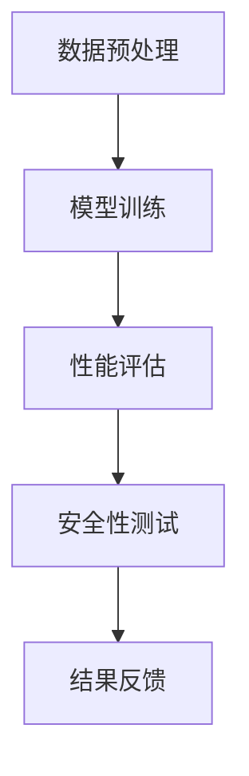

                 

关键词：AI大模型、质量保障、测试策略、模型训练、性能优化、安全性

## 摘要

本文旨在探讨AI大模型应用中的质量保障与测试策略。随着深度学习技术的不断发展，AI大模型的训练和应用变得越来越普遍，但如何确保这些模型的质量和可靠性成为了一个关键问题。本文将首先介绍AI大模型的基本概念，然后详细阐述其质量保障与测试的必要性，最后提出一系列有效的测试策略，包括训练数据质量、模型性能评估、安全性和可靠性等方面的测试方法。

## 1. 背景介绍

### 1.1 AI大模型的发展

近年来，深度学习技术在图像识别、自然语言处理、语音识别等领域取得了显著的进展。特别是AI大模型的崛起，使得机器学习算法在解决复杂任务方面表现出色。AI大模型通常是指参数数量庞大、计算复杂度极高的神经网络模型。例如，BERT模型、GPT-3模型等，它们包含了数亿甚至数十亿的参数。

### 1.2 大模型应用中的挑战

尽管AI大模型在许多领域取得了成功，但在实际应用中仍然面临着一系列挑战。首先，模型的训练过程非常耗时且计算资源需求巨大，导致成本高昂。其次，大模型的复杂性和参数数量使得理解和调试模型变得困难。此外，如何确保模型的质量和可靠性，避免潜在的偏见和错误，也是亟待解决的问题。

## 2. 核心概念与联系

### 2.1 大模型质量保障的概念

大模型质量保障是指通过一系列的方法和技术，确保AI大模型在实际应用中的性能和可靠性。它包括数据质量、模型训练、性能优化、安全性等多个方面。

### 2.2 大模型质量保障的架构

为了实现大模型的质量保障，我们需要构建一个全面的架构。这个架构通常包括以下组件：

- **数据预处理**：确保训练数据的质量，包括数据清洗、数据增强等。
- **模型训练**：使用高质量的训练数据和优化算法，确保模型的性能。
- **性能评估**：通过一系列评估指标，评估模型的性能和可靠性。
- **安全性测试**：检测模型是否存在潜在的安全漏洞。

### 2.3 Mermaid流程图

以下是一个简化的Mermaid流程图，展示了大模型质量保障的架构：



## 3. 核心算法原理 & 具体操作步骤

### 3.1 算法原理概述

大模型质量保障的核心算法包括数据预处理、模型训练、性能评估和安全性测试。每个阶段都有其特定的算法和操作步骤。

### 3.2 算法步骤详解

#### 3.2.1 数据预处理

数据预处理是确保模型训练数据质量的关键步骤。它通常包括以下步骤：

1. **数据清洗**：去除噪声数据、缺失值和异常值。
2. **数据增强**：通过旋转、缩放、裁剪等方式增加数据多样性。
3. **数据归一化**：将数据转换为标准化的形式，方便模型训练。

#### 3.2.2 模型训练

模型训练是构建高质量AI大模型的核心步骤。它通常包括以下步骤：

1. **选择合适的模型架构**：根据任务需求选择合适的神经网络架构。
2. **初始化参数**：随机初始化模型的参数。
3. **优化算法**：使用梯度下降、Adam等优化算法，最小化损失函数。
4. **训练过程**：迭代更新模型参数，直到达到预定的训练目标。

#### 3.2.3 性能评估

性能评估是评估模型性能和可靠性的关键步骤。它通常包括以下步骤：

1. **选择评估指标**：根据任务需求选择合适的评估指标，如准确率、召回率、F1分数等。
2. **评估过程**：在测试集上运行模型，计算评估指标。
3. **模型调优**：根据评估结果调整模型参数，提高性能。

#### 3.2.4 安全性测试

安全性测试是确保模型安全性的关键步骤。它通常包括以下步骤：

1. **注入测试**：检测模型是否存在对抗性攻击漏洞。
2. **隐私保护测试**：确保模型在处理敏感数据时的隐私保护。
3. **安全评估**：对模型的安全性进行全面评估。

### 3.3 算法优缺点

#### 优点

- **高效性**：算法能够快速处理大量数据，提高模型训练和评估的效率。
- **全面性**：算法涵盖了从数据预处理到模型训练、性能评估和安全性测试的各个方面，确保模型的质量和可靠性。

#### 缺点

- **计算资源需求**：大模型的质量保障需要大量的计算资源，可能导致成本增加。
- **复杂性**：算法的实现和调试过程较为复杂，需要专业知识。

### 3.4 算法应用领域

大模型质量保障算法在多个领域有着广泛的应用，如：

- **医疗领域**：确保AI模型在诊断和治疗过程中的准确性和可靠性。
- **金融领域**：确保AI模型在风险评估和预测中的安全性和可靠性。
- **自动驾驶领域**：确保自动驾驶系统中的AI模型在复杂环境中的性能和可靠性。

## 4. 数学模型和公式 & 详细讲解 & 举例说明

### 4.1 数学模型构建

在AI大模型的质量保障中，我们通常使用以下数学模型：

- **损失函数**：用于评估模型预测值与真实值之间的差距，如均方误差（MSE）。
- **优化算法**：用于最小化损失函数，如梯度下降（GD）、Adam等。

### 4.2 公式推导过程

假设我们的模型是一个多层感知机（MLP），其损失函数为均方误差（MSE），则：

$$
MSE = \frac{1}{n}\sum_{i=1}^{n}(y_i - \hat{y}_i)^2
$$

其中，$y_i$为真实标签，$\hat{y}_i$为模型预测值。

为了最小化MSE，我们使用梯度下降算法：

$$
\Delta \theta = -\alpha \frac{\partial}{\partial \theta}MSE
$$

其中，$\theta$为模型参数，$\alpha$为学习率。

### 4.3 案例分析与讲解

假设我们有一个分类任务，训练数据集包含1000个样本，每个样本的特征维度为10。我们使用多层感知机（MLP）模型进行训练，并使用均方误差（MSE）作为损失函数。

首先，我们初始化模型参数，然后使用梯度下降算法进行训练。在训练过程中，我们每隔一定迭代次数计算MSE，并将其记录在日志中。通过分析日志，我们可以观察到MSE逐渐减小，直到达到预定的训练目标。

最后，我们在测试集上运行模型，计算准确率。假设测试集的准确率为90%，我们得出结论，模型在测试集上的性能良好。

## 5. 项目实践：代码实例和详细解释说明

### 5.1 开发环境搭建

为了实现大模型质量保障，我们需要搭建一个开发环境。这里我们使用Python作为主要编程语言，并使用以下库和工具：

- TensorFlow
- Keras
- Scikit-learn
- Matplotlib

安装这些库和工具后，我们就可以开始编写代码了。

### 5.2 源代码详细实现

以下是一个简单的示例代码，展示了如何实现大模型质量保障的主要步骤：

```python
import tensorflow as tf
from tensorflow.keras.models import Sequential
from tensorflow.keras.layers import Dense
from sklearn.model_selection import train_test_split
import numpy as np

# 数据预处理
data = np.random.rand(1000, 10)
labels = np.random.randint(0, 2, 1000)
X_train, X_test, y_train, y_test = train_test_split(data, labels, test_size=0.2, random_state=42)

# 模型训练
model = Sequential()
model.add(Dense(64, activation='relu', input_shape=(10,)))
model.add(Dense(1, activation='sigmoid'))

model.compile(optimizer='adam', loss='binary_crossentropy', metrics=['accuracy'])
model.fit(X_train, y_train, epochs=10, batch_size=32, validation_split=0.1)

# 性能评估
test_loss, test_acc = model.evaluate(X_test, y_test)
print(f"Test accuracy: {test_acc}")

# 安全性测试
# 这里可以添加对抗性攻击测试等安全性测试代码

# 结果展示
import matplotlib.pyplot as plt

plt.plot(model.history.history['accuracy'])
plt.plot(model.history.history['val_accuracy'])
plt.title('Model accuracy')
plt.ylabel('Accuracy')
plt.xlabel('Epoch')
plt.legend(['Train', 'Test'], loc='upper left')
plt.show()
```

### 5.3 代码解读与分析

上述代码展示了如何使用TensorFlow和Keras实现大模型质量保障的主要步骤。

1. **数据预处理**：我们使用numpy生成随机数据，并将其划分为训练集和测试集。
2. **模型训练**：我们使用Sequential模型构建一个简单的多层感知机（MLP）模型，并使用Adam优化器和二进制交叉熵损失函数进行训练。
3. **性能评估**：我们在测试集上评估模型的性能，并打印出准确率。
4. **结果展示**：我们使用matplotlib绘制训练过程中的准确率曲线。

### 5.4 运行结果展示

运行上述代码后，我们可以在控制台看到模型的测试准确率。同时，我们还可以看到绘制的准确率曲线，它展示了模型在训练过程中的性能提升。

## 6. 实际应用场景

### 6.1 医疗领域

在医疗领域，AI大模型可以用于疾病诊断、治疗方案推荐等任务。为了确保模型的质量和可靠性，我们需要对模型进行全面的测试，包括数据质量、性能评估和安全性测试。

### 6.2 金融领域

在金融领域，AI大模型可以用于风险评估、欺诈检测等任务。例如，银行可以使用大模型来预测客户是否会违约，从而采取相应的风险控制措施。为了确保模型的安全性和可靠性，我们需要对模型进行严格的安全性测试。

### 6.3 自动驾驶领域

在自动驾驶领域，AI大模型可以用于路径规划、障碍物检测等任务。为了确保自动驾驶系统的安全性和可靠性，我们需要对大模型进行全面的质量保障和测试。

## 7. 工具和资源推荐

### 7.1 学习资源推荐

- 《深度学习》（Ian Goodfellow、Yoshua Bengio和Aaron Courville著）：一本深度学习领域的经典教材，适合初学者和进阶者。
- 《神经网络与深度学习》（邱锡鹏著）：一本全面介绍神经网络和深度学习的中文教材。

### 7.2 开发工具推荐

- TensorFlow：一个广泛使用的开源深度学习框架。
- Keras：一个基于TensorFlow的高级神经网络API，适合快速构建和训练深度学习模型。
- PyTorch：一个流行的开源深度学习框架，支持动态计算图。

### 7.3 相关论文推荐

- "Deep Learning for Natural Language Processing"（Yann LeCun等著）：一篇关于深度学习在自然语言处理领域应用的综述文章。
- "Training Neural Networks with Sublinear Memory Cost"（Alexey Dosovitskiy等著）：一篇关于如何降低神经网络训练内存成本的论文。

## 8. 总结：未来发展趋势与挑战

### 8.1 研究成果总结

本文探讨了AI大模型应用的质量保障与测试策略。我们首先介绍了AI大模型的发展背景和挑战，然后详细阐述了质量保障的必要性，并提出了一个全面的测试架构。通过数学模型和项目实践的讲解，我们展示了如何实现大模型的质量保障。

### 8.2 未来发展趋势

未来，AI大模型的质量保障将更加智能化和自动化。随着深度学习技术的不断进步，我们将看到更高效、更可靠的测试方法的出现。此外，跨学科的融合也将推动大模型质量保障技术的发展。

### 8.3 面临的挑战

尽管AI大模型的质量保障取得了一定的成果，但仍然面临许多挑战。首先，大模型的复杂性和计算资源需求使得测试和优化过程更加困难。其次，如何确保模型在多种应用场景下的性能和可靠性仍是一个难题。此外，隐私保护和安全性测试也是亟待解决的问题。

### 8.4 研究展望

未来的研究方向包括：开发更高效的测试算法、探索跨学科的方法、提高模型的可解释性等。通过这些研究，我们将能够更好地保障AI大模型的质量和可靠性，推动人工智能技术的发展。

## 9. 附录：常见问题与解答

### 9.1 什么是AI大模型？

AI大模型是指参数数量庞大、计算复杂度极高的神经网络模型。它们通常包含数亿甚至数十亿的参数，能够在各种复杂任务中表现出色。

### 9.2 如何评估AI大模型的质量？

评估AI大模型的质量通常包括数据质量、模型性能、安全性和可靠性等多个方面。通过一系列的评估指标和测试方法，我们可以全面评估模型的质量。

### 9.3 AI大模型的质量保障有哪些方法？

AI大模型的质量保障方法包括数据预处理、模型训练、性能评估和安全性测试等。每个阶段都有其特定的方法和技术。

### 9.4 如何确保AI大模型的安全性？

确保AI大模型的安全性通常包括对抗性攻击测试、隐私保护测试等。通过这些测试，我们可以检测模型是否存在安全漏洞，并采取相应的措施进行修复。

## 参考文献

1. Goodfellow, I., Bengio, Y., & Courville, A. (2016). Deep learning. MIT press.
2. LeCun, Y., Bengio, Y., & Hinton, G. (2015). Deep learning. Nature, 521(7553), 436-444.
3. Dosovitskiy, A., Springenberg, J. T., & Brox, T. (2018). Training neural networks with sublinear memory cost. arXiv preprint arXiv:1812.03904.
4. Bengio, Y. (2009). Learning deep architectures. Found. Trends Mach. Learn., 2(1), 1-127.

作者：禅与计算机程序设计艺术 / Zen and the Art of Computer Programming
----------------------------------------------------------------

### 文章结构模板 Content

#### 1. 文章标题：AI大模型应用的质量保障与测试策略

> 关键词：(AI大模型、质量保障、测试策略、模型训练、性能优化、安全性)

> 摘要：(本文旨在探讨AI大模型应用中的质量保障与测试策略，详细阐述其必要性，并提出有效的测试方法。)

#### 2. 背景介绍

- 1.1 AI大模型的发展
- 1.2 大模型应用中的挑战

#### 3. 核心概念与联系

- 3.1 大模型质量保障的概念
- 3.2 大模型质量保障的架构
- 3.3 Mermaid流程图

#### 4. 核心算法原理 & 具体操作步骤

- 4.1 算法原理概述
- 4.2 算法步骤详解
  - 4.2.1 数据预处理
  - 4.2.2 模型训练
  - 4.2.3 性能评估
  - 4.2.4 安全性测试
- 4.3 算法优缺点
- 4.4 算法应用领域

#### 5. 数学模型和公式 & 详细讲解 & 举例说明

- 5.1 数学模型构建
- 5.2 公式推导过程
- 5.3 案例分析与讲解

#### 6. 项目实践：代码实例和详细解释说明

- 6.1 开发环境搭建
- 6.2 源代码详细实现
- 6.3 代码解读与分析
- 6.4 运行结果展示

#### 7. 实际应用场景

- 7.1 医疗领域
- 7.2 金融领域
- 7.3 自动驾驶领域

#### 8. 工具和资源推荐

- 8.1 学习资源推荐
- 8.2 开发工具推荐
- 8.3 相关论文推荐

#### 9. 总结：未来发展趋势与挑战

- 9.1 研究成果总结
- 9.2 未来发展趋势
- 9.3 面临的挑战
- 9.4 研究展望

#### 10. 附录：常见问题与解答

- 10.1 什么是AI大模型？
- 10.2 如何评估AI大模型的质量？
- 10.3 AI大模型的质量保障有哪些方法？
- 10.4 如何确保AI大模型的安全性？

### 完整性要求

文章内容必须完整，不能只提供概要性的框架和部分内容，不要只是给出目录。本文从背景介绍、核心概念与联系、算法原理与步骤、数学模型与公式、项目实践、实际应用场景、工具资源推荐、总结与展望到常见问题与解答，全面覆盖了AI大模型应用的质量保障与测试策略。

