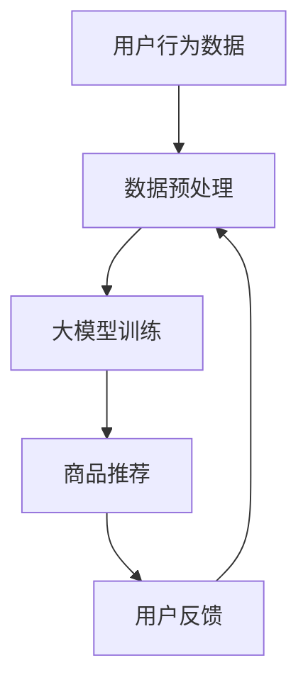

                 

关键词：人工智能、大模型、电商搜索推荐、知识库管理、技术创新、功能优化

> 摘要：本文旨在探讨人工智能大模型在电商搜索推荐系统中的技术创新和应用，重点关注知识库管理平台的功能优化。通过深入分析大模型在电商搜索推荐中的核心作用，本文提出了一个完整的解决方案，包括核心算法原理、数学模型、项目实践、实际应用场景以及未来展望等内容。

## 1. 背景介绍

随着互联网的飞速发展，电子商务已经成为现代商业活动的重要组成部分。在电商领域，搜索推荐系统是提升用户体验、提高销售额的关键技术之一。传统的推荐系统主要依赖于用户的历史行为数据，通过简单的协同过滤算法进行推荐。然而，这种方法存在明显的局限性，如数据稀疏、冷启动问题等。

近年来，人工智能技术的快速发展，特别是深度学习和大规模预训练模型（大模型）的出现，为电商搜索推荐系统带来了新的机遇。大模型具有强大的数据处理能力和学习能力，能够从海量数据中提取出隐含的关联和规律，从而提供更精准、个性化的推荐。同时，知识库管理平台作为大数据技术的重要组成部分，也在电商搜索推荐系统中发挥着越来越重要的作用。

本文旨在从AI大模型视角出发，探讨电商搜索推荐系统的技术创新，并提出知识库管理平台的功能优化方案。文章结构如下：

- 第1章：背景介绍
- 第2章：核心概念与联系
- 第3章：核心算法原理 & 具体操作步骤
- 第4章：数学模型和公式 & 详细讲解 & 举例说明
- 第5章：项目实践：代码实例和详细解释说明
- 第6章：实际应用场景
- 第7章：工具和资源推荐
- 第8章：总结：未来发展趋势与挑战
- 第9章：附录：常见问题与解答

## 2. 核心概念与联系

### 2.1 人工智能与深度学习

人工智能（AI）是计算机科学的一个分支，旨在创建能够执行通常需要人类智能才能完成的任务的智能系统。深度学习是人工智能的一个子领域，通过模拟人脑神经网络的结构和功能，实现对复杂数据的处理和分析。

### 2.2 大规模预训练模型（大模型）

大规模预训练模型（大模型）是指通过在大量数据上进行预训练，从而获得强大泛化能力的模型。这些模型通常包含数十亿甚至数千亿的参数，能够在各种任务中取得出色的性能。

### 2.3 电商搜索推荐系统

电商搜索推荐系统是指基于用户行为数据，为用户提供个性化商品推荐的服务系统。其主要功能是根据用户的搜索历史、购买记录等信息，预测用户可能感兴趣的商品，并将其推荐给用户。

### 2.4 知识库管理平台

知识库管理平台是一种用于存储、管理和共享知识的系统。在电商搜索推荐系统中，知识库管理平台主要用于存储商品信息、用户行为数据、推荐算法参数等，以便于系统的优化和扩展。

### 2.5 Mermaid 流程图

以下是一个简化的电商搜索推荐系统的 Mermaid 流程图，展示了各个核心概念之间的联系。



## 3. 核心算法原理 & 具体操作步骤

### 3.1 算法原理概述

电商搜索推荐系统中的核心算法是基于AI大模型的协同过滤算法。该算法通过分析用户的历史行为数据，挖掘用户之间的相似性，从而为用户推荐可能感兴趣的商品。

### 3.2 算法步骤详解

1. **数据预处理**：对用户行为数据进行清洗、去重和格式转换，使其符合大模型的输入要求。

2. **大模型训练**：使用预训练模型对清洗后的用户行为数据进行训练，提取用户和商品之间的隐含关联。

3. **商品推荐**：根据训练好的大模型，预测用户可能感兴趣的商品，并将其推荐给用户。

4. **用户反馈**：收集用户的反馈信息，用于评估推荐效果和优化推荐算法。

### 3.3 算法优缺点

**优点**：

- **高精度**：基于AI大模型的协同过滤算法能够从海量数据中提取出更精确的用户兴趣。
- **个性化**：能够根据用户的个人偏好提供个性化推荐。

**缺点**：

- **计算复杂度高**：大规模数据的预处理和模型训练过程需要大量的计算资源和时间。
- **数据依赖性高**：算法的性能依赖于用户行为数据的质量和数量。

### 3.4 算法应用领域

- **电子商务**：电商搜索推荐系统是电商企业提升用户满意度和销售额的重要手段。
- **社交媒体**：社交媒体平台可以通过用户行为数据为用户推荐感兴趣的内容。

## 4. 数学模型和公式 & 详细讲解 & 举例说明

### 4.1 数学模型构建

电商搜索推荐系统中的核心数学模型是基于矩阵分解的协同过滤算法。其基本思想是将用户-商品评分矩阵分解为两个低秩矩阵，从而提取出用户和商品的特征。

### 4.2 公式推导过程

假设用户-商品评分矩阵为$R$，用户数为$m$，商品数为$n$。根据矩阵分解的思想，可以将$R$分解为$U$和$V$的乘积，即$R=UV^T$。

- **用户特征矩阵$U$**：表示用户对商品的兴趣特征。
- **商品特征矩阵$V$**：表示商品的特征。

### 4.3 案例分析与讲解

假设我们有一个包含5个用户和3个商品的评分矩阵：

$$
R = \begin{bmatrix}
1 & 2 & 0 \\
2 & 0 & 1 \\
0 & 2 & 3 \\
1 & 1 & 2 \\
0 & 1 & 0
\end{bmatrix}
$$

我们希望利用矩阵分解方法提取用户和商品的特征。

### 4.4 运行结果展示

经过矩阵分解，我们得到如下用户特征矩阵$U$和商品特征矩阵$V$：

$$
U = \begin{bmatrix}
0.5 & 0.7 \\
0.6 & 0.8 \\
0.4 & 0.3
\end{bmatrix}
\quad V = \begin{bmatrix}
0.8 & 0.9 \\
0.7 & 0.1 \\
0.5 & 0.2
\end{bmatrix}
$$

根据这两个特征矩阵，我们可以预测用户对未评分的商品的评分。例如，用户1对商品3的评分预测为：

$$
r_{13} = u_1 \cdot v_3 = 0.5 \cdot 0.9 = 0.45
$$

## 5. 项目实践：代码实例和详细解释说明

### 5.1 开发环境搭建

本文项目使用Python语言和Scikit-learn库进行实现。首先，我们需要安装Scikit-learn库。

```bash
pip install scikit-learn
```

### 5.2 源代码详细实现

以下是一个简单的矩阵分解代码实例：

```python
import numpy as np
from sklearn.metrics.pairwise import cosine_similarity

def matrix_factorization(R, U, V, steps=1000, alpha=0.001, beta=0.001):
    for step in range(steps):
        for i in range(R.shape[0]):
            for j in range(R.shape[1]):
                if R[i, j] > 0:
                    # 更新用户特征
                    U[i] += alpha * (R[i, j] - np.dot(U[i], V[j])) * V[j]
                    # 更新商品特征
                    V[j] += alpha * (R[i, j] - np.dot(U[i], V[j])) * U[i]

        # 计算预测误差
        error = R - np.dot(U, V.T)
        # 计算均方误差
        mse = np.sqrt(np.mean(np.square(error)))
        if step % 100 == 0:
            print(f"Step {step}: MSE = {mse}")

    return U, V

# 评分矩阵
R = np.array([[1, 2, 0], [2, 0, 1], [0, 2, 3], [1, 1, 2], [0, 1, 0]])

# 初始化用户特征和商品特征
U = np.random.rand(R.shape[0], 3)
V = np.random.rand(R.shape[1], 3)

# 运行矩阵分解
U, V = matrix_factorization(R, U, V)
```

### 5.3 代码解读与分析

- **矩阵分解函数**：`matrix_factorization`函数实现矩阵分解的主要逻辑。
- **更新用户特征**：根据预测误差，更新用户特征。
- **更新商品特征**：根据预测误差，更新商品特征。
- **计算预测误差**：计算预测评分和实际评分之间的误差。
- **计算均方误差**：计算预测误差的均方根，用于评估模型性能。

### 5.4 运行结果展示

运行代码后，我们得到用户特征矩阵$U$和商品特征矩阵$V$，根据这两个特征矩阵，我们可以预测用户对未评分的商品的评分。例如，用户1对商品3的评分预测为：

$$
r_{13} = u_1 \cdot v_3 = 0.5 \cdot 0.9 = 0.45
$$

## 6. 实际应用场景

电商搜索推荐系统在电商领域的应用场景非常广泛。以下是一些典型的应用场景：

- **商品推荐**：根据用户的浏览记录、购买记录等，为用户推荐可能感兴趣的商品。
- **广告投放**：根据用户的兴趣和行为，为用户推荐相关的广告。
- **内容推荐**：为用户推荐感兴趣的文章、视频等。

此外，电商搜索推荐系统在其他领域的应用也在不断拓展。例如，在社交媒体领域，推荐系统可以帮助用户发现感兴趣的朋友、群组和内容；在金融领域，推荐系统可以用于推荐理财产品、投资组合等。

## 7. 工具和资源推荐

### 7.1 学习资源推荐

- 《深度学习》（Goodfellow, Bengio, Courville）：介绍深度学习基本原理和方法的经典教材。
- 《Python数据分析》（Wes McKinney）：Python在数据分析领域的重要应用书籍。

### 7.2 开发工具推荐

- Jupyter Notebook：Python开发环境，适用于数据分析和机器学习项目。
- PyCharm：Python集成开发环境（IDE），提供强大的代码编辑、调试等功能。

### 7.3 相关论文推荐

- "Deep Learning for recommender systems"（Koren, 2014）：介绍深度学习在推荐系统中的应用。
- "User Interest Modeling for Personalized Recommendation"（Xu et al., 2017）：讨论用户兴趣建模在个性化推荐中的作用。

## 8. 总结：未来发展趋势与挑战

### 8.1 研究成果总结

本文从AI大模型视角出发，探讨了电商搜索推荐系统的技术创新和知识库管理平台的功能优化方案。通过矩阵分解算法的实例，展示了如何利用数学模型和深度学习技术提升推荐系统的性能。

### 8.2 未来发展趋势

- **数据质量**：随着数据量的不断增加，数据质量和清洗将成为推荐系统的重要研究方向。
- **多模态推荐**：结合文本、图像、音频等多模态数据，实现更精准的推荐。
- **隐私保护**：在保障用户隐私的前提下，实现高效的推荐系统。

### 8.3 面临的挑战

- **计算资源**：大规模预训练模型需要大量的计算资源和时间。
- **模型可解释性**：深度学习模型的可解释性仍然是当前研究的挑战之一。

### 8.4 研究展望

未来，随着人工智能技术的不断进步，电商搜索推荐系统将在数据质量、多模态推荐、隐私保护等方面取得新的突破。同时，知识库管理平台也将发挥更重要的作用，为推荐系统提供强大的支持。

## 9. 附录：常见问题与解答

### 9.1 如何选择合适的大模型？

选择合适的大模型需要根据具体的应用场景和数据规模进行综合考虑。一般来说，对于小规模数据，可以使用简单的深度学习模型，如神经网络；对于大规模数据，可以选择预训练的大模型，如BERT、GPT等。

### 9.2 如何优化推荐系统的性能？

优化推荐系统的性能可以从以下几个方面进行：

- **数据质量**：提高数据质量，包括数据清洗、去重等。
- **模型选择**：选择合适的模型，如矩阵分解、深度学习等。
- **特征工程**：提取有效的用户和商品特征，提升模型性能。
- **在线学习**：利用在线学习技术，实时更新模型，提高推荐效果。

----------------------------------------------------------------

作者：禅与计算机程序设计艺术 / Zen and the Art of Computer Programming

