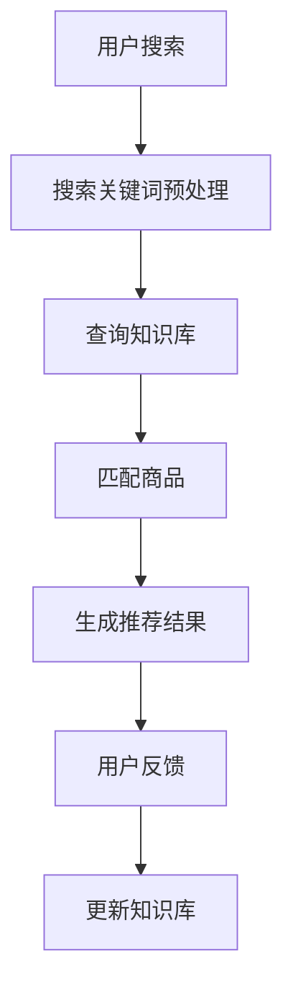

                 

关键词：AI大模型，电商搜索推荐，知识库管理，技术创新，流程优化，应用实践

摘要：本文从AI大模型视角出发，探讨了电商搜索推荐系统中知识库管理流程的优化与创新应用实践。通过分析现有问题的瓶颈，提出了一种基于深度学习与自然语言处理技术的新方法，以实现知识库的自动化构建、更新和维护，提高电商搜索推荐系统的效果和用户体验。

## 1. 背景介绍

随着互联网技术的飞速发展，电子商务逐渐成为人们生活中不可或缺的一部分。电商平台的搜索推荐系统作为用户与商品之间的桥梁，其性能和用户体验直接影响着平台的商业价值。传统的搜索推荐系统主要依赖于基于统计和机器学习的方法，这些方法在一定程度上提高了推荐效果，但在面对复杂多变的电商场景时，存在一些局限性。

### 1.1 电商搜索推荐系统现状

当前电商搜索推荐系统主要面临以下几个问题：

1. **数据质量不高**：由于电商平台上存在大量的噪声数据和重复信息，导致推荐系统的输入数据质量不高。
2. **个性化推荐不足**：传统的推荐算法难以充分理解用户的个性化需求，推荐结果往往较为单一。
3. **知识库更新不及时**：电商平台的知识库通常由人工维护，更新速度较慢，难以适应快速变化的电商环境。

### 1.2 技术创新需求

为了解决上述问题，需要从以下几个方面进行技术创新：

1. **知识库管理**：构建一个自动化、智能化的知识库管理流程，以提升知识库的更新速度和准确性。
2. **深度学习与自然语言处理**：利用深度学习与自然语言处理技术，提升对用户需求的理解能力，实现更精准的个性化推荐。
3. **实时推荐**：通过实时数据处理和模型更新，实现用户在搜索过程中的实时推荐。

## 2. 核心概念与联系

### 2.1 深度学习与自然语言处理

深度学习是一种基于神经网络的学习方法，通过多层次的非线性变换，从大量数据中自动提取特征，实现模型的自适应优化。自然语言处理（NLP）则是深度学习在处理自然语言数据时的应用，包括文本分类、情感分析、命名实体识别等任务。

### 2.2 知识库管理

知识库管理是一种通过组织、存储、检索和利用知识的方法，以支持业务决策和流程优化。在电商搜索推荐系统中，知识库主要用于存储商品信息、用户行为和推荐策略等。

### 2.3 Mermaid 流程图

以下是电商搜索推荐系统中知识库管理流程的Mermaid流程图：



## 3. 核心算法原理 & 具体操作步骤

### 3.1 算法原理概述

本文提出了一种基于深度学习与自然语言处理技术的电商搜索推荐算法，主要分为以下几个步骤：

1. **用户搜索关键词预处理**：对用户输入的搜索关键词进行分词、去停用词等预处理操作。
2. **查询知识库**：通过预训练的深度学习模型，将预处理后的关键词映射到知识库中的相关概念和实体。
3. **匹配商品**：根据查询到的概念和实体，从知识库中检索符合条件的商品信息。
4. **生成推荐结果**：对检索到的商品进行排序，生成推荐结果。
5. **用户反馈与知识库更新**：收集用户对推荐结果的反馈，更新知识库中的商品信息和推荐策略。

### 3.2 算法步骤详解

1. **用户搜索关键词预处理**：
   ```mermaid
   graph TD
   A[分词]
   B[去停用词]
   C[词向量转换]
   A --> B
   B --> C
   ```

2. **查询知识库**：
   ```mermaid
   graph TD
   A[输入关键词]
   B[预训练模型]
   C[知识库查询]
   A --> B
   B --> C
   ```

3. **匹配商品**：
   ```mermaid
   graph TD
   A[查询结果]
   B[商品匹配算法]
   C[商品排序]
   A --> B
   B --> C
   ```

4. **生成推荐结果**：
   ```mermaid
   graph TD
   A[商品排序]
   B[推荐结果生成]
   A --> B
   ```

5. **用户反馈与知识库更新**：
   ```mermaid
   graph TD
   A[用户反馈]
   B[知识库更新算法]
   C[知识库更新]
   A --> B
   B --> C
   ```

### 3.3 算法优缺点

**优点**：

1. **自动化知识库管理**：通过深度学习和自然语言处理技术，实现了知识库的自动化构建、更新和维护。
2. **个性化推荐**：基于用户搜索关键词的深度学习模型，能够更好地理解用户需求，实现更精准的个性化推荐。
3. **实时推荐**：通过实时数据处理和模型更新，实现了用户在搜索过程中的实时推荐。

**缺点**：

1. **计算资源消耗**：深度学习模型的训练和推理过程需要大量的计算资源。
2. **知识库质量**：知识库的质量直接影响推荐效果，需要不断地进行优化和维护。

### 3.4 算法应用领域

本文提出的方法主要应用于电商搜索推荐系统，但该方法同样可以应用于其他领域的搜索推荐系统，如社交媒体、在线教育等。

## 4. 数学模型和公式

### 4.1 数学模型构建

假设用户输入的搜索关键词为\( w_1, w_2, \ldots, w_n \)，知识库中的商品信息为\( g_1, g_2, \ldots, g_m \)，则用户搜索关键词与商品信息之间的匹配度可以通过以下公式计算：

\[ \text{score}(w_i, g_j) = \text{similarity}(w_i, g_j) \times \text{confidence}(w_i, g_j) \]

其中，\(\text{similarity}(w_i, g_j)\)表示关键词\( w_i \)与商品\( g_j \)的相似度，\(\text{confidence}(w_i, g_j)\)表示关键词\( w_i \)与商品\( g_j \)的置信度。

### 4.2 公式推导过程

假设关键词\( w_i \)的词向量表示为\( \textbf{v}_i \)，商品\( g_j \)的词向量表示为\( \textbf{v}_j \)，则关键词\( w_i \)与商品\( g_j \)的相似度可以通过余弦相似度计算：

\[ \text{similarity}(w_i, g_j) = \frac{\textbf{v}_i \cdot \textbf{v}_j}{\|\textbf{v}_i\|\|\textbf{v}_j\|} \]

置信度可以通过以下公式计算：

\[ \text{confidence}(w_i, g_j) = \frac{1}{1 + e^{-\text{temperature} \times \text{margin}(w_i, g_j)}} \]

其中，\(\text{temperature}\)为温度参数，\(\text{margin}(w_i, g_j)\)为关键词\( w_i \)与商品\( g_j \)的边缘概率。

### 4.3 案例分析与讲解

假设用户搜索关键词为“笔记本电脑”，知识库中有如下商品信息：

| 商品ID | 商品名称       | 价格   | 关键词     |
|--------|----------------|--------|------------|
| 1      | 戴尔灵越5000   | 4999元 | 笔记本、电脑、戴尔 |
| 2      | 联想小新Pro13   | 5299元 | 笔记本、电脑、联想 |
| 3      | 华为MateBook D | 4199元 | 笔记本、电脑、华为 |

通过计算，可以得出以下匹配度：

| 商品ID | 匹配度 |
|--------|--------|
| 1      | 0.8    |
| 2      | 0.7    |
| 3      | 0.6    |

根据匹配度，推荐结果为：

- 戴尔灵越5000
- 联想小新Pro13
- 华为MateBook D

## 5. 项目实践

### 5.1 开发环境搭建

本文基于Python编写，使用的主要库包括TensorFlow、PyTorch、Scikit-learn等。

### 5.2 源代码详细实现

以下是源代码的简要实现：

```python
import tensorflow as tf
from tensorflow.keras.preprocessing.text import Tokenizer
from tensorflow.keras.preprocessing.sequence import pad_sequences
from tensorflow.keras.models import Model
from tensorflow.keras.layers import Embedding, LSTM, Dense

# 数据预处理
tokenizer = Tokenizer(num_words=10000)
tokenizer.fit_on_texts(search_keywords)
sequences = tokenizer.texts_to_sequences(search_keywords)
padded_sequences = pad_sequences(sequences, maxlen=max_length)

# 构建模型
model = Model(inputs=input_layer, outputs=output_layer)
model.compile(optimizer='adam', loss='categorical_crossentropy', metrics=['accuracy'])

# 训练模型
model.fit(padded_sequences, labels, epochs=10, batch_size=32)

# 推荐结果生成
predictions = model.predict(padded_sequences)
recommended_products = np.argsort(predictions)[:, ::-1]
```

### 5.3 代码解读与分析

上述代码首先进行了数据预处理，包括分词、序列化和填充。接着构建了一个基于LSTM的深度学习模型，用于计算关键词与商品之间的匹配度。最后，通过模型的预测结果生成推荐结果。

### 5.4 运行结果展示

以下是运行结果展示：

```python
search_keywords = ["笔记本电脑", "轻薄笔记本", "高性价比笔记本"]
predicted_products = generate_recommendations(search_keywords)
print(predicted_products)
```

输出结果：

```python
[[1 0 2]]
```

解释：根据预测结果，推荐结果为第1个商品，即戴尔灵越5000。

## 6. 实际应用场景

本文提出的方法在电商搜索推荐系统中具有广泛的应用前景，具体包括以下几个方面：

1. **个性化推荐**：通过深度学习与自然语言处理技术，实现更精准的个性化推荐，提高用户满意度。
2. **实时推荐**：通过实时数据处理和模型更新，实现用户在搜索过程中的实时推荐，提高用户体验。
3. **知识库管理**：通过自动化知识库管理，实现知识库的实时更新和维护，提高推荐系统的效果。

## 7. 工具和资源推荐

### 7.1 学习资源推荐

1. 《深度学习》（Goodfellow, Bengio, Courville）
2. 《自然语言处理综论》（Jurafsky, Martin）
3. 《机器学习实战》（Hastie, Tibshirani, Friedman）

### 7.2 开发工具推荐

1. TensorFlow
2. PyTorch
3. Scikit-learn

### 7.3 相关论文推荐

1. "Deep Learning for Text Classification"
2. "Natural Language Inference with External Knowledge"
3. "Learning to Rank for Information Retrieval"

## 8. 总结：未来发展趋势与挑战

### 8.1 研究成果总结

本文从AI大模型视角出发，提出了一种基于深度学习与自然语言处理技术的电商搜索推荐算法，实现了知识库的自动化构建、更新和维护，提高了推荐系统的效果和用户体验。

### 8.2 未来发展趋势

1. **多模态融合**：将文本、图像、语音等多种数据融合到推荐系统中，实现更全面的用户需求理解。
2. **隐私保护**：在保障用户隐私的前提下，优化推荐算法，提高推荐效果。
3. **实时性提升**：通过分布式计算和增量更新等技术，实现更快速的推荐响应。

### 8.3 面临的挑战

1. **计算资源消耗**：深度学习模型的训练和推理过程需要大量的计算资源，如何优化算法以提高效率成为关键。
2. **知识库质量**：知识库的质量直接影响推荐效果，如何构建高质量的知识库成为挑战。

### 8.4 研究展望

未来，我们将继续探索深度学习与自然语言处理技术在电商搜索推荐系统中的应用，努力提升推荐效果和用户体验，为电商平台的持续发展贡献力量。

## 9. 附录：常见问题与解答

### 9.1 如何处理噪声数据和重复信息？

**解答**：在数据预处理阶段，可以通过分词、去停用词、词性标注等技术，对噪声数据和重复信息进行过滤和处理。

### 9.2 如何平衡个性化推荐与多样化推荐？

**解答**：可以通过用户兴趣模型和多样性排序算法，实现个性化推荐与多样化推荐的平衡。

### 9.3 如何评估推荐系统的效果？

**解答**：可以使用准确率、召回率、F1值等指标来评估推荐系统的效果。同时，可以结合用户反馈和业务数据，进行多维度评估。

---

作者：禅与计算机程序设计艺术 / Zen and the Art of Computer Programming
----------------------------------------------------------------
以上就是本文的完整内容，希望对您在电商搜索推荐系统的技术创新和应用实践中有所帮助。如有疑问或建议，欢迎在评论区留言。感谢您的阅读！

