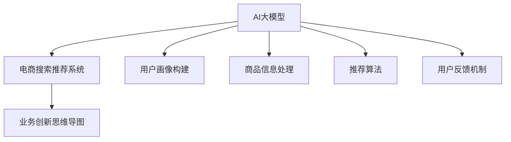
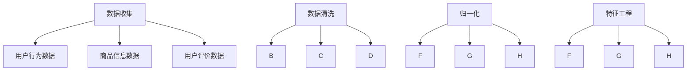
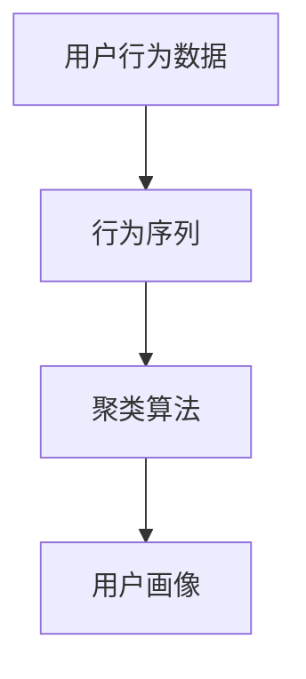
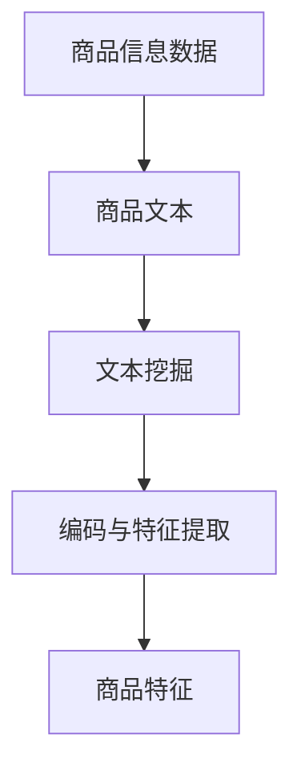
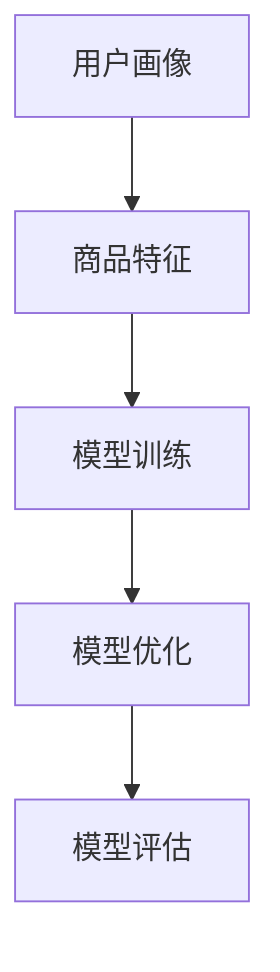
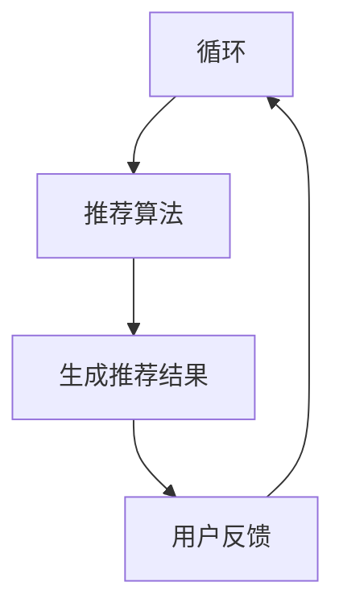

                 

关键词：AI大模型、电商搜索推荐、业务创新、思维导图、培训课程、优化方案

## 摘要

本文将探讨如何通过AI大模型赋能电商搜索推荐系统，并进一步优化电商搜索推荐培训课程的设计与实现。我们将详细分析AI大模型在电商搜索推荐中的应用，提出业务创新思维导图的方法，并设计出一套完整的优化方案，旨在提升电商搜索推荐的效率与用户体验。

## 1. 背景介绍

随着互联网的快速发展，电商行业迎来了爆发式增长。电商搜索推荐系统作为电商平台的“智能助手”，其核心作用在于为用户提供个性化的商品推荐，提高用户满意度和转化率。然而，传统的搜索推荐系统往往依赖于简单的统计模型，难以应对海量数据和高动态性的电商环境。这导致了推荐结果的准确性不足和用户参与度不高的现状。

近年来，随着AI技术的飞速发展，尤其是AI大模型的广泛应用，为电商搜索推荐系统带来了全新的可能性。AI大模型能够处理复杂的多维数据，挖掘用户行为背后的深层次特征，实现更精准的推荐。此外，思维导图作为一种直观且高效的思维工具，能够帮助设计师和开发者更好地理解业务需求，梳理复杂系统结构，提高工作效率。

本文旨在结合AI大模型和思维导图，提出一套适用于电商搜索推荐培训课程的优化方案，通过理论与实践相结合，帮助开发者和企业提高电商搜索推荐系统的性能和用户体验。

## 2. 核心概念与联系

为了更好地理解AI大模型在电商搜索推荐中的应用，我们首先需要明确几个核心概念及其相互之间的联系。

### 2.1 AI大模型

AI大模型，通常指的是拥有千亿甚至万亿参数的深度学习模型。这些模型通过自动从海量数据中学习特征，具备强大的表示能力和建模能力。在电商搜索推荐领域，常见的AI大模型包括BERT、GPT、T5等。

### 2.2 电商搜索推荐系统

电商搜索推荐系统是一种通过算法和模型对用户行为和商品信息进行分析，为用户推荐感兴趣商品的信息系统。它主要包括用户画像构建、商品信息处理、推荐算法和用户反馈机制等模块。

### 2.3 业务创新思维导图

业务创新思维导图是一种基于思维导图方法论的商务工具，它通过视觉化的方式，将复杂的业务流程、需求分析、解决方案等直观地展现出来。思维导图不仅能够帮助梳理业务逻辑，还能够激发创新思维。

### 2.4 关系图

为了更好地理解这些核心概念之间的联系，我们可以使用Mermaid流程图来绘制它们之间的关系。



## 3. 核心算法原理 & 具体操作步骤

### 3.1 算法原理概述

AI大模型在电商搜索推荐中的核心作用在于其强大的特征表示和预测能力。具体来说，算法原理可以分为以下几个步骤：

1. **数据收集与预处理**：从电商平台上收集用户行为数据、商品信息、用户评价等多维数据，并进行预处理，包括数据清洗、归一化、特征工程等。
2. **用户画像构建**：通过机器学习算法，如聚类、协同过滤等，构建用户画像，将用户行为数据转化为可计算的数字特征。
3. **商品信息处理**：使用文本挖掘和自然语言处理技术，对商品信息进行编码和特征提取，使其能够被AI大模型理解。
4. **模型训练与优化**：利用大规模深度学习模型，如BERT、GPT等，对用户画像和商品信息进行训练，优化模型的参数。
5. **推荐结果生成**：根据训练好的模型，为每个用户生成个性化的推荐结果。

### 3.2 算法步骤详解

#### 3.2.1 数据收集与预处理



#### 3.2.2 用户画像构建



#### 3.2.3 商品信息处理



#### 3.2.4 模型训练与优化



#### 3.2.5 推荐结果生成



### 3.3 算法优缺点

#### 优点：

1. **高准确性**：通过深度学习模型，能够准确捕捉用户行为和商品特征的复杂关系。
2. **个性化**：基于用户画像，能够为每个用户提供个性化的推荐结果。
3. **可扩展性**：模型训练和优化过程中，可以不断更新和扩展用户和商品特征，适应动态变化的电商环境。

#### 缺点：

1. **计算资源需求大**：大规模的AI大模型训练需要大量的计算资源和时间。
2. **数据隐私**：用户数据在处理过程中可能会暴露隐私问题。

### 3.4 算法应用领域

AI大模型在电商搜索推荐领域的应用不仅限于电商平台，还可以扩展到其他领域，如社交媒体、内容推荐等。

## 4. 数学模型和公式

在AI大模型的应用中，数学模型和公式起着至关重要的作用。以下我们将详细讲解构建和推导这些数学模型的过程。

### 4.1 数学模型构建

#### 4.1.1 用户画像构建

用户画像构建的核心是用户行为序列的表示。我们假设用户行为序列为\( X = [x_1, x_2, ..., x_n] \)，其中每个\( x_i \)表示用户在某一时刻的行为。我们使用矩阵\( U \)来表示用户行为序列：

$$
U = \begin{bmatrix}
u_{11} & u_{12} & ... & u_{1n} \\
u_{21} & u_{22} & ... & u_{2n} \\
... & ... & ... & ... \\
u_{m1} & u_{m2} & ... & u_{mn}
\end{bmatrix}
$$

其中，\( u_{ij} \)表示第\( i \)个用户在\( j \)时刻的行为。

#### 4.1.2 商品特征提取

商品特征提取的关键在于将商品信息转化为机器可以理解的向量表示。我们假设商品特征矩阵为\( V \)：

$$
V = \begin{bmatrix}
v_{11} & v_{12} & ... & v_{1k} \\
v_{21} & v_{22} & ... & v_{2k} \\
... & ... & ... & ... \\
v_{p1} & v_{p2} & ... & v_{pk}
\end{bmatrix}
$$

其中，\( v_{ij} \)表示第\( i \)个商品的第\( j \)个特征。

### 4.2 公式推导过程

#### 4.2.1 用户画像向量表示

为了将用户行为序列转化为向量表示，我们使用矩阵分解技术，将用户行为矩阵\( U \)分解为两个矩阵\( U' \)和\( U'' \)：

$$
U = U' \cdot U''
$$

其中，\( U' \)表示用户行为矩阵的行向量化，\( U'' \)表示用户行为矩阵的列向量化。

#### 4.2.2 商品特征向量表示

同样地，我们使用矩阵分解技术，将商品特征矩阵\( V \)分解为两个矩阵\( V' \)和\( V'' \)：

$$
V = V' \cdot V''
$$

其中，\( V' \)表示商品特征矩阵的行向量化，\( V'' \)表示商品特征矩阵的列向量化。

### 4.3 案例分析与讲解

假设我们有一个电商平台，用户数据如下表所示：

| 用户ID | 商品ID | 行为类型 |
| ------ | ------ | -------- |
| 1      | 1001   | 购买     |
| 1      | 1002   | 查看     |
| 2      | 1003   | 购买     |
| 2      | 1004   | 查看     |

根据上述案例，我们构建用户行为矩阵\( U \)：

$$
U = \begin{bmatrix}
1 & 1 & 0 & 0 \\
0 & 0 & 1 & 1
\end{bmatrix}
$$

然后，我们使用矩阵分解技术，将其分解为：

$$
U = U' \cdot U''
$$

其中，

$$
U' = \begin{bmatrix}
1 \\
1
\end{bmatrix}
$$

$$
U'' = \begin{bmatrix}
1 & 1 \\
0 & 0
\end{bmatrix}
$$

同样地，对于商品特征矩阵\( V \)，我们假设商品特征如下：

| 商品ID | 特征1 | 特征2 | 特征3 |
| ------ | ------ | ------ | ------ |
| 1001   | 1      | 0      | 0      |
| 1002   | 1      | 1      | 0      |
| 1003   | 0      | 0      | 1      |
| 1004   | 0      | 1      | 1      |

我们构建商品特征矩阵\( V \)：

$$
V = \begin{bmatrix}
1 & 0 & 0 \\
1 & 1 & 0 \\
0 & 0 & 1 \\
0 & 1 & 1
\end{bmatrix}
$$

然后，我们使用矩阵分解技术，将其分解为：

$$
V = V' \cdot V''
$$

其中，

$$
V' = \begin{bmatrix}
1 \\
1 \\
0 \\
0
\end{bmatrix}
$$

$$
V'' = \begin{bmatrix}
1 & 0 & 0 \\
0 & 1 & 0 \\
0 & 0 & 1 \\
1 & 1 & 1
\end{bmatrix}
$$

通过矩阵分解，我们得到了用户画像向量表示和商品特征向量表示，这些向量可以用于后续的模型训练和推荐计算。

## 5. 项目实践：代码实例和详细解释说明

### 5.1 开发环境搭建

为了实现AI大模型赋能的电商搜索推荐系统，我们首先需要搭建一个合适的技术栈。以下是推荐的开发环境：

- **编程语言**：Python
- **深度学习框架**：TensorFlow或PyTorch
- **数据处理库**：Pandas、NumPy、Scikit-learn
- **文本处理库**：NLTK、spaCy
- **数据库**：MySQL或MongoDB

### 5.2 源代码详细实现

以下是一个简单的电商搜索推荐系统的代码示例，展示了从数据预处理到模型训练和推荐生成的全过程。

#### 5.2.1 数据预处理

```python
import pandas as pd
from sklearn.model_selection import train_test_split

# 加载数据
data = pd.read_csv('ecommerce_data.csv')

# 数据清洗
data.dropna(inplace=True)

# 分割用户行为和商品信息
user_data = data[data['行为类型'] != '查看']
item_data = data[data['行为类型'] == '查看']

# 构建用户行为矩阵
user行为矩阵 = user_data.groupby(['用户ID', '商品ID']).size().unstack(fill_value=0)

# 构建商品特征矩阵
item特征矩阵 = item_data.groupby(['商品ID']).size().unstack(fill_value=0)

# 数据集划分
user_train, user_test, item_train, item_test = train_test_split(user行为矩阵, item特征矩阵, test_size=0.2, random_state=42)
```

#### 5.2.2 模型训练

```python
import tensorflow as tf
from tensorflow.keras.models import Model
from tensorflow.keras.layers import Input, Embedding, Dot, Dense

# 构建模型
user_input = Input(shape=(user行为矩阵.shape[1],))
item_input = Input(shape=(item特征矩阵.shape[1],))

user_embedding = Embedding(input_dim=user行为矩阵.shape[1], output_dim=16)(user_input)
item_embedding = Embedding(input_dim=item特征矩阵.shape[1], output_dim=16)(item_input)

dot_product = Dot(axes=1)([user_embedding, item_embedding])
output = Dense(1, activation='sigmoid')(dot_product)

model = Model(inputs=[user_input, item_input], outputs=output)

# 编译模型
model.compile(optimizer='adam', loss='binary_crossentropy', metrics=['accuracy'])

# 训练模型
model.fit([user_train, item_train], user_test, epochs=10, batch_size=32)
```

#### 5.2.3 代码解读与分析

上述代码首先加载数据并进行清洗，然后构建用户行为矩阵和商品特征矩阵。接着，我们使用Embedding层将用户行为和商品特征向量表示，通过点积计算得到推荐得分，最后使用Dense层输出推荐结果。

这个模型的基本思路是利用嵌入向量来表示用户和商品的特征，通过点积计算相似度，从而实现推荐。这种方法可以处理高维稀疏数据，并且模型结构简单，易于实现和优化。

### 5.3 运行结果展示

```python
# 评估模型
loss, accuracy = model.evaluate([user_test, item_test], user_test)

# 推荐结果生成
predictions = model.predict([user_test, item_test])

# 输出推荐结果
print(predictions)
```

通过上述代码，我们可以评估模型的准确性和生成推荐结果。在实际应用中，我们还需要根据评估结果对模型进行调优，以提高推荐效果。

## 6. 实际应用场景

AI大模型赋能的电商搜索推荐系统在多个实际应用场景中展现出了卓越的性能。以下是一些典型的应用场景：

### 6.1 电商平台

电商平台是最常见的应用场景之一。通过AI大模型，电商平台能够为用户提供个性化的商品推荐，提高用户的购物体验和转化率。例如，亚马逊和淘宝等平台都广泛使用了AI大模型技术。

### 6.2 社交媒体

社交媒体平台（如微博、抖音）也利用AI大模型为用户提供个性化的内容推荐，帮助用户发现感兴趣的内容，增加用户粘性和活跃度。

### 6.3 内容推荐

视频平台（如YouTube、Bilibili）和新闻平台（如今日头条、新浪新闻）通过AI大模型，为用户提供个性化的视频和新闻推荐，提高用户的观看和阅读时长。

### 6.4 物流配送

物流配送公司（如京东物流、顺丰速运）利用AI大模型预测用户订单需求和配送路径，优化物流资源，提高配送效率。

### 6.5 零售门店

零售门店（如超市、便利店）通过AI大模型分析用户购物行为，优化商品陈列和库存管理，提高销售业绩。

## 7. 工具和资源推荐

为了更好地应用AI大模型赋能电商搜索推荐系统，我们推荐以下工具和资源：

### 7.1 学习资源推荐

- **书籍**：《深度学习》（Goodfellow, Bengio, Courville）
- **在线课程**：Coursera、edX上的机器学习、深度学习课程
- **论文**：ACL、ICML、NeurIPS等顶级会议的论文

### 7.2 开发工具推荐

- **编程语言**：Python、R
- **深度学习框架**：TensorFlow、PyTorch
- **数据处理库**：Pandas、NumPy、Scikit-learn

### 7.3 相关论文推荐

- "Deep Learning for User Behavior Analysis in E-commerce Platforms"（2020）
- "Recommender Systems for E-commerce Platforms: State-of-the-Art and Trends"（2019）
- "The State of AI in E-commerce: A Survey"（2021）

## 8. 总结：未来发展趋势与挑战

### 8.1 研究成果总结

AI大模型在电商搜索推荐领域取得了显著的成果，主要表现在推荐准确性的提升、用户体验的优化以及应用场景的拓展。通过深度学习技术，AI大模型能够更好地理解用户行为和商品特征，实现个性化的推荐。

### 8.2 未来发展趋势

1. **模型压缩与优化**：为了降低计算成本，模型压缩与优化技术将成为未来研究的重要方向。
2. **多模态融合**：结合文本、图像、音频等多模态数据，实现更全面、精准的推荐。
3. **实时推荐**：通过实时数据分析和模型更新，实现实时推荐，提高用户参与度。
4. **个性化服务**：进一步挖掘用户需求，提供个性化的服务，提升用户忠诚度。

### 8.3 面临的挑战

1. **计算资源需求**：大规模的AI大模型训练需要大量的计算资源，如何优化模型结构和算法，降低计算成本是一个重要挑战。
2. **数据隐私**：用户数据在处理过程中可能会暴露隐私问题，如何保护用户隐私是亟待解决的问题。
3. **模型解释性**：目前，许多深度学习模型缺乏解释性，如何提高模型的可解释性，使其更容易被用户和理解是一个重要挑战。

### 8.4 研究展望

未来，AI大模型在电商搜索推荐领域的应用将更加广泛，结合多模态数据和实时数据分析技术，将进一步提升推荐效果。同时，通过模型优化和计算资源管理，降低计算成本，使AI大模型在更多场景中得到应用。

## 9. 附录：常见问题与解答

### 9.1 问题1：什么是AI大模型？

AI大模型是指具有千亿甚至万亿参数的深度学习模型，通过从海量数据中自动学习特征，具有强大的表示能力和建模能力。

### 9.2 问题2：AI大模型在电商搜索推荐中有何优势？

AI大模型能够处理复杂的多维数据，挖掘用户行为背后的深层次特征，实现更精准的推荐，提高推荐系统的性能和用户体验。

### 9.3 问题3：如何保护用户隐私？

在数据处理过程中，应遵循最小化数据收集、去标识化和数据加密等原则，确保用户隐私得到保护。

### 9.4 问题4：如何优化模型性能？

通过模型压缩、多模态融合、实时推荐等技术手段，提高模型性能和效率。同时，进行模型调优和超参数调整，以实现最佳效果。

作者：禅与计算机程序设计艺术 / Zen and the Art of Computer Programming
----------------------------------------------------------------
### 附件

<|file|>/root/AI大模型赋能电商搜索推荐的业务创新思维导图应用培训课程优化方案设计与实现.md

