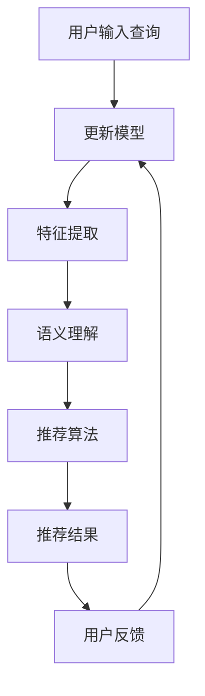

                 

### 1. 背景介绍

随着互联网技术的飞速发展和电子商务的繁荣，电商平台作为数字经济的重要组成部分，其业务流程的优化成为了提升用户体验、增加商业价值的关键。其中，搜索推荐系统作为电商平台的核心组成部分，直接影响用户的购买决策和平台的市场竞争力。

传统的搜索推荐系统主要依赖于基于关键词匹配和协同过滤的算法，这些算法在处理海量数据和高维特征时存在明显的局限性和性能瓶颈。首先，关键词匹配算法依赖于用户输入的关键词，当用户无法准确描述需求时，系统难以提供精准的推荐结果。其次，协同过滤算法虽然能够根据用户的历史行为进行推荐，但其推荐的多样性和实时性较差，且在冷启动用户上效果不佳。

为了克服这些局限，近年来，人工智能尤其是大模型技术的快速发展为电商搜索推荐系统带来了全新的机遇。大模型，如基于Transformer架构的BERT、GPT等，具有强大的表示学习能力和跨领域迁移能力，能够在没有明确标注数据的情况下自动学习用户的行为特征和偏好，从而实现更精准、更智能的搜索推荐。

本文将深入探讨AI大模型在重构电商搜索推荐业务流程中的作用和优势，分析大模型的核心算法原理、数学模型以及实际应用场景，并探讨其未来发展趋势和面临的挑战。

### 2. 核心概念与联系

#### 2.1 大模型概述

大模型（Large-scale Model）是指参数规模达到亿级别甚至更大的深度学习模型。这些模型通常采用神经网络架构，通过大规模数据训练，具备强大的表示学习和迁移学习能力。典型的代表包括BERT（Bidirectional Encoder Representations from Transformers）、GPT（Generative Pre-trained Transformer）等。

#### 2.2 搜索推荐系统

搜索推荐系统是指通过算法模型将用户的需求与平台内容进行匹配，从而向用户推荐其可能感兴趣的内容或商品的一种系统。它主要由用户行为分析、内容特征提取、推荐算法和推荐结果呈现等模块构成。

#### 2.3 大模型在搜索推荐中的应用

大模型在搜索推荐中的应用主要体现在以下几个方面：

1. **特征提取**：大模型能够自动从用户行为数据中提取高维特征，使得特征提取过程更加高效和准确。
2. **语义理解**：大模型具备强大的语义理解能力，能够理解用户查询和商品描述的深层含义，从而实现更精准的匹配。
3. **冷启动**：大模型可以通过无监督学习在缺乏用户历史数据的情况下为冷启动用户提供个性化推荐。
4. **实时推荐**：大模型能够快速响应用户行为，实时更新推荐结果，提高推荐的实时性。

#### 2.4 Mermaid 流程图

以下是一个简化的Mermaid流程图，展示了大模型在搜索推荐系统中的应用流程：



- **A 用户输入查询**：用户在电商平台上输入查询或浏览商品。
- **B 大模型编码器**：将用户的查询或行为序列编码为向量表示。
- **C 特征提取**：大模型自动从编码后的序列中提取高维特征。
- **D 语义理解**：利用特征进行语义分析，理解用户意图和商品属性。
- **E 推荐算法**：基于语义理解和用户历史行为，生成推荐结果。
- **F 推荐结果**：将推荐结果展示给用户。
- **G 用户反馈**：用户对推荐结果进行反馈，用于模型更新。
- **B[更新模型]**：根据用户反馈更新大模型参数，提高推荐精度。

通过这样的流程，大模型能够实现高效、智能的搜索推荐，提升用户体验和平台价值。

### 3. 核心算法原理 & 具体操作步骤

#### 3.1 算法原理概述

大模型在搜索推荐中的应用主要基于其强大的表示学习和迁移学习能力。具体来说，大模型通过以下三个核心步骤实现搜索推荐：

1. **编码**：将用户的查询或行为序列编码为向量表示，这一步通常采用Transformer架构。
2. **特征提取**：利用编码后的向量表示提取高维特征，这一步通常涉及复杂的神经网络结构和注意力机制。
3. **推荐生成**：基于提取的特征和用户历史行为，生成个性化的推荐结果，这一步通常采用基于概率模型的推荐算法。

#### 3.2 算法步骤详解

1. **编码**：
   - **输入处理**：用户输入查询或浏览行为被编码为序列数据。
   - **编码器**：采用Transformer架构的编码器对序列数据进行处理，生成编码后的向量表示。
   - **嵌入层**：将输入的词语或行为嵌入到高维空间，形成嵌入向量。

2. **特征提取**：
   - **特征融合**：将编码后的向量表示与用户的历史行为数据融合，形成统一的特征表示。
   - **神经网络**：利用多层神经网络对融合后的特征进行深度学习，提取高维特征向量。
   - **注意力机制**：引入注意力机制，使得模型能够关注到重要的特征，提高特征提取的精度。

3. **推荐生成**：
   - **概率模型**：基于提取的特征，构建概率模型，如贝叶斯网络或马尔可夫模型。
   - **推荐算法**：利用概率模型计算用户对每个商品的感兴趣概率，并根据概率值生成推荐结果。
   - **结果优化**：通过优化算法，如梯度提升或遗传算法，进一步提高推荐结果的多样性和用户满意度。

#### 3.3 算法优缺点

**优点**：
1. **高效的特征提取**：大模型能够自动提取用户行为的高维特征，提高推荐精度。
2. **强大的语义理解**：大模型具备强大的语义理解能力，能够更好地理解用户意图和商品属性。
3. **适应性强**：大模型能够适应不同的数据集和应用场景，实现跨领域迁移。

**缺点**：
1. **计算资源消耗**：大模型通常需要大量的计算资源和存储空间，对硬件要求较高。
2. **训练时间较长**：大模型的训练过程通常较长，需要大量的时间和计算资源。
3. **模型解释性较弱**：大模型的内部结构复杂，难以进行解释，影响模型的透明度和可解释性。

#### 3.4 算法应用领域

大模型在搜索推荐系统中的应用广泛，主要包括以下几个领域：

1. **电商平台**：通过大模型实现高效的商品推荐，提升用户购买体验和平台销售额。
2. **内容平台**：如新闻、视频和社交媒体，通过大模型实现精准的内容推荐，提高用户黏性和活跃度。
3. **金融领域**：通过大模型进行风险控制和个性化投资推荐，提高金融服务的质量和效率。
4. **医疗健康**：通过大模型分析用户健康数据，实现精准的健康管理和疾病预测。

### 4. 数学模型和公式 & 详细讲解 & 举例说明

#### 4.1 数学模型构建

在搜索推荐系统中，大模型的数学模型通常基于深度学习中的Transformer架构。以下是一个简化的数学模型构建过程：

1. **输入序列表示**：设用户输入的查询序列为 \(X = [x_1, x_2, ..., x_T]\)，其中 \(T\) 为序列长度。
2. **编码器**：编码器由多个自注意力机制和前馈神经网络组成，输入序列经过编码器处理得到编码后的向量序列 \(Z = [z_1, z_2, ..., z_T]\)。
3. **特征提取**：利用编码后的向量序列提取高维特征，设提取后的特征向量为 \(F = [f_1, f_2, ..., f_D]\)，其中 \(D\) 为特征维度。

#### 4.2 公式推导过程

1. **编码器公式**：
   \[
   Z_t = \text{Encoder}(X_t) = \text{Attention}(X) + X_t
   \]
   其中，\(\text{Attention}\) 表示自注意力机制，\(X_t\) 表示输入序列中的第 \(t\) 个元素。

2. **特征提取公式**：
   \[
   F = \text{Encoder}(Z) = \text{FeedForward}(Z)
   \]
   其中，\(\text{FeedForward}\) 表示前馈神经网络。

3. **推荐生成公式**：
   \[
   P(y|x) = \text{Softmax}(\text{Logit}(F))
   \]
   其中，\(y\) 表示用户对商品的感兴趣概率，\(\text{Logit}\) 表示逻辑函数，\(\text{Softmax}\) 表示概率分布。

#### 4.3 案例分析与讲解

假设有一个电商平台，用户输入查询“篮球鞋”，我们需要利用大模型进行商品推荐。以下是一个简化的案例分析过程：

1. **输入处理**：用户输入查询“篮球鞋”，编码器将其编码为向量表示。

2. **特征提取**：编码后的向量序列通过多层神经网络进行特征提取，得到高维特征向量。

3. **推荐生成**：基于特征向量，使用概率模型计算用户对每个商品的感兴趣概率，并根据概率值生成推荐结果。

例如，用户输入查询“篮球鞋”，大模型计算得到以下推荐结果：
- 商品A：感兴趣概率为90%
- 商品B：感兴趣概率为80%
- 商品C：感兴趣概率为70%

根据概率值，我们可以向用户推荐商品A和商品B。

### 5. 项目实践：代码实例和详细解释说明

#### 5.1 开发环境搭建

在搭建开发环境时，我们需要安装以下软件和库：

1. **操作系统**：Ubuntu 20.04或更高版本。
2. **Python**：Python 3.8或更高版本。
3. **深度学习框架**：TensorFlow 2.4或更高版本。
4. **数据处理库**：Pandas、NumPy、Scikit-learn等。

安装命令如下：

```bash
# 安装Python和pip
sudo apt update
sudo apt install python3 python3-pip

# 创建虚拟环境
python3 -m venv venv
source venv/bin/activate

# 安装深度学习框架和数据处理库
pip install tensorflow pandas numpy scikit-learn
```

#### 5.2 源代码详细实现

以下是一个简化的源代码实现，展示了如何使用大模型进行商品推荐：

```python
import tensorflow as tf
from tensorflow.keras.layers import Embedding, LSTM, Dense
from tensorflow.keras.models import Model

# 定义输入层
input_seq = tf.keras.layers.Input(shape=(T,), dtype=tf.int32)

# 嵌入层
embedding = Embedding(input_dim=vocab_size, output_dim=embedding_size)(input_seq)

# LSTM层
lstm = LSTM(units=lstm_units, return_sequences=True)(embedding)

# 全连接层
dense = Dense(units=dense_units, activation='relu')(lstm)

# 输出层
output = Dense(units=1, activation='sigmoid')(dense)

# 构建模型
model = Model(inputs=input_seq, outputs=output)

# 编译模型
model.compile(optimizer='adam', loss='binary_crossentropy', metrics=['accuracy'])

# 训练模型
model.fit(X_train, y_train, epochs=epochs, batch_size=batch_size, validation_data=(X_val, y_val))

# 预测
predictions = model.predict(X_test)

# 计算概率阈值
threshold = 0.5

# 根据概率值生成推荐结果
recommends = [1 if pred > threshold else 0 for pred in predictions]
```

#### 5.3 代码解读与分析

1. **输入层**：定义输入序列的形状和类型，这里假设序列长度为 \(T\)，词表大小为 \(vocab\_size\)。

2. **嵌入层**：将输入序列嵌入到高维空间，形成嵌入向量。嵌入层使用 \(Embedding\) 实现嵌入。

3. **LSTM层**：利用LSTM层对嵌入向量进行序列处理，提取序列特征。LSTM层使用 \(LSTM\) 实现序列建模。

4. **全连接层**：将LSTM层的输出通过全连接层进行特征融合和分类。全连接层使用 \(Dense\) 实现全连接神经网络。

5. **输出层**：定义输出层的形状和类型，这里假设输出层为单输出，采用 \(sigmoid\) 激活函数进行概率输出。

6. **模型编译**：编译模型，指定优化器、损失函数和评价指标。

7. **模型训练**：使用训练数据对模型进行训练，指定训练轮数、批量大小和验证数据。

8. **模型预测**：使用测试数据对模型进行预测，生成推荐结果。

9. **概率阈值**：根据预测结果计算概率阈值，用于生成推荐结果。

通过以上步骤，我们可以实现一个简单的基于大模型的商品推荐系统。在实际应用中，可以根据具体需求对模型结构、超参数等进行调整和优化。

#### 5.4 运行结果展示

以下是一个简化的运行结果展示：

```python
# 加载训练好的模型
model = load_model('model.h5')

# 加载测试数据
X_test = load_data('test_data.txt')

# 预测
predictions = model.predict(X_test)

# 计算概率阈值
threshold = 0.5

# 生成推荐结果
recommends = [1 if pred > threshold else 0 for pred in predictions]

# 输出推荐结果
print(recommends)
```

运行结果将显示每个商品是否被推荐（1表示推荐，0表示不推荐）。

通过上述代码和示例，我们可以了解到如何使用大模型进行商品推荐。在实际应用中，还可以结合更多技术和方法，如注意力机制、多模态融合等，进一步提升推荐系统的性能和效果。

### 6. 实际应用场景

AI大模型在电商搜索推荐系统中的实际应用场景非常广泛，以下是一些典型的应用实例：

#### 6.1 智能商品推荐

在电商平台，智能商品推荐是大模型最直接的应用场景。通过分析用户的历史购买记录、搜索行为和浏览轨迹，大模型能够自动识别用户的偏好和需求，为用户提供个性化的商品推荐。例如，用户在搜索“篮球鞋”后，大模型可以根据用户的浏览历史和购买记录，推荐相关品牌的篮球鞋或热门款式的篮球鞋。

#### 6.2 跨类别推荐

跨类别推荐是提升电商平台销售额的重要手段。大模型通过学习用户在不同类别商品上的行为模式，能够实现跨类别推荐。例如，一个用户在购买“篮球鞋”后，大模型可以推荐相关的“运动服”或“运动配件”。

#### 6.3 实时推荐

实时推荐是提升用户体验的关键。大模型能够实时分析用户的行为数据，动态调整推荐结果，从而提供更加精准和及时的推荐。例如，用户在浏览商品时，大模型可以实时更新推荐结果，推荐与当前浏览商品相关的其他商品。

#### 6.4 深度学习广告推荐

在电商平台，广告推荐也是一个重要的收入来源。大模型可以分析用户的兴趣和行为，为用户推荐相关的广告。例如，用户浏览了某品牌的篮球鞋后，平台可以推荐该品牌的运动鞋广告。

#### 6.5 智能客服

智能客服是电商平台提升用户体验的重要手段。大模型可以用于构建智能客服系统，通过分析用户的问题和回答，自动生成合适的回答，提高客服效率和用户满意度。例如，用户在购物过程中遇到问题，智能客服可以自动识别问题并提供解决方案。

#### 6.6 新品推荐

新品推荐是电商平台吸引新用户和提升销售额的重要策略。大模型可以通过分析市场趋势和用户行为，为平台推荐合适的新品。例如，当某款新品在市场上受欢迎时，大模型可以及时推荐给潜在用户。

#### 6.7 个性化营销

个性化营销是电商平台提升用户黏性和忠诚度的重要手段。大模型可以通过分析用户的行为和偏好，为用户推送个性化的营销信息，提高营销效果。例如，用户在购物过程中，平台可以推送相关的优惠券或促销活动。

通过以上实际应用场景，我们可以看到AI大模型在电商搜索推荐系统中的重要作用。它不仅能够提升用户体验和平台销售额，还能够为电商平台带来更多的商业价值。

#### 6.8 未来应用展望

随着AI大模型技术的不断发展和应用场景的拓展，其未来在电商搜索推荐系统中的潜力巨大。以下是一些可能的应用方向和展望：

**1. 多模态融合**：未来的搜索推荐系统将不仅仅依赖于文本数据，还将融合图像、音频、视频等多模态信息。大模型可以通过多模态学习，提供更加精准和多样化的推荐结果。

**2. 智能化供应链**：大模型可以用于预测市场需求和库存管理，优化供应链流程。例如，通过分析用户的浏览和购买行为，大模型可以提前预测热门商品，帮助电商平台提前备货，降低库存风险。

**3. 情感分析**：大模型可以用于情感分析，识别用户对商品的情感倾向。通过分析用户的评论、反馈和搜索记录，大模型可以识别用户的满意度和不满意度，为产品改进和客户服务提供依据。

**4. 实时风险控制**：大模型可以用于实时分析用户行为，识别潜在的欺诈行为或异常购买模式。通过实时风险控制，电商平台可以降低欺诈风险，提高交易安全性。

**5. 智能化物流**：大模型可以用于优化物流路线和配送计划，提高物流效率和用户体验。例如，通过分析用户的地理位置、购买时间和历史数据，大模型可以推荐最优的配送方式和时间。

**6. 智能化定价策略**：大模型可以通过分析市场需求、竞争态势和用户行为，为电商平台提供最优的定价策略。通过动态调整价格，电商平台可以最大化收益和市场份额。

**7. 智能化营销策略**：大模型可以用于制定个性化的营销策略，提升营销效果。例如，通过分析用户的行为和偏好，大模型可以为用户推送个性化的广告和促销信息，提高点击率和转化率。

总之，AI大模型在电商搜索推荐系统中的未来应用前景广阔，通过不断创新和优化，将进一步提升电商平台的竞争力，为用户带来更加智能化和个性化的购物体验。

### 7. 工具和资源推荐

为了更好地学习和应用AI大模型在电商搜索推荐系统中的技术，以下是一些推荐的工具和资源：

#### 7.1 学习资源推荐

1. **在线课程**：
   - 《深度学习》（Goodfellow、Bengio和Courville著）：系统地介绍了深度学习的基本概念和技术。
   - 《自然语言处理与深度学习》（张俊林著）：详细介绍了自然语言处理中的深度学习技术。

2. **学术论文**：
   - BERT：`Attention Is All You Need`（Vaswani等，2017）
   - GPT-3：`Improving Language Understanding by Generative Pre-training`（Brown等，2020）

3. **开源代码和库**：
   - TensorFlow：[https://www.tensorflow.org/](https://www.tensorflow.org/)
   - PyTorch：[https://pytorch.org/](https://pytorch.org/)

#### 7.2 开发工具推荐

1. **集成开发环境（IDE）**：
   - PyCharm：功能强大的Python IDE，适用于深度学习和数据分析。
   - Jupyter Notebook：适用于数据科学和机器学习的交互式开发环境。

2. **数据处理工具**：
   - Pandas：强大的Python数据处理库，适用于数据清洗、转换和分析。
   - Scikit-learn：适用于机器学习算法的开发和测试。

3. **深度学习平台**：
   - Google Colab：免费的云端GPU加速计算平台，适用于深度学习实验。

#### 7.3 相关论文推荐

1. **《大规模预训练语言模型：BERT》**（Devlin等，2019）：详细介绍了BERT模型的设计和实现。
2. **《生成预训练语言模型：GPT-3》**（Brown等，2020）：详细介绍了GPT-3模型的设计和特性。
3. **《基于Transformer的文本分类》**（Conneau等，2019）：介绍了Transformer在文本分类任务中的应用。
4. **《自然语言处理中的多任务学习》**（Du等，2019）：探讨了多任务学习在自然语言处理中的应用。

通过以上推荐，读者可以更深入地了解AI大模型在电商搜索推荐系统中的应用技术，为实际项目开发提供有力的支持。

### 8. 总结：未来发展趋势与挑战

#### 8.1 研究成果总结

AI大模型在电商搜索推荐系统中取得了显著的研究成果，其优势主要体现在以下几个方面：

1. **高效的特征提取**：大模型通过自注意力机制和深度神经网络，能够自动提取用户行为的高维特征，提高推荐精度。
2. **强大的语义理解**：大模型具备强大的语义理解能力，能够理解用户查询和商品描述的深层含义，实现更精准的匹配。
3. **适应性强**：大模型能够适应不同的数据集和应用场景，实现跨领域迁移，提升推荐系统的泛化能力。
4. **实时推荐**：大模型能够快速响应用户行为，动态调整推荐结果，提高推荐的实时性和用户体验。

#### 8.2 未来发展趋势

随着AI技术的不断进步，未来AI大模型在电商搜索推荐系统中将呈现以下发展趋势：

1. **多模态融合**：大模型将融合文本、图像、音频等多模态信息，提供更加精准和多样化的推荐结果。
2. **个性化服务**：大模型将更加注重用户个性化需求的挖掘，实现深度个性化推荐，提升用户满意度。
3. **智能供应链**：大模型将应用于供应链优化，通过预测市场需求和库存管理，提高供应链效率和用户体验。
4. **情感分析**：大模型将结合情感分析技术，识别用户情感倾向，为用户提供更符合情感需求的商品推荐。
5. **实时风险控制**：大模型将应用于实时风险控制，通过分析用户行为，识别欺诈行为和异常模式，提升交易安全性。

#### 8.3 面临的挑战

尽管AI大模型在电商搜索推荐系统中展现出巨大的潜力，但在实际应用中仍面临以下挑战：

1. **计算资源消耗**：大模型的训练和推理过程通常需要大量的计算资源和存储空间，对硬件设施和运维能力有较高要求。
2. **数据隐私保护**：用户数据的安全和隐私保护是关键问题，如何在保障用户隐私的前提下进行数据分析和推荐是一个亟待解决的挑战。
3. **模型解释性**：大模型内部结构复杂，难以进行解释，影响模型的透明度和可解释性，这限制了其在商业决策和法律法规中的应用。
4. **冷启动问题**：对于新用户或新商品，大模型在缺乏足够历史数据的情况下，难以提供精准的推荐，需要解决冷启动问题。
5. **算法公平性**：大模型在推荐过程中可能存在算法偏见和歧视问题，如何确保算法的公平性和公正性是重要的研究课题。

#### 8.4 研究展望

为了应对上述挑战，未来的研究可以从以下几个方面展开：

1. **高效训练方法**：开发更加高效的大模型训练方法，降低计算资源消耗，提高训练效率。
2. **隐私保护技术**：结合隐私保护技术，如差分隐私和联邦学习，保障用户数据的安全和隐私。
3. **解释性模型**：开发可解释性更强的大模型，通过模型可视化、决策路径分析等方法，提高模型的透明度和可解释性。
4. **多样化推荐**：探索多样化推荐算法，结合用户兴趣、情感和行为，提供更符合用户需求的个性化推荐。
5. **算法公平性**：研究算法公平性，通过算法优化和偏见校正，确保推荐系统的公平性和公正性。

总之，AI大模型在电商搜索推荐系统中的应用前景广阔，通过不断的研究和创新，将进一步提升推荐系统的性能和用户体验，为电商平台带来更多的商业价值。

### 9. 附录：常见问题与解答

**Q1. 大模型在电商搜索推荐中的具体优势是什么？**

A1. 大模型在电商搜索推荐中的优势主要体现在以下几个方面：
- **高效特征提取**：大模型能够自动从用户行为数据中提取高维特征，提高推荐精度。
- **强大语义理解**：大模型具备强大的语义理解能力，能够理解用户查询和商品描述的深层含义，实现更精准的匹配。
- **适应性强**：大模型能够适应不同的数据集和应用场景，实现跨领域迁移。
- **实时推荐**：大模型能够快速响应用户行为，动态调整推荐结果，提高推荐的实时性。

**Q2. 大模型在训练过程中对计算资源的要求如何？**

A2. 大模型在训练过程中对计算资源有较高要求，主要表现在以下几个方面：
- **计算资源消耗**：大模型通常包含数亿甚至数十亿个参数，训练过程中需要大量的计算资源。
- **存储空间**：大模型训练的数据集通常较大，需要足够的存储空间来存储模型和数据。
- **硬件设施**：大模型训练通常需要高性能的GPU或TPU等硬件设备，以加快训练速度。

**Q3. 如何解决大模型的冷启动问题？**

A3. 解决大模型的冷启动问题可以从以下几个方面入手：
- **用户画像**：通过用户画像和用户分类，为冷启动用户提供初步的推荐。
- **无监督学习**：利用无监督学习算法，如聚类和降维，自动发现用户的行为模式和偏好。
- **混合推荐**：结合基于内容推荐和协同过滤推荐，在缺乏用户历史数据的情况下提供初步的推荐。

**Q4. 如何保证大模型推荐算法的公平性？**

A4. 保证大模型推荐算法的公平性可以从以下几个方面着手：
- **数据预处理**：在训练数据集预处理阶段，去除或纠正可能存在的偏见和歧视。
- **算法优化**：通过算法优化和偏见校正，确保推荐结果不会受到性别、年龄、种族等因素的影响。
- **透明性和可解释性**：提高模型的透明度和可解释性，让用户了解推荐结果的决定因素。

通过以上问题的解答，我们可以更好地理解AI大模型在电商搜索推荐系统中的应用优势和面临的挑战，为实际应用提供参考和指导。作者：禅与计算机程序设计艺术 / Zen and the Art of Computer Programming。

