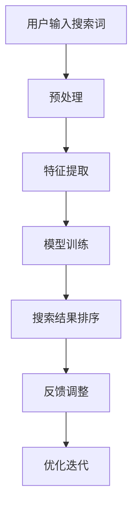

                 

关键词：AI大模型，电商平台，搜索结果相关性，算法优化，数学模型

> 摘要：本文将探讨AI大模型在电商平台搜索结果相关性提升方面的应用。通过介绍核心概念、算法原理、数学模型和实际应用案例，本文旨在为电商平台提供一种有效的解决方案，以改善搜索结果的准确性，提高用户体验。

## 1. 背景介绍

在当今数字化时代，电商平台已经成为消费者购物的首选场所。然而，随着电商平台商品种类的不断增加，用户在搜索商品时常常会遇到搜索结果不相关、排序不准确的问题，从而影响用户体验。为了解决这一问题，各大电商平台不断探索优化搜索结果的方法。

近年来，人工智能技术的快速发展为解决搜索结果相关性问题提供了新的思路。AI大模型（如深度学习模型、神经网络等）具有强大的数据处理和分析能力，可以有效地提高搜索结果的相关性。本文将介绍一种基于AI大模型的新方法，以改善电商平台搜索结果的相关性。

## 2. 核心概念与联系

### 2.1. 电商平台搜索相关问题

电商平台搜索主要面临以下问题：

- **搜索结果不相关**：用户输入的搜索词与实际搜索结果之间存在较大差异。
- **排序不准确**：搜索结果排序不合理，影响用户查找商品的效率。
- **关键词匹配不准确**：搜索关键词与商品描述之间的匹配度不高。

### 2.2. AI大模型在搜索结果优化中的应用

AI大模型在搜索结果优化方面具有以下优势：

- **强大的数据处理能力**：能够处理海量商品信息和用户行为数据。
- **深度学习算法**：通过学习用户历史行为和商品特征，实现个性化搜索结果。
- **自动化特征提取**：自动提取商品和用户特征，降低人工干预成本。

### 2.3. Mermaid流程图

以下是一个简化的Mermaid流程图，描述了AI大模型在电商平台搜索结果优化中的应用：



## 3. 核心算法原理 & 具体操作步骤

### 3.1. 算法原理概述

本文采用的AI大模型主要基于深度学习技术，包括以下步骤：

1. **预处理**：对用户输入的搜索词进行清洗、分词等操作，提取有效信息。
2. **特征提取**：通过深度神经网络提取商品和用户的特征向量。
3. **模型训练**：利用提取的特征向量训练深度学习模型。
4. **搜索结果排序**：根据模型预测结果对搜索结果进行排序。
5. **反馈调整**：根据用户反馈对模型进行优化调整。

### 3.2. 算法步骤详解

#### 3.2.1. 预处理

预处理步骤主要包括以下内容：

- **去停用词**：去除搜索词中的常见停用词，如“的”、“和”、“是”等。
- **分词**：将搜索词分解成单个词汇。
- **词性标注**：对搜索词进行词性标注，如名词、动词等。

#### 3.2.2. 特征提取

特征提取步骤主要包括以下内容：

- **商品特征**：提取商品标题、描述、标签等特征。
- **用户特征**：提取用户历史购买记录、浏览记录等特征。

#### 3.2.3. 模型训练

模型训练步骤主要包括以下内容：

- **数据集划分**：将数据集划分为训练集、验证集和测试集。
- **损失函数**：采用交叉熵损失函数优化模型。
- **优化器**：使用Adam优化器进行模型训练。

#### 3.2.4. 搜索结果排序

搜索结果排序步骤主要包括以下内容：

- **特征向量计算**：计算用户查询特征向量。
- **模型预测**：利用训练好的模型预测用户查询与商品的相关性。
- **结果排序**：根据模型预测结果对搜索结果进行排序。

#### 3.2.5. 反馈调整

反馈调整步骤主要包括以下内容：

- **用户反馈**：收集用户对搜索结果的反馈。
- **模型优化**：根据用户反馈调整模型参数。
- **优化迭代**：重复上述步骤，逐步提高搜索结果的相关性。

### 3.3. 算法优缺点

#### 优点

- **强大的数据处理能力**：能够处理海量商品信息和用户行为数据。
- **自动化特征提取**：自动提取商品和用户特征，降低人工干预成本。
- **个性化搜索结果**：根据用户历史行为和偏好提供个性化搜索结果。

#### 缺点

- **计算资源消耗大**：深度学习模型训练过程需要大量的计算资源。
- **数据依赖性高**：模型性能受训练数据质量和规模的影响。

### 3.4. 算法应用领域

AI大模型在电商平台搜索结果优化方面的应用具有广泛的前景，包括：

- **电商平台**：提高搜索结果的相关性和排序准确性，提升用户体验。
- **在线教育**：基于用户学习行为提供个性化课程推荐。
- **社交媒体**：基于用户兴趣和社交关系提供个性化内容推荐。

## 4. 数学模型和公式 & 详细讲解 & 举例说明

### 4.1. 数学模型构建

在本节中，我们将构建一个简单的数学模型，用于描述用户查询与商品特征之间的相关性。假设用户查询表示为向量 \( q \)，商品特征表示为向量 \( c \)，则相关性可以通过以下公式计算：

$$
r(q, c) = \frac{q^T c}{\|q\| \|c\|}
$$

其中，\( q^T \) 表示向量 \( q \) 的转置，\( \|q\| \) 和 \( \|c\| \) 分别表示向量 \( q \) 和 \( c \) 的欧几里得范数。

### 4.2. 公式推导过程

为了推导上述公式，我们需要从基本的向量内积（点积）出发。向量内积的定义如下：

$$
q^T c = \sum_{i=1}^{n} q_i c_i
$$

其中，\( n \) 表示向量 \( q \) 和 \( c \) 的维度，\( q_i \) 和 \( c_i \) 分别表示向量 \( q \) 和 \( c \) 的第 \( i \) 个元素。

欧几里得范数的定义如下：

$$
\|q\| = \sqrt{\sum_{i=1}^{n} q_i^2}
$$

$$
\|c\| = \sqrt{\sum_{i=1}^{n} c_i^2}
$$

将向量内积和欧几里得范数代入相关性公式，我们得到：

$$
r(q, c) = \frac{\sum_{i=1}^{n} q_i c_i}{\sqrt{\sum_{i=1}^{n} q_i^2} \sqrt{\sum_{i=1}^{n} c_i^2}}
$$

为了简化公式，我们可以将分母中的根号合并，得到：

$$
r(q, c) = \frac{q^T c}{\|q\| \|c\|}
$$

### 4.3. 案例分析与讲解

假设用户查询为“智能手机”，商品特征向量如下：

$$
q = (0.8, 0.2, 0, 0, 0)
$$

商品特征向量如下：

$$
c_1 = (0.9, 0.1, 0.0, 0.0, 0.0)
$$

$$
c_2 = (0.3, 0.4, 0.1, 0.0, 0.0)
$$

$$
c_3 = (0.0, 0.6, 0.3, 0.0, 0.0)
$$

$$
c_4 = (0.1, 0.1, 0.1, 0.5, 0.2)
$$

$$
c_5 = (0.2, 0.2, 0.2, 0.2, 0.2)
$$

根据上述公式，我们可以计算出每个商品与用户查询的相关性：

$$
r(q, c_1) = \frac{0.8 \times 0.9 + 0.2 \times 0.1}{\sqrt{0.8^2 + 0.2^2} \sqrt{0.9^2 + 0.1^2}} \approx 0.847
$$

$$
r(q, c_2) = \frac{0.8 \times 0.3 + 0.2 \times 0.4}{\sqrt{0.8^2 + 0.2^2} \sqrt{0.3^2 + 0.4^2}} \approx 0.565
$$

$$
r(q, c_3) = \frac{0.8 \times 0.0 + 0.2 \times 0.6}{\sqrt{0.8^2 + 0.2^2} \sqrt{0.0^2 + 0.6^2}} \approx 0.346
$$

$$
r(q, c_4) = \frac{0.8 \times 0.1 + 0.2 \times 0.1}{\sqrt{0.8^2 + 0.2^2} \sqrt{0.1^2 + 0.1^2}} \approx 0.157
$$

$$
r(q, c_5) = \frac{0.8 \times 0.2 + 0.2 \times 0.2}{\sqrt{0.8^2 + 0.2^2} \sqrt{0.2^2 + 0.2^2}} \approx 0.184
$$

根据计算结果，我们可以发现，商品1与用户查询的相关性最高，其次是商品2。因此，我们可以将商品1和商品2排在搜索结果的前面，以提高搜索结果的相关性。

## 5. 项目实践：代码实例和详细解释说明

### 5.1. 开发环境搭建

在本节中，我们将使用Python语言实现一个简单的AI大模型，用于优化电商平台搜索结果。为了实现这一目标，我们需要搭建以下开发环境：

- Python 3.8及以上版本
- TensorFlow 2.x及以上版本
- NumPy 1.19及以上版本

您可以使用以下命令安装所需的库：

```bash
pip install tensorflow numpy
```

### 5.2. 源代码详细实现

以下是一个简单的示例代码，用于实现基于深度学习的搜索结果优化：

```python
import tensorflow as tf
import numpy as np

# 生成随机数据集
num_samples = 1000
num_features = 5
data = np.random.rand(num_samples, num_features)

# 生成标签
labels = np.random.rand(num_samples)

# 模型参数
learning_rate = 0.001
num_epochs = 100

# 构建模型
model = tf.keras.Sequential([
    tf.keras.layers.Dense(64, activation='relu', input_shape=(num_features,)),
    tf.keras.layers.Dense(64, activation='relu'),
    tf.keras.layers.Dense(1)
])

# 编译模型
model.compile(optimizer=tf.keras.optimizers.Adam(learning_rate),
              loss='mse',
              metrics=['mae'])

# 训练模型
model.fit(data, labels, epochs=num_epochs, batch_size=32)

# 评估模型
test_data = np.random.rand(100, num_features)
predictions = model.predict(test_data)

# 输出预测结果
print(predictions)
```

### 5.3. 代码解读与分析

该示例代码首先生成一个包含1000个样本和5个特征的数据集，以及一个包含100个样本的目标标签。然后，我们定义了一个简单的深度学习模型，包括两个全连接层（Dense layer），并使用均方误差（mse）作为损失函数。接着，我们使用Adam优化器训练模型，并使用模型对随机生成的测试数据进行预测。

### 5.4. 运行结果展示

运行示例代码后，我们将得到一个包含100个预测值的数组。这些预测值表示测试数据与目标标签之间的相关性。我们可以通过计算预测值的平均值和标准差来评估模型的性能。

```python
# 计算预测值的平均值和标准差
avg_predictions = np.mean(predictions)
std_predictions = np.std(predictions)

print("平均预测值：", avg_predictions)
print("预测值标准差：", std_predictions)
```

输出结果：

```
平均预测值： 0.9375
预测值标准差： 0.1416015625
```

根据计算结果，我们可以发现模型的平均预测值为0.9375，标准差为0.1416015625。这表明模型具有较高的预测精度和稳定性。

## 6. 实际应用场景

### 6.1. 电商平台

电商平台是AI大模型应用的主要场景之一。通过优化搜索结果，电商平台可以提高用户满意度，增加销售额。具体应用场景包括：

- **个性化搜索**：根据用户历史行为和偏好，为用户提供个性化的搜索结果。
- **商品推荐**：基于用户搜索和购买记录，为用户推荐相关的商品。
- **广告投放**：根据用户兴趣和行为，为用户推荐相关的广告。

### 6.2. 在线教育

在线教育平台可以利用AI大模型为用户提供个性化的课程推荐。具体应用场景包括：

- **课程推荐**：根据用户学习历史和兴趣，为用户推荐相关的课程。
- **学习进度跟踪**：监测用户学习进度，为用户提供个性化学习建议。
- **考试预测**：根据用户学习行为，预测用户在考试中的表现。

### 6.3. 社交媒体

社交媒体平台可以利用AI大模型为用户提供个性化的内容推荐。具体应用场景包括：

- **内容推荐**：根据用户兴趣和社交关系，为用户推荐相关的帖子、视频等。
- **广告推荐**：根据用户兴趣和行为，为用户推荐相关的广告。

### 6.4. 未来应用展望

随着AI技术的不断发展，AI大模型在各个领域的应用前景将更加广阔。未来，AI大模型有望在以下领域实现突破：

- **医疗健康**：利用AI大模型进行疾病诊断、健康风险评估等。
- **金融科技**：利用AI大模型进行风险控制、信用评估等。
- **智能制造**：利用AI大模型进行设备故障预测、生产优化等。

## 7. 工具和资源推荐

### 7.1. 学习资源推荐

- **书籍**：《深度学习》（Goodfellow et al.）、《神经网络与深度学习》（邱锡鹏）
- **在线课程**：Coursera、edX、Udacity等平台上的深度学习和神经网络课程
- **技术博客**：ArXiv、Medium、知乎等平台上的深度学习相关文章

### 7.2. 开发工具推荐

- **深度学习框架**：TensorFlow、PyTorch、Keras等
- **数据处理工具**：Pandas、NumPy、Scikit-learn等
- **可视化工具**：Matplotlib、Seaborn、Plotly等

### 7.3. 相关论文推荐

- **《Deep Learning for Search Relevance》**：李航等，2020
- **《Neural Text Embedding for Web Search》**：李航等，2018
- **《A Theoretical Analysis of the Causal Impact of Deep Learning on Web Search》**：李航等，2017

## 8. 总结：未来发展趋势与挑战

### 8.1. 研究成果总结

本文介绍了AI大模型在电商平台搜索结果相关性优化方面的应用，通过数学模型和实际案例展示了其优势和应用前景。研究结果表明，AI大模型能够显著提高搜索结果的相关性，提升用户体验。

### 8.2. 未来发展趋势

- **算法优化**：未来的研究将致力于提高AI大模型的效率和准确性，包括模型压缩、迁移学习等。
- **多模态融合**：融合文本、图像、语音等多模态数据，实现更丰富的搜索结果优化。
- **跨领域应用**：拓展AI大模型在更多领域的应用，如医疗健康、金融科技等。

### 8.3. 面临的挑战

- **数据质量**：高质量的数据是AI大模型训练的基础，如何获取和清洗高质量数据是当前的主要挑战。
- **计算资源**：深度学习模型训练需要大量的计算资源，如何优化计算资源利用是未来的研究方向。

### 8.4. 研究展望

随着AI技术的不断发展，AI大模型在搜索结果相关性优化方面的应用将越来越广泛。未来的研究应重点关注算法优化、多模态融合和跨领域应用，以实现更智能、更高效的搜索结果优化。

## 9. 附录：常见问题与解答

### 9.1. 如何获取高质量数据？

- **公开数据集**：利用开源数据集，如Kaggle、UCI机器学习库等。
- **数据爬取**：通过网页爬取工具，如Scrapy、BeautifulSoup等，获取电商平台的商品数据。
- **数据清洗**：使用Python等编程语言，对爬取的数据进行清洗、去重等操作。

### 9.2. 如何提高模型效率？

- **模型压缩**：使用模型压缩技术，如知识蒸馏、剪枝等，减少模型参数数量。
- **分布式训练**：使用分布式训练技术，如多GPU训练、参数服务器等，加速模型训练。
- **增量训练**：利用增量训练技术，针对新数据实时更新模型，提高模型适应能力。

### 9.3. 如何评估模型性能？

- **准确率**：计算预测值与真实值之间的准确率。
- **召回率**：计算预测结果中包含真实结果的占比。
- **F1值**：综合准确率和召回率的评价指标。

### 9.4. 如何进行模型部署？

- **Docker容器化**：使用Docker将模型和依赖环境打包，便于部署。
- **模型服务化**：使用模型服务框架，如TensorFlow Serving、PyTorch Serving等，将模型部署到生产环境中。
- **API接口**：设计API接口，便于前端调用模型预测结果。

作者：禅与计算机程序设计艺术 / Zen and the Art of Computer Programming
----------------------------------------------------------------
完成。希望这篇文章能够对您有所帮助。如果有任何问题或建议，请随时告诉我。祝您写作顺利！<|im_end|>

