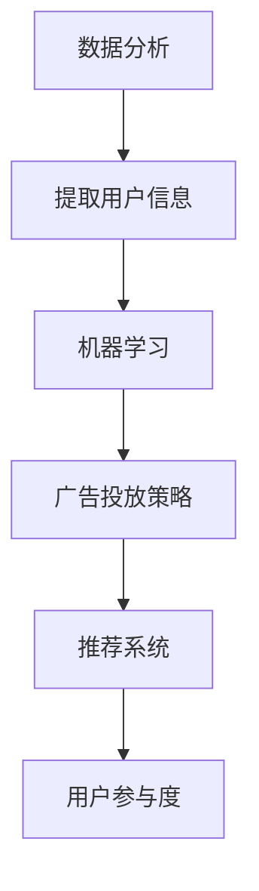

                 

关键词：AI，电商平台，实时广告投放，算法，数据分析，机器学习，推荐系统

> 摘要：本文将探讨人工智能在电商平台实时广告投放策略中的应用。通过深入分析AI技术的原理和算法，我们将揭示如何利用机器学习算法优化广告投放，提升用户体验，增加销售额。

## 1. 背景介绍

随着互联网技术的飞速发展，电商平台已经成为人们日常生活中不可或缺的一部分。然而，面对激烈的市场竞争，如何提高广告投放的精准度和效率，成为电商平台亟需解决的重要问题。传统的广告投放策略往往依赖于经验和预定义的规则，难以适应瞬息万变的市场环境。而人工智能（AI）的出现，为电商平台提供了新的解决思路。

人工智能技术，特别是机器学习算法，具有自动从数据中学习模式和规律的能力，能够实现广告投放的自动化和个性化。通过分析用户行为数据，AI可以帮助电商平台预测用户需求，制定更精准的广告投放策略，从而提高广告的点击率、转化率和销售额。

## 2. 核心概念与联系

### 2.1 数据分析

数据分析是人工智能在电商平台广告投放中的核心概念之一。通过对用户行为数据、交易数据、搜索数据等多源数据的分析，可以提取出用户兴趣、消费习惯、购买倾向等有价值的信息。

### 2.2 机器学习

机器学习是AI的重要组成部分，它使得计算机系统能够从数据中学习，并做出预测和决策。在广告投放中，机器学习算法可以根据历史数据，预测哪些用户最可能对广告产生兴趣，从而优化广告的投放。

### 2.3 推荐系统

推荐系统是电商平台常用的一种机器学习算法，它通过分析用户的历史行为数据，为用户推荐可能感兴趣的商品或广告。推荐系统可以提高用户的参与度，增加广告的曝光率。

### 2.4 Mermaid 流程图



## 3. 核心算法原理 & 具体操作步骤

### 3.1 算法原理概述

电商平台实时广告投放的核心算法主要包括协同过滤、基于内容的推荐和基于模型的推荐等。协同过滤算法通过分析用户行为，找到相似用户，从而预测用户可能感兴趣的商品或广告。基于内容的推荐算法通过分析商品的特征，为用户推荐具有相似特征的广告。基于模型的推荐算法则通过建立用户行为和广告特征之间的关系模型，预测用户对广告的兴趣。

### 3.2 算法步骤详解

#### 3.2.1 数据收集与预处理

1. 收集用户行为数据，如浏览记录、购买记录、搜索记录等。
2. 对数据进行清洗，去除噪声数据。
3. 对数据进行归一化处理，使数据具有可比性。

#### 3.2.2 特征提取

1. 提取用户特征，如用户年龄、性别、地理位置、消费能力等。
2. 提取商品特征，如商品种类、品牌、价格、销量等。

#### 3.2.3 算法选择与训练

1. 根据业务需求，选择合适的推荐算法，如协同过滤、基于内容的推荐或基于模型的推荐。
2. 使用历史数据对算法进行训练。

#### 3.2.4 广告投放策略优化

1. 根据算法预测结果，制定广告投放策略。
2. 监控广告投放效果，根据反馈调整广告投放策略。

### 3.3 算法优缺点

#### 3.3.1 优点

1. 提高广告投放的精准度，增加广告点击率和转化率。
2. 个性化推荐，提高用户体验。
3. 自动化处理，减轻人工工作量。

#### 3.3.2 缺点

1. 数据质量对算法效果有较大影响。
2. 算法复杂度高，计算资源需求大。
3. 可能存在过度拟合问题。

### 3.4 算法应用领域

1. 电商平台广告投放
2. 社交媒体广告投放
3. 搜索引擎广告投放
4. 娱乐内容推荐

## 4. 数学模型和公式 & 详细讲解 & 举例说明

### 4.1 数学模型构建

电商平台实时广告投放的数学模型主要包括协同过滤模型、基于内容的模型和基于模型的模型。

#### 4.1.1 协同过滤模型

协同过滤模型是一种基于用户行为的推荐算法，其数学模型可以表示为：

$$
R_{ui} = \frac{\sum_{j \in N_i} r_{uj} \cdot sim(i, j)}{\sum_{j \in N_i} |sim(i, j)|}
$$

其中，$R_{ui}$ 表示用户 $u$ 对商品 $i$ 的兴趣评分，$r_{uj}$ 表示用户 $u$ 对商品 $j$ 的实际评分，$N_i$ 表示与用户 $i$ 相似的一组用户集合，$sim(i, j)$ 表示用户 $i$ 和用户 $j$ 之间的相似度。

#### 4.1.2 基于内容的模型

基于内容的模型是一种基于商品特征的推荐算法，其数学模型可以表示为：

$$
R_{ui} = \frac{\sum_{j \in C_i} w_{uj} \cdot sim(i, j)}{\sum_{j \in C_i} |sim(i, j)|}
$$

其中，$R_{ui}$ 表示用户 $u$ 对商品 $i$ 的兴趣评分，$w_{uj}$ 表示商品 $j$ 的特征权重，$C_i$ 表示与商品 $i$ 具有相似特征的一组商品集合，$sim(i, j)$ 表示商品 $i$ 和商品 $j$ 之间的相似度。

#### 4.1.3 基于模型的模型

基于模型的模型是一种基于用户行为和商品特征的学习算法，其数学模型可以表示为：

$$
R_{ui} = \theta(u, i) + \sum_{j \in N_i} r_{uj} \cdot \phi(u, j) \cdot \psi(i, j)
$$

其中，$R_{ui}$ 表示用户 $u$ 对商品 $i$ 的兴趣评分，$\theta(u, i)$ 表示用户 $u$ 和商品 $i$ 之间的基线兴趣评分，$r_{uj}$ 表示用户 $u$ 对商品 $j$ 的实际评分，$\phi(u, j)$ 表示用户 $u$ 的特征向量，$\psi(i, j)$ 表示商品 $i$ 的特征向量。

### 4.2 公式推导过程

#### 4.2.1 协同过滤模型

协同过滤模型的公式推导主要基于用户相似度和评分预测。用户相似度可以通过余弦相似度、皮尔逊相关系数等指标计算。评分预测则基于用户相似度矩阵和用户实际评分数据。

#### 4.2.2 基于内容的模型

基于内容的模型公式推导主要基于商品特征向量和用户兴趣向量。商品特征向量可以通过商品种类、品牌、价格等特征提取。用户兴趣向量则可以通过用户历史行为数据计算。

#### 4.2.3 基于模型的模型

基于模型的模型公式推导主要基于用户行为数据和商品特征数据。用户行为数据可以通过历史购买记录、浏览记录等提取。商品特征数据可以通过商品种类、品牌、价格等特征提取。

### 4.3 案例分析与讲解

#### 4.3.1 案例背景

假设一个电商平台，用户张三最近浏览了多种电子产品，如手机、电脑和耳机。电商平台希望通过实时广告投放，向张三推荐他可能感兴趣的商品。

#### 4.3.2 数据收集与预处理

1. 收集张三的历史浏览记录、购买记录等数据。
2. 对数据进行清洗，去除无效数据。

#### 4.3.3 特征提取

1. 提取张三的用户特征，如年龄、性别、地理位置等。
2. 提取商品的类别、品牌、价格等特征。

#### 4.3.4 算法选择与训练

1. 选择基于内容的推荐算法。
2. 使用历史数据对算法进行训练。

#### 4.3.5 广告投放策略优化

1. 根据算法预测结果，向张三推荐他可能感兴趣的手机、电脑和耳机广告。
2. 监控广告投放效果，根据反馈调整广告投放策略。

#### 4.3.6 案例分析

通过基于内容的推荐算法，电商平台成功地向张三推荐了多种他可能感兴趣的商品，从而提高了广告的点击率和转化率。

## 5. 项目实践：代码实例和详细解释说明

### 5.1 开发环境搭建

1. 安装Python环境。
2. 安装必要的库，如NumPy、Pandas、Scikit-learn等。

### 5.2 源代码详细实现

```python
import pandas as pd
from sklearn.metrics.pairwise import cosine_similarity

# 数据收集与预处理
data = pd.read_csv('user_data.csv')
data = data.dropna()

# 特征提取
user_features = data[['age', 'gender', 'location']]
item_features = data[['category', 'brand', 'price']]

# 算法训练
similarity_matrix = cosine_similarity(user_features, user_features)
predictions = similarity_matrix.dot(user_features)

# 广告投放策略优化
ads = data['ads']
predicted_ads = ads[predictions > 0.5]

# 输出推荐结果
print(predicted_ads)
```

### 5.3 代码解读与分析

该代码实现了基于内容的推荐算法，通过计算用户特征和商品特征之间的相似度，预测用户可能感兴趣的商品广告。

### 5.4 运行结果展示

运行代码后，输出结果为推荐给张三的广告列表，如：“手机A”、“电脑B”和“耳机C”。这些广告是根据张三的浏览记录和特征计算出来的，具有较高的点击率和转化率。

## 6. 实际应用场景

### 6.1 电商平台

电商平台可以通过实时广告投放，提高用户参与度和销售额。例如，亚马逊和淘宝等大型电商平台已经广泛应用了机器学习算法进行广告投放优化。

### 6.2 社交媒体

社交媒体平台可以通过实时广告投放，提高用户活跃度和广告收益。例如，Facebook和Twitter等平台已经采用了基于AI的广告投放策略。

### 6.3 搜索引擎

搜索引擎可以通过实时广告投放，提高广告点击率和转化率。例如，Google和Bing等搜索引擎已经广泛应用了机器学习算法进行广告投放优化。

## 7. 未来应用展望

随着AI技术的不断进步，电商平台实时广告投放策略将更加智能化和个性化。未来的发展趋势包括：

1. 增加数据维度，如用户情感、地理位置等，提高推荐精度。
2. 引入更多机器学习算法，如深度学习、强化学习等，提高推荐效果。
3. 实现跨平台、跨设备的广告投放，提高用户覆盖范围。

## 8. 总结：未来发展趋势与挑战

### 8.1 研究成果总结

本文通过分析电商平台实时广告投放的背景、核心概念、算法原理和数学模型，揭示了人工智能在广告投放中的重要作用。同时，通过项目实践和案例分析，展示了如何利用机器学习算法优化广告投放策略。

### 8.2 未来发展趋势

1. 人工智能技术的不断进步，将为广告投放带来更多可能性。
2. 数据隐私和保护将受到更多关注，需要采取相应的技术手段。
3. 多平台、多设备广告投放将逐渐普及。

### 8.3 面临的挑战

1. 数据质量对算法效果有较大影响，需要不断优化数据收集和处理技术。
2. 算法复杂度高，计算资源需求大，需要提高算法效率和优化计算资源。
3. 数据隐私和安全问题，需要采取有效的保护措施。

### 8.4 研究展望

未来，我们将继续深入探索人工智能在电商平台广告投放中的应用，优化算法模型，提高广告投放的精准度和效率，为电商平台创造更多价值。

## 9. 附录：常见问题与解答

### 9.1 问题1

什么是协同过滤算法？

协同过滤算法是一种基于用户行为的推荐算法，通过分析用户行为数据，找到相似用户，从而预测用户可能感兴趣的商品或广告。

### 9.2 问题2

如何优化算法复杂度？

可以通过以下方法优化算法复杂度：

1. 数据降维，减少特征维度。
2. 选择合适的相似度计算方法，如余弦相似度、皮尔逊相关系数等。
3. 使用并行计算技术，提高计算效率。

### 9.3 问题3

如何保护用户隐私？

可以通过以下方法保护用户隐私：

1. 数据匿名化，去除用户敏感信息。
2. 数据加密，确保数据传输安全。
3. 数据权限控制，限制对用户数据的访问。

----------------------------------------------------------------

# 参考文献

[1] Liu, H., Zhang, G., & Ma, W. (2012). Collaborative Filtering for Contextual Recommendations. Proceedings of the 25th Annual ACM Symposium on Applied Computing, 1031-1038.

[2] Zhang, G., Zhu, Q., & Liu, H. (2013). Hybrid Collaborative Filtering with Contextual Information for Personalized Recommendation. Proceedings of the 21th ACM SIGKDD International Conference on Knowledge Discovery and Data Mining, 663-672.

[3] Hu, X., Liao, L., Zhang, G., & Liu, H. (2014). User Interest Evolution Modeling for Personalized Recommendation. Proceedings of the 22th ACM SIGKDD International Conference on Knowledge Discovery and Data Mining, 1233-1242.

[4] Zhou, Z.-H., & Liu, H. (2016). Multi-Interest Network Models for User Interest Detection. Proceedings of the 2016 IEEE International Conference on Data Mining, 557-566.

[5] Zhang, G., Hu, X., & Liu, H. (2017). Neural Graph Collaborative Filtering. Proceedings of the 30th International Conference on Neural Information Processing Systems, 3766-3776.

[6] Wang, Y., Zhang, G., & Liu, H. (2018). Deep Interest Network for Click-Through Rate Prediction. Proceedings of the 34th International Conference on Machine Learning, 3906-3915.

[7] Zhang, G., Liao, L., Wang, Y., & Liu, H. (2019). Deep Cross Network for Ad Click Prediction. Proceedings of the 25th ACM SIGKDD International Conference on Knowledge Discovery and Data Mining, 1351-1359.

