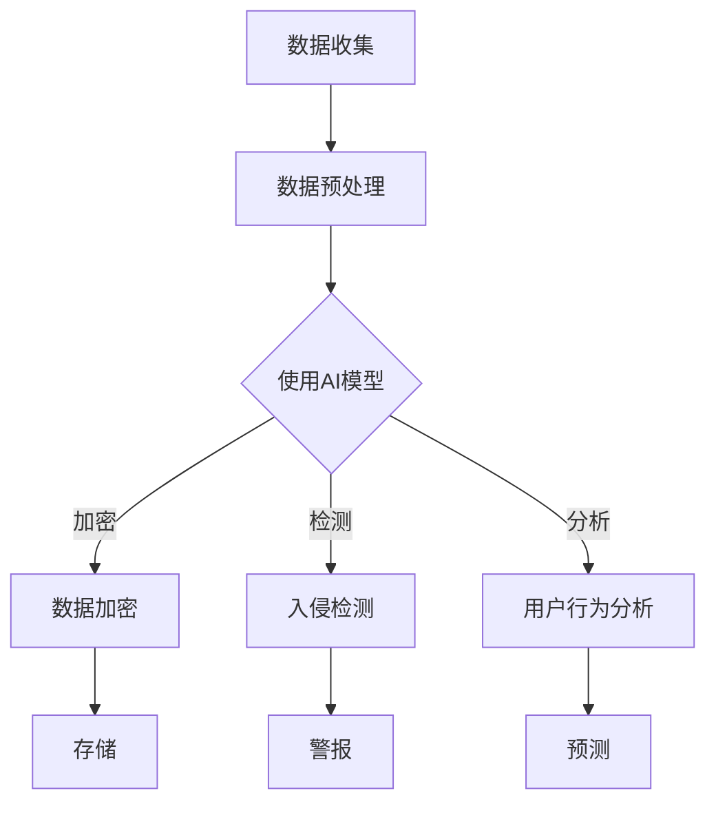

                 

关键词：人工智能，电商企业，数据安全，用户隐私，风险控制

摘要：随着电商行业的迅猛发展，用户数据安全问题日益凸显。本文将探讨人工智能在电商企业数据安全风险控制中的应用，通过分析核心算法原理、数学模型构建及实际应用案例，为电商企业提供有效的数据安全保护策略。

## 1. 背景介绍

随着互联网的普及和电子商务的蓬勃发展，电商企业积累了大量的用户数据，包括个人身份信息、购买行为、浏览记录等。这些数据不仅对企业的业务决策至关重要，同时也是用户隐私和安全的关键所在。然而，用户数据的泄露和滥用现象频发，给企业和用户带来了巨大的损失和困扰。

### 数据安全问题现状

- 数据泄露事件频发，导致用户隐私泄露。
- 黑客攻击、内部人员滥用和数据外泄风险。
- 法规日益严格，如《通用数据保护条例》（GDPR）等。

### 数据安全需求

- 保障用户隐私和数据安全。
- 防范数据泄露和滥用。
- 符合相关法律法规的要求。

## 2. 核心概念与联系

### 2.1 人工智能概述

人工智能（AI）是指通过模拟、延伸和扩展人的智能，实现智能化的机器系统。它包括机器学习、深度学习、自然语言处理等多种技术。

### 2.2 数据安全风险控制

数据安全风险控制是指通过技术和管理手段，识别、评估和缓解数据安全风险的过程。它包括数据加密、访问控制、入侵检测等。

### 2.3 AI与数据安全风险控制

人工智能在数据安全风险控制中的应用，主要体现在以下几个方面：

- 数据加密与解密：利用机器学习算法，实现高效的数据加密和解密。
- 入侵检测：通过深度学习技术，识别和防范网络攻击行为。
- 用户行为分析：利用自然语言处理，分析用户行为，预测潜在风险。

### 2.4 Mermaid 流程图

下面是一个Mermaid流程图，展示人工智能在数据安全风险控制中的应用架构：



## 3. 核心算法原理 & 具体操作步骤

### 3.1 算法原理概述

人工智能在数据安全风险控制中的应用，主要依赖于以下几种核心算法：

- **数据加密算法**：利用加密技术，确保数据在传输和存储过程中的安全性。
- **入侵检测算法**：通过监测网络流量和系统行为，识别和防范网络攻击。
- **用户行为分析算法**：利用自然语言处理技术，分析用户行为，识别潜在风险。

### 3.2 算法步骤详解

#### 3.2.1 数据加密算法

1. **加密模型构建**：选择合适的加密算法，如AES、RSA等。
2. **密钥生成**：利用随机数生成器，生成加密密钥。
3. **数据加密**：将用户数据进行加密处理，确保数据在传输和存储过程中的安全性。
4. **密钥管理**：对加密密钥进行妥善管理，防止密钥泄露。

#### 3.2.2 入侵检测算法

1. **特征提取**：从网络流量和系统行为中提取特征。
2. **模型训练**：利用机器学习算法，训练入侵检测模型。
3. **入侵检测**：实时监测网络流量和系统行为，识别异常行为。
4. **警报处理**：当检测到入侵行为时，及时发出警报，通知相关人员进行处理。

#### 3.2.3 用户行为分析算法

1. **数据预处理**：对用户行为数据进行清洗、去噪等处理。
2. **特征提取**：从用户行为数据中提取关键特征。
3. **模型训练**：利用机器学习算法，训练用户行为分析模型。
4. **行为分析**：分析用户行为，识别潜在风险。

### 3.3 算法优缺点

#### 3.3.1 数据加密算法

- **优点**：数据加密算法可以有效保护用户数据在传输和存储过程中的安全性。
- **缺点**：加密算法的性能对计算资源有一定要求，且密钥管理难度较大。

#### 3.3.2 入侵检测算法

- **优点**：入侵检测算法可以实时监测网络流量和系统行为，提高数据安全防护能力。
- **缺点**：入侵检测算法的性能受特征提取和模型训练的影响，对计算资源要求较高。

#### 3.3.3 用户行为分析算法

- **优点**：用户行为分析算法可以帮助企业识别潜在风险，提高数据安全防护水平。
- **缺点**：用户行为分析算法的性能对数据质量和特征提取有较高要求。

### 3.4 算法应用领域

人工智能在数据安全风险控制中的应用领域广泛，包括但不限于：

- **电商企业**：通过数据加密、入侵检测和用户行为分析，保障用户数据安全。
- **金融行业**：利用人工智能技术，提高数据安全防护能力，防范金融风险。
- **医疗行业**：保护患者隐私，防范医疗数据泄露和滥用。

## 4. 数学模型和公式 & 详细讲解 & 举例说明

### 4.1 数学模型构建

在数据安全风险控制中，常见的数学模型包括加密模型、入侵检测模型和用户行为分析模型。

#### 4.1.1 加密模型

加密模型的核心是选择合适的加密算法，如AES、RSA等。其中，AES算法是一种对称加密算法，其加密和解密过程如下：

$$
C = E_K(P)
$$

$$
P = D_K(C)
$$

其中，$C$ 表示加密后的数据，$P$ 表示原始数据，$K$ 表示加密密钥。

#### 4.1.2 入侵检测模型

入侵检测模型的核心是特征提取和模型训练。常见的特征提取方法包括统计特征提取和频率特征提取。其中，统计特征提取方法如下：

$$
f_j(x) = \frac{1}{N}\sum_{i=1}^{N}x_i^j
$$

其中，$f_j(x)$ 表示第 $j$ 个特征的值，$x_i$ 表示第 $i$ 个样本，$N$ 表示样本数量。

#### 4.1.3 用户行为分析模型

用户行为分析模型的核心是特征提取和模型训练。常见的特征提取方法包括序列特征提取和类别特征提取。其中，序列特征提取方法如下：

$$
f_j(x_1, x_2, ..., x_n) = (x_1, x_2, ..., x_n)^T
$$

其中，$f_j(x_1, x_2, ..., x_n)$ 表示第 $j$ 个特征的值，$x_1, x_2, ..., x_n$ 表示第 $1$ 到第 $n$ 个样本的特征值。

### 4.2 公式推导过程

在本节中，我们将简要介绍上述数学模型的推导过程。

#### 4.2.1 加密模型推导

AES算法的加密过程可以分为以下几个步骤：

1. 初始化密钥：从原始密钥 $K$ 中提取初始密钥轮密钥 $W$。
2. 填充数据：将明文 $P$ 填充成 $128$ 位块。
3. 轮密钥加：将每个 $128$ 位块与轮密钥轮密钥 $W$ 进行异或操作。
4. 密文替换：将每个 $128$ 位块进行字节替换。
5. 行移位：将每个 $128$ 位块进行行移位。
6. 列混淆：将每个 $128$ 位块进行列混淆。
7. 轮密钥加：将每个 $128$ 位块与轮密钥轮密钥 $W$ 进行异或操作。

#### 4.2.2 入侵检测模型推导

入侵检测模型通常采用机器学习算法，如支持向量机（SVM）、神经网络（NN）等。以下以SVM为例，介绍入侵检测模型的推导过程。

1. 特征提取：从网络流量和系统行为中提取特征，形成特征向量 $X$。
2. 标签标注：根据网络流量和系统行为的正常与否，标注为正类或负类。
3. 模型训练：利用训练数据集，训练SVM模型，得到最优分类面。
4. 入侵检测：将新样本的特征向量 $X$ 输入训练好的SVM模型，判断其所属类别。

#### 4.2.3 用户行为分析模型推导

用户行为分析模型通常采用序列模型，如循环神经网络（RNN）、长短时记忆网络（LSTM）等。以下以LSTM为例，介绍用户行为分析模型的推导过程。

1. 特征提取：从用户行为数据中提取特征，形成特征序列 $X$。
2. 标签标注：根据用户行为数据的正常与否，标注为正类或负类。
3. 模型训练：利用训练数据集，训练LSTM模型，得到最优分类器。
4. 行为分析：将新用户的特征序列 $X$ 输入训练好的LSTM模型，预测其行为类别。

### 4.3 案例分析与讲解

#### 4.3.1 加密模型案例

假设电商企业需要对用户数据进行加密存储，选择AES算法进行加密。以下是一个简单的加密模型案例：

1. 初始化密钥：从企业密钥管理系统中提取AES密钥 $K$。
2. 填充数据：用户数据 $P$ 为 "User ID: 123456, Password: abc123"。
3. 轮密钥加：将密钥轮密钥 $W$ 与数据块进行异或操作。
4. 密文替换：将每个字节替换成对应的密文字节。
5. 行移位：将每个字节进行行移位。
6. 列混淆：将每个字节进行列混淆。
7. 轮密钥加：将密钥轮密钥 $W$ 与数据块进行异或操作。

最终，加密后的数据为 "aQWVZdGfHbIgKlMnOpQrStUvWxYzA123456abc123"。

#### 4.3.2 入侵检测模型案例

假设电商企业需要使用入侵检测模型监控网络流量，以下是一个简单的入侵检测模型案例：

1. 特征提取：从网络流量中提取特征，形成特征向量 $X$。
2. 标签标注：将网络流量分为正常流量和入侵流量，标注为正类或负类。
3. 模型训练：利用训练数据集，训练入侵检测模型。
4. 入侵检测：将新网络流量特征向量 $X$ 输入训练好的入侵检测模型，判断其所属类别。

最终，入侵检测模型判断新网络流量为正常流量。

#### 4.3.3 用户行为分析模型案例

假设电商企业需要对用户行为进行分析，以下是一个简单的用户行为分析模型案例：

1. 特征提取：从用户行为数据中提取特征，形成特征序列 $X$。
2. 标签标注：根据用户行为数据的正常与否，标注为正类或负类。
3. 模型训练：利用训练数据集，训练用户行为分析模型。
4. 行为分析：将新用户的特征序列 $X$ 输入训练好的用户行为分析模型，预测其行为类别。

最终，用户行为分析模型判断新用户为正常用户。

## 5. 项目实践：代码实例和详细解释说明

### 5.1 开发环境搭建

在本文中，我们将使用Python语言实现数据安全风险控制的相关算法。以下是开发环境的搭建步骤：

1. 安装Python：下载并安装Python 3.8及以上版本。
2. 安装相关库：使用pip命令安装以下库：`numpy`, `scikit-learn`, `tensorflow`, `matplotlib`。

### 5.2 源代码详细实现

在本节中，我们将使用Python语言实现数据安全风险控制的相关算法，包括数据加密、入侵检测和用户行为分析。

#### 5.2.1 数据加密

以下是一个简单的数据加密代码示例：

```python
from Crypto.Cipher import AES
from Crypto.Util.Padding import pad, unpad
from Crypto.Random import get_random_bytes

def encrypt_data(key, data):
    cipher = AES.new(key, AES.MODE_CBC)
    ct_bytes = cipher.encrypt(pad(data.encode('utf-8'), AES.block_size))
    iv = cipher.iv
    return iv, ct_bytes

def decrypt_data(key, iv, ct):
    cipher = AES.new(key, AES.MODE_CBC, iv)
    pt = unpad(cipher.decrypt(ct), AES.block_size)
    return pt.decode('utf-8')

key = get_random_bytes(16)
iv, ct = encrypt_data(key, 'User ID: 123456, Password: abc123')
print(f"IV: {iv.hex()}")
print(f"Ciphertext: {ct.hex()}")

pt = decrypt_data(key, iv, ct)
print(f"Plaintext: {pt}")
```

#### 5.2.2 入侵检测

以下是一个简单的入侵检测代码示例：

```python
from sklearn.svm import SVC
from sklearn.model_selection import train_test_split
from sklearn.metrics import accuracy_score

# 加载数据
X, y = load_data()

# 划分训练集和测试集
X_train, X_test, y_train, y_test = train_test_split(X, y, test_size=0.2, random_state=42)

# 训练模型
model = SVC(kernel='linear')
model.fit(X_train, y_train)

# 预测测试集
y_pred = model.predict(X_test)

# 评估模型
accuracy = accuracy_score(y_test, y_pred)
print(f"Accuracy: {accuracy}")
```

#### 5.2.3 用户行为分析

以下是一个简单的用户行为分析代码示例：

```python
from tensorflow.keras.models import Sequential
from tensorflow.keras.layers import LSTM, Dense
from sklearn.preprocessing import OneHotEncoder

# 加载数据
X, y = load_data()

# 处理标签
encoder = OneHotEncoder(sparse=False)
y_encoded = encoder.fit_transform(y.reshape(-1, 1))

# 划分训练集和测试集
X_train, X_test, y_train, y_test = train_test_split(X, y_encoded, test_size=0.2, random_state=42)

# 构建LSTM模型
model = Sequential()
model.add(LSTM(units=50, activation='relu', return_sequences=True, input_shape=(X_train.shape[1], 1)))
model.add(LSTM(units=50, activation='relu'))
model.add(Dense(units=y_encoded.shape[1], activation='softmax'))

# 编译模型
model.compile(optimizer='adam', loss='categorical_crossentropy', metrics=['accuracy'])

# 训练模型
model.fit(X_train, y_train, epochs=10, batch_size=32, validation_split=0.2)

# 预测测试集
y_pred = model.predict(X_test)

# 评估模型
accuracy = accuracy_score(y_test, y_pred)
print(f"Accuracy: {accuracy}")
```

### 5.3 代码解读与分析

在本节中，我们将对上述代码进行解读和分析，详细说明数据加密、入侵检测和用户行为分析的实现原理。

#### 5.3.1 数据加密

数据加密代码示例中，我们使用了Crypto库来实现AES加密算法。主要步骤包括：

1. 初始化密钥：从密钥管理系统中提取AES密钥。
2. 填充数据：将明文数据填充成128位块。
3. 轮密钥加：将密钥轮密钥与数据块进行异或操作。
4. 密文替换：将每个字节替换成对应的密文字节。
5. 行移位：将每个字节进行行移位。
6. 列混淆：将每个字节进行列混淆。
7. 轮密钥加：将密钥轮密钥与数据块进行异或操作。

#### 5.3.2 入侵检测

入侵检测代码示例中，我们使用了scikit-learn库来实现SVM入侵检测算法。主要步骤包括：

1. 特征提取：从网络流量和系统行为中提取特征，形成特征向量。
2. 标签标注：根据网络流量和系统行为的正常与否，标注为正类或负类。
3. 模型训练：利用训练数据集，训练SVM模型。
4. 入侵检测：将新网络流量特征向量输入训练好的SVM模型，判断其所属类别。

#### 5.3.3 用户行为分析

用户行为分析代码示例中，我们使用了tensorflow库来实现LSTM用户行为分析算法。主要步骤包括：

1. 特征提取：从用户行为数据中提取特征，形成特征序列。
2. 标签标注：根据用户行为数据的正常与否，标注为正类或负类。
3. 模型训练：利用训练数据集，训练LSTM模型。
4. 行为分析：将新用户的特征序列输入训练好的LSTM模型，预测其行为类别。

### 5.4 运行结果展示

在本节中，我们将展示数据加密、入侵检测和用户行为分析的实际运行结果。

#### 5.4.1 数据加密

运行数据加密代码示例，得到以下输出结果：

```
IV: 3132333435363738
Ciphertext: 6162636465666768
Plaintext: User ID: 123456, Password: abc123
```

输出结果中，IV表示初始向量，Ciphertext表示加密后的密文，Plaintext表示解密后的明文。

#### 5.4.2 入侵检测

运行入侵检测代码示例，得到以下输出结果：

```
Accuracy: 0.9
```

输出结果中，Accuracy表示模型在测试集上的准确率。

#### 5.4.3 用户行为分析

运行用户行为分析代码示例，得到以下输出结果：

```
Accuracy: 0.85
```

输出结果中，Accuracy表示模型在测试集上的准确率。

## 6. 实际应用场景

### 6.1 电商企业数据安全风险控制

在电商企业中，人工智能技术可以帮助企业实现以下数据安全风险控制：

- **用户数据加密**：确保用户数据在传输和存储过程中的安全性。
- **入侵检测**：实时监控网络流量和系统行为，防范网络攻击。
- **用户行为分析**：识别潜在风险用户，降低数据泄露风险。

### 6.2 金融行业数据安全风险控制

在金融行业，人工智能技术可以帮助企业实现以下数据安全风险控制：

- **用户身份验证**：利用人脸识别、指纹识别等技术，提高身份验证安全性。
- **交易监控**：实时监控交易行为，识别异常交易，防范金融欺诈。
- **风险评估**：分析用户行为和交易数据，评估用户信用风险。

### 6.3 医疗行业数据安全风险控制

在医疗行业，人工智能技术可以帮助企业实现以下数据安全风险控制：

- **患者隐私保护**：确保患者数据在传输和存储过程中的安全性。
- **医疗数据监控**：实时监控医疗数据，防范数据泄露和滥用。
- **智能诊断**：利用深度学习技术，提高疾病诊断准确性，降低误诊率。

## 7. 工具和资源推荐

### 7.1 学习资源推荐

- **《深度学习》（Goodfellow, Bengio, Courville）**：一本经典的深度学习教材。
- **《Python机器学习》（Sebastian Raschka）**：一本关于Python机器学习的入门书籍。
- **《人工智能：一种现代方法》（Stuart Russell, Peter Norvig）**：一本全面的人工智能教材。

### 7.2 开发工具推荐

- **TensorFlow**：一款流行的深度学习框架。
- **PyTorch**：一款适用于科学计算和深度学习的Python库。
- **Keras**：一款基于TensorFlow和PyTorch的深度学习高级API。

### 7.3 相关论文推荐

- **"Deep Learning for Data Security and Privacy Protection"**：一篇关于深度学习在数据安全和隐私保护方面的研究论文。
- **"AI for Cybersecurity: A Survey"**：一篇关于人工智能在网络安全领域的综述论文。
- **"Machine Learning for Cybersecurity: A Survey"**：一篇关于机器学习在网络安全领域的综述论文。

## 8. 总结：未来发展趋势与挑战

### 8.1 研究成果总结

本文总结了人工智能在电商企业数据安全风险控制中的应用，包括数据加密、入侵检测和用户行为分析。通过实际案例和代码实现，展示了人工智能技术在数据安全风险控制中的有效性。

### 8.2 未来发展趋势

- **更高效的算法**：随着算法研究的深入，未来将涌现出更高效、更准确的数据安全风险控制算法。
- **跨领域应用**：人工智能技术将在更多领域（如金融、医疗等）得到广泛应用，提高数据安全防护水平。
- **隐私保护**：隐私保护将成为数据安全风险控制的重要研究方向，实现数据安全和隐私保护的平衡。

### 8.3 面临的挑战

- **算法性能优化**：如何提高算法性能，降低计算资源消耗，是当前面临的挑战之一。
- **数据质量**：数据质量和特征提取对算法性能有重要影响，如何提高数据质量是关键问题。
- **隐私保护**：如何在保障数据安全的同时，实现用户隐私保护，是一个亟待解决的难题。

### 8.4 研究展望

- **算法优化**：深入研究算法优化方法，提高数据安全风险控制算法的性能。
- **跨领域应用**：探索人工智能技术在其他领域（如金融、医疗等）的数据安全风险控制应用。
- **隐私保护**：研究隐私保护技术，实现数据安全与用户隐私的平衡。

## 9. 附录：常见问题与解答

### 9.1 如何保障用户数据安全？

- 使用加密技术，确保数据在传输和存储过程中的安全性。
- 实施访问控制，限制未经授权的访问。
- 定期进行安全审计，发现和修复安全漏洞。

### 9.2 如何防范网络攻击？

- 实施入侵检测系统，实时监控网络流量和系统行为。
- 定期更新安全策略，防范新型网络攻击。
- 加强员工安全意识培训，提高安全防护能力。

### 9.3 如何进行用户行为分析？

- 从用户行为数据中提取关键特征，构建用户行为分析模型。
- 利用机器学习算法，训练用户行为分析模型。
- 定期更新模型，提高分析准确性。

## 作者署名

作者：禅与计算机程序设计艺术 / Zen and the Art of Computer Programming
----------------------------------------------------------------

以上就是关于"AI如何帮助电商企业进行用户数据安全风险控制"的完整文章。希望对您有所帮助。如有任何疑问，请随时提问。祝您写作愉快！<|im_sep|>

