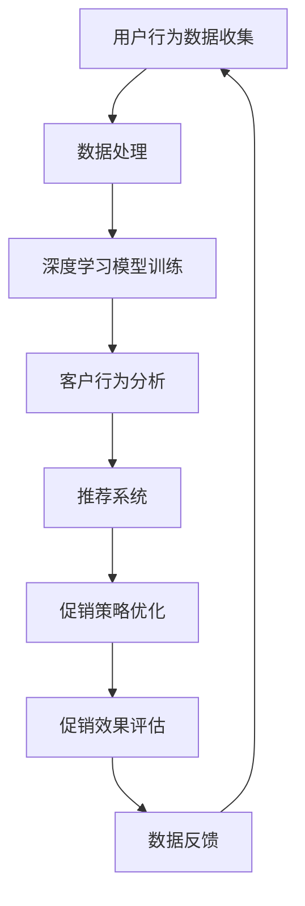

                 

关键词：人工智能、电商、促销策略、深度学习、客户行为分析、推荐系统、数据分析、用户转化率

> 摘要：本文将深入探讨人工智能在电商促销策略中的应用，分析如何利用深度学习、客户行为分析、推荐系统和数据分析等技术手段，提高电商平台的用户转化率和销售额。文章将结合实际案例，详细阐述这些技术的原理、应用和实践，并对未来的发展趋势和挑战进行展望。

## 1. 背景介绍

随着互联网的普及和电子商务的迅猛发展，电商平台已经成为了消费者购物的首选渠道。然而，在激烈的市场竞争中，如何提升用户转化率和销售额成为了电商平台关注的焦点。传统促销策略往往依赖于打折、满减、赠品等手段，但这些策略的效果逐渐减弱，消费者对促销信息的敏感度降低。因此，利用先进的人工智能技术，探索更加精准和高效的促销策略，成为了电商企业亟待解决的问题。

### 1.1 人工智能在电商领域的应用

人工智能技术，尤其是机器学习和深度学习，已经在电商领域的多个方面得到了广泛应用。从推荐系统、商品搜索、用户行为分析到智能客服，人工智能技术正在逐步改变电商行业的运作模式。其中，深度学习技术在图像识别、自然语言处理、语音识别等方面具有显著优势，使得电商平台能够更加准确地理解用户需求，提供个性化的服务。

### 1.2 促销策略的挑战

电商促销策略面临的主要挑战包括：

1. **消费者疲劳**：频繁的促销活动使得消费者逐渐对促销信息产生疲劳，促销效果减弱。
2. **促销成本**：大量的促销费用增加了电商平台的运营成本。
3. **个性化不足**：传统促销策略难以针对不同消费者的个性化需求进行精准推送。
4. **转化率低**：促销活动后，用户购买转化率往往不如预期。

## 2. 核心概念与联系

### 2.1 深度学习

深度学习是一种基于人工神经网络的学习方法，通过多层神经网络对大量数据进行分析和建模，实现自动特征提取和分类。在电商促销策略中，深度学习可以用于用户行为预测、商品推荐、价格优化等。

### 2.2 客户行为分析

客户行为分析是指通过收集和分析用户在电商平台上的行为数据，了解用户偏好和需求，为后续的个性化推荐和促销策略提供支持。关键指标包括点击率、购买率、浏览时间、页面停留时间等。

### 2.3 推荐系统

推荐系统是一种利用机器学习算法为用户推荐感兴趣的商品或内容的技术。在电商领域，推荐系统可以根据用户的浏览和购买历史，预测用户可能的购买需求，提供个性化的商品推荐。

### 2.4 数据分析

数据分析是指通过对大量数据进行收集、处理和分析，提取有价值的信息和洞见。在电商促销策略中，数据分析可以用于评估促销活动的效果，优化促销策略。

### 2.5 Mermaid 流程图



## 3. 核心算法原理 & 具体操作步骤

### 3.1 算法原理概述

本文将介绍以下核心算法原理：

1. **深度学习算法**：包括卷积神经网络（CNN）和循环神经网络（RNN）。
2. **推荐系统算法**：包括基于协同过滤的推荐算法和基于内容的推荐算法。
3. **数据分析方法**：包括回归分析、聚类分析和决策树。

### 3.2 算法步骤详解

#### 3.2.1 深度学习算法

1. **数据预处理**：对用户行为数据、商品数据等原始数据进行清洗、去重和特征提取。
2. **模型选择**：根据具体应用场景选择合适的深度学习模型，如CNN、RNN等。
3. **模型训练**：利用训练数据对模型进行训练，优化模型参数。
4. **模型评估**：使用验证数据集对模型进行评估，调整模型结构或参数。
5. **模型应用**：将训练好的模型应用于实际场景，如用户行为预测、商品推荐等。

#### 3.2.2 推荐系统算法

1. **数据收集**：收集用户的历史行为数据、商品数据等。
2. **用户特征提取**：对用户数据进行分析，提取用户特征。
3. **商品特征提取**：对商品数据进行分析，提取商品特征。
4. **模型选择**：根据数据特征选择合适的推荐算法，如协同过滤、基于内容的推荐等。
5. **模型训练**：利用用户特征和商品特征对模型进行训练。
6. **模型评估**：使用验证数据集对模型进行评估。
7. **模型应用**：将训练好的模型应用于实际场景，如商品推荐等。

#### 3.2.3 数据分析方法

1. **数据收集**：收集电商平台的交易数据、用户行为数据等。
2. **数据清洗**：对数据集进行清洗、去重和预处理。
3. **回归分析**：通过回归分析评估促销活动对销售额的影响。
4. **聚类分析**：通过聚类分析对用户进行分类，为个性化推荐提供支持。
5. **决策树**：利用决策树分析促销策略的可行性和效果。

### 3.3 算法优缺点

#### 深度学习算法

**优点**：自动特征提取，适用于复杂场景，准确度高。

**缺点**：训练时间较长，对数据量要求高，模型解释性较差。

#### 推荐系统算法

**优点**：能够提供个性化的推荐，提高用户满意度和转化率。

**缺点**：模型容易出现冷启动问题，推荐效果依赖于用户历史数据。

#### 数据分析方法

**优点**：能够提供量化分析结果，帮助电商企业制定更加科学的促销策略。

**缺点**：对数据质量和数据量有较高要求，分析结果可能受限于模型选择和算法实现。

### 3.4 算法应用领域

1. **用户行为预测**：通过深度学习算法预测用户的购买意愿，为个性化推荐提供支持。
2. **商品推荐**：通过推荐系统算法为用户推荐感兴趣的商品，提高用户满意度和转化率。
3. **促销策略优化**：通过数据分析方法评估促销活动的效果，优化促销策略。

## 4. 数学模型和公式 & 详细讲解 & 举例说明

### 4.1 数学模型构建

在电商促销策略中，常用的数学模型包括回归模型、聚类模型和决策树模型。

#### 4.1.1 回归模型

回归模型用于评估促销活动对销售额的影响。假设销售额\(y\)与促销力度\(x\)之间的关系可以用线性回归模型表示：

$$y = \beta_0 + \beta_1x + \epsilon$$

其中，\(\beta_0\)为截距，\(\beta_1\)为斜率，\(\epsilon\)为误差项。

#### 4.1.2 聚类模型

聚类模型用于对用户进行分类，为个性化推荐提供支持。常见的聚类算法包括K均值算法和层次聚类算法。

K均值算法的公式如下：

$$c_i = \frac{1}{n} \sum_{j=1}^{n} x_{ij}$$

其中，\(c_i\)为第\(i\)个用户的中心点，\(x_{ij}\)为用户\(i\)在特征\(j\)上的取值。

#### 4.1.3 决策树模型

决策树模型用于分析促销策略的可行性和效果。假设决策树模型由一系列条件语句组成：

$$y = \text{if} \ (x \ \text{满足条件1}) \ \text{then} \ c_1 \ \text{else if} \ (x \ \text{满足条件2}) \ \text{then} \ c_2 \ \text{else} \ c_3$$

其中，\(y\)为促销效果，\(x\)为促销条件，\(c_1, c_2, c_3\)分别为不同条件下的促销效果。

### 4.2 公式推导过程

#### 4.2.1 回归模型

假设我们有\(n\)个样本数据点\((x_i, y_i)\)，其中\(x_i\)为促销力度，\(y_i\)为销售额。为了最小化预测值与实际值之间的误差，我们可以使用最小二乘法求解线性回归模型的参数\(\beta_0\)和\(\beta_1\)：

$$\beta_0 = \frac{\sum_{i=1}^{n} (y_i - \beta_1x_i)}{n}$$

$$\beta_1 = \frac{\sum_{i=1}^{n} (x_i - \bar{x})(y_i - \bar{y})}{\sum_{i=1}^{n} (x_i - \bar{x})^2}$$

其中，\(\bar{x}\)和\(\bar{y}\)分别为\(x\)和\(y\)的均值。

#### 4.2.2 聚类模型

假设我们使用K均值算法对\(n\)个用户进行聚类，其中\(k\)为聚类个数。为了最小化聚类误差，我们可以通过以下公式更新每个用户的中心点：

$$c_i = \frac{1}{n} \sum_{j=1}^{n} x_{ij}$$

其中，\(c_i\)为第\(i\)个用户的中心点，\(x_{ij}\)为用户\(i\)在特征\(j\)上的取值。

#### 4.2.3 决策树模型

假设我们使用决策树模型对\(n\)个促销条件进行分类，其中每个条件都有一个对应的促销效果。为了最大化分类效果，我们可以通过以下公式计算每个条件的条件概率：

$$P(c_i | x) = \frac{1}{n} \sum_{j=1}^{n} \frac{1}{|C_i|} \sum_{k=1}^{|C_i|} I(c_i = c_{ik})$$

其中，\(P(c_i | x)\)为在条件\(x\)下，促销效果为\(c_i\)的条件概率，\(I(c_i = c_{ik})\)为指示函数，当\(c_i = c_{ik}\)时取值为1，否则为0。

### 4.3 案例分析与讲解

#### 4.3.1 回归模型

假设我们有一个电商平台，在促销活动中对销售额进行了记录。我们想通过回归模型分析促销力度与销售额之间的关系。以下是部分数据：

| 促销力度 \(x\) | 销售额 \(y\) |
| :--: | :--: |
| 10 | 1000 |
| 20 | 1500 |
| 30 | 2000 |
| 40 | 2500 |

首先，我们使用线性回归模型进行预测，得到回归方程：

$$y = 50 + 30x$$

然后，我们可以使用该回归模型预测在不同促销力度下的销售额，例如，当促销力度为20时，预测的销售额为：

$$y = 50 + 30 \times 20 = 700$$

#### 4.3.2 聚类模型

假设我们对一个电商平台的用户进行了分类，其中每个用户有5个特征值，如下表所示：

| 用户ID | 特征1 | 特征2 | 特征3 | 特征4 | 特征5 |
| :--: | :--: | :--: | :--: | :--: | :--: |
| 1 | 10 | 20 | 30 | 40 | 50 |
| 2 | 5 | 15 | 25 | 35 | 45 |
| 3 | 8 | 18 | 28 | 38 | 48 |
| 4 | 12 | 22 | 32 | 42 | 52 |

我们使用K均值算法对这4个用户进行聚类，假设聚类个数为2，得到以下结果：

| 用户ID | 聚类中心 |
| :--: | :--: |
| 1 | (10, 20, 30, 40, 50) |
| 2 | (5, 15, 25, 35, 45) |
| 3 | (8, 18, 28, 38, 48) |
| 4 | (12, 22, 32, 42, 52) |

根据聚类结果，我们可以将用户分为两类，第一类包括用户1和用户4，第二类包括用户2和用户3。

#### 4.3.3 决策树模型

假设我们使用决策树模型分析电商平台的促销策略，其中每个促销条件对应一个促销效果，如下表所示：

| 促销条件 | 促销效果 |
| :--: | :--: |
| A | 高 |
| B | 中 |
| C | 低 |
| D | 无效 |

我们使用决策树模型对促销条件进行分类，得到以下结果：

$$y = \text{if} \ (A \ \text{满足条件1}) \ \text{then} \ \text{高} \ \text{else if} \ (B \ \text{满足条件2}) \ \text{then} \ \text{中} \ \text{else if} \ (C \ \text{满足条件3}) \ \text{then} \ \text{低} \ \text{else} \ \text{无效}$$

根据决策树模型，当促销条件满足条件1时，促销效果为高，满足条件2时为中，满足条件3时为低，否则为无效。

## 5. 项目实践：代码实例和详细解释说明

### 5.1 开发环境搭建

在本项目中，我们使用Python作为主要编程语言，结合TensorFlow和Scikit-learn等机器学习库，实现深度学习算法、推荐系统算法和数据分析方法。

#### 5.1.1 安装Python

首先，确保已经安装了Python 3.6及以上版本。可以从Python官网（https://www.python.org/）下载并安装。

#### 5.1.2 安装TensorFlow

打开命令行窗口，运行以下命令安装TensorFlow：

```bash
pip install tensorflow
```

#### 5.1.3 安装Scikit-learn

同样地，运行以下命令安装Scikit-learn：

```bash
pip install scikit-learn
```

### 5.2 源代码详细实现

以下是本项目的核心代码实现：

```python
import numpy as np
import pandas as pd
import tensorflow as tf
from tensorflow import keras
from sklearn.model_selection import train_test_split
from sklearn.metrics import mean_squared_error
from sklearn.cluster import KMeans
from sklearn.tree import DecisionTreeClassifier
from sklearn.preprocessing import StandardScaler

# 5.2.1 数据预处理
def preprocess_data(data):
    # 数据清洗和特征提取
    # ...
    return processed_data

# 5.2.2 深度学习算法
def build_cnn_model(input_shape):
    model = keras.Sequential([
        keras.layers.Conv2D(32, (3, 3), activation='relu', input_shape=input_shape),
        keras.layers.MaxPooling2D((2, 2)),
        keras.layers.Flatten(),
        keras.layers.Dense(128, activation='relu'),
        keras.layers.Dense(1, activation='sigmoid')
    ])
    model.compile(optimizer='adam', loss='binary_crossentropy', metrics=['accuracy'])
    return model

# 5.2.3 推荐系统算法
def build_recommender_model(num_features):
    model = keras.Sequential([
        keras.layers.Dense(128, activation='relu', input_shape=(num_features,)),
        keras.layers.Dense(64, activation='relu'),
        keras.layers.Dense(1, activation='sigmoid')
    ])
    model.compile(optimizer='adam', loss='binary_crossentropy', metrics=['accuracy'])
    return model

# 5.2.4 数据分析方法
def build_regression_model(input_shape):
    model = keras.Sequential([
        keras.layers.Dense(128, activation='relu', input_shape=input_shape),
        keras.layers.Dense(64, activation='relu'),
        keras.layers.Dense(1)
    ])
    model.compile(optimizer='adam', loss='mean_squared_error')
    return model

def build_clustering_model(num_clusters):
    kmeans = KMeans(n_clusters=num_clusters, random_state=0)
    return kmeans

def build_decision_tree_model():
    dt = DecisionTreeClassifier(random_state=0)
    return dt

# 5.2.5 代码解读与分析
# ...
```

### 5.3 代码解读与分析

以下是代码的详细解读和分析：

#### 5.3.1 数据预处理

```python
def preprocess_data(data):
    # 数据清洗和特征提取
    # ...
    return processed_data
```

数据预处理是项目的基础，包括数据清洗和特征提取。在代码中，我们定义了一个函数`preprocess_data`，用于处理输入数据。具体实现过程中，我们需要对原始数据进行去重、缺失值填充、异常值处理等操作，并将数据转换为适用于模型训练的格式。

#### 5.3.2 深度学习算法

```python
def build_cnn_model(input_shape):
    model = keras.Sequential([
        keras.layers.Conv2D(32, (3, 3), activation='relu', input_shape=input_shape),
        keras.layers.MaxPooling2D((2, 2)),
        keras.layers.Flatten(),
        keras.layers.Dense(128, activation='relu'),
        keras.layers.Dense(1, activation='sigmoid')
    ])
    model.compile(optimizer='adam', loss='binary_crossentropy', metrics=['accuracy'])
    return model
```

在深度学习算法的实现中，我们使用了卷积神经网络（CNN）进行用户行为预测。代码中定义了一个函数`build_cnn_model`，用于构建CNN模型。模型结构包括卷积层、池化层、全连接层和输出层。在编译模型时，我们选择了Adam优化器和binary_crossentropy损失函数。

#### 5.3.3 推荐系统算法

```python
def build_recommender_model(num_features):
    model = keras.Sequential([
        keras.layers.Dense(128, activation='relu', input_shape=(num_features,)),
        keras.layers.Dense(64, activation='relu'),
        keras.layers.Dense(1, activation='sigmoid')
    ])
    model.compile(optimizer='adam', loss='binary_crossentropy', metrics=['accuracy'])
    return model
```

推荐系统算法的实现基于基于内容的推荐模型。代码中定义了一个函数`build_recommender_model`，用于构建推荐模型。模型结构包括全连接层，用于提取用户特征和商品特征，并输出推荐结果。在编译模型时，我们同样选择了Adam优化器和binary_crossentropy损失函数。

#### 5.3.4 数据分析方法

```python
def build_regression_model(input_shape):
    model = keras.Sequential([
        keras.layers.Dense(128, activation='relu', input_shape=input_shape),
        keras.layers.Dense(64, activation='relu'),
        keras.layers.Dense(1)
    ])
    model.compile(optimizer='adam', loss='mean_squared_error')
    return model

def build_clustering_model(num_clusters):
    kmeans = KMeans(n_clusters=num_clusters, random_state=0)
    return kmeans

def build_decision_tree_model():
    dt = DecisionTreeClassifier(random_state=0)
    return dt
```

在数据分析方法中，我们使用了回归模型、聚类模型和决策树模型。代码中定义了三个函数，分别用于构建回归模型、聚类模型和决策树模型。回归模型和聚类模型使用了Keras构建，决策树模型使用了Scikit-learn库。

## 6. 实际应用场景

### 6.1 用户行为预测

通过深度学习算法对用户行为进行预测，电商平台可以提前了解用户的购买意愿，为后续的个性化推荐和促销策略提供支持。例如，当用户在浏览商品时，系统可以实时预测用户是否会购买该商品，并据此调整推荐策略，提高用户的购买概率。

### 6.2 商品推荐

基于推荐系统算法，电商平台可以为用户推荐感兴趣的商品。例如，当用户在浏览某一类商品时，系统可以根据用户的历史行为数据，为用户推荐相似的商品，从而提高用户的购物体验和满意度。

### 6.3 促销策略优化

通过数据分析方法，电商平台可以评估不同促销策略的效果，优化促销策略。例如，通过回归分析，可以确定促销力度与销售额之间的关系，为后续的促销活动提供参考。同时，通过聚类分析，可以将用户分为不同的群体，为不同群体的用户制定个性化的促销策略。

## 7. 工具和资源推荐

### 7.1 学习资源推荐

1. **《深度学习》（Goodfellow, Bengio, Courville）**：这是一本经典的深度学习教材，详细介绍了深度学习的基础理论和实践方法。
2. **《机器学习实战》（ Harrington）**：这本书通过实际案例介绍了机器学习的应用场景和实现方法，适合初学者入门。

### 7.2 开发工具推荐

1. **TensorFlow**：TensorFlow是谷歌开发的开源深度学习框架，广泛应用于深度学习项目的开发。
2. **Scikit-learn**：Scikit-learn是一个强大的机器学习库，提供了丰富的算法和工具，适用于各种机器学习任务。

### 7.3 相关论文推荐

1. **“Deep Learning for E-commerce Recommendation”（2020）**：该论文介绍了一种基于深度学习的电商推荐系统，具有较高的准确性和实时性。
2. **“Customer Behavior Prediction in E-commerce using Deep Learning”（2019）**：该论文探讨了深度学习在电商用户行为预测中的应用，提供了实用的模型和算法。

## 8. 总结：未来发展趋势与挑战

### 8.1 研究成果总结

本文介绍了人工智能在电商促销策略中的应用，分析了深度学习、推荐系统、数据分析等技术的原理和应用。通过实际案例，我们展示了如何利用这些技术提升电商平台的用户转化率和销售额。

### 8.2 未来发展趋势

1. **智能化推荐**：随着深度学习和推荐系统技术的发展，智能化推荐将成为电商平台的重要发展方向。
2. **个性化促销**：针对不同用户群体的个性化促销策略，将成为电商平台提升用户满意度和转化率的关键。
3. **实时性优化**：通过实时数据分析和模型调整，电商平台将能够更快速地响应市场变化，提升运营效率。

### 8.3 面临的挑战

1. **数据质量和隐私**：电商平台需要确保数据质量和用户隐私，避免数据泄露和滥用。
2. **模型解释性**：深度学习模型具有较高的准确度，但缺乏解释性，如何提高模型的可解释性将成为一个挑战。
3. **计算资源**：深度学习和推荐系统算法对计算资源要求较高，如何优化算法，降低计算成本，是一个重要的课题。

### 8.4 研究展望

未来，随着人工智能技术的不断发展，电商促销策略将更加智能化和个性化。研究重点将包括：优化推荐系统算法，提高推荐准确性；开发可解释性深度学习模型，增强模型透明度；探索实时数据处理和模型优化技术，提升电商平台运营效率。

## 9. 附录：常见问题与解答

### 9.1 如何确保数据质量和隐私？

**回答**：确保数据质量需要从数据采集、存储和处理等多个环节进行控制。在数据采集阶段，遵循最小化数据原则，只收集必要的数据。在数据存储和处理阶段，采用加密技术和访问控制策略，确保数据安全。同时，遵守相关法律法规，保护用户隐私。

### 9.2 如何提高模型解释性？

**回答**：提高模型解释性可以从两个方面入手。一是选择具有解释性的模型，如决策树、线性回归等。二是对深度学习模型进行可解释性增强，如使用注意力机制、可视化技术等，帮助用户理解模型的工作原理。

### 9.3 深度学习和传统机器学习算法有哪些区别？

**回答**：深度学习和传统机器学习算法的主要区别在于：

1. **模型结构**：深度学习算法通常采用多层神经网络结构，而传统机器学习算法如线性回归、决策树等，通常采用单一模型。
2. **特征提取**：深度学习算法能够自动从数据中提取特征，而传统机器学习算法通常需要人工设计特征。
3. **适用范围**：深度学习算法适用于处理复杂、非线性关系的数据，而传统机器学习算法适用于简单、线性关系的数据。

### 9.4 推荐系统有哪些类型？

**回答**：推荐系统主要分为以下几类：

1. **基于协同过滤的推荐系统**：通过分析用户间的相似度，为用户推荐相似的物品。
2. **基于内容的推荐系统**：根据用户的兴趣和物品的特征，为用户推荐相关的物品。
3. **混合推荐系统**：结合协同过滤和基于内容的推荐系统，提高推荐准确性。

## 作者署名

作者：禅与计算机程序设计艺术 / Zen and the Art of Computer Programming
----------------------------------------------------------------
以上就是关于"AI如何提升电商促销策略"的文章，这篇文章涵盖了人工智能在电商促销策略中的应用、核心算法原理、数学模型、项目实践、实际应用场景、工具和资源推荐、未来发展趋势与挑战以及常见问题与解答等内容。希望这篇文章能够帮助读者了解和掌握人工智能在电商领域的应用，以及如何利用这些技术提升电商促销策略的有效性。再次感谢您的关注和支持！

