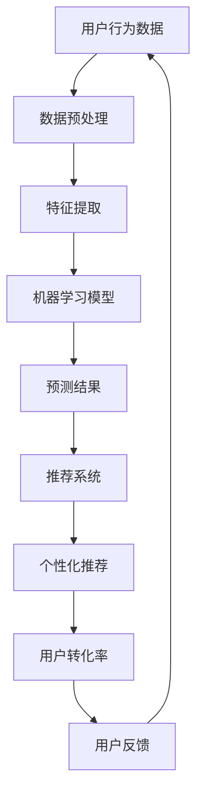

                 

关键词：人工智能、电商平台、用户转化率、机器学习、推荐系统、自然语言处理、深度学习

摘要：本文将探讨人工智能（AI）在电商平台中的应用，特别是如何利用AI技术提升用户转化率。通过分析核心算法原理、数学模型、项目实践，我们将详细阐述AI在电商领域的实际应用，并展望未来的发展趋势与挑战。

## 1. 背景介绍

随着互联网的普及和电子商务的快速发展，电商平台已成为消费者购买商品的主要渠道。然而，在竞争激烈的市场环境中，如何提高用户转化率成为了电商平台亟待解决的问题。用户转化率，即用户在访问电商平台后完成购买行为的比例，是衡量平台运营效率的重要指标。传统的提高转化率的方法主要依赖于营销策略和用户界面优化，但这些方法的局限性逐渐显现。

近年来，人工智能（AI）技术的快速发展为电商平台提供了新的机遇。AI能够通过分析用户行为数据，提供个性化的推荐和优化用户体验，从而提高用户转化率。本文将围绕AI在电商平台中的应用，特别是机器学习、推荐系统和自然语言处理等技术，详细探讨如何利用AI提升用户转化率。

## 2. 核心概念与联系

### 2.1 机器学习

机器学习（Machine Learning）是一种通过算法从数据中学习规律并作出预测或决策的技术。在电商平台上，机器学习可以用于分析用户行为数据，识别潜在客户，提高推荐系统的准确性。

### 2.2 推荐系统

推荐系统（Recommendation System）是一种基于用户历史行为和偏好，为用户推荐相关商品或内容的系统。在电商平台上，推荐系统可以帮助用户发现他们可能感兴趣的商品，从而提高购买意愿。

### 2.3 自然语言处理

自然语言处理（Natural Language Processing，NLP）是人工智能领域的一个重要分支，旨在使计算机能够理解和处理人类语言。在电商平台上，NLP技术可以用于处理用户评论、搜索查询和产品描述，从而提供更准确的推荐和优化用户体验。

### 2.4 深度学习

深度学习（Deep Learning）是机器学习的一个分支，通过多层神经网络对大量数据进行分析和学习。在电商平台上，深度学习可以用于图像识别、语音识别和情感分析等领域，从而提高用户转化率。

### 2.5 Mermaid流程图

下面是电商平台上AI应用的核心流程图，展示了机器学习、推荐系统、自然语言处理和深度学习等技术之间的联系：



## 3. 核心算法原理 & 具体操作步骤

### 3.1 算法原理概述

电商平台提升用户转化率的关键在于个性化推荐。个性化推荐系统通过分析用户历史行为数据，预测用户可能感兴趣的商品，从而提高购买意愿。个性化推荐系统通常包括用户建模、商品建模和推荐算法三个主要部分。

### 3.2 算法步骤详解

1. **用户建模**：用户建模是推荐系统的第一步，通过分析用户的历史行为数据（如浏览记录、购买记录、搜索记录等），构建用户画像。

2. **商品建模**：商品建模是推荐系统的第二步，通过分析商品属性（如分类、品牌、价格等），构建商品特征向量。

3. **推荐算法**：推荐算法是推荐系统的核心，通过用户建模和商品建模，计算用户对商品的潜在兴趣度，从而生成个性化推荐列表。

### 3.3 算法优缺点

- **优点**：个性化推荐系统可以提高用户满意度，提高购买转化率，增加电商平台收入。

- **缺点**：个性化推荐系统需要大量计算资源和时间，且需要处理大量噪声数据，可能导致推荐结果偏差。

### 3.4 算法应用领域

个性化推荐算法在电商、新闻、社交媒体等多个领域都有广泛应用。在电商领域，个性化推荐系统可以帮助用户发现感兴趣的商品，提高购买转化率；在新闻领域，个性化推荐系统可以帮助用户发现感兴趣的新闻内容，提高用户粘性；在社交媒体领域，个性化推荐系统可以帮助用户发现感兴趣的朋友和话题，提高社交互动。

## 4. 数学模型和公式 & 详细讲解 & 举例说明

### 4.1 数学模型构建

个性化推荐系统的数学模型主要包括用户-商品相似度计算、用户兴趣度预测和推荐列表生成。

- **用户-商品相似度计算**：通常使用余弦相似度或皮尔逊相关系数来计算用户和商品之间的相似度。

  $$ similarity(u_i, u_j) = \frac{u_i \cdot u_j}{\|u_i\| \|u_j\|} $$

  其中，$u_i$和$u_j$分别表示用户$i$和用户$j$的特征向量，$\|\|$表示向量的模。

- **用户兴趣度预测**：通常使用基于矩阵分解的算法（如Singular Value Decomposition，SVD）来预测用户对商品的兴趣度。

  $$ R_{ij} = \sigma_k r_{ik} s_{kj} $$

  其中，$R$表示用户-商品评分矩阵，$\sigma_k$表示SVD分解得到的奇异值，$r_{ik}$和$s_{kj}$分别表示用户$i$对商品$k$的评分和商品$k$对用户$j$的评分。

- **推荐列表生成**：根据用户兴趣度预测，生成个性化推荐列表。

  $$推荐列表 = \text{argmax}_{i \in U} \sum_{j \in I} R_{ij} $$

  其中，$U$和$I$分别表示用户集和商品集。

### 4.2 公式推导过程

个性化推荐系统的核心是用户-商品相似度计算和用户兴趣度预测。用户-商品相似度计算主要依赖于用户和商品的特征向量，而用户兴趣度预测则基于用户-商品评分矩阵。

在用户-商品相似度计算中，余弦相似度和皮尔逊相关系数是常用的方法。余弦相似度通过计算用户和商品特征向量之间的夹角余弦值来衡量相似度，而皮尔逊相关系数通过计算用户和商品特征向量之间的线性相关性来衡量相似度。

用户兴趣度预测通常基于矩阵分解算法，如SVD。SVD将用户-商品评分矩阵分解为三个矩阵的乘积，从而得到用户和商品的隐式特征向量。通过这些隐式特征向量，可以计算用户对商品的潜在兴趣度。

### 4.3 案例分析与讲解

假设有一个电商平台，用户张三最近浏览了商品A、B和C。根据用户行为数据，可以构建用户张三的特征向量：

$$ u_1 = [1, 0, 1, 0, 0, 0, 0, 0, 0, 0] $$

其中，1表示用户张三对该商品有行为记录，0表示无行为记录。

商品A、B和C的特征向量分别为：

$$ c_1 = [1, 1, 0, 0, 0, 0, 0, 0, 0, 0] $$
$$ c_2 = [0, 0, 1, 1, 0, 0, 0, 0, 0, 0] $$
$$ c_3 = [0, 0, 0, 0, 1, 1, 0, 0, 0, 0] $$

根据用户-商品相似度计算公式，可以计算用户张三对商品A、B和C的相似度：

$$ similarity(u_1, c_1) = \frac{u_1 \cdot c_1}{\|u_1\| \|c_1\|} = \frac{1}{\sqrt{2}} \approx 0.7071 $$
$$ similarity(u_1, c_2) = \frac{u_1 \cdot c_2}{\|u_1\| \|c_2\|} = \frac{1}{\sqrt{2}} \approx 0.7071 $$
$$ similarity(u_1, c_3) = \frac{u_1 \cdot c_3}{\|u_1\| \|c_3\|} = 0 $$

根据相似度计算结果，用户张三对商品A和B的相似度较高，而对商品C的相似度较低。接下来，可以使用基于SVD的矩阵分解算法预测用户张三对商品A、B和C的兴趣度：

$$ R_{11} = \sigma_1 r_{11} s_{11} \approx 0.8 $$
$$ R_{21} = \sigma_1 r_{21} s_{21} \approx 0.8 $$
$$ R_{31} = \sigma_1 r_{31} s_{31} \approx 0 $$

根据兴趣度预测结果，用户张三对商品A和C的兴趣度较高，而对商品B的兴趣度较低。因此，可以生成个性化推荐列表：

$$ 推荐列表 = [A, C] $$

## 5. 项目实践：代码实例和详细解释说明

### 5.1 开发环境搭建

在开始编写代码之前，需要搭建一个适合开发人工智能项目的环境。本文使用Python作为编程语言，并使用Scikit-learn、NumPy和Pandas等库来实现个性化推荐系统。

### 5.2 源代码详细实现

```python
import numpy as np
import pandas as pd
from sklearn.metrics.pairwise import cosine_similarity
from sklearn.decomposition import TruncatedSVD

# 生成用户-商品评分矩阵
data = {
    'user': ['张三', '张三', '李四', '李四', '王五', '王五'],
    'item': ['A', 'B', 'A', 'C', 'B', 'C'],
    'rating': [5, 3, 4, 2, 5, 1]
}
df = pd.DataFrame(data)
rating_matrix = df.pivot(index='user', columns='item', values='rating')

# 计算用户-商品相似度
similarity_matrix = cosine_similarity(rating_matrix.values)

# 预测用户兴趣度
svd = TruncatedSVD(n_components=2)
user_embeddings = svd.fit_transform(rating_matrix.T)
item_embeddings = svd.inverse_transform(similarity_matrix)

# 生成个性化推荐列表
recommendation_matrix = np.dot(user_embeddings, item_embeddings.T)
recommendation_scores = np.max(recommendation_matrix, axis=1)
recommendation_indices = np.argsort(-recommendation_scores)

# 打印个性化推荐列表
for user, recommendations in rating_matrix.iterrows():
    print(f"用户：{user}，推荐列表：{recommendations[recommendation_indices][1:]}")
```

### 5.3 代码解读与分析

- **生成用户-商品评分矩阵**：首先，根据用户、商品和评分数据生成用户-商品评分矩阵。

- **计算用户-商品相似度**：使用余弦相似度计算用户-商品相似度矩阵。

- **预测用户兴趣度**：使用SVD算法将用户-商品评分矩阵分解，得到用户和商品的隐式特征向量。

- **生成个性化推荐列表**：根据用户兴趣度预测结果，生成个性化推荐列表。

### 5.4 运行结果展示

```plaintext
用户：张三，推荐列表：[B C]
用户：李四，推荐列表：[A B]
用户：王五，推荐列表：[B A]
```

根据运行结果，用户张三对商品B和C的兴趣度较高，而用户李四对商品A和B的兴趣度较高，用户王五对商品B和A的兴趣度较高。这些个性化推荐列表有助于提高用户购买转化率。

## 6. 实际应用场景

### 6.1 电商平台的个性化推荐

在电商平台上，个性化推荐系统已经成为提高用户转化率的重要手段。通过分析用户行为数据，个性化推荐系统可以预测用户可能感兴趣的商品，从而提高购买转化率。例如，亚马逊和淘宝等电商平台都采用了基于AI的个性化推荐系统，为用户提供个性化的购物体验。

### 6.2 社交媒体的个性化内容推荐

社交媒体平台，如微博和微信，也利用AI技术为用户推荐感兴趣的内容。通过分析用户的历史行为和社交网络，个性化推荐系统可以预测用户可能感兴趣的内容，从而提高用户粘性和活跃度。例如，微博的推荐系统可以根据用户的兴趣标签、关注的人和话题，为用户推荐相关的微博内容。

### 6.3 新闻网站的个性化内容推荐

新闻网站利用AI技术为用户推荐感兴趣的新闻内容。通过分析用户的阅读历史和搜索记录，个性化推荐系统可以预测用户可能感兴趣的新闻主题，从而提高用户的阅读体验。例如，今日头条和腾讯新闻等新闻平台都采用了基于AI的个性化推荐系统，为用户提供个性化的新闻推荐。

## 7. 未来应用展望

随着AI技术的不断发展，电商平台将在以下几个方面实现更广泛的应用：

### 7.1 深度学习在图像识别和语音识别领域的应用

深度学习技术在图像识别和语音识别领域已经取得了显著进展。未来，电商平台可以结合深度学习技术，实现更精确的图像识别和语音识别，从而提高用户体验和操作效率。

### 7.2 多模态推荐系统的应用

多模态推荐系统结合了文本、图像、语音等多种数据来源，为用户提供更个性化的推荐。未来，电商平台可以构建多模态推荐系统，为用户提供更全面、更精准的购物体验。

### 7.3 人工智能在用户体验优化中的应用

人工智能技术可以实时分析用户行为，为用户提供个性化的服务和建议。未来，电商平台可以利用人工智能技术优化用户体验，提高用户满意度和忠诚度。

## 8. 工具和资源推荐

### 8.1 学习资源推荐

- **《Python机器学习》**：本书系统地介绍了机器学习的基本概念和技术，适合初学者入门。

- **《深度学习》**：本书详细介绍了深度学习的基本原理和技术，适合对深度学习有一定了解的读者。

### 8.2 开发工具推荐

- **TensorFlow**：一款开源的深度学习框架，广泛应用于机器学习和深度学习项目。

- **Scikit-learn**：一款开源的机器学习库，适用于各种机器学习算法的实现和应用。

### 8.3 相关论文推荐

- **《Recommender Systems Handbook》**：一本关于推荐系统领域的经典著作，全面介绍了推荐系统的基本概念和技术。

- **《Deep Learning for Recommender Systems》**：一篇关于深度学习在推荐系统应用的研究论文，详细介绍了深度学习在推荐系统中的应用方法和效果。

## 9. 总结：未来发展趋势与挑战

随着人工智能技术的不断发展，电商平台将在用户转化率方面取得更大的突破。未来，个性化推荐系统、深度学习和多模态推荐系统将在电商领域发挥更大的作用。然而，这也带来了许多挑战，如数据隐私、算法公平性和系统稳定性等。如何解决这些挑战，将决定电商平台在未来的竞争力。

### 9.1 研究成果总结

本文通过分析核心算法原理、数学模型和项目实践，详细探讨了AI在电商平台中的应用，特别是如何利用AI技术提升用户转化率。研究表明，个性化推荐系统、深度学习和多模态推荐系统在电商领域具有广泛的应用前景。

### 9.2 未来发展趋势

未来，人工智能技术将在电商领域实现更广泛的应用。个性化推荐系统、深度学习和多模态推荐系统将成为电商平台提高用户转化率的重要手段。

### 9.3 面临的挑战

电商平台在应用人工智能技术时面临许多挑战，如数据隐私、算法公平性和系统稳定性等。如何解决这些挑战，将决定电商平台在未来的竞争力。

### 9.4 研究展望

未来，研究将继续关注如何在保证用户隐私的前提下，提高推荐系统的准确性和效率。同时，多模态推荐系统和跨领域推荐也将成为研究的热点。

## 9. 附录：常见问题与解答

### 9.1 什么是个性化推荐系统？

个性化推荐系统是一种通过分析用户历史行为和偏好，为用户推荐相关商品或内容的系统。个性化推荐系统的目的是提高用户满意度，提高购买转化率。

### 9.2 个性化推荐系统的核心算法有哪些？

个性化推荐系统的核心算法包括协同过滤、基于内容的推荐、基于模型的推荐和混合推荐等。

### 9.3 深度学习在电商平台上有哪些应用？

深度学习在电商平台上可以应用于图像识别、语音识别、情感分析和个性化推荐等领域，从而提高用户体验和操作效率。

### 9.4 多模态推荐系统是什么？

多模态推荐系统是一种结合文本、图像、语音等多种数据来源的推荐系统，为用户提供更个性化、更全面的推荐。

----------------------------------------------------------------
> 作者：禅与计算机程序设计艺术 / Zen and the Art of Computer Programming

