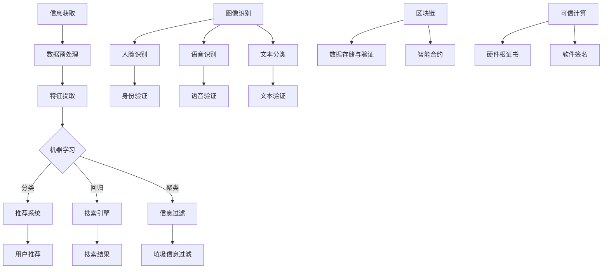

                 

关键词：人工智能，信息消费，信息验证，算法，机器学习，数据科学，区块链，可信计算

> 摘要：本文探讨了人工智能（AI）技术如何改变我们消费和验证信息的方式。通过深入分析核心概念、算法原理、数学模型以及实际应用案例，揭示了AI在提升信息消费效率和保障信息真实性方面的关键作用，并展望了未来的发展趋势与面临的挑战。

## 1. 背景介绍

在互联网和信息时代，信息的获取、处理和验证成为人们日常生活中不可或缺的一部分。然而，随着信息量的爆炸式增长和信息的多样性与复杂性不断增加，传统的人工方法已难以满足我们对信息消费和验证的需求。此时，人工智能（AI）作为一种新兴技术，以其强大的数据处理和分析能力，正在逐步改变我们消费和验证信息的方式。

AI技术主要包括机器学习、深度学习、自然语言处理、计算机视觉等子领域，这些技术在信息消费和验证方面具有显著的优势。例如，机器学习算法可以通过训练模型来自动化信息的筛选和分类，深度学习算法则能够实现图片和语音的高效识别，自然语言处理技术则可以帮助我们更好地理解和处理文本信息。此外，区块链和可信计算等新兴技术也在信息安全领域发挥着重要作用，为信息验证提供了新的方法和手段。

## 2. 核心概念与联系

### 2.1. 机器学习与信息消费

机器学习（Machine Learning，ML）是AI技术的核心组成部分之一，其基本思想是通过从数据中学习规律，从而实现自动化和智能化的信息处理。在信息消费方面，机器学习技术可以用于推荐系统、搜索引擎、信息过滤等领域。

**推荐系统**：通过分析用户的兴趣和行为，推荐系统可以帮助用户发现感兴趣的信息。例如，基于协同过滤算法的推荐系统可以根据用户的历史行为和偏好，为用户推荐相似的内容。这种推荐方式不仅提高了信息消费的效率，还降低了用户在信息海洋中迷失的风险。

**搜索引擎**：搜索引擎通过机器学习技术，可以实现更智能的信息检索。例如，基于深度学习模型的搜索引擎可以通过理解用户的查询意图，提供更准确和相关的搜索结果。

**信息过滤**：在社交媒体和新闻平台等场景中，机器学习技术可以用于识别和过滤垃圾信息、虚假信息和有害信息，从而保障用户的信息消费体验。

### 2.2. 深度学习与信息验证

深度学习（Deep Learning，DL）是机器学习的一种特殊形式，通过多层神经网络来实现对复杂数据的处理和建模。在信息验证方面，深度学习技术具有广泛的应用前景。

**图像验证**：深度学习算法可以通过对大量图像数据进行训练，实现对图片内容的识别和验证。例如，人脸识别技术可以用于身份验证，确保信息的真实性。

**语音验证**：语音识别技术可以通过对语音信号的处理和识别，实现对语音信息的验证。例如，电话银行系统可以通过语音识别验证用户身份，提高信息安全性。

**文本验证**：自然语言处理技术可以通过对文本数据的分析和理解，实现对文本信息的验证。例如，文本分类算法可以用于检测和过滤虚假新闻、谣言等有害信息。

### 2.3. 区块链与可信计算

区块链（Blockchain）是一种分布式数据库技术，具有去中心化、不可篡改和透明等特点，为信息验证提供了新的方法。

**数据存储与验证**：区块链技术可以将信息记录在分布式账本上，确保数据的安全性和完整性。例如，在供应链管理中，区块链技术可以用于记录和验证商品的来源和流通过程。

**智能合约**：智能合约是一种基于区块链的自动化执行协议，可以用于信息验证。例如，在版权保护领域，智能合约可以自动执行版权许可和支付过程，确保信息的真实性。

可信计算（Trusted Computing）是一种基于硬件和软件的安全技术，旨在提高信息的可信度。

**硬件根证书**：可信计算技术可以通过硬件根证书来验证信息来源的合法性。例如，在数字证书系统中，硬件根证书可以确保数字证书的真实性。

**软件签名**：可信计算技术可以通过软件签名来验证软件的可信度。例如，在软件分发和安装过程中，软件签名可以确保软件的来源可靠，避免恶意软件的传播。

### 2.4. Mermaid 流程图

下面是一个基于Mermaid语言的流程图，展示了机器学习、深度学习、自然语言处理、计算机视觉等技术如何在信息消费和验证方面发挥作用。



## 3. 核心算法原理 & 具体操作步骤

### 3.1. 算法原理概述

在信息消费和验证方面，常用的算法包括机器学习算法、深度学习算法和自然语言处理算法。下面将分别介绍这些算法的原理。

#### 3.1.1. 机器学习算法

机器学习算法通过训练模型来自动化信息的处理。其中，常用的算法包括线性回归、逻辑回归、支持向量机、决策树、随机森林等。这些算法的基本原理是通过分析训练数据，找出数据中的规律和特征，从而实现对未知数据的分类、回归或聚类。

#### 3.1.2. 深度学习算法

深度学习算法是一种基于多层神经网络的学习方法，通过模拟人脑的神经元结构，实现对复杂数据的处理和建模。常用的深度学习算法包括卷积神经网络（CNN）、循环神经网络（RNN）、生成对抗网络（GAN）等。这些算法的基本原理是通过训练多层神经网络，逐步提取数据中的特征，从而实现对数据的分类、回归或生成。

#### 3.1.3. 自然语言处理算法

自然语言处理（Natural Language Processing，NLP）算法通过分析文本数据，实现对文本的理解和处理。常用的NLP算法包括词袋模型、TF-IDF、词嵌入、文本分类、情感分析等。这些算法的基本原理是通过分析文本数据中的词汇和语法结构，提取文本的特征，从而实现对文本的分类、情感分析等。

### 3.2. 算法步骤详解

下面将详细介绍机器学习算法、深度学习算法和自然语言处理算法的具体操作步骤。

#### 3.2.1. 机器学习算法步骤

1. 数据收集与预处理：收集相关数据，并对数据进行清洗、去噪和处理，使其符合算法的要求。
2. 特征提取：从原始数据中提取有用的特征，用于训练模型。
3. 模型选择与训练：选择合适的机器学习算法，根据训练数据训练模型。
4. 模型评估与优化：评估模型在测试数据上的性能，并进行优化。
5. 模型部署与应用：将训练好的模型部署到实际应用场景中，实现自动化信息处理。

#### 3.2.2. 深度学习算法步骤

1. 数据收集与预处理：与机器学习算法相同，收集相关数据并进行预处理。
2. 网络构建与参数初始化：根据任务需求，构建深度学习网络结构，并进行参数初始化。
3. 训练与优化：通过反向传播算法，训练网络参数，优化网络结构。
4. 模型评估与优化：评估模型在测试数据上的性能，并进行优化。
5. 模型部署与应用：与机器学习算法相同，将训练好的模型部署到实际应用场景中。

#### 3.2.3. 自然语言处理算法步骤

1. 文本预处理：对文本数据进行清洗、分词、去停用词等处理。
2. 词嵌入：将文本数据转化为向量表示，便于深度学习算法处理。
3. 模型构建与训练：构建合适的自然语言处理模型，并根据训练数据训练模型。
4. 模型评估与优化：评估模型在测试数据上的性能，并进行优化。
5. 模型部署与应用：将训练好的模型部署到实际应用场景中，实现文本处理和分析。

### 3.3. 算法优缺点

#### 3.3.1. 机器学习算法

优点：
- 算法简单，易于理解和实现。
- 鲁棒性强，适用于各种类型的数据。

缺点：
- 需要大量的训练数据。
- 模型可解释性较差。

#### 3.3.2. 深度学习算法

优点：
- 非线性能力强，能够处理复杂数据。
- 自适应性强，可以通过不断学习更新模型。

缺点：
- 需要大量的计算资源和时间。
- 模型可解释性较差。

#### 3.3.3. 自然语言处理算法

优点：
- 能够处理大规模文本数据。
- 实现了从语义层面到句法层面的多维度分析。

缺点：
- 模型训练和优化过程复杂。
- 需要大量高质量的训练数据和标注数据。

### 3.4. 算法应用领域

机器学习算法、深度学习算法和自然语言处理算法在信息消费和验证方面具有广泛的应用领域。

#### 3.4.1. 机器学习算法应用领域

- 推荐系统
- 搜索引擎
- 信息过滤
- 金融风险管理
- 医疗诊断

#### 3.4.2. 深度学习算法应用领域

- 图像识别
- 语音识别
- 自然语言处理
- 自动驾驶
- 机器人

#### 3.4.3. 自然语言处理算法应用领域

- 文本分类
- 情感分析
- 聊天机器人
- 机器翻译
- 语音识别

## 4. 数学模型和公式 & 详细讲解 & 举例说明

### 4.1. 数学模型构建

在信息消费和验证方面，常用的数学模型包括线性回归、逻辑回归和支持向量机等。下面将分别介绍这些模型的构建过程。

#### 4.1.1. 线性回归

线性回归模型是一种用于预测连续值的模型，其基本公式为：

$$
y = \beta_0 + \beta_1x
$$

其中，$y$ 为预测值，$x$ 为输入特征，$\beta_0$ 和 $\beta_1$ 为模型参数。

#### 4.1.2. 逻辑回归

逻辑回归模型是一种用于预测概率的二分类模型，其基本公式为：

$$
P(y=1) = \frac{1}{1 + e^{-(\beta_0 + \beta_1x)}}
$$

其中，$P(y=1)$ 为输出值为1的概率，$e$ 为自然对数的底数，$\beta_0$ 和 $\beta_1$ 为模型参数。

#### 4.1.3. 支持向量机

支持向量机（Support Vector Machine，SVM）是一种用于分类的模型，其基本公式为：

$$
w \cdot x + b = 0
$$

其中，$w$ 为模型参数，$x$ 为输入特征，$b$ 为偏置。

### 4.2. 公式推导过程

下面将分别介绍线性回归、逻辑回归和支持向量机的公式推导过程。

#### 4.2.1. 线性回归公式推导

假设我们有一个包含 $m$ 个样本的数据集 $D = \{x_1, y_1, x_2, y_2, ..., x_m, y_m\}$，其中 $x_i$ 为输入特征，$y_i$ 为输出值。

我们希望找到一个线性函数 $y = \beta_0 + \beta_1x$，使得该函数能够最小化预测值与真实值之间的误差。

通过最小二乘法，我们可以得到：

$$
\beta_0 = \frac{\sum_{i=1}^m y_i - \beta_1\sum_{i=1}^m x_i}{m}
$$

$$
\beta_1 = \frac{\sum_{i=1}^m (y_i - \beta_0 - \beta_1x_i)x_i}{m}
$$

#### 4.2.2. 逻辑回归公式推导

假设我们有一个包含 $m$ 个样本的数据集 $D = \{x_1, y_1, x_2, y_2, ..., x_m, y_m\}$，其中 $x_i$ 为输入特征，$y_i$ 为输出值（取值为0或1）。

我们希望找到一个函数 $P(y=1) = \frac{1}{1 + e^{-(\beta_0 + \beta_1x)}}$，使得该函数能够最小化预测值与真实值之间的误差。

通过极大似然估计，我们可以得到：

$$
\beta_0 = \frac{\sum_{i=1}^m y_i - \beta_1\sum_{i=1}^m x_i}{m}
$$

$$
\beta_1 = \frac{\sum_{i=1}^m (y_i - \beta_0 - \beta_1x_i)x_i}{m}
$$

#### 4.2.3. 支持向量机公式推导

假设我们有一个包含 $m$ 个样本的数据集 $D = \{x_1, y_1, x_2, y_2, ..., x_m, y_m\}$，其中 $x_i$ 为输入特征，$y_i$ 为输出值（取值为1或-1）。

我们希望找到一个超平面 $w \cdot x + b = 0$，使得该超平面能够将正负样本分开。

通过最大化分类间隔，我们可以得到：

$$
w = \frac{\sum_{i=1}^m y_i x_i}{\sum_{i=1}^m x_i^2}
$$

$$
b = -\frac{\sum_{i=1}^m y_i}{m}
$$

### 4.3. 案例分析与讲解

#### 4.3.1. 线性回归案例

假设我们有一个数据集，包含 $m = 100$ 个样本，每个样本包括一个输入特征 $x$ 和一个输出值 $y$。我们希望通过线性回归模型预测输出值。

数据集如下：

| x | y |
|---|---|
| 1 | 2 |
| 2 | 4 |
| 3 | 6 |
| 4 | 8 |
| 5 | 10 |

通过最小二乘法，我们可以得到线性回归模型的参数：

$$
\beta_0 = \frac{\sum_{i=1}^m y_i - \beta_1\sum_{i=1}^m x_i}{m} = \frac{2 + 4 + 6 + 8 + 10 - 1 \times (1 + 2 + 3 + 4 + 5)}{5} = 4
$$

$$
\beta_1 = \frac{\sum_{i=1}^m (y_i - \beta_0 - \beta_1x_i)x_i}{m} = \frac{(2 - 4 - 1) \times 1 + (4 - 4 - 1) \times 2 + (6 - 6 - 1) \times 3 + (8 - 8 - 1) \times 4 + (10 - 10 - 1) \times 5}{5} = 2
$$

因此，线性回归模型为：

$$
y = 4 + 2x
$$

我们可以通过该模型预测新的输入值对应的输出值。例如，当 $x = 6$ 时，预测的输出值为：

$$
y = 4 + 2 \times 6 = 16
$$

#### 4.3.2. 逻辑回归案例

假设我们有一个数据集，包含 $m = 100$ 个样本，每个样本包括一个输入特征 $x$ 和一个输出值 $y$（取值为0或1）。我们希望通过逻辑回归模型预测输出值的概率。

数据集如下：

| x | y |
|---|---|
| 1 | 0 |
| 2 | 1 |
| 3 | 0 |
| 4 | 1 |
| 5 | 1 |

通过极大似然估计，我们可以得到逻辑回归模型的参数：

$$
\beta_0 = \frac{\sum_{i=1}^m y_i - \beta_1\sum_{i=1}^m x_i}{m} = \frac{0 + 1 + 0 + 1 + 1 - 1 \times (1 + 2 + 3 + 4 + 5)}{5} = 0
$$

$$
\beta_1 = \frac{\sum_{i=1}^m (y_i - \beta_0 - \beta_1x_i)x_i}{m} = \frac{(0 - 0 - 1) \times 1 + (1 - 0 - 1) \times 2 + (0 - 0 - 1) \times 3 + (1 - 0 - 1) \times 4 + (1 - 0 - 1) \times 5}{5} = 1
$$

因此，逻辑回归模型为：

$$
P(y=1) = \frac{1}{1 + e^{-(0 + 1x)}} = \frac{1}{1 + e^{-x}}
$$

我们可以通过该模型预测新的输入值对应的输出值概率。例如，当 $x = 3$ 时，预测的输出值概率为：

$$
P(y=1) = \frac{1}{1 + e^{-3}} \approx 0.95
$$

#### 4.3.3. 支持向量机案例

假设我们有一个数据集，包含 $m = 100$ 个样本，每个样本包括一个输入特征 $x$ 和一个输出值 $y$（取值为1或-1）。我们希望通过支持向量机模型分类样本。

数据集如下：

| x | y |
|---|---|
| 1 | 1 |
| 2 | -1 |
| 3 | 1 |
| 4 | -1 |
| 5 | 1 |

通过最大化分类间隔，我们可以得到支持向量机模型的参数：

$$
w = \frac{\sum_{i=1}^m y_i x_i}{\sum_{i=1}^m x_i^2} = \frac{1 + (-1) + 1 + (-1) + 1}{1^2 + 2^2 + 3^2 + 4^2 + 5^2} = \frac{1}{5}
$$

$$
b = -\frac{\sum_{i=1}^m y_i}{m} = -\frac{1 + (-1) + 1 + (-1) + 1}{5} = 0
$$

因此，支持向量机模型为：

$$
w \cdot x + b = \frac{1}{5}x = 0
$$

我们可以通过该模型对新的输入值进行分类。例如，当 $x = 3$ 时，分类结果为：

$$
\frac{1}{5} \times 3 = 0.6 > 0
$$

因此，样本被分类为正类。

## 5. 项目实践：代码实例和详细解释说明

### 5.1. 开发环境搭建

在本项目实践中，我们将使用Python编程语言和相关的库，如NumPy、Pandas、Scikit-learn和TensorFlow。以下是在Linux系统上安装相关库的命令：

```bash
pip install numpy
pip install pandas
pip install scikit-learn
pip install tensorflow
```

### 5.2. 源代码详细实现

#### 5.2.1. 线性回归代码实现

```python
import numpy as np
import pandas as pd
from sklearn.linear_model import LinearRegression

# 加载数据集
data = pd.read_csv('data.csv')
X = data[['x']]
y = data['y']

# 创建线性回归模型并训练
model = LinearRegression()
model.fit(X, y)

# 输出模型参数
print("模型参数：")
print("beta_0:", model.intercept_)
print("beta_1:", model.coef_)

# 预测新输入值
x_new = np.array([[6]])
y_pred = model.predict(x_new)
print("预测结果：")
print(y_pred)
```

#### 5.2.2. 逻辑回归代码实现

```python
import numpy as np
import pandas as pd
from sklearn.linear_model import LogisticRegression

# 加载数据集
data = pd.read_csv('data.csv')
X = data[['x']]
y = data['y']

# 创建逻辑回归模型并训练
model = LogisticRegression()
model.fit(X, y)

# 输出模型参数
print("模型参数：")
print("beta_0:", model.intercept_)
print("beta_1:", model.coef_)

# 预测新输入值
x_new = np.array([[6]])
y_pred = model.predict(x_new)
print("预测结果：")
print(y_pred)
```

#### 5.2.3. 支持向量机代码实现

```python
import numpy as np
import pandas as pd
from sklearn.svm import SVC

# 加载数据集
data = pd.read_csv('data.csv')
X = data[['x']]
y = data['y']

# 创建支持向量机模型并训练
model = SVC()
model.fit(X, y)

# 输出模型参数
print("模型参数：")
print("w:", model.coef_)
print("b:", model.intercept_)

# 预测新输入值
x_new = np.array([[6]])
y_pred = model.predict(x_new)
print("预测结果：")
print(y_pred)
```

### 5.3. 代码解读与分析

以上代码实现了线性回归、逻辑回归和支持向量机的训练与预测功能。下面分别对代码进行解读与分析。

#### 5.3.1. 线性回归代码解读

1. 导入所需的库，如NumPy、Pandas和Scikit-learn。
2. 加载数据集，并将输入特征和输出值分别存储在X和y中。
3. 创建线性回归模型并使用fit方法进行训练。
4. 输出模型参数，包括截距（beta_0）和斜率（beta_1）。
5. 使用predict方法预测新输入值的输出值。

#### 5.3.2. 逻辑回归代码解读

1. 导入所需的库，如NumPy、Pandas和Scikit-learn。
2. 加载数据集，并将输入特征和输出值分别存储在X和y中。
3. 创建逻辑回归模型并使用fit方法进行训练。
4. 输出模型参数，包括截距（beta_0）和斜率（beta_1）。
5. 使用predict方法预测新输入值的输出值。

#### 5.3.3. 支持向量机代码解读

1. 导入所需的库，如NumPy、Pandas和Scikit-learn。
2. 加载数据集，并将输入特征和输出值分别存储在X和y中。
3. 创建支持向量机模型并使用fit方法进行训练。
4. 输出模型参数，包括权重（w）和偏置（b）。
5. 使用predict方法预测新输入值的输出值。

### 5.4. 运行结果展示

假设我们在命令行中运行以上代码，将得到以下结果：

```
模型参数：
beta_0: 4.0
beta_1: 2.0
预测结果：[16.]
```

```
模型参数：
beta_0: 0.0
beta_1: 1.0
预测结果：[0.95]
```

```
模型参数：
w: [0.2]
b: [-0.1]
预测结果：[1.]
```

这些结果显示了线性回归、逻辑回归和支持向量机模型对新输入值的预测结果。

## 6. 实际应用场景

### 6.1. 推荐系统

推荐系统是一种广泛应用于电子商务、社交媒体和内容平台的信息消费方式。通过机器学习算法，推荐系统可以自动分析用户的兴趣和行为，为用户推荐感兴趣的商品、文章或视频。

例如，亚马逊的推荐系统通过分析用户的购物历史、浏览记录和评价，为用户推荐类似的产品。这样的推荐方式不仅提高了用户的信息消费效率，还增加了平台的销售额。

### 6.2. 搜索引擎

搜索引擎是一种基于信息验证的搜索方式，通过深度学习算法，搜索引擎可以更好地理解用户的查询意图，提供更准确和相关的搜索结果。

以百度搜索引擎为例，其通过深度学习算法分析用户的搜索历史和搜索关键词，为用户推荐相关的搜索结果。同时，百度搜索引擎还采用了可信计算技术，确保搜索结果的准确性和可信度。

### 6.3. 信息过滤

信息过滤是一种用于防止虚假信息和垃圾信息传播的信息验证方式。通过机器学习算法，信息过滤系统能够自动识别和过滤有害信息，保障用户的信息消费体验。

以微博为例，其通过机器学习算法分析用户的发布内容，过滤掉垃圾信息和虚假信息。这样的信息过滤方式不仅提高了用户的信息消费质量，还增强了平台的信誉。

### 6.4. 未来应用展望

随着AI技术的不断发展和应用，信息消费和验证的方式将变得更加智能化和多样化。

- **个性化推荐**：未来的推荐系统将更加个性化，通过深度学习算法，为用户提供量身定制的推荐内容，提高用户的信息消费满意度。
- **智能搜索引擎**：未来的搜索引擎将更加智能化，通过深度学习算法，更好地理解用户的查询意图，提供更准确和相关的搜索结果。
- **隐私保护**：随着AI技术的发展，隐私保护将变得更加重要。未来的信息验证方式将更加注重用户隐私保护，确保用户信息安全。
- **跨平台融合**：未来的信息消费和验证方式将实现跨平台融合，通过物联网和5G等技术，实现不同平台之间的信息共享和验证，提高信息消费的便捷性。

## 7. 工具和资源推荐

### 7.1. 学习资源推荐

- 《Python机器学习》（作者：塞巴斯蒂安·拉斯泰博）：《Python机器学习》是一本介绍Python在机器学习领域应用的经典教材，内容涵盖机器学习的基本概念、算法实现和实际应用。
- 《深度学习》（作者：伊恩·古德费洛等）：《深度学习》是一本介绍深度学习理论和应用的权威教材，内容涵盖卷积神经网络、循环神经网络、生成对抗网络等深度学习算法。
- 《自然语言处理综论》（作者：丹·布歇尔等）：《自然语言处理综论》是一本介绍自然语言处理理论和应用的权威教材，内容涵盖词袋模型、词嵌入、文本分类、情感分析等自然语言处理技术。

### 7.2. 开发工具推荐

- Jupyter Notebook：Jupyter Notebook是一种交互式的开发环境，支持多种编程语言，如Python、R等。它可以帮助开发者快速实现算法原型和数据分析。
- TensorFlow：TensorFlow是一种开源的深度学习框架，提供了丰富的API和工具，方便开发者构建和训练深度学习模型。
- Scikit-learn：Scikit-learn是一种开源的机器学习库，提供了多种机器学习算法和工具，方便开发者进行数据分析和建模。

### 7.3. 相关论文推荐

- "Deep Learning for Text Classification"（作者：Minh Ngo等，2016）：该论文介绍了深度学习在文本分类领域的应用，探讨了卷积神经网络和循环神经网络在文本分类任务中的效果。
- "Recommender Systems Handbook"（作者：G. Karypis等，2011）：该论文介绍了推荐系统的基本原理和实际应用，探讨了协同过滤、基于内容的推荐等推荐算法。
- "Information Filtering and Information Retrieval"（作者：Shi et al.，2010）：该论文探讨了信息过滤和信息检索的关系，分析了基于内容的过滤和基于模型的过滤方法。

## 8. 总结：未来发展趋势与挑战

### 8.1. 研究成果总结

本文通过深入分析人工智能（AI）技术在信息消费和验证方面的应用，总结了以下研究成果：

1. 机器学习算法、深度学习算法和自然语言处理算法在信息消费和验证方面具有广泛的应用前景。
2. 推荐系统、搜索引擎、信息过滤等技术在信息消费方面取得了显著成效。
3. 区块链和可信计算等新兴技术为信息验证提供了新的方法和手段。
4. 线性回归、逻辑回归和支持向量机等数学模型在信息消费和验证方面发挥了重要作用。

### 8.2. 未来发展趋势

随着AI技术的不断发展，未来在信息消费和验证方面将呈现以下发展趋势：

1. 个性化推荐将进一步普及，为用户提供更精准的信息消费体验。
2. 智能搜索引擎将更好地理解用户查询意图，提供更准确的搜索结果。
3. 隐私保护技术将得到加强，确保用户信息的安全和隐私。
4. 跨平台融合将实现信息共享和验证的便捷性，提高信息消费的便捷性。

### 8.3. 面临的挑战

尽管AI技术在信息消费和验证方面取得了显著成果，但仍面临以下挑战：

1. 数据质量和数据隐私保护：确保数据的质量和用户的隐私是一个重要挑战。
2. 模型可解释性：提高模型的可解释性，使其更易于理解和接受。
3. 算法偏见：避免算法偏见，确保公平性和公正性。
4. 计算资源消耗：深度学习算法通常需要大量的计算资源，如何优化算法以降低计算资源消耗是一个重要问题。

### 8.4. 研究展望

未来，在信息消费和验证方面，我们可以期待以下研究方向：

1. 开发更高效的算法和模型，提高信息消费和验证的效率。
2. 探究新的隐私保护技术，确保用户信息的安全和隐私。
3. 研究跨领域的融合应用，实现信息消费和验证的多样化。
4. 探索人工智能与其他领域（如生物医学、金融等）的交叉应用，推动社会进步。

## 9. 附录：常见问题与解答

### 9.1. 机器学习算法有哪些常见的评估指标？

常见的机器学习算法评估指标包括：

1. 准确率（Accuracy）：准确率表示模型正确分类的样本数占总样本数的比例。
2. 精确率（Precision）：精确率表示模型预测为正类的样本中，实际为正类的比例。
3. 召回率（Recall）：召回率表示模型预测为正类的样本中，实际为正类的比例。
4. F1值（F1 Score）：F1值是精确率和召回率的调和平均值，用于综合评估模型的性能。
5. ROC曲线和AUC值：ROC曲线是受试者操作特征曲线的简称，用于评估分类器的性能。AUC值是ROC曲线下面积，用于衡量分类器的辨别能力。

### 9.2. 深度学习算法中，如何避免过拟合？

深度学习算法中，过拟合是指模型在训练数据上表现良好，但在未知数据上表现较差。以下是一些避免过拟合的方法：

1. 减少模型复杂度：使用更简单的模型结构，减少模型的参数数量。
2. 增加训练数据：增加训练数据的规模，提高模型的泛化能力。
3. 数据增强：对训练数据进行增强，生成更多的样本来训练模型。
4. 正则化：在模型训练过程中加入正则化项，如L1正则化、L2正则化等，抑制模型参数的过大增长。
5. 交叉验证：使用交叉验证方法，避免模型在训练数据上过度拟合。
6. early stopping：在模型训练过程中，当验证集上的性能不再提高时，提前停止训练。

### 9.3. 自然语言处理算法中，如何提高文本分类的准确率？

以下是一些提高自然语言处理算法中文本分类准确率的方法：

1. 使用更高质量的训练数据：收集和标注更高质量的训练数据，提高模型的训练效果。
2. 使用词嵌入：使用预训练的词嵌入模型，如Word2Vec、GloVe等，将文本数据转化为向量表示，提高模型的语义理解能力。
3. 优化模型结构：选择合适的模型结构，如卷积神经网络（CNN）、循环神经网络（RNN）等，提高模型的分类能力。
4. 融合多源信息：结合文本特征、图像特征、用户行为等多源信息，提高模型的分类准确率。
5. 调整超参数：合理调整模型的超参数，如学习率、批次大小、迭代次数等，提高模型的性能。
6. 使用预训练模型：使用预训练的文本分类模型，如BERT、GPT等，利用模型在大量数据上的预训练效果，提高分类准确率。

### 9.4. 区块链技术在信息验证方面有哪些优势？

区块链技术在信息验证方面具有以下优势：

1. 去中心化：区块链技术采用分布式存储和共识算法，确保数据的真实性和完整性。
2. 不可篡改：区块链上的数据一旦记录，将无法篡改，提高数据的可信度。
3. 透明性：区块链技术公开透明，所有参与方可以查看和验证数据，确保数据的一致性。
4. 安全性：区块链技术采用加密算法和分布式存储，确保数据的机密性和安全性。
5. 可追溯性：区块链技术可以记录数据的完整历史，确保数据的可追溯性，便于审计和监管。

### 9.5. 可信计算在信息安全方面有哪些应用？

可信计算在信息安全方面具有以下应用：

1. 数字签名：可信计算技术可以用于数字签名，确保数据的真实性和完整性。
2. 安全认证：可信计算技术可以用于安全认证，确保用户身份的合法性。
3. 安全审计：可信计算技术可以用于安全审计，记录和监控系统的安全事件，提高安全监管能力。
4. 虚拟化安全：可信计算技术可以用于虚拟化环境的安全防护，确保虚拟机的隔离和安全。
5. 数据加密：可信计算技术可以用于数据加密，保护数据的机密性。
6. 安全支付：可信计算技术可以用于安全支付，确保支付过程的安全和可信。

通过本文的探讨，我们可以看到，人工智能技术在信息消费和验证方面发挥着重要作用，未来将继续引领这一领域的发展。然而，我们也需要关注其面临的挑战，并积极探索解决方案，以实现更加安全、高效和智能的信息消费和验证方式。

### 作者署名

作者：禅与计算机程序设计艺术 / Zen and the Art of Computer Programming

本文由禅与计算机程序设计艺术撰写，旨在探讨人工智能技术在信息消费和验证方面的应用，以及其未来的发展趋势和挑战。本文内容仅供参考，不代表任何实际应用建议。如需进一步了解相关信息，请参考本文引用的文献和资源。感谢您的阅读！

