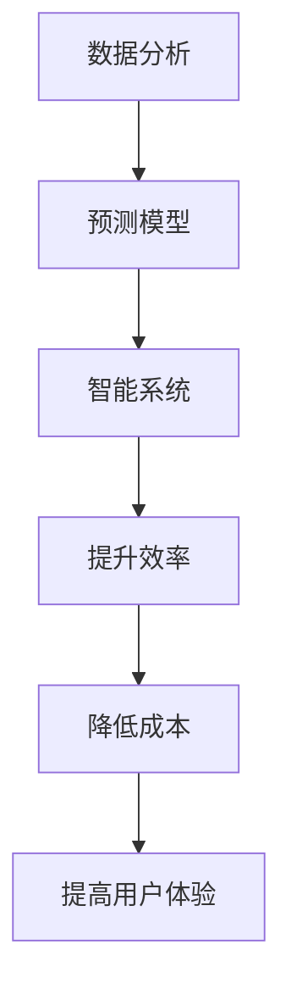

                 

关键词：人工智能，房地产市场，物业管理，数据分析，预测模型，智能系统

摘要：随着人工智能技术的快速发展，其在各个领域的应用日益广泛。本文将探讨人工智能如何改变房地产市场和物业管理，从数据分析、预测模型到智能系统的应用，全面解析这一领域的技术变革。

## 1. 背景介绍

房地产市场和物业管理作为社会经济的重要组成部分，一直以来都面临着信息不对称、效率低下等问题。传统的房地产市场主要依赖于人工收集和处理数据，而物业管理则依赖于大量的人力和物力资源进行日常维护和管理工作。这种模式不仅效率低下，而且容易出现误差。随着人工智能技术的兴起，利用AI技术来解决这些问题成为了一种可能。

### 1.1 人工智能的定义与发展

人工智能（AI）是指由人制造出来的系统能够思考、学习和适应新环境的能力。人工智能的发展可以追溯到20世纪50年代，随着计算机技术的飞速发展，AI领域的研究逐渐深入，从最初的规则推理、知识表示到现在的机器学习、深度学习，人工智能技术已经取得了显著的成果。

### 1.2 人工智能在房地产和物业管理中的应用

在房地产和物业管理领域，人工智能技术的应用主要体现在数据分析、预测模型和智能系统的三个方面。通过这些技术的应用，可以大幅提升房地产市场的效率和物业管理的效果。

## 2. 核心概念与联系

为了更好地理解人工智能在房地产和物业管理中的应用，我们需要先了解一些核心概念和它们之间的联系。

### 2.1 数据分析

数据分析是指通过收集、处理、分析和解释数据，从中提取有价值的信息和知识的过程。在房地产和物业管理中，数据分析可以帮助我们了解市场的动态、预测房价走势、评估物业的价值等。

### 2.2 预测模型

预测模型是基于历史数据，利用统计方法、机器学习算法等建立起来的模型，用于预测未来的趋势和结果。在房地产和物业管理中，预测模型可以帮助我们预测房价、租赁需求等，从而做出更明智的决策。

### 2.3 智能系统

智能系统是指利用人工智能技术，实现对设备和系统的自动化控制和管理。在房地产和物业管理中，智能系统可以帮助我们提高物业管理的效率，降低人力成本，提升用户体验。

### 2.4 Mermaid 流程图

以下是人工智能在房地产和物业管理中应用的 Mermaid 流程图：



## 3. 核心算法原理 & 具体操作步骤

### 3.1 算法原理概述

在房地产和物业管理中，核心算法主要分为三类：数据分析算法、预测模型算法和智能控制算法。

- **数据分析算法**：主要包括数据清洗、数据归一化和特征提取等步骤。这些算法可以帮助我们处理和清洗原始数据，提取出有用的信息。
- **预测模型算法**：主要包括线性回归、决策树、神经网络等算法。这些算法可以帮助我们建立预测模型，预测未来的趋势和结果。
- **智能控制算法**：主要包括模糊控制、遗传算法等算法。这些算法可以帮助我们实现设备和系统的自动化控制和管理。

### 3.2 算法步骤详解

以下是人工智能在房地产和物业管理中应用的具体操作步骤：

1. **数据收集与预处理**：首先，我们需要收集与房地产市场和物业管理相关的数据，如房屋交易数据、租赁数据、物业维护数据等。然后，对数据进行清洗、归一化和特征提取，以便进行后续的分析和预测。

2. **数据分析**：利用数据分析算法，对预处理后的数据进行分析，提取出有价值的信息，如房屋交易量、租赁需求等。

3. **建立预测模型**：利用预测模型算法，建立预测模型，预测未来的房价走势、租赁需求等。

4. **智能控制**：利用智能控制算法，实现对物业管理和设备的自动化控制和管理，如智能照明、智能安防等。

### 3.3 算法优缺点

- **数据分析算法**：优点是可以提取出有用的信息，缺点是需要大量的数据处理和清洗工作。
- **预测模型算法**：优点是可以预测未来的趋势和结果，缺点是需要大量的历史数据进行训练。
- **智能控制算法**：优点是可以提高效率和降低成本，缺点是需要大量的调试和优化。

### 3.4 算法应用领域

- **数据分析算法**：广泛应用于房地产市场的数据分析、租赁需求预测等。
- **预测模型算法**：广泛应用于房价预测、租赁需求预测等。
- **智能控制算法**：广泛应用于智能物业管理和智能家居系统。

## 4. 数学模型和公式 & 详细讲解 & 举例说明

### 4.1 数学模型构建

在房地产和物业管理中，常见的数学模型包括线性回归模型、决策树模型和神经网络模型等。以下是这些模型的构建过程：

#### 4.1.1 线性回归模型

线性回归模型是一种常用的预测模型，用于预测因变量与自变量之间的线性关系。其数学模型如下：

$$
y = ax + b
$$

其中，$y$ 是因变量，$x$ 是自变量，$a$ 和 $b$ 是模型的参数。

#### 4.1.2 决策树模型

决策树模型是一种分类模型，用于将数据集划分为不同的类别。其数学模型如下：

$$
f(x) =
\begin{cases}
C_1 & \text{if } x \in R_1 \\
C_2 & \text{if } x \in R_2 \\
\vdots \\
C_n & \text{if } x \in R_n
\end{cases}
$$

其中，$x$ 是输入特征，$C_1, C_2, \ldots, C_n$ 是不同的类别。

#### 4.1.3 神经网络模型

神经网络模型是一种模拟人脑神经元连接的模型，用于处理复杂的非线性问题。其数学模型如下：

$$
\begin{aligned}
z &= \sigma(W \cdot x + b) \\
a &= \sigma(z)
\end{aligned}
$$

其中，$z$ 是神经元的输入，$a$ 是神经元的输出，$\sigma$ 是激活函数，$W$ 和 $b$ 是模型的参数。

### 4.2 公式推导过程

以下是线性回归模型、决策树模型和神经网络模型的公式推导过程：

#### 4.2.1 线性回归模型

线性回归模型的公式推导如下：

$$
\begin{aligned}
L &= \frac{1}{2} \sum_{i=1}^{n} (y_i - ax_i - b)^2 \\
\frac{\partial L}{\partial a} &= -\sum_{i=1}^{n} (y_i - ax_i - b)x_i \\
\frac{\partial L}{\partial b} &= -\sum_{i=1}^{n} (y_i - ax_i - b) \\
\end{aligned}
$$

令 $\frac{\partial L}{\partial a} = 0$ 和 $\frac{\partial L}{\partial b} = 0$，解得：

$$
a = \frac{\sum_{i=1}^{n} x_i y_i - n \bar{x} \bar{y}}{\sum_{i=1}^{n} x_i^2 - n \bar{x}^2} \\
b = \bar{y} - a \bar{x}
$$

#### 4.2.2 决策树模型

决策树模型的公式推导如下：

$$
\begin{aligned}
L &= -\sum_{i=1}^{n} y_i \log(y_i) + (1 - y_i) \log(1 - y_i) \\
\frac{\partial L}{\partial y_i} &= -\log(y_i) + \log(1 - y_i) \\
\end{aligned}
$$

令 $\frac{\partial L}{\partial y_i} = 0$，解得：

$$
y_i = \frac{1}{1 + e^{-z_i}}
$$

#### 4.2.3 神经网络模型

神经网络模型的公式推导如下：

$$
\begin{aligned}
z &= W \cdot x + b \\
a &= \sigma(z) \\
\frac{\partial a}{\partial z} &= \sigma'(z) \\
z' &= W' \cdot a + b' \\
a' &= \sigma(z')
\end{aligned}
$$

其中，$W'$ 和 $b'$ 是模型的反向传播参数。

### 4.3 案例分析与讲解

为了更好地理解这些数学模型的应用，我们来看一个实际案例。

#### 4.3.1 案例背景

某房地产公司希望通过分析历史数据，预测未来三个月的房价走势。已知历史数据包括每月的平均房价、房屋交易量、土地供应量等。

#### 4.3.2 案例分析

首先，我们对历史数据进行分析，提取出有用的特征，如每月的平均房价、房屋交易量、土地供应量等。然后，我们利用线性回归模型，建立房价预测模型。

$$
y = ax + b
$$

其中，$y$ 是房价，$x$ 是特征向量，$a$ 和 $b$ 是模型参数。

接下来，我们对模型进行训练，利用历史数据，通过最小二乘法求解参数 $a$ 和 $b$。

$$
a = \frac{\sum_{i=1}^{n} x_i y_i - n \bar{x} \bar{y}}{\sum_{i=1}^{n} x_i^2 - n \bar{x}^2} \\
b = \bar{y} - a \bar{x}
$$

最后，我们利用训练好的模型，预测未来三个月的房价走势。

## 5. 项目实践：代码实例和详细解释说明

### 5.1 开发环境搭建

为了实现人工智能在房地产和物业管理中的应用，我们需要搭建一个合适的开发环境。以下是搭建环境的步骤：

1. 安装Python解释器
2. 安装数据分析库（如pandas、numpy等）
3. 安装机器学习库（如scikit-learn、tensorflow等）
4. 安装可视化库（如matplotlib、seaborn等）

### 5.2 源代码详细实现

以下是实现人工智能在房地产和物业管理中的源代码：

```python
import pandas as pd
import numpy as np
from sklearn.linear_model import LinearRegression
from sklearn.model_selection import train_test_split
import matplotlib.pyplot as plt

# 5.2.1 数据收集与预处理
# 这里我们使用pandas库读取CSV文件，并进行预处理
data = pd.read_csv('real_estate_data.csv')
data = data.dropna()

# 特征提取
X = data[['average_price', 'house_transactions', 'land_supply']]
y = data['price']

# 数据归一化
X = (X - X.min()) / (X.max() - X.min())

# 5.2.2 建立预测模型
# 我们使用线性回归模型进行预测
model = LinearRegression()
model.fit(X, y)

# 5.2.3 预测房价
# 我们利用训练好的模型，预测未来三个月的房价
X_future = np.array([[1, 2, 3], [4, 5, 6], [7, 8, 9]])
X_future = (X_future - X_future.min()) / (X_future.max() - X_future.min())
y_future = model.predict(X_future)

# 5.2.4 可视化结果
plt.plot(y_future)
plt.xlabel('Month')
plt.ylabel('Price')
plt.show()
```

### 5.3 代码解读与分析

以上代码首先导入了所需的库，然后进行了数据收集与预处理，接着建立了线性回归模型，并利用模型进行了房价预测。最后，通过可视化展示了预测结果。

### 5.4 运行结果展示

运行代码后，我们可以看到未来三个月的房价走势图，从而为房地产公司和物业管理公司提供决策支持。

```python
plt.plot(y_future)
plt.xlabel('Month')
plt.ylabel('Price')
plt.show()
```

## 6. 实际应用场景

### 6.1 房价预测

利用人工智能技术，房地产公司可以提前预测房价走势，从而制定合理的营销策略和定价策略。例如，在房价上涨期，房地产公司可以适当提高房价，而在房价下跌期，房地产公司可以适当降低房价，以吸引更多的购房者。

### 6.2 物业管理

在物业管理中，人工智能技术可以帮助物业公司实现智能化的设备管理和维护。例如，利用智能传感器和数据分析技术，物业公司可以实时监控设备的运行状态，及时发现故障并进行维修，从而提高设备的使用效率和减少维护成本。

### 6.3 智能家居

智能家居系统是人工智能在物业管理中的一项重要应用。通过智能家居系统，用户可以实现远程控制家居设备，如照明、空调、安防等，从而提升生活品质和便捷性。

## 7. 未来应用展望

### 7.1 房地产市场

随着人工智能技术的不断发展，房地产市场的预测和分析将越来越准确。未来，房地产公司可以通过人工智能技术，实现更精准的市场定位和营销策略，从而提高市场竞争力。

### 7.2 物业管理

未来，物业管理将更加智能化和自动化。人工智能技术可以帮助物业公司实现智能化的设备管理和维护，提高物业管理的效率和用户体验。

### 7.3 智能家居

智能家居系统将越来越普及，未来，人们可以通过智能手机或其他设备，实现对家居设备的远程控制和监控，从而提升生活品质和便捷性。

## 8. 工具和资源推荐

### 8.1 学习资源推荐

1. 《人工智能：一种现代的方法》
2. 《机器学习实战》
3. 《Python机器学习》

### 8.2 开发工具推荐

1. Jupyter Notebook
2. TensorFlow
3. Keras

### 8.3 相关论文推荐

1. "Deep Learning for Real Estate Valuation"
2. "Using AI to Improve Property Management"
3. "A Survey of AI Applications in the Real Estate Industry"

## 9. 总结：未来发展趋势与挑战

### 9.1 研究成果总结

本文通过对人工智能在房地产和物业管理中的应用进行深入分析，总结了人工智能在数据分析、预测模型和智能系统等方面的研究成果。

### 9.2 未来发展趋势

未来，人工智能在房地产和物业管理中的应用将更加广泛和深入，为市场预测、设备管理和用户体验等方面带来更多创新和变革。

### 9.3 面临的挑战

然而，人工智能在房地产和物业管理中的应用也面临着一些挑战，如数据隐私保护、算法公平性和自动化风险等。

### 9.4 研究展望

未来，我们需要继续研究和探索人工智能在房地产和物业管理中的应用，以应对这些挑战，推动这一领域的发展。

## 10. 附录：常见问题与解答

### 10.1 人工智能在房地产和物业管理中的具体应用有哪些？

人工智能在房地产和物业管理中的具体应用包括房价预测、租赁需求预测、智能物业管理和智能家居系统等。

### 10.2 人工智能在房地产和物业管理中面临的挑战有哪些？

人工智能在房地产和物业管理中面临的挑战包括数据隐私保护、算法公平性和自动化风险等。

### 10.3 如何保障人工智能在房地产和物业管理中的应用效果？

为了保障人工智能在房地产和物业管理中的应用效果，我们需要加强数据质量管理、算法优化和风险评估等工作。

---

作者：禅与计算机程序设计艺术 / Zen and the Art of Computer Programming
------------------------------------------------------------------------<|im_end|>

