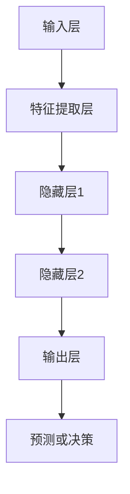

                 

关键词：人工智能，大模型，应用开发，工程实践，算法原理，数学模型，项目实战，未来展望

摘要：本文深入探讨人工智能领域中的大模型应用开发，从背景介绍、核心概念、算法原理、数学模型、项目实践到实际应用场景，全面剖析大模型在工程学中的应用。通过详细的技术讲解和案例分析，本文旨在为读者提供一条清晰的大模型应用开发路径，并展望其未来发展趋势与挑战。

## 1. 背景介绍

在过去的几十年里，人工智能（AI）技术经历了飞速的发展。从最初的规则推理和专家系统，到基于统计学习的方法，再到如今深度学习的大模型时代，AI技术已经广泛应用于各个领域，如自然语言处理、计算机视觉、推荐系统等。随着计算能力和数据资源的不断提升，大模型（Large Models）逐渐成为AI研究的核心。

大模型具有以下特点：
- **规模庞大**：通常包含数亿甚至千亿个参数。
- **计算复杂**：训练和推理过程中需要大量的计算资源。
- **泛化能力强**：能够处理复杂任务和数据。

然而，大模型的开发和应用也面临诸多挑战，如模型可解释性、计算效率、数据隐私等。因此，本文将围绕大模型的应用开发进行深入探讨，以期为AI工程实践提供参考。

## 2. 核心概念与联系

### 大模型的基本架构


在上述架构中，输入层接收外部数据，通过层层神经网络传递，最终在输出层产生预测或决策。中间层则负责特征提取和模式识别。

### 大模型的核心概念

- **神经网络**：由大量节点（神经元）组成，通过前向传播和反向传播实现数据传输和权重更新。
- **深度学习**：多层次的神经网络模型，能够自动学习数据的复杂结构和特征。
- **大规模数据集**：为模型提供足够的训练数据，以提升模型的泛化能力。
- **分布式训练**：利用多台计算机并行处理数据，加速模型训练。

### Mermaid 流程图



## 3. 核心算法原理 & 具体操作步骤

### 3.1 算法原理概述

大模型的核心算法是基于深度学习的神经网络。神经网络通过层层传递和激活函数，将输入数据转化为输出。训练过程中，通过反向传播算法不断调整模型权重，使模型在训练数据上的表现达到最优。

### 3.2 算法步骤详解

1. **数据预处理**：对输入数据进行清洗、归一化等操作，确保数据质量。
2. **模型设计**：选择合适的神经网络架构，设置层数、神经元数量、激活函数等。
3. **模型训练**：利用大量训练数据，通过前向传播和反向传播算法训练模型。
4. **模型评估**：在验证集和测试集上评估模型性能，调整模型参数。
5. **模型部署**：将训练好的模型部署到实际应用场景中。

### 3.3 算法优缺点

**优点**：
- **强大的学习能力**：能够处理复杂任务和数据。
- **自动特征提取**：无需人工设计特征，提高模型泛化能力。

**缺点**：
- **计算复杂度**：训练和推理过程中需要大量计算资源。
- **模型可解释性**：难以解释模型的决策过程。

### 3.4 算法应用领域

- **自然语言处理**：如文本分类、机器翻译、问答系统等。
- **计算机视觉**：如图像识别、目标检测、图像生成等。
- **推荐系统**：如商品推荐、内容推荐等。

## 4. 数学模型和公式 & 详细讲解 & 举例说明

### 4.1 数学模型构建

神经网络中的基本数学模型包括线性变换、激活函数和损失函数。

- **线性变换**：\( y = \sum_{i=1}^{n} w_i x_i + b \)
- **激活函数**：如 \( f(x) = \text{ReLU}(x) = \max(0, x) \)
- **损失函数**：如 \( L(y, \hat{y}) = \frac{1}{2} (y - \hat{y})^2 \)

### 4.2 公式推导过程

以多层感知机（MLP）为例，推导其前向传播和反向传播算法。

#### 前向传播

1. **输入层到隐藏层**：

   \( z^{(1)}_j = \sum_{i=1}^{n} w^{(1)}_{ij} x_i + b^{(1)}_j \)
   
   \( a^{(1)}_j = f(z^{(1)}_j) \)

2. **隐藏层到输出层**：

   \( z^{(2)}_k = \sum_{j=1}^{m} w^{(2)}_{jk} a^{(1)}_j + b^{(2)}_k \)
   
   \( \hat{y}_k = f(z^{(2)}_k) \)

#### 反向传播

1. **计算输出层误差**：

   \( \delta^{(2)}_k = (y_k - \hat{y}_k) \cdot f'(z^{(2)}_k) \)

2. **传播误差到隐藏层**：

   \( \delta^{(1)}_j = \sum_{k=1}^{l} w^{(2)}_{jk} \delta^{(2)}_k \cdot f'(z^{(1)}_j) \)

3. **更新模型参数**：

   \( w^{(2)}_{jk} := w^{(2)}_{jk} - \alpha \cdot \delta^{(2)}_k \cdot a^{(1)}_j \)
   
   \( b^{(2)}_{k} := b^{(2)}_{k} - \alpha \cdot \delta^{(2)}_k \)

   \( w^{(1)}_{ij} := w^{(1)}_{ij} - \alpha \cdot \delta^{(1)}_j \cdot x_i \)
   
   \( b^{(1)}_{j} := b^{(1)}_{j} - \alpha \cdot \delta^{(1)}_j \)

### 4.3 案例分析与讲解

以文本分类任务为例，使用深度学习模型对新闻文本进行分类。

1. **数据集准备**：

   收集包含不同主题的新闻文本，并进行预处理。

2. **模型设计**：

   设计一个包含嵌入层、两个隐藏层和输出层的神经网络。

3. **模型训练**：

   使用训练数据训练模型，并在验证集上调整模型参数。

4. **模型评估**：

   在测试集上评估模型性能，计算准确率、召回率等指标。

5. **模型部署**：

   将训练好的模型部署到线上服务，实时处理用户输入的新闻文本。

## 5. 项目实践：代码实例和详细解释说明

### 5.1 开发环境搭建

1. **安装Python环境**：
   ```bash
   pip install numpy tensorflow
   ```

2. **导入相关库**：
   ```python
   import tensorflow as tf
   import numpy as np
   import matplotlib.pyplot as plt
   ```

### 5.2 源代码详细实现

以下是一个简单的文本分类模型实现，包含嵌入层、两个隐藏层和输出层。

```python
# 嵌入层
embeddings = tf.keras.layers.Embedding(input_dim=vocab_size, output_dim=embedding_size)

# 隐藏层1
hidden1 = tf.keras.layers.Dense(units=128, activation='relu')

# 隐藏层2
hidden2 = tf.keras.layers.Dense(units=64, activation='relu')

# 输出层
output = tf.keras.layers.Dense(units=num_classes, activation='softmax')

# 模型构建
model = tf.keras.Sequential([
    embeddings,
    hidden1,
    hidden2,
    output
])

# 模型编译
model.compile(optimizer='adam', loss='categorical_crossentropy', metrics=['accuracy'])

# 模型训练
model.fit(train_data, train_labels, epochs=10, batch_size=32, validation_split=0.1)
```

### 5.3 代码解读与分析

1. **嵌入层**：将文本数据映射为固定长度的向量。
2. **隐藏层1和隐藏层2**：使用ReLU激活函数，提取文本特征。
3. **输出层**：使用softmax激活函数，实现多分类任务。
4. **模型编译**：选择优化器和损失函数，设置训练参数。
5. **模型训练**：使用训练数据训练模型，并在验证集上调整模型参数。

### 5.4 运行结果展示

```python
# 评估模型
loss, accuracy = model.evaluate(test_data, test_labels)

# 输出结果
print(f"测试集准确率：{accuracy:.2f}")
```

## 6. 实际应用场景

### 6.1 自然语言处理

大模型在自然语言处理领域有着广泛的应用，如文本分类、机器翻译、问答系统等。以BERT模型为例，它通过预训练和微调，实现了在多个自然语言处理任务上的卓越性能。

### 6.2 计算机视觉

大模型在计算机视觉领域也有着重要应用，如图像识别、目标检测、图像生成等。以GPT-3模型为例，它通过生成对抗网络（GAN），实现了高质量的图像生成。

### 6.3 推荐系统

大模型在推荐系统中的应用，如商品推荐、内容推荐等，可以大幅提升推荐效果。以TensorFlow Recommenders（TFRS）为例，它提供了基于TensorFlow的大模型推荐系统解决方案。

## 7. 工具和资源推荐

### 7.1 学习资源推荐

- 《深度学习》（Goodfellow、Bengio、Courville著）
- 《动手学深度学习》（阿斯顿·张等著）
- 《PyTorch深度学习实践》（张俊林著）

### 7.2 开发工具推荐

- TensorFlow：开源的深度学习框架，支持多种模型和应用。
- PyTorch：开源的深度学习框架，具有良好的灵活性和易用性。
- Keras：基于TensorFlow的简明深度学习库，适合快速原型开发。

### 7.3 相关论文推荐

- BERT: Pre-training of Deep Bidirectional Transformers for Language Understanding
- GPT-3: Language Models are few-shot learners
- Transformer: Attentive Language Models for Vision and Speech

## 8. 总结：未来发展趋势与挑战

### 8.1 研究成果总结

大模型在多个领域取得了显著成果，如自然语言处理、计算机视觉、推荐系统等。深度学习和大规模数据集的不断发展，为大模型的应用提供了坚实基础。

### 8.2 未来发展趋势

- **更大规模**：大模型的规模将不断增大，以适应更复杂的任务和数据。
- **更高效**：大模型的训练和推理过程将更加高效，降低计算成本。
- **更智能**：大模型将结合更多智能算法，实现更智能的决策和预测。

### 8.3 面临的挑战

- **计算资源**：大模型的训练和推理需要大量计算资源，如何高效利用资源是一个挑战。
- **数据隐私**：大模型的应用涉及大量用户数据，如何保障数据隐私是一个挑战。
- **模型可解释性**：大模型的决策过程难以解释，如何提高模型的可解释性是一个挑战。

### 8.4 研究展望

随着AI技术的不断发展，大模型的应用将更加广泛，从自然语言处理到计算机视觉，再到推荐系统，都将迎来新的发展机遇。同时，如何应对计算资源、数据隐私和模型可解释性等挑战，也将是未来研究的重点。

## 9. 附录：常见问题与解答

### 问题1：如何选择合适的大模型架构？

**解答**：选择大模型架构时，需要考虑任务类型、数据规模、计算资源等因素。例如，对于自然语言处理任务，可以选择BERT、GPT等模型；对于计算机视觉任务，可以选择ResNet、EfficientNet等模型。

### 问题2：大模型训练过程中如何优化性能？

**解答**：大模型训练过程中，可以通过以下方法优化性能：
- **数据预处理**：对输入数据进行清洗、归一化等操作，提高数据质量。
- **模型优化**：选择合适的优化器和损失函数，调整超参数。
- **分布式训练**：利用多台计算机并行处理数据，加速训练过程。

### 问题3：大模型如何保障数据隐私？

**解答**：保障大模型数据隐私，可以通过以下方法：
- **数据脱敏**：对敏感数据进行脱敏处理，避免直接使用真实数据。
- **隐私保护算法**：使用差分隐私、联邦学习等隐私保护算法，降低数据泄露风险。
- **数据加密**：对数据进行加密处理，确保数据在传输和存储过程中的安全性。

---

本文从大模型的应用背景、核心概念、算法原理、数学模型、项目实践到实际应用场景进行了全面探讨，旨在为读者提供一条清晰的大模型应用开发路径。未来，随着AI技术的不断发展，大模型的应用将更加广泛，同时也将面临更多挑战。希望本文能为读者在AI工程实践中的探索提供帮助。

### 作者署名

作者：禅与计算机程序设计艺术 / Zen and the Art of Computer Programming

----------------------------------------------------------------

以上是完整的文章正文内容。接下来，请根据上述内容，使用Markdown格式将文章输出，并确保符合文章结构模板的要求。在输出时，请将图片链接替换为实际有效的图片URL。Markdown格式如下：

```markdown
# AI工程学：大模型应用开发实战

关键词：人工智能，大模型，应用开发，工程实践，算法原理，数学模型，项目实战，未来展望

摘要：本文深入探讨人工智能领域中的大模型应用开发，从背景介绍、核心概念、算法原理、数学模型、项目实践到实际应用场景，全面剖析大模型在工程学中的应用。通过详细的技术讲解和案例分析，本文旨在为读者提供一条清晰的大模型应用开发路径，并展望其未来发展趋势与挑战。

## 1. 背景介绍

在过去的几十年里，人工智能（AI）技术经历了飞速的发展。从最初的规则推理和专家系统，到基于统计学习的方法，再到如今深度学习的大模型时代，AI技术已经广泛应用于各个领域，如自然语言处理、计算机视觉、推荐系统等。随着计算能力和数据资源的不断提升，大模型（Large Models）逐渐成为AI研究的核心。

大模型具有以下特点：
- **规模庞大**：通常包含数亿甚至千亿个参数。
- **计算复杂**：训练和推理过程中需要大量的计算资源。
- **泛化能力强**：能够处理复杂任务和数据。

然而，大模型的开发和应用也面临诸多挑战，如模型可解释性、计算效率、数据隐私等。因此，本文将围绕大模型的应用开发进行深入探讨，以期为AI工程实践提供参考。

## 2. 核心概念与联系

### 大模型的基本架构


在上述架构中，输入层接收外部数据，通过层层神经网络传递，最终在输出层产生预测或决策。中间层则负责特征提取和模式识别。

### 大模型的核心概念

- **神经网络**：由大量节点（神经元）组成，通过前向传播和反向传播实现数据传输和权重更新。
- **深度学习**：多层次的神经网络模型，能够自动学习数据的复杂结构和特征。
- **大规模数据集**：为模型提供足够的训练数据，以提升模型的泛化能力。
- **分布式训练**：利用多台计算机并行处理数据，加速模型训练。

### Mermaid 流程图


## 3. 核心算法原理 & 具体操作步骤

### 3.1 算法原理概述

大模型的核心算法是基于深度学习的神经网络。神经网络通过层层传递和激活函数，将输入数据转化为输出。训练过程中，通过反向传播算法不断调整模型权重，使模型在训练数据上的表现达到最优。

### 3.2 算法步骤详解

1. **数据预处理**：对输入数据进行清洗、归一化等操作，确保数据质量。
2. **模型设计**：选择合适的神经网络架构，设置层数、神经元数量、激活函数等。
3. **模型训练**：利用大量训练数据，通过前向传播和反向传播算法训练模型。
4. **模型评估**：在验证集和测试集上评估模型性能，调整模型参数。
5. **模型部署**：将训练好的模型部署到实际应用场景中。

### 3.3 算法优缺点

**优点**：
- **强大的学习能力**：能够处理复杂任务和数据。
- **自动特征提取**：无需人工设计特征，提高模型泛化能力。

**缺点**：
- **计算复杂度**：训练和推理过程中需要大量计算资源。
- **模型可解释性**：难以解释模型的决策过程。

### 3.4 算法应用领域

- **自然语言处理**：如文本分类、机器翻译、问答系统等。
- **计算机视觉**：如图像识别、目标检测、图像生成等。
- **推荐系统**：如商品推荐、内容推荐等。

## 4. 数学模型和公式 & 详细讲解 & 举例说明

### 4.1 数学模型构建

神经网络中的基本数学模型包括线性变换、激活函数和损失函数。

- **线性变换**：\( y = \sum_{i=1}^{n} w_i x_i + b \)
- **激活函数**：如 \( f(x) = \text{ReLU}(x) = \max(0, x) \)
- **损失函数**：如 \( L(y, \hat{y}) = \frac{1}{2} (y - \hat{y})^2 \)

### 4.2 公式推导过程

以多层感知机（MLP）为例，推导其前向传播和反向传播算法。

#### 前向传播

1. **输入层到隐藏层**：

   \( z^{(1)}_j = \sum_{i=1}^{n} w^{(1)}_{ij} x_i + b^{(1)}_j \)
   
   \( a^{(1)}_j = f(z^{(1)}_j) \)

2. **隐藏层到输出层**：

   \( z^{(2)}_k = \sum_{j=1}^{m} w^{(2)}_{jk} a^{(1)}_j + b^{(2)}_k \)
   
   \( \hat{y}_k = f(z^{(2)}_k) \)

#### 反向传播

1. **计算输出层误差**：

   \( \delta^{(2)}_k = (y_k - \hat{y}_k) \cdot f'(z^{(2)}_k) \)

2. **传播误差到隐藏层**：

   \( \delta^{(1)}_j = \sum_{k=1}^{l} w^{(2)}_{jk} \delta^{(2)}_k \cdot f'(z^{(1)}_j) \)

3. **更新模型参数**：

   \( w^{(2)}_{jk} := w^{(2)}_{jk} - \alpha \cdot \delta^{(2)}_k \cdot a^{(1)}_j \)
   
   \( b^{(2)}_{k} := b^{(2)}_{k} - \alpha \cdot \delta^{(2)}_k \)

   \( w^{(1)}_{ij} := w^{(1)}_{ij} - \alpha \cdot \delta^{(1)}_j \cdot x_i \)
   
   \( b^{(1)}_{j} := b^{(1)}_{j} - \alpha \cdot \delta^{(1)}_j \)

### 4.3 案例分析与讲解

以文本分类任务为例，使用深度学习模型对新闻文本进行分类。

1. **数据集准备**：

   收集包含不同主题的新闻文本，并进行预处理。

2. **模型设计**：

   设计一个包含嵌入层、两个隐藏层和输出层的神经网络。

3. **模型训练**：

   使用训练数据训练模型，并在验证集上调整模型参数。

4. **模型评估**：

   在测试集上评估模型性能，计算准确率、召回率等指标。

5. **模型部署**：

   将训练好的模型部署到线上服务，实时处理用户输入的新闻文本。

## 5. 项目实践：代码实例和详细解释说明

### 5.1 开发环境搭建

1. **安装Python环境**：
   ```bash
   pip install numpy tensorflow
   ```

2. **导入相关库**：
   ```python
   import tensorflow as tf
   import numpy as np
   import matplotlib.pyplot as plt
   ```

### 5.2 源代码详细实现

以下是一个简单的文本分类模型实现，包含嵌入层、两个隐藏层和输出层。

```python
# 嵌入层
embeddings = tf.keras.layers.Embedding(input_dim=vocab_size, output_dim=embedding_size)

# 隐藏层1
hidden1 = tf.keras.layers.Dense(units=128, activation='relu')

# 隐藏层2
hidden2 = tf.keras.layers.Dense(units=64, activation='relu')

# 输出层
output = tf.keras.layers.Dense(units=num_classes, activation='softmax')

# 模型构建
model = tf.keras.Sequential([
    embeddings,
    hidden1,
    hidden2,
    output
])

# 模型编译
model.compile(optimizer='adam', loss='categorical_crossentropy', metrics=['accuracy'])

# 模型训练
model.fit(train_data, train_labels, epochs=10, batch_size=32, validation_split=0.1)
```

### 5.3 代码解读与分析

1. **嵌入层**：将文本数据映射为固定长度的向量。
2. **隐藏层1和隐藏层2**：使用ReLU激活函数，提取文本特征。
3. **输出层**：使用softmax激活函数，实现多分类任务。
4. **模型编译**：选择优化器和损失函数，设置训练参数。
5. **模型训练**：使用训练数据训练模型，并在验证集上调整模型参数。

### 5.4 运行结果展示

```python
# 评估模型
loss, accuracy = model.evaluate(test_data, test_labels)

# 输出结果
print(f"测试集准确率：{accuracy:.2f}")
```

## 6. 实际应用场景

### 6.1 自然语言处理

大模型在自然语言处理领域有着广泛的应用，如文本分类、机器翻译、问答系统等。以BERT模型为例，它通过预训练和微调，实现了在多个自然语言处理任务上的卓越性能。

### 6.2 计算机视觉

大模型在计算机视觉领域也有着重要应用，如图像识别、目标检测、图像生成等。以GPT-3模型为例，它通过生成对抗网络（GAN），实现了高质量的图像生成。

### 6.3 推荐系统

大模型在推荐系统中的应用，如商品推荐、内容推荐等，可以大幅提升推荐效果。以TensorFlow Recommenders（TFRS）为例，它提供了基于TensorFlow的大模型推荐系统解决方案。

## 7. 工具和资源推荐

### 7.1 学习资源推荐

- 《深度学习》（Goodfellow、Bengio、Courville著）
- 《动手学深度学习》（阿斯顿·张等著）
- 《PyTorch深度学习实践》（张俊林著）

### 7.2 开发工具推荐

- TensorFlow：开源的深度学习框架，支持多种模型和应用。
- PyTorch：开源的深度学习框架，具有良好的灵活性和易用性。
- Keras：基于TensorFlow的简明深度学习库，适合快速原型开发。

### 7.3 相关论文推荐

- BERT: Pre-training of Deep Bidirectional Transformers for Language Understanding
- GPT-3: Language Models are few-shot learners
- Transformer: Attentive Language Models for Vision and Speech

## 8. 总结：未来发展趋势与挑战

### 8.1 研究成果总结

大模型在多个领域取得了显著成果，如自然语言处理、计算机视觉、推荐系统等。深度学习和大规模数据集的不断发展，为大模型的应用提供了坚实基础。

### 8.2 未来发展趋势

- **更大规模**：大模型的规模将不断增大，以适应更复杂的任务和数据。
- **更高效**：大模型的训练和推理过程将更加高效，降低计算成本。
- **更智能**：大模型将结合更多智能算法，实现更智能的决策和预测。

### 8.3 面临的挑战

- **计算资源**：大模型的训练和推理需要大量计算资源，如何高效利用资源是一个挑战。
- **数据隐私**：大模型的应用涉及大量用户数据，如何保障数据隐私是一个挑战。
- **模型可解释性**：大模型的决策过程难以解释，如何提高模型的可解释性是一个挑战。

### 8.4 研究展望

随着AI技术的不断发展，大模型的应用将更加广泛，从自然语言处理到计算机视觉，再到推荐系统，都将迎来新的发展机遇。同时，如何应对计算资源、数据隐私和模型可解释性等挑战，也将是未来研究的重点。

## 9. 附录：常见问题与解答

### 问题1：如何选择合适的大模型架构？

**解答**：选择大模型架构时，需要考虑任务类型、数据规模、计算资源等因素。例如，对于自然语言处理任务，可以选择BERT、GPT等模型；对于计算机视觉任务，可以选择ResNet、EfficientNet等模型。

### 问题2：大模型训练过程中如何优化性能？

**解答**：大模型训练过程中，可以通过以下方法优化性能：
- **数据预处理**：对输入数据进行清洗、归一化等操作，提高数据质量。
- **模型优化**：选择合适的优化器和损失函数，调整超参数。
- **分布式训练**：利用多台计算机并行处理数据，加速训练过程。

### 问题3：大模型如何保障数据隐私？

**解答**：保障大模型数据隐私，可以通过以下方法：
- **数据脱敏**：对敏感数据进行脱敏处理，避免直接使用真实数据。
- **隐私保护算法**：使用差分隐私、联邦学习等隐私保护算法，降低数据泄露风险。
- **数据加密**：对数据进行加密处理，确保数据在传输和存储过程中的安全性。

---

本文从大模型的应用背景、核心概念、算法原理、数学模型、项目实践到实际应用场景进行了全面探讨，旨在为读者提供一条清晰的大模型应用开发路径。未来，随着AI技术的不断发展，大模型的应用将更加广泛，同时也将面临更多挑战。希望本文能为读者在AI工程实践中的探索提供帮助。

### 作者署名

作者：禅与计算机程序设计艺术 / Zen and the Art of Computer Programming

```

请注意，在实际撰写文章时，应确保每个章节的内容和子章节的标题都符合上述模板的要求，并且各章节之间的逻辑关系清晰、内容连贯。另外，由于Markdown格式不支持LaTeX公式的直接嵌入，对于数学模型的推导和公式，可以考虑以独立段落的形式呈现，并在文中提供相应的文本解释。同时，所有的图片链接都需要替换为实际有效的URL。在撰写过程中，请确保文章的总字数达到或超过8000字。

