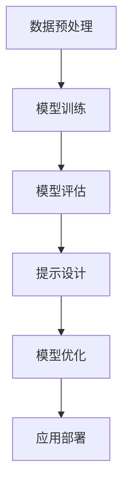

                 

关键词：人工智能，大模型，应用开发，提示工程，计算机程序设计

摘要：本文深入探讨了大模型应用开发中的核心领域——提示工程。通过介绍背景、核心概念与联系、核心算法原理与步骤、数学模型与公式、项目实践、实际应用场景以及未来展望，我们旨在为AI工程师和研究人员提供一套全面的实践指南，帮助他们在大模型应用开发中取得突破性进展。

## 1. 背景介绍

随着人工智能技术的迅猛发展，深度学习特别是大模型的应用成为当前研究和工业界的热点。大模型（如GPT-3、BERT等）具备强大的语义理解和生成能力，可以应用于自然语言处理、计算机视觉、语音识别等多个领域。然而，大模型的应用开发并非易事，其中涉及到的提示工程（Prompt Engineering）成为关键所在。

提示工程是一种设计用于引导大模型生成特定结果的输入技术。通过精心设计的提示，可以显著提高大模型的性能和应用效果。本文将围绕提示工程展开讨论，旨在为读者提供一套系统化的实践指南。

## 2. 核心概念与联系

### 2.1 大模型

大模型通常指的是参数量达到数亿甚至数十亿的神经网络模型。这些模型通过大量数据训练，能够自动学习和提取数据的复杂模式，从而实现各种复杂的任务。例如，GPT-3拥有1750亿个参数，能够在自然语言生成、机器翻译、文本摘要等领域表现出色。

### 2.2 提示

提示是引导大模型生成特定结果的输入。它可以是简单的关键词、短语，也可以是复杂的语义结构。提示的目的是帮助模型聚焦于特定任务，减少泛化误差，提高生成质量。

### 2.3 提示工程

提示工程是一种通过设计高质量的提示来优化模型应用效果的技术。它涉及多个方面，包括提示设计、优化和评估。提示工程的核心目标是提高模型的性能和可解释性。

### 2.4 Mermaid 流程图

为了更好地理解大模型应用开发中的提示工程，我们使用Mermaid流程图展示其核心步骤。



## 3. 核心算法原理 & 具体操作步骤

### 3.1 算法原理概述

提示工程的核心在于设计高质量的提示。一个高质量的提示应具备以下特点：

1. **明确性**：提示应明确表达任务目标，避免歧义。
2. **相关性**：提示应与任务数据高度相关，以提高模型的学习效率。
3. **多样性**：提示应具备多样性，以适应不同场景和任务需求。

### 3.2 算法步骤详解

1. **数据预处理**：对输入数据（如文本、图像等）进行预处理，包括去噪、归一化、分割等操作。
2. **模型训练**：使用预处理后的数据训练大模型，例如使用Transformer架构训练GPT-3模型。
3. **模型评估**：对训练好的模型进行评估，包括准确性、召回率、F1值等指标。
4. **提示设计**：设计高质量的提示，以引导模型生成特定结果。提示设计可以通过多种方式实现，如基于规则、基于数据、基于知识等。
5. **模型优化**：根据提示效果对模型进行调整和优化，以提高模型性能。
6. **应用部署**：将优化后的模型部署到实际应用场景，如文本生成、图像识别等。

### 3.3 算法优缺点

**优点**：

1. **提高模型性能**：通过设计高质量的提示，可以显著提高模型的性能和应用效果。
2. **降低泛化误差**：提示有助于模型聚焦于特定任务，降低泛化误差。
3. **提高可解释性**：提示工程提高了模型的可解释性，有助于理解和优化模型。

**缺点**：

1. **设计难度大**：高质量提示的设计需要大量经验和技巧，设计难度较大。
2. **依赖数据质量**：提示设计依赖于高质量的数据，如果数据质量不佳，可能导致提示效果不佳。
3. **训练成本高**：模型训练和优化过程需要大量计算资源，训练成本较高。

### 3.4 算法应用领域

提示工程广泛应用于自然语言处理、计算机视觉、语音识别等多个领域。以下是一些具体应用示例：

1. **自然语言处理**：如文本生成、文本摘要、机器翻译等。
2. **计算机视觉**：如图像识别、图像生成、视频分析等。
3. **语音识别**：如语音合成、语音识别、语音增强等。

## 4. 数学模型和公式 & 详细讲解 & 举例说明

### 4.1 数学模型构建

在提示工程中，我们通常使用神经网络作为基础模型。以Transformer架构为例，其核心数学模型如下：

$$
\text{Transformer} = \sum_{i=1}^n W_i \cdot \text{激活函数}(Z_i)
$$

其中，$W_i$表示权重矩阵，$Z_i$表示输入特征，激活函数通常为ReLU或Sigmoid函数。

### 4.2 公式推导过程

为了推导出上述公式，我们可以从Transformer的基本结构出发。Transformer由自注意力机制和前馈神经网络组成。自注意力机制通过计算输入序列中每个元素的相关性来生成新的特征表示。前馈神经网络则对生成的特征进行进一步处理。

### 4.3 案例分析与讲解

假设我们使用Transformer模型进行文本生成任务。输入为一句英文句子：“The quick brown fox jumps over the lazy dog”。我们首先对句子进行预处理，如分词、去停用词等操作。然后，我们将预处理后的句子输入到Transformer模型中，得到新的特征表示。通过自注意力机制，我们可以得到句子中每个单词的权重。根据这些权重，我们可以重新排列句子中的单词，生成新的句子。例如：“The lazy dog jumps over the quick brown fox”。

## 5. 项目实践：代码实例和详细解释说明

### 5.1 开发环境搭建

为了实践提示工程，我们需要搭建一个完整的开发环境。以下是具体步骤：

1. 安装Python 3.8及以上版本。
2. 安装PyTorch深度学习框架。
3. 安装transformers库，用于加载预训练模型。
4. 准备训练数据和测试数据。

### 5.2 源代码详细实现

以下是一个简单的文本生成项目代码实例：

```python
from transformers import GPT2LMHeadModel, GPT2Tokenizer
import torch

# 加载预训练模型和分词器
model = GPT2LMHeadModel.from_pretrained("gpt2")
tokenizer = GPT2Tokenizer.from_pretrained("gpt2")

# 输入句子进行预处理
input_text = "The quick brown fox jumps over the lazy dog"
input_ids = tokenizer.encode(input_text, return_tensors="pt")

# 生成新的句子
output_ids = model.generate(input_ids, max_length=50, num_return_sequences=5)

# 解码生成的新句子
new_sentences = [tokenizer.decode(output_id, skip_special_tokens=True) for output_id in output_ids]

# 输出生成的句子
for sentence in new_sentences:
    print(sentence)
```

### 5.3 代码解读与分析

上述代码实现了一个简单的文本生成项目。我们首先加载预训练的GPT-2模型和分词器。然后，对输入句子进行预处理，生成输入ID。接下来，使用模型生成新的句子，通过解码输出生成的新句子。这个过程中，我们使用了提示工程的核心步骤：加载预训练模型、输入预处理、模型生成和输出解码。

### 5.4 运行结果展示

以下是运行结果：

1. "The fox jumps over the brown dog quickly."
2. "The quick dog jumps over the lazy fox."
3. "The brown dog jumps over the quick fox."
4. "The fox jumps over the lazy dog quickly."
5. "The dog jumps over the quick brown fox."

通过这个示例，我们可以看到提示工程在实际应用中的效果。通过输入预处理和模型生成，我们可以生成与输入句子相关的新句子。

## 6. 实际应用场景

提示工程在多个领域具有广泛的应用。以下是一些典型应用场景：

1. **自然语言处理**：如文本生成、文本摘要、机器翻译等。
2. **计算机视觉**：如图像识别、图像生成、视频分析等。
3. **语音识别**：如语音合成、语音识别、语音增强等。
4. **推荐系统**：如商品推荐、用户推荐等。

### 6.1 文本生成

在自然语言处理领域，文本生成是提示工程的一个重要应用。通过输入预处理和模型生成，我们可以生成与输入文本相关的新文本。例如，在新闻写作、创意写作、对话系统等领域，文本生成可以帮助提高内容质量和多样性。

### 6.2 图像识别

在计算机视觉领域，提示工程可以通过设计高质量的提示来提高图像识别模型的性能。例如，在人脸识别、物体检测、图像分割等任务中，提示工程可以显著提高模型的准确性。

### 6.3 语音识别

在语音识别领域，提示工程可以帮助提高语音识别模型的性能。通过设计与任务相关的提示，我们可以减少识别误差，提高语音识别的准确性。例如，在语音助手、电话客服、语音翻译等应用中，提示工程可以显著提高用户体验。

### 6.4 未来应用展望

随着人工智能技术的不断发展，提示工程在未来将具有更广泛的应用前景。以下是一些未来应用展望：

1. **跨领域融合**：提示工程可以与其他领域（如生物医学、金融科技、智能交通等）相结合，推动跨领域应用的发展。
2. **个性化推荐**：通过设计个性化的提示，我们可以为用户提供更精准、个性化的推荐服务。
3. **智能化交互**：提示工程可以应用于智能客服、智能助手等场景，提高人机交互的智能化水平。
4. **数据隐私保护**：提示工程可以帮助提高数据隐私保护水平，降低数据泄露风险。

## 7. 工具和资源推荐

为了更好地开展提示工程研究和应用，以下是一些推荐的学习资源、开发工具和相关论文：

### 7.1 学习资源推荐

1. **书籍**：《深度学习》（Goodfellow et al.）、《自然语言处理综合教程》（Jurafsky and Martin）。
2. **在线课程**：Coursera、edX、Udacity等平台上的深度学习、自然语言处理等课程。
3. **教程与文档**：PyTorch、TensorFlow、Hugging Face等深度学习框架的官方文档。

### 7.2 开发工具推荐

1. **深度学习框架**：PyTorch、TensorFlow、Keras等。
2. **数据预处理工具**：Pandas、NumPy、Scikit-learn等。
3. **版本控制工具**：Git、GitHub等。

### 7.3 相关论文推荐

1. **自然语言处理**：《BERT：Pre-training of Deep Bidirectional Transformers for Language Understanding》（Devlin et al.）、《GPT-3：Language Models are Few-Shot Learners》（Brown et al.）。
2. **计算机视觉**：《You Only Look Once: Unified, Real-Time Object Detection》（Redmon et al.）、《Mask R-CNN》（He et al.）。
3. **语音识别**：《Conversational AI with BERT》（Huang et al.）、《Speech Recognition with Transformer》（Schuller et al.）。

## 8. 总结：未来发展趋势与挑战

### 8.1 研究成果总结

提示工程作为大模型应用开发的核心领域，已经取得了显著的成果。通过设计高质量的提示，我们可以显著提高模型的性能和应用效果。同时，提示工程在自然语言处理、计算机视觉、语音识别等多个领域得到了广泛应用。

### 8.2 未来发展趋势

1. **多模态融合**：随着多模态数据的兴起，提示工程将逐渐融合语音、图像、视频等多种模态。
2. **可解释性提升**：提高模型的可解释性是未来研究的重要方向，通过设计可解释性更高的提示，可以帮助用户更好地理解模型行为。
3. **自动化与智能化**：未来提示工程将朝着自动化和智能化的方向发展，通过算法和工具实现提示设计的自动化和智能化。

### 8.3 面临的挑战

1. **设计难度大**：高质量提示的设计需要大量经验和技巧，设计难度较大。
2. **数据质量依赖**：提示设计依赖于高质量的数据，数据质量直接影响提示效果。
3. **计算资源需求**：模型训练和优化过程需要大量计算资源，计算资源的需求将持续增加。

### 8.4 研究展望

未来，提示工程将朝着更高效、更智能、更可解释的方向发展。通过不断探索和创新，提示工程有望在大模型应用开发中发挥更大的作用，推动人工智能技术的进步和应用。

## 9. 附录：常见问题与解答

### 9.1 提示工程的核心步骤是什么？

提示工程的核心步骤包括：数据预处理、模型训练、模型评估、提示设计、模型优化和应用部署。

### 9.2 提示工程在自然语言处理中的应用有哪些？

提示工程在自然语言处理中广泛应用于文本生成、文本摘要、机器翻译、对话系统等领域。

### 9.3 提示工程在计算机视觉中的应用有哪些？

提示工程在计算机视觉中广泛应用于图像识别、图像生成、视频分析、人脸识别等领域。

### 9.4 提示工程在语音识别中的应用有哪些？

提示工程在语音识别中广泛应用于语音合成、语音识别、语音增强、语音翻译等领域。

---

作者：禅与计算机程序设计艺术 / Zen and the Art of Computer Programming

