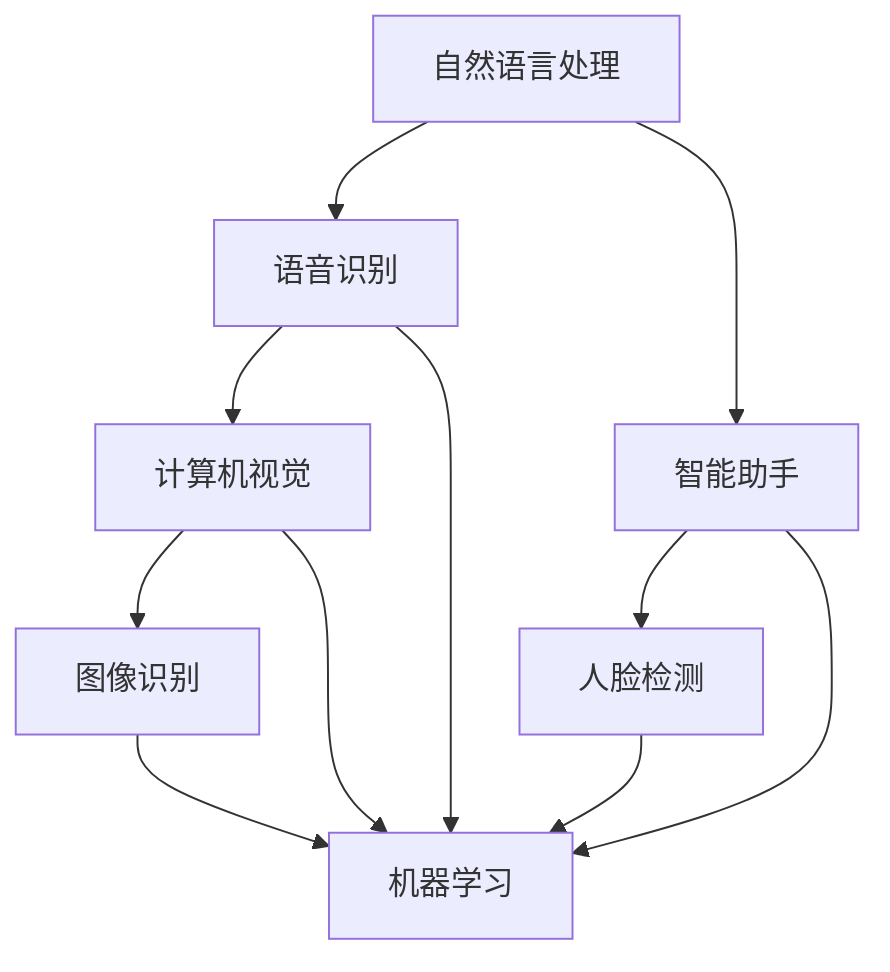

                 

关键词：AI应用生态、iPhone早期应用开发、智能移动设备、软件创新、用户体验设计

> 摘要：本文通过分析iPhone早期应用开发的历史背景、核心概念、算法原理及其实践案例，探讨了AI在智能移动设备应用生态中的发展路径，以及对未来应用场景的展望，强调了AI应用生态建设的重要性。

## 1. 背景介绍

### iPhone的诞生

iPhone的诞生是智能移动设备发展史上的一个里程碑。2007年，史蒂夫·乔布斯推出了第一代iPhone，它不仅重新定义了智能手机的设计理念，还开创了全新的应用生态系统。iPhone搭载的操作系统iOS，以其封闭性、稳定性和出色的用户体验，迅速赢得了广泛的市场认可。

### 早期应用开发

iPhone的早期应用开发主要集中在以下几个特点：

1. **封闭的生态系统**：苹果公司严格控制应用程序的开发和分发，通过App Store进行应用发布。
2. **高质量的应用**：苹果对应用程序的质量有严格的标准，这使得iPhone用户可以获得高质量的软件体验。
3. **创新的用户体验**：iPhone的早期应用开发注重用户的实际使用体验，通过直观的界面设计和优化的操作流程，提升了用户体验。

## 2. 核心概念与联系

### AI在智能移动设备中的应用

随着人工智能技术的不断进步，AI开始在智能移动设备中扮演重要角色。以下是AI在智能移动设备中的几个核心概念及其相互联系：

1. **自然语言处理（NLP）**：NLP使得智能移动设备能够理解并处理自然语言输入，如语音识别、智能助手等。
2. **计算机视觉**：计算机视觉使智能移动设备能够识别和理解视觉信息，如图像识别、人脸检测等。
3. **机器学习**：机器学习算法为智能移动设备提供了自我学习和优化的能力，从而实现更智能的应用。

### Mermaid流程图

以下是AI在智能移动设备中应用的Mermaid流程图：



## 3. 核心算法原理 & 具体操作步骤

### 3.1 算法原理概述

在智能移动设备中，AI的应用主要依赖于以下几个核心算法：

1. **神经网络**：神经网络是模拟人脑工作的算法，广泛应用于图像识别、语音识别等领域。
2. **决策树**：决策树是一种树形结构，用于分类和回归分析。
3. **支持向量机（SVM）**：SVM是一种二分类模型，广泛用于图像识别、文本分类等。

### 3.2 算法步骤详解

以下是神经网络在图像识别中的应用步骤：

1. **数据准备**：收集并清洗大量图像数据，用于训练神经网络。
2. **模型构建**：选择合适的神经网络架构，如卷积神经网络（CNN）。
3. **模型训练**：使用图像数据训练神经网络，不断调整模型参数以优化性能。
4. **模型评估**：使用测试数据评估模型性能，包括准确率、召回率等指标。
5. **模型部署**：将训练好的模型部署到智能移动设备上，实现实时图像识别功能。

### 3.3 算法优缺点

1. **优点**：神经网络具有强大的表达能力和自我学习能力，能够处理复杂的图像识别任务。
2. **缺点**：神经网络训练时间较长，对计算资源要求较高。

### 3.4 算法应用领域

神经网络在智能移动设备中的应用广泛，包括图像识别、语音识别、智能助手等。以下是一个案例：

**案例：智能助手**

智能助手利用神经网络实现自然语言处理功能，可以理解用户的语音指令并给出相应的回复。例如，用户可以通过语音指令查询天气信息、设置闹钟、发送短信等。

## 4. 数学模型和公式 & 详细讲解 & 举例说明

### 4.1 数学模型构建

在神经网络中，常用的数学模型包括激活函数、损失函数和优化算法。

1. **激活函数**：激活函数用于神经网络中的神经元，用于引入非线性特性，常用的激活函数有ReLU、Sigmoid、Tanh等。
2. **损失函数**：损失函数用于评估神经网络预测结果与真实值之间的差距，常用的损失函数有均方误差（MSE）、交叉熵损失等。
3. **优化算法**：优化算法用于调整神经网络参数以最小化损失函数，常用的优化算法有梯度下降、Adam等。

### 4.2 公式推导过程

以下是一个简单的神经网络激活函数ReLU的推导过程：

$$
f(x) =
\begin{cases}
0 & \text{if } x < 0 \\
x & \text{if } x \geq 0
\end{cases}
$$

### 4.3 案例分析与讲解

**案例：使用神经网络进行图像分类**

假设我们使用神经网络对猫和狗的图像进行分类，我们可以构建一个简单的神经网络模型，包括输入层、隐藏层和输出层。

1. **输入层**：输入层包含猫和狗的图像特征，每个特征可以用一个向量表示。
2. **隐藏层**：隐藏层包含多个神经元，每个神经元负责学习图像特征之间的关系。
3. **输出层**：输出层包含两个神经元，分别表示猫和狗的类别概率。

通过训练，我们可以使神经网络能够准确分类猫和狗的图像。

## 5. 项目实践：代码实例和详细解释说明

### 5.1 开发环境搭建

为了实现上述神经网络模型，我们需要搭建一个开发环境。以下是使用Python和TensorFlow搭建开发环境的步骤：

1. 安装Python：在官方网站下载并安装Python。
2. 安装TensorFlow：使用pip命令安装TensorFlow。

### 5.2 源代码详细实现

以下是使用TensorFlow实现的神经网络模型：

```python
import tensorflow as tf

# 构建神经网络模型
model = tf.keras.Sequential([
    tf.keras.layers.Dense(128, activation='relu', input_shape=(784,)),
    tf.keras.layers.Dense(10, activation='softmax')
])

# 编译模型
model.compile(optimizer='adam', loss='categorical_crossentropy', metrics=['accuracy'])

# 训练模型
model.fit(x_train, y_train, epochs=5, batch_size=32, validation_split=0.2)
```

### 5.3 代码解读与分析

以上代码首先导入了TensorFlow库，然后构建了一个简单的神经网络模型，包括一个输入层和一个隐藏层。输入层包含128个神经元，隐藏层包含10个神经元，用于分类猫和狗的图像。接着，编译模型并使用训练数据训练模型。最后，评估模型性能。

### 5.4 运行结果展示

运行以上代码后，我们可以看到训练过程中模型的准确率和损失函数的变化情况。在训练完成后，我们可以在测试集上评估模型的性能。

## 6. 实际应用场景

### 6.1 智能移动设备的语音助手

智能移动设备的语音助手是AI在智能移动设备中的典型应用场景。通过自然语言处理技术，语音助手可以理解用户的语音指令，并给出相应的回复。例如，用户可以通过语音指令查询天气信息、设置闹钟、发送短信等。

### 6.2 智能移动设备的图像识别

智能移动设备的图像识别技术使得用户可以在设备上快速识别图像中的物体、场景等信息。例如，用户可以在拍照时实时识别照片中的对象，并在相册中对其进行分类。

### 6.3 智能移动设备的健康监测

智能移动设备的健康监测功能可以通过AI技术实现。例如，通过分析用户的心率数据、睡眠质量等信息，智能移动设备可以提醒用户注意健康问题，并给出相应的建议。

## 7. 工具和资源推荐

### 7.1 学习资源推荐

- **《Python深度学习》**：由François Chollet所著，是一本介绍深度学习在Python中实现的经典教材。
- **TensorFlow官方文档**：TensorFlow的官方文档提供了丰富的教程和API参考，是学习TensorFlow的绝佳资源。

### 7.2 开发工具推荐

- **PyCharm**：PyCharm是一款功能强大的Python集成开发环境，支持TensorFlow等深度学习框架。
- **Jupyter Notebook**：Jupyter Notebook是一款交互式的Python开发环境，适合进行数据分析和深度学习实验。

### 7.3 相关论文推荐

- **“Deep Learning for Computer Vision”**：这篇综述文章全面介绍了深度学习在计算机视觉领域的应用。
- **“Recurrent Neural Networks for Language Modeling”**：这篇论文介绍了循环神经网络在自然语言处理中的应用。

## 8. 总结：未来发展趋势与挑战

### 8.1 研究成果总结

通过本文的分析，我们可以看到AI在智能移动设备应用生态中已经取得了显著的成果。未来，随着AI技术的不断进步，智能移动设备的应用生态将更加丰富，用户体验将得到进一步提升。

### 8.2 未来发展趋势

- **更智能的语音助手**：未来智能移动设备的语音助手将更加智能，能够处理更复杂的任务，提供更个性化的服务。
- **更高效的图像识别**：随着深度学习技术的进步，图像识别的准确率和效率将得到显著提升。
- **更全面的健康监测**：智能移动设备的健康监测功能将更加全面，能够提供更准确的健康数据和建议。

### 8.3 面临的挑战

- **数据隐私和安全**：随着AI在智能移动设备中的应用，数据隐私和安全问题日益突出，需要采取有效的措施保障用户数据的安全。
- **计算资源限制**：智能移动设备的计算资源有限，如何在不影响性能的前提下实现高效的AI应用是一个重要的挑战。

### 8.4 研究展望

未来，智能移动设备的AI应用将朝着更加智能、高效和个性化的方向发展。通过不断创新和探索，我们将迎来一个更加美好的AI应用生态。

## 9. 附录：常见问题与解答

### 9.1 什么是神经网络？

神经网络是一种通过模拟人脑工作方式的算法，用于处理复杂数据和进行预测分析。

### 9.2 如何构建神经网络模型？

构建神经网络模型需要选择合适的神经网络架构，如卷积神经网络（CNN）、循环神经网络（RNN）等，并使用数据对其进行训练。

### 9.3 如何评估神经网络模型性能？

评估神经网络模型性能通常使用准确率、召回率、F1分数等指标。通过在测试集上评估模型性能，可以了解模型的泛化能力。

## 作者署名

作者：禅与计算机程序设计艺术 / Zen and the Art of Computer Programming

----------------------------------------------------------------

<|im_sep|>

