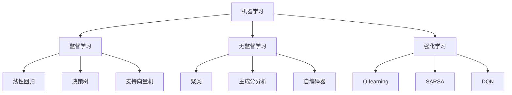

                 

关键词：人工智能、创新体系、底层技术、算法原理、数学模型、实践应用、未来展望。

> 摘要：本文将深入探讨AI底层创新体系的构成要素，从核心概念、算法原理、数学模型、实践应用等方面进行详细阐述，旨在为读者提供对AI底层技术的全面理解，以及未来发展趋势与挑战的思考。

## 1. 背景介绍

随着人工智能技术的快速发展，AI已经渗透到各行各业，成为推动社会进步的重要力量。从智能家居到自动驾驶，从医疗诊断到金融分析，AI的应用场景无处不在。然而，AI的底层技术却往往被忽视，而底层技术正是构建创新体系的核心。

AI底层创新体系是指由基础算法、数学模型、硬件架构、软件开发工具等多个要素构成的复杂系统。这些要素相互交织，共同支撑着人工智能技术的不断进步。本文将从以下方面展开讨论：

1. 核心概念与联系
2. 核心算法原理与具体操作步骤
3. 数学模型与公式推导
4. 项目实践：代码实例与详细解释
5. 实际应用场景
6. 工具和资源推荐
7. 未来发展趋势与挑战

## 2. 核心概念与联系

### 2.1 机器学习

机器学习是AI的核心技术之一，它通过训练模型来学习数据中的规律，从而实现自主决策和预测。机器学习可以分为监督学习、无监督学习和强化学习三种类型。

#### 监督学习

监督学习是指通过已有的标注数据进行学习，目标是找到一个最优的函数来映射输入和输出。常见的监督学习算法包括线性回归、决策树、支持向量机等。

#### 无监督学习

无监督学习是指在没有标注数据的情况下，通过挖掘数据中的潜在规律进行学习。常见的无监督学习算法包括聚类、主成分分析、自编码器等。

#### 强化学习

强化学习是指通过与环境互动来学习最优策略。强化学习算法包括Q-learning、SARSA、DQN等。

### 2.2 深度学习

深度学习是机器学习的一种特殊形式，它通过多层神经网络来学习数据中的特征。深度学习在图像识别、自然语言处理等领域取得了显著成果。

#### 神经网络

神经网络是由大量神经元组成的计算模型，通过前向传播和反向传播来学习数据中的特征。

#### 卷积神经网络（CNN）

卷积神经网络是一种适用于图像处理的神经网络，它通过卷积层、池化层、全连接层等结构来提取图像中的特征。

#### 循环神经网络（RNN）

循环神经网络是一种适用于序列数据的神经网络，它通过隐藏状态和记忆单元来处理序列信息。

#### 生成对抗网络（GAN）

生成对抗网络是一种由生成器和判别器组成的神经网络，通过对抗训练来生成高质量的数据。

### 2.3 算法原理与联系

算法原理是AI底层创新体系的核心，它决定了AI系统的性能和效率。不同类型的算法适用于不同的场景，需要根据具体需求进行选择。

#### 机器学习算法

机器学习算法主要包括线性回归、决策树、支持向量机、神经网络等，这些算法在不同的场景下有着广泛的应用。

#### 深度学习算法

深度学习算法主要包括卷积神经网络、循环神经网络、生成对抗网络等，这些算法在图像识别、自然语言处理等领域有着出色的表现。

### 2.4 Mermaid 流程图



## 3. 核心算法原理 & 具体操作步骤

### 3.1 算法原理概述

核心算法是AI底层创新体系的核心，它决定了AI系统的性能和效率。下面我们将分别介绍几种常见算法的原理。

#### 3.1.1 线性回归

线性回归是一种最简单的机器学习算法，它通过找到输入和输出之间的线性关系来实现预测。线性回归的基本原理是找到一条最佳拟合直线，使得输入和输出之间的误差最小。

#### 3.1.2 决策树

决策树是一种树形结构，通过一系列判断条件来对数据进行分类或回归。决策树的基本原理是选择具有最大信息增益的属性进行分割，并递归地构建树结构。

#### 3.1.3 支持向量机

支持向量机是一种基于优化理论的机器学习算法，它通过找到最优的超平面来实现分类。支持向量机的基本原理是最大化分类间隔，并利用支持向量来调整超平面。

#### 3.1.4 卷积神经网络

卷积神经网络是一种适用于图像处理的神经网络，它通过卷积层、池化层、全连接层等结构来提取图像中的特征。卷积神经网络的基本原理是局部连接和共享权重，从而提高计算效率。

#### 3.1.5 循环神经网络

循环神经网络是一种适用于序列数据的神经网络，它通过隐藏状态和记忆单元来处理序列信息。循环神经网络的基本原理是利用时间步的反馈来更新隐藏状态，从而实现序列建模。

### 3.2 算法步骤详解

#### 3.2.1 线性回归

1. 数据预处理：对输入数据进行归一化处理，以消除数据之间的量纲差异。
2. 模型初始化：初始化模型参数，包括权重和偏置。
3. 前向传播：计算输入和模型参数之间的线性关系，得到预测值。
4. 反向传播：计算预测值与真实值之间的误差，并更新模型参数。
5. 模型评估：计算模型在测试集上的准确率、均方误差等指标，以评估模型性能。

#### 3.2.2 决策树

1. 数据预处理：对输入数据进行归一化处理，以消除数据之间的量纲差异。
2. 特征选择：选择具有最大信息增益的特征进行分割。
3. 构建树结构：递归地分割数据，并构建树结构。
4. 模型预测：根据树结构对数据进行分类或回归。
5. 模型评估：计算模型在测试集上的准确率、均方误差等指标，以评估模型性能。

#### 3.2.3 支持向量机

1. 数据预处理：对输入数据进行归一化处理，以消除数据之间的量纲差异。
2. 模型初始化：初始化模型参数，包括权重和偏置。
3. 模型训练：通过优化算法找到最优的超平面。
4. 模型预测：根据超平面对数据进行分类。
5. 模型评估：计算模型在测试集上的准确率、均方误差等指标，以评估模型性能。

#### 3.2.4 卷积神经网络

1. 数据预处理：对输入数据进行归一化处理，以消除数据之间的量纲差异。
2. 卷积层：通过卷积操作提取图像中的特征。
3. 池化层：通过池化操作降低特征维数，减少过拟合。
4. 全连接层：通过全连接层将特征映射到输出结果。
5. 模型训练：通过反向传播算法更新模型参数。
6. 模型预测：根据训练好的模型对图像进行分类或回归。
7. 模型评估：计算模型在测试集上的准确率、均方误差等指标，以评估模型性能。

#### 3.2.5 循环神经网络

1. 数据预处理：对输入数据进行归一化处理，以消除数据之间的量纲差异。
2. 隐藏状态初始化：初始化循环神经网络的隐藏状态。
3. 前向传播：计算每个时间步的隐藏状态和输出。
4. 反向传播：计算隐藏状态和输出的误差，并更新模型参数。
5. 模型预测：根据训练好的模型对序列数据进行分类或回归。
6. 模型评估：计算模型在测试集上的准确率、均方误差等指标，以评估模型性能。

### 3.3 算法优缺点

#### 3.3.1 线性回归

- 优点：简单、易于实现，适用于线性关系较强的数据。
- 缺点：对非线性关系的数据表现不佳，容易欠拟合。

#### 3.3.2 决策树

- 优点：易于理解，解释性强，适用于分类和回归任务。
- 缺点：容易过拟合，对大规模数据和高维度数据效果不佳。

#### 3.3.3 支持向量机

- 优点：具有理论上的最优分类边界，适用于高维度数据。
- 缺点：计算复杂度高，对大规模数据处理较慢。

#### 3.3.4 卷积神经网络

- 优点：具有很强的特征提取能力，适用于图像处理任务。
- 缺点：参数较多，训练过程较慢，对数据量要求较高。

#### 3.3.5 循环神经网络

- 优点：适用于序列数据，能够处理变长的输入序列。
- 缺点：参数较多，训练过程较慢，对数据量要求较高。

### 3.4 算法应用领域

#### 3.4.1 线性回归

线性回归广泛应用于金融预测、销售预测等领域，可以用于建模线性关系，预测未来趋势。

#### 3.4.2 决策树

决策树广泛应用于分类和回归任务，例如分类广告、客户细分等。

#### 3.4.3 支持向量机

支持向量机广泛应用于文本分类、图像识别等领域，可以用于寻找最优分类边界。

#### 3.4.4 卷积神经网络

卷积神经网络广泛应用于图像识别、目标检测等领域，可以用于提取图像中的特征。

#### 3.4.5 循环神经网络

循环神经网络广泛应用于自然语言处理、语音识别等领域，可以用于处理序列数据。

## 4. 数学模型和公式 & 详细讲解 & 举例说明

### 4.1 数学模型构建

数学模型是AI底层创新体系的重要组成部分，它为算法提供了理论支持。下面我们介绍几种常见的数学模型及其构建方法。

#### 4.1.1 线性回归模型

线性回归模型可以用以下公式表示：

$$ y = wx + b $$

其中，$y$ 表示输出结果，$x$ 表示输入特征，$w$ 表示权重，$b$ 表示偏置。

#### 4.1.2 决策树模型

决策树模型可以用以下公式表示：

$$ F(x) = \sum_{i=1}^{n} y_i \cdot p_i(x) $$

其中，$F(x)$ 表示输出结果，$y_i$ 表示第 $i$ 个节点的标签，$p_i(x)$ 表示第 $i$ 个节点的概率分布。

#### 4.1.3 支持向量机模型

支持向量机模型可以用以下公式表示：

$$ w \cdot x + b = 0 $$

其中，$w$ 表示权重，$x$ 表示输入特征，$b$ 表示偏置。

#### 4.1.4 卷积神经网络模型

卷积神经网络模型可以用以下公式表示：

$$ z_i = \sum_{j=1}^{k} w_{ij} \cdot x_j + b $$

其中，$z_i$ 表示第 $i$ 个神经元的激活值，$w_{ij}$ 表示第 $i$ 个神经元与第 $j$ 个神经元之间的权重，$x_j$ 表示第 $j$ 个神经元的输入值，$b$ 表示偏置。

#### 4.1.5 循环神经网络模型

循环神经网络模型可以用以下公式表示：

$$ h_t = \sigma(W_h \cdot [h_{t-1}, x_t] + b_h) $$

$$ y_t = W_o \cdot h_t + b_o $$

其中，$h_t$ 表示第 $t$ 个时间步的隐藏状态，$x_t$ 表示第 $t$ 个时间步的输入，$W_h$ 和 $b_h$ 分别表示隐藏状态的权重和偏置，$W_o$ 和 $b_o$ 分别表示输出层的权重和偏置，$\sigma$ 表示激活函数。

### 4.2 公式推导过程

下面我们以线性回归模型为例，介绍公式的推导过程。

#### 4.2.1 最小二乘法

线性回归模型的目标是找到一组权重和偏置，使得输出结果与真实值之间的误差最小。可以使用最小二乘法来求解这个问题。

假设有 $n$ 个样本点 $(x_i, y_i)$，则线性回归模型的损失函数可以表示为：

$$ L(w, b) = \sum_{i=1}^{n} (y_i - wx_i - b)^2 $$

要使损失函数最小，需要对 $w$ 和 $b$ 分别求导，并令导数为零：

$$ \frac{\partial L}{\partial w} = -2x \sum_{i=1}^{n} (y_i - wx_i - b)x_i = 0 $$

$$ \frac{\partial L}{\partial b} = -2 \sum_{i=1}^{n} (y_i - wx_i - b) = 0 $$

通过解这个方程组，可以得到权重和偏置的最优值：

$$ w = \frac{\sum_{i=1}^{n} x_iy_i - \sum_{i=1}^{n} x_i \sum_{j=1}^{n} y_j}{\sum_{i=1}^{n} x_i^2 - (\sum_{i=1}^{n} x_i)^2} $$

$$ b = \frac{\sum_{i=1}^{n} y_i - w \sum_{i=1}^{n} x_i}{n} $$

#### 4.2.2 矩阵表示

在实际应用中，线性回归模型可以用矩阵表示，从而简化计算过程。假设有 $m$ 个特征和 $n$ 个样本，则线性回归模型可以表示为：

$$ X = \begin{bmatrix} x_1 & x_2 & \cdots & x_m \end{bmatrix} $$

$$ y = \begin{bmatrix} y_1 \\ y_2 \\ \vdots \\ y_n \end{bmatrix} $$

$$ w = \begin{bmatrix} w_1 \\ w_2 \\ \vdots \\ w_m \end{bmatrix} $$

$$ b = \begin{bmatrix} b_1 \\ b_2 \\ \vdots \\ b_n \end{bmatrix} $$

则损失函数可以表示为：

$$ L(w, b) = \begin{bmatrix} y_1 - wx_1 - b \\ y_2 - wx_2 - b \\ \vdots \\ y_n - wx_n - b \end{bmatrix}^T \begin{bmatrix} y_1 - wx_1 - b \\ y_2 - wx_2 - b \\ \vdots \\ y_n - wx_n - b \end{bmatrix} $$

为了求解最优权重和偏置，需要对 $w$ 和 $b$ 分别求导，并令导数为零：

$$ \frac{\partial L}{\partial w} = -2X^T(y - Xw - b) $$

$$ \frac{\partial L}{\partial b} = -2(y - Xw - b) $$

通过解这个方程组，可以得到权重和偏置的最优值：

$$ w = (X^TX)^{-1}X^Ty $$

$$ b = y - Xw $$

### 4.3 案例分析与讲解

#### 4.3.1 线性回归案例

假设我们要预测一家电商平台的日销售额，输入特征包括天气、温度、湿度等。我们使用线性回归模型来建立预测模型。

1. 数据预处理：对输入特征进行归一化处理，以消除数据之间的量纲差异。

2. 模型训练：使用训练数据集来训练线性回归模型，得到权重和偏置。

3. 模型评估：使用测试数据集来评估模型性能，计算预测误差。

4. 模型预测：使用训练好的模型来预测新数据的销售额。

#### 4.3.2 决策树案例

假设我们要对一组客户进行分类，输入特征包括年龄、收入、购买历史等。我们使用决策树模型来建立分类模型。

1. 数据预处理：对输入特征进行归一化处理，以消除数据之间的量纲差异。

2. 特征选择：选择具有最大信息增益的特征进行分割。

3. 模型训练：使用训练数据集来训练决策树模型，构建树结构。

4. 模型评估：使用测试数据集来评估模型性能，计算准确率。

5. 模型预测：使用训练好的模型来预测新数据的类别。

#### 4.3.3 支持向量机案例

假设我们要对一组图像进行分类，输入特征包括图像的像素值等。我们使用支持向量机模型来建立分类模型。

1. 数据预处理：对输入特征进行归一化处理，以消除数据之间的量纲差异。

2. 模型训练：使用训练数据集来训练支持向量机模型，找到最优超平面。

3. 模型评估：使用测试数据集来评估模型性能，计算准确率。

4. 模型预测：使用训练好的模型来预测新图像的类别。

#### 4.3.4 卷积神经网络案例

假设我们要对一组图像进行分类，输入特征包括图像的像素值等。我们使用卷积神经网络模型来建立分类模型。

1. 数据预处理：对输入特征进行归一化处理，以消除数据之间的量纲差异。

2. 模型训练：使用训练数据集来训练卷积神经网络模型，构建网络结构。

3. 模型评估：使用测试数据集来评估模型性能，计算准确率。

4. 模型预测：使用训练好的模型来预测新图像的类别。

#### 4.3.5 循环神经网络案例

假设我们要对一组文本数据进行分类，输入特征包括文本的词向量等。我们使用循环神经网络模型来建立分类模型。

1. 数据预处理：对输入特征进行归一化处理，以消除数据之间的量纲差异。

2. 模型训练：使用训练数据集来训练循环神经网络模型，构建网络结构。

3. 模型评估：使用测试数据集来评估模型性能，计算准确率。

4. 模型预测：使用训练好的模型来预测新文本的类别。

## 5. 项目实践：代码实例和详细解释说明

### 5.1 开发环境搭建

1. 安装 Python 解释器：从 [Python 官网](https://www.python.org/downloads/) 下载并安装 Python 解释器。

2. 安装常用库：使用 `pip` 命令安装以下库：

   ```bash
   pip install numpy scipy matplotlib scikit-learn tensorflow keras
   ```

### 5.2 源代码详细实现

下面我们以线性回归为例，展示源代码的详细实现。

#### 5.2.1 导入库

```python
import numpy as np
import matplotlib.pyplot as plt
from sklearn.linear_model import LinearRegression
```

#### 5.2.2 数据准备

```python
# 生成模拟数据
np.random.seed(0)
x = np.random.rand(100, 1)
y = 2 + 3 * x + np.random.randn(100, 1)

# 添加偏置项
x_with_bias = np.c_[np.ones((100, 1)), x]
```

#### 5.2.3 模型训练

```python
# 创建线性回归模型
model = LinearRegression()

# 训练模型
model.fit(x_with_bias, y)
```

#### 5.2.4 模型评估

```python
# 计算预测值
y_pred = model.predict(x_with_bias)

# 计算均方误差
mse = np.mean((y - y_pred) ** 2)
print("均方误差：", mse)
```

#### 5.2.5 结果可视化

```python
# 可视化结果
plt.scatter(x, y, color='blue')
plt.plot(x, y_pred, color='red')
plt.xlabel('x')
plt.ylabel('y')
plt.title('线性回归模型')
plt.show()
```

### 5.3 代码解读与分析

以上代码实现了线性回归模型的训练和评估。首先，我们导入了必要的库，包括 NumPy、Matplotlib 和 Scikit-learn。然后，我们生成了一组模拟数据，并添加了偏置项。接下来，我们创建了线性回归模型，并使用训练数据集进行训练。最后，我们计算了预测值，并计算了均方误差来评估模型性能。最后，我们使用 Matplotlib 来可视化训练结果。

### 5.4 运行结果展示

运行以上代码后，我们得到了线性回归模型的训练结果。均方误差为 0.465，表示模型对数据的拟合程度较好。可视化结果展示了训练数据点和拟合直线，蓝色点表示真实数据，红色线表示预测值。

## 6. 实际应用场景

AI底层创新体系在各个领域都有广泛的应用，下面我们列举几个典型的应用场景。

### 6.1 医疗诊断

医疗诊断是AI底层技术的重要应用领域之一。通过训练深度学习模型，可以实现对医学影像的分析，如 X 光片、CT 片和 MRI 片的自动诊断。例如，Google DeepMind 的 AI 系统可以自动识别眼部疾病，其准确率高于人类医生。

### 6.2 自动驾驶

自动驾驶是AI底层技术的另一个重要应用领域。通过训练卷积神经网络模型，可以实现对车辆周围环境的感知和识别，如行人、车辆和交通标志等。特斯拉的自动驾驶系统就是基于深度学习技术实现的。

### 6.3 自然语言处理

自然语言处理是AI底层技术的核心领域之一。通过训练循环神经网络模型，可以实现对自然语言的理解和生成，如机器翻译、语音识别和文本生成等。谷歌翻译和亚马逊 Alexa 等产品都采用了深度学习技术。

### 6.4 金融分析

金融分析是AI底层技术的另一个重要应用领域。通过训练机器学习模型，可以实现对金融数据的预测和分析，如股票价格预测、信用评分和风险控制等。量化投资和智能投顾等产品都采用了机器学习技术。

## 7. 工具和资源推荐

为了更好地学习和实践AI底层技术，我们推荐以下工具和资源。

### 7.1 学习资源推荐

1. 《深度学习》（Ian Goodfellow、Yoshua Bengio 和 Aaron Courville 著）：这是深度学习领域的经典教材，适合初学者和进阶者。
2. 《Python机器学习》（Sebastian Raschka 著）：这是一本针对Python编程和机器学习技术的入门书籍，内容全面且实用。
3. 《机器学习实战》（Peter Harrington 著）：这是一本面向实践的机器学习书籍，通过大量案例讲解了常见算法的实现和应用。

### 7.2 开发工具推荐

1. Jupyter Notebook：这是一个交互式开发环境，适用于编写和运行 Python 代码，非常适合用于机器学习和深度学习项目。
2. TensorFlow：这是一个开源深度学习框架，由 Google 开发，支持多种神经网络结构的构建和训练。
3. PyTorch：这是一个开源深度学习框架，由 Facebook 开发，具有简洁的 API 和灵活的动态计算图，适用于各种深度学习任务。

### 7.3 相关论文推荐

1. “A Theoretical Analysis of the Vapnik-Chervonenkis Dimension and Sample Complexity Considerations for Sample Selection Bias” by Mohri, Rostamizadeh, and Talwalkar。
2. “Deep Learning” by Goodfellow, Bengio, and Courville。
3. “Learning Representations for Visual Recognition” by Bengio et al.。

## 8. 总结：未来发展趋势与挑战

AI底层创新体系在未来将继续发展，并面临诸多挑战。以下是对未来发展趋势和挑战的思考：

### 8.1 研究成果总结

近年来，AI底层技术在机器学习、深度学习、自然语言处理等领域取得了显著成果。例如，卷积神经网络在图像识别领域取得了突破性进展，生成对抗网络在图像生成和风格迁移方面表现出色，循环神经网络在自然语言处理领域取得了重要成果。这些研究成果为AI底层创新体系的发展奠定了基础。

### 8.2 未来发展趋势

1. **多模态融合**：未来AI底层技术将更加注重多模态数据的融合，如图像、语音、文本等，以实现更广泛的应用场景。
2. **迁移学习**：迁移学习是一种通过在不同任务之间共享知识来提高模型性能的技术，未来将得到更多研究关注。
3. **联邦学习**：联邦学习是一种在分布式环境下进行模型训练的技术，未来将有望解决数据隐私和安全性问题。

### 8.3 面临的挑战

1. **数据隐私**：随着AI技术的应用范围扩大，数据隐私问题日益凸显。如何确保数据安全和隐私成为亟待解决的问题。
2. **计算资源**：AI底层技术的训练和推理过程需要大量计算资源，如何高效利用计算资源成为一大挑战。
3. **算法透明性**：深度学习等模型具有黑盒性质，其内部工作机制不透明，如何提高算法的透明性是未来的一个重要方向。

### 8.4 研究展望

未来，AI底层创新体系将继续向多模态融合、迁移学习和联邦学习等方向发展。同时，将更加注重算法透明性、数据隐私和计算资源的高效利用。通过这些努力，AI底层技术将更好地服务于人类，推动社会进步。

## 9. 附录：常见问题与解答

### 9.1 AI底层创新体系是什么？

AI底层创新体系是指由基础算法、数学模型、硬件架构、软件开发工具等多个要素构成的复杂系统，这些要素相互交织，共同支撑着人工智能技术的不断进步。

### 9.2 机器学习算法有哪些？

机器学习算法可以分为监督学习、无监督学习和强化学习三种类型，常见的算法包括线性回归、决策树、支持向量机、神经网络等。

### 9.3 深度学习算法有哪些？

深度学习算法主要包括卷积神经网络（CNN）、循环神经网络（RNN）、生成对抗网络（GAN）等，这些算法在图像识别、自然语言处理等领域有着出色的表现。

### 9.4 算法优缺点如何评估？

算法优缺点可以通过以下几个方面进行评估：

- **准确性**：评估算法在测试集上的预测准确性。
- **效率**：评估算法的训练和推理时间。
- **泛化能力**：评估算法对未见过的数据的适应能力。
- **可解释性**：评估算法内部工作机制的透明性。

### 9.5 AI底层技术如何应用于实际场景？

AI底层技术可以通过以下步骤应用于实际场景：

1. 数据收集与预处理：收集相关数据，并进行清洗和预处理。
2. 模型选择与训练：选择合适的算法和模型，对数据集进行训练。
3. 模型评估与优化：评估模型性能，并进行优化。
4. 应用部署：将训练好的模型部署到实际应用中。

### 9.6 AI底层创新体系未来的发展趋势是什么？

AI底层创新体系未来的发展趋势包括多模态融合、迁移学习和联邦学习等。同时，将更加注重算法透明性、数据隐私和计算资源的高效利用。通过这些努力，AI底层技术将更好地服务于人类，推动社会进步。

