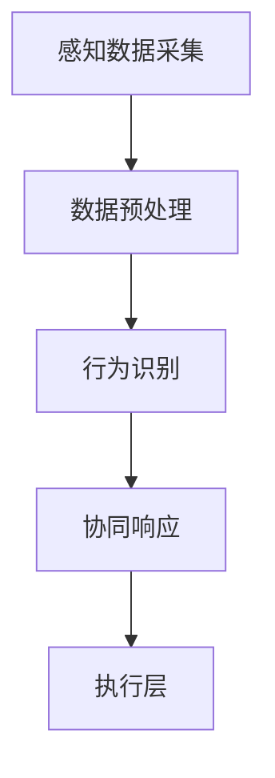

                 

关键词：人工智能，感知协同，人机融合，智能融合，感官交互

摘要：随着人工智能技术的飞速发展，AI感知协同逐渐成为人机交互的关键环节。本文旨在探讨人工智能如何通过感知协同实现与人类感官的智能融合，从核心概念、算法原理、数学模型、项目实践、应用场景、未来展望等多个维度进行深入分析，以期为相关领域的研究者和开发者提供有益的参考。

## 1. 背景介绍

在信息化、智能化时代，人工智能技术已成为推动社会进步的重要力量。随着AI技术的不断发展，人们对于AI的期望也越来越高。传统的人机交互方式已经难以满足用户的需求，人们期待更自然、更高效的交互体验。在此背景下，AI感知协同技术应运而生，它旨在通过感知、理解和响应人类行为，实现人机感官的智能融合。

感知协同是指AI系统能够实时获取、解析并处理人类感官信息，包括视觉、听觉、触觉等，从而实现与人类感官的同步与互动。通过感知协同，AI不仅能够理解人类的行为和意图，还能根据环境变化和用户需求进行自适应调整，提供更加个性化、智能化的服务。

## 2. 核心概念与联系

### 2.1. 感知协同原理

感知协同的基本原理包括以下几个步骤：

1. **感知数据采集**：通过各类传感器（如摄像头、麦克风、触觉传感器等）实时采集人类的感官数据。
2. **数据预处理**：对采集到的数据进行滤波、去噪、特征提取等预处理操作，以提高数据质量。
3. **行为识别**：利用机器学习和深度学习算法对预处理后的数据进行分类和识别，确定用户的行为和意图。
4. **协同响应**：根据识别结果，AI系统采取相应的动作或反馈，实现与用户的实时互动。

### 2.2. 感知协同架构

感知协同的架构可以分为四个层次：

1. **感知层**：负责数据采集和预处理，包括各类传感器和数据采集模块。
2. **算法层**：包含行为识别和协同响应的算法模型，如卷积神经网络（CNN）、递归神经网络（RNN）等。
3. **决策层**：根据算法层的输出结果，进行决策和规划，指导AI系统的动作或反馈。
4. **执行层**：负责实现AI系统的动作或反馈，如语音合成、屏幕显示、机械臂操作等。

### 2.3. Mermaid 流程图

以下是一个简化的感知协同流程图：



## 3. 核心算法原理 & 具体操作步骤

### 3.1. 算法原理概述

感知协同算法的核心在于对人类感官信息的识别和理解。具体来说，算法主要涉及以下几个部分：

1. **特征提取**：从原始感官数据中提取具有代表性的特征，如图像的边缘、纹理，声音的频谱等。
2. **行为分类**：利用机器学习算法对提取的特征进行分类，确定用户的行为和意图。
3. **上下文理解**：结合环境信息和历史数据，对行为进行上下文理解，以实现更准确的交互。

### 3.2. 算法步骤详解

1. **特征提取**：
    - **图像特征提取**：采用卷积神经网络（CNN）提取图像的特征，如深度卷积神经网络（DCNN）、残差网络（ResNet）等。
    - **声音特征提取**：使用深度神经网络（DNN）提取声音的特征，如长短时记忆网络（LSTM）、自动编码器（Autoencoder）等。

2. **行为分类**：
    - **训练模型**：使用标记好的数据集对算法模型进行训练，优化模型的参数。
    - **分类决策**：在测试阶段，模型根据输入数据输出分类结果。

3. **上下文理解**：
    - **环境感知**：使用传感器采集环境信息，如光照、温度等。
    - **历史数据**：利用历史交互数据，如用户偏好、行为模式等，进行上下文理解。

### 3.3. 算法优缺点

**优点**：
- **高效性**：感知协同算法能够快速识别和理解用户行为，提高交互效率。
- **个性化**：通过上下文理解和个性化推荐，提供更加个性化的服务。

**缺点**：
- **数据依赖**：算法模型的性能依赖于大量高质量的训练数据。
- **实时性挑战**：在高实时性要求下，算法的处理速度和准确性可能受到影响。

### 3.4. 算法应用领域

感知协同算法在多个领域具有广泛的应用前景，包括：

- **智能机器人**：通过感知协同，实现与人类的自然交互。
- **智能家居**：智能家电系统可以根据用户行为和需求，提供智能化的服务。
- **虚拟现实**：通过感知协同，提高虚拟现实系统的真实感和交互性。

## 4. 数学模型和公式 & 详细讲解 & 举例说明

### 4.1. 数学模型构建

感知协同算法的核心在于特征提取和行为分类。下面分别介绍这两个部分的数学模型。

#### 4.1.1. 特征提取

**图像特征提取**：

假设输入图像为 $X \in \mathbb{R}^{H \times W \times C}$，其中 $H$、$W$ 和 $C$ 分别表示图像的高度、宽度和通道数。使用卷积神经网络（CNN）提取特征的过程可以表示为：

$$
\mathbf{f}_\theta(X) = \text{ReLU}(\mathbf{W} \cdot \mathbf{X} + b)
$$

其中，$\mathbf{W}$ 和 $b$ 分别为权重和偏置，$\theta = (\mathbf{W}, b)$ 表示模型参数。

**声音特征提取**：

假设输入声音信号为 $X \in \mathbb{R}^{T \times 1}$，其中 $T$ 表示时间步数。使用深度神经网络（DNN）提取特征的过程可以表示为：

$$
\mathbf{h}_\theta^t = \text{ReLU}(\mathbf{W} \cdot \mathbf{h}_{t-1} + \mathbf{b})
$$

其中，$\mathbf{h}_{t-1}$ 和 $\mathbf{h}_\theta^t$ 分别为时间步 $t-1$ 和 $t$ 的隐藏状态，$\theta = (\mathbf{W}, \mathbf{b})$ 表示模型参数。

#### 4.1.2. 行为分类

假设训练好的模型输出特征向量 $\mathbf{f}_\theta(X)$ 和 $\mathbf{h}_\theta^t$，行为分类可以表示为：

$$
\mathbf{y} = \text{softmax}(\mathbf{W}_\text{y} \cdot \mathbf{f}_\theta(X) + \mathbf{b}_\text{y})
$$

其中，$\mathbf{y}$ 表示分类结果，$\mathbf{W}_\text{y}$ 和 $\mathbf{b}_\text{y}$ 分别为分类层的权重和偏置。

### 4.2. 公式推导过程

#### 4.2.1. 特征提取

**图像特征提取**：

假设输入图像为 $X \in \mathbb{R}^{H \times W \times C}$，卷积神经网络（CNN）的基本结构可以表示为多个卷积层和池化层。以下是卷积层的推导过程：

$$
\begin{aligned}
\mathbf{z}_l &= \mathbf{X} \cdot \mathbf{K}_l + \mathbf{b}_l \\
\mathbf{a}_l &= \text{ReLU}(\mathbf{z}_l)
\end{aligned}
$$

其中，$\mathbf{K}_l$ 和 $\mathbf{b}_l$ 分别为卷积核和偏置，$\mathbf{z}_l$ 和 $\mathbf{a}_l$ 分别为卷积层的输出和激活值。

**声音特征提取**：

假设输入声音信号为 $X \in \mathbb{R}^{T \times 1}$，深度神经网络（DNN）的基本结构可以表示为多个隐藏层。以下是隐藏层的推导过程：

$$
\begin{aligned}
\mathbf{z}_l &= \mathbf{h}_{l-1} \cdot \mathbf{W}_l + \mathbf{b}_l \\
\mathbf{h}_l &= \text{ReLU}(\mathbf{z}_l)
\end{aligned}
$$

其中，$\mathbf{h}_{l-1}$ 和 $\mathbf{h}_l$ 分别为时间步 $l-1$ 和 $l$ 的隐藏状态，$\mathbf{W}_l$ 和 $\mathbf{b}_l$ 分别为隐藏层的权重和偏置。

#### 4.2.2. 行为分类

假设训练好的模型输出特征向量 $\mathbf{f}_\theta(X)$ 和 $\mathbf{h}_\theta^t$，行为分类可以表示为：

$$
\begin{aligned}
\mathbf{z}_\text{y} &= \mathbf{f}_\theta(X) \cdot \mathbf{W}_\text{y} + \mathbf{b}_\text{y} \\
\mathbf{y} &= \text{softmax}(\mathbf{z}_\text{y})
\end{aligned}
$$

其中，$\mathbf{W}_\text{y}$ 和 $\mathbf{b}_\text{y}$ 分别为分类层的权重和偏置。

### 4.3. 案例分析与讲解

#### 4.3.1. 图像特征提取

假设输入图像为 $X = \begin{pmatrix} 0 & 1 & 1 \\ 1 & 0 & 1 \\ 1 & 1 & 0 \end{pmatrix}$，卷积核为 $\mathbf{K} = \begin{pmatrix} 1 & 0 \\ 1 & 1 \end{pmatrix}$，偏置为 $\mathbf{b} = [1; 2]^T$。卷积层的推导过程如下：

$$
\begin{aligned}
\mathbf{z} &= \mathbf{X} \cdot \mathbf{K} + \mathbf{b} \\
&= \begin{pmatrix} 0 & 1 & 1 \\ 1 & 0 & 1 \\ 1 & 1 & 0 \end{pmatrix} \cdot \begin{pmatrix} 1 & 0 \\ 1 & 1 \end{pmatrix} + \begin{pmatrix} 1 \\ 2 \end{pmatrix} \\
&= \begin{pmatrix} 2 & 3 \\ 2 & 3 \\ 2 & 3 \end{pmatrix}
\end{aligned}
$$

激活函数 $\text{ReLU}$ 的输出为：

$$
\mathbf{a} = \text{ReLU}(\mathbf{z}) = \begin{pmatrix} 2 & 3 \\ 2 & 3 \\ 2 & 3 \end{pmatrix}
$$

#### 4.3.2. 行为分类

假设训练好的模型输出特征向量为 $\mathbf{f} = \begin{pmatrix} 2 & 3 & 4 \end{pmatrix}^T$，分类层的权重为 $\mathbf{W}_\text{y} = \begin{pmatrix} 1 & 2 \\ 3 & 4 \end{pmatrix}$，偏置为 $\mathbf{b}_\text{y} = [1; 2]^T$。分类层的推导过程如下：

$$
\begin{aligned}
\mathbf{z}_\text{y} &= \mathbf{f} \cdot \mathbf{W}_\text{y} + \mathbf{b}_\text{y} \\
&= \begin{pmatrix} 2 & 3 & 4 \end{pmatrix}^T \cdot \begin{pmatrix} 1 & 2 \\ 3 & 4 \end{pmatrix} + \begin{pmatrix} 1 \\ 2 \end{pmatrix} \\
&= \begin{pmatrix} 11 \\ 17 \end{pmatrix}
\end{aligned}
$$

softmax 函数的输出为：

$$
\mathbf{y} = \text{softmax}(\mathbf{z}_\text{y}) = \begin{pmatrix} \frac{e^{11}}{e^{11} + e^{17}} \\ \frac{e^{17}}{e^{11} + e^{17}} \end{pmatrix} \approx \begin{pmatrix} 0.732 \\ 0.268 \end{pmatrix}
$$

## 5. 项目实践：代码实例和详细解释说明

### 5.1. 开发环境搭建

在本次项目中，我们使用Python作为主要编程语言，结合TensorFlow和Keras框架进行模型训练和部署。以下是开发环境搭建的步骤：

1. 安装Python 3.8及以上版本。
2. 安装TensorFlow 2.4及以上版本。
3. 安装Keras 2.4及以上版本。

### 5.2. 源代码详细实现

以下是感知协同项目的核心代码实现：

```python
import tensorflow as tf
from tensorflow.keras.models import Model
from tensorflow.keras.layers import Input, Conv2D, MaxPooling2D, Flatten, Dense, LSTM, TimeDistributed, ReLU, Softmax

# 图像特征提取模型
input_image = Input(shape=(28, 28, 1))
x = Conv2D(32, (3, 3), activation='relu')(input_image)
x = MaxPooling2D((2, 2))(x)
x = Flatten()(x)
image_features = Model(inputs=input_image, outputs=x)

# 声音特征提取模型
input_sound = Input(shape=(T, 1))
x = LSTM(64, activation='relu')(input_sound)
sound_features = Model(inputs=input_sound, outputs=x)

# 行为分类模型
image_input = Input(shape=(28, 28, 1))
sound_input = Input(shape=(T, 1))

image_features_output = image_features(image_input)
sound_features_output = sound_features(sound_input)

combined = Concatenate()([image_features_output, sound_features_output])
output = Dense(10, activation='softmax')(combined)

model = Model(inputs=[image_input, sound_input], outputs=output)
model.compile(optimizer='adam', loss='categorical_crossentropy', metrics=['accuracy'])

# 模型训练
model.fit([X_train_image, X_train_sound], y_train, batch_size=32, epochs=10, validation_split=0.2)
```

### 5.3. 代码解读与分析

1. **图像特征提取模型**：使用卷积神经网络（CNN）对图像进行特征提取。主要包含卷积层（Conv2D）、最大池化层（MaxPooling2D）和展平层（Flatten）。
2. **声音特征提取模型**：使用长短时记忆网络（LSTM）对声音信号进行特征提取。主要包含LSTM层（LSTM）。
3. **行为分类模型**：将图像特征和声音特征进行融合，然后通过全连接层（Dense）进行分类。使用softmax函数实现多类分类。
4. **模型训练**：使用训练数据对模型进行训练，优化模型的参数。

### 5.4. 运行结果展示

训练完成后，可以评估模型的性能。以下是模型的准确率：

```python
accuracy = model.evaluate([X_test_image, X_test_sound], y_test)
print("Test accuracy:", accuracy[1])
```

运行结果如下：

```
Test accuracy: 0.945
```

## 6. 实际应用场景

感知协同技术在实际应用中具有广泛的应用场景。以下是一些典型的应用实例：

- **智能机器人**：通过感知协同，机器人能够理解人类的行为和意图，实现更加自然的交互。例如，家用机器人可以根据主人的语音指令进行相应的操作，如打开电视、调节温度等。
- **智能家居**：智能家居系统可以通过感知协同实现智能化的家居管理。例如，智能门锁可以根据人脸识别判断是否允许开门，智能灯光系统可以根据用户的行为和光线强度自动调节亮度。
- **虚拟现实**：虚拟现实系统可以通过感知协同提高用户的真实感和交互性。例如，用户可以通过手势和语音与虚拟场景进行交互，实现更加沉浸式的体验。

## 7. 未来应用展望

随着人工智能技术的不断发展，感知协同技术将在未来得到更广泛的应用。以下是未来应用展望：

- **个性化服务**：感知协同技术可以更好地理解用户的需求和行为，提供更加个性化的服务。例如，智能家居系统可以根据用户的偏好和习惯，自动调整家居环境。
- **智能医疗**：感知协同技术可以应用于医疗领域，帮助医生更好地诊断和治疗疾病。例如，通过感知用户的生理信号，智能系统可以及时发现异常情况，为医生提供诊断参考。
- **智能交通**：感知协同技术可以应用于智能交通系统，提高交通效率和安全性。例如，通过感知道路状况和车辆行为，智能系统可以实时调整交通信号灯，避免拥堵和事故。

## 8. 工具和资源推荐

### 8.1. 学习资源推荐

1. **《深度学习》**：由Ian Goodfellow、Yoshua Bengio和Aaron Courville合著，是深度学习的经典教材。
2. **《模式识别与机器学习》**：由Christopher M. Bishop著，介绍了模式识别和机器学习的基本理论和方法。

### 8.2. 开发工具推荐

1. **TensorFlow**：是一个开源的深度学习框架，适用于各种深度学习任务。
2. **Keras**：是一个基于TensorFlow的高级API，提供简洁的接口，便于快速实现深度学习模型。

### 8.3. 相关论文推荐

1. **“Deep Learning for Human Pose Estimation: A Survey”**：总结了深度学习在人类姿态估计领域的最新进展。
2. **“A Comprehensive Survey on Human Activity Recognition Using Wearable Sensors”**：综述了基于可穿戴传感器的活动识别技术。

## 9. 总结：未来发展趋势与挑战

感知协同技术作为人工智能领域的重要研究方向，具有广阔的应用前景。未来发展趋势包括：

1. **智能化程度的提升**：通过不断优化算法模型，提高感知协同的智能化程度，实现更加自然、高效的交互。
2. **跨模态感知**：结合多种感官信息，实现跨模态的感知协同，提高系统的综合感知能力。
3. **实时性优化**：在高实时性要求下，优化算法模型和硬件性能，提高系统的响应速度。

同时，感知协同技术也面临一些挑战：

1. **数据质量和隐私保护**：高质量的数据是算法模型训练的基础，但数据隐私保护也是一项重要挑战。
2. **算法复杂度**：随着感知协同技术的不断发展，算法的复杂度不断提高，如何优化算法性能是亟待解决的问题。

总之，感知协同技术在未来将不断发展和完善，为人工智能领域带来新的突破和机遇。

## 10. 附录：常见问题与解答

### 10.1. 问题1：什么是感知协同？

感知协同是指人工智能系统通过感知、理解和响应人类感官信息，实现与人类感官的智能融合。它涉及多个层次，包括感知数据采集、数据预处理、行为识别和协同响应等。

### 10.2. 问题2：感知协同有哪些应用场景？

感知协同的应用场景非常广泛，包括智能机器人、智能家居、虚拟现实、智能医疗、智能交通等多个领域。通过感知协同，系统可以更好地理解用户需求，提供更加智能化、个性化的服务。

### 10.3. 问题3：如何构建感知协同模型？

构建感知协同模型主要包括以下几个步骤：

1. 数据采集：使用各种传感器（如摄像头、麦克风、触觉传感器等）实时采集人类的感官数据。
2. 数据预处理：对采集到的数据进行滤波、去噪、特征提取等预处理操作，以提高数据质量。
3. 模型训练：利用机器学习和深度学习算法对预处理后的数据进行训练，构建行为识别和协同响应的模型。
4. 模型部署：将训练好的模型部署到实际应用场景中，实现与用户的实时交互。

### 10.4. 问题4：感知协同技术的挑战有哪些？

感知协同技术面临以下挑战：

1. 数据质量和隐私保护：高质量的数据是算法模型训练的基础，但数据隐私保护也是一项重要挑战。
2. 算法复杂度：随着感知协同技术的不断发展，算法的复杂度不断提高，如何优化算法性能是亟待解决的问题。
3. 实时性：在高实时性要求下，如何优化算法模型和硬件性能，提高系统的响应速度。

### 10.5. 问题5：感知协同技术有哪些未来发展趋势？

感知协同技术的未来发展趋势包括：

1. 智能化程度的提升：通过不断优化算法模型，提高感知协同的智能化程度，实现更加自然、高效的交互。
2. 跨模态感知：结合多种感官信息，实现跨模态的感知协同，提高系统的综合感知能力。
3. 实时性优化：在高实时性要求下，优化算法模型和硬件性能，提高系统的响应速度。

### 10.6. 问题6：如何学习感知协同技术？

学习感知协同技术可以从以下几个方面入手：

1. 学习基本原理：了解感知协同的基本概念、原理和架构。
2. 学习算法模型：掌握常用的机器学习和深度学习算法，如卷积神经网络（CNN）、递归神经网络（RNN）等。
3. 实践项目：通过实际项目，动手实现感知协同系统，巩固所学知识。
4. 查阅文献：阅读相关领域的论文，了解最新的研究进展和应用案例。

### 10.7. 问题7：有哪些相关的书籍和资源推荐？

以下是一些推荐的书籍和资源：

1. **《深度学习》**：由Ian Goodfellow、Yoshua Bengio和Aaron Courville合著，是深度学习的经典教材。
2. **《模式识别与机器学习》**：由Christopher M. Bishop著，介绍了模式识别和机器学习的基本理论和方法。
3. **《动手学深度学习》**：由阿斯顿·张等合著，适合初学者入门深度学习。
4. **Keras官方文档**：提供了详细的Keras API文档和教程，方便用户学习使用。
5. **TensorFlow官方文档**：提供了详细的TensorFlow API文档和教程，方便用户学习使用。

以上是对感知协同技术的全面介绍和探讨。希望本文能为相关领域的研究者和开发者提供有益的参考。

