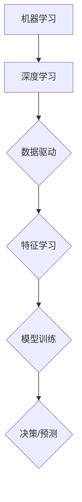
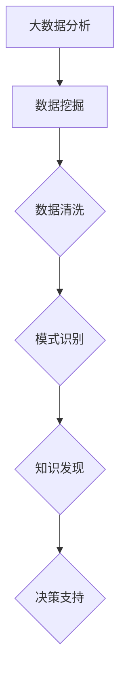

                 

关键词：人工智能，商业应用，深度学习，机器学习，大数据分析，数据挖掘

> 摘要：随着人工智能技术的迅速发展，其在商业领域的应用已经从初步探索走向深入实践。本文将探讨AI技术在商业应用中的核心概念、算法原理、数学模型、项目实践、实际应用场景以及未来的发展趋势和挑战。

## 1. 背景介绍

自20世纪50年代以来，人工智能（AI）技术经历了数次的起伏和发展。特别是在21世纪，随着计算能力的提升、大数据的爆发、深度学习的兴起，人工智能在各个领域展现出了巨大的潜力。商业领域作为一个广泛而复杂的场景，AI技术的引入不仅提高了效率，还改变了商业模式的本质。

在商业应用中，人工智能的主要功能包括但不限于：

- 客户行为分析：通过分析消费者的购买行为，帮助企业更好地了解市场需求，从而制定更有效的营销策略。
- 供应链优化：通过智能算法优化供应链管理，减少库存成本，提高物流效率。
- 风险管理：利用机器学习模型进行信用评估，预测市场风险，降低金融风险。
- 自动化决策：基于数据分析和预测，自动化决策系统可以为企业提供实时的业务指导。
- 个性化服务：利用AI技术为企业提供个性化服务，提高客户满意度和忠诚度。

## 2. 核心概念与联系

### 2.1. 深度学习与机器学习

深度学习是机器学习的一个子领域，它通过多层神经网络模拟人类大脑的决策过程。机器学习则是一种让计算机通过数据学习，从而进行决策或预测的技术。

**Mermaid 流程图（深度学习与机器学习的关系）**



### 2.2. 大数据分析与数据挖掘

大数据分析是指利用复杂的算法从大量数据中提取有价值的信息。数据挖掘则是大数据分析的一个重要分支，它侧重于发现数据中的隐含模式。

**Mermaid 流程图（大数据分析与数据挖掘的关系）**



## 3. 核心算法原理 & 具体操作步骤

### 3.1. 算法原理概述

在商业应用中，常用的AI算法包括：

- **神经网络（Neural Networks）**：通过多层神经元模型模拟生物神经网络，实现数据分类、回归等任务。
- **支持向量机（Support Vector Machines, SVM）**：利用核函数将数据映射到高维空间，找到最佳决策边界。
- **决策树（Decision Trees）**：通过一系列的判断条件对数据进行分割，最终输出分类结果。

### 3.2. 算法步骤详解

以神经网络为例，其基本步骤如下：

1. **数据预处理**：清洗数据，处理缺失值，进行归一化等。
2. **模型构建**：定义神经网络结构，包括输入层、隐藏层和输出层。
3. **模型训练**：通过反向传播算法，调整网络权重，使模型能够正确预测数据。
4. **模型评估**：使用验证集或测试集评估模型性能，调整参数以达到最佳效果。
5. **模型应用**：将训练好的模型应用到实际业务场景中。

### 3.3. 算法优缺点

- **神经网络**：能够处理复杂非线性问题，但训练过程可能较慢，且对数据质量要求高。
- **支持向量机**：在处理高维数据时性能较好，但模型解释性较差。
- **决策树**：易于理解和解释，但可能过拟合，且处理连续数据时性能不佳。

### 3.4. 算法应用领域

- **客户行为分析**：使用神经网络进行客户细分，预测潜在客户。
- **供应链管理**：使用支持向量机进行库存优化。
- **风险管理**：使用决策树进行信用评分。

## 4. 数学模型和公式

### 4.1. 数学模型构建

神经网络中的激活函数如下：

$$
f(x) = \frac{1}{1 + e^{-x}}
$$

### 4.2. 公式推导过程

以多层感知器（MLP）为例，其输出层为：

$$
\hat{y} = \sigma(\boldsymbol{W}^{'} \cdot \boldsymbol{z}^{l})
$$

其中，$\sigma$为激活函数，$\boldsymbol{W}^{'}$为输出层权重，$\boldsymbol{z}^{l}$为隐藏层输出。

### 4.3. 案例分析与讲解

以一家电商平台的客户行为分析为例，使用神经网络模型预测客户流失率。

## 5. 项目实践：代码实例和详细解释说明

### 5.1. 开发环境搭建

- 安装Python环境
- 安装TensorFlow库
- 安装Scikit-learn库

### 5.2. 源代码详细实现

```python
import tensorflow as tf
from sklearn.model_selection import train_test_split
from sklearn.preprocessing import StandardScaler

# 数据预处理
X_train, X_test, y_train, y_test = train_test_split(X, y, test_size=0.2, random_state=42)
scaler = StandardScaler()
X_train_scaled = scaler.fit_transform(X_train)
X_test_scaled = scaler.transform(X_test)

# 构建模型
model = tf.keras.Sequential([
    tf.keras.layers.Dense(64, activation='relu', input_shape=(num_features,)),
    tf.keras.layers.Dense(32, activation='relu'),
    tf.keras.layers.Dense(1, activation='sigmoid')
])

# 编译模型
model.compile(optimizer='adam', loss='binary_crossentropy', metrics=['accuracy'])

# 训练模型
model.fit(X_train_scaled, y_train, epochs=10, batch_size=32, validation_split=0.1)

# 评估模型
loss, accuracy = model.evaluate(X_test_scaled, y_test)
print(f"Test accuracy: {accuracy:.2f}")
```

### 5.3. 代码解读与分析

本例中，我们使用TensorFlow构建了一个简单的神经网络模型，用于预测客户流失率。首先，我们进行了数据预处理，然后定义了模型结构，编译并训练了模型，最后评估了模型的性能。

## 6. 实际应用场景

### 6.1. 零售业

- 客户细分：通过AI技术对客户进行细分，提供个性化推荐。
- 库存管理：使用预测模型优化库存，降低库存成本。
- 店铺选址：基于客户行为数据，预测未来销售趋势，优化店铺布局。

### 6.2. 金融业

- 信用评估：通过AI技术进行信用评分，降低金融风险。
- 风险管理：利用机器学习模型预测市场风险，制定风险管理策略。
- 账户欺诈检测：使用深度学习模型检测异常交易，预防欺诈行为。

### 6.3. 制造业

- 生产调度：使用优化算法优化生产流程，提高生产效率。
- 质量控制：利用图像识别技术进行产品质量检测。
- 售后服务：通过智能客服系统提供快速、准确的售后服务。

## 7. 工具和资源推荐

### 7.1. 学习资源推荐

- 《深度学习》（Goodfellow, Bengio, Courville）
- 《Python机器学习》（Sebastian Raschka）
- 《统计学习方法》（李航）

### 7.2. 开发工具推荐

- TensorFlow
- Keras
- Scikit-learn

### 7.3. 相关论文推荐

- "Deep Learning for Text Classification"（2018）
- "Convolutional Neural Networks for Sentence Classification"（2014）
- "Recurrent Neural Networks for Sentence Classification"（2014）

## 8. 总结：未来发展趋势与挑战

### 8.1. 研究成果总结

人工智能在商业领域的应用取得了显著成果，但同时也面临着一些挑战。

### 8.2. 未来发展趋势

- 模型压缩与加速：提高AI模型在商业应用中的运行效率。
- 多模态学习：结合文本、图像、语音等多种数据源，提高模型性能。
- 解释性AI：增强模型的可解释性，提高信任度和合规性。

### 8.3. 面临的挑战

- 数据隐私：保护用户隐私，确保数据安全。
- 伦理问题：确保AI技术的公正性、透明性和可解释性。
- 技术更新：快速跟进新技术，保持竞争优势。

### 8.4. 研究展望

随着AI技术的不断发展，未来商业应用将更加智能化、个性化。AI技术将为企业带来更多价值，同时也需要更加注重技术的伦理和社会责任。

## 9. 附录：常见问题与解答

### 9.1. 什么是深度学习？

深度学习是一种机器学习技术，通过多层神经网络模拟人类大脑的决策过程。

### 9.2. 人工智能在商业中如何应用？

人工智能在商业中的应用广泛，包括客户行为分析、供应链优化、风险管理等。

### 9.3. 如何保护用户隐私？

通过加密技术、数据匿名化等技术手段保护用户隐私。

### 9.4. 人工智能会取代人类工作吗？

人工智能可能会取代一些重复性、低技能的工作，但也会创造更多高技能、创造性的工作机会。  
----------------------------------------------------------------
作者：禅与计算机程序设计艺术 / Zen and the Art of Computer Programming

以上就是本文对AI技术在商业中的应用前景的探讨。希望这篇文章能够为读者提供有价值的参考和启示。在未来的发展中，人工智能技术将在商业领域中发挥越来越重要的作用，同时也需要我们关注其带来的伦理和社会问题。让我们共同期待人工智能技术为商业和社会带来的更多变革。

