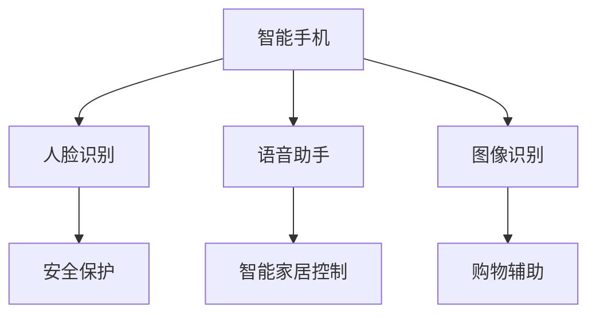

                 

 关键词：AI技术、消费电子、应用现状、深度学习、图像识别、智能家居、语音识别、虚拟现实

> 摘要：本文旨在探讨人工智能技术在消费电子领域的应用现状，分析其带来的创新和变革。文章将重点介绍AI技术在图像识别、语音识别、智能家居等消费电子产品中的应用案例，探讨其优势与挑战，并对未来发展趋势进行展望。

## 1. 背景介绍

随着人工智能技术的飞速发展，AI已经渗透到各个行业，其中消费电子领域是AI技术的重要应用场景之一。从智能手机、智能家居到虚拟现实设备，AI技术正在改变人们的消费方式和生活体验。

消费电子是指供个人使用的电子产品，如智能手机、平板电脑、智能手表、耳机、智能家居设备、虚拟现实头盔等。这些设备在过去几年中不断迭代更新，而AI技术的引入使其功能更加智能化、个性化。

AI技术主要包括机器学习、深度学习、自然语言处理、计算机视觉等，这些技术能够通过数据分析和模式识别，实现设备与用户之间的智能互动。例如，AI可以通过语音识别技术理解用户的指令，通过图像识别技术识别人脸和物品。

## 2. 核心概念与联系

### 2.1 机器学习与深度学习

机器学习是一种使计算机系统能够从数据中学习并做出决策的技术。而深度学习是机器学习的一种特殊形式，它使用多层神经网络对数据进行训练，从而实现更复杂的任务。


### 2.2 自然语言处理与计算机视觉

自然语言处理（NLP）是使计算机能够理解、生成和处理自然语言的技术。计算机视觉则是一种使计算机能够像人类一样“看”和“理解”视觉信息的技术。


### 2.3 AI架构与应用场景

以下是一个简单的Mermaid流程图，展示了AI技术在消费电子产品中的应用场景：



## 3. 核心算法原理 & 具体操作步骤

### 3.1 算法原理概述

AI技术在消费电子产品中的应用主要依赖于以下算法：

- **深度学习**：通过多层神经网络进行数据训练，实现图像识别、语音识别等功能。
- **卷积神经网络（CNN）**：一种用于图像识别和分类的深度学习模型。
- **递归神经网络（RNN）**：一种用于序列数据处理的神经网络，常用于语音识别。

### 3.2 算法步骤详解

以深度学习算法为例，其基本步骤如下：

1. 数据预处理：对原始数据进行清洗、归一化等处理。
2. 构建神经网络：设计神经网络结构，包括输入层、隐藏层和输出层。
3. 训练模型：使用训练数据对神经网络进行训练，调整模型参数。
4. 测试模型：使用测试数据评估模型性能。
5. 应用模型：将训练好的模型部署到消费电子产品中，实现相应功能。

### 3.3 算法优缺点

- **深度学习**：优点包括强大的数据分析和模式识别能力，缺点是对数据量和计算资源要求较高。
- **卷积神经网络**：优点包括对图像处理的高效性和准确性，缺点是模型复杂度较高。
- **递归神经网络**：优点包括对序列数据处理的灵活性，缺点是计算复杂度较高。

### 3.4 算法应用领域

AI技术在消费电子产品中的主要应用领域包括：

- **图像识别**：如人脸识别、物品识别等。
- **语音识别**：如语音助手、语音搜索等。
- **自然语言处理**：如智能客服、机器翻译等。
- **智能家居控制**：如语音控制家电、智能安防等。

## 4. 数学模型和公式 & 详细讲解 & 举例说明

### 4.1 数学模型构建

以卷积神经网络（CNN）为例，其基本结构包括卷积层、池化层和全连接层。

$$
卷积层：C(x) = \sigma(\text{卷积}(x; W))
$$

$$
池化层：P(x) = \text{最大值池化}(x)
$$

$$
全连接层：F(x) = \text{激活函数}(\text{矩阵乘法}(x; W))
$$

### 4.2 公式推导过程

以CNN为例，其损失函数通常采用交叉熵损失函数：

$$
L(y, \hat{y}) = -\sum_{i=1}^{N} y_i \log(\hat{y}_i)
$$

其中，$y$表示真实标签，$\hat{y}$表示预测结果。

### 4.3 案例分析与讲解

以下是一个简单的CNN模型应用于图像分类的案例：

1. **数据预处理**：对图像进行归一化和裁剪，使其尺寸一致。
2. **构建模型**：定义卷积层、池化层和全连接层。
3. **训练模型**：使用训练数据对模型进行训练。
4. **测试模型**：使用测试数据评估模型性能。

## 5. 项目实践：代码实例和详细解释说明

### 5.1 开发环境搭建

在Python中，可以使用TensorFlow框架进行深度学习模型的开发。

```python
pip install tensorflow
```

### 5.2 源代码详细实现

以下是一个简单的CNN模型用于图像分类的代码实现：

```python
import tensorflow as tf
from tensorflow.keras import datasets, layers, models

# 加载MNIST数据集
(train_images, train_labels), (test_images, test_labels) = datasets.mnist.load_data()

# 数据预处理
train_images = train_images.reshape((60000, 28, 28, 1)).astype('float32') / 255
test_images = test_images.reshape((10000, 28, 28, 1)).astype('float32') / 255

# 构建模型
model = models.Sequential()
model.add(layers.Conv2D(32, (3, 3), activation='relu', input_shape=(28, 28, 1)))
model.add(layers.MaxPooling2D((2, 2)))
model.add(layers.Conv2D(64, (3, 3), activation='relu'))
model.add(layers.MaxPooling2D((2, 2)))
model.add(layers.Conv2D(64, (3, 3), activation='relu'))

# 添加全连接层
model.add(layers.Flatten())
model.add(layers.Dense(64, activation='relu'))
model.add(layers.Dense(10, activation='softmax'))

# 编译模型
model.compile(optimizer='adam',
              loss='sparse_categorical_crossentropy',
              metrics=['accuracy'])

# 训练模型
model.fit(train_images, train_labels, epochs=5, batch_size=64)

# 测试模型
test_loss, test_acc = model.evaluate(test_images, test_labels, verbose=2)
print('\nTest accuracy:', test_acc)
```

### 5.3 代码解读与分析

1. **数据预处理**：加载MNIST数据集，并对图像进行归一化和重塑。
2. **构建模型**：定义卷积层、池化层和全连接层，构建CNN模型。
3. **编译模型**：设置优化器和损失函数，准备训练模型。
4. **训练模型**：使用训练数据对模型进行训练。
5. **测试模型**：使用测试数据评估模型性能。

## 6. 实际应用场景

### 6.1 智能手机

智能手机是AI技术在消费电子产品中应用最为广泛的场景之一。以下是一些智能手机中AI技术的应用案例：

- **人脸识别**：通过深度学习算法实现人脸解锁，提高手机安全性。
- **语音助手**：如苹果的Siri、华为的HarmonyOS，通过自然语言处理技术理解用户指令，提供便捷的智能服务。
- **图像识别**：通过卷积神经网络实现图像搜索、拍照识物等功能。

### 6.2 智能家居

智能家居设备如智能门锁、智能摄像头、智能灯泡等，通过AI技术实现了更加智能化的家居体验。以下是一些智能家居中的应用案例：

- **智能门锁**：通过指纹识别、人脸识别等AI技术，实现无钥匙开锁。
- **智能摄像头**：通过图像识别技术，实现人脸识别、行为监测等功能。
- **智能灯泡**：通过语音识别技术，实现语音控制灯光开关和亮度调节。

### 6.3 虚拟现实

虚拟现实（VR）设备如VR头盔、VR眼镜等，通过AI技术实现了更加沉浸式的体验。以下是一些VR设备中的应用案例：

- **手势识别**：通过计算机视觉技术，实现手势控制，提高VR交互的便捷性。
- **语音控制**：通过自然语言处理技术，实现语音指令控制VR场景。
- **图像识别**：通过图像识别技术，实现虚拟现实中的物品识别和交互。

## 7. 工具和资源推荐

### 7.1 学习资源推荐

- **《深度学习》（Goodfellow et al., 2016）**：这是一本深度学习的经典教材，适合初学者和专业人士。
- **吴恩达的深度学习课程**：这是一门在线课程，涵盖了深度学习的理论基础和实战应用。

### 7.2 开发工具推荐

- **TensorFlow**：这是一个开源的深度学习框架，适用于各种深度学习项目。
- **PyTorch**：这是一个开源的深度学习框架，具有较高的灵活性和易用性。

### 7.3 相关论文推荐

- **《Deep Learning for Image Recognition》（Russakovsky et al., 2015）**：这是一篇关于深度学习在图像识别中的应用的综述论文。
- **《Speech Recognition with Deep Neural Networks》（Hinton et al., 2012）**：这是一篇关于深度学习在语音识别中的应用的论文。

## 8. 总结：未来发展趋势与挑战

### 8.1 研究成果总结

AI技术在消费电子领域取得了显著的成果，如人脸识别、语音助手、图像识别等应用。这些应用不仅提高了消费电子产品的智能化程度，还改善了用户体验。

### 8.2 未来发展趋势

- **更强大的算法**：随着深度学习等算法的不断发展，消费电子产品中的AI技术将变得更加智能化和高效化。
- **跨领域应用**：AI技术将在更多消费电子产品中实现跨领域应用，如健康监测、智能驾驶等。
- **更丰富的数据**：随着物联网和大数据的发展，消费电子产品将获取更多数据，为AI技术提供更好的训练素材。

### 8.3 面临的挑战

- **数据隐私**：随着AI技术在消费电子产品中的广泛应用，数据隐私问题日益突出。
- **算法公平性**：AI算法在图像识别、语音识别等领域存在偏见和歧视问题，需要加强研究和解决。
- **计算资源**：深度学习算法对计算资源要求较高，需要优化算法和硬件设计，提高计算效率。

### 8.4 研究展望

未来，AI技术在消费电子领域将继续深入发展，推动消费电子产品向智能化、个性化、安全化方向演进。同时，需要关注数据隐私、算法公平性和计算资源等挑战，为AI技术的可持续发展奠定基础。

## 9. 附录：常见问题与解答

### 9.1 什么是深度学习？

深度学习是一种基于人工神经网络的机器学习技术，通过多层神经网络对数据进行训练，实现复杂的数据分析和模式识别任务。

### 9.2 什么是卷积神经网络（CNN）？

卷积神经网络是一种专门用于图像识别和处理的深度学习模型，通过卷积操作提取图像特征，实现对图像的分类和识别。

### 9.3 人工智能是否会取代人类？

人工智能是一种工具，它可以在特定领域和任务中替代人类工作，但无法完全取代人类的智慧和创造力。人类和人工智能将在未来实现更紧密的协作和互补。

### 9.4 人工智能是否会导致失业？

人工智能的确会改变某些职业的需求，但也会创造新的就业机会。未来的就业市场将更加多元化和灵活，需要人们不断学习和适应新技术。

---

**作者：禅与计算机程序设计艺术 / Zen and the Art of Computer Programming**

