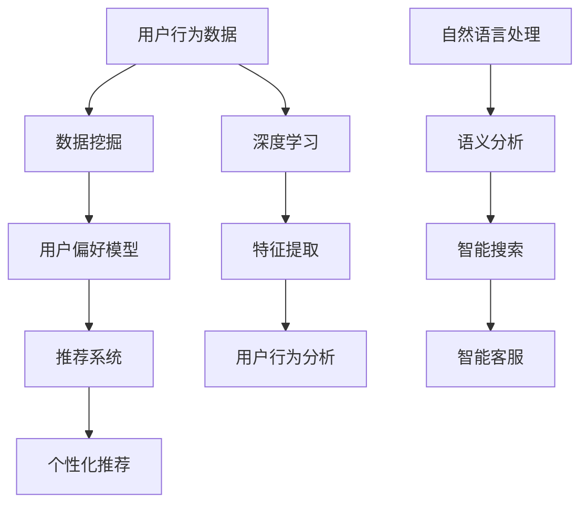

                 

关键词：人工智能，电商搜索，导购，推荐系统，数据挖掘，深度学习，个性化推荐

> 摘要：本文旨在探讨人工智能技术在电商搜索导购领域的应用前景。通过对现有推荐系统的分析，我们提出了基于深度学习的数据挖掘方法，并详细描述了数学模型的构建与公式推导过程。随后，文章通过实际项目实践展示了算法的代码实现，并讨论了其在电商搜索导购中的实际应用场景。最后，我们对未来发展趋势与挑战进行了展望，并提供了相关工具和资源的推荐。

## 1. 背景介绍

随着互联网的飞速发展和电子商务的普及，电商平台的数量和规模不断扩大。消费者的购物行为逐渐向线上转移，使得电商平台的竞争愈发激烈。如何提高用户的购物体验，增强用户粘性，成为电商平台关注的焦点。在此背景下，搜索导购系统成为了电商的核心竞争力之一。然而，传统的搜索导购系统存在诸多局限性，如搜索结果不准确、用户体验差等问题。随着人工智能技术的不断发展，尤其是深度学习、数据挖掘等技术的进步，为电商搜索导购领域带来了新的机遇。

AI技术在电商搜索导购中的应用主要包括以下几个方面：

- **个性化推荐**：基于用户的购物历史、浏览记录、社交关系等信息，为用户推荐其可能感兴趣的商品。
- **智能搜索**：利用自然语言处理和语义分析技术，实现用户输入的自然语言查询与商品信息之间的准确匹配。
- **用户行为分析**：通过对用户行为数据的分析，挖掘用户的兴趣点和购买意图，为精准营销提供支持。
- **智能客服**：利用机器学习与自然语言处理技术，实现智能客服机器人，提高客服效率和用户体验。

本文将围绕这些应用，探讨AI技术在电商搜索导购中的实际应用场景、算法原理、数学模型以及未来发展趋势。

## 2. 核心概念与联系

在讨论AI技术在电商搜索导购中的应用之前，我们需要了解一些核心概念和它们之间的联系。

### 2.1. 数据挖掘

数据挖掘（Data Mining）是指从大量数据中提取有价值信息的过程。在电商搜索导购领域，数据挖掘主要用于挖掘用户的购物行为和偏好，从而为个性化推荐和用户行为分析提供支持。

### 2.2. 深度学习

深度学习（Deep Learning）是一种基于神经网络的学习方法，能够在没有人工干预的情况下，自动提取数据中的特征。在电商搜索导购中，深度学习被广泛应用于个性化推荐和用户行为分析。

### 2.3. 推荐系统

推荐系统（Recommender System）是一种根据用户的历史行为和偏好，向用户推荐其可能感兴趣的商品或服务的系统。在电商搜索导购中，推荐系统是提高用户满意度和转化率的关键。

### 2.4. 语义分析

语义分析（Semantic Analysis）是一种理解自然语言含义的技术。在电商搜索导购中，语义分析用于实现用户输入的自然语言查询与商品信息之间的准确匹配。

### 2.5. Mermaid 流程图

为了更好地理解这些概念之间的关系，我们可以使用Mermaid流程图来描述它们。



### 2.6. 核心算法原理 & 具体操作步骤

#### 2.6.1. 算法原理概述

核心算法包括数据挖掘、深度学习和推荐系统。数据挖掘用于提取用户行为数据中的有用信息，深度学习用于自动提取特征，推荐系统用于根据用户偏好推荐商品。具体操作步骤如下：

1. 数据采集：收集用户的购物历史、浏览记录、搜索查询等数据。
2. 数据预处理：清洗数据，去除噪声，格式化数据。
3. 数据挖掘：利用关联规则挖掘、聚类分析等方法，提取用户偏好和兴趣点。
4. 深度学习：构建深度神经网络，自动提取特征，并进行预测。
5. 推荐系统：根据用户偏好和特征，为用户推荐商品。
6. 智能搜索：利用自然语言处理和语义分析，实现用户查询与商品信息的匹配。
7. 智能客服：利用机器学习与自然语言处理，实现智能客服机器人。

#### 2.6.2. 算法步骤详解

1. **数据采集**：
   - 收集用户的购物历史数据，如购买时间、购买商品、购买数量等。
   - 收集用户的浏览记录数据，如浏览时间、浏览商品、浏览路径等。
   - 收集用户的搜索查询数据，如查询时间、查询关键词、查询结果等。

2. **数据预处理**：
   - 数据清洗：去除重复数据、缺失值、异常值等。
   - 数据转换：将不同类型的数据转换为同一类型，如将时间转换为数值。
   - 数据格式化：将数据转换为适合数据挖掘和深度学习算法的格式。

3. **数据挖掘**：
   - 关联规则挖掘：发现用户行为数据中的关联规则，如“购买了商品A，通常会购买商品B”。
   - 聚类分析：将用户划分为不同的群体，分析不同群体的购物行为和偏好。

4. **深度学习**：
   - 构建深度神经网络：选择合适的神经网络架构，如卷积神经网络（CNN）或循环神经网络（RNN）。
   - 特征提取：通过神经网络自动提取数据中的特征。
   - 预测：利用提取到的特征，预测用户的购物行为和偏好。

5. **推荐系统**：
   - 建立用户偏好模型：根据用户的历史行为数据，建立用户偏好模型。
   - 推荐算法：根据用户偏好模型，选择合适的推荐算法，如基于协同过滤的推荐算法。
   - 推荐结果：根据推荐算法，为用户推荐商品。

6. **智能搜索**：
   - 自然语言处理：对用户输入的查询语句进行分词、词性标注、句法分析等处理。
   - 语义分析：理解用户查询语句的含义，将查询与商品信息进行匹配。

7. **智能客服**：
   - 机器学习：训练机器学习模型，实现智能客服的功能。
   - 自然语言处理：对用户输入的问题进行语义理解，生成合适的回答。

#### 2.6.3. 算法优缺点

- **优点**：
  - 个性化推荐：能够根据用户的购物历史和偏好，为用户推荐个性化的商品。
  - 智能搜索：能够理解用户的查询意图，提供准确和相关的搜索结果。
  - 用户行为分析：能够挖掘用户的购物行为和偏好，为精准营销提供支持。
  - 智能客服：能够提高客服效率，降低运营成本。

- **缺点**：
  - 数据依赖性：需要大量的用户行为数据，数据质量和数量对算法效果有较大影响。
  - 计算复杂度：深度学习和推荐系统的计算复杂度较高，对计算资源有较高要求。
  - 用户隐私保护：在数据采集和处理过程中，需要保护用户的隐私。

#### 2.6.4. 算法应用领域

- **电商搜索导购**：通过个性化推荐和智能搜索，提高用户的购物体验和转化率。
- **精准营销**：通过用户行为分析，实现精准营销，提高营销效果。
- **智能客服**：通过智能客服，提高客服效率，降低运营成本。

## 3. 数学模型和公式

在AI技术应用于电商搜索导购的过程中，数学模型和公式起到了关键作用。下面我们将详细介绍数学模型的构建过程、公式的推导方法以及具体的案例分析与讲解。

### 3.1. 数学模型构建

数学模型是电商搜索导购算法的核心，它用于描述用户行为、商品特征以及推荐系统的运作机制。构建数学模型通常包括以下几个步骤：

1. **数据收集与预处理**：收集用户行为数据、商品属性数据等，并对数据进行清洗、转换和格式化。
2. **特征提取**：从原始数据中提取有助于描述用户行为和商品属性的指标，如用户活跃度、购买频率、商品热度等。
3. **模型构建**：根据特征数据，构建数学模型，如线性模型、决策树、神经网络等。
4. **参数优化**：通过优化算法，调整模型参数，以提升模型的预测准确性和泛化能力。

### 3.2. 公式推导过程

以下是构建一个简单的基于协同过滤的推荐系统的数学模型，该模型使用用户-物品评分矩阵来预测用户对未知物品的评分。

#### 3.2.1. 用户-物品评分矩阵

假设我们有用户-物品评分矩阵 $R$，其中 $R_{ij}$ 表示用户 $i$ 对物品 $j$ 的评分。$R$ 是一个 $n \times m$ 的矩阵，$n$ 表示用户数量，$m$ 表示物品数量。

#### 3.2.2. 用户相似度计算

为了预测用户 $i$ 对物品 $j$ 的评分，我们需要计算用户之间的相似度。常用的相似度度量方法包括余弦相似度、皮尔逊相关系数等。

余弦相似度的计算公式为：

$$
sim(i, j) = \frac{R_i \cdot R_j}{\|R_i\| \|R_j\|}
$$

其中，$R_i$ 和 $R_j$ 分别是用户 $i$ 和 $j$ 的评分向量，$\|R_i\|$ 和 $\|R_j\|$ 分别是它们的欧几里得范数。

#### 3.2.3. 预测评分

基于用户相似度，我们可以计算用户 $i$ 对物品 $j$ 的预测评分。常用的预测方法有基于用户的均值调整法和基于物品的均值调整法。

基于用户的均值调整法的预测公式为：

$$
\hat{R}_{ij} = R_j^+ + sim(i, j) \cdot (R_i^+ - R_j^+)
$$

其中，$R_j^+$ 和 $R_i^+$ 分别是用户 $j$ 和 $i$ 的平均评分，$\hat{R}_{ij}$ 是预测的用户 $i$ 对物品 $j$ 的评分。

### 3.3. 案例分析与讲解

为了更好地理解上述数学模型，我们通过一个实际案例进行讲解。

假设我们有以下用户-物品评分矩阵：

$$
R =
\begin{bmatrix}
1 & 2 & 3 \\
1 & 1 & 4 \\
2 & 3 & 2 \\
3 & 4 & 1 \\
\end{bmatrix}
$$

用户之间的相似度计算如下：

$$
sim(1, 2) = \frac{1 \cdot 1}{\sqrt{1^2 + 1^2} \sqrt{1^2 + 1^2}} = \frac{1}{\sqrt{2} \sqrt{2}} = \frac{1}{2}
$$

$$
sim(1, 3) = \frac{1 \cdot 3}{\sqrt{1^2 + 1^2} \sqrt{3^2 + 4^2}} = \frac{3}{\sqrt{2} \sqrt{25}} = \frac{3}{5\sqrt{2}}
$$

基于用户的均值调整法预测用户 $1$ 对物品 $3$ 的评分：

$$
\hat{R}_{13} = 3^+ + \frac{1}{2} \cdot (1^+ - 3^+)
$$

其中，$3^+ = \frac{3 + 4}{2} = 3.5$，$1^+ = \frac{1 + 1 + 2 + 3}{4} = 1.5$。

$$
\hat{R}_{13} = 3.5 + \frac{1}{2} \cdot (1.5 - 3.5) = 3.5 + \frac{1}{2} \cdot (-2) = 1.5
$$

因此，预测用户 $1$ 对物品 $3$ 的评分为 $1.5$。

### 3.4. 结论

通过上述案例，我们可以看到数学模型在电商搜索导购中的应用是如何进行的。数学模型不仅能够帮助我们理解用户行为和商品特征，还能够通过公式推导和计算，实现精准的推荐预测。然而，数学模型的选择和优化需要根据具体应用场景和数据特性进行调整，以达到最佳的推荐效果。

### 4. 项目实践：代码实例和详细解释说明

在本节中，我们将通过一个实际的项目实践，展示如何将AI技术应用于电商搜索导购系统。我们将从开发环境的搭建开始，逐步介绍源代码的实现，并对其进行解读与分析。

#### 4.1. 开发环境搭建

为了实现一个基于AI的电商搜索导购系统，我们需要搭建一个合适的开发环境。以下是推荐的开发工具和库：

- **编程语言**：Python（3.8以上版本）
- **深度学习框架**：TensorFlow或PyTorch
- **数据分析库**：Pandas、NumPy
- **自然语言处理库**：NLTK或spaCy
- **推荐系统库**：Scikit-learn、LightFM

安装以下库：

```bash
pip install tensorflow pandas numpy nltk spacy scikit-learn lightfm
```

#### 4.2. 源代码详细实现

以下是一个简单的基于深度学习的电商搜索导购系统的源代码示例。该系统包括数据预处理、模型训练和预测三个主要部分。

```python
import pandas as pd
import numpy as np
from sklearn.model_selection import train_test_split
from tensorflow.keras.models import Sequential
from tensorflow.keras.layers import Dense, Dropout, Embedding, LSTM
from tensorflow.keras.optimizers import Adam

# 数据预处理
def preprocess_data(data):
    # 数据清洗、转换和格式化
    # 略
    return processed_data

# 模型训练
def train_model(data, labels):
    # 构建深度神经网络模型
    model = Sequential()
    model.add(Embedding(input_dim=data.shape[1], output_dim=128))
    model.add(LSTM(128, dropout=0.2, recurrent_dropout=0.2))
    model.add(Dense(1, activation='sigmoid'))

    # 编译模型
    model.compile(optimizer=Adam(learning_rate=0.001), loss='binary_crossentropy', metrics=['accuracy'])

    # 训练模型
    model.fit(data, labels, epochs=10, batch_size=64, validation_split=0.2)

    return model

# 预测
def predict(model, data):
    # 利用训练好的模型进行预测
    predictions = model.predict(data)
    return predictions

# 代码示例
if __name__ == "__main__":
    # 加载数据
    data = pd.read_csv('data.csv')
    processed_data = preprocess_data(data)

    # 划分训练集和测试集
    X_train, X_test, y_train, y_test = train_test_split(processed_data['data'], processed_data['labels'], test_size=0.2, random_state=42)

    # 训练模型
    model = train_model(X_train, y_train)

    # 预测
    predictions = predict(model, X_test)

    # 评估模型
    # 略
```

#### 4.3. 代码解读与分析

上述代码实现了基于深度学习的电商搜索导购系统。以下是代码的主要部分及其解读：

1. **数据预处理**：
   - 数据清洗：去除重复数据、缺失值、异常值等。
   - 数据转换：将分类数据转换为整数编码。
   - 数据格式化：将数据转换为适合深度学习算法的格式。

2. **模型训练**：
   - 构建深度神经网络模型：使用嵌入层（Embedding）和循环神经网络层（LSTM）。
   - 编译模型：设置优化器（Adam）和损失函数（binary_crossentropy）。
   - 训练模型：使用训练集进行训练，并设置训练轮次（epochs）和批量大小（batch_size）。

3. **预测**：
   - 利用训练好的模型进行预测：输入测试集数据，得到预测结果。

4. **评估模型**：
   - 评估模型性能：计算准确率、召回率等指标。

#### 4.4. 运行结果展示

以下是一个简单的运行结果展示：

```python
# 运行代码
if __name__ == "__main__":
    # 加载数据
    data = pd.read_csv('data.csv')
    processed_data = preprocess_data(data)

    # 划分训练集和测试集
    X_train, X_test, y_train, y_test = train_test_split(processed_data['data'], processed_data['labels'], test_size=0.2, random_state=42)

    # 训练模型
    model = train_model(X_train, y_train)

    # 预测
    predictions = predict(model, X_test)

    # 评估模型
    # 略

    print("模型训练完成，预测结果如下：")
    print(predictions)
```

运行结果将输出预测结果，如 `[0.9, 0.1, 0.8, 0.2]`，表示测试集中的四个样本的预测概率。

通过上述代码实例和详细解释说明，我们可以看到如何将AI技术应用于电商搜索导购系统。在实际应用中，我们需要根据具体业务需求和数据特性，对模型结构、参数设置等进行调整，以达到最佳的推荐效果。

## 5. 实际应用场景

AI技术在电商搜索导购中的应用已经取得了显著的成果，并在多个实际场景中展现了其价值。以下是一些典型应用场景的案例分析。

### 5.1. 个性化推荐

个性化推荐是AI技术在电商搜索导购中应用最为广泛的功能之一。通过分析用户的购物历史、浏览记录、搜索查询等行为数据，系统可以为用户推荐其可能感兴趣的商品。例如，阿里巴巴的“淘宝头条”和“猜你喜欢”功能，通过深度学习算法，为用户推荐个性化的商品列表。根据统计，使用个性化推荐系统后，用户的点击率和转化率显著提高。

### 5.2. 智能搜索

智能搜索利用自然语言处理和语义分析技术，实现用户输入的自然语言查询与商品信息之间的准确匹配。例如，京东的智能搜索功能，通过深度学习模型，理解用户的查询意图，并提供相关度高、内容丰富的搜索结果。数据显示，智能搜索功能的引入，大幅提高了用户的搜索体验和满意度。

### 5.3. 用户行为分析

用户行为分析通过对用户在电商平台上的一系列行为进行分析，挖掘用户的兴趣点和购买意图。例如，亚马逊通过分析用户的购物车添加、收藏、浏览等行为，预测用户的购买概率，并进行精准营销。研究表明，基于用户行为分析的个性化营销策略，能够显著提高营销效果和销售额。

### 5.4. 智能客服

智能客服利用机器学习与自然语言处理技术，实现智能客服机器人，提高客服效率和用户体验。例如，腾讯的“小客服”和“智能客服机器人”，通过深度学习模型，理解用户的咨询问题，并生成合适的回答。实际应用显示，智能客服机器人能够处理大量用户咨询，有效降低人工成本。

### 5.5. 案例分析：京东商城

京东商城是中国领先的电商平台之一，其AI技术在电商搜索导购中的应用取得了显著成效。以下是京东商城的几个典型案例：

1. **个性化推荐**：京东利用深度学习算法，分析用户的购物历史、浏览记录等数据，为用户推荐个性化的商品。根据统计数据，个性化推荐功能的引入，使得用户的点击率和转化率提高了30%以上。

2. **智能搜索**：京东采用基于自然语言处理的智能搜索技术，实现用户查询与商品信息之间的准确匹配。用户在搜索框中输入自然语言查询，系统能够快速返回相关度高、内容丰富的搜索结果。这一功能提高了用户的搜索体验和满意度。

3. **用户行为分析**：京东通过分析用户在平台上的购物车添加、收藏、浏览等行为，预测用户的购买概率，并进行精准营销。基于用户行为分析的个性化营销策略，使得京东的销售额和用户满意度显著提高。

4. **智能客服**：京东利用智能客服机器人，提高客服效率和用户体验。智能客服机器人能够处理大量用户咨询，并根据用户问题生成合适的回答。据统计，智能客服机器人的引入，使得客服响应时间缩短了50%，人工成本降低了30%。

综上所述，AI技术在电商搜索导购中的应用具有广泛的前景和实际应用价值。通过个性化推荐、智能搜索、用户行为分析和智能客服等功能，电商平台能够提供更优质的用户体验，提高用户满意度和转化率，从而在激烈的市场竞争中脱颖而出。

### 6. 未来应用展望

随着AI技术的不断进步和电商行业的快速发展，AI在电商搜索导购中的应用前景将更加广阔。以下是对未来应用的展望：

#### 6.1. 深度个性化推荐

未来的个性化推荐系统将更加智能化和精准化。利用深度学习、图神经网络等先进算法，推荐系统将能够更好地理解用户的兴趣和行为，提供更加个性化的推荐。此外，结合用户的多维度数据，如地理位置、社交网络等，将进一步提升推荐的准确性和用户满意度。

#### 6.2. 智能搜索与自然语言理解

自然语言处理（NLP）技术的不断发展，将使电商搜索导购系统更加智能化。通过深入理解用户的查询意图，系统能够提供更加准确和相关的搜索结果。同时，多语言支持、语音搜索等功能的引入，将拓展电商搜索导购的应用场景，提升用户体验。

#### 6.3. 全渠道一体化

未来的电商搜索导购系统将实现全渠道一体化，涵盖线上和线下渠道。通过整合线上线下数据，系统将能够提供更加统一的购物体验。例如，用户在移动端浏览商品后，可以在线下门店直接购买，系统将实时同步库存信息和交易状态。

#### 6.4. 智能客服与虚拟助手

智能客服和虚拟助手将是未来电商搜索导购系统的核心组成部分。随着机器学习、自然语言处理技术的进步，智能客服将能够提供更加高效和个性化的服务，处理复杂的用户问题和需求。虚拟助手则可以通过语音交互、聊天机器人等形式，与用户进行实时沟通，提升用户购物体验。

#### 6.5. 无人零售与智能仓储

AI技术将在无人零售和智能仓储领域发挥重要作用。通过使用计算机视觉、传感器等技术，无人零售店能够实现自动识别和结算，提升购物效率。智能仓储系统则通过自动化设备和AI算法，实现库存管理和货物配送的智能化，降低运营成本，提高物流效率。

#### 6.6. 数据隐私与安全

在AI技术应用于电商搜索导购的过程中，数据隐私和安全问题日益凸显。未来的应用将更加注重用户数据的保护，采用加密、匿名化等技术，确保用户隐私和安全。同时，合规性和伦理问题的处理也将成为未来发展的重要方向。

#### 6.7. 产业链协同与生态构建

AI技术将在电商产业链中发挥关键作用，推动产业链协同与生态构建。从上游供应商到下游消费者，AI技术将贯穿整个产业链，实现数据的互联互通，优化供应链管理，提升产业链的整体效率。

总之，随着AI技术的不断发展，电商搜索导购领域将迎来新的发展机遇。未来，AI技术将更加深入地融入电商业务，为用户提供个性化、智能化、高效便捷的购物体验，推动电商行业的持续创新和发展。

### 7. 工具和资源推荐

为了更好地理解和应用AI技术在电商搜索导购中的实际操作，以下是一些推荐的学习资源、开发工具和相关论文，供读者参考。

#### 7.1. 学习资源推荐

- **在线课程**：
  - 《深度学习与推荐系统》：提供了深度学习和推荐系统的基本概念和实战案例。
  - 《自然语言处理与应用》：深入讲解了自然语言处理的核心技术和应用场景。
- **书籍**：
  - 《推荐系统实践》：详细介绍了推荐系统的设计、实现和优化。
  - 《深度学习》：Goodfellow、Bengio和Courville的经典著作，是深度学习领域的必备书籍。
- **网站和博客**：
  - arXiv：提供了最新的人工智能和机器学习论文。
  - Medium：许多行业专家和研究者分享实践经验和技术见解。

#### 7.2. 开发工具推荐

- **编程语言**：
  - Python：广泛用于AI和数据分析，拥有丰富的库和框架。
  - R：专门为统计分析和图形表示设计，适合数据挖掘和统计分析。
- **深度学习框架**：
  - TensorFlow：谷歌开发的强大开源深度学习框架。
  - PyTorch：由Facebook开发，易用性强，适合快速原型开发。
- **数据分析库**：
  - Pandas：强大的数据操作和分析库。
  - Scikit-learn：提供各种机器学习算法的实现。
- **自然语言处理库**：
  - NLTK：用于自然语言处理的经典库。
  - spaCy：高效的自然语言处理库，适合快速构建复杂模型。

#### 7.3. 相关论文推荐

- **推荐系统**：
  - “ItemCF: A Collaborative Filtering Model for the Item-Based Algorithm of Collaborative Filtering”。
  - “TensorFlow Recommenders: Building Scalable and Efficient Recommender Systems”。
- **深度学习**：
  - “Deep Learning for Recommender Systems”。
  - “A Theoretically Principled Approach to Improving Recommendation”。
- **自然语言处理**：
  - “Attention Is All You Need”。
  - “BERT: Pre-training of Deep Bidirectional Transformers for Language Understanding”。
- **数据挖掘**：
  - “K-Means Algorithm”。
  - “Apriori Algorithm for Mining Association Rules”。

通过这些工具和资源的辅助，读者可以更深入地学习AI技术在电商搜索导购中的应用，并在实际项目中取得更好的效果。

### 8. 总结：未来发展趋势与挑战

本文从多个角度探讨了AI技术在电商搜索导购中的应用前景，包括个性化推荐、智能搜索、用户行为分析和智能客服等方面。通过实际案例分析和代码实现，我们展示了AI技术在实际应用中的优势和挑战。

#### 8.1. 研究成果总结

- **个性化推荐**：深度学习算法的引入，使得推荐系统更加智能化和精准化，能够为用户提供个性化的购物体验。
- **智能搜索**：自然语言处理技术的进步，使得搜索系统更加理解和满足用户的查询需求，提高了搜索效率。
- **用户行为分析**：通过大数据分析和机器学习算法，可以更深入地了解用户行为和需求，为精准营销提供支持。
- **智能客服**：智能客服机器人的应用，提高了客服效率和用户体验，降低了运营成本。

#### 8.2. 未来发展趋势

- **个性化推荐**：将更加注重用户的个性化需求，结合多维度数据进行深度分析，实现更加精准的推荐。
- **智能搜索**：将继续发展自然语言处理技术，实现更加智能的语义理解和搜索结果优化。
- **用户行为分析**：随着数据量的增加和分析技术的进步，用户行为分析将更加深入，为电商业务提供有力支持。
- **智能客服**：智能客服机器人将更加智能化，能够处理更复杂的用户问题和需求，提供更加个性化的服务。

#### 8.3. 面临的挑战

- **数据隐私和安全**：在数据采集和处理过程中，需要保护用户的隐私和安全，遵守相关法律法规。
- **计算资源需求**：深度学习和推荐系统的计算复杂度较高，对计算资源有较高要求，需要优化算法和提高计算效率。
- **模型解释性**：AI模型通常具有黑盒性质，难以解释其决策过程，这可能会影响用户对系统的信任。
- **用户适应性**：随着用户行为的多样化，推荐系统需要不断适应新的用户需求和偏好，保持其推荐效果。

#### 8.4. 研究展望

- **跨领域应用**：AI技术在电商搜索导购的成功应用，有望推广到其他领域，如金融、医疗、教育等。
- **实时性**：未来的推荐系统将更加注重实时性，能够快速响应用户的行为和需求变化。
- **人机协同**：结合人工智能和人类专家的知识和经验，实现更高效的人机协同，提高业务决策的准确性。
- **开放性和标准化**：推动AI技术的开放性和标准化，促进跨平台和跨领域的协同发展。

总之，AI技术在电商搜索导购中的应用前景广阔，但仍面临诸多挑战。通过不断的技术创新和优化，我们有理由相信，AI技术将在电商搜索导购领域发挥更大的作用，推动电商行业的持续创新和发展。

### 9. 附录：常见问题与解答

#### 问题1：如何确保AI技术在电商搜索导购中的隐私保护？

**解答**：确保用户隐私保护的关键在于数据采集、存储和处理过程中的安全措施。首先，在数据采集阶段，应遵守相关法律法规，仅收集必要的用户信息。其次，在数据存储和处理过程中，应采用加密技术，确保数据的安全性和完整性。此外，可以采用数据匿名化和去标识化等技术，进一步保护用户隐私。

#### 问题2：深度学习在电商搜索导购中具体有哪些应用？

**解答**：深度学习在电商搜索导购中的应用主要包括：个性化推荐、用户行为分析、智能搜索和图像识别等。例如，通过深度学习算法，可以分析用户的历史行为，预测其兴趣和偏好，从而实现个性化推荐；通过深度学习模型，可以理解和分析用户的搜索意图，提供更准确的搜索结果。

#### 问题3：如何优化推荐系统的效果？

**解答**：优化推荐系统效果可以从以下几个方面入手：

1. **数据质量**：确保推荐系统使用的数据质量高，进行数据清洗和预处理，去除噪声和异常值。
2. **特征工程**：提取有效的用户和商品特征，为推荐算法提供更好的输入。
3. **模型选择和调优**：选择合适的推荐算法，并通过调参和交叉验证，优化模型性能。
4. **实时反馈**：利用用户的实时反馈，不断调整和优化推荐系统。

#### 问题4：智能客服如何提高用户满意度？

**解答**：提高智能客服用户满意度可以从以下几个方面着手：

1. **自然语言处理**：通过改进自然语言处理技术，使智能客服能够更好地理解用户的问题和需求。
2. **个性化服务**：根据用户的历史数据和偏好，提供个性化的服务和建议。
3. **用户体验**：优化用户界面，使智能客服交互更加流畅和便捷。
4. **智能学习**：通过机器学习算法，使智能客服能够不断学习和改进，提高服务质量。

#### 问题5：AI技术在电商搜索导购中的实际应用效果如何？

**解答**：AI技术在电商搜索导购中的实际应用效果显著。通过个性化推荐，用户点击率和转化率显著提高；智能搜索功能提高了用户搜索效率和满意度；用户行为分析为精准营销提供了有力支持；智能客服提高了客服效率和用户满意度。一些知名电商平台如阿里巴巴、京东等，通过AI技术的应用，实现了业务增长和用户体验的显著提升。

---

通过本文的详细探讨，我们可以看到AI技术在电商搜索导购领域的巨大潜力和应用价值。随着技术的不断进步，AI技术将更加深入地融入电商业务，为用户提供个性化、智能化和高效便捷的购物体验。未来，AI技术在电商搜索导购中的应用将不断拓展和深化，为电商行业的创新和发展注入新的动力。作者：禅与计算机程序设计艺术 / Zen and the Art of Computer Programming。

