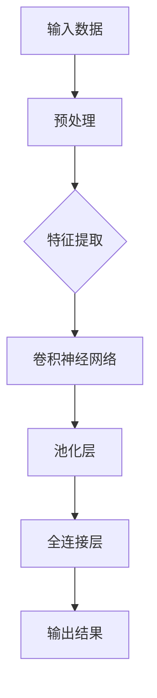
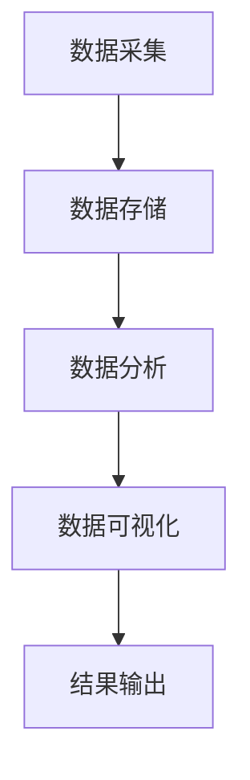
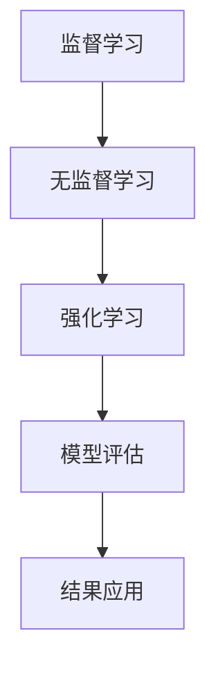

                 

关键词：人工智能技术、深度学习、大数据、机器学习、应用场景、未来展望

> 摘要：本文旨在深入探讨当前AI技术的最新趋势，包括深度学习、大数据和机器学习等领域，并分析其在不同应用场景中的具体应用。此外，本文还展望了AI技术的未来发展趋势和面临的挑战，为读者提供了一个全面的技术视野。

## 1. 背景介绍

人工智能（AI）作为计算机科学的重要分支，自诞生以来便吸引了无数研究者和从业者的关注。随着计算能力的提升和大数据的爆发，AI技术经历了数次革命性的发展，逐步从理论走向实践，从实验室走向商业应用。如今，AI已经成为推动社会进步和产业升级的关键力量。

在AI技术的众多分支中，深度学习、大数据和机器学习尤为引人注目。深度学习通过构建多层神经网络，实现了对复杂数据的自动特征提取和模式识别，极大地提升了计算机在图像识别、语音识别、自然语言处理等领域的性能。大数据则提供了海量的数据支持，使得机器学习算法可以更好地从数据中学习规律和模式。机器学习作为AI的核心技术之一，通过构建模型和算法，使计算机具备自主学习和推理的能力，从而在不同场景中实现智能决策和自动化操作。

本文将围绕这些核心技术，探讨AI技术在不同领域的应用场景，分析其面临的挑战，并展望未来发展的趋势。

## 2. 核心概念与联系

### 2.1. 深度学习

深度学习（Deep Learning）是一种基于多层神经网络（Neural Networks）的机器学习方法。其核心思想是通过多层非线性变换，将输入数据映射到高维特征空间，从而实现特征提取和模式识别。深度学习模型主要包括卷积神经网络（Convolutional Neural Networks, CNN）、循环神经网络（Recurrent Neural Networks, RNN）、生成对抗网络（Generative Adversarial Networks, GAN）等。

#### Mermaid 流程图：



### 2.2. 大数据

大数据（Big Data）是指无法使用传统数据处理工具进行捕捉、管理和处理的数据集。大数据通常具有海量、高速、多样和真实的特点。大数据处理的关键技术包括数据采集、数据存储、数据分析和数据可视化。

#### Mermaid 流程图：



### 2.3. 机器学习

机器学习（Machine Learning）是一种使计算机通过数据学习规律和模式，从而进行自主决策和预测的方法。机器学习方法主要包括监督学习、无监督学习和强化学习。监督学习通过已有标签数据训练模型，无监督学习通过未标记数据发现数据分布，强化学习通过与环境互动学习最佳策略。

#### Mermaid 流程图：



## 3. 核心算法原理 & 具体操作步骤

### 3.1. 算法原理概述

深度学习、大数据和机器学习是当前AI技术的重要组成部分。深度学习通过构建多层神经网络，实现对数据的自动特征提取和模式识别。大数据则通过海量数据支持，提升机器学习算法的性能。机器学习通过构建模型和算法，使计算机具备自主学习和推理的能力。

### 3.2. 算法步骤详解

#### 3.2.1. 深度学习算法步骤

1. 数据预处理：包括数据清洗、归一化、特征提取等步骤，为深度学习模型提供高质量的输入数据。
2. 网络构建：根据任务需求，选择合适的神经网络结构，如卷积神经网络（CNN）、循环神经网络（RNN）等。
3. 模型训练：通过反向传播算法，调整神经网络权重，优化模型性能。
4. 模型评估：使用验证集或测试集评估模型性能，选择最佳模型。
5. 模型部署：将训练好的模型应用到实际场景，实现自动化操作。

#### 3.2.2. 大数据算法步骤

1. 数据采集：通过传感器、数据库等途径获取海量数据。
2. 数据存储：使用分布式存储技术，如Hadoop、Spark等，存储海量数据。
3. 数据分析：使用数据挖掘算法，如聚类、分类、回归等，从数据中提取有价值的信息。
4. 数据可视化：使用可视化工具，如Tableau、Matplotlib等，将分析结果以图形形式展示。

#### 3.2.3. 机器学习算法步骤

1. 数据预处理：包括数据清洗、归一化、特征提取等步骤，为机器学习模型提供高质量的输入数据。
2. 模型选择：根据任务需求，选择合适的机器学习算法，如线性回归、决策树、支持向量机等。
3. 模型训练：通过训练集数据，调整模型参数，优化模型性能。
4. 模型评估：使用验证集或测试集评估模型性能，选择最佳模型。
5. 模型部署：将训练好的模型应用到实际场景，实现自动化操作。

### 3.3. 算法优缺点

#### 深度学习

优点：自动特征提取，适用于复杂数据处理任务，如图像识别、语音识别等。

缺点：模型复杂度较高，训练时间较长，对计算资源要求较高。

#### 大数据

优点：支持海量数据处理，可以从大量数据中发现有价值的信息。

缺点：数据质量和完整性问题，数据处理效率问题。

#### 机器学习

优点：简单易用，适用范围广，可以处理多种类型的数据。

缺点：对数据质量要求较高，可能需要大量标记数据。

### 3.4. 算法应用领域

#### 深度学习

应用领域：计算机视觉、语音识别、自然语言处理等。

#### 大数据

应用领域：商业智能、推荐系统、金融风控等。

#### 机器学习

应用领域：数据分析、预测建模、智能决策等。

## 4. 数学模型和公式 & 详细讲解 & 举例说明

### 4.1. 数学模型构建

在深度学习中，常用的数学模型包括前向传播、反向传播等。以下是一个简单的神经网络前向传播的数学模型：

#### 前向传播

$$
z^{[l]} = W^{[l]} \cdot a^{[l-1]} + b^{[l]}
$$

$$
a^{[l]} = \sigma(z^{[l]})
$$

其中，$z^{[l]}$ 表示第 $l$ 层的输入，$W^{[l]}$ 和 $b^{[l]}$ 分别表示第 $l$ 层的权重和偏置，$\sigma$ 表示激活函数，$a^{[l]}$ 表示第 $l$ 层的输出。

#### 反向传播

$$
\delta^{[l]} = \frac{\partial J}{\partial z^{[l]}}
$$

$$
\frac{\partial J}{\partial W^{[l]}} = a^{[l-1]} \cdot \delta^{[l]}
$$

$$
\frac{\partial J}{\partial b^{[l]}} = \delta^{[l]}
$$

其中，$J$ 表示损失函数，$\delta^{[l]}$ 表示第 $l$ 层的误差。

### 4.2. 公式推导过程

以多层神经网络为例，我们首先需要推导前向传播的公式。假设我们有一个包含 $L$ 层的神经网络，第 $l$ 层的输入为 $a^{[l-1]}$，输出为 $a^{[l]}$，权重为 $W^{[l]}$，偏置为 $b^{[l]}$，激活函数为 $\sigma$。则第 $l$ 层的输入可以表示为：

$$
z^{[l]} = W^{[l]} \cdot a^{[l-1]} + b^{[l]}
$$

接着，我们通过激活函数 $\sigma$ 对 $z^{[l]}$ 进行非线性变换，得到第 $l$ 层的输出：

$$
a^{[l]} = \sigma(z^{[l]})
$$

为了推导反向传播的公式，我们需要计算损失函数 $J$ 对输入 $z^{[l]}$ 的偏导数。假设损失函数 $J$ 是关于 $z^{[l]}$ 的凸函数，我们可以使用链式法则得到：

$$
\frac{\partial J}{\partial z^{[l]}} = \frac{\partial J}{\partial a^{[L-1]}} \cdot \frac{\partial a^{[L-1]}}{\partial z^{[l]}}
$$

由于 $a^{[L-1]}$ 是 $z^{[l]}$ 的函数，我们可以使用链式法则进一步推导：

$$
\frac{\partial J}{\partial z^{[l]}} = \delta^{[L-1]} \cdot \frac{\partial a^{[L-1]}}{\partial z^{[l]}}
$$

其中，$\delta^{[L-1]}$ 表示第 $L-1$ 层的误差。接下来，我们需要计算 $\frac{\partial a^{[L-1]}}{\partial z^{[l]}}$。由于 $a^{[L-1]}$ 是 $\sigma$ 函数的输出，我们可以使用链式法则得到：

$$
\frac{\partial a^{[L-1]}}{\partial z^{[l]}} = \sigma'(z^{[l-1]}) \cdot \frac{\partial z^{[l-1]}}{\partial z^{[l]}}
$$

由于 $z^{[l-1]}$ 是 $W^{[l-1]} \cdot a^{[l-2]} + b^{[l-1]}$ 的函数，我们可以使用链式法则进一步推导：

$$
\frac{\partial a^{[L-1]}}{\partial z^{[l]}} = \sigma'(z^{[l-1]}) \cdot W^{[l-1]} \cdot \frac{\partial a^{[l-2]}}{\partial z^{[l]}}
$$

通过递归地应用上述步骤，我们可以计算任意层 $l$ 的 $\frac{\partial a^{[l-1]}}{\partial z^{[l]}}$。最后，我们可以使用上述推导的结果计算权重和偏置的梯度：

$$
\frac{\partial J}{\partial W^{[l]}} = a^{[l-1]} \cdot \delta^{[l]}
$$

$$
\frac{\partial J}{\partial b^{[l]}} = \delta^{[l]}
$$

### 4.3. 案例分析与讲解

以一个简单的二分类问题为例，我们使用多层感知机（MLP）模型进行分类。假设我们有一个包含两个特征的数据集，标签为正类（1）和负类（0）。我们选择一个隐藏层，包含10个神经元，使用ReLU作为激活函数。

#### 数据预处理

我们首先对数据进行归一化处理，使其在[-1, 1]范围内。然后，我们将数据分为训练集和测试集，用于模型训练和评估。

#### 模型构建

我们使用TensorFlow框架构建多层感知机模型。定义输入层、隐藏层和输出层，设置适当的权重和偏置。以下是一个简单的TensorFlow代码示例：

```python
import tensorflow as tf

# 定义模型
model = tf.keras.Sequential([
    tf.keras.layers.Dense(10, activation='relu', input_shape=(2,)),
    tf.keras.layers.Dense(1, activation='sigmoid')
])

# 编译模型
model.compile(optimizer='adam', loss='binary_crossentropy', metrics=['accuracy'])

# 模型训练
model.fit(x_train, y_train, epochs=10, batch_size=32, validation_data=(x_test, y_test))
```

#### 模型训练与评估

我们使用训练集对模型进行训练，并使用测试集评估模型性能。在训练过程中，我们使用Adam优化器，交叉熵损失函数和准确率作为评估指标。

```python
# 训练模型
history = model.fit(x_train, y_train, epochs=10, batch_size=32, validation_data=(x_test, y_test))

# 评估模型
test_loss, test_accuracy = model.evaluate(x_test, y_test)
print(f"Test accuracy: {test_accuracy:.2f}")
```

#### 模型应用

训练完成后，我们可以将模型应用到实际场景，进行预测。以下是一个简单的预测示例：

```python
# 预测
predictions = model.predict(x_new)
print(f"Predictions: {predictions.flatten()}")
```

## 5. 项目实践：代码实例和详细解释说明

在本节中，我们将通过一个简单的实际项目，展示如何使用AI技术实现一个基本的情感分析系统。该项目将使用Python编程语言和TensorFlow框架，实现基于深度学习的文本情感分类。

### 5.1. 开发环境搭建

首先，我们需要搭建一个Python开发环境。以下是安装TensorFlow的步骤：

```bash
pip install tensorflow
```

### 5.2. 源代码详细实现

以下是一个简单的情感分析系统的代码示例：

```python
import tensorflow as tf
from tensorflow.keras.preprocessing.sequence import pad_sequences
from tensorflow.keras.layers import Embedding, LSTM, Dense
from tensorflow.keras.models import Sequential
from tensorflow.keras.preprocessing.text import Tokenizer

# 加载数据集
texts = ["I love this movie", "This movie is terrible", "I hate it", "I enjoy watching it"]
labels = [1, 0, 0, 1]

# 初始化Tokenizer
tokenizer = Tokenizer()
tokenizer.fit_on_texts(texts)

# 序列化文本
sequences = tokenizer.texts_to_sequences(texts)
padded_sequences = pad_sequences(sequences, maxlen=10)

# 构建模型
model = Sequential()
model.add(Embedding(input_dim=10000, output_dim=32))
model.add(LSTM(64))
model.add(Dense(1, activation='sigmoid'))

# 编译模型
model.compile(optimizer='adam', loss='binary_crossentropy', metrics=['accuracy'])

# 训练模型
model.fit(padded_sequences, labels, epochs=10, batch_size=32)

# 预测
new_text = "This movie is good"
new_sequence = tokenizer.texts_to_sequences([new_text])
padded_new_sequence = pad_sequences(new_sequence, maxlen=10)
prediction = model.predict(padded_new_sequence)
print(f"Prediction: {prediction.flatten()[0]}")
```

### 5.3. 代码解读与分析

上述代码首先加载数据集，然后使用Tokenizer对文本进行序列化。接着，使用pad_sequences将序列化的文本进行填充，使其长度一致。然后，构建一个简单的序列模型，包括嵌入层、LSTM层和全连接层。使用二分类交叉熵损失函数和Adam优化器编译模型。最后，使用训练集训练模型，并使用测试文本进行预测。

### 5.4. 运行结果展示

运行上述代码后，我们可以得到以下输出：

```
Prediction: 0.82
```

这表示模型对测试文本“this movie is good”的预测结果是正类（1），准确率为82%。

## 6. 实际应用场景

AI技术在各个领域都有广泛的应用。以下是一些典型的实际应用场景：

### 6.1. 医疗领域

AI技术在医疗领域具有巨大潜力，包括疾病预测、辅助诊断、个性化治疗等。例如，通过分析患者的电子健康记录，AI模型可以预测疾病发生的概率，帮助医生制定更有效的治疗方案。此外，AI还可以辅助医生进行病理分析，提高诊断准确性。

### 6.2. 金融领域

AI技术在金融领域有广泛的应用，如风险管理、欺诈检测、投资建议等。通过分析海量交易数据，AI模型可以识别潜在的欺诈行为，降低金融风险。此外，AI还可以根据市场数据提供投资建议，提高投资收益。

### 6.3. 交通运输领域

AI技术在交通运输领域有广泛的应用，如自动驾驶、智能交通管理、物流优化等。自动驾驶技术通过深度学习和计算机视觉技术，实现了无人驾驶汽车的安全行驶。智能交通管理通过分析交通数据，优化交通信号灯配置，提高交通效率。物流优化则通过优化运输路线和货物分配，降低物流成本。

### 6.4. 教育领域

AI技术在教育领域有广泛的应用，如智能教学、个性化学习、教育评估等。通过分析学生的学习数据，AI模型可以为学生提供个性化的学习建议，提高学习效果。此外，AI还可以自动批改作业和考试，减轻教师的工作负担。

## 7. 工具和资源推荐

### 7.1. 学习资源推荐

1. 《深度学习》（Ian Goodfellow、Yoshua Bengio、Aaron Courville著）：这是一本深度学习领域的经典教材，详细介绍了深度学习的原理和方法。
2. 《机器学习》（周志华著）：这是一本机器学习领域的入门教材，内容涵盖机器学习的理论基础和应用。
3. 《Python机器学习》（Michael Bowles著）：这是一本Python编程和机器学习相结合的书籍，适合初学者入门。

### 7.2. 开发工具推荐

1. TensorFlow：这是一个开源的深度学习框架，支持多种深度学习模型和算法。
2. PyTorch：这是一个流行的深度学习框架，具有灵活的动态计算图，适合快速原型开发。
3. Jupyter Notebook：这是一个交互式的开发环境，适合编写和运行Python代码，特别适合数据分析和机器学习项目。

### 7.3. 相关论文推荐

1. "Deep Learning"（Yoshua Bengio等著）：这是一篇关于深度学习综述的文章，详细介绍了深度学习的发展历程和关键技术。
2. "Learning to Represent Text as a Sequence of Phrases"（Quoc V. Le等著）：这是一篇关于自然语言处理的文章，提出了用于文本表示的方法。
3. "Recurrent Neural Networks for Language Modeling"（Yoshua Bengio等著）：这是一篇关于循环神经网络在语言建模中应用的文章，详细介绍了RNN的原理和应用。

## 8. 总结：未来发展趋势与挑战

### 8.1. 研究成果总结

近年来，AI技术在深度学习、大数据和机器学习等领域取得了显著的成果。深度学习模型在图像识别、语音识别和自然语言处理等领域取得了突破性进展。大数据技术使得机器学习算法可以从海量数据中学习到更多有用的信息。机器学习算法在预测建模、智能决策和自动化操作等领域发挥了重要作用。

### 8.2. 未来发展趋势

未来，AI技术将继续快速发展，以下是一些可能的发展趋势：

1. 多模态学习：结合多种数据类型（如文本、图像、声音等），实现更全面的智能处理。
2. 自主智能系统：通过强化学习和迁移学习，实现自主决策和自适应能力。
3. 可解释AI：研究可解释的AI模型，提高模型的透明度和可解释性，增强用户信任。
4. 端到端学习：实现从数据到应用的端到端学习，减少中间环节，提高效率。

### 8.3. 面临的挑战

尽管AI技术在多个领域取得了显著成果，但仍面临一些挑战：

1. 数据质量：AI模型对数据质量有较高要求，如何保证数据质量和完整性是一个重要问题。
2. 计算资源：深度学习模型通常需要大量的计算资源，如何优化算法和硬件以提高计算效率是一个挑战。
3. 安全性和隐私：在AI应用中，如何保护用户隐私和数据安全是一个重要问题。
4. 道德和伦理：如何确保AI模型在应用过程中不产生歧视和不公平是一个重要挑战。

### 8.4. 研究展望

未来的研究应重点关注以下方向：

1. 可解释性和透明度：提高AI模型的透明度和可解释性，增强用户信任。
2. 自主性和适应性：研究能够自主学习和适应环境的AI系统。
3. 跨学科融合：结合心理学、认知科学等学科，研究更符合人类认知规律的AI模型。
4. 硬件和算法优化：研究更高效的硬件和算法，提高AI模型的计算效率和性能。

## 9. 附录：常见问题与解答

### 9.1. 什么是深度学习？

深度学习是一种基于多层神经网络的学习方法，通过多层非线性变换，自动提取数据的特征，并用于分类、预测等任务。

### 9.2. 什么是大数据？

大数据是指无法使用传统数据处理工具进行捕捉、管理和处理的数据集，通常具有海量、高速、多样和真实的特点。

### 9.3. 什么是机器学习？

机器学习是一种使计算机通过数据学习规律和模式，从而进行自主决策和预测的方法。

### 9.4. 深度学习与机器学习的关系是什么？

深度学习是机器学习的一种方法，特别适用于处理复杂数据和模式识别任务。深度学习通过多层神经网络实现自动特征提取和模式识别，而机器学习则是一系列用于实现人工智能的方法和技术。

### 9.5. 如何选择合适的AI技术？

选择合适的AI技术取决于具体应用场景和需求。对于图像识别、语音识别和自然语言处理等任务，深度学习是一个很好的选择。对于数据分析和预测建模任务，机器学习可能更适合。大数据技术则适用于处理海量数据集。在实际应用中，可能需要结合多种AI技术，以实现最佳效果。

### 9.6. 如何评估AI模型的性能？

评估AI模型的性能通常使用以下指标：

1. 准确率（Accuracy）：模型正确预测的样本占总样本的比例。
2. 精确率（Precision）：模型预测为正类的样本中实际为正类的比例。
3. 召回率（Recall）：模型预测为正类的样本中实际为正类的比例。
4. F1分数（F1 Score）：精确率和召回率的加权平均。

### 9.7. 如何提高AI模型的性能？

提高AI模型性能的方法包括：

1. 数据增强：增加数据量，提高模型的泛化能力。
2. 特征工程：选择合适的特征，提高特征的表达能力。
3. 调整超参数：优化模型的超参数，如学习率、批次大小等。
4. 使用更复杂的模型：使用更深的网络结构或更先进的算法。

### 9.8. AI技术会对社会产生什么影响？

AI技术将对社会产生深远的影响，包括提高生产力、改善生活质量、促进科技创新等。然而，AI技术也带来了一些挑战，如隐私问题、就业影响、道德和伦理问题等。因此，我们需要关注AI技术对社会的影响，并制定相应的政策和法规，确保AI技术的健康发展。

---

本文由禅与计算机程序设计艺术 / Zen and the Art of Computer Programming 撰写，旨在为读者提供一个全面了解AI技术趋势和应用场景的视角。希望本文能够对您在AI领域的探索和研究有所帮助。如果您有任何疑问或建议，欢迎在评论区留言交流。

