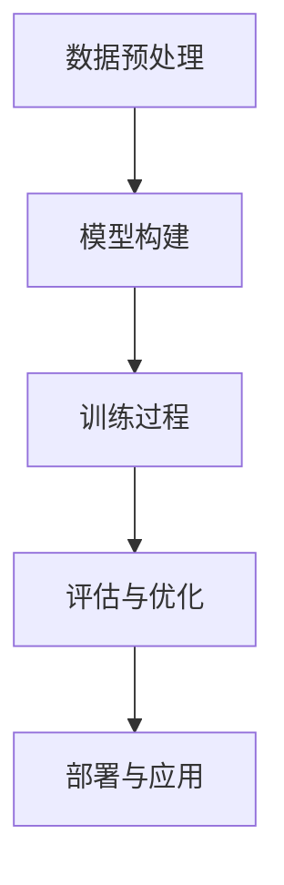

                 

关键词：人工智能，技术趋势，应用场景，AI算法，数学模型，实践案例，工具资源，未来展望

> 摘要：本文旨在探讨当前AI技术的最新发展趋势，以及这些技术在不同应用场景中的具体实现和挑战。通过对核心算法原理、数学模型、实践案例的详细解析，本文将为读者提供一个全面了解AI技术现状和未来方向的视角。

## 1. 背景介绍

随着计算机技术和互联网的快速发展，人工智能（AI）已经成为当今最具前瞻性的科技领域之一。从早期的专家系统到深度学习、从自然语言处理到计算机视觉，AI技术的应用范围不断扩展，已经深入到我们生活的方方面面。然而，AI技术的进步不仅需要算法的创新，还需要与实际应用场景相结合，以解决现实中的复杂问题。

本文将围绕以下几个核心问题展开讨论：

1. 当前AI技术的发展趋势是什么？
2. 这些技术如何与不同应用场景相结合？
3. 在实际应用中，我们遇到了哪些挑战和问题？
4. 如何评估和优化AI技术的效果和效率？
5. AI技术的未来发展方向和潜在影响是什么？

通过对上述问题的深入探讨，本文希望能够为读者提供一个系统、全面的理解，以及对于未来发展趋势的深入思考。

## 2. 核心概念与联系

### 2.1 AI技术分类与基础架构

人工智能技术可以分为多个子领域，包括但不限于机器学习、深度学习、自然语言处理、计算机视觉等。每个子领域都有其独特的技术特点和适用场景。例如，机器学习侧重于通过数据训练模型，实现数据分析和预测；深度学习则通过多层神经网络实现复杂模式识别；自然语言处理专注于文本和语言的理解与生成；计算机视觉则关注图像和视频的分析。

在这些技术中，深度学习作为一种强有力的工具，已经成为了AI领域的核心。深度学习通过多层神经网络结构，可以从大量数据中自动学习特征表示，这使得它在图像识别、语音识别、自然语言处理等多个领域都表现出了强大的能力。

### 2.2 技术架构与工作原理

深度学习的工作原理可以概括为以下几个步骤：

1. **数据预处理**：包括数据清洗、归一化、数据增强等操作，目的是为训练提供高质量的数据。
2. **模型构建**：定义网络结构，包括输入层、隐藏层和输出层。常见的模型有卷积神经网络（CNN）、循环神经网络（RNN）、长短时记忆网络（LSTM）等。
3. **训练过程**：通过反向传播算法，不断调整网络权重，使得模型能够更好地拟合训练数据。
4. **评估与优化**：使用验证集和测试集评估模型的性能，并通过超参数调整和正则化技术优化模型。

下面是深度学习架构的Mermaid流程图：



### 2.3 技术联系与综合应用

不同AI技术之间存在着紧密的联系和互补性。例如，机器学习可以用于数据挖掘和预测，而深度学习则可以用于复杂模式识别；自然语言处理可以用于文本分析和生成，而计算机视觉可以用于图像理解和识别。将这些技术结合起来，可以解决更加复杂的问题，实现更加智能的应用。

### 2.4 核心概念总结

- **机器学习**：通过训练模型，从数据中学习规律和模式。
- **深度学习**：基于多层神经网络，实现自动特征提取和复杂模式识别。
- **自然语言处理**：专注于文本和语言的理解与生成。
- **计算机视觉**：专注于图像和视频的分析与识别。

这些核心概念和技术为AI技术的应用提供了坚实的基础。

## 3. 核心算法原理 & 具体操作步骤

### 3.1 算法原理概述

深度学习的核心是神经网络，特别是多层神经网络（即深度神经网络）。这种网络通过多次层次化地提取数据特征，从而实现复杂任务的自动化处理。

深度神经网络通常由以下几个部分组成：

1. **输入层**：接收外部输入数据。
2. **隐藏层**：对输入数据进行特征提取和变换。
3. **输出层**：生成预测结果或决策。

在训练过程中，网络通过反向传播算法不断调整权重，以最小化预测误差。

### 3.2 算法步骤详解

#### 3.2.1 数据预处理

数据预处理是深度学习的基础步骤，主要包括以下内容：

1. 数据清洗：去除异常值和噪声。
2. 数据归一化：将数据缩放到相同的范围，便于模型训练。
3. 数据增强：通过旋转、缩放、裁剪等操作增加数据的多样性。

#### 3.2.2 模型构建

构建深度神经网络通常需要以下几个步骤：

1. **确定网络结构**：包括输入层、隐藏层和输出层的神经元数量和类型。
2. **选择激活函数**：常用的有Sigmoid、ReLU、Tanh等。
3. **初始化权重**：常用的方法有随机初始化、高斯分布初始化等。

#### 3.2.3 训练过程

训练过程主要包括以下几个步骤：

1. **前向传播**：将输入数据通过网络进行前向传播，生成输出。
2. **计算误差**：使用损失函数计算预测值和真实值之间的差异。
3. **反向传播**：根据误差，通过反向传播算法调整网络权重。

#### 3.2.4 评估与优化

评估过程主要包括以下内容：

1. **验证集评估**：使用验证集评估模型性能。
2. **超参数调整**：调整学习率、批量大小等超参数。
3. **正则化技术**：如L1正则化、L2正则化等，防止过拟合。

### 3.3 算法优缺点

**优点**：

1. **强大的特征提取能力**：可以自动从大量数据中提取有用的特征。
2. **适应性强**：可以应用于多种领域，如图像识别、语音识别、自然语言处理等。
3. **自动化**：减少了手动特征工程的工作量。

**缺点**：

1. **计算资源需求高**：训练深度神经网络需要大量的计算资源和时间。
2. **对数据质量要求高**：数据清洗和增强是深度学习成功的关键。
3. **解释性较差**：深度神经网络内部机理复杂，难以解释。

### 3.4 算法应用领域

深度学习在多个领域都有广泛的应用，主要包括：

1. **计算机视觉**：如人脸识别、图像分类、目标检测等。
2. **自然语言处理**：如机器翻译、情感分析、文本生成等。
3. **语音识别**：如语音合成、语音识别、说话人识别等。
4. **推荐系统**：如商品推荐、新闻推荐等。

## 4. 数学模型和公式 & 详细讲解 & 举例说明

### 4.1 数学模型构建

深度学习中的数学模型主要基于神经网络，其核心思想是多层神经元的非线性变换。为了更好地理解这些模型，我们首先需要了解一些基础的数学概念。

#### 4.1.1 概率论基础

在深度学习中，概率论是不可或缺的工具。我们常用的概率分布包括：

1. **伯努利分布**：用于表示二元事件的概率。
2. **高斯分布**：用于表示连续随机变量的概率分布。
3. **泊松分布**：用于表示事件发生的次数。

#### 4.1.2 线性代数基础

线性代数是深度学习中的重要工具，主要包括以下几个部分：

1. **矩阵运算**：如矩阵乘法、矩阵求导等。
2. **特征值与特征向量**：用于线性变换和特征提取。
3. **矩阵分解**：如SVD、PCA等，用于降维和特征提取。

#### 4.1.3 微积分基础

微积分是理解神经网络训练过程的重要工具，主要包括以下几个概念：

1. **导数**：用于计算函数的斜率。
2. **梯度**：用于表示函数在某一方向上的变化率。
3. **偏导数**：用于计算多变量函数的导数。

### 4.2 公式推导过程

为了更好地理解深度学习中的数学模型，我们以一个简单的单层神经网络为例，介绍其公式的推导过程。

假设我们有一个单层神经网络，输入层有m个神经元，隐藏层有n个神经元，输出层有k个神经元。每个神经元之间的连接权重分别表示为\( w_{ij} \)（输入层到隐藏层的权重），\( w_{ji} \)（隐藏层到输出层的权重）。

#### 4.2.1 输入层到隐藏层的公式推导

对于隐藏层第i个神经元的输入，可以表示为：

\[ z_i^h = \sum_{j=1}^{m} w_{ij} x_j + b_i \]

其中，\( x_j \)为输入层第j个神经元的输出，\( b_i \)为隐藏层第i个神经元的偏置。

隐藏层第i个神经元的输出可以表示为：

\[ a_i^h = \sigma(z_i^h) \]

其中，\( \sigma \)为激活函数，常用的有Sigmoid函数、ReLU函数等。

#### 4.2.2 隐藏层到输出层的公式推导

对于输出层第i个神经元的输入，可以表示为：

\[ z_i^o = \sum_{j=1}^{n} w_{ji} a_j^h + b_i \]

输出层第i个神经元的输出可以表示为：

\[ a_i^o = \sigma(z_i^o) \]

### 4.3 案例分析与讲解

为了更好地理解上述公式，我们来看一个简单的案例：一个二分类问题，输入层有2个神经元，隐藏层有3个神经元，输出层有1个神经元。

假设输入数据为 \( x_1 = [1, 0] \)，隐藏层权重 \( w_{11} = 0.5, w_{12} = 0.3, w_{13} = 0.2 \)，输出层权重 \( w_{21} = 0.7, w_{22} = 0.8, w_{23} = 0.9 \)，隐藏层偏置 \( b_1 = 0.1, b_2 = 0.2, b_3 = 0.3 \)，输出层偏置 \( b_1 = 0.4 \)。

首先，我们计算隐藏层第1个神经元的输入：

\[ z_1^h = w_{11} x_1 + w_{12} x_2 + b_1 = 0.5 \times 1 + 0.3 \times 0 + 0.1 = 0.6 \]

然后，计算隐藏层第1个神经元的输出：

\[ a_1^h = \sigma(z_1^h) = \frac{1}{1 + e^{-z_1^h}} = \frac{1}{1 + e^{-0.6}} \approx 0.541 \]

同理，计算隐藏层第2个和第3个神经元的输入和输出：

\[ z_2^h = w_{21} x_1 + w_{22} x_2 + b_2 = 0.7 \times 1 + 0.8 \times 0 + 0.4 = 1.1 \]

\[ a_2^h = \sigma(z_2^h) = \frac{1}{1 + e^{-z_2^h}} = \frac{1}{1 + e^{-1.1}} \approx 0.659 \]

\[ z_3^h = w_{31} x_1 + w_{32} x_2 + b_3 = 0.2 \times 1 + 0.9 \times 0 + 0.3 = 0.5 \]

\[ a_3^h = \sigma(z_3^h) = \frac{1}{1 + e^{-z_3^h}} = \frac{1}{1 + e^{-0.5}} \approx 0.393 \]

最后，我们计算输出层神经元的输入和输出：

\[ z_1^o = w_{11} a_1^h + w_{12} a_2^h + w_{13} a_3^h + b_1 = 0.5 \times 0.541 + 0.7 \times 0.659 + 0.8 \times 0.393 + 0.4 = 1.188 \]

\[ a_1^o = \sigma(z_1^o) = \frac{1}{1 + e^{-z_1^o}} = \frac{1}{1 + e^{-1.188}} \approx 0.866 \]

通过这个简单的案例，我们可以看到如何通过数学公式实现神经网络的计算过程。

## 5. 项目实践：代码实例和详细解释说明

### 5.1 开发环境搭建

在开始项目实践之前，我们需要搭建一个适合深度学习的开发环境。以下是一个基本的开发环境搭建步骤：

1. **安装Python**：Python是深度学习中最常用的编程语言之一，我们可以从其官方网站（https://www.python.org/）下载安装包，按照提示进行安装。
2. **安装Jupyter Notebook**：Jupyter Notebook是一个交互式的Python开发环境，我们可以使用pip命令进行安装：

   ```bash
   pip install notebook
   ```

3. **安装深度学习库**：深度学习的核心库包括TensorFlow和PyTorch。我们可以使用pip命令进行安装：

   ```bash
   pip install tensorflow
   pip install torch torchvision
   ```

### 5.2 源代码详细实现

以下是一个简单的深度学习项目实例，用于实现一个二分类问题。

```python
import torch
import torch.nn as nn
import torch.optim as optim

# 定义神经网络结构
class SimpleNet(nn.Module):
    def __init__(self):
        super(SimpleNet, self).__init__()
        self.fc1 = nn.Linear(2, 3)
        self.fc2 = nn.Linear(3, 1)
        self.sigmoid = nn.Sigmoid()

    def forward(self, x):
        x = self.fc1(x)
        x = self.sigmoid(x)
        x = self.fc2(x)
        x = self.sigmoid(x)
        return x

# 初始化模型、损失函数和优化器
model = SimpleNet()
criterion = nn.BCELoss()
optimizer = optim.Adam(model.parameters(), lr=0.001)

# 训练数据
x_train = torch.tensor([[1, 0], [0, 1], [1, 1], [0, 0]], dtype=torch.float32)
y_train = torch.tensor([[1], [0], [1], [0]], dtype=torch.float32)

# 训练模型
for epoch in range(1000):
    optimizer.zero_grad()
    outputs = model(x_train)
    loss = criterion(outputs, y_train)
    loss.backward()
    optimizer.step()
    if epoch % 100 == 0:
        print(f'Epoch {epoch}, Loss: {loss.item()}')

# 测试模型
x_test = torch.tensor([[1, 1], [0, 0]], dtype=torch.float32)
y_test = torch.tensor([[1], [0]], dtype=torch.float32)
with torch.no_grad():
    outputs = model(x_test)
    loss = criterion(outputs, y_test)
    print(f'Test Loss: {loss.item()}')
```

### 5.3 代码解读与分析

以上代码实现了一个简单的深度学习模型，用于解决二分类问题。

1. **模型定义**：我们定义了一个简单的神经网络，包含一个输入层、一个隐藏层和一个输出层。输入层有2个神经元，隐藏层有3个神经元，输出层有1个神经元。
2. **损失函数和优化器**：我们使用二进制交叉熵损失函数（BCELoss）和Adam优化器。
3. **训练过程**：我们使用一个简单的训练循环，通过反向传播和梯度下降更新模型权重。
4. **测试过程**：我们使用测试数据集评估模型性能。

通过这个简单的实例，我们可以看到如何使用Python和深度学习库实现一个基本的深度学习项目。

## 6. 实际应用场景

### 6.1 计算机视觉

计算机视觉是深度学习应用最为广泛的领域之一。深度学习模型可以用于图像分类、目标检测、图像分割、人脸识别等多个场景。

**图像分类**：例如，利用卷积神经网络（CNN）可以对图像进行分类，例如将图片分类为猫或狗。

**目标检测**：例如，利用YOLO（You Only Look Once）模型可以快速地检测图像中的多个目标。

**图像分割**：例如，利用U-Net模型可以实现医学图像的分割，帮助医生进行诊断。

**人脸识别**：例如，利用深度学习模型可以对人脸进行识别，应用于门禁系统、安全监控等领域。

### 6.2 自然语言处理

自然语言处理是深度学习的另一个重要应用领域。深度学习模型可以用于文本分类、机器翻译、情感分析、文本生成等多个场景。

**文本分类**：例如，利用文本分类模型可以对新闻文章进行分类，帮助新闻媒体进行内容管理。

**机器翻译**：例如，利用神经机器翻译模型可以实现高质量的自然语言翻译。

**情感分析**：例如，利用情感分析模型可以对社交媒体上的用户评论进行情感分析，帮助企业了解用户反馈。

**文本生成**：例如，利用生成对抗网络（GAN）可以实现高质量的文本生成。

### 6.3 语音识别

语音识别是深度学习的另一个重要应用领域。深度学习模型可以用于语音识别、语音合成、说话人识别等多个场景。

**语音识别**：例如，利用深度神经网络可以实现高精度的语音识别，应用于语音助手、电话客服等领域。

**语音合成**：例如，利用深度神经网络可以实现高质量的语音合成，应用于电话语音、机器人语音等领域。

**说话人识别**：例如，利用深度学习模型可以识别说话人的身份，应用于安全监控、身份验证等领域。

### 6.4 未来应用展望

随着深度学习技术的不断发展和成熟，AI技术将在更多领域得到广泛应用。例如，在医疗领域，深度学习可以用于疾病诊断、药物研发；在金融领域，深度学习可以用于风险管理、投资决策；在教育领域，深度学习可以用于智能教育、个性化学习。

未来，深度学习技术将在更多场景中发挥重要作用，推动社会发展和产业变革。

## 7. 工具和资源推荐

### 7.1 学习资源推荐

- **在线课程**：Coursera、edX、Udacity等平台提供了丰富的深度学习和人工智能课程。
- **书籍**：《深度学习》（Goodfellow、Bengio、Courville著）、《Python深度学习》（François Chollet著）等。
- **社区与论坛**：GitHub、Stack Overflow、Reddit等，提供丰富的学习资源和交流平台。

### 7.2 开发工具推荐

- **深度学习框架**：TensorFlow、PyTorch、Keras等，用于模型构建和训练。
- **可视化工具**：TensorBoard、Plotly等，用于数据分析和模型可视化。
- **版本控制**：Git，用于代码管理和协作开发。

### 7.3 相关论文推荐

- **经典论文**：《A Tutorial on Deep Learning》（Goodfellow、Bengio、Courville著）、《Generative Adversarial Nets》（Ian J. Goodfellow等著）。
- **最新论文**：在NeurIPS、ICML、CVPR等顶级会议上发表的论文。

## 8. 总结：未来发展趋势与挑战

### 8.1 研究成果总结

近年来，深度学习技术取得了显著的进展，不仅在理论方面提出了许多新的算法和模型，还在实际应用中展现出了强大的能力。从计算机视觉到自然语言处理，从语音识别到强化学习，深度学习已经成为了AI领域的核心驱动力。

### 8.2 未来发展趋势

未来，深度学习技术将继续在多个领域得到广泛应用，如自动驾驶、智能医疗、金融科技、教育等。同时，随着硬件性能的提升和数据量的爆炸式增长，深度学习模型的规模和复杂性也将不断增大。

此外，神经符号主义（Neural Symbolism）的兴起，将有望将深度学习与逻辑推理、知识表示等传统AI技术相结合，为AI技术的发展开辟新的方向。

### 8.3 面临的挑战

尽管深度学习技术取得了巨大的成功，但仍然面临着一些挑战：

1. **可解释性**：深度学习模型内部机理复杂，难以解释，这对应用和推广带来了困难。
2. **计算资源需求**：深度学习模型对计算资源需求较高，尤其是在训练阶段，这限制了其在某些场景中的应用。
3. **数据质量**：深度学习模型的性能高度依赖于数据质量，数据清洗和增强是深度学习成功的关键。
4. **公平性和安全性**：深度学习模型在某些场景中可能存在偏见和歧视，同时，深度学习系统的安全性也是一个重要问题。

### 8.4 研究展望

为了克服上述挑战，未来研究可以从以下几个方面展开：

1. **可解释性研究**：开发可解释的深度学习模型，提高模型的透明度和可解释性。
2. **高效算法和架构**：研究高效训练和推理算法，降低计算资源需求。
3. **数据驱动的学习方法**：开发自动数据清洗和增强方法，提高数据质量。
4. **公平性和安全性**：研究如何提高深度学习系统的公平性和安全性，减少偏见和歧视。

通过持续的研究和创新，深度学习技术有望在未来取得更大的突破，为社会发展和产业变革做出更大贡献。

## 9. 附录：常见问题与解答

### 9.1 深度学习的基本概念是什么？

深度学习是一种机器学习方法，通过多层神经网络模型对数据进行特征学习和模式识别。其核心思想是从原始数据中自动学习出有意义的特征表示。

### 9.2 深度学习和传统机器学习的主要区别是什么？

深度学习与传统机器学习的区别在于其使用的模型结构更加复杂，能够自动从数据中提取高级特征，而传统机器学习通常需要手动设计特征。

### 9.3 深度学习的训练过程是如何进行的？

深度学习的训练过程主要包括以下几个步骤：

1. **数据预处理**：包括数据清洗、归一化、数据增强等。
2. **模型构建**：定义网络结构，包括输入层、隐藏层和输出层。
3. **训练过程**：通过前向传播计算输出，通过反向传播调整模型权重。
4. **评估与优化**：使用验证集和测试集评估模型性能，通过超参数调整和正则化技术优化模型。

### 9.4 深度学习的主要应用领域是什么？

深度学习的主要应用领域包括计算机视觉、自然语言处理、语音识别、推荐系统、强化学习等。

### 9.5 如何评估深度学习模型的性能？

评估深度学习模型性能的主要指标包括准确率、召回率、F1值、ROC曲线、AUC值等。常用的评估方法有交叉验证、测试集评估等。

### 9.6 深度学习有哪些挑战和局限性？

深度学习的挑战和局限性主要包括可解释性、计算资源需求、数据质量、公平性和安全性等方面。

### 9.7 如何提高深度学习模型的性能？

提高深度学习模型性能的方法包括：

1. **数据增强**：通过增加数据多样性来提高模型泛化能力。
2. **超参数调整**：调整学习率、批量大小、正则化参数等。
3. **模型优化**：使用更高效的算法和架构，如优化器、GPU加速等。
4. **集成学习**：使用集成学习方法，如集成神经网络、堆叠模型等。

