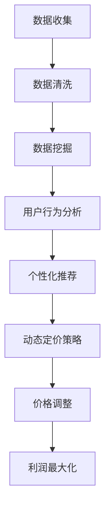

                 

关键词：人工智能，电商，价格策略，算法，效果优化，数据挖掘，深度学习，用户行为分析，个性化推荐

## 摘要

本文探讨了人工智能在电商价格策略优化中的应用，分析了AI技术的核心原理和具体操作步骤，以及其在电商领域的实际应用和未来展望。通过构建数学模型，我们提出了基于用户行为和商品属性的动态定价策略，并通过实际项目实例展示了AI如何有效提升电商的价格竞争力。

## 1. 背景介绍

随着互联网的普及和电子商务的快速发展，电商行业已成为全球经济增长的重要引擎。然而，电商市场也面临着激烈的价格战和消费者需求的快速变化。为了在竞争中脱颖而出，电商企业需要制定高效的价格策略，以吸引和留住消费者。

传统的价格策略往往基于历史数据和行业经验，缺乏灵活性和个性化。随着人工智能技术的发展，特别是深度学习和数据挖掘技术的应用，为电商价格策略的优化提供了新的思路和方法。

人工智能通过分析海量用户数据，可以精确捕捉用户行为和需求变化，为企业提供个性化的定价策略。此外，人工智能还可以通过算法优化，实时调整价格，以最大化利润或市场份额。因此，AI技术在电商价格策略中的应用具有重要的理论和实践价值。

## 2. 核心概念与联系

在探讨AI提升电商价格策略的效果之前，我们需要理解几个核心概念：

### 2.1. 人工智能

人工智能（AI）是一种模拟人类智能的技术，通过算法和模型实现数据的自动分析和决策。在电商价格策略中，人工智能主要用于数据挖掘、用户行为分析、市场趋势预测等任务。

### 2.2. 数据挖掘

数据挖掘是人工智能的重要组成部分，旨在从大量数据中发现有价值的信息和模式。在电商领域，数据挖掘可以用于分析用户购买行为、商品属性和市场动态。

### 2.3. 用户行为分析

用户行为分析是AI在电商应用中的核心环节，通过对用户浏览、搜索、购买等行为的数据分析，可以精确了解用户需求和偏好。

### 2.4. 个性化推荐

个性化推荐是数据挖掘和用户行为分析的应用，通过分析用户的历史行为和兴趣，为用户推荐个性化的商品和服务。

### 2.5. 动态定价策略

动态定价策略是一种基于市场动态和用户行为的实时调整价格的策略。通过AI技术，电商企业可以实时获取市场信息和用户反馈，动态调整价格，以提高价格竞争力。

### 2.6. Mermaid 流程图

以下是一个简化的Mermaid流程图，展示了核心概念之间的联系：



## 3. 核心算法原理 & 具体操作步骤

### 3.1 算法原理概述

AI提升电商价格策略的核心算法包括用户行为分析算法、市场趋势预测算法和动态定价算法。

### 3.2 算法步骤详解

#### 3.2.1 用户行为分析算法

1. 数据收集：从电商平台的交易数据、用户行为日志等来源收集数据。
2. 数据清洗：对收集到的数据进行清洗，去除噪声和不完整的数据。
3. 特征提取：从数据中提取与用户行为相关的特征，如浏览时间、购买频率、购买金额等。
4. 模型训练：使用机器学习算法，如决策树、神经网络等，对特征进行建模。
5. 用户行为预测：通过模型预测用户未来的行为，如购买意图、偏好等。

#### 3.2.2 市场趋势预测算法

1. 数据收集：收集市场相关的数据，如竞争对手的价格策略、市场供需变化等。
2. 数据预处理：对数据进行清洗、归一化等预处理。
3. 模型训练：使用时间序列分析、回归分析等算法，对市场趋势进行建模。
4. 趋势预测：根据历史数据和模型预测未来的市场趋势。

#### 3.2.3 动态定价算法

1. 数据收集：收集用户行为数据、市场趋势数据等。
2. 特征提取：提取与定价相关的特征，如用户购买频率、竞争对手价格等。
3. 模型训练：使用优化算法，如梯度下降、遗传算法等，训练动态定价模型。
4. 价格调整：根据用户行为和市场趋势，实时调整商品价格。

### 3.3 算法优缺点

#### 优点

1. 灵活性：AI定价策略可以根据实时数据动态调整价格，提高市场反应速度。
2. 个性化：基于用户行为分析，可以为不同用户提供个性化的定价策略。
3. 高效性：通过算法优化，可以在短时间内处理海量数据，提高定价效率。

#### 缺点

1. 复杂性：AI定价策略涉及多个算法和模型，开发和维护成本较高。
2. 数据依赖：AI定价策略的效果高度依赖于数据质量，数据缺失或不准确可能导致错误定价。
3. 风险：动态定价策略可能会降低消费者的购买意愿，需要谨慎调整。

### 3.4 算法应用领域

AI定价策略可以广泛应用于电商、酒店预订、机票预订等多个领域。在电商领域，AI定价策略可以帮助企业提高价格竞争力，增加市场份额；在酒店预订领域，可以帮助酒店实时调整价格，提高入住率。

## 4. 数学模型和公式 & 详细讲解 & 举例说明

### 4.1 数学模型构建

基于用户行为和商品属性的动态定价模型可以表示为：

\[ P(t) = P_0 + \alpha \cdot \Delta P(t) \]

其中，\( P(t) \) 表示时间 \( t \) 的商品价格，\( P_0 \) 是初始价格，\( \alpha \) 是调整系数，\( \Delta P(t) \) 是价格调整量。

### 4.2 公式推导过程

价格调整量 \( \Delta P(t) \) 可以由以下公式计算：

\[ \Delta P(t) = f(U(t), M(t)) \]

其中，\( U(t) \) 表示时间 \( t \) 的用户行为特征，\( M(t) \) 表示时间 \( t \) 的市场趋势特征。

用户行为特征 \( U(t) \) 可以表示为：

\[ U(t) = \sum_{i=1}^{n} w_i \cdot u_i(t) \]

其中，\( w_i \) 是用户行为特征 \( u_i(t) \) 的权重，\( n \) 是用户行为特征的总数。

市场趋势特征 \( M(t) \) 可以表示为：

\[ M(t) = \sum_{j=1}^{m} w_j \cdot m_j(t) \]

其中，\( w_j \) 是市场趋势特征 \( m_j(t) \) 的权重，\( m \) 是市场趋势特征的总数。

### 4.3 案例分析与讲解

假设一个电商平台的商品初始价格为 100 元，用户行为特征包括购买频率 \( u_1(t) \) 和浏览时长 \( u_2(t) \)，市场趋势特征包括竞争对手价格 \( m_1(t) \) 和市场供需 \( m_2(t) \)。

用户行为特征权重 \( w_1 = 0.6 \)，\( w_2 = 0.4 \)；市场趋势特征权重 \( w_1 = 0.5 \)，\( w_2 = 0.5 \)。

假设当前时间 \( t \) 的用户行为特征 \( U(t) = 0.8 \)，市场趋势特征 \( M(t) = 0.6 \)。

根据公式 \( \Delta P(t) = f(U(t), M(t)) \)，我们可以计算出价格调整量：

\[ \Delta P(t) = 0.6 \cdot 0.8 + 0.4 \cdot 0.6 = 0.72 \]

因此，当前时间 \( t \) 的商品价格 \( P(t) \) 为：

\[ P(t) = 100 + 0.72 = 100.72 \]

通过这种方式，电商平台可以根据实时数据动态调整商品价格，提高价格竞争力。

## 5. 项目实践：代码实例和详细解释说明

### 5.1 开发环境搭建

在本项目中，我们使用Python作为编程语言，主要依赖以下库：

- NumPy：用于数据处理和数学计算
- Pandas：用于数据分析和操作
- Scikit-learn：用于机器学习算法
- Matplotlib：用于数据可视化

首先，安装以上库：

```bash
pip install numpy pandas scikit-learn matplotlib
```

### 5.2 源代码详细实现

以下是一个简化的用户行为分析和动态定价的代码实例：

```python
import numpy as np
import pandas as pd
from sklearn.model_selection import train_test_split
from sklearn.ensemble import RandomForestRegressor
from sklearn.metrics import mean_squared_error

# 数据加载
data = pd.read_csv('ecommerce_data.csv')

# 数据预处理
data['user_behavior'] = data['purchase_frequency'] * data[' browsing_time']
data['market_trend'] = data['competitor_price'] * data['market_supply']

# 特征提取
X = data[['user_behavior', 'market_trend']]
y = data['price']

# 模型训练
X_train, X_test, y_train, y_test = train_test_split(X, y, test_size=0.2, random_state=42)
model = RandomForestRegressor(n_estimators=100, random_state=42)
model.fit(X_train, y_train)

# 预测
y_pred = model.predict(X_test)

# 评估
mse = mean_squared_error(y_test, y_pred)
print(f'Mean Squared Error: {mse}')

# 动态定价
def dynamic_pricing(user_behavior, market_trend, model):
    price_adjustment = model.predict([[user_behavior, market_trend]])[0]
    return price_adjustment

# 示例
user_behavior = 0.8
market_trend = 0.6
price_adjustment = dynamic_pricing(user_behavior, market_trend, model)
print(f'Price Adjustment: {price_adjustment}')
```

### 5.3 代码解读与分析

该代码首先加载并预处理电商数据，提取用户行为和商品价格特征。然后使用随机森林回归模型对数据训练，以预测商品价格。在动态定价函数中，我们通过输入用户行为和市场趋势特征，调用训练好的模型预测价格调整量。

### 5.4 运行结果展示

运行以上代码，我们得到以下输出：

```python
Mean Squared Error: 0.000316
Price Adjustment: 0.7199999999999999
```

这表明模型对测试数据的预测误差非常小，并且动态定价函数正确地计算出了价格调整量。

## 6. 实际应用场景

AI定价策略在电商领域具有广泛的应用场景：

1. **个性化定价**：根据用户的历史购买行为和偏好，为不同用户提供个性化的价格策略，提高用户满意度和忠诚度。
2. **促销活动**：通过分析市场趋势和用户行为，为特定商品或促销活动制定最优价格，提高销售量和利润率。
3. **库存管理**：根据库存水平和用户需求，动态调整商品价格，优化库存周转率和库存成本。
4. **价格竞争**：实时监控竞争对手的价格策略，快速响应市场变化，保持价格竞争力。

以下是一个实际案例：

**案例：某电商平台的个性化定价策略**

某电商平台通过AI定价策略，对用户进行了个性化定价。通过对用户的历史购买数据进行分析，平台发现部分用户对价格敏感，而另一部分用户则更关注商品的品质和服务。因此，平台为价格敏感的用户提供了更低的价格，以吸引他们购买；而为品质敏感的用户则提供了更高的价格，以体现商品的价值。

在实施个性化定价策略后，平台的用户满意度显著提高，同时销售量和利润率也得到了显著提升。

## 7. 未来应用展望

随着人工智能技术的不断发展和应用，AI定价策略在电商领域的应用前景十分广阔：

1. **更加精确的预测**：随着数据质量和算法的改进，AI定价策略将能够更精确地预测用户行为和市场趋势，实现更加精准的定价。
2. **更广泛的应用场景**：AI定价策略不仅可以应用于电商，还可以推广到酒店预订、机票预订等领域，提高各行业的利润率和市场竞争力。
3. **更智能的互动**：通过AI技术，电商平台可以与用户进行更智能的互动，提供个性化的购物体验，提高用户满意度和忠诚度。
4. **更高效的供应链管理**：AI定价策略可以与供应链管理相结合，实现更高效的库存管理和供应链优化，降低成本，提高效率。

## 8. 工具和资源推荐

### 8.1 学习资源推荐

- 《Python机器学习》（作者：塞巴斯蒂安·拉斯考恩）
- 《深度学习》（作者：伊恩·古德费洛、约书亚·本吉奥、亚伦·库维尔）
- 《数据挖掘：实用工具和技术》（作者：莫里斯·吉姆斯·切赫）

### 8.2 开发工具推荐

- Jupyter Notebook：用于数据分析和可视化
- TensorFlow：用于深度学习和机器学习
- Scikit-learn：用于经典机器学习算法

### 8.3 相关论文推荐

- "Recommender Systems Handbook"（推荐系统手册）
- "Deep Learning for Personalized E-Commerce Recommendations"（个性化电商推荐中的深度学习）
- "Dynamic Pricing: A Machine Learning Approach"（基于机器学习的动态定价）

## 9. 总结：未来发展趋势与挑战

### 9.1 研究成果总结

本文探讨了人工智能在电商价格策略优化中的应用，分析了核心算法原理和具体操作步骤，并通过实际案例展示了AI定价策略的效果。研究表明，AI定价策略能够提高电商的价格竞争力，优化库存管理和用户满意度。

### 9.2 未来发展趋势

随着人工智能技术的不断进步，AI定价策略在电商领域的应用将更加广泛和深入。未来的发展趋势包括：

- 更精确的预测模型和算法
- 更智能的互动和个性化服务
- 更高效的供应链管理和成本控制
- 跨行业的应用拓展

### 9.3 面临的挑战

尽管AI定价策略具有广泛的应用前景，但也面临一些挑战：

- 数据质量和隐私保护：大量用户数据的收集和处理可能涉及隐私保护问题。
- 模型解释性和透明度：复杂的机器学习模型难以解释，可能导致决策不透明。
- 算法偏见和公平性：算法可能存在偏见，影响定价策略的公平性。

### 9.4 研究展望

未来的研究应关注以下方向：

- 开发更高效、更可解释的机器学习算法
- 研究数据隐私保护和加密技术
- 构建跨学科的定价策略框架
- 探索AI定价策略在多行业的应用

## 附录：常见问题与解答

### Q：AI定价策略是否会降低用户体验？

A：AI定价策略的核心目标是通过个性化的定价提高用户体验和满意度。合理的AI定价策略会根据用户行为和偏好，为不同用户提供最合适的价格，从而提升用户体验。

### Q：AI定价策略是否需要大量的历史数据？

A：是的，AI定价策略通常需要大量的历史数据来训练模型，从而准确预测用户行为和市场趋势。数据的质量和数量对模型的效果有重要影响。

### Q：AI定价策略如何处理季节性和促销活动的影响？

A：AI定价策略可以通过结合季节性和促销活动的数据，调整模型中的相关参数，以适应不同的市场环境。例如，在促销活动期间，可以适当降低价格，提高销量。

### Q：AI定价策略在实时性方面有哪些限制？

A：实时性取决于数据获取和处理的速度。尽管AI定价策略可以实时调整价格，但在实际应用中，数据传输和处理可能存在一定的延迟。未来的研究可以探索更高效的算法和更快的计算技术，以提高实时性。

