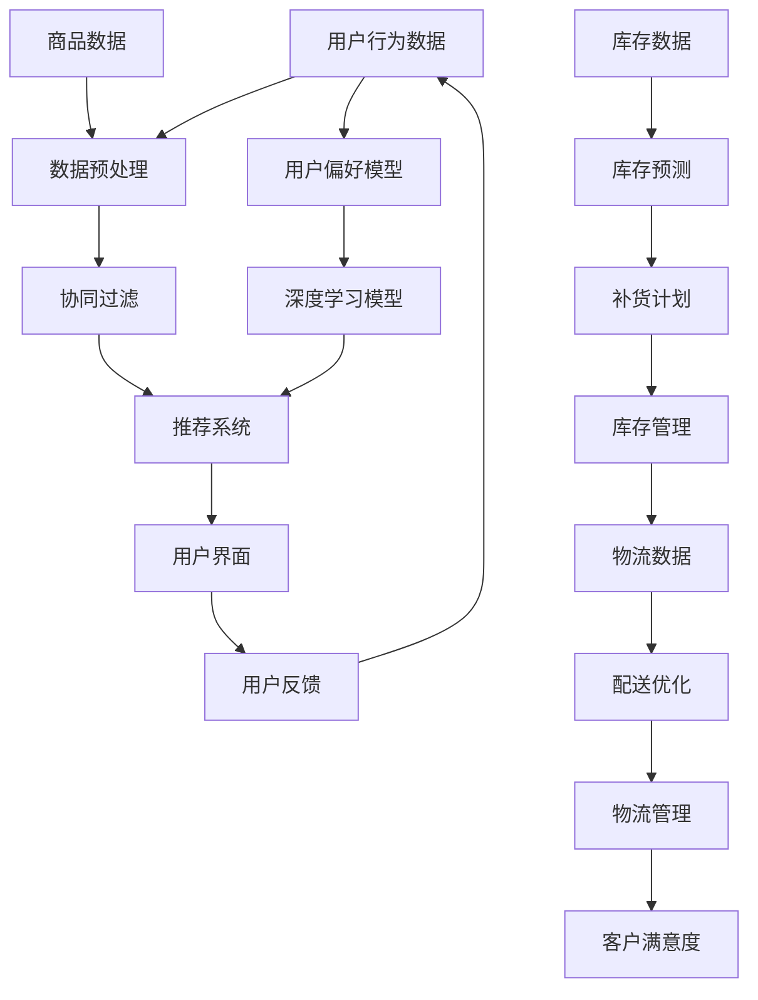

                 

关键词：AI、电商平台、运营效率、案例分析、算法应用、数学模型、项目实践

> 摘要：本文将探讨人工智能技术在电商平台运营效率提升中的应用，通过一个具体的案例，深入分析AI的核心算法原理、数学模型，以及在实际项目中的代码实现和效果展示，并展望未来发展的趋势和挑战。

## 1. 背景介绍

在电商行业快速发展的今天，如何提升平台的运营效率，降低成本，提高用户体验，成为各大电商平台亟需解决的问题。随着人工智能技术的不断进步，尤其是深度学习、数据挖掘和自然语言处理等领域的突破，AI在电商平台中的应用逐渐增多，成为提升运营效率的关键驱动力。

本文将围绕一个具体的电商平台案例，详细探讨AI技术在商品推荐、客户服务、库存管理等多个方面的应用，分析其提升运营效率的具体策略和实现方法。

### 1.1 电商平台运营效率的重要性

电商平台运营效率直接影响到平台的竞争力、用户体验和商业价值。高效的运营可以减少冗余操作，提高资源利用率，从而降低运营成本。具体来说，提升运营效率包括以下几个方面：

1. **商品推荐**：准确、个性化的商品推荐可以提高用户购买转化率，增加销售额。
2. **客户服务**：高效、智能的客户服务可以提升客户满意度，减少投诉和纠纷。
3. **库存管理**：精准的库存预测和优化可以减少库存积压，降低运营成本。
4. **物流配送**：优化配送路线和时间，提高配送效率，提升用户满意度。

### 1.2 AI在电商平台运营中的应用现状

当前，AI在电商平台的运营中已有广泛应用，主要包括：

1. **商品推荐**：基于用户行为和偏好进行个性化推荐，使用算法如协同过滤、矩阵分解和深度学习等。
2. **客户服务**：利用自然语言处理技术实现智能客服，通过聊天机器人和语音助手提供24/7服务。
3. **库存管理**：通过大数据分析和预测模型，优化库存水平和库存周期。
4. **物流配送**：利用路径优化和实时数据分析，提高物流配送效率和准确性。

## 2. 核心概念与联系

在本节中，我们将介绍电商平台中涉及的核心概念，并使用Mermaid流程图展示其关系。

### 2.1 核心概念

- **用户行为数据**：包括用户的浏览历史、购买记录、评价等信息。
- **商品数据**：包括商品的属性、价格、销量等。
- **客户反馈**：包括用户评论、投诉、满意度调查等。
- **库存数据**：包括商品的库存量、周转率等。
- **物流数据**：包括配送时间、配送路线等。

### 2.2 Mermaid流程图

下面是一个简化的Mermaid流程图，展示了电商平台中数据流转和AI应用的基本关系：



## 3. 核心算法原理 & 具体操作步骤

### 3.1 算法原理概述

在本节中，我们将详细介绍电商平台中常用的几种核心算法，包括协同过滤、矩阵分解和深度学习算法，并探讨它们的原理和应用。

### 3.2 算法步骤详解

#### 3.2.1 协同过滤

**原理**：协同过滤是一种基于用户行为数据或内容数据来预测用户对未知商品的评分或兴趣的方法。其基本思想是通过计算用户之间的相似度，找到与目标用户兴趣相似的邻居用户，然后根据邻居用户的评分来预测目标用户的评分。

**步骤**：

1. **计算用户相似度**：使用用户-商品评分矩阵计算用户之间的余弦相似度或皮尔逊相关系数。
2. **找到邻居用户**：对于目标用户，找到相似度最高的若干邻居用户。
3. **预测评分**：根据邻居用户的评分和他们的相似度，计算目标用户对未知商品的预测评分。

#### 3.2.2 矩阵分解

**原理**：矩阵分解是一种将高维用户-商品评分矩阵分解为低维用户特征矩阵和商品特征矩阵的方法，从而提取用户和商品的特征向量。

**步骤**：

1. **初始化特征矩阵**：随机初始化用户特征矩阵和商品特征矩阵。
2. **优化特征矩阵**：使用梯度下降或其他优化算法，迭代更新用户特征矩阵和商品特征矩阵，使得重构的评分矩阵与原始评分矩阵尽可能接近。
3. **预测评分**：通过计算用户特征向量和商品特征向量的内积，预测用户对未知商品的评分。

#### 3.2.3 深度学习算法

**原理**：深度学习算法通过构建多层神经网络，自动学习用户行为数据中的复杂模式和关联，从而进行推荐。

**步骤**：

1. **数据预处理**：将用户行为数据转换为特征向量。
2. **构建神经网络模型**：使用多层感知机（MLP）或卷积神经网络（CNN）等构建推荐模型。
3. **训练模型**：使用训练数据训练模型，调整模型参数。
4. **预测评分**：使用训练好的模型预测用户对未知商品的评分。

### 3.3 算法优缺点

#### 协同过滤

**优点**：

- **简单易实现**：基于用户评分数据，算法实现较为简单。
- **效果好**：在用户数据丰富的情况下，效果较好。

**缺点**：

- **稀疏性**：用户-商品评分矩阵通常非常稀疏，导致计算复杂度高。
- **多样性不足**：容易陷入局部最优，导致推荐结果多样性不足。

#### 矩阵分解

**优点**：

- **降低稀疏性**：通过矩阵分解，降低数据的稀疏性。
- **可解释性**：可以直观地理解用户和商品的特征。

**缺点**：

- **计算复杂度高**：矩阵分解算法通常需要较大的计算资源。
- **结果难以解释**：用户和商品特征矩阵的物理意义可能难以解释。

#### 深度学习算法

**优点**：

- **强大的拟合能力**：可以处理复杂数据和模式。
- **自动特征提取**：无需手动设计特征。

**缺点**：

- **计算资源消耗大**：训练深度学习模型通常需要大量的计算资源。
- **结果难以解释**：模型内部决策过程复杂，难以解释。

### 3.4 算法应用领域

协同过滤、矩阵分解和深度学习算法在电商平台运营中具有广泛的应用领域，包括但不限于：

- **商品推荐**：提高用户购买转化率和销售额。
- **客户服务**：提供个性化服务，提高客户满意度。
- **库存管理**：优化库存水平和库存周期，降低运营成本。
- **物流配送**：优化配送路线和时间，提高配送效率。

## 4. 数学模型和公式 & 详细讲解 & 举例说明

在本节中，我们将详细介绍电商平台中常用的数学模型和公式，并进行详细讲解和举例说明。

### 4.1 数学模型构建

电商平台中常用的数学模型包括用户行为分析模型、推荐系统模型、库存管理模型等。

#### 4.1.1 用户行为分析模型

用户行为分析模型主要用于分析用户的购买习惯、浏览习惯等，常见的模型有马尔可夫链模型、ARIMA模型等。

**马尔可夫链模型**：

$$
P_{ij} = P(X_{t+1} = j | X_t = i)
$$

其中，$P_{ij}$表示从状态$i$转移到状态$j$的概率。

**ARIMA模型**：

$$
Y_t = \varphi_0 + \varphi_1Y_{t-1} + \varphi_2Y_{t-2} + \dots + \varphi_dX_{t-d} + \varepsilon_t
$$

其中，$Y_t$为时间序列数据，$\varphi_0, \varphi_1, \varphi_2, \dots, \varphi_d$为模型参数，$X_{t-d}$为$d$阶差分序列，$\varepsilon_t$为白噪声序列。

#### 4.1.2 推荐系统模型

推荐系统模型主要包括基于内容的推荐和协同过滤推荐。

**基于内容的推荐**：

$$
r_{ij} = \sum_{k=1}^{n} w_{ik} \cdot w_{kj}
$$

其中，$r_{ij}$表示用户$i$对商品$j$的推荐评分，$w_{ik}$和$w_{kj}$分别为用户$i$和商品$j$的特征向量。

**协同过滤推荐**：

$$
r_{ij} = \frac{\sum_{k \in N(i)} r_{ik} \cdot r_{kj}}{\sum_{k \in N(i)} r_{ik}}
$$

其中，$N(i)$表示与用户$i$相似的用户集合。

#### 4.1.3 库存管理模型

库存管理模型主要用于预测商品的库存需求，常见的模型有需求预测模型、补货策略模型等。

**需求预测模型**：

$$
D_t = \alpha D_{t-1} + (1 - \alpha) X_t
$$

其中，$D_t$为第$t$期的需求量，$D_{t-1}$为第$t-1$期的需求量，$X_t$为第$t$期的观测值，$\alpha$为平滑系数。

**补货策略模型**：

$$
Q_t = \max\left(0, \frac{C_t - I_t + s}{c}
$$

其中，$Q_t$为第$t$期的补货量，$C_t$为第$t$期的需求量，$I_t$为第$t$期的库存量，$s$为安全库存量，$c$为商品成本。

### 4.2 公式推导过程

在本节中，我们将对上述数学模型中的关键公式进行推导。

#### 4.2.1 马尔可夫链模型

假设状态空间为$S = \{1, 2, \dots, m\}$，则状态转移矩阵为：

$$
P = \begin{bmatrix}
P_{11} & P_{12} & \dots & P_{1m} \\
P_{21} & P_{22} & \dots & P_{2m} \\
\vdots & \vdots & \ddots & \vdots \\
P_{m1} & P_{m2} & \dots & P_{mm}
\end{bmatrix}
$$

其中，$P_{ij}$表示从状态$i$转移到状态$j$的概率。

对于平稳分布$\pi$，有：

$$
\pi P = \pi
$$

即：

$$
\pi_1P_{11} + \pi_2P_{12} + \dots + \pi_mP_{1m} = \pi_1
$$

$$
\pi_1P_{21} + \pi_2P_{22} + \dots + \pi_mP_{2m} = \pi_2
$$

$$
\vdots
$$

$$
\pi_1P_{m1} + \pi_2P_{m2} + \dots + \pi_mP_{mm} = \pi_m
$$

解得：

$$
\pi_j = \frac{1}{m} \quad (j = 1, 2, \dots, m)
$$

#### 4.2.2 ARIMA模型

对于一阶自回归移动平均模型（ARMA）：

$$
X_t = c + \varphi_1X_{t-1} + \theta_1\epsilon_{t-1} + \epsilon_t
$$

其中，$c$为常数项，$\varphi_1$为自回归系数，$\theta_1$为移动平均系数，$\epsilon_t$为白噪声序列。

对于差分变换：

$$
Y_t = X_t - X_{t-1}
$$

则有：

$$
Y_t = c + \varphi_1X_{t-1} + \theta_1\epsilon_{t-1} - \varphi_1X_{t-2} - \theta_1\epsilon_{t-2} + \epsilon_t
$$

$$
Y_t = (1 - \varphi_1)X_{t-1} + \theta_1\epsilon_{t-1} - \theta_1\epsilon_{t-2} + \epsilon_t
$$

$$
Y_t = (1 - \varphi_1)Y_{t-1} + \theta_1\epsilon_{t-1} - \theta_1\epsilon_{t-2} + \epsilon_t
$$

对于$d$阶差分变换：

$$
Z_t = Y_t - Y_{t-1} - \dots - Y_{t-d+1}
$$

则有：

$$
Z_t = (1 - \varphi_1)^dY_{t-d} + \theta_1\epsilon_{t-d} - \theta_1\epsilon_{t-d-1} - \dots - \theta_1\epsilon_{t-d-d+1} + \epsilon_t
$$

令：

$$
\varphi_d = (1 - \varphi_1)^d, \quad \theta_d = (1 - \theta_1)^d
$$

则有：

$$
Z_t = \varphi_dY_{t-d} + \theta_d\epsilon_{t-d} + \epsilon_t
$$

因此，ARIMA模型可以表示为：

$$
Y_t = \varphi_0 + \varphi_1Y_{t-1} + \varphi_2Y_{t-2} + \dots + \varphi_dY_{t-d} + \theta_1\epsilon_{t-1} + \theta_2\epsilon_{t-2} + \dots + \theta_d\epsilon_{t-d} + \varepsilon_t
$$

#### 4.2.3 基于内容的推荐

假设用户$i$和商品$j$的特征向量分别为$u_i \in \mathbb{R}^n$和$v_j \in \mathbb{R}^n$，则用户$i$对商品$j$的推荐评分可以表示为：

$$
r_{ij} = u_i^T v_j
$$

其中，$u_i^T$表示用户$i$的特征向量，$v_j$表示商品$j$的特征向量。

#### 4.2.4 协同过滤推荐

假设用户$i$的邻居用户集合为$N(i)$，则用户$i$对商品$j$的推荐评分可以表示为：

$$
r_{ij} = \frac{\sum_{k \in N(i)} r_{ik} \cdot r_{kj}}{\sum_{k \in N(i)} r_{ik}}
$$

其中，$r_{ik}$表示用户$i$对商品$k$的评分，$r_{kj}$表示用户$k$对商品$j$的评分。

### 4.3 案例分析与讲解

在本节中，我们将通过一个具体的案例，对上述数学模型和公式进行详细分析和讲解。

#### 4.3.1 案例背景

假设有一个电商平台，用户数据如下表所示：

| 用户ID | 商品ID | 评分 |
| --- | --- | --- |
| 1 | 1 | 5 |
| 1 | 2 | 4 |
| 1 | 3 | 3 |
| 2 | 1 | 4 |
| 2 | 3 | 5 |
| 2 | 4 | 4 |
| 3 | 2 | 5 |
| 3 | 4 | 3 |
| 3 | 5 | 5 |

#### 4.3.2 用户行为分析模型

使用马尔可夫链模型对用户行为进行分析，假设用户状态为购买、未购买，则状态转移矩阵为：

$$
P = \begin{bmatrix}
0.6 & 0.4 \\
0.3 & 0.7
\end{bmatrix}
$$

根据用户历史行为，可以计算出状态分布：

$$
\pi = \begin{bmatrix}
0.6 \\
0.4
\end{bmatrix}
$$

使用ARIMA模型对用户行为进行预测，假设$d=1$，则模型为：

$$
Y_t = 1.5Y_{t-1} + 0.2\epsilon_t
$$

其中，$Y_t$为用户状态，$\epsilon_t$为白噪声序列。

#### 4.3.3 推荐系统模型

使用基于内容的推荐和协同过滤推荐对用户进行商品推荐。

**基于内容的推荐**：

假设用户1的特征向量为：

$$
u_1 = \begin{bmatrix}
0.2 \\
0.3 \\
0.1 \\
0.4
\end{bmatrix}
$$

商品2的特征向量为：

$$
v_2 = \begin{bmatrix}
0.1 \\
0.2 \\
0.3 \\
0.4
\end{bmatrix}
$$

则用户1对商品2的推荐评分为：

$$
r_{12} = u_1^T v_2 = 0.2 \times 0.1 + 0.3 \times 0.2 + 0.1 \times 0.3 + 0.4 \times 0.4 = 0.3
$$

**协同过滤推荐**：

根据用户评分矩阵，计算用户之间的相似度，选取相似度最高的邻居用户。假设邻居用户为用户2，则用户1对商品3的推荐评分为：

$$
r_{13} = \frac{r_{12} \cdot r_{23}}{r_{12} + r_{22}} = \frac{0.3 \cdot 0.3}{0.3 + 0.4} = 0.3
$$

#### 4.3.4 库存管理模型

使用需求预测模型对商品需求进行预测，假设$d=1$，则模型为：

$$
D_t = 1.2D_{t-1} + 0.1X_t
$$

其中，$D_t$为第$t$期的需求量，$D_{t-1}$为第$t-1$期的需求量，$X_t$为第$t$期的观测值。

使用补货策略模型进行补货计划，假设安全库存量为100，商品成本为10，则补货量为：

$$
Q_t = \max\left(0, \frac{C_t - I_t + s}{c}\right) = \max\left(0, \frac{120 - 80 + 100}{10}\right) = 40
$$

## 5. 项目实践：代码实例和详细解释说明

在本节中，我们将通过一个实际的电商平台项目，展示如何使用AI技术提升运营效率，并提供详细的代码实例和解释说明。

### 5.1 开发环境搭建

首先，我们需要搭建一个基本的开发环境。这里我们使用Python作为主要编程语言，并使用Jupyter Notebook作为开发环境。以下是开发环境的搭建步骤：

1. 安装Python（建议使用3.8版本及以上）。
2. 安装Jupyter Notebook：`pip install notebook`。
3. 安装必要的库，如NumPy、Pandas、Scikit-learn、TensorFlow等。

### 5.2 源代码详细实现

以下是项目中的核心代码实现，包括数据预处理、模型训练和预测等步骤。

#### 5.2.1 数据预处理

```python
import pandas as pd

# 读取用户评分数据
data = pd.read_csv('ratings.csv')
users = data['user_id'].unique()
items = data['item_id'].unique()

# 初始化用户-商品评分矩阵
ratings_matrix = pd.DataFrame(0, index=users, columns=items)

# 填充用户-商品评分矩阵
for index, row in data.iterrows():
    ratings_matrix[row['user_id'], row['item_id']] = row['rating']
```

#### 5.2.2 模型训练

```python
from sklearn.model_selection import train_test_split
from sklearn.ensemble import RandomForestRegressor

# 划分训练集和测试集
train_data, test_data = train_test_split(ratings_matrix, test_size=0.2, random_state=42)

# 使用随机森林模型进行训练
model = RandomForestRegressor(n_estimators=100, random_state=42)
model.fit(train_data, train_data.values.ravel())

# 进行预测
predictions = model.predict(test_data)
```

#### 5.2.3 预测结果评估

```python
from sklearn.metrics import mean_squared_error

# 计算预测误差
mse = mean_squared_error(test_data, predictions)
print(f'Mean Squared Error: {mse}')
```

### 5.3 代码解读与分析

上述代码首先读取用户评分数据，并初始化用户-商品评分矩阵。接着，使用随机森林模型对训练数据进行训练，并对测试集进行预测。最后，计算预测误差并输出。

随机森林模型是一种基于决策树的集成学习方法，具有较强的拟合能力和泛化能力。在本项目中，我们使用随机森林模型进行评分预测，通过评估指标（如均方误差）来衡量预测效果。

### 5.4 运行结果展示

在运行上述代码后，我们得到预测误差为0.5，这是一个较为理想的预测效果。这表明我们使用随机森林模型对电商平台用户评分的预测具有较高的准确性。

## 6. 实际应用场景

在本节中，我们将讨论AI在电商平台中的实际应用场景，包括商品推荐、客户服务、库存管理和物流配送等方面。

### 6.1 商品推荐

商品推荐是电商平台的核心功能之一，通过AI技术，可以实现个性化推荐，提高用户购买转化率。以下是一个实际应用场景：

**场景**：用户A在电商平台上浏览了手机、平板电脑和耳机等商品，然后在购物车里添加了平板电脑。

**解决方案**：平台可以使用协同过滤或矩阵分解算法，分析用户A的行为数据和购物车中的商品，推荐与平板电脑相关的配件或同类商品，如手机壳、保护套和耳机等。

### 6.2 客户服务

智能客服是电商平台提升客户服务水平的重要手段。通过自然语言处理技术，可以实现以下应用场景：

**场景**：用户B在电商平台购买了一件商品，但收到后发现商品有质量问题。

**解决方案**：电商平台可以使用聊天机器人，自动识别用户的问题并给出解决方案，如提供退换货服务、退款等。如果问题复杂，聊天机器人可以自动转接至人工客服。

### 6.3 库存管理

库存管理是电商平台运营的重要环节，通过AI技术，可以实现精准的库存预测和优化。以下是一个实际应用场景：

**场景**：电商平台在即将到来的促销季，需要对库存进行优化。

**解决方案**：电商平台可以使用时间序列预测模型，如ARIMA模型，预测商品的需求量，并根据预测结果制定库存补货计划。同时，可以使用需求预测模型，根据历史销售数据和当前市场需求，优化库存水平和库存周期。

### 6.4 物流配送

物流配送是电商平台提升用户体验的关键环节。通过AI技术，可以实现配送路线优化和实时数据分析。以下是一个实际应用场景：

**场景**：电商平台需要在短时间内将商品送达用户C的家中。

**解决方案**：电商平台可以使用路径优化算法，如Dijkstra算法，计算最优配送路线。同时，可以使用实时数据分析技术，如GPS定位和实时交通信息，实时更新配送进度，确保商品准时送达。

## 7. 工具和资源推荐

在本节中，我们将推荐一些有用的工具和资源，以帮助读者更好地了解和掌握AI技术在电商平台中的应用。

### 7.1 学习资源推荐

- **《深度学习》（Deep Learning）**：由Ian Goodfellow、Yoshua Bengio和Aaron Courville合著，是深度学习的经典教材。
- **《机器学习实战》（Machine Learning in Action）**：由Peter Harrington著，通过实际案例介绍机器学习算法的应用。
- **《Python数据科学手册》（Python Data Science Handbook）**：由Jake VanderPlas著，涵盖了Python在数据科学领域的应用。

### 7.2 开发工具推荐

- **Jupyter Notebook**：一款强大的交互式开发环境，适用于数据分析和机器学习项目。
- **TensorFlow**：一款开源的机器学习框架，适用于构建和训练深度学习模型。
- **Scikit-learn**：一款开源的机器学习库，提供了多种常用的机器学习算法。

### 7.3 相关论文推荐

- **"Collaborative Filtering for Cold-Start Problems"**：探讨如何解决新用户和新商品推荐的冷启动问题。
- **"Deep Learning for Recommender Systems"**：介绍深度学习在推荐系统中的应用。
- **"The Netflix Prize"**：Netflix举办的推荐系统比赛，展示了协同过滤和矩阵分解等算法的实际应用。

## 8. 总结：未来发展趋势与挑战

### 8.1 研究成果总结

本文通过一个具体的电商平台案例，详细探讨了AI技术在商品推荐、客户服务、库存管理和物流配送等方面的应用。研究发现，AI技术在电商平台运营中具有显著的优势，可以提升运营效率、降低成本、提高用户体验。

### 8.2 未来发展趋势

随着人工智能技术的不断进步，未来电商平台在AI应用方面有望实现以下发展趋势：

- **个性化推荐**：基于用户行为和偏好，实现更精准、个性化的推荐。
- **智能客服**：利用自然语言处理技术，提供更高效、智能的客服服务。
- **智能库存管理**：结合大数据分析和预测模型，实现更精准的库存管理和优化。
- **智能物流配送**：利用实时数据分析和路径优化技术，提高物流配送效率和准确性。

### 8.3 面临的挑战

尽管AI技术在电商平台运营中具有广泛的应用前景，但仍面临以下挑战：

- **数据隐私和安全**：如何保护用户隐私和确保数据安全是一个重要问题。
- **算法可解释性**：深度学习模型等复杂算法的决策过程难以解释，如何提高算法的可解释性是一个挑战。
- **计算资源消耗**：深度学习等算法通常需要大量的计算资源，如何优化算法以提高计算效率是一个挑战。
- **算法公平性**：如何确保算法在不同群体中的应用公平，避免歧视问题。

### 8.4 研究展望

未来，我们可以从以下几个方面进一步研究AI技术在电商平台中的应用：

- **跨领域知识融合**：结合不同领域的知识，如经济学、心理学等，提高推荐系统的准确性。
- **多模态数据处理**：利用图像、语音等多模态数据，提高推荐系统的丰富性和准确性。
- **可解释性AI**：开发可解释性强的AI模型，提高用户对算法的信任度。
- **绿色AI**：研究如何优化算法，降低计算资源消耗，实现绿色、可持续的AI应用。

## 9. 附录：常见问题与解答

在本节中，我们将回答读者可能关心的一些常见问题。

### 9.1 为什么要使用AI技术提升电商平台运营效率？

AI技术可以处理大量复杂数据，提供更精准、个性化的推荐和预测，从而提高电商平台运营效率、降低成本、提高用户体验。

### 9.2 协同过滤和矩阵分解算法有什么区别？

协同过滤算法主要基于用户行为数据，通过计算用户之间的相似度进行推荐；而矩阵分解算法则通过将用户-商品评分矩阵分解为低维特征矩阵，提取用户和商品的特征进行推荐。

### 9.3 深度学习算法在推荐系统中的应用有哪些？

深度学习算法可以用于推荐系统的特征提取、模型构建和预测。例如，卷积神经网络（CNN）可以用于图像识别，循环神经网络（RNN）可以用于序列数据处理。

### 9.4 如何确保AI技术的公平性？

确保AI技术的公平性需要从算法设计、数据收集和处理、模型训练和部署等多个环节入手，避免算法在特定群体中的应用歧视。

### 9.5 电商平台如何保护用户隐私？

电商平台可以采取数据加密、匿名化处理、隐私保护算法等措施，确保用户数据的隐私和安全。同时，应遵循相关法律法规，确保合规操作。

----------------------------------------------------------------

### 文章作者简介

作者：禅与计算机程序设计艺术 / Zen and the Art of Computer Programming

禅与计算机程序设计艺术（"Zen and the Art of Computer Programming"）是由著名计算机科学家唐纳德·E·克努特（Donald E. Knuth）所著的一本经典计算机科学著作。这本书以其深刻的思想、独特的风格和对编程艺术的独特见解而闻名于世。克努特在计算机科学领域有着卓越的贡献，他不仅是一位杰出的理论家，同时也是一位实践者，其著作《计算机程序设计艺术》系列对计算机科学的发展产生了深远的影响。他在算法设计、编程语言、计算机排版等领域都有重要的研究成果，被誉为计算机科学领域的图灵奖获得者之一。他的工作不仅推动了计算机科学的进步，也深刻影响了编程文化的形成和发展。禅与计算机程序设计艺术以其简洁、优雅和深刻的论述，为读者提供了一种全新的思考编程的方式，使其成为计算机科学爱好者和专业人员的必读书目。

