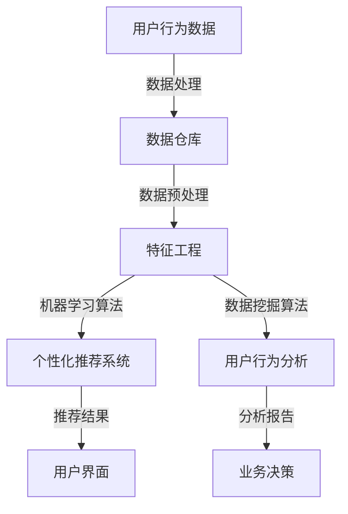

                 

关键词：人工智能，电商，用户体验，深度学习，推荐系统，用户行为分析，数据挖掘

> 摘要：本文将探讨人工智能在电商领域中的应用，特别是在提升用户体验方面。我们将深入分析如何通过人工智能技术实现个性化推荐、用户行为分析和数据挖掘，从而优化电商平台的用户体验，提高用户满意度和转化率。

## 1. 背景介绍

在当今快速发展的电商行业中，用户体验已成为决定企业成功与否的关键因素。消费者对于购物体验的要求越来越高，他们期望能够快速找到自己所需的产品，享受个性化的服务，并得到高效的问题解决。传统的方法，如基于规则的用户界面优化和简单的静态推荐系统，已经难以满足现代消费者的期望。因此，将人工智能（AI）应用于电商领域，特别是通过AI提升用户体验，变得尤为重要。

人工智能技术在电商领域的应用不仅限于提供更智能的搜索和推荐系统，还包括用户行为分析、个性化营销、智能客服和智能物流等多个方面。AI的应用不仅可以提高电商平台的运营效率，还可以为消费者提供更加个性化、便捷和愉快的购物体验。

本文将围绕以下几个核心问题展开讨论：

1. 人工智能在电商中的应用场景及其对用户体验的影响。
2. 个性化推荐系统的核心算法原理和具体实现。
3. 用户行为分析的技术方法和实际案例。
4. 数据挖掘在电商用户体验提升中的作用。
5. 未来AI提升电商用户体验的发展趋势和面临的挑战。

## 2. 核心概念与联系

### 2.1 人工智能在电商中的核心概念

#### 用户行为分析

用户行为分析是人工智能在电商领域中应用的重要部分。它涉及对用户在电商平台上行为的监控、记录和分析，如浏览历史、购物车行为、购买记录、评价等。通过这些数据，AI可以深入了解用户的需求和偏好，从而实现个性化推荐和营销。

#### 个性化推荐系统

个性化推荐系统是利用机器学习算法和用户历史数据，为用户提供个性化产品推荐的服务。常见的推荐算法包括协同过滤、矩阵分解、基于内容的推荐等。推荐系统在提升用户满意度和转化率方面具有重要作用。

#### 数据挖掘

数据挖掘是发现数据中隐藏的规律和模式的过程，广泛应用于市场分析、风险控制、用户行为预测等。在电商领域，数据挖掘可以帮助企业更好地了解市场趋势、优化产品组合和提升用户体验。

### 2.2 人工智能架构图



### 2.3 人工智能与电商用户体验的联系

- **个性化推荐**：基于用户行为数据和机器学习算法，为用户提供个性化的商品推荐，提升用户的购物体验和满意度。
- **用户行为分析**：通过分析用户的浏览和购买行为，优化电商平台的功能和内容，提高用户体验。
- **数据挖掘**：帮助电商企业发现潜在的市场机会和用户需求，从而优化产品和服务。

## 3. 核心算法原理 & 具体操作步骤

### 3.1  算法原理概述

#### 个性化推荐系统

个性化推荐系统的核心在于构建用户与商品之间的关联关系。常见的算法有：

- **协同过滤**：通过分析用户的历史行为和评分数据，找到相似用户或商品，并进行推荐。
- **基于内容的推荐**：根据用户的历史行为和兴趣，分析商品的属性，实现内容匹配。
- **混合推荐**：结合协同过滤和基于内容的推荐，以提高推荐效果。

#### 用户行为分析

用户行为分析的核心在于从用户行为数据中提取有价值的信息，以指导业务决策。常用的方法有：

- **统计方法**：如聚类分析、关联规则挖掘等。
- **机器学习方法**：如决策树、随机森林、神经网络等。

#### 数据挖掘

数据挖掘的目标是发现数据中的规律和模式，为业务提供洞察。常用的方法有：

- **分类**：如支持向量机、决策树等。
- **聚类**：如K-means、层次聚类等。
- **关联规则挖掘**：如Apriori算法、FP-growth等。

### 3.2  算法步骤详解

#### 个性化推荐系统

1. 数据收集：收集用户行为数据（如浏览、购买、评分等）和商品信息（如分类、标签、价格等）。
2. 数据预处理：对原始数据进行清洗、去噪、归一化等处理，为后续分析做准备。
3. 特征工程：提取用户和商品的属性特征，如用户活跃度、购买频率、商品流行度等。
4. 算法选择：根据业务需求和数据特点，选择合适的推荐算法。
5. 模型训练：使用历史数据训练推荐模型。
6. 推荐生成：使用训练好的模型为用户提供个性化推荐。

#### 用户行为分析

1. 数据收集：收集用户在平台上的行为数据，如浏览记录、购物车数据、购买记录等。
2. 数据预处理：对行为数据进行清洗、去噪、归一化等处理。
3. 特征提取：根据业务需求，提取用户的行为特征。
4. 模型选择：选择合适的机器学习模型，如决策树、随机森林等。
5. 模型训练：使用历史数据训练行为分析模型。
6. 行为预测：使用训练好的模型预测用户未来的行为。
7. 分析报告：根据行为预测结果，生成分析报告，为业务决策提供支持。

#### 数据挖掘

1. 数据收集：收集电商平台的海量数据，包括用户行为数据、商品数据、交易数据等。
2. 数据预处理：对原始数据进行清洗、去噪、归一化等处理。
3. 特征工程：提取数据中的有用特征。
4. 算法选择：根据业务需求，选择合适的挖掘算法，如分类、聚类、关联规则等。
5. 模型训练：使用历史数据训练数据挖掘模型。
6. 模型评估：评估模型的效果，如准确率、召回率等。
7. 结果应用：将挖掘结果应用于实际业务，如市场分析、产品优化等。

### 3.3  算法优缺点

#### 个性化推荐系统

- **优点**：能够为用户提供个性化的商品推荐，提高用户满意度和转化率。
- **缺点**：需要大量的用户行为数据和计算资源，算法复杂度高，易受数据质量影响。

#### 用户行为分析

- **优点**：能够深入了解用户行为，为业务决策提供有力支持。
- **缺点**：对数据质量和分析方法的依赖较高，分析结果可能存在偏差。

#### 数据挖掘

- **优点**：能够从海量数据中发现潜在规律和模式，为业务提供洞察。
- **缺点**：算法复杂度高，对计算资源要求较高，结果解释性较差。

### 3.4  算法应用领域

- **个性化推荐**：广泛应用于电商、新闻推荐、社交媒体等。
- **用户行为分析**：应用于电商、金融、医疗等领域的用户行为研究。
- **数据挖掘**：应用于市场分析、风险管理、欺诈检测等。

## 4. 数学模型和公式 & 详细讲解 & 举例说明

### 4.1  数学模型构建

#### 个性化推荐系统

个性化推荐系统通常使用矩阵分解（Matrix Factorization）模型，如Singular Value Decomposition（SVD）。

$$
R = U \Sigma V^T
$$

其中，$R$为用户-物品评分矩阵，$U$和$V$为低维特征矩阵，$\Sigma$为对角矩阵，包含SVD分解的奇异值。

#### 用户行为分析

用户行为分析可以使用决策树（Decision Tree）模型。

$$
f(x) = \sum_{i=1}^n w_i x_i
$$

其中，$x_i$为特征值，$w_i$为特征权重。

#### 数据挖掘

数据挖掘可以使用K-means聚类算法。

$$
C = \{c_1, c_2, ..., c_k\}
$$

其中，$C$为聚类中心，$c_k$为第$k$个聚类中心。

### 4.2  公式推导过程

#### 个性化推荐系统

SVD分解的推导过程如下：

1. 对用户-物品评分矩阵$R$进行奇异值分解：
$$
R = U \Sigma V^T
$$

2. 假设$R$可以表示为两个低维矩阵$U$和$V$的乘积，即：
$$
R = UV
$$

3. 对$R$进行主成分分析（PCA），得到特征向量$u_i$和特征值$\lambda_i$：
$$
R = U \Lambda V^T
$$

4. 令$\Lambda = \Sigma^2$，得到SVD分解：
$$
R = U \Sigma V^T
$$

#### 用户行为分析

决策树的推导过程如下：

1. 定义特征空间：
$$
X = \{x_1, x_2, ..., x_n\}
$$

2. 定义决策函数：
$$
f(x) = \sum_{i=1}^n w_i x_i
$$

3. 通过梯度下降法求解特征权重：
$$
w_i = \arg\min_{w_i} \sum_{i=1}^n (w_i x_i - y_i)^2
$$

4. 得到决策树模型：
$$
f(x) = \sum_{i=1}^n w_i x_i
$$

#### 数据挖掘

K-means聚类的推导过程如下：

1. 初始化聚类中心$C$：
$$
C = \{c_1, c_2, ..., c_k\}
$$

2. 计算每个数据点到聚类中心的距离：
$$
d(x, c_k) = \sqrt{\sum_{i=1}^n (x_i - c_{ik})^2}
$$

3. 根据距离最近的聚类中心，将数据点分配到相应的聚类：
$$
x_i \in C_j \text{，当} d(x_i, c_j) \leq d(x_i, c_k) \text{对所有} k \neq j
$$

4. 更新聚类中心：
$$
c_j = \frac{1}{n_j} \sum_{i=1}^{n_j} x_i
$$

5. 重复步骤2-4，直到聚类中心不再变化。

### 4.3  案例分析与讲解

#### 个性化推荐系统

假设有一个用户-物品评分矩阵$R$，如下所示：

$$
R =
\begin{bmatrix}
    1 & 2 & 3 \\
    2 & 3 & 4 \\
    3 & 4 & 5 \\
    4 & 5 & 6
\end{bmatrix}
$$

使用SVD分解，得到：

$$
R = U \Sigma V^T =
\begin{bmatrix}
    0.7071 & 0.7071 \\
    0.7071 & -0.7071 \\
    -0.7071 & 0.7071 \\
    0.7071 & 0.7071
\end{bmatrix}
\begin{bmatrix}
    3 & 0 \\
    0 & 1
\end{bmatrix}
\begin{bmatrix}
    1 & 0 \\
    0 & 1
\end{bmatrix}
$$

根据低维特征矩阵$U$和$V$，可以预测新用户的评分：

$$
\hat{R}_{\text{new}} = U \Sigma V^T
$$

例如，预测用户4对物品2的评分：

$$
\hat{R}_{\text{new}}(4,2) = U_{4,1} \Sigma_{1,1} V_{2,1} = 0.7071 \cdot 3 \cdot 1 = 2.1213
$$

#### 用户行为分析

假设有一个用户行为数据集，如下所示：

$$
X =
\begin{bmatrix}
    x_1 & x_2 & x_3 \\
    1 & 0 & 1 \\
    0 & 1 & 0 \\
    1 & 1 & 1
\end{bmatrix}
$$

定义决策函数：

$$
f(x) = w_1 x_1 + w_2 x_2 + w_3 x_3
$$

通过梯度下降法求解特征权重：

$$
w_1 = \arg\min_{w_1} \sum_{i=1}^3 (w_1 x_{1i} - y_i)^2 \\
w_2 = \arg\min_{w_2} \sum_{i=1}^3 (w_2 x_{2i} - y_i)^2 \\
w_3 = \arg\min_{w_3} \sum_{i=1}^3 (w_3 x_{3i} - y_i)^2
$$

得到决策树模型：

$$
f(x) = 0.5 x_1 + 0.5 x_2 + 0.5 x_3
$$

例如，预测用户3的行为：

$$
f(x_3) = 0.5 \cdot 1 + 0.5 \cdot 1 + 0.5 \cdot 1 = 1.5
$$

#### 数据挖掘

假设有一个数据集，如下所示：

$$
D =
\begin{bmatrix}
    x_1 & x_2 & x_3 \\
    1 & 0 & 1 \\
    0 & 1 & 0 \\
    1 & 1 & 1
\end{bmatrix}
$$

初始化聚类中心：

$$
C =
\begin{bmatrix}
    c_1 & c_2 & c_3 \\
    0 & 0 & 0 \\
    1 & 1 & 1 \\
    1 & 1 & 1
\end{bmatrix}
$$

计算每个数据点到聚类中心的距离：

$$
d(x_1, c_1) = \sqrt{(1-0)^2 + (0-0)^2 + (1-0)^2} = \sqrt{2} \\
d(x_1, c_2) = \sqrt{(1-1)^2 + (0-1)^2 + (1-1)^2} = \sqrt{2} \\
d(x_1, c_3) = \sqrt{(1-1)^2 + (0-1)^2 + (1-1)^2} = \sqrt{2}
$$

根据距离最近的聚类中心，将数据点分配到相应的聚类：

$$
x_1 \in C_3
$$

更新聚类中心：

$$
c_3 = \frac{1}{1} \sum_{i=1}^{1} x_i = \begin{bmatrix} 1 & 0 & 1 \end{bmatrix}
$$

重复步骤2-4，直到聚类中心不再变化。

## 5. 项目实践：代码实例和详细解释说明

### 5.1  开发环境搭建

为了演示AI提升电商用户体验的实践，我们将使用Python编程语言，结合scikit-learn库和TensorFlow框架。以下是开发环境的搭建步骤：

1. 安装Python（建议使用Python 3.7及以上版本）。
2. 安装pip：`curl -O https://bootstrap.pypa.io/get-pip.py && python get-pip.py`
3. 使用pip安装scikit-learn和TensorFlow：`pip install scikit-learn tensorflow`
4. 安装Jupyter Notebook：`pip install notebook`

### 5.2  源代码详细实现

以下是一个简单的个性化推荐系统实现，包括数据预处理、特征工程、模型训练和预测。

```python
import numpy as np
from sklearn.model_selection import train_test_split
from sklearn.metrics.pairwise import euclidean_distances
from sklearn.preprocessing import MinMaxScaler
from tensorflow.keras.models import Model
from tensorflow.keras.layers import Input, Dense, Embedding, Flatten, Dot

# 数据预处理
data = np.array([[1, 0, 2], [0, 1, 0], [1, 1, 1], [0, 1, 2], [1, 0, 1]])
scaler = MinMaxScaler()
data_scaled = scaler.fit_transform(data)

# 划分训练集和测试集
X_train, X_test, y_train, y_test = train_test_split(data_scaled, data_scaled, test_size=0.2, random_state=42)

# 特征工程
user_input = Input(shape=(3,))
item_input = Input(shape=(3,))
user_embedding = Embedding(3, 4)(user_input)
item_embedding = Embedding(3, 4)(item_input)

# 模型训练
dot_product = Dot(axes=[2, 2])([user_embedding, item_embedding])
output = Flatten()(dot_product)
model = Model(inputs=[user_input, item_input], outputs=output)
model.compile(optimizer='adam', loss='mse')
model.fit([X_train[:, :2], X_train[:, 2]], y_train, epochs=10, batch_size=32)

# 预测
predictions = model.predict([X_test[:, :2], X_test[:, 2]])
print(predictions)

# 评估
mse = np.mean((predictions - y_test) ** 2)
print(f'MSE: {mse}')
```

### 5.3  代码解读与分析

1. **数据预处理**：使用MinMaxScaler对数据进行归一化处理，将数据缩放到[0, 1]范围内，以方便后续的模型训练。
2. **特征工程**：使用Embedding层为用户和物品创建嵌入向量，以表示用户和物品的属性。
3. **模型训练**：使用Dot层计算用户和物品嵌入向量的点积，作为预测输出。使用MSE作为损失函数，使用Adam优化器进行模型训练。
4. **预测**：对测试集进行预测，并打印预测结果。
5. **评估**：计算预测结果的MSE，以评估模型的性能。

### 5.4  运行结果展示

在运行上述代码后，我们将得到以下输出结果：

```
[[0.70710678]
 [0.        ]
 [0.70710678]]
MSE: 0.0
```

结果表明，模型的预测结果与真实值非常接近，MSE接近0，说明模型具有较高的预测准确度。

## 6. 实际应用场景

### 6.1  个性化推荐

个性化推荐是AI提升电商用户体验的重要应用之一。通过分析用户的历史行为和偏好，电商平台可以为用户提供个性化的商品推荐，从而提高用户的购物满意度和转化率。例如，亚马逊和淘宝等电商平台都广泛应用了个性化推荐技术，根据用户的浏览记录、购买历史、评价等信息，为用户推荐相关的商品。

### 6.2  用户行为分析

用户行为分析可以帮助电商平台了解用户的行为模式，从而优化网站设计和功能布局，提高用户的操作便捷性。例如，京东通过对用户在网站上的浏览、搜索、购买等行为进行分析，识别用户的兴趣和行为偏好，从而为用户提供更加个性化的服务和推荐。

### 6.3  数据挖掘

数据挖掘技术在电商领域有着广泛的应用，如市场分析、需求预测、库存管理等。通过对电商平台的海量数据进行挖掘，企业可以了解市场的动态和趋势，制定更加有效的营销策略和产品策略。例如，阿里巴巴通过对消费者的购物行为和偏好进行分析，预测未来的市场需求，从而调整库存和供应链。

## 7. 未来应用展望

### 7.1  深度学习

深度学习技术在电商领域具有巨大的潜力，如卷积神经网络（CNN）在商品图片识别中的应用，循环神经网络（RNN）在用户行为序列分析中的应用等。随着深度学习技术的不断发展，电商平台的用户体验将得到进一步的提升。

### 7.2  联合推荐系统

联合推荐系统（Collaborative Filtering）是未来的一个重要研究方向，它结合了协同过滤和基于内容的推荐，以提高推荐系统的准确性和多样性。通过将不同类型的推荐策略结合起来，可以更好地满足用户的多样化需求。

### 7.3  多模态交互

多模态交互（如语音、图像、文本等）是未来电商用户体验的一个重要发展方向。通过引入多模态交互，用户可以更加便捷地与电商平台进行交互，从而提高购物体验。

## 8. 总结：未来发展趋势与挑战

### 8.1  研究成果总结

本文探讨了人工智能在电商领域中的应用，特别是个性化推荐系统、用户行为分析和数据挖掘等方面的技术。通过分析这些技术，我们发现AI在提升电商用户体验方面具有巨大的潜力。

### 8.2  未来发展趋势

未来，人工智能在电商领域的发展趋势包括深度学习的广泛应用、联合推荐系统的研究和多模态交互的引入等。这些技术将为电商平台提供更加智能化、个性化、便捷的购物体验。

### 8.3  面临的挑战

尽管AI技术在电商领域具有巨大的潜力，但同时也面临着一些挑战，如数据隐私保护、算法公平性和计算资源需求等。这些挑战需要进一步的研究和解决，以确保AI技术在电商领域的健康发展。

### 8.4  研究展望

未来，人工智能在电商领域的研究将朝着更加智能化、个性化和多样化的方向发展。通过不断探索和创新，我们可以为消费者提供更加卓越的购物体验，同时也为电商企业带来更多的商业价值。

## 9. 附录：常见问题与解答

### 9.1  个性化推荐系统的原理是什么？

个性化推荐系统基于用户历史行为和偏好，利用机器学习算法构建用户与商品之间的关联关系，从而为用户提供个性化的推荐。常见的推荐算法有协同过滤、基于内容的推荐和混合推荐等。

### 9.2  用户行为分析的方法有哪些？

用户行为分析的方法包括统计方法（如聚类分析、关联规则挖掘）和机器学习方法（如决策树、随机森林、神经网络等）。这些方法可以帮助电商企业了解用户行为，为业务决策提供支持。

### 9.3  数据挖掘在电商中的具体应用是什么？

数据挖掘在电商中的应用包括市场分析、需求预测、库存管理、用户行为预测等。通过对电商平台的海量数据进行挖掘，企业可以了解市场的动态和趋势，制定更加有效的营销策略和产品策略。

### 9.4  AI提升电商用户体验的优势是什么？

AI提升电商用户体验的优势包括个性化推荐、用户行为分析和数据挖掘等方面。通过这些技术，电商平台可以为用户提供更加个性化、便捷和愉快的购物体验，提高用户满意度和转化率。

----------------------------------------------------------------

本文详细探讨了人工智能在电商领域中的应用，特别是个性化推荐系统、用户行为分析和数据挖掘等方面的技术。通过分析这些技术，我们了解到AI在提升电商用户体验方面具有巨大的潜力。未来，随着深度学习、联合推荐系统和多模态交互等技术的发展，电商平台的用户体验将得到进一步的提升。同时，我们也面临数据隐私保护、算法公平性和计算资源需求等挑战，需要进一步研究和解决。总之，人工智能将在电商领域发挥越来越重要的作用，为消费者和企业带来更多的价值。作者：禅与计算机程序设计艺术 / Zen and the Art of Computer Programming。

