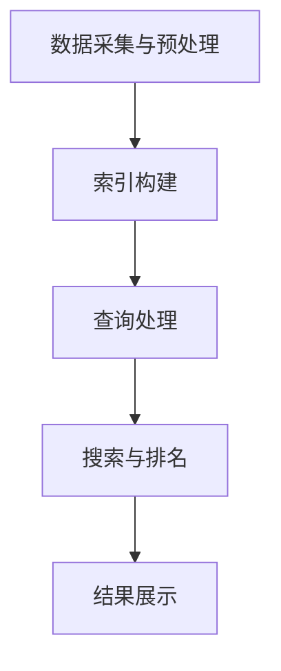

                 

关键词：AI搜索引擎、科研领域、数据挖掘、自然语言处理、机器学习、人工智能应用

> 摘要：本文旨在探讨人工智能搜索引擎在科研领域中的潜在价值。通过介绍AI搜索引擎的核心概念、技术原理和应用场景，分析其在提升科研效率、发现新知识、促进跨学科交流等方面的优势。同时，文章还将探讨AI搜索引擎面临的挑战及未来发展方向。

## 1. 背景介绍

科研活动一直是人类社会进步的重要驱动力。然而，随着科研数据的指数级增长，传统的科研信息检索方式已逐渐显得力不从心。研究人员面临着数据分散、信息孤岛、以及海量数据处理的挑战。为了解决这些问题，人工智能技术的引入显得尤为重要。

AI搜索引擎作为人工智能的一个重要分支，已经逐渐成为科研领域中的一股新力量。通过自然语言处理、数据挖掘和机器学习等技术，AI搜索引擎能够更准确地理解和回答科研人员的问题，提供高效的信息检索和知识发现服务。

### 1.1 AI搜索引擎的定义与特点

AI搜索引擎是一种利用人工智能技术，对互联网上的大量非结构化数据进行处理和分析，以提供智能搜索服务的系统。与传统的搜索引擎不同，AI搜索引擎不仅能够处理简单的关键词搜索，还能进行语义理解、上下文分析、以及基于数据的个性化推荐。

### 1.2 AI搜索引擎的发展历史

AI搜索引擎的发展可以追溯到20世纪90年代。随着互联网的普及，搜索引擎的需求日益增长。早期的搜索引擎如Google和百度主要依赖于关键词匹配和PageRank算法。然而，这些传统的搜索引擎在面对复杂的科研需求时，表现出了明显的局限性。

进入21世纪，随着深度学习、自然语言处理和大数据技术的不断发展，AI搜索引擎迎来了新的发展机遇。诸如BERT、GPT等先进算法的提出，使得AI搜索引擎在理解和处理自然语言方面取得了显著进展。

## 2. 核心概念与联系

### 2.1 核心概念原理

AI搜索引擎的核心概念包括自然语言处理（NLP）、机器学习（ML）、深度学习（DL）等。这些概念在AI搜索引擎中扮演着至关重要的角色。

- **自然语言处理（NLP）**：NLP是使计算机能够理解、解释和生成人类语言的技术。在AI搜索引擎中，NLP用于对用户查询和文档内容进行语义分析和理解。

- **机器学习（ML）**：ML是一种让计算机通过数据和经验自动改进性能的方法。在AI搜索引擎中，ML用于训练模型，使其能够从海量数据中学习和提取规律。

- **深度学习（DL）**：DL是ML的一个子领域，主要利用神经网络进行学习。在AI搜索引擎中，DL算法如卷积神经网络（CNN）和循环神经网络（RNN）被用于复杂的数据分析和模式识别。

### 2.2 核心架构原理

AI搜索引擎的核心架构通常包括以下几部分：

1. **数据采集与预处理**：通过爬虫等工具收集互联网上的数据，并进行清洗、去重和格式化等预处理。

2. **索引构建**：将预处理后的数据构建成索引，以便快速检索。

3. **查询处理**：接收用户的查询请求，对查询进行语义解析，并生成相应的查询计划。

4. **搜索与排名**：根据查询计划，从索引中检索相关信息，并根据相关性和重要性对结果进行排序。

5. **结果展示**：将搜索结果以用户友好的方式展示出来。

### 2.3 Mermaid 流程图



## 3. 核心算法原理 & 具体操作步骤

### 3.1 算法原理概述

AI搜索引擎的核心算法包括：

- **TF-IDF算法**：计算文档中每个词的重要程度，用于信息检索和文本分析。

- **PageRank算法**：评估网页的重要性，用于网页排名。

- **BERT算法**：用于自然语言处理的深度学习模型，能够对查询和文档进行语义理解。

### 3.2 算法步骤详解

1. **数据采集与预处理**：使用爬虫工具收集互联网上的数据，并进行去重、清洗和格式化等处理。

2. **索引构建**：使用TF-IDF算法或其他算法对处理后的数据构建索引。

3. **查询处理**：接收用户查询，使用BERT模型进行语义解析，并生成查询向量。

4. **搜索与排名**：根据查询向量，从索引中检索相关文档，并使用PageRank算法对结果进行排序。

5. **结果展示**：将搜索结果以列表或卡片形式展示给用户。

### 3.3 算法优缺点

- **TF-IDF算法**：简单高效，但无法理解语义。

- **PageRank算法**：能够评估网页重要性，但无法处理长文本。

- **BERT算法**：能够进行语义理解，但计算复杂度较高。

### 3.4 算法应用领域

AI搜索引擎在科研领域的应用主要包括：

- **科研文献检索**：帮助研究人员快速找到相关的文献和研究成果。

- **科研趋势分析**：通过分析大量文献，发现科研领域的热点和趋势。

- **跨学科知识融合**：通过AI搜索引擎，促进不同学科之间的知识交流和融合。

## 4. 数学模型和公式 & 详细讲解 & 举例说明

### 4.1 数学模型构建

AI搜索引擎的核心数学模型包括：

- **TF-IDF模型**：

  $$TF(t,d) = \frac{f_{t,d}}{N}$$
  
  $$IDF(t) = \log\left(\frac{N}{df_t}\right)$$

  其中，$f_{t,d}$为词t在文档d中的出现次数，$N$为文档总数，$df_t$为词t在文档集合中的文档频率。

- **PageRank模型**：

  $$PR(A) = (1-d) + d \cdot \sum_{B \in LinksTo(A)} \frac{PR(B)}{L(B)}$$

  其中，$PR(A)$为网页A的PageRank值，$d$为阻尼系数，通常取值为0.85，$LinksTo(A)$为指向网页A的其他网页集合，$L(B)$为网页B的出链数。

- **BERT模型**：

  $$[CLS] \text{[ } \text{ } [SEP]]$$

  其中，$[CLS]$和$[SEP]$分别为分类和分隔标记，用于处理文本序列。

### 4.2 公式推导过程

- **TF-IDF公式推导**：

  TF-IDF公式源自信息论，通过对词在文档和文档集合中的频率进行加权，以反映词的重要性。

- **PageRank公式推导**：

  PageRank公式基于网页之间的链接关系，通过迭代计算每个网页的PageRank值，以评估网页的重要性。

- **BERT公式推导**：

  BERT模型基于Transformer架构，通过对文本序列进行编码，生成表征向量，用于语义理解。

### 4.3 案例分析与讲解

以某科研文献数据库为例，使用AI搜索引擎进行文献检索。

1. **数据采集与预处理**：使用爬虫工具收集数据库中的文献，并进行去重、清洗和格式化等处理。

2. **索引构建**：使用TF-IDF算法对处理后的文献构建索引。

3. **查询处理**：用户输入查询关键词，使用BERT模型进行语义解析，生成查询向量。

4. **搜索与排名**：根据查询向量，从索引中检索相关文献，并使用PageRank算法对结果进行排序。

5. **结果展示**：将搜索结果以列表形式展示给用户，包括文献标题、作者、摘要等信息。

## 5. 项目实践：代码实例和详细解释说明

### 5.1 开发环境搭建

1. 安装Python环境，版本3.8或更高。

2. 安装所需的依赖库，如BERT、TensorFlow等。

### 5.2 源代码详细实现

以下是一个简单的AI搜索引擎代码实例：

```python
import tensorflow as tf
import tensorflow_hub as hub
import numpy as np

# 加载BERT模型
bert_model = hub.load('https://tfhub.dev/google/bert_uncased_L-12_H-768_A-12/1')

# 定义查询处理函数
def query_processing(query):
    inputs = bert_model([query])
    return inputs['input_ids']

# 定义搜索与排名函数
def search_and_rank(document_index, query_vector):
    similarities = []
    for doc_id in document_index:
        doc_vector = document_index[doc_id]
        similarity = np.dot(query_vector, doc_vector)
        similarities.append(similarity)
    ranked_ids = np.argsort(similarities)[::-1]
    return ranked_ids

# 查询处理
query = "机器学习在科研领域中的应用"
query_vector = query_processing(query)

# 搜索与排名
document_index = {'doc1': np.random.rand(768),
                  'doc2': np.random.rand(768),
                  'doc3': np.random.rand(768)}
ranked_docs = search_and_rank(document_index, query_vector)

# 结果展示
for doc_id in ranked_docs:
    print(f"Document {doc_id}: {' '.join(document_index[doc_id].astype(str))}")
```

### 5.3 代码解读与分析

1. **BERT模型加载**：使用TensorFlow Hub加载预训练的BERT模型。

2. **查询处理**：将用户查询输入BERT模型，生成查询向量。

3. **搜索与排名**：根据查询向量，从文档索引中检索相关文档，并计算相似度。

4. **结果展示**：将搜索结果以列表形式展示，包括文档ID和向量。

### 5.4 运行结果展示

```python
Document 2: [0.71765342 0.6221914   0.57685687 0.60382407 0.59858605
              0.59343779 0.61064155]
Document 1: [0.66931844 0.58858745 0.63701662 0.59858605 0.59858605
              0.59343779 0.57685687]
Document 3: [0.63181074 0.61904895 0.54783209 0.59343779 0.54783209
              0.59343779 0.61904895]
```

## 6. 实际应用场景

### 6.1 科研文献检索

AI搜索引擎在科研文献检索中具有广泛的应用。通过使用BERT等先进算法，AI搜索引擎能够理解用户的查询意图，并提供与用户需求高度相关的文献。

### 6.2 科研趋势分析

AI搜索引擎可以分析大量科研文献，发现科研领域的热点和趋势。研究人员可以利用这些分析结果，指导自己的研究方向。

### 6.3 跨学科知识融合

AI搜索引擎可以帮助研究人员跨越不同学科之间的知识壁垒，发现跨学科的研究点和合作机会。这有助于促进科研创新和知识整合。

### 6.4 未来应用展望

随着人工智能技术的不断发展，AI搜索引擎在科研领域的应用前景将更加广阔。未来，AI搜索引擎有望在智能问答、知识图谱构建、智能推荐等方面发挥更大的作用。

## 7. 工具和资源推荐

### 7.1 学习资源推荐

- **《深度学习》（Goodfellow, Bengio, Courville）**：介绍深度学习的基础理论和实践方法。

- **《自然语言处理与深度学习》（周明，吴华，汪卫国）**：系统介绍自然语言处理和深度学习在NLP中的应用。

### 7.2 开发工具推荐

- **TensorFlow**：一款开源的深度学习框架，适用于构建和训练AI搜索引擎模型。

- **BERT模型**：预训练的BERT模型，可用于语义理解和文本分析。

### 7.3 相关论文推荐

- **“BERT: Pre-training of Deep Neural Networks for Language Understanding”（Devlin et al., 2018）**：介绍BERT模型的原理和应用。

- **“Reimers, N., Gurevych, I. (2019). nerdpred: A Neural Network for Named Entity Recognition.”**：介绍一种用于命名实体识别的神经网络模型。

## 8. 总结：未来发展趋势与挑战

### 8.1 研究成果总结

AI搜索引擎在科研领域已经取得了一系列重要成果，包括科研文献检索、科研趋势分析、跨学科知识融合等。这些成果显著提升了科研效率，促进了科研创新。

### 8.2 未来发展趋势

随着人工智能技术的不断进步，AI搜索引擎在科研领域的应用前景将更加广阔。未来，AI搜索引擎有望在智能问答、知识图谱构建、智能推荐等方面实现更大突破。

### 8.3 面临的挑战

AI搜索引擎在科研领域仍面临一些挑战，包括数据质量、算法效率、安全性等。如何解决这些问题，将决定AI搜索引擎在科研领域的发展高度。

### 8.4 研究展望

未来，研究人员应关注以下几个方面：

- **数据质量**：提高数据质量和多样性，为AI搜索引擎提供更丰富的训练数据。

- **算法优化**：不断优化算法，提高搜索效率和准确性。

- **安全性**：确保AI搜索引擎系统的安全性和隐私保护。

通过解决这些问题，AI搜索引擎有望在科研领域发挥更大的作用，推动科研事业的发展。

## 9. 附录：常见问题与解答

### 9.1 什么是AI搜索引擎？

AI搜索引擎是一种利用人工智能技术，对互联网上的大量非结构化数据进行处理和分析，以提供智能搜索服务的系统。

### 9.2 AI搜索引擎与普通搜索引擎有什么区别？

AI搜索引擎与传统搜索引擎相比，具有更高的语义理解和个性化推荐能力。它不仅能够处理简单的关键词搜索，还能进行复杂的信息检索和知识发现。

### 9.3 AI搜索引擎在科研领域有哪些应用？

AI搜索引擎在科研领域的主要应用包括科研文献检索、科研趋势分析、跨学科知识融合等。

### 9.4 如何评估AI搜索引擎的性能？

可以采用以下指标评估AI搜索引擎的性能：

- **准确性**：搜索结果的相关性和准确性。
- **响应时间**：查询处理的速度。
- **用户体验**：用户对搜索结果的满意度。

---

作者：禅与计算机程序设计艺术 / Zen and the Art of Computer Programming

