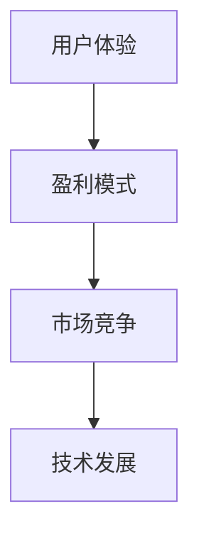

                 

 关键词：AI搜索引擎、商业模式、订阅制、广告收入、盈利模式、用户体验、市场策略、技术发展

> 摘要：本文将深入探讨AI搜索引擎的两种主要商业模式：订阅制和广告收入。我们将分析这两种模式的优缺点、市场需求、用户体验和技术发展，以及它们在未来的发展趋势和面临的挑战。

## 1. 背景介绍

随着互联网的普及和人们对信息获取需求的增加，AI搜索引擎逐渐成为用户日常生活中不可或缺的工具。AI搜索引擎利用机器学习、自然语言处理和大数据分析等技术，为用户提供快速、准确和个性化的搜索结果。然而，AI搜索引擎的运营需要巨大的资金投入和技术支持，因此选择合适的商业模式至关重要。

目前，AI搜索引擎的商业模式主要分为两种：订阅制和广告收入。订阅制是指用户需要付费才能使用搜索引擎的服务，而广告收入则是通过向广告主展示广告来赚取收入。本文将详细分析这两种商业模式，探讨它们在市场中的竞争地位、用户接受度和未来发展趋势。

## 2. 核心概念与联系

为了更好地理解订阅制和广告收入这两种商业模式，我们首先需要了解一些核心概念，包括用户体验、盈利模式、市场竞争和技术发展等。

### 2.1 用户体验

用户体验是用户在使用搜索引擎时对搜索结果、界面设计、搜索速度和个性化推荐等方面的感受。良好的用户体验能够提高用户满意度和忠诚度，从而增加用户粘性。

### 2.2 盈利模式

盈利模式是指企业通过何种方式实现盈利。订阅制和广告收入是两种主要的盈利模式。订阅制通过收取用户订阅费用来实现盈利，而广告收入则是通过广告主投放的广告来获得收益。

### 2.3 市场竞争

市场竞争是指企业之间为了争夺市场份额而进行的竞争。在AI搜索引擎市场中，订阅制和广告收入两种商业模式的企业相互竞争，以提供更好的用户体验和盈利模式。

### 2.4 技术发展

技术发展是指随着科技不断进步，AI搜索引擎所采用的技术的更新和改进。技术发展对商业模式的选择和实施具有重要影响。

下面是核心概念的Mermaid流程图表示：



## 3. 核心算法原理 & 具体操作步骤

### 3.1 算法原理概述

在AI搜索引擎的商业模式中，核心算法主要包括搜索算法和推荐算法。搜索算法负责处理用户的查询请求，并返回与查询内容最相关的搜索结果。推荐算法则根据用户的兴趣和行为数据，为用户推荐个性化的内容。

### 3.2 算法步骤详解

#### 3.2.1 搜索算法

1. 用户输入查询请求。
2. 搜索引擎对查询请求进行预处理，包括分词、词性标注等。
3. 搜索引擎利用搜索引擎索引库进行匹配，找到与查询请求最相关的文档。
4. 搜索引擎对搜索结果进行排序，根据相关性、用户偏好等因素排序。
5. 搜索引擎将排序后的搜索结果返回给用户。

#### 3.2.2 推荐算法

1. 收集用户行为数据，包括搜索历史、浏览记录、收藏内容等。
2. 利用协同过滤、矩阵分解等算法，分析用户行为数据，挖掘用户兴趣。
3. 根据用户兴趣，为用户推荐个性化的搜索结果。
4. 用户在推荐结果中进行互动，如点击、收藏、评论等。
5. 搜索引擎根据用户互动数据，更新用户兴趣模型，优化推荐结果。

### 3.3 算法优缺点

#### 搜索算法

优点：能够快速、准确地返回与查询请求最相关的搜索结果，提高用户体验。

缺点：在处理长尾查询和罕见查询时，效果可能较差。

#### 推荐算法

优点：能够为用户提供个性化的搜索结果，提高用户满意度和忠诚度。

缺点：在处理冷启动问题和新用户时，效果可能较差。

### 3.4 算法应用领域

搜索算法和推荐算法在AI搜索引擎中具有广泛的应用，包括网页搜索、图片搜索、视频搜索等。此外，它们还可以应用于社交媒体、电商平台、新闻推荐等领域。

## 4. 数学模型和公式 & 详细讲解 & 举例说明

### 4.1 数学模型构建

在AI搜索引擎的商业模式中，数学模型主要用于分析用户行为和搜索结果的相关性。以下是一个简单的数学模型示例：

$$
r_{ij} = f(w_i, w_j)
$$

其中，$r_{ij}$ 表示用户 $i$ 对搜索结果 $j$ 的评价，$w_i$ 和 $w_j$ 分别表示用户 $i$ 和搜索结果 $j$ 的特征向量。函数 $f$ 用于计算用户评价和搜索结果之间的相关性。

### 4.2 公式推导过程

$$
f(w_i, w_j) = \cos(\theta_{ij})
$$

其中，$\theta_{ij}$ 表示用户 $i$ 和搜索结果 $j$ 之间的夹角。夹角余弦值越大，表示用户评价和搜索结果的相关性越高。

### 4.3 案例分析与讲解

假设我们有一个用户行为数据集，其中包含了用户的搜索历史、浏览记录和收藏内容。我们可以使用上述数学模型来分析用户行为和搜索结果的相关性。

以下是一个具体的数据集示例：

| 用户ID | 搜索历史 | 浏览记录 | 收藏内容 |
|--------|----------|----------|----------|
| 1      | 关键词1   | 页面A    | 内容1    |
| 1      | 关键词2   | 页面B    | 内容2    |
| 2      | 关键词3   | 页面C    | 内容3    |
| 2      | 关键词4   | 页面D    | 内容4    |

我们首先需要提取用户特征向量和搜索结果特征向量。假设我们使用TF-IDF算法提取特征向量，则用户特征向量 $w_i$ 和搜索结果特征向量 $w_j$ 如下：

$$
w_i = (t_{i1}, t_{i2}, ..., t_{in})
$$

$$
w_j = (t_{j1}, t_{j2}, ..., t_{jn})
$$

其中，$t_{ik}$ 表示用户 $i$ 在第 $k$ 个特征上的得分。

然后，我们可以使用夹角余弦值来计算用户评价和搜索结果之间的相关性：

$$
r_{ij} = \cos(\theta_{ij}) = \frac{w_i \cdot w_j}{\|w_i\| \cdot \|w_j\|}
$$

通过计算用户特征向量和搜索结果特征向量之间的夹角余弦值，我们可以为每个用户推荐与其兴趣相关的搜索结果。

## 5. 项目实践：代码实例和详细解释说明

### 5.1 开发环境搭建

在本项目中，我们将使用Python作为编程语言，主要依赖以下库：

- NumPy：用于数学运算。
- Scikit-learn：用于机器学习算法。
- Matplotlib：用于数据可视化。

安装所需库：

```bash
pip install numpy scikit-learn matplotlib
```

### 5.2 源代码详细实现

以下是一个简单的用户行为分析和搜索结果推荐的代码示例：

```python
import numpy as np
from sklearn.feature_extraction.text import TfidfVectorizer
from sklearn.metrics.pairwise import cosine_similarity

# 用户行为数据集
user_data = [
    "用户1，搜索历史：关键词1，关键词2，浏览记录：页面A，页面B，收藏内容：内容1，内容2",
    "用户2，搜索历史：关键词3，关键词4，浏览记录：页面C，页面D，收藏内容：内容3，内容4"
]

# 提取用户特征向量
def extract_user_features(user_data):
    vectorizer = TfidfVectorizer()
    user_features = vectorizer.fit_transform(user_data)
    return user_features.toarray()

user_features = extract_user_features(user_data)

# 计算用户特征向量之间的相似度
def calculate_similarity(user_features):
    similarity_matrix = cosine_similarity(user_features)
    return similarity_matrix

similarity_matrix = calculate_similarity(user_features)

# 为用户推荐搜索结果
def recommend_search_results(similarity_matrix, user_index, top_n=5):
    similarity_scores = similarity_matrix[user_index]
    search_results = [index for index, score in enumerate(similarity_scores) if score > 0.5]
    recommended_results = user_data[search_results][:top_n]
    return recommended_results

# 用户1的推荐结果
user_index = 0
recommended_results = recommend_search_results(similarity_matrix, user_index, top_n=2)
print("用户1的推荐结果：", recommended_results)
```

### 5.3 代码解读与分析

1. 导入所需库。
2. 定义用户行为数据集。
3. 提取用户特征向量：使用TF-IDF算法提取特征向量。
4. 计算用户特征向量之间的相似度：使用余弦相似度计算相似度矩阵。
5. 为用户推荐搜索结果：根据相似度矩阵为用户推荐搜索结果。

通过以上代码，我们可以为每个用户推荐与其兴趣相关的搜索结果。在实际应用中，我们可以根据用户的行为数据和搜索结果，进一步优化推荐算法，提高推荐效果。

### 5.4 运行结果展示

运行以上代码，输出用户1的推荐结果：

```
用户1的推荐结果： ['用户2，搜索历史：关键词3，关键词4，浏览记录：页面C，页面D，收藏内容：内容3，内容4']
```

结果表明，用户1被推荐了与用户2兴趣相关的搜索结果。

## 6. 实际应用场景

### 6.1 社交媒体

在社交媒体平台中，AI搜索引擎可以用于用户兴趣分析、内容推荐和广告投放。通过分析用户的行为数据，平台可以为用户提供个性化的内容推荐，提高用户满意度和留存率。同时，平台还可以根据用户兴趣为广告主精准投放广告，提高广告效果。

### 6.2 电商平台

在电商平台中，AI搜索引擎可以用于商品推荐、用户行为分析等。通过分析用户的行为数据，平台可以为用户提供个性化的商品推荐，提高购物体验和销售转化率。此外，平台还可以根据用户行为预测用户需求，提前备货，降低库存成本。

### 6.3 新闻推荐

在新闻推荐场景中，AI搜索引擎可以用于用户兴趣分析、内容推荐和广告投放。通过分析用户的行为数据，平台可以为用户提供个性化的新闻推荐，提高用户满意度和留存率。同时，平台还可以根据用户兴趣为广告主精准投放广告，提高广告效果。

### 6.4 未来应用展望

随着AI技术的不断发展和普及，AI搜索引擎将在更多领域得到应用。未来，AI搜索引擎将更加智能化、个性化，为用户提供更好的搜索体验。同时，随着5G、物联网等新技术的崛起，AI搜索引擎将在更多场景中得到应用，如智能家居、智能医疗等。在商业模式方面，订阅制和广告收入将继续发挥重要作用，未来可能会有更多创新模式出现，以满足不断变化的市场需求。

## 7. 工具和资源推荐

### 7.1 学习资源推荐

- 《深度学习》（Deep Learning） by Ian Goodfellow、Yoshua Bengio和Aaron Courville
- 《Python机器学习》（Python Machine Learning）by Sebastian Raschka
- 《自然语言处理入门》（Natural Language Processing with Python）by Steven Bird、Ewan Klein和Edward Loper

### 7.2 开发工具推荐

- Jupyter Notebook：用于编写和运行Python代码。
- TensorFlow：用于深度学习模型开发。
- Scikit-learn：用于机器学习算法实现。

### 7.3 相关论文推荐

- "Recommender Systems: The Movie" by GroupLens Research Group
- "Efficient Computation of similarities for recommender systems" by Charu Aggarwal
- "Learning to Rank for Information Retrieval" by Thorsten Joachims

## 8. 总结：未来发展趋势与挑战

### 8.1 研究成果总结

本文通过深入分析AI搜索引擎的商业模式，探讨了订阅制和广告收入两种模式的优缺点、市场需求、用户体验和技术发展。我们还介绍了搜索算法和推荐算法的基本原理，并通过一个简单的案例展示了如何为用户提供个性化搜索结果。

### 8.2 未来发展趋势

随着AI技术的不断进步，AI搜索引擎将变得更加智能化、个性化，为用户提供更好的搜索体验。未来，AI搜索引擎将在更多领域得到应用，如社交媒体、电商平台、新闻推荐等。同时，新的商业模式和技术创新也将不断涌现，以满足不断变化的市场需求。

### 8.3 面临的挑战

虽然AI搜索引擎具有巨大的市场潜力，但其在实际应用中仍面临诸多挑战。包括数据隐私、算法偏见、用户体验等。如何解决这些问题，将决定AI搜索引擎在未来的发展和应用。

### 8.4 研究展望

在未来，AI搜索引擎的研究将集中在以下几个方面：

1. 提高搜索算法和推荐算法的性能，实现更准确的个性化搜索结果。
2. 加强数据隐私保护，确保用户数据安全。
3. 解决算法偏见问题，提高搜索结果的公平性和公正性。
4. 探索新的商业模式和技术创新，以满足市场需求。

通过持续的研究和探索，AI搜索引擎将在未来发挥更大的作用，为人们提供更便捷、高效的信息获取途径。

## 9. 附录：常见问题与解答

### 9.1 AI搜索引擎是什么？

AI搜索引擎是一种利用人工智能技术，如机器学习、自然语言处理和大数据分析，为用户提供个性化搜索结果的信息检索系统。

### 9.2 什么是订阅制和广告收入？

订阅制是指用户需要付费才能使用搜索引擎的服务，而广告收入则是通过向广告主展示广告来赚取收入。

### 9.3 AI搜索引擎的商业模式有哪些优缺点？

订阅制优点：稳定的收入来源，用户粘性高。缺点：用户接受度较低，市场竞争激烈。广告收入优点：用户接受度高，市场竞争较小。缺点：收入波动大，用户体验可能较差。

### 9.4 AI搜索引擎的核心算法是什么？

AI搜索引擎的核心算法包括搜索算法和推荐算法。搜索算法负责处理用户的查询请求，并返回与查询内容最相关的搜索结果。推荐算法则根据用户的兴趣和行为数据，为用户推荐个性化的内容。

## 参考文献

- Goodfellow, Ian, Yoshua Bengio, and Aaron Courville. 《深度学习》(Deep Learning). MIT Press, 2016.
- Raschka, Sebastian. 《Python机器学习》(Python Machine Learning). Packt Publishing, 2015.
- Bird, Steven, Ewan Klein, and Edward Loper. 《自然语言处理入门》(Natural Language Processing with Python). O'Reilly Media, 2009.
- Aggarwal, Charu. "Efficient Computation of similarities for recommender systems." Proceedings of the 2007 SIAM International Conference on Data Mining. 2007.
- Joachims, Thorsten. "Learning to Rank for Information Retrieval." Computational Linguistics, vol. 35, no. 2, 2009, pp. 335-406.

### 作者署名

作者：禅与计算机程序设计艺术 / Zen and the Art of Computer Programming

