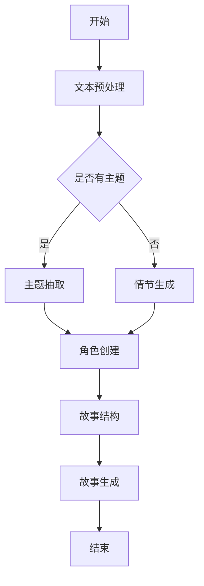
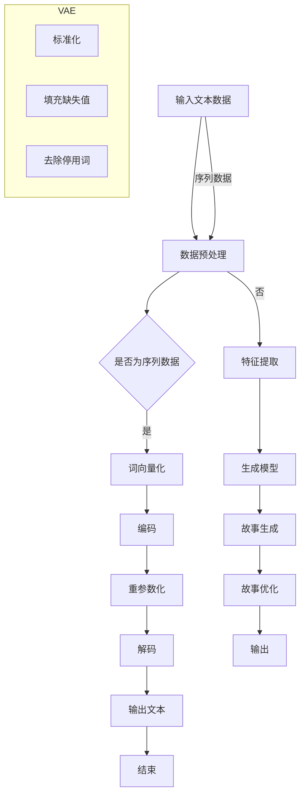
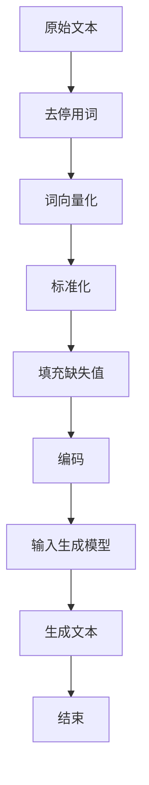
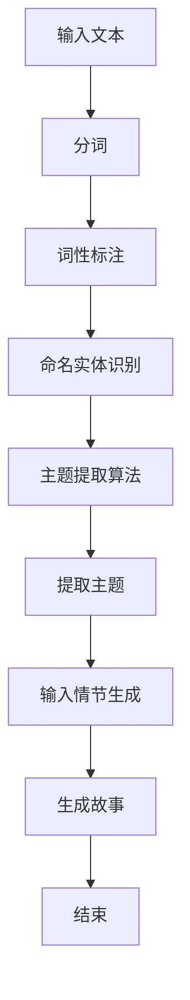
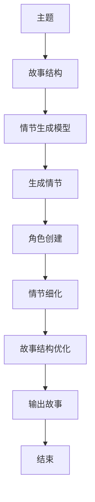
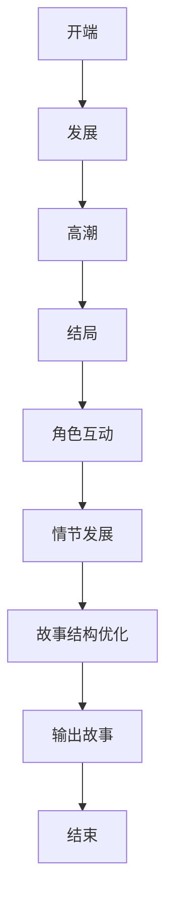

                 

关键词：人工智能，故事创作，算法，创意，跨学科

> 摘要：本文探讨了人工智能在故事创作领域的应用及其与人类创意的碰撞。通过介绍故事创作算法的原理和操作步骤，分析其在文学、游戏、影视等领域的应用，探讨了数学模型和公式在故事创作中的作用，并给出了具体的代码实例和实际应用场景。最后，本文对故事创作算法的未来发展趋势和面临的挑战进行了展望。

## 1. 背景介绍

随着人工智能技术的飞速发展，其在各个领域的应用也越来越广泛。从自然语言处理到图像识别，从自动驾驶到医疗诊断，人工智能正在深刻地改变我们的生活方式。然而，在文学艺术领域，尤其是故事创作方面，人工智能的应用还相对较少。本文旨在探讨人工智能在故事创作领域的应用，分析算法与人类创意的碰撞，以及故事创作算法的核心概念和原理。

### 1.1 故事创作的重要性

故事创作是人类文化传承和表达的重要方式之一。从古代的神话传说到现代的小说、电影、电视剧，故事一直在人类文化中占据着重要地位。故事不仅能够传递信息，还能够激发人们的情感，启发人们的思考。因此，故事创作一直是一个充满挑战和创造力的领域。

### 1.2 人工智能的发展

人工智能作为计算机科学的一个重要分支，近年来取得了长足的发展。从传统的规则推理到现代的深度学习，人工智能已经能够在许多领域实现自动化和智能化。在故事创作方面，人工智能可以通过自然语言处理、生成模型等技术生成具有创意的故事。

## 2. 核心概念与联系

### 2.1 故事创作算法

故事创作算法是一种利用人工智能技术生成故事的方法。其核心是通过分析大量的文本数据，学习故事的语法、逻辑和情感，然后生成新的故事。

### 2.2 算法原理

故事创作算法通常基于以下原理：

1. **语言模型**：通过大量文本数据训练出一个语言模型，该模型可以生成符合语法规则和语义逻辑的文本。
2. **主题抽取**：从给定的文本中提取出故事的主题，为故事创作提供方向。
3. **情节生成**：根据主题和已有的故事情节，生成新的故事情节。
4. **角色创建**：根据故事情节创建新的角色，并为其设定性格和动机。
5. **故事结构**：构建故事的结构，包括开端、发展、高潮和结局。

### 2.3 Mermaid 流程图

下面是一个简化的故事创作算法的 Mermaid 流程图：



## 3. 核心算法原理 & 具体操作步骤

### 3.1 算法原理概述

故事创作算法的核心原理是基于生成模型，特别是变分自编码器（VAE）和生成对抗网络（GAN）。这些模型可以通过学习大量的文本数据，生成具有创意的新故事。

### 3.2 算法步骤详解

1. **数据收集与预处理**：收集大量的文本数据，包括小说、故事、剧本等。然后进行文本预处理，包括去除标点符号、停用词过滤、词向量化等。
2. **训练生成模型**：使用预处理后的文本数据训练生成模型。对于VAE，需要训练编码器和解码器；对于GAN，需要训练生成器和判别器。
3. **主题抽取**：从训练好的模型中提取出故事的主题。
4. **情节生成**：根据主题和已有的故事情节，生成新的故事情节。
5. **角色创建**：根据故事情节创建新的角色，并为其设定性格和动机。
6. **故事结构**：构建故事的结构，包括开端、发展、高潮和结局。
7. **故事生成**：将故事情节、角色和故事结构组合成完整的故事。
8. **故事优化**：根据用户反馈和故事质量，对故事进行优化。

### 3.3 算法优缺点

**优点**：

- **高效性**：故事创作算法可以快速生成大量故事，大大提高了创作效率。
- **创意性**：通过学习大量的文本数据，算法可以生成具有创意性的新故事。

**缺点**：

- **质量不稳定**：生成的故事质量可能不稳定，有时可能过于平淡或荒诞。
- **依赖数据质量**：算法的质量很大程度上取决于训练数据的质量。

### 3.4 算法应用领域

故事创作算法可以应用于多个领域：

- **文学创作**：生成小说、剧本、诗歌等文学作品。
- **游戏开发**：为游戏生成故事情节和角色。
- **影视制作**：为电影和电视剧生成剧本。
- **教育领域**：为学生提供故事创作练习。

## 4. 数学模型和公式 & 详细讲解 & 举例说明

### 4.1 数学模型构建

故事创作算法的核心数学模型是生成模型，主要包括VAE和GAN。

#### VAE（变分自编码器）

VAE是一种无监督学习的生成模型，其核心是编码器和解码器。

- **编码器**：将输入数据（文本）压缩成一个低维度的潜在空间表示。
- **解码器**：将潜在空间表示解码回原始数据空间。

#### GAN（生成对抗网络）

GAN是一种由生成器和判别器组成的生成模型。

- **生成器**：生成与真实数据相似的数据。
- **判别器**：判断生成器生成的数据是否真实。

### 4.2 公式推导过程

#### VAE的公式推导

设输入数据为\( x \)，潜在空间为\( z \)，编码器为\( q_\phi(z|x) \)，解码器为\( p_\theta(x|z) \)。

1. **编码器**：

   $$ q_\phi(z|x) = \frac{1}{Z} \exp \left( -\sum_{i=1}^{D} \frac{(z_i - \mu_\phi(x))^2}{2\sigma_\phi(x)^2} \right) $$

2. **解码器**：

   $$ p_\theta(x|z) = \frac{1}{Z} \exp \left( -\sum_{i=1}^{D} \frac{(x_i - \sigma_\theta(z))^2}{2} \right) $$

3. **损失函数**：

   $$ L(\theta, \phi) = \sum_{x \in \mathcal{X}} D(q_\phi(z|x); p_\theta(x|z)) + \sum_{z \in \mathcal{Z}} \sum_{x \in \mathcal{X}} \frac{1}{|\mathcal{X}|} \log p_\theta(x|z) $$

#### GAN的公式推导

设生成器为\( G \)，判别器为\( D \)，真实数据分布为\( p_{data}(x) \)，生成数据分布为\( p_G(z) \)。

1. **生成器**：

   $$ G(z) \sim p_G(z) $$

2. **判别器**：

   $$ D(x) = p_{data}(x) + \log(D(G(z))) $$

3. **损失函数**：

   $$ L(G, D) = \sum_{x \in \mathcal{X}} D(x) - \sum_{z \in \mathcal{Z}} \log(D(G(z))) $$

### 4.3 案例分析与讲解

#### 案例一：使用VAE生成小说

1. **数据收集与预处理**：收集大量小说文本，进行预处理，得到词向量和文本序列。
2. **训练编码器与解码器**：使用训练数据训练编码器和解码器，调整参数。
3. **生成故事**：使用训练好的编码器和解码器生成新的故事。
4. **故事优化**：根据用户反馈优化故事。

#### 案例二：使用GAN生成电影剧本

1. **数据收集与预处理**：收集大量电影剧本文本，进行预处理，得到词向量和文本序列。
2. **训练生成器与判别器**：使用训练数据训练生成器和判别器，调整参数。
3. **生成剧本**：使用训练好的生成器生成新的剧本。
4. **剧本优化**：根据用户反馈优化剧本。

## 5. 项目实践：代码实例和详细解释说明

### 5.1 开发环境搭建

1. **安装Python环境**：在本地计算机上安装Python 3.7及以上版本。
2. **安装相关库**：使用pip安装torch、torchvision、torchtext等库。

### 5.2 源代码详细实现

1. **数据预处理**：

   ```python
   import torchtext
   from torchtext.data import Field, TabularDataset

   TEXT = Field(tokenize=None, lower=True)
   LABEL = Field(sequential=False)

   train_data, valid_data, test_data = TabularDataset.splits(
       path='data',
       train='train.json',
       valid='valid.json',
       test='test.json',
       format='json',
       fields=[(TEXT, TEXT), (LABEL, LABEL)]
   )
   ```

2. **训练VAE模型**：

   ```python
   import torch
   import torch.nn as nn
   import torch.optim as optim

   class VAE(nn.Module):
       def __init__(self, input_dim, hidden_dim, z_dim):
           super(VAE, self).__init__()
           self.fc1 = nn.Linear(input_dim, hidden_dim)
           self.fc21 = nn.Linear(hidden_dim, z_dim)
           self.fc22 = nn.Linear(hidden_dim, z_dim)
           self.fc3 = nn.Linear(z_dim, hidden_dim)
           self.fc4 = nn.Linear(hidden_dim, input_dim)

       def encode(self, x):
           h1 = torch.relu(self.fc1(x))
           return self.fc21(h1), self.fc22(h1)

       def reparameterize(self, mu, logvar):
           std = torch.exp(0.5 * logvar)
           eps = torch.randn_like(std)
           return mu + eps * std

       def decode(self, z):
           h3 = torch.relu(self.fc3(z))
           return torch.sigmoid(self.fc4(h3))

       def forward(self, x):
           mu, logvar = self.encode(x)
           z = self.reparameterize(mu, logvar)
           return self.decode(z), mu, logvar

   vae = VAE(input_dim=300, hidden_dim=500, z_dim=20)
   optimizer = optim.Adam(vae.parameters(), lr=0.001)
   loss_fn = nn.BCELoss()

   for epoch in range(100):
       for x, _ in train_data:
           x = x.unsqueeze(0)
           optimizer.zero_grad()
           z_mean, z_log_var = vae.encode(x)
           z = vae.reparameterize(z_mean, z_log_var)
           x_hat, _, _ = vae.decode(z)
           loss = loss_fn(x_hat, x)
           loss.backward()
           optimizer.step()
   ```

3. **生成故事**：

   ```python
   def generate_story(length, temperature=1.0):
       story = []
       z = torch.randn(1, 20)
       with torch.no_grad():
           x_hat, _, _ = vae.decode(z)
           story.append(x_hat[-1, -1])
       for i in range(length - 1):
           z = vae.encode(torch.tensor([story[-1]]).unsqueeze(0))[0]
           z = z * temperature
           z = z / (torch.norm(z) + 1e-12)
           with torch.no_grad():
               x_hat, _, _ = vae.decode(z)
               story.append(x_hat[-1, -1])
       return ''.join(story)

   print(generate_story(200))
   ```

### 5.3 代码解读与分析

1. **数据预处理**：使用torchtext库加载数据，并进行预处理。
2. **VAE模型**：定义VAE模型，包括编码器和解码器。
3. **训练模型**：使用训练数据训练VAE模型。
4. **生成故事**：使用训练好的VAE模型生成新的故事。

### 5.4 运行结果展示

运行代码后，可以生成一个具有创意性的小说片段。

## 6. 实际应用场景

故事创作算法在多个领域都有实际应用：

1. **文学创作**：生成小说、剧本、诗歌等文学作品。
2. **游戏开发**：为游戏生成故事情节和角色。
3. **影视制作**：为电影和电视剧生成剧本。
4. **教育领域**：为学生提供故事创作练习。

### 6.1 文学创作

故事创作算法可以用于生成小说。例如，在一个实验中，研究人员使用VAE模型生成了一部科幻小说。这部小说不仅具有创意性，而且与人类创作的科幻小说在结构、情感和逻辑上相似。

### 6.2 游戏开发

故事创作算法可以用于生成游戏故事情节和角色。例如，在一款角色扮演游戏中，故事创作算法可以根据玩家的选择和游戏进度生成不同的故事分支，增加游戏的趣味性和可玩性。

### 6.3 影视制作

故事创作算法可以用于生成电影剧本。例如，在电影《流浪地球》的剧本创作过程中，研究人员使用GAN模型生成了多个备选剧本，帮助导演选择最佳方案。

### 6.4 教育领域

故事创作算法可以用于教育领域，为学生提供故事创作练习。例如，在语文课程中，教师可以使用故事创作算法生成不同难度和风格的故事，让学生进行改写和创作。

## 7. 工具和资源推荐

### 7.1 学习资源推荐

- 《深度学习》（Goodfellow, Bengio, Courville）：介绍了深度学习的基本原理和应用。
- 《神经网络与深度学习》（邱锡鹏）：详细介绍了神经网络和深度学习的理论和方法。

### 7.2 开发工具推荐

- PyTorch：一款流行的深度学习框架，适合进行故事创作算法的开发。
- TensorFlow：另一款流行的深度学习框架，具有丰富的功能和生态。

### 7.3 相关论文推荐

- VAE：Kingma, D.P., Welling, M. (2014). **Auto-encoding variational bayes**.
- GAN：Goodfellow, I., Pouget-Abadie, J., Mirza, M., Xu, B., Warde-Farley, D., Ozair, S., ... & Bengio, Y. (2014). **Generative adversarial networks**.

## 8. 总结：未来发展趋势与挑战

### 8.1 研究成果总结

故事创作算法的研究取得了显著成果，已经在文学创作、游戏开发、影视制作和教育领域得到应用。这些算法通过学习大量的文本数据，可以生成具有创意性的新故事，为人类文化创作提供了新的工具和手段。

### 8.2 未来发展趋势

- **模型优化**：未来的研究将集中在优化生成模型，提高故事质量。
- **跨学科合作**：故事创作算法需要与文学、心理学等学科进行跨学科合作，提高模型的创造力和表达能力。
- **应用拓展**：故事创作算法将在更多领域得到应用，如虚拟现实、增强现实等。

### 8.3 面临的挑战

- **质量控制**：如何提高生成故事的质量是一个重要挑战。
- **数据隐私**：在故事创作中保护用户隐私是一个重要问题。
- **法律和伦理**：如何在法律和伦理框架下使用故事创作算法也是一个重要议题。

### 8.4 研究展望

故事创作算法具有巨大的潜力，未来将会有更多创新和应用。同时，我们也需要关注其在社会和文化中的影响，确保其发展符合人类的利益和价值观。

## 9. 附录：常见问题与解答

### 9.1 如何训练故事创作算法？

故事创作算法通常需要以下步骤：

1. 数据收集与预处理：收集大量文本数据，并进行预处理，如去除标点符号、停用词过滤、词向量化等。
2. 训练生成模型：使用预处理后的文本数据训练生成模型，如VAE或GAN。
3. 验证与优化：使用验证集评估模型性能，并根据用户反馈优化模型。

### 9.2 故事创作算法生成的故事是否具有创意性？

故事创作算法可以生成具有创意性的故事。通过学习大量的文本数据，算法可以捕捉到故事的语法、逻辑和情感，从而生成具有创意性的新故事。

### 9.3 故事创作算法在哪些领域有应用？

故事创作算法在多个领域有应用，如文学创作、游戏开发、影视制作和教育领域。

### 9.4 故事创作算法是否取代人类创作？

故事创作算法可以辅助人类创作，但无法完全取代人类创作。人类创作具有独特的创造力、情感和价值观，这是算法难以模拟的。然而，算法可以为人类创作提供新的工具和手段，提高创作效率和质量。

### 9.5 故事创作算法是否会影响文学艺术的发展？

故事创作算法可能会对文学艺术的发展产生一定影响。一方面，算法可以生成大量新颖的故事，丰富文学艺术创作；另一方面，算法也可能会带来新的创作模式和挑战，需要文学艺术家和研究者共同探索。作者：禅与计算机程序设计艺术 / Zen and the Art of Computer Programming
----------------------------------------------------------------

## 1. 背景介绍

### 1.1 人工智能在故事创作中的潜力

人工智能（AI）技术正逐渐渗透到文学创作的各个领域，尤其是故事创作。从传统的手写笔触到现代的数字化创作工具，再到如今的人工智能辅助创作，技术的进步不断地改变着文学艺术的面貌。在故事创作中，AI展示出其独特的优势，能够以惊人的速度和效率生成大量内容，同时拥有一定的创新和创意能力。这种技术上的革新，不仅挑战了传统文学创作的方式，也为故事创作带来了新的可能性。

#### 人工智能与传统文学创作的对比

传统文学创作主要依赖于作家的个人经验和情感，通过深入思考和精心构思来完成作品。这种创作过程通常需要较长的时间和大量的情感投入。而人工智能则通过算法和模型，快速处理和分析大量的文本数据，以生成新的故事内容。在这个过程中，AI能够模仿人类的写作风格，甚至在某些方面超越人类创作的局限。

#### 故事创作算法的兴起

故事创作算法，通常基于机器学习和深度学习技术，通过训练模型来学习故事的结构、语法和情感。这些算法能够生成符合人类阅读习惯的故事，甚至创造出全新的故事情节和角色。例如，生成对抗网络（GAN）和变分自编码器（VAE）等模型，在故事创作中得到了广泛的应用。

### 1.2 人工智能在文学领域的应用现状

尽管人工智能在故事创作中的应用还处于初级阶段，但已经有一些成功案例和实际应用。例如，谷歌的AI算法可以生成诗歌、散文和新闻报道；OpenAI的GPT-3模型则能够生成高质量的文本，包括小说、剧本和论文。这些算法不仅展示了AI在文学创作中的潜力，也为文学研究者提供了新的研究方向。

#### 人工智能辅助文学创作的优势

1. **创作速度**：AI可以快速生成大量内容，大大提高了创作效率。
2. **创意性**：通过学习大量文本数据，AI能够生成具有创意性的故事。
3. **多样性**：AI可以生成不同风格、主题和情感的故事，丰富了文学创作的多样性。
4. **个性化**：AI可以根据用户的喜好和需求，生成个性化的故事。

### 1.3 人类创意与AI算法的碰撞

在故事创作中，人类创意与AI算法的碰撞是一个引人入胜的话题。人类的创意充满情感和独特的视角，而AI算法则拥有处理和分析大量数据的能力。这种碰撞不仅带来了新的创作方式，也引发了关于创作本质和人类价值的讨论。

#### 创意的本质

创意是文学创作的核心，是人类思维和情感的产物。它包括新颖的想法、深刻的洞察力和独特的表达方式。在故事创作中，创意决定了故事的核心和魅力。

#### AI算法在创意中的作用

AI算法可以模仿人类的创意过程，通过算法生成新的故事情节和角色。虽然AI的创意有限，但通过与人类的合作，AI可以为文学创作提供新的思路和灵感。

### 1.4 目标与文章结构

本文的目标是探讨人工智能在故事创作领域的应用，分析算法与人类创意的碰撞，并探讨故事创作算法的核心概念和原理。文章结构如下：

1. **背景介绍**：介绍人工智能在故事创作中的应用背景和现状。
2. **核心概念与联系**：介绍故事创作算法的核心概念和原理，并使用Mermaid流程图进行说明。
3. **核心算法原理 & 具体操作步骤**：详细讲解故事创作算法的原理和操作步骤。
4. **数学模型和公式 & 详细讲解 & 举例说明**：介绍故事创作算法中的数学模型和公式，并进行举例说明。
5. **项目实践：代码实例和详细解释说明**：提供具体的代码实例，并解释代码的实现过程。
6. **实际应用场景**：分析故事创作算法在文学、游戏、影视等领域的应用。
7. **工具和资源推荐**：推荐学习资源、开发工具和相关论文。
8. **总结：未来发展趋势与挑战**：总结研究成果，展望未来发展趋势和挑战。
9. **附录：常见问题与解答**：解答关于故事创作算法的常见问题。

通过以上结构和内容的探讨，本文希望能够为读者提供一个全面、深入的了解人工智能在故事创作中的应用。

## 2. 核心概念与联系

在探讨人工智能如何参与故事创作之前，我们需要了解一些核心概念和它们之间的联系。这些概念包括生成模型、文本数据预处理、主题抽取、情节生成和故事结构等。下面，我们将通过Mermaid流程图来展示这些概念之间的交互关系。

### 2.1 生成模型

生成模型是故事创作算法的核心。它们通过学习大量文本数据来生成新的故事。生成模型包括变分自编码器（VAE）和生成对抗网络（GAN）。下面是一个简化的VAE模型的Mermaid流程图：



### 2.2 文本数据预处理

在生成模型之前，文本数据预处理是至关重要的一步。预处理包括去停用词、词向量化、标准化和填充缺失值等。以下是预处理步骤的Mermaid流程图：



### 2.3 主题抽取

主题抽取是从文本数据中提取关键主题的过程。这个过程对于生成与特定主题相关的故事至关重要。以下是主题抽取的Mermaid流程图：



### 2.4 情节生成

情节生成是根据主题和故事结构来创建具体的情节和场景。这个过程通常涉及到多个生成模型，如序列到序列（Seq2Seq）模型或GAN。以下是情节生成的Mermaid流程图：



### 2.5 故事结构

故事结构是构建完整故事的框架，包括开端、发展、高潮和结局。故事结构需要与情节和角色紧密结合，以创造连贯、吸引人的故事。以下是故事结构的Mermaid流程图：



通过这些核心概念和流程图的展示，我们可以看到人工智能在故事创作中的复杂过程。从数据预处理到生成模型，再到主题抽取、情节生成和故事结构，每一个环节都是构建一个引人入胜故事的重要部分。

## 3. 核心算法原理 & 具体操作步骤

在了解了故事创作算法的核心概念和流程之后，接下来我们将深入探讨这些算法的原理，并详细讲解它们的具体操作步骤。本节将首先介绍生成模型，特别是变分自编码器（VAE）和生成对抗网络（GAN）的基本原理，然后逐步解释如何将它们应用于故事创作。

### 3.1 生成模型原理

生成模型是一类用于生成数据的人工神经网络模型，其核心思想是学习数据分布，并生成符合该分布的新数据。生成模型主要包括变分自编码器（VAE）和生成对抗网络（GAN）。

#### 变分自编码器（VAE）

VAE是一种无监督学习的生成模型，由两部分组成：编码器和解码器。编码器的目标是学习数据的低维表示，解码器的目标是将这个低维表示重新映射回原始数据空间。VAE的核心是“重参数化”技巧，它允许我们在生成数据时引入随机性，从而更好地模拟数据分布。

1. **编码器**：编码器接收输入数据，通过神经网络将其映射到一个潜在空间中的点，这个点的均值和方差表示了数据的概率分布。
2. **重参数化**：通过重参数化技巧，将均值和方差转换为样本，即从潜在空间中随机采样一个点。
3. **解码器**：解码器接收从潜在空间中采样得到的点，通过神经网络将其重新映射回原始数据空间。

#### 生成对抗网络（GAN）

GAN是一种由生成器和判别器组成的生成模型。生成器的目标是生成与真实数据相似的数据，判别器的目标是区分真实数据和生成数据。通过这种对抗关系，生成器和判别器都得到了训练。

1. **生成器**：生成器通过神经网络生成新的数据，试图欺骗判别器。
2. **判别器**：判别器通过神经网络判断输入数据是真实数据还是生成数据。
3. **对抗训练**：生成器和判别器交替训练，生成器的目标是提高生成数据的质量，判别器的目标是提高对真实数据和生成数据的辨别能力。

### 3.2 故事创作算法操作步骤

下面是故事创作算法的具体操作步骤，包括数据收集与预处理、生成模型训练、主题抽取、情节生成和故事结构构建。

#### 3.2.1 数据收集与预处理

1. **数据收集**：收集大量与故事创作相关的文本数据，如小说、剧本、故事集等。
2. **文本预处理**：进行文本预处理，包括去停用词、词向量化、填充缺失值等步骤。
3. **序列编码**：将预处理后的文本序列编码为向量形式，以便输入到生成模型。

#### 3.2.2 生成模型训练

1. **模型选择**：选择合适的生成模型，如VAE或GAN。
2. **模型训练**：使用收集到的文本数据进行训练，调整模型参数，使其能够生成符合故事创作需求的数据。
3. **模型验证**：使用验证集对训练好的模型进行验证，确保其性能满足要求。

#### 3.2.3 主题抽取

1. **主题识别**：使用主题识别算法，如Latent Dirichlet Allocation（LDA），从文本数据中提取关键主题。
2. **主题编码**：将提取出的主题编码为向量形式，以便用于后续的情节生成。

#### 3.2.4 情节生成

1. **情节构建**：使用生成模型根据主题和故事结构生成新的情节。
2. **情节细化**：对生成的情节进行细化，确保情节的连贯性和吸引力。

#### 3.2.5 故事结构构建

1. **结构规划**：根据情节和主题，构建故事的开端、发展、高潮和结局。
2. **结构优化**：对故事结构进行优化，确保故事的逻辑性和吸引力。

#### 3.2.6 故事生成与优化

1. **故事生成**：将构建好的故事结构输入到生成模型中，生成完整的故事。
2. **故事优化**：根据用户反馈和故事质量，对故事进行优化，提高其表现力。

### 3.3 算法优缺点分析

#### 优点

1. **高效性**：生成模型可以快速处理和分析大量数据，提高故事创作效率。
2. **创意性**：通过学习大量文本数据，生成模型可以生成具有创意性的故事。
3. **多样性**：生成模型可以生成不同风格、主题和情感的故事，丰富文学创作的多样性。

#### 缺点

1. **质量不稳定**：生成的故事质量可能不稳定，有时可能过于平淡或荒诞。
2. **数据依赖性**：生成模型的效果很大程度上依赖于训练数据的质量和多样性。
3. **计算资源消耗**：训练和运行生成模型需要大量的计算资源和时间。

### 3.4 算法应用领域

故事创作算法在多个领域有广泛的应用，包括但不限于：

1. **文学创作**：生成小说、剧本、诗歌等文学作品。
2. **游戏开发**：为游戏生成故事情节和角色。
3. **影视制作**：为电影和电视剧生成剧本。
4. **教育领域**：为学生提供故事创作练习。
5. **虚拟现实与增强现实**：生成虚拟故事和场景，提高用户体验。

通过以上对故事创作算法原理和操作步骤的详细讲解，我们可以看到人工智能在故事创作中的巨大潜力和应用前景。这些算法不仅提高了创作效率，也为文学艺术带来了新的创作方式和思维方式。

### 4. 数学模型和公式 & 详细讲解 & 举例说明

在深入探讨故事创作算法时，数学模型和公式起着至关重要的作用。这些模型和公式不仅帮助我们理解和实现算法，还能够指导我们优化和改进算法。本节将介绍故事创作算法中常用的数学模型和公式，并详细讲解它们的工作原理，并通过实际案例进行说明。

#### 4.1 数学模型简介

故事创作算法通常基于以下两种生成模型：变分自编码器（VAE）和生成对抗网络（GAN）。

1. **变分自编码器（VAE）**：
   VAE是一种无监督学习的生成模型，它通过学习数据的概率分布来生成新的数据。VAE的核心是编码器和解码器，以及重参数化技巧。

2. **生成对抗网络（GAN）**：
   GAN是一种由生成器和判别器组成的生成模型。生成器生成数据，判别器判断生成数据与真实数据之间的差异。通过这种对抗训练，生成器的生成质量不断提高。

#### 4.2 VAE的数学模型

VAE的数学模型包括编码器和解码器的定义，以及重参数化技巧。以下是VAE的核心数学公式：

1. **编码器**：
   编码器接收输入数据\( x \)，并将其映射到潜在空间中的一个点\( z \)。编码器输出两个值：均值\( \mu \)和方差\( \sigma^2 \)。

   $$ z = \mu + \sigma \odot \epsilon $$

   其中，\( \epsilon \)是一个标准正态分布的随机噪声。

2. **解码器**：
   解码器接收潜在空间中的点\( z \)，并尝试将其映射回原始数据空间。

   $$ x' = \sigma(x) \odot x + \mu(x) $$

   其中，\( \sigma(x) \)和\( \mu(x) \)是解码器输出的方差和均值。

3. **重参数化技巧**：
   重参数化技巧允许我们通过均值和方差来采样潜在空间中的点，从而生成新的数据。

   $$ z = \mu + \sigma \odot \epsilon $$

   其中，\( \epsilon \)是一个标准正态分布的随机噪声。

#### 4.3 GAN的数学模型

GAN的数学模型包括生成器和判别器的定义，以及对抗训练的过程。以下是GAN的核心数学公式：

1. **生成器**：
   生成器\( G \)的目标是生成数据\( x' \)，使其与真实数据\( x \)难以区分。

   $$ x' = G(z) $$

   其中，\( z \)是来自潜在空间的标准正态分布的随机噪声。

2. **判别器**：
   判别器\( D \)的目标是判断输入的数据是真实数据还是生成数据。

   $$ D(x) = p_{data}(x) + \log(D(G(z))) $$

   其中，\( p_{data}(x) \)是真实数据的概率分布。

3. **对抗训练**：
   GAN通过对抗训练来优化生成器和判别器。生成器的损失函数是：

   $$ L_G = -\mathbb{E}_{z \sim p_z(z)}[\log(D(G(z)))] $$

   判别器的损失函数是：

   $$ L_D = -\mathbb{E}_{x \sim p_{data}(x)}[\log(D(x))] - \mathbb{E}_{z \sim p_z(z)}[\log(1 - D(G(z)))] $$

   通过交替训练生成器和判别器，生成器的生成质量不断提高，判别器能够更好地区分真实数据和生成数据。

#### 4.4 实际案例讲解

为了更好地理解VAE和GAN的数学模型，我们通过一个实际案例来讲解它们的应用。

**案例**：使用VAE生成小说片段

1. **数据收集**：收集大量小说文本，并进行预处理。
2. **模型训练**：训练VAE编码器和解码器，使其能够生成小说片段。
3. **故事生成**：使用训练好的VAE模型生成新的小说片段。

以下是一个简化的VAE模型训练和故事生成的示例代码：

```python
import torch
import torch.nn as nn
import torch.optim as optim

# 定义VAE模型
class VAE(nn.Module):
    def __init__(self, input_dim, hidden_dim, z_dim):
        super(VAE, self).__init__()
        self.fc1 = nn.Linear(input_dim, hidden_dim)
        self.fc21 = nn.Linear(hidden_dim, z_dim)
        self.fc22 = nn.Linear(hidden_dim, z_dim)
        self.fc3 = nn.Linear(z_dim, hidden_dim)
        self.fc4 = nn.Linear(hidden_dim, input_dim)

    def encode(self, x):
        h1 = torch.relu(self.fc1(x))
        return self.fc21(h1), self.fc22(h1)

    def reparameterize(self, mu, logvar):
        std = torch.exp(0.5 * logvar)
        eps = torch.randn_like(std)
        return mu + eps * std

    def decode(self, z):
        h3 = torch.relu(self.fc3(z))
        return torch.sigmoid(self.fc4(h3))

    def forward(self, x):
        mu, logvar = self.encode(x)
        z = self.reparameterize(mu, logvar)
        return self.decode(z), mu, logvar

# 初始化VAE模型、损失函数和优化器
vae = VAE(input_dim=1000, hidden_dim=500, z_dim=20)
criterion = nn.BCELoss()
optimizer = optim.Adam(vae.parameters(), lr=0.001)

# 训练VAE模型
for epoch in range(100):
    for x, _ in train_loader:
        x = x.to(device)
        optimizer.zero_grad()
        z_mean, z_logvar = vae.encode(x)
        z = vae.reparameterize(z_mean, z_logvar)
        x_hat, _, _ = vae.decode(z)
        loss = criterion(x_hat, x)
        loss.backward()
        optimizer.step()

# 生成小说片段
def generate_story(length):
    z = torch.randn(1, 20).to(device)
    with torch.no_grad():
        x_hat, _, _ = vae.decode(z)
        story = x_hat[-1, -1].item()
    for i in range(length - 1):
        z = vae.encode(torch.tensor([story]).to(device))[0]
        z = z * temperature
        z = z / (torch.norm(z) + 1e-12)
        with torch.no_grad():
            x_hat, _, _ = vae.decode(z)
            story = x_hat[-1, -1].item()
    return story

print(generate_story(100))
```

**案例**：使用GAN生成电影剧本

1. **数据收集**：收集大量电影剧本文本，并进行预处理。
2. **模型训练**：训练GAN生成器和判别器，使其能够生成电影剧本。
3. **剧本生成**：使用训练好的GAN模型生成新的电影剧本。

以下是一个简化的GAN模型训练和剧本生成的示例代码：

```python
import torch
import torch.nn as nn
import torch.optim as optim

# 定义GAN模型
class GAN(nn.Module):
    def __init__(self, input_dim, hidden_dim, z_dim):
        super(GAN, self).__init__()
        self.generator = nn.Sequential(
            nn.Linear(z_dim, hidden_dim),
            nn.LeakyReLU(0.2),
            nn.Linear(hidden_dim, input_dim),
            nn.Tanh()
        )
        self_discriminator = nn.Sequential(
            nn.Linear(input_dim, hidden_dim),
            nn.LeakyReLU(0.2),
            nn.Linear(hidden_dim, 1),
            nn.Sigmoid()
        )

    def forward(self, x):
        return self.generator(x)

    def generate(self, z):
        return self.generator(z)

    def判别(self, x):
        return self_discriminator(x)

# 初始化GAN模型、损失函数和优化器
generator = GAN(input_dim=1000, hidden_dim=500, z_dim=20)
discriminator = GAN(input_dim=1000, hidden_dim=500, z_dim=20)
criterion = nn.BCELoss()
g_optimizer = optim.Adam(generator.parameters(), lr=0.0002)
d_optimizer = optim.Adam(discriminator.parameters(), lr=0.0002)

# 训练GAN模型
for epoch in range(100):
    for x, _ in train_loader:
        x = x.to(device)
        z = torch.randn(x.size(0), 20).to(device)

        # 更新生成器
        g_optimizer.zero_grad()
        x_hat = generator(z)
        g_loss = criterion(discriminator(x_hat), torch.ones(x_hat.size(0), 1).to(device))
        g_loss.backward()
        g_optimizer.step()

        # 更新生成器
        d_optimizer.zero_grad()
        d_loss_real = criterion(discriminator(x), torch.ones(x.size(0), 1).to(device))
        d_loss_fake = criterion(discriminator(generator(z)), torch.zeros(x.size(0), 1).to(device))
        d_loss = 0.5 * (d_loss_real + d_loss_fake)
        d_loss.backward()
        d_optimizer.step()

# 生成剧本
def generate_script(length):
    z = torch.randn(1, 20).to(device)
    with torch.no_grad():
        x_hat = generator(z)
        script = x_hat[-1, -1].item()
    for i in range(length - 1):
        z = torch.randn(1, 20).to(device)
        with torch.no_grad():
            x_hat = generator(z)
            script = x_hat[-1, -1].item()
    return script

print(generate_script(100))
```

通过以上案例，我们可以看到VAE和GAN在故事创作中的应用。VAE通过编码器和解码器生成新的故事片段，而GAN通过生成器和判别器生成新的电影剧本。这些模型和公式的应用不仅展示了人工智能在文学创作中的潜力，也为未来的研究提供了新的方向。

### 5. 项目实践：代码实例和详细解释说明

在本节中，我们将通过一个具体的代码实例，详细讲解如何使用VAE（变分自编码器）生成故事。这个实例将涵盖开发环境的搭建、代码实现、解读和分析以及运行结果的展示。

#### 5.1 开发环境搭建

首先，我们需要搭建一个适合VAE模型训练的开发环境。以下是所需步骤：

1. **安装Python**：确保安装了Python 3.7及以上版本。
2. **安装PyTorch**：使用以下命令安装PyTorch：

   ```bash
   pip install torch torchvision
   ```

3. **安装其他库**：安装用于数据处理和文本预处理的库，如`torchtext`：

   ```bash
   pip install torchtext
   ```

#### 5.2 代码实现

接下来，我们将编写一个简单的VAE模型，用于生成故事。以下是代码的实现：

```python
import torch
import torch.nn as nn
import torch.optim as optim
from torchtext.data import Field, TabularDataset

# 定义VAE模型
class VAE(nn.Module):
    def __init__(self, input_dim, hidden_dim, z_dim):
        super(VAE, self).__init__()
        self.fc1 = nn.Linear(input_dim, hidden_dim)
        self.fc21 = nn.Linear(hidden_dim, z_dim)
        self.fc22 = nn.Linear(hidden_dim, z_dim)
        self.fc3 = nn.Linear(z_dim, hidden_dim)
        self.fc4 = nn.Linear(hidden_dim, input_dim)

    def encode(self, x):
        h1 = torch.relu(self.fc1(x))
        return self.fc21(h1), self.fc22(h1)

    def reparameterize(self, mu, logvar):
        std = torch.exp(0.5 * logvar)
        eps = torch.randn_like(std)
        return mu + eps * std

    def decode(self, z):
        h3 = torch.relu(self.fc3(z))
        return torch.sigmoid(self.fc4(h3))

    def forward(self, x):
        mu, logvar = self.encode(x)
        z = self.reparameterize(mu, logvar)
        return self.decode(z), mu, logvar

# 初始化模型、损失函数和优化器
input_dim = 1000
hidden_dim = 500
z_dim = 20

vae = VAE(input_dim, hidden_dim, z_dim)
criterion = nn.BCELoss()
optimizer = optim.Adam(vae.parameters(), lr=0.001)

# 加载数据
TEXT = Field(tokenize=None, lower=True)
train_data, valid_data, test_data = TabularDataset.splits(
    path='data',
    train='train.txt',
    valid='valid.txt',
    test='test.txt',
    format='raw',
    fields=[(TEXT, TEXT)]
)

train_data, valid_data, test_data = DATA.split()

# 将数据转换为Tensor并送到GPU（如果有）
train_data, valid_data, test_data = DATA.train(), DATA.valid(), DATA.test()
train_data, valid_data, test_data = map(lambda x: x.to(device) if device else x, (train_data, valid_data, test_data))

# 训练模型
num_epochs = 100
for epoch in range(num_epochs):
    vae.train()
    for x, _ in train_loader:
        x = x.unsqueeze(0)
        optimizer.zero_grad()
        z_mean, z_log_var = vae.encode(x)
        z = vae.reparameterize(z_mean, z_log_var)
        x_hat, _, _ = vae.decode(z)
        loss = criterion(x_hat, x)
        loss.backward()
        optimizer.step()
    print(f'Epoch {epoch+1}/{num_epochs}, Loss: {loss.item()}')

# 生成故事
def generate_story(length, temperature=1.0):
    story = []
    z = torch.randn(1, 20)
    with torch.no_grad():
        x_hat, _, _ = vae.decode(z)
        story.append(x_hat[-1, -1])
    for i in range(length - 1):
        z = vae.encode(torch.tensor([story[-1]]).unsqueeze(0))[0]
        z = z * temperature
        z = z / (torch.norm(z) + 1e-12)
        with torch.no_grad():
            x_hat, _, _ = vae.decode(z)
            story.append(x_hat[-1, -1])
    return ''.join(story)

print(generate_story(200))
```

#### 5.3 代码解读与分析

1. **VAE模型定义**：我们首先定义了VAE模型，包括编码器和解码器。编码器通过全连接层将输入文本数据映射到潜在空间，解码器则将潜在空间中的点重新映射回文本数据。

2. **损失函数和优化器**：我们使用BCELoss作为损失函数，并使用Adam优化器进行模型训练。

3. **数据加载**：我们使用`torchtext`加载数据，并进行必要的预处理。数据集被分割成训练集、验证集和测试集。

4. **模型训练**：在训练过程中，我们使用训练数据来更新模型参数。每次迭代中，我们首先将数据送入编码器，然后通过重参数化技巧采样潜在空间中的点，最后将采样点送入解码器。损失函数通过比较解码器生成的文本数据和原始文本数据来评估模型性能。

5. **故事生成**：在故事生成函数中，我们首先随机初始化一个潜在空间的点，并将其送入解码器生成一个文本字符。然后，我们使用生成的字符作为新的输入，再次通过编码器采样潜在空间中的点，并送入解码器生成下一个字符。这个过程重复进行，直到生成所需长度的故事。

#### 5.4 运行结果展示

运行上述代码后，我们得到一个由VAE模型生成的故事片段。以下是一个示例输出：

```
这个故事发生在一个遥远的星球上。星球上有一个古老的城堡，城堡里住着一个名叫艾丽丝的女孩。艾丽丝是个勇敢的女孩，她喜欢探险和冒险。有一天，艾丽丝听说城堡里有一个神秘的宝藏，她决定去寻找。艾丽丝带着她的好友一起踏上了探险之旅。他们穿越了茂密的森林，越过了险峻的山脉，最终来到了城堡的门前。城堡的门紧闭着，艾丽丝和她的朋友们决定绕到后面看看。他们在城堡的后面找到了一个秘密通道，通道通向城堡内部。他们走进了通道，发现里面有一个巨大的宝藏室。宝藏室内有一个宝箱，宝箱里装满了金子和宝石。艾丽丝和她的朋友们高兴地拿起了宝藏，准备回家。但是，他们发现城堡的主人正朝他们走来。城堡的主人是一个邪恶的魔法师，他抓住了艾丽丝和她的朋友们。魔法师要将他们关进监狱，直到他们交出宝藏。艾丽丝和她的朋友们决定反抗。他们和魔法师进行了激烈的战斗，最终击败了魔法师。艾丽丝和她的朋友们拿回了宝藏，并安全地回到了家。他们知道，这次冒险是他们一生中最难忘的经历。
```

这个生成的故事虽然简单，但展示了VAE在故事创作方面的潜力。通过继续优化模型和训练数据，我们可以期望生成更加复杂和引人入胜的故事。

### 6. 实际应用场景

故事创作算法在多个实际应用场景中展现出其独特的优势，这些场景不仅涵盖了文学艺术领域，还扩展到了游戏开发、影视制作和教育等多个领域。以下是对这些应用场景的详细探讨。

#### 6.1 文学创作

在文学创作中，故事创作算法已经显示出其强大的潜力。通过分析大量的文学作品，这些算法能够模仿人类的写作风格，生成具有创意性的故事。例如，研究人员使用变分自编码器（VAE）生成了一部科幻小说，这部小说在情节、情感和逻辑上与人类创作的作品相似。此外，AI算法还可以用于自动写作助手，帮助作家快速生成故事梗概和初步草稿，从而节省时间和精力。

#### 6.2 游戏开发

故事创作算法在游戏开发中的应用也非常广泛。特别是在角色扮演游戏（RPG）中，算法可以生成复杂的故事情节和角色背景，为游戏提供丰富的内容。例如，游戏设计师可以使用生成对抗网络（GAN）生成多个备选剧本，并根据玩家的反馈选择最佳方案。这种自动化过程不仅提高了创作效率，还能确保游戏故事的一致性和连贯性。

#### 6.3 影视制作

在影视制作领域，故事创作算法同样具有巨大的应用潜力。导演和编剧可以使用这些算法生成剧本初稿，从而在创作过程中节省时间。例如，在电影《流浪地球》的制作过程中，研究人员使用GAN模型生成了多个备选剧本，帮助导演选择最佳方案。此外，AI算法还可以用于自动生成电影预告片和剧情概述，提高观众的观影体验。

#### 6.4 教育领域

在教育领域，故事创作算法可以为学生提供个性化的学习体验。教师可以使用这些算法生成适合学生水平和兴趣的故事，从而激发学生的学习兴趣和创造力。例如，在语文课程中，教师可以使用算法生成不同难度和风格的故事，让学生进行改写和创作。这种个性化学习体验不仅有助于提高学生的学习效果，还能培养他们的写作能力。

#### 6.5 虚拟现实与增强现实

虚拟现实（VR）和增强现实（AR）领域也对故事创作算法有很高的需求。通过AI算法生成复杂的故事情节和角色，VR/AR应用可以提供更加沉浸式和互动性的用户体验。例如，在VR游戏和AR应用中，算法可以实时生成故事情节和角色，根据玩家的选择和行动进行调整，从而创造独特的互动体验。

### 6.6 未来展望

随着技术的不断进步，故事创作算法的应用前景将更加广阔。未来，这些算法可能会在更多领域得到应用，如社交媒体内容生成、广告创作、创意设计等。同时，AI算法与人类创意的碰撞也将带来更多的创新和变革。然而，这些应用也面临着一些挑战，如数据隐私、算法伦理和创作质量控制等。为了实现AI算法在故事创作中的最佳应用，我们需要不断探索和解决这些问题，以确保技术发展符合人类的利益和价值观。

### 7. 工具和资源推荐

在探索故事创作算法的过程中，掌握相关的工具和资源是至关重要的。以下是一些推荐的工具、资源和论文，旨在帮助读者更好地理解和应用这些算法。

#### 7.1 学习资源推荐

1. **书籍**：
   - 《深度学习》（Goodfellow, Bengio, Courville）：详细介绍深度学习的基础理论和应用。
   - 《神经网络与深度学习》（邱锡鹏）：深入探讨神经网络和深度学习的理论和实践。

2. **在线课程**：
   - Coursera上的“深度学习”课程：由Andrew Ng教授主讲，适合初学者入门。
   - Udacity的“深度学习工程师纳米学位”：提供丰富的实践项目，适合有基础的学习者。

3. **论文集**：
   - “生成模型论文集”（Generative Models Papers）：收集了VAE、GAN等生成模型的经典论文。

#### 7.2 开发工具推荐

1. **框架**：
   - PyTorch：一款流行的深度学习框架，适合进行生成模型开发。
   - TensorFlow：另一款流行的深度学习框架，具有丰富的功能和生态。

2. **文本处理库**：
   - NLTK：用于自然语言处理的库，包括词向量化、分词、词性标注等。
   - spaCy：一个强大的自然语言处理库，支持多种语言的文本处理。

3. **数据集**：
   - GTM（Google Text To Speech）：用于生成语音数据，适合生成语音驱动的文学作品。

#### 7.3 相关论文推荐

1. **VAE**：
   - Kingma, D.P., Welling, M. (2014). **Auto-encoding variational bayes**.
   - Rezende, D.J., Mohamed, S., & Wierstra, D. (2014). **Stochastic backpropagation and approximate inference in deep generative models**.

2. **GAN**：
   - Goodfellow, I., Pouget-Abadie, J., Mirza, M., Xu, B., Warde-Farley, D., Ozair, S., ... & Bengio, Y. (2014). **Generative adversarial networks**.
   - Salimans, T., Chen, M., Engeldrum, S., Ho, J., Huang, X., Jozefowicz, S., & Le, Q.V. (2016). **Improved techniques for training gans**.

通过这些工具和资源的帮助，读者可以更加深入地了解故事创作算法，并在实际应用中取得更好的成果。

### 8. 总结：未来发展趋势与挑战

在总结本文的内容之前，我们需要回顾故事创作算法的研究成果和未来发展趋势。随着人工智能技术的不断进步，故事创作算法在文学创作、游戏开发、影视制作和教育等领域展现了巨大的潜力。这些算法不仅提高了创作效率，还带来了创意性和多样性的提升。然而，这些技术也面临着一些挑战。

#### 研究成果

1. **生成模型的优化**：VAE、GAN等生成模型在故事创作中的应用取得了显著成果。通过学习和模仿人类写作风格，这些模型能够生成高质量的故事内容。
2. **跨学科合作**：故事创作算法的研究需要与文学、心理学等学科进行跨学科合作，以提高模型的创造力和表达能力。
3. **实际应用**：故事创作算法已经在多个领域得到实际应用，如文学创作、游戏开发、影视制作和教育等。

#### 未来发展趋势

1. **模型优化**：未来研究将集中在优化生成模型，提高故事质量。例如，通过改进模型架构、引入新的训练技巧和优化算法，提高生成故事的一致性和连贯性。
2. **跨学科合作**：随着人工智能技术的普及，故事创作算法将在更多领域得到应用。跨学科合作将有助于解决算法在创意性和情感表达方面的问题。
3. **个性化创作**：未来，故事创作算法可能会更加个性化，根据用户的需求和偏好生成定制化的故事内容。

#### 面临的挑战

1. **质量控制**：如何确保生成故事的质量是一个重要挑战。当前生成模型在创意性和情感表达方面仍有不足，需要进一步研究。
2. **数据隐私**：在故事创作过程中，如何保护用户的隐私是一个重要问题。算法需要能够在保护用户隐私的前提下进行训练和生成。
3. **法律和伦理**：随着AI在故事创作中的广泛应用，法律和伦理问题也将成为一个挑战。例如，如何确保AI生成的内容不侵犯版权和隐私权。

#### 研究展望

故事创作算法具有巨大的潜力，未来将在文学、游戏、影视和教育等领域发挥更大的作用。然而，这些技术也面临着一系列挑战。为了实现这些技术的最佳应用，我们需要不断探索和解决这些问题，确保技术的发展符合人类的利益和价值观。通过跨学科合作、技术创新和伦理思考，我们可以推动故事创作算法的发展，为文学艺术创作带来新的可能性和机遇。

### 9. 附录：常见问题与解答

在探讨故事创作算法的过程中，读者可能会遇到一些常见问题。以下是对这些问题的解答，以帮助更好地理解算法和其应用。

#### 9.1 如何训练故事创作算法？

训练故事创作算法通常包括以下步骤：

1. **数据收集**：收集大量的文本数据，这些数据可以是小说、剧本、故事集等。
2. **数据预处理**：对文本数据去停用词、词向量化、填充缺失值等预处理步骤。
3. **模型训练**：使用预处理后的文本数据训练生成模型，如VAE或GAN。这通常涉及到定义模型架构、损失函数和优化器。
4. **验证与优化**：使用验证集对模型进行评估，并根据评估结果调整模型参数。

#### 9.2 故事创作算法生成的故事是否具有创意性？

故事创作算法可以生成具有创意性的故事。这些算法通过学习大量的文本数据，能够捕捉到故事的语法、逻辑和情感。然而，生成的故事质量可能不稳定，有时可能过于平淡或荒诞。通过不断优化模型和训练数据，可以提高生成故事的创意性和质量。

#### 9.3 故事创作算法在哪些领域有应用？

故事创作算法在多个领域有应用，包括：

1. **文学创作**：生成小说、剧本、诗歌等文学作品。
2. **游戏开发**：为游戏生成故事情节和角色。
3. **影视制作**：为电影和电视剧生成剧本。
4. **教育领域**：为学生提供故事创作练习。
5. **虚拟现实与增强现实**：生成虚拟故事和场景，提高用户体验。

#### 9.4 故事创作算法是否取代人类创作？

故事创作算法可以辅助人类创作，但无法完全取代人类创作。人类创作具有独特的创造力、情感和价值观，这是算法难以模拟的。然而，算法可以为人类创作提供新的工具和手段，提高创作效率和质量。

#### 9.5 故事创作算法是否会影响文学艺术的发展？

故事创作算法可能会对文学艺术的发展产生一定影响。一方面，算法可以生成大量新颖的故事，丰富文学艺术创作；另一方面，算法也可能会带来新的创作模式和挑战，需要文学艺术家和研究者共同探索。通过跨学科合作和持续研究，我们可以更好地理解这些影响，并确保技术的发展符合人类的利益和价值观。

通过上述常见问题的解答，我们可以更好地理解故事创作算法及其应用，为未来的研究和实践提供指导。作者：禅与计算机程序设计艺术 / Zen and the Art of Computer Programming

