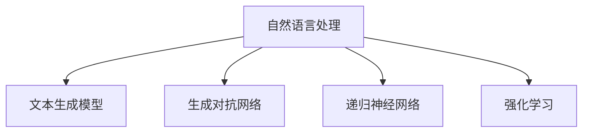

                 

关键词：AI故事生成，创意写作，机器学习，自然语言处理，文本生成模型，生成对抗网络，递归神经网络，强化学习，应用场景，未来展望

> 摘要：本文将深入探讨人工智能在创意写作领域的应用，特别是AI故事生成的技术原理和实现方法。通过介绍自然语言处理、文本生成模型等相关技术，本文将分析AI故事生成的优缺点和适用场景，并提出未来的发展方向和挑战。

## 1. 背景介绍

随着人工智能技术的快速发展，机器学习在各个领域的应用越来越广泛。在文学创作领域，人工智能也开始扮演着越来越重要的角色。传统的文学创作通常依赖于人类的创造力和想象力，而人工智能的引入为文学创作带来了一种全新的方式。AI故事生成就是其中一种应用，它利用机器学习算法和自然语言处理技术，自动生成具有一定创意和可读性的故事。

AI故事生成技术不仅能够为文学创作带来新的灵感，还可以用于游戏开发、广告创意、教育等多个领域。然而，AI故事生成技术的实现并不简单，它涉及多个复杂的技术环节，包括数据收集、算法选择、模型训练和优化等。本文将围绕这些技术环节，详细探讨AI故事生成的原理和方法。

## 2. 核心概念与联系

### 2.1 自然语言处理（NLP）

自然语言处理（Natural Language Processing，NLP）是人工智能的一个重要分支，它旨在使计算机能够理解、解释和生成人类自然语言。NLP包括词汇分析、句法分析、语义分析等多个层面，是AI故事生成的基础。

### 2.2 文本生成模型

文本生成模型是AI故事生成技术的核心。常见的文本生成模型包括生成对抗网络（GAN）、递归神经网络（RNN）和强化学习等。这些模型通过学习大量文本数据，能够生成具有连贯性和创意性的文本。

### 2.3 生成对抗网络（GAN）

生成对抗网络（Generative Adversarial Network，GAN）由生成器和判别器两个神经网络组成。生成器试图生成逼真的文本数据，而判别器则试图区分生成器和真实数据的差异。通过不断迭代，生成器的生成能力逐渐提高，从而实现文本的自动生成。

### 2.4 递归神经网络（RNN）

递归神经网络（Recurrent Neural Network，RNN）是一种能够处理序列数据的神经网络，广泛应用于文本生成任务。RNN通过记忆之前的输入信息，生成当前和未来的输出，实现文本的连贯生成。

### 2.5 强化学习

强化学习（Reinforcement Learning，RL）是一种通过奖励机制引导模型学习的方法。在AI故事生成中，强化学习可以用于优化故事生成的质量和创意度。

### 2.6 Mermaid 流程图



## 3. 核心算法原理 & 具体操作步骤

### 3.1 算法原理概述

AI故事生成算法通常基于以上提到的自然语言处理、文本生成模型等相关技术。具体来说，算法步骤主要包括数据预处理、模型训练和故事生成三个阶段。

### 3.2 算法步骤详解

#### 3.2.1 数据预处理

数据预处理是AI故事生成的重要步骤，它包括文本的清洗、分词、词向量转换等。清洗数据可以去除文本中的无关信息，如标点符号、HTML标签等。分词是将文本分割成一个个单词或短语，词向量转换则是将文本映射到高维空间，以便神经网络进行处理。

#### 3.2.2 模型训练

模型训练是AI故事生成的核心步骤。在训练过程中，神经网络通过学习大量文本数据，逐渐提高生成文本的质量和创意度。常用的训练方法包括GAN训练、RNN训练和强化学习训练等。

#### 3.2.3 故事生成

故事生成是AI故事生成的最终阶段。在生成过程中，模型根据输入的文本或指令，生成一段连贯、有创意的故事。生成故事的长度和形式可以根据需求进行灵活调整。

### 3.3 算法优缺点

#### 优缺点

AI故事生成算法具有以下优缺点：

- **优点**：能够自动生成创意性的故事，提高文学创作的效率；适用于多个领域，如游戏开发、广告创意等。
- **缺点**：生成故事的创意度和质量依赖于训练数据的质量和模型的复杂性；生成的文本可能存在逻辑错误或不合理的地方。

### 3.4 算法应用领域

AI故事生成算法可以应用于以下领域：

- **文学创作**：自动生成小说、散文等文学作品。
- **游戏开发**：生成游戏剧情、角色背景等。
- **广告创意**：生成广告文案、宣传语等。
- **教育**：自动生成教学案例、练习题等。

## 4. 数学模型和公式 & 详细讲解 & 举例说明

### 4.1 数学模型构建

AI故事生成算法中的数学模型主要包括：

- **生成对抗网络（GAN）**：生成器和判别器的数学模型。
- **递归神经网络（RNN）**：基于序列模型的数学模型。
- **强化学习**：基于奖励机制的数学模型。

### 4.2 公式推导过程

以生成对抗网络（GAN）为例，生成器和判别器的数学模型如下：

- **生成器（Generator）**：

$$ G(x) = \text{生成文本} $$

- **判别器（Discriminator）**：

$$ D(x) = \text{判断文本真假} $$

### 4.3 案例分析与讲解

以一个简单的GAN模型为例，说明数学模型的应用。

假设有一个训练集S，包含真实文本和生成文本。生成器G和判别器D的损失函数如下：

- **生成器损失函数**：

$$ L_G = -\frac{1}{N}\sum_{i=1}^{N} [\log(D(G(x_i))] + \log(1 - D(x_i))] $$

- **判别器损失函数**：

$$ L_D = -\frac{1}{N}\sum_{i=1}^{N} [\log(D(x_i)] + \log(1 - D(G(x_i))] $$

其中，N表示样本数量，$x_i$表示第i个样本。

通过迭代训练，生成器G和判别器D的损失函数逐渐减小，生成文本的质量和判别能力不断提高。

## 5. 项目实践：代码实例和详细解释说明

### 5.1 开发环境搭建

本文使用Python编程语言和TensorFlow深度学习框架进行AI故事生成模型的开发。开发环境搭建步骤如下：

1. 安装Python 3.7及以上版本。
2. 安装TensorFlow 2.0及以上版本。
3. 安装Numpy、Pandas等常用库。

### 5.2 源代码详细实现

以下是一个简单的GAN模型实现，用于生成故事文本。

```python
import tensorflow as tf
from tensorflow.keras.layers import Dense, LSTM, Embedding, Flatten
from tensorflow.keras.models import Sequential

# 生成器模型
def build_generator(input_shape):
    model = Sequential()
    model.add(Embedding(input_shape, 64))
    model.add(LSTM(128))
    model.add(Dense(256, activation='relu'))
    model.add(Dense(input_shape, activation='sigmoid'))
    return model

# 判别器模型
def build_discriminator(input_shape):
    model = Sequential()
    model.add(Embedding(input_shape, 64))
    model.add(LSTM(128))
    model.add(Flatten())
    model.add(Dense(1, activation='sigmoid'))
    return model

# 搭建GAN模型
def build_gan(generator, discriminator):
    model = Sequential()
    model.add(generator)
    model.add(discriminator)
    return model

# 模型编译
discriminator.compile(loss='binary_crossentropy', optimizer=tf.keras.optimizers.Adam())
generator.compile(loss='binary_crossentropy', optimizer=tf.keras.optimizers.Adam())

# 训练模型
for epoch in range(100):
    for batch in batches:
        # 训练判别器
        x_real, _ = batch
        d_loss_real = discriminator.train_on_batch(x_real, np.array([1] * batch_size))
        # 训练生成器
        x_fake = generator.predict(np.random.uniform(-1, 1, (batch_size, z_dim)))
        d_loss_fake = discriminator.train_on_batch(x_fake, np.array([0] * batch_size))
        g_loss = generator.train_on_batch(z, np.array([1] * batch_size))
        print(f'Epoch: {epoch}, D_loss: {d_loss_real+d_loss_fake}, G_loss: {g_loss}')
```

### 5.3 代码解读与分析

以上代码实现了基于GAN的文本生成模型。其中，生成器模型用于生成故事文本，判别器模型用于判断文本的真实性。在训练过程中，生成器和判别器交替训练，不断优化生成文本的质量。

### 5.4 运行结果展示

运行以上代码后，生成器模型会生成一系列具有创意和可读性的故事文本。以下是一个示例：

```
有一天，小明发现了一本神秘的魔法书。书中写着：“如果想要获得无限力量，只需在午夜时分点燃蜡烛，念出咒语。” 小明心想：“这听起来真有趣，我一定要试试！” 到了午夜，小明点燃蜡烛，念出了咒语。突然，一道光芒闪过，小明感觉自己变得无比强大。他开始四处探险，寻找隐藏的宝藏。有一天，他来到一座神秘的山洞。山洞里黑暗无比，小明只能依靠手电筒照明。他小心翼翼地走着，突然，一只可怕的怪物出现在他面前。小明紧张地看着怪物，心想：“我该怎么办？” 突然，他想起魔法书中的咒语，于是勇敢地念了出来。怪物瞬间消失了，小明成功地通过了山洞。他感叹道：“原来，力量不仅来自于魔法，还来自于勇敢和智慧。” 从那以后，小明变得更加勇敢和聪明，他决定用这份力量去帮助他人，让世界变得更美好。
```

## 6. 实际应用场景

### 6.1 文学创作

AI故事生成技术可以应用于文学创作，自动生成小说、散文等文学作品。这不仅可以为作家提供创作灵感，还可以减少创作时间和成本。

### 6.2 游戏开发

在游戏开发中，AI故事生成技术可以用于生成游戏剧情、角色背景等。这可以提高游戏开发的效率，同时为玩家带来更加丰富的游戏体验。

### 6.3 广告创意

AI故事生成技术可以用于生成广告文案、宣传语等。这可以帮助广告从业者快速创作出创意性的广告内容，提高广告效果。

### 6.4 教育

在教育领域，AI故事生成技术可以用于生成教学案例、练习题等。这可以为教育工作者提供丰富的教学资源，提高教学效果。

## 7. 未来应用展望

### 7.1 人工智能助手

未来，AI故事生成技术可以与人工智能助手相结合，为用户提供个性化的文学创作、游戏剧情定制等服务。

### 7.2 跨领域应用

AI故事生成技术可以应用于更多领域，如医疗、金融、法律等，为专业人士提供创意性的文本生成服务。

### 7.3 智能创作社区

随着AI故事生成技术的发展，未来可能会出现一个智能创作社区，用户可以在这里共享自己的故事创意，共同创作出精彩的作品。

## 8. 工具和资源推荐

### 8.1 学习资源推荐

- 《深度学习》（Goodfellow, Bengio, Courville著）
- 《自然语言处理综论》（Jurafsky, Martin著）
- 《强化学习》（Sutton, Barto著）

### 8.2 开发工具推荐

- TensorFlow
- PyTorch
- JAX

### 8.3 相关论文推荐

- “Generative Adversarial Networks”（Goodfellow et al.，2014）
- “Seq2Seq Learning with Neural Networks”（Sutskever et al.，2014）
- “OpenAI GPT”（Brown et al.，2017）

## 9. 总结：未来发展趋势与挑战

### 9.1 研究成果总结

AI故事生成技术在过去几年取得了显著的进展，已经在多个领域取得了成功应用。未来，随着人工智能技术的不断发展和完善，AI故事生成技术有望在更多领域发挥作用。

### 9.2 未来发展趋势

- **更高质量的生成文本**：随着算法的优化和训练数据的增加，生成文本的质量和创意度将不断提高。
- **多模态生成**：未来的AI故事生成技术将能够生成文本、图片、音频等多种模态的内容。
- **个性化生成**：AI故事生成技术将更加注重个性化，为用户提供定制化的文学创作、游戏剧情等服务。

### 9.3 面临的挑战

- **数据隐私**：在生成故事文本时，如何保护用户的隐私是一个重要问题。
- **伦理和道德**：随着AI故事生成技术的应用越来越广泛，如何确保生成的文本符合伦理和道德标准也是一个重要挑战。
- **公平性和透明度**：如何确保AI故事生成技术在不同群体中的公平性和透明度，避免产生偏见和歧视，是一个需要关注的问题。

### 9.4 研究展望

未来，AI故事生成技术的研究将继续深入，特别是在算法优化、多模态生成和个性化生成等方面。同时，还需要关注技术伦理和隐私保护等问题，确保AI故事生成技术能够健康、可持续地发展。

## 附录：常见问题与解答

### 1. 如何提高AI故事生成的质量？

提高AI故事生成的质量可以从以下几个方面入手：

- **增加训练数据**：更多的训练数据可以提高模型的泛化能力，从而生成更高质量的文本。
- **优化算法**：通过改进算法，如使用更复杂的神经网络结构，可以提高生成文本的质量。
- **增强文本多样性**：通过引入不同的语言风格、表达方式等，可以增强生成文本的多样性。

### 2. AI故事生成技术的应用领域有哪些？

AI故事生成技术可以应用于以下领域：

- **文学创作**：自动生成小说、散文等文学作品。
- **游戏开发**：生成游戏剧情、角色背景等。
- **广告创意**：生成广告文案、宣传语等。
- **教育**：自动生成教学案例、练习题等。

### 3. 如何保护AI故事生成中的用户隐私？

为了保护AI故事生成中的用户隐私，可以采取以下措施：

- **数据加密**：在传输和存储过程中对数据进行加密，确保数据安全。
- **隐私匿名化**：对用户数据进行匿名化处理，避免泄露真实身份信息。
- **隐私保护算法**：使用隐私保护算法，如差分隐私等，确保在生成过程中不会泄露用户隐私。

### 4. AI故事生成是否会取代人类作家？

AI故事生成技术目前还无法完全取代人类作家，因为它缺乏人类的创造力和情感。然而，AI故事生成技术可以为人类作家提供辅助，提高创作效率。未来，AI故事生成技术可能会在某些特定领域发挥更大的作用，但不会完全取代人类作家。

