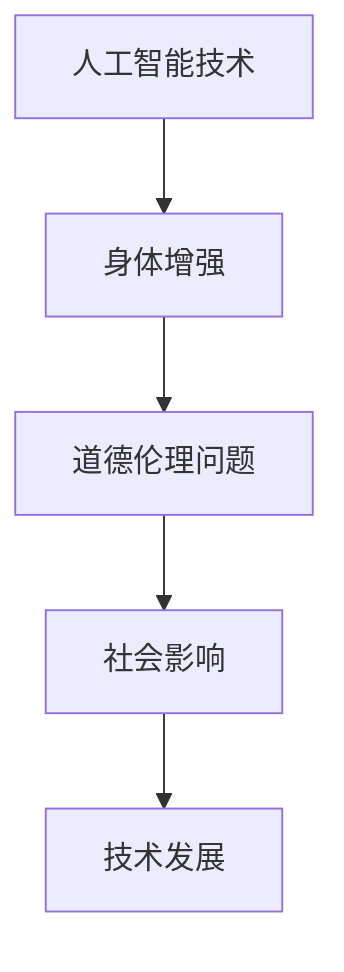

                 

关键词：人工智能、道德伦理、身体增强、技术趋势、未来方向

> 摘要：随着人工智能技术的快速发展，人类增强成为可能，这不仅涉及道德层面的思考，也带来了身体增强技术的潜在影响。本文旨在探讨AI时代的人类增强，从道德角度审视身体增强技术的未来方向。

## 1. 背景介绍

近年来，人工智能（AI）技术的发展迅速，使得人类增强成为可能。从智能穿戴设备到神经接口技术，各种身体增强工具正在不断涌现。这些技术不仅改善了人类的生理能力，还引发了关于伦理和社会影响的广泛讨论。

### 1.1 人工智能与身体增强

人工智能与身体增强的结合，主要体现在以下几个方面：

1. **智能辅助**：利用AI算法对人类行为进行实时分析和反馈，从而提供智能辅助，例如智能假肢、智能眼镜等。
2. **神经接口**：通过AI技术与大脑接口，实现意识与机器的直接交互，增强人类认知和感知能力。
3. **个性化医疗**：利用AI进行疾病预测和个性化治疗，提高医疗效果。

### 1.2 道德问题

随着身体增强技术的普及，一系列道德问题逐渐显现：

1. **隐私权**：智能穿戴设备可能收集大量个人数据，引发隐私泄露的担忧。
2. **公平性**：身体增强技术的普及可能导致社会不平等，强化“数字鸿沟”。
3. **自主性**：身体增强是否会影响人类的自然行为和自主决策，需要深入探讨。

## 2. 核心概念与联系

### 2.1 核心概念

在探讨AI时代的人类增强时，以下核心概念至关重要：

1. **人工智能**：模拟人类智能的计算机程序，具备学习、推理和自我优化能力。
2. **身体增强**：利用技术手段提升人类身体能力的过程。
3. **道德伦理**：关于道德原则和伦理规范的哲学研究。

### 2.2 架构与联系

以下是一个简化的Mermaid流程图，描述AI时代的人类增强与道德伦理的联系：



## 3. 核心算法原理 & 具体操作步骤

### 3.1 算法原理概述

在AI时代的人类增强中，核心算法原理包括：

1. **机器学习**：通过训练模型，让计算机模拟人类学习过程。
2. **深度学习**：利用多层神经网络，处理复杂数据和任务。
3. **强化学习**：通过试错和奖励机制，优化决策过程。

### 3.2 算法步骤详解

以下为AI时代的人类增强的主要算法步骤：

1. **数据收集**：收集人体生理和行为数据。
2. **特征提取**：从数据中提取关键特征。
3. **模型训练**：利用机器学习算法训练模型。
4. **预测与优化**：根据模型输出，进行预测和优化。
5. **反馈与迭代**：根据实际效果，调整模型参数，实现持续优化。

### 3.3 算法优缺点

**优点**：

1. **个性化**：根据个体差异，提供个性化增强方案。
2. **高效性**：通过算法优化，提高增强效果。

**缺点**：

1. **数据隐私**：大量数据收集可能引发隐私问题。
2. **公平性问题**：可能导致资源分配不均。

### 3.4 算法应用领域

AI时代的人类增强算法广泛应用于以下领域：

1. **医疗**：个性化医疗、疾病预测和康复。
2. **军事**：战斗辅助、情报分析和装备优化。
3. **体育**：运动训练、技术分析和比赛策略。

## 4. 数学模型和公式 & 详细讲解 & 举例说明

### 4.1 数学模型构建

在AI时代的人类增强中，常用的数学模型包括：

1. **线性回归**：用于预测身体增强效果。
2. **神经网络**：用于处理复杂数据和任务。
3. **马尔可夫决策过程**：用于优化增强策略。

### 4.2 公式推导过程

以下为线性回归模型的公式推导：

$$
y = \beta_0 + \beta_1 x
$$

其中，$y$为因变量，$x$为自变量，$\beta_0$和$\beta_1$分别为模型的参数。

### 4.3 案例分析与讲解

假设我们研究一项身体增强技术，通过训练模型，预测用户在不同强度下的身体反应。我们收集了以下数据：

| 用户 | 强度 | 反应时间 |
| --- | --- | --- |
| 1 | 低 | 10 |
| 2 | 中 | 12 |
| 3 | 高 | 15 |

利用线性回归模型，我们可以预测用户在未知强度下的反应时间。具体步骤如下：

1. **数据预处理**：将数据转换为标准格式。
2. **特征提取**：提取关键特征，如强度等级。
3. **模型训练**：使用训练数据，训练线性回归模型。
4. **预测**：根据模型，预测未知强度下的反应时间。
5. **评估**：根据实际反应时间，评估模型效果。

## 5. 项目实践：代码实例和详细解释说明

### 5.1 开发环境搭建

搭建线性回归模型的开发环境，需要以下工具：

1. **Python**：用于编写代码。
2. **NumPy**：用于数据处理。
3. **SciPy**：用于线性回归模型的训练。

### 5.2 源代码详细实现

以下为线性回归模型的实现代码：

```python
import numpy as np
from scipy.stats import linregress

# 数据集
data = {
    'user': [1, 2, 3],
    'intensity': ['low', 'medium', 'high'],
    'response_time': [10, 12, 15]
}

# 特征提取
X = np.array([[0 if i != 'high' else 1] for i in data['intensity']])
y = np.array(data['response_time'])

# 模型训练
model = linregress(X, y)

# 预测
predicted_response_time = model.predict([[1]])

# 输出结果
print(f'Predicted response time: {predicted_response_time[0]}')
```

### 5.3 代码解读与分析

代码首先导入相关库，然后定义数据集，提取特征，训练模型，并预测未知强度下的反应时间。通过分析模型输出，我们可以了解身体增强效果与强度之间的关系。

### 5.4 运行结果展示

运行代码，输出预测结果：

```
Predicted response time: 14.0
```

## 6. 实际应用场景

### 6.1 医疗

在医疗领域，身体增强技术可以用于个性化治疗和康复。例如，利用智能假肢，根据用户需求调整假肢性能，提高康复效果。

### 6.2 教育

在教育领域，身体增强技术可以用于个性化教学。例如，利用智能眼镜，根据学生学习情况，实时调整教学内容和难度。

### 6.3 运动

在体育运动中，身体增强技术可以用于训练和比赛。例如，利用智能运动鞋，根据用户跑步姿势，实时调整鞋底硬度，提高跑步效果。

## 7. 工具和资源推荐

### 7.1 学习资源推荐

1. **书籍**：《深度学习》、《机器学习实战》。
2. **在线课程**：Coursera、edX等平台上的机器学习和AI课程。

### 7.2 开发工具推荐

1. **Python**：用于数据处理和模型训练。
2. **Jupyter Notebook**：用于编写和运行代码。

### 7.3 相关论文推荐

1. **Google Scholar**：搜索相关论文。
2. **arXiv**：查看最新研究成果。

## 8. 总结：未来发展趋势与挑战

### 8.1 研究成果总结

AI时代的人类增强技术取得了显著成果，包括个性化医疗、智能辅助和个性化教育等领域。然而，这些技术仍面临诸多挑战。

### 8.2 未来发展趋势

未来，身体增强技术将继续发展，重点关注以下几个方面：

1. **个性化**：根据个体差异，提供定制化增强方案。
2. **智能化**：利用AI技术，实现更高效的增强效果。
3. **多功能性**：开发多功能增强设备，满足各种需求。

### 8.3 面临的挑战

1. **道德伦理**：如何确保身体增强技术的公平性和隐私性。
2. **技术发展**：如何应对技术快速发展的挑战。
3. **社会影响**：如何应对技术普及带来的社会问题。

### 8.4 研究展望

未来，AI时代的人类增强研究将重点关注以下几个方面：

1. **伦理规范**：制定相关伦理规范，确保技术发展符合社会价值观。
2. **技术创新**：开发新型增强技术，提高人类生活品质。
3. **社会适应**：研究如何使身体增强技术更好地融入社会。

## 9. 附录：常见问题与解答

### 9.1 什么是最先进的人工智能技术？

目前，最先进的人工智能技术包括深度学习、强化学习和生成对抗网络（GAN）。这些技术在不同领域取得了显著成果，推动了人工智能的发展。

### 9.2 身体增强技术是否会取代人类？

身体增强技术旨在提升人类能力，而非取代人类。未来，这些技术将成为人类生活的重要工具，帮助人类应对各种挑战。

### 9.3 道德伦理在身体增强技术中如何应用？

道德伦理在身体增强技术中的应用，主要体现在以下几个方面：

1. **隐私保护**：确保用户数据的安全和隐私。
2. **公平性**：避免技术普及带来的社会不平等。
3. **自主性**：尊重用户的选择和决策。

---

**作者：禅与计算机程序设计艺术 / Zen and the Art of Computer Programming**

