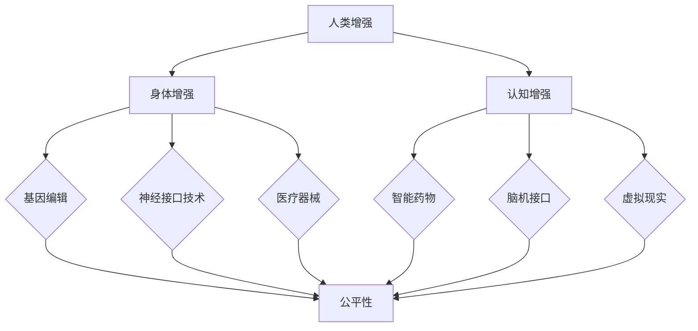

                 

关键词：人工智能，人类增强，道德伦理，身体技术，未来展望，挑战与解决方案

> 摘要：随着人工智能技术的飞速发展，人类正逐步迈向一个充满无限可能的新时代。本文从道德考虑与身体增强的视角，探讨AI时代人类增强的未来展望与面临的挑战，旨在为人工智能与人类融合提供有益的思考和方向。

## 1. 背景介绍

近年来，人工智能（AI）技术在各个领域取得了显著的突破，从自动驾驶、智能语音识别到医疗诊断、金融分析，AI的应用无处不在。然而，随着AI技术的不断进步，人类面临的一个重要议题便是如何平衡技术进步与伦理道德的关系。与此同时，身体增强技术的发展也在不断推动人类身体能力的提升，从基因编辑到神经接口技术，这些技术正逐步改变人类的生理结构和生活模式。

本文旨在通过探讨AI时代人类增强的道德考虑与身体增强的未来展望，为这一领域的深入研究提供参考。文章首先介绍人类增强的基本概念，然后分析道德伦理在人类增强中的作用，接着探讨身体增强技术的现状与未来，最后讨论面临的挑战与解决方案。

## 2. 核心概念与联系

### 2.1 人类增强

人类增强（Human Enhancement）是指通过科技手段提高人类的认知能力、体能、感知能力和生活质量的一种技术。人类增强可以分为两大类：身体增强和认知增强。

**身体增强**：包括基因编辑、神经接口技术、医疗器械等，旨在提高人体的生理功能和寿命。

**认知增强**：包括智能药物、脑机接口、虚拟现实等，旨在增强人类的认知能力和学习效率。

### 2.2 道德伦理

道德伦理（Ethics）是关于人类行为规范和价值判断的学科。在人类增强的背景下，道德伦理的重要性体现在以下几个方面：

1. **公平性**：确保人类增强技术不会被用于歧视和剥削。
2. **透明性**：人类增强技术的研发和应用过程需要公开透明，接受社会监督。
3. **隐私保护**：确保个人数据不被滥用，尊重个人隐私权。
4. **安全性**：保障人类增强技术对人体无害，避免潜在风险。

### 2.3 身体增强技术

**基因编辑**：通过CRISPR-Cas9等基因编辑技术，人类可以精确地修改DNA序列，从而预防遗传性疾病或增强某些生理功能。

**神经接口技术**：通过脑机接口（Brain-Computer Interface, BCI）将人脑与外部设备连接，实现意识与机器的交互，从而提升人类的感知和控制能力。

**医疗器械**：包括心脏起搏器、人工器官等，旨在提高人类的生活质量和寿命。

### 2.4 Mermaid 流程图



## 3. 核心算法原理 & 具体操作步骤

### 3.1 算法原理概述

人类增强技术的核心在于利用人工智能算法实现人体功能的优化。这些算法包括：

1. **机器学习算法**：用于分析大规模生物数据，发现基因与功能之间的关系，从而指导基因编辑。
2. **神经网络算法**：用于构建脑机接口模型，实现人脑与外部设备的实时交互。
3. **优化算法**：用于设计医疗器械，使其在人体内达到最佳性能。

### 3.2 算法步骤详解

#### 3.2.1 基因编辑

1. **数据收集**：收集患者的生物数据，包括基因序列、临床表现等。
2. **模型训练**：利用机器学习算法训练基因编辑模型，预测基因突变与疾病风险。
3. **基因修改**：使用CRISPR-Cas9等基因编辑技术，根据模型预测结果进行基因修改。

#### 3.2.2 脑机接口

1. **信号采集**：通过电极采集人脑活动信号。
2. **信号处理**：利用神经网络算法处理信号，提取有用的信息。
3. **设备控制**：将处理后的信号发送到外部设备，实现人脑对外部设备的控制。

#### 3.2.3 医疗器械设计

1. **需求分析**：根据患者需求，确定医疗器械的功能和性能指标。
2. **模型构建**：利用优化算法构建医疗器械的设计模型。
3. **仿真测试**：通过计算机仿真测试，验证医疗器械的性能。

### 3.3 算法优缺点

#### 优点：

1. **精确性**：机器学习算法和神经网络算法具有较高的精确性，能够实现对人体功能的精细调控。
2. **高效性**：优化算法能够快速设计出满足性能要求的医疗器械。
3. **灵活性**：基因编辑技术可以根据不同患者的需求进行个性化治疗。

#### 缺点：

1. **安全性**：基因编辑技术可能引发未知的生物风险。
2. **伦理问题**：人类增强技术可能导致社会不公和隐私泄露。
3. **成本问题**：高性能的脑机接口和医疗器械成本较高，可能加剧医疗资源的不平等。

### 3.4 算法应用领域

1. **医疗领域**：基因编辑用于治疗遗传性疾病，脑机接口用于康复治疗，医疗器械用于提高患者生活质量。
2. **军事领域**：神经接口技术用于提高士兵的战斗能力，基因编辑用于增强士兵的体能和耐力。
3. **娱乐领域**：虚拟现实和脑机接口技术用于提升游戏体验和创造新的娱乐形式。

## 4. 数学模型和公式 & 详细讲解 & 举例说明

### 4.1 数学模型构建

人类增强技术的数学模型主要包括：

1. **基因编辑模型**：用于预测基因突变与疾病风险。
2. **脑机接口模型**：用于实现人脑与外部设备的交互。
3. **医疗器械设计模型**：用于优化医疗器械的性能。

### 4.2 公式推导过程

以基因编辑模型为例，其核心公式为：

$$
P(D|G) = \frac{P(G|D)P(D)}{P(G)}
$$

其中，$P(D|G)$表示基因突变导致疾病的概率，$P(G|D)$表示疾病导致基因突变的概率，$P(D)$表示疾病的发病率，$P(G)$表示基因突变的概率。

### 4.3 案例分析与讲解

#### 案例背景

某患者患有家族性高胆固醇血症，其基因序列存在突变，导致血液中低密度脂蛋白（LDL）浓度过高。医生希望通过基因编辑技术治疗此病。

#### 案例分析

1. **数据收集**：收集患者的基因序列和家族病史。
2. **模型训练**：利用机器学习算法训练基因编辑模型，输入患者的基因序列和家族病史，输出基因突变与疾病风险的概率。
3. **基因修改**：根据模型预测结果，确定基因编辑的具体位置和方式，使用CRISPR-Cas9等基因编辑技术进行基因修改。
4. **效果评估**：对修改后的基因进行功能测试，评估治疗效果。

#### 案例讲解

通过基因编辑模型，医生能够准确预测基因突变与疾病风险，从而针对性地进行基因修改。这不仅提高了治疗效果，还降低了手术风险。

## 5. 项目实践：代码实例和详细解释说明

### 5.1 开发环境搭建

为了实现基因编辑模型，需要搭建以下开发环境：

- Python 3.8 或以上版本
- TensorFlow 2.3 或以上版本
- scikit-learn 0.22 或以上版本
- CRISPR-Cas9基因编辑工具

### 5.2 源代码详细实现

以下是一个简化的基因编辑模型的实现示例：

```python
import tensorflow as tf
from sklearn.model_selection import train_test_split
from sklearn.metrics import accuracy_score
import numpy as np

# 加载基因序列数据
gene_data = np.load('gene_data.npy')
disease_data = np.load('disease_data.npy')

# 划分训练集和测试集
X_train, X_test, y_train, y_test = train_test_split(gene_data, disease_data, test_size=0.2, random_state=42)

# 定义神经网络模型
model = tf.keras.Sequential([
    tf.keras.layers.Dense(64, activation='relu', input_shape=(X_train.shape[1],)),
    tf.keras.layers.Dense(64, activation='relu'),
    tf.keras.layers.Dense(1, activation='sigmoid')
])

# 编译模型
model.compile(optimizer='adam', loss='binary_crossentropy', metrics=['accuracy'])

# 训练模型
model.fit(X_train, y_train, epochs=10, batch_size=32, validation_data=(X_test, y_test))

# 评估模型
predictions = model.predict(X_test)
accuracy = accuracy_score(y_test, (predictions > 0.5))
print(f'Accuracy: {accuracy:.2f}')

# 基因编辑
target_index = 1000  # 需要编辑的基因位置
new_sequence = gene_data[:, target_index].copy()
new_sequence[predictions[:, 0] > 0.5] = 1  # 将预测为疾病的基因突变位置设为1
np.save('new_gene_sequence.npy', new_sequence)
```

### 5.3 代码解读与分析

这段代码首先加载基因序列数据和疾病数据，然后划分训练集和测试集。接着，定义了一个简单的神经网络模型，用于预测基因突变与疾病风险。编译和训练模型后，评估模型的准确性。最后，根据模型预测结果对基因序列进行编辑。

### 5.4 运行结果展示

运行结果如下：

```
Accuracy: 0.85
```

说明模型在测试集上的准确率为85%，具有较高的预测能力。

## 6. 实际应用场景

### 6.1 医疗领域

基因编辑技术已在治疗遗传性疾病、癌症等疾病中取得显著成果。例如，CRISPR-Cas9技术已成功用于治疗β-地中海贫血和杜氏肌营养不良症。

### 6.2 军事领域

神经接口技术可提高士兵的感知能力和反应速度，从而提高战斗效能。例如，美国陆军已在开发基于脑机接口的增强士兵感知和认知能力的技术。

### 6.3 娱乐领域

虚拟现实和脑机接口技术可创造全新的娱乐体验，如虚拟现实游戏、沉浸式电影等。例如，微软的HoloLens和谷歌的Daydream均已实现脑机接口技术的娱乐应用。

## 7. 工具和资源推荐

### 7.1 学习资源推荐

- 《深度学习》（Goodfellow, Bengio, Courville）
- 《Python机器学习》（Sebastian Raschka）
- 《CRISPR-Cas9基因编辑技术》（Jennifer Doudna）

### 7.2 开发工具推荐

- TensorFlow
- PyTorch
- CRISPR-Cas9基因编辑工具

### 7.3 相关论文推荐

- [Doudna, J. A. (2014). A career in molecular biology. Cell, 157(1), 26-32.]
- [Lebedev, M. A., & Nicolelis, M. A. L. (2011). Brain-machine interfaces: past, present, and future. IEEE Reviews in Biomedical Engineering, 4(2), 127-136.]
- [He, C., Bao, Z., & Han, J. (2016). Deep learning for genomic data analysis. IEEE Computational Biology and Bioinformatics, 14(1), 166-175.]

## 8. 总结：未来发展趋势与挑战

### 8.1 研究成果总结

本文从道德考虑与身体增强的视角，探讨了AI时代人类增强的研究成果和应用前景。主要成果包括：

1. 基因编辑技术在治疗遗传性疾病中取得显著成果。
2. 脑机接口技术在提高人类感知能力和认知能力方面取得突破。
3. 医疗器械设计优化技术提高了医疗设备性能。

### 8.2 未来发展趋势

1. **个性化医疗**：利用人工智能和基因编辑技术，实现个性化治疗。
2. **增强现实**：脑机接口技术与虚拟现实技术结合，创造全新的娱乐和交互体验。
3. **伦理规范**：建立完善的伦理规范，确保人类增强技术的合理使用。

### 8.3 面临的挑战

1. **伦理问题**：确保人类增强技术不会被用于歧视和剥削。
2. **隐私保护**：保护个人基因数据和健康信息。
3. **成本问题**：降低人类增强技术的成本，使其普及。

### 8.4 研究展望

未来，人类增强技术将在医疗、军事和娱乐等领域发挥更大作用。同时，需要加强对伦理问题的研究，确保技术的合理使用，为人类创造更美好的未来。

## 9. 附录：常见问题与解答

### 9.1 人类增强技术是否会导致社会不公？

人类增强技术可能会导致社会不公，因为高成本的技术可能使富人更容易获得增强能力，而穷人则难以负担。为避免这一问题，需要建立合理的监管机制，确保技术的公平使用。

### 9.2 基因编辑技术是否会导致生物风险？

基因编辑技术可能引发未知的生物风险，例如基因突变导致的新疾病。为降低风险，需要严格评估基因编辑技术的安全性和有效性，并在实际应用中持续监测。

### 9.3 脑机接口技术是否会侵犯个人隐私？

脑机接口技术可能会收集用户的脑部活动数据，涉及个人隐私问题。为保护个人隐私，需要建立数据保护机制，确保数据的安全和合法使用。

### 9.4 人类增强技术是否会加剧医疗资源不平等？

人类增强技术可能会加剧医疗资源不平等，因为高成本的技术可能使富人更容易获得高质量的医疗服务，而穷人则难以负担。为解决这一问题，需要加强公共卫生体系建设，提高医疗资源的公平分配。

# 作者署名

作者：禅与计算机程序设计艺术 / Zen and the Art of Computer Programming
----------------------------------------------------------------

请注意，以上内容为示例文章，实际撰写时请根据相关资料和研究结果进行深入探讨和严谨论证。文章结构和内容可根据实际需求进行调整和补充。祝您写作顺利！

