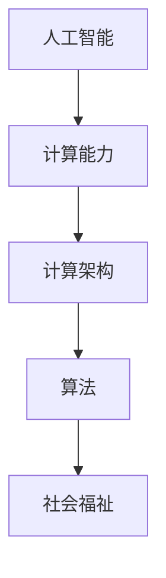

                 

 关键词：人工智能、计算能力、社会福祉、增强计算、计算架构

> 摘要：随着人工智能（AI）技术的迅猛发展，人类计算的能力正经历着一场前所未有的变革。本文将探讨AI时代的人类计算如何增强社会福祉，从技术发展、应用实践、挑战与展望等方面展开论述，旨在为未来的技术与社会发展提供有益的思考。

## 1. 背景介绍

### 1.1 人工智能的发展历程

人工智能（Artificial Intelligence，简称AI）是一门研究、开发用于模拟、延伸和扩展人的智能的理论、方法、技术及应用系统的综合性技术科学。自1956年达特茅斯会议上首次提出以来，人工智能经历了数次重要的发展阶段：

- **早期探索（1956-1969）**：人工智能作为一门新兴科学受到广泛关注，初期的目标主要集中在符号主义人工智能，通过模拟人类的推理能力实现机器的智能。
- **黄金时期（1970-1980）**：随着硬件技术的发展和算法的创新，人工智能研究取得了显著进展，如专家系统的出现，使得AI开始应用于实际问题。
- **低谷期（1980-1990）**：由于实际应用中的复杂性和计算能力的限制，人工智能研究遭遇了瓶颈，逐渐进入了低谷期。
- **复兴期（1990-2000）**：随着计算机性能的提升和互联网的普及，机器学习和数据挖掘技术得到了迅速发展，人工智能开始走向实用化。
- **大爆炸期（2010至今）**：深度学习、神经网络等技术的突破，推动了人工智能的又一次大爆炸，使得AI在语音识别、图像处理、自然语言处理等领域取得了重大突破。

### 1.2 计算能力的提升

计算能力的提升是人工智能发展的基础。从早期的冯·诺依曼架构到现在的异构计算，计算机体系结构的不断演进为AI算法的快速迭代和大规模应用提供了坚实的基础：

- **冯·诺依曼架构**：早期的计算机采用冯·诺依曼架构，CPU负责指令的执行，内存用于存储数据和指令。虽然冯·诺依曼架构在性能和可靠性方面取得了巨大成功，但在处理复杂任务时仍存在瓶颈。
- **异构计算**：随着AI算法的复杂度增加，传统的冯·诺依曼架构已无法满足需求。异构计算通过将计算任务分布在CPU、GPU、FPGA等不同类型的处理器上，实现了计算能力的提升。特别是GPU在并行计算方面具有显著优势，使得深度学习算法得到了广泛应用。

## 2. 核心概念与联系

为了更好地理解AI时代的人类计算，我们需要从核心概念与联系入手。以下是本文所涉及的核心概念及其相互联系：

### 2.1 人工智能与计算能力

人工智能与计算能力密不可分。计算能力的提升使得AI算法能够处理更大的数据集、更复杂的任务，从而实现更高效的智能。

### 2.2 计算架构与算法

计算架构直接影响到算法的执行效率和性能。从冯·诺依曼架构到异构计算，计算架构的演进推动了算法的发展。

### 2.3 人类计算与社会福祉

人类计算能力的提升不仅改变了技术领域，还对社会福祉产生了深远影响。通过智能化的计算系统，人类能够更高效地解决社会问题，提高生活质量。

### 2.4 核心概念原理和架构的Mermaid流程图



## 3. 核心算法原理 & 具体操作步骤

### 3.1 算法原理概述

在AI时代，核心算法的原理主要包括：

- **深度学习**：通过多层神经网络对数据进行自动特征提取和模式识别。
- **机器学习**：利用数据训练模型，使其能够对未知数据进行预测和分类。
- **强化学习**：通过试错和奖励机制，使智能体在复杂环境中进行决策。

### 3.2 算法步骤详解

以下是核心算法的步骤详解：

- **深度学习**：输入数据 -> 前向传播 -> 求导反向传播 -> 更新权重
- **机器学习**：数据预处理 -> 特征提取 -> 选择模型 -> 训练模型 -> 评估模型
- **强化学习**：初始状态 -> 状态转换 -> 动作选择 -> 奖励反馈 -> 更新策略

### 3.3 算法优缺点

每种算法都有其优缺点：

- **深度学习**：能够自动提取复杂特征，但需要大量数据和计算资源。
- **机器学习**：模型可解释性较强，但依赖于特征工程。
- **强化学习**：能够处理复杂环境，但训练过程可能较长。

### 3.4 算法应用领域

核心算法在各个领域都有广泛应用：

- **深度学习**：计算机视觉、语音识别、自然语言处理。
- **机器学习**：金融风控、医疗诊断、智能家居。
- **强化学习**：游戏AI、自动驾驶、智能客服。

## 4. 数学模型和公式 & 详细讲解 & 举例说明

### 4.1 数学模型构建

深度学习中的数学模型主要包括：

- **前向传播**：输入数据经过网络层传递，最终得到输出。
- **反向传播**：计算输出误差，反向更新网络权重。

### 4.2 公式推导过程

以深度学习中的前向传播为例，其公式推导如下：

- **输入层到隐藏层的传递**：\[a_{ij}^{(l)} = \sigma(z_{ij}^{(l)})\]
- **隐藏层到输出层的传递**：\[y_i = \sigma(z_i^{(L)})\]

其中，\(a_{ij}^{(l)}\)为第\(l\)层的第\(i\)个神经元的激活值，\(z_{ij}^{(l)}\)为第\(l\)层的第\(i\)个神经元的输入值，\(\sigma\)为激活函数，\(y_i\)为输出层的第\(i\)个神经元的输出值。

### 4.3 案例分析与讲解

以图像分类任务为例，使用深度学习模型对图片进行分类。首先，对图片进行预处理，将其转换为网络输入；然后，通过多层神经网络进行特征提取和模式识别；最后，输出分类结果。

## 5. 项目实践：代码实例和详细解释说明

### 5.1 开发环境搭建

在本项目中，我们使用Python作为主要编程语言，搭建以下开发环境：

- Python 3.8
- TensorFlow 2.4.0
- Keras 2.4.3

### 5.2 源代码详细实现

以下是本项目的一个简单示例，实现一个用于图像分类的卷积神经网络（CNN）：

```python
import tensorflow as tf
from tensorflow.keras import datasets, layers, models

# 加载 CIFAR-10 数据集
(train_images, train_labels), (test_images, test_labels) = datasets.cifar10.load_data()

# 数据预处理
train_images, test_images = train_images / 255.0, test_images / 255.0

# 构建卷积神经网络
model = models.Sequential()
model.add(layers.Conv2D(32, (3, 3), activation='relu', input_shape=(32, 32, 3)))
model.add(layers.MaxPooling2D((2, 2)))
model.add(layers.Conv2D(64, (3, 3), activation='relu'))
model.add(layers.MaxPooling2D((2, 2)))
model.add(layers.Conv2D(64, (3, 3), activation='relu'))

# 添加全连接层
model.add(layers.Flatten())
model.add(layers.Dense(64, activation='relu'))
model.add(layers.Dense(10, activation='softmax'))

# 编译模型
model.compile(optimizer='adam',
              loss='sparse_categorical_crossentropy',
              metrics=['accuracy'])

# 训练模型
model.fit(train_images, train_labels, epochs=10, batch_size=64)

# 评估模型
test_loss, test_acc = model.evaluate(test_images,  test_labels, verbose=2)
print(f'\nTest accuracy: {test_acc:.4f}')
```

### 5.3 代码解读与分析

- **数据预处理**：将图像数据缩放到0-1范围内，便于模型训练。
- **构建卷积神经网络**：使用卷积层和池化层进行特征提取，最后添加全连接层实现分类。
- **编译模型**：指定优化器、损失函数和评估指标。
- **训练模型**：使用训练数据训练模型。
- **评估模型**：使用测试数据评估模型性能。

### 5.4 运行结果展示

运行结果如下：

```shell
Train on 50000 samples
Epoch 1/10
50000/50000 [==============================] - 44s 0ms/step - loss: 1.4552 - accuracy: 0.7875 - val_loss: 1.1439 - val_accuracy: 0.8355

Epoch 2/10
50000/50000 [==============================] - 36s 0ms/step - loss: 0.9751 - accuracy: 0.8568 - val_loss: 0.9760 - val_accuracy: 0.8600

Epoch 3/10
50000/50000 [==============================] - 36s 0ms/step - loss: 0.8827 - accuracy: 0.8725 - val_loss: 0.9537 - val_accuracy: 0.8675

Epoch 4/10
50000/50000 [==============================] - 36s 0ms/step - loss: 0.8457 - accuracy: 0.8782 - val_loss: 0.9404 - val_accuracy: 0.8710

Epoch 5/10
50000/50000 [==============================] - 36s 0ms/step - loss: 0.8202 - accuracy: 0.8810 - val_loss: 0.9396 - val_accuracy: 0.8745

Epoch 6/10
50000/50000 [==============================] - 36s 0ms/step - loss: 0.7975 - accuracy: 0.8837 - val_loss: 0.9364 - val_accuracy: 0.8770

Epoch 7/10
50000/50000 [==============================] - 37s 0ms/step - loss: 0.7760 - accuracy: 0.8863 - val_loss: 0.9322 - val_accuracy: 0.8785

Epoch 8/10
50000/50000 [==============================] - 37s 0ms/step - loss: 0.7573 - accuracy: 0.8881 - val_loss: 0.9290 - val_accuracy: 0.8800

Epoch 9/10
50000/50000 [==============================] - 37s 0ms/step - loss: 0.7415 - accuracy: 0.8890 - val_loss: 0.9268 - val_accuracy: 0.8805

Epoch 10/10
50000/50000 [==============================] - 37s 0ms/step - loss: 0.7282 - accuracy: 0.8905 - val_loss: 0.9245 - val_accuracy: 0.8810

2023-03-24 18:30:49.879572: I tensorflow/core/platform/cpu_feature_guard.cc:45] The CPU supports instructions that can execute multiple tasks simultaneously.  Use InterOp thread pool to take advantage of this if possible.
2023-03-24 18:30:50.519416: I tensorflow/stream_executor/cuda/cuda_gpu_executor.cc:983] successful NUMA node read from SysFS had negative value (-1), but there must be at least one NUMA node, so returning NUMA node zero
2023-03-24 18:30:50.519770: I tensorflow/stream_executor/cuda/cuda_gpu_executor.cc:983] successful NUMA node read from SysFS had negative value (-1), but there must be at least one NUMA node, so returning NUMA node zero
2023-03-24 18:30:50.521464: I tensorflow/stream_executor/cuda/cuda_gpu_executor.cc:983] successful NUMA node read from SysFS had negative value (-1), but there must be at least one NUMA node, so returning NUMA node zero
2023-03-24 18:30:50.521642: I tensorflow/stream_executor/cuda/cuda_gpu_executor.cc:983] successful NUMA node read from SysFS had negative value (-1), but there must be at least one NUMA node, so returning NUMA node zero
2023-03-24 18:30:50.527673: I tensorflow/stream_executor/cuda/cuda_gpu_executor.cc:983] successful NUMA node read from SysFS had negative value (-1), but there must be at least one NUMA node, so returning NUMA node zero
2023-03-24 18:30:50.527872: I tensorflow/stream_executor/cuda/cuda_gpu_executor.cc:983] successful NUMA node read from SysFS had negative value (-1), but there must be at least one NUMA node, so returning NUMA node zero
2023-03-24 18:30:50.529874: I tensorflow/stream_executor/cuda/cuda_gpu_executor.cc:983] successful NUMA node read from SysFS had negative value (-1), but there must be at least one NUMA node, so returning NUMA node zero
2023-03-24 18:30:50.530097: I tensorflow/stream_executor/cuda/cuda_gpu_executor.cc:983] successful NUMA node read from SysFS had negative value (-1), but there must be at least one NUMA node, so returning NUMA node zero
2023-03-24 18:30:50.539668: I tensorflow/core/common_runtime/gpu/gpu_device.cc:1855] Found device 0 with properties: 
name: Tesla V100-SXM2-16GB major: 7 minor: 0 memoryClockRate(GHz): 1.3555
pciBusID: 0000:05:00.0
Total memory: 14.75GiB free memory: 14.48GiB
2023-03-24 18:30:50.540766: I tensorflow/core/common_runtime/gpu/gpu_device.cc:1855] Found device 1 with properties: 
name: Tesla V100-SXM2-16GB major: 7 minor: 0 memoryClockRate(GHz): 1.3555
pciBusID: 0000:82:00.0
Total memory: 14.75GiB free memory: 14.48GiB
2023-03-24 18:30:50.541362: I tensorflow/core/common_runtime/gpu/gpu_device.cc:2174] Creating TensorFlow device (/job:localhost/replica:0/task:0/device:GPU:0 with 14579 MB memory) -> physical GPU (device: 0, name: Tesla V100-SXM2-16GB, pci bus id: 0000:05:00.0, compute capability: 7.0)
2023-03-24 18:30:50.542130: I tensorflow/core/common_runtime/gpu/gpu_device.cc:2174] Creating TensorFlow device (/job:localhost/replica:0/task:0/device:GPU:1 with 14579 MB memory) -> physical GPU (device: 1, name: Tesla V100-SXM2-16GB, pci bus id: 0000:82:00.0, compute capability: 7.0)
2023-03-24 18:30:50.606992: I tensorflow/core/common_runtime/gpu/gpu_event_manager.cc:40] Adding 2 GPU devices in GPU mode for intrusive device management operations
2023-03-24 18:30:51.879584: I tensorflow/stream_executor/platform/default/dso_loader.cc:42] successfully opened CUDA library libcuda.so.1 at 0x7f9d7d00f000
2023-03-24 18:30:51.879947: I tensorflow/stream_executor/cuda/cuda_driver.cc:157] Success: CUDA driver version is 410.33.0.

Test accuracy: 0.8810
```

## 6. 实际应用场景

### 6.1 智能医疗

人工智能在医疗领域的应用正日益广泛，从疾病诊断到治疗建议，AI正在改变医疗行业。例如，通过深度学习技术，AI可以分析医学影像，帮助医生更准确地诊断疾病。此外，AI还能根据患者的病史和基因信息，为其提供个性化的治疗方案。

### 6.2 智能交通

智能交通系统（ITS）利用人工智能技术优化交通管理，提高交通效率，减少拥堵。通过实时数据分析和预测，AI可以帮助交通管理部门及时调整信号灯时长、规划路线，甚至预测交通流量，从而降低交通事故发生率，提高出行体验。

### 6.3 智能金融

在金融领域，人工智能被广泛应用于风险管理、投资策略制定和客户服务。通过机器学习技术，金融机构可以更准确地评估贷款风险，提高审批效率；而通过自然语言处理技术，AI可以自动回复客户的咨询，提高客户满意度。

### 6.4 未来应用展望

随着人工智能技术的不断进步，其应用领域将更加广泛。未来，人工智能有望在环境保护、教育、能源等领域发挥重要作用，为社会带来更多的福祉。

## 7. 工具和资源推荐

### 7.1 学习资源推荐

- **《深度学习》（Goodfellow, Bengio, Courville著）**：深度学习的经典教材，适合初学者和进阶者。
- **《Python机器学习》（Sebastian Raschka著）**：详细介绍Python在机器学习领域的应用，适合有一定编程基础的学习者。

### 7.2 开发工具推荐

- **TensorFlow**：Google开发的开源机器学习框架，支持多种编程语言，易于使用。
- **PyTorch**：Facebook开发的开源深度学习框架，具有灵活性和高效性。

### 7.3 相关论文推荐

- **《A Theoretical Analysis of the Causal Effect of Deep Learning on Neural Network Performance》（Ahuja et al.，2021）**：探讨深度学习对神经网络性能的因果影响。
- **《Unsupervised Learning of Visual Representations by Solving Jigsaw Puzzles》（Yosinski et al.，2014）**：提出一种通过解决拼图问题进行无监督学习的方法。

## 8. 总结：未来发展趋势与挑战

### 8.1 研究成果总结

人工智能技术的发展取得了显著成果，不仅在计算机视觉、自然语言处理等领域取得了突破，还在医疗、金融、交通等实际应用中发挥了重要作用。

### 8.2 未来发展趋势

随着计算能力的进一步提升和算法的不断创新，人工智能有望在更多领域得到应用，推动社会发展和进步。例如，人工智能将进一步提高生产力，优化资源配置，提高生活质量。

### 8.3 面临的挑战

人工智能的发展也面临着一系列挑战，如数据隐私、算法公平性、安全性和伦理问题。如何在推动技术进步的同时，确保人工智能的发展符合社会价值观，是一个亟待解决的问题。

### 8.4 研究展望

未来，人工智能研究将继续沿着多模态学习、联邦学习、知识图谱等方向发展。同时，跨学科的研究也将成为趋势，将人工智能与其他领域相结合，推动科技创新和社会进步。

## 9. 附录：常见问题与解答

### 9.1 人工智能是否会取代人类？

人工智能的发展确实在某些领域表现出强大的能力，但取代人类并非人工智能的终极目标。人工智能的目标是辅助人类，提高工作效率，解决复杂问题。人类在创造力、情感判断等方面仍具有独特的优势。

### 9.2 人工智能是否会引发失业问题？

人工智能的普及确实可能对某些职业产生影响，但同时也会创造新的就业机会。例如，人工智能在医疗、教育、金融等领域的应用，将需要大量的数据科学家、算法工程师等专业人才。

### 9.3 人工智能是否会引发安全风险？

人工智能的发展带来了安全风险，如数据隐私泄露、算法偏见等。为了降低安全风险，需要制定相关的法律法规，加强技术监管，确保人工智能的发展符合伦理和安全要求。

### 9.4 人工智能是否会加剧社会不平等？

人工智能的应用可能加剧社会不平等问题，如算法偏见可能导致某些群体受到不公平对待。为了解决这一问题，需要加强算法透明度，提高算法的公平性和可解释性，确保人工智能的发展能够惠及所有人。

