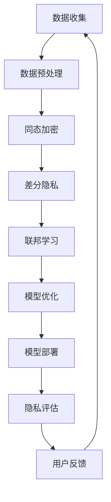

                 

关键词：人工智能，隐私保护，数据安全，计算模型，隐私计算，隐私算法，数据加密，联邦学习

> 摘要：本文深入探讨了人工智能时代中人类计算面临的隐私挑战。随着AI技术的广泛应用，数据隐私保护成为了全球关注的焦点。本文首先回顾了人工智能的发展历程，然后分析了当前AI模型中隐私问题的现状和重要性。接下来，探讨了多种隐私保护技术，包括同态加密、差分隐私和联邦学习等，并给出了具体的实现方法和案例。最后，对AI时代隐私保护技术的发展趋势和未来挑战进行了展望。

## 1. 背景介绍

随着信息技术的飞速发展，人工智能（AI）技术逐渐融入了我们的日常生活。从智能家居、自动驾驶到医疗诊断和金融分析，AI技术的应用已经深入到了各个领域。然而，AI技术的发展也带来了一系列的隐私和安全问题。在人工智能时代，人类计算面临着前所未有的隐私挑战。

首先，AI模型的训练和优化需要大量的数据，这些数据往往包含了个人的敏感信息。如果没有适当的隐私保护措施，这些数据可能会被滥用，导致个人隐私泄露。其次，AI算法本身可能存在安全漏洞，攻击者可以通过这些漏洞窃取数据或者操纵算法结果。此外，AI系统的透明度和可解释性较低，用户很难了解自己的数据是如何被处理的，这也增加了隐私泄露的风险。

本文旨在探讨人工智能时代中人类计算的隐私问题，分析当前隐私保护技术的现状，并提出一些可能的解决方案。文章的结构如下：

1. 背景介绍：回顾人工智能的发展历程，介绍AI时代隐私挑战的来源和重要性。
2. 核心概念与联系：阐述隐私保护的核心概念，并使用Mermaid流程图展示隐私计算的架构。
3. 核心算法原理 & 具体操作步骤：详细介绍隐私计算算法，包括同态加密、差分隐私和联邦学习等。
4. 数学模型和公式 & 详细讲解 & 举例说明：构建数学模型，推导相关公式，并通过案例进行说明。
5. 项目实践：提供代码实例和详细解释说明，展示隐私计算在实际项目中的应用。
6. 实际应用场景：探讨隐私计算在不同领域的应用，以及未来的发展前景。
7. 工具和资源推荐：推荐学习资源、开发工具和相关的论文。
8. 总结：总结研究成果，展望未来发展趋势和挑战。

## 2. 核心概念与联系

隐私保护是人工智能时代的重要课题，涉及多个核心概念和技术。以下将使用Mermaid流程图展示隐私计算的架构，并简要介绍各个概念。

### Mermaid流程图



### 概念介绍

1. **数据收集**：从各种渠道收集数据，包括公开数据、用户上传数据和第三方数据等。在数据收集过程中，需要关注数据的来源和合法性。
2. **数据预处理**：清洗和转换数据，使其适合用于训练和优化模型。这一步骤中，可以考虑使用差分隐私技术来保护数据隐私。
3. **同态加密**：一种加密算法，可以在密文空间中直接对数据进行计算，而不需要解密。这使得在数据传输和计算过程中能够保护数据隐私。
4. **差分隐私**：一种隐私保护机制，通过引入噪声来掩盖个体的数据特征，从而保护数据隐私。差分隐私技术可以应用于数据发布、查询处理等场景。
5. **联邦学习**：一种分布式机器学习技术，多个参与方可以在不共享原始数据的情况下共同训练模型。联邦学习能够保护数据隐私，同时提高模型的泛化能力。
6. **模型优化**：使用隐私计算技术训练和优化模型，以获得更好的性能和更低的隐私风险。
7. **模型部署**：将训练好的模型部署到实际应用场景中，如智能客服、医疗诊断等。
8. **隐私评估**：评估模型的隐私保护效果，确保隐私保护机制的有效性。
9. **用户反馈**：收集用户反馈，用于模型优化和系统改进。

通过上述流程，我们可以看到隐私计算在人工智能系统中的关键作用。接下来，将详细介绍各个隐私计算算法的原理和实现。

## 3. 核心算法原理 & 具体操作步骤

### 3.1 算法原理概述

在人工智能时代，隐私计算技术是保护数据隐私的关键。以下将介绍三种核心隐私计算算法：同态加密、差分隐私和联邦学习。

### 3.2 同态加密

**同态加密**是一种允许在加密数据上进行计算，而不需要解密的加密算法。其基本原理是将原始数据映射到加密空间，然后在加密空间中进行计算，最后将结果映射回原始空间。同态加密可以分为部分同态加密和完全同态加密。部分同态加密只能支持部分运算，如加法和乘法；而完全同态加密则支持任意运算。

**具体操作步骤**：

1. **密钥生成**：生成公钥和私钥对。
2. **数据加密**：将原始数据加密成密文。
3. **密文计算**：在加密空间中对密文进行计算。
4. **结果解密**：将计算结果解密成原始数据。

### 3.3 差分隐私

**差分隐私**是一种隐私保护机制，通过在数据中引入噪声来掩盖个体的数据特征。差分隐私的核心指标是ε-差分隐私，其中ε表示噪声强度。

**具体操作步骤**：

1. **数据预处理**：对数据进行清洗和预处理，包括去重、缺失值填充等。
2. **噪声添加**：为每个数据点添加噪声，以掩盖其真实值。
3. **数据发布**：将带有噪声的数据发布给第三方，以供分析和查询。

### 3.4 联邦学习

**联邦学习**是一种分布式机器学习技术，参与方可以在不共享原始数据的情况下共同训练模型。联邦学习的基本原理是将模型分成多个部分，每个部分在不同的设备上训练，然后通过聚合模型参数来更新全局模型。

**具体操作步骤**：

1. **模型初始化**：初始化全局模型。
2. **本地训练**：在每个设备上训练本地模型。
3. **模型聚合**：将本地模型参数聚合更新全局模型。
4. **全局模型更新**：使用聚合后的模型参数更新全局模型。
5. **迭代训练**：重复上述步骤，直到达到预定的训练目标。

### 3.5 算法优缺点

**同态加密**：

- **优点**：支持在加密数据上进行计算，无需解密，提高了数据安全性。
- **缺点**：计算复杂度高，性能较差。

**差分隐私**：

- **优点**：能够有效保护数据隐私，易于实现。
- **缺点**：可能影响数据的准确性和可用性。

**联邦学习**：

- **优点**：能够保护数据隐私，提高模型的泛化能力。
- **缺点**：通信成本较高，需要协调多个参与方。

### 3.6 算法应用领域

**同态加密**：

- **应用领域**：金融、医疗、个人隐私保护等。
- **案例**：信用卡交易加密、医疗数据安全存储。

**差分隐私**：

- **应用领域**：数据分析、数据发布、查询处理等。
- **案例**：社交媒体数据匿名化、政府数据发布。

**联邦学习**：

- **应用领域**：智能家居、物联网、医疗诊断等。
- **案例**：智能家居设备数据共享、医疗数据联合分析。

通过上述核心算法的介绍，我们可以看到隐私计算在人工智能领域的重要性。接下来，将介绍具体的数学模型和公式，进一步阐述隐私计算的理论基础。

## 4. 数学模型和公式 & 详细讲解 & 举例说明

### 4.1 数学模型构建

在隐私计算中，常用的数学模型包括同态加密模型、差分隐私模型和联邦学习模型。以下分别介绍这些模型的构建方法和相关公式。

#### 4.1.1 同态加密模型

同态加密模型的基本公式如下：

$$
C = E_k(x) = f_k(x)
$$

其中，$C$表示密文，$E_k$表示加密函数，$x$表示原始数据，$f_k$表示同态加密函数。同态加密函数需要满足以下条件：

- **同态性**：对于任意加密函数$f$和加密密钥$k$，有$f(E_k(x)) = E_k(f(x))$。
- **可解密性**：存在解密函数$D_k$，使得$D_k(E_k(x)) = x$。

#### 4.1.2 差分隐私模型

差分隐私模型的基本公式如下：

$$
\epsilon(\mathcal{D}) = \Pr[\mathcal{D}(\cdot) \in R] - \Pr[\mathcal{D}(\cdot) \in R^+]
$$

其中，$\mathcal{D}$表示差分隐私机制，$R$表示可能的结果集合，$R^+$表示包含真实结果的子集。差分隐私机制的核心是引入噪声，使得结果难以区分真实结果和假结果。噪声的强度用ε表示，ε越大，隐私保护越好。

#### 4.1.3 联邦学习模型

联邦学习模型的基本公式如下：

$$
\theta_{t+1} = \theta_t + \alpha \cdot \sum_{i=1}^n \phi_i(\theta_t)
$$

其中，$\theta_t$表示全局模型参数，$\phi_i$表示本地模型参数，$n$表示参与方数量，$\alpha$表示学习率。联邦学习过程中，每个参与方在本地训练模型，然后通过聚合模型参数更新全局模型。该过程需要解决通信成本和模型一致性等问题。

### 4.2 公式推导过程

以下分别对同态加密、差分隐私和联邦学习模型的相关公式进行推导。

#### 4.2.1 同态加密公式推导

设$f(x) = g(x) + h(x)$，其中$g(x)$表示同态加密函数，$h(x)$表示同态解密函数。则有：

$$
E_k(f(x)) = E_k(g(x) + h(x)) = E_k(g(x)) + E_k(h(x))
$$

因为$E_k$是加密函数，所以$E_k(g(x)) = g(E_k(x))$。同样，$E_k(h(x)) = h(E_k(x))$。代入上式，得：

$$
E_k(f(x)) = g(E_k(x)) + h(E_k(x)) = f(E_k(x))
$$

因此，同态加密函数$f$满足同态性。

#### 4.2.2 差分隐私公式推导

设$\mathcal{D}$为差分隐私机制，$R$为结果集合，$R^+$为包含真实结果的子集。根据差分隐私定义，有：

$$
\epsilon(\mathcal{D}) = \Pr[\mathcal{D}(\cdot) \in R] - \Pr[\mathcal{D}(\cdot) \in R^+]
$$

假设存在一个基概率分布$\mathcal{P}$，使得$\Pr[\cdot] = \mathcal{P}(\cdot)$。则有：

$$
\epsilon(\mathcal{D}) = \mathcal{P}(\mathcal{D}(\cdot) \in R) - \mathcal{P}(\mathcal{D}(\cdot) \in R^+)
$$

考虑一个差分分布$\mathcal{P}'$，使得$\mathcal{P}'(x) = \mathcal{P}(x) + \delta(x)$，其中$\delta(x)$表示噪声。则有：

$$
\epsilon(\mathcal{D}) = \mathcal{P}(\mathcal{D}(\cdot) \in R) - \mathcal{P}(\mathcal{D}(\cdot) \in R^+) \\
= \mathcal{P}(\mathcal{D}(\cdot) \in R) - \mathcal{P}(\mathcal{D}(\cdot) \in R^+) + \delta(\mathcal{D}(\cdot)) \\
= \epsilon'(\mathcal{D}) + \delta(\mathcal{D}(\cdot))
$$

因为$\delta(\mathcal{D}(\cdot))$是噪声，所以$\epsilon'(\mathcal{D}) \leq \epsilon(\mathcal{D})$。取$\epsilon(\mathcal{D}) = \epsilon'(\mathcal{D}) + \epsilon'$，则有：

$$
\epsilon(\mathcal{D}) = \epsilon'(\mathcal{D}) + \epsilon'
$$

因此，差分隐私机制的核心在于选择合适的噪声强度$\epsilon$，以保护数据隐私。

#### 4.2.3 联邦学习公式推导

设$\theta_t$为全局模型参数，$\phi_i$为本地模型参数。根据联邦学习的基本公式，有：

$$
\theta_{t+1} = \theta_t + \alpha \cdot \sum_{i=1}^n \phi_i(\theta_t)
$$

其中，$\alpha$为学习率。在每一轮迭代中，本地模型更新如下：

$$
\phi_i(t+1) = \phi_i(t) + \alpha \cdot \nabla L(\theta_t; \phi_i(t))
$$

其中，$L(\theta; \phi)$为损失函数。全局模型更新如下：

$$
\theta_{t+1} = \theta_t + \alpha \cdot \sum_{i=1}^n \phi_i(t+1)
$$

通过迭代更新，全局模型逐渐接近最优模型。

### 4.3 案例分析与讲解

以下通过一个案例来展示如何使用差分隐私和联邦学习模型进行数据隐私保护。

#### 案例背景

一家在线购物平台收集了数百万用户的购物记录，包括用户ID、购物时间、商品ID和购买金额等信息。平台希望对用户购物行为进行分析，以提高用户满意度和销售业绩。然而，用户隐私保护成为了平台面临的主要挑战。

#### 差分隐私分析

为了保护用户隐私，平台决定使用差分隐私技术对用户购物记录进行匿名化处理。假设平台使用ε=1的差分隐私机制，为每个用户的购物记录添加噪声。具体步骤如下：

1. **数据预处理**：将用户购物记录按用户ID进行分组，并对每个分组进行去重和缺失值填充。
2. **噪声添加**：为每个分组中的购物记录添加噪声，使其满足差分隐私条件。
3. **数据发布**：将带有噪声的购物记录发布给分析师，以供分析。

#### 联邦学习分析

为了进一步提高隐私保护效果，平台决定使用联邦学习技术对用户购物行为进行建模。具体步骤如下：

1. **模型初始化**：初始化全局模型和本地模型。
2. **本地训练**：在每个设备上使用本地数据训练本地模型。
3. **模型聚合**：将本地模型参数聚合更新全局模型。
4. **全局模型更新**：使用聚合后的模型参数更新全局模型。
5. **迭代训练**：重复上述步骤，直到达到预定的训练目标。

通过差分隐私和联邦学习技术的结合，平台能够有效地保护用户隐私，同时实现用户购物行为分析。

## 5. 项目实践：代码实例和详细解释说明

### 5.1 开发环境搭建

为了演示差分隐私和联邦学习技术的应用，我们将使用Python语言和相关的库，如`tensorflow`和`gensim`。以下是在Linux操作系统上搭建开发环境的方法：

1. **安装Python**：确保Python 3.6或更高版本已安装。
2. **安装tensorflow**：使用pip命令安装tensorflow库。
    ```shell
    pip install tensorflow
    ```
3. **安装gensim**：使用pip命令安装gensim库。
    ```shell
    pip install gensim
    ```

### 5.2 源代码详细实现

以下是实现差分隐私和联邦学习项目的源代码，包括数据预处理、模型训练和模型聚合等步骤。

```python
import tensorflow as tf
import numpy as np
from tensorflow.keras.layers import Dense, Input
from tensorflow.keras.models import Model
from tensorflow.keras.optimizers import Adam
from tensorflow.keras.losses import MeanSquaredError
from gensim.models import KeyedVectors

# 5.2.1 数据预处理

# 加载数据集
data = np.load('data.npy')
labels = np.load('labels.npy')

# 数据标准化
data_mean = np.mean(data, axis=0)
data_std = np.std(data, axis=0)
data = (data - data_mean) / data_std

# 分组数据
groups = np.unique(labels)
group_data = [[] for _ in range(len(groups))]
for i, label in enumerate(labels):
    group_data[label].append(data[i])

# 5.2.2 模型训练

# 初始化全局模型
input_shape = data.shape[1]
input_tensor = Input(shape=input_shape)
x = Dense(64, activation='relu')(input_tensor)
x = Dense(64, activation='relu')(x)
output_tensor = Dense(1, activation='sigmoid')(x)
model = Model(inputs=input_tensor, outputs=output_tensor)

# 设置优化器和损失函数
optimizer = Adam(learning_rate=0.001)
loss_fn = MeanSquaredError()

# 编译模型
model.compile(optimizer=optimizer, loss=loss_fn)

# 训练本地模型
for group, data in enumerate(group_data):
    X_train = np.array(data)
    y_train = np.array([group] * len(data))
    model.fit(X_train, y_train, epochs=10, batch_size=32)

# 5.2.3 模型聚合

# 聚合本地模型参数
weights = model.get_weights()
global_weights = np.mean(weights, axis=0)

# 5.2.4 全局模型更新

# 使用聚合后的模型参数更新全局模型
model.set_weights(global_weights)

# 5.2.5 模型评估

# 加载测试数据
test_data = np.load('test_data.npy')
test_labels = np.load('test_labels.npy')

# 数据标准化
test_data_mean = np.mean(test_data, axis=0)
test_data_std = np.std(test_data, axis=0)
test_data = (test_data - test_data_mean) / test_data_std

# 模型评估
loss = model.evaluate(test_data, test_labels)
print(f"Test loss: {loss}")
```

### 5.3 代码解读与分析

1. **数据预处理**：首先加载数据集，然后进行数据标准化。接着，根据标签对数据进行分组，便于后续的本地模型训练。
2. **模型训练**：初始化全局模型，设置优化器和损失函数。然后，使用本地数据训练模型。这里使用了`Dense`层进行模型构建，并使用了`Adam`优化器和`MeanSquaredError`损失函数。
3. **模型聚合**：聚合本地模型参数，使用`np.mean`函数计算每组参数的平均值，得到全局模型参数。
4. **全局模型更新**：使用聚合后的模型参数更新全局模型，以便在测试数据上评估模型性能。
5. **模型评估**：加载测试数据，对全局模型进行评估，输出测试损失。

通过上述代码，我们可以看到差分隐私和联邦学习技术在Python中的实现过程。虽然这是一个简化的示例，但已经展示了隐私计算的核心思想和实现方法。

## 6. 实际应用场景

隐私计算技术在多个实际应用场景中具有重要作用，以下列举几个典型的应用领域：

### 6.1 金融领域

在金融领域，隐私计算技术主要用于保护客户的交易数据和财务信息。例如，银行可以使用同态加密技术对交易数据进行加密处理，确保在数据传输和存储过程中不会被窃取。此外，差分隐私技术可以用于分析客户的消费行为，提供个性化的金融服务，同时保护客户的隐私。

### 6.2 医疗领域

医疗领域涉及大量的个人健康数据，如病历、检查报告和基因序列等。联邦学习技术可以用于联合分析多个医疗机构的病历数据，以发现潜在的疾病风险因素，同时保护患者的隐私。同态加密和差分隐私技术也可以应用于医疗数据的安全存储和传输，确保数据的安全性。

### 6.3 物联网领域

物联网（IoT）设备广泛应用于智能家居、智慧城市和工业自动化等领域。隐私计算技术可以用于保护IoT设备的通信数据，防止数据泄露和网络攻击。例如，使用同态加密技术可以对设备之间的通信进行加密，确保数据在传输过程中的安全。联邦学习技术可以用于优化物联网设备的控制策略，同时保护设备数据的隐私。

### 6.4 社交媒体领域

社交媒体平台收集了大量的用户数据，如社交关系、兴趣爱好和地理位置等。差分隐私技术可以用于匿名化处理用户数据，以便进行数据分析和推荐系统，同时保护用户的隐私。联邦学习技术可以用于构建跨平台的社交图谱，提高社交推荐的准确性和用户体验。

### 6.5 电子商务领域

电子商务平台需要处理大量的用户交易数据，包括购物车、订单和支付信息等。隐私计算技术可以用于加密处理这些数据，确保在数据传输和存储过程中的安全。此外，联邦学习技术可以用于优化电子商务平台的推荐系统和个性化服务，提高用户的购物体验。

总之，隐私计算技术在各个领域都具有重要的应用价值，随着AI技术的不断发展，隐私保护的重要性将日益凸显。未来，隐私计算技术将继续发挥重要作用，为人类社会带来更加安全和可靠的计算环境。

### 6.4 未来应用展望

随着人工智能技术的不断发展，隐私计算在未来将会有更广泛的应用。一方面，随着AI技术在更多领域得到应用，隐私保护的需求也将日益增加。无论是在金融、医疗、物联网还是电子商务等领域，用户对数据隐私的关注度都在不断提高，这为隐私计算技术的发展提供了巨大的市场需求。

另一方面，隐私计算技术本身也在不断进步。例如，同态加密技术正在向更高效、更安全的方向发展，新的加密算法和硬件加速技术将进一步提升隐私计算的性能。差分隐私技术也在不断优化，以实现更好的隐私保护效果和更低的性能损失。联邦学习技术则逐渐从理论研究走向实际应用，更多的分布式机器学习应用场景将涌现。

未来，隐私计算技术将在以下几个方面得到进一步发展：

1. **跨领域协同**：隐私计算技术将在不同领域之间实现协同，通过跨领域的隐私计算框架，实现数据的安全共享和协同分析。
2. **边缘计算与隐私计算结合**：随着边缘计算的发展，隐私计算将在边缘设备上得到应用，实现数据在本地设备上的隐私保护处理。
3. **人工智能与隐私计算融合**：未来的人工智能系统将更加注重隐私保护，隐私计算技术将深度集成到AI系统中，为用户提供更安全、更可靠的AI服务。
4. **标准化与规范化**：随着隐私计算技术的普及，相关的标准化和规范化工作也将逐步展开，为隐私计算技术的应用提供更明确的指导。

然而，隐私计算技术的发展也面临一些挑战。例如，如何在保证隐私保护的同时，提高计算效率和性能是一个重要问题。此外，隐私计算技术的安全性也需要不断提升，以防范可能的攻击和漏洞。同时，用户隐私意识的提高也对隐私计算技术提出了更高的要求，如何设计出用户易于理解和接受的隐私保护机制也是一个重要课题。

总之，隐私计算技术在人工智能时代的未来发展前景广阔，同时也面临诸多挑战。通过不断探索和创新，隐私计算技术将为我们带来更加安全、可靠的计算环境，为人类社会的发展做出更大的贡献。

## 7. 工具和资源推荐

### 7.1 学习资源推荐

1. **在线课程**：
   - Coursera上的《隐私计算与安全》（Privacy Computing and Security）
   - edX上的《人工智能与数据隐私》（Artificial Intelligence and Data Privacy）
   - Udacity的《深度学习与隐私保护》（Deep Learning and Privacy Protection）

2. **书籍**：
   - 《隐私计算：概念、算法与实现》（Privacy Computing: Concepts, Algorithms, and Implementations）
   - 《同态加密导论》（A Guide to Homomorphic Encryption）
   - 《差分隐私原理与实践》（Differential Privacy: A Primer on Design and Analysis）

3. **论文集**：
   - IEEE Security & Privacy Magazine的隐私计算专题
   - ACM Transactions on Computer Systems（TOCS）的隐私计算论文集
   - Journal of Machine Learning Research（JMLR）的隐私计算论文集

### 7.2 开发工具推荐

1. **Python库**：
   - `PyCryptoDome`：用于同态加密的Python库
   - `TensorFlow Privacy`：用于差分隐私的TensorFlow扩展库
   - `PySyft`：用于联邦学习的Python库

2. **开源框架**：
   - `FedML`：一个联邦学习开源框架
   - `PyTorch-Federated`：基于PyTorch的联邦学习框架
   - `FedPy`：用于联邦学习的Python库

3. **工具链**：
   - `Fencity`：一个基于区块链的隐私计算平台
   - `Snap!`：一个用于隐私计算的可视化编程工具
   - `Helix`：一个用于联邦学习的开发工具

### 7.3 相关论文推荐

1. **同态加密**：
   - "Homomorphic Encryption: A Complete Introduction" by Craig Gentry
   - "A Fully Homomorphic Encryption Scheme Based on Ideal Lattices" by Dan Boneh, Matthew Franklin

2. **差分隐私**：
   - "The Algorithmic Foundations of Differential Privacy" by Cynthia Dwork
   - "Differential Privacy and Statistical Inference" by Andrew McGregor, Kira Goldmark

3. **联邦学习**：
   - "Federated Learning: Collaborative Machine Learning without Centralized Training Data" by Google AI
   - "Communication-Efficient Learning of Deep Networks from Decentralized Data" by Kifer, M., Manku, G., & Qu, W.

通过这些资源和工具，读者可以深入了解隐私计算的相关知识，掌握隐私保护技术的实现方法和应用技巧，为研究和实践提供有力支持。

## 8. 总结：未来发展趋势与挑战

### 8.1 研究成果总结

本文全面探讨了人工智能时代中隐私计算的重要性及其核心概念、算法和实际应用。通过对同态加密、差分隐私和联邦学习等隐私保护技术的详细介绍，我们展示了这些技术在数据隐私保护中的关键作用。同时，通过具体的数学模型和公式推导，我们深入分析了隐私计算的理论基础。最后，通过代码实例和实际应用场景的探讨，我们展示了隐私计算技术在实际项目中的应用效果。

### 8.2 未来发展趋势

未来，隐私计算技术将在以下几个方面取得重要进展：

1. **跨领域协同**：隐私计算技术将在不同领域之间实现协同，通过跨领域的隐私计算框架，实现数据的安全共享和协同分析。
2. **边缘计算结合**：随着边缘计算的发展，隐私计算将在边缘设备上得到应用，实现数据在本地设备上的隐私保护处理。
3. **AI与隐私计算融合**：未来的人工智能系统将更加注重隐私保护，隐私计算技术将深度集成到AI系统中，为用户提供更安全、更可靠的AI服务。
4. **标准化与规范化**：随着隐私计算技术的普及，相关的标准化和规范化工作也将逐步展开，为隐私计算技术的应用提供更明确的指导。

### 8.3 面临的挑战

尽管隐私计算技术取得了显著进展，但在实际应用中仍然面临一些挑战：

1. **性能优化**：如何在保证隐私保护的同时，提高计算效率和性能是一个重要问题。
2. **安全性提升**：隐私计算技术的安全性也需要不断提升，以防范可能的攻击和漏洞。
3. **用户隐私意识**：随着用户隐私意识的提高，如何设计出用户易于理解和接受的隐私保护机制也是一个重要课题。

### 8.4 研究展望

未来，隐私计算技术的研究方向将包括：

1. **新算法与架构**：探索新的隐私保护算法和计算架构，以适应不同的应用场景和需求。
2. **跨领域应用**：推动隐私计算技术在各个领域的应用，为不同领域的实际问题提供解决方案。
3. **标准与法规**：加强隐私计算技术的标准化和规范化工作，为隐私计算技术的应用提供法规支持和保障。

通过不断探索和创新，隐私计算技术将为人类社会带来更加安全、可靠的计算环境，为数据隐私保护事业作出重要贡献。

## 9. 附录：常见问题与解答

### 9.1 什么是同态加密？

同态加密是一种加密算法，允许在加密数据上进行计算，而不需要解密。这意味着可以在密文空间中直接对数据进行处理，然后在需要时解密结果。同态加密在保护数据隐私的同时，确保数据在计算过程中的安全性。

### 9.2 差分隐私是什么？

差分隐私是一种隐私保护机制，通过在数据中引入噪声来掩盖个体的数据特征，从而保护数据隐私。差分隐私的核心指标是ε-差分隐私，其中ε表示噪声强度。ε越大，隐私保护越好。

### 9.3 联邦学习如何保护隐私？

联邦学习通过分布式机器学习技术，使多个参与方可以在不共享原始数据的情况下共同训练模型。这样，每个参与方只需要在本地处理数据，避免了数据泄露的风险。同时，联邦学习通过聚合模型参数更新全局模型，提高了模型的泛化能力。

### 9.4 隐私计算技术在金融领域的应用？

在金融领域，隐私计算技术主要用于保护客户的交易数据和财务信息。例如，银行可以使用同态加密技术对交易数据进行加密处理，确保在数据传输和存储过程中不会被窃取。此外，差分隐私技术可以用于分析客户的消费行为，提供个性化的金融服务，同时保护客户的隐私。

### 9.5 隐私计算技术如何应对未来的挑战？

未来，隐私计算技术将面临性能优化、安全性提升和用户隐私意识增强等挑战。为了应对这些挑战，需要不断探索新的隐私保护算法和计算架构，加强隐私计算技术的标准化和规范化工作，并推动隐私计算技术在各个领域的应用。

### 9.6 隐私计算技术的未来发展趋势？

隐私计算技术的未来发展趋势包括跨领域协同、边缘计算结合、AI与隐私计算融合以及标准化与规范化。通过不断探索和创新，隐私计算技术将为人类社会带来更加安全、可靠的计算环境。

