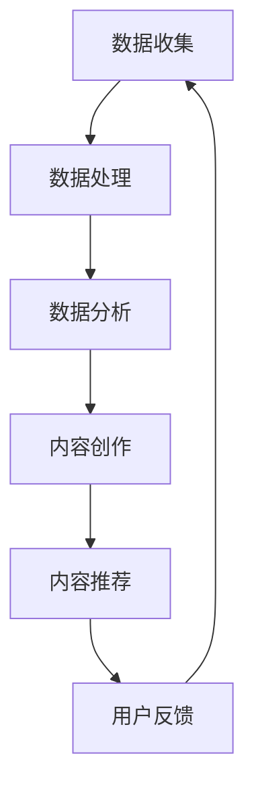

                 

 在这个人工智能迅速发展的时代，出版业正经历着前所未有的变革。数据驱动的理念已经深入到出版业的各个方面，从内容创作到分发，再到用户体验，人工智能技术正在重塑整个行业。本文将探讨AI在出版业的应用，分析其带来的变革，并展望未来可能的发展趋势。

## 文章关键词
- AI
- 出版业
- 数据驱动
- 场景创新
- 用户体验
- 内容分发

## 文章摘要
本文将从AI在出版业的应用场景出发，探讨数据驱动理念如何影响内容创作、分发和用户体验。通过分析AI技术在实际操作中的具体应用，我们将探讨这些技术如何推动出版业的创新发展。同时，本文还将讨论未来出版业可能面临的发展趋势和挑战，为行业从业者提供一些有益的思考。

## 1. 背景介绍
### 1.1 出版业的现状
在传统的出版业中，内容创作、编辑、排版、印刷、发行等环节都是线性的，需要耗费大量的人力物力。随着数字出版的发展，电子书、在线阅读等新型阅读方式逐渐普及，出版业开始从传统的纸质媒体向数字化媒体转型。然而，这种转型并不容易，出版业面临着诸多挑战，如版权保护、内容质量控制、用户需求变化等。

### 1.2 数据驱动的兴起
随着大数据、云计算、人工智能等技术的发展，数据驱动已经成为各行各业的发展趋势。在出版业，数据驱动的理念意味着通过收集和分析用户数据，优化内容创作、分发和用户体验，从而提高出版物的质量和用户满意度。数据驱动的出版业不仅能够更好地满足用户需求，还能够提高出版效率，降低成本。

## 2. 核心概念与联系
### 2.1 数据驱动的出版业
数据驱动的出版业是指通过收集、分析和应用数据来指导出版活动的整个过程。这包括用户行为分析、内容推荐、广告投放、版权管理等多个方面。

### 2.2 人工智能在出版业的应用
人工智能在出版业的应用主要体现在内容创作、内容推荐、用户行为分析等方面。通过自然语言处理、机器学习等技术，AI能够帮助出版业实现个性化推荐、智能写作、智能编辑等功能。

### 2.3 Mermaid 流程图


## 3. 核心算法原理 & 具体操作步骤

### 3.1 算法原理概述
在数据驱动的出版业中，核心算法主要包括自然语言处理（NLP）、推荐系统、机器学习等。

- 自然语言处理：用于理解用户的需求和反馈，提取关键信息，进行内容创作和编辑。
- 推荐系统：根据用户的阅读历史、兴趣偏好，推荐符合用户需求的内容。
- 机器学习：用于分析大量数据，发现规律，优化内容创作和推荐策略。

### 3.2 算法步骤详解
1. 数据收集：通过网站访问日志、用户评论、社交媒体数据等多种途径收集用户数据。
2. 数据预处理：清洗、去重、分词、编码等，将原始数据转化为机器可以处理的形式。
3. 特征提取：从预处理后的数据中提取出有用的特征，用于训练模型。
4. 模型训练：使用机器学习算法，对特征进行训练，建立预测模型。
5. 模型评估：使用验证集或测试集评估模型的效果，调整参数，优化模型。
6. 应用模型：将训练好的模型应用于实际场景，如内容创作、内容推荐等。

### 3.3 算法优缺点
- 优点：提高内容创作和推荐的效率，更好地满足用户需求。
- 缺点：对算法的依赖性较高，需要大量的数据和计算资源，且模型的解释性较差。

### 3.4 算法应用领域
- 内容创作：自动生成文章、摘要、标题等。
- 内容推荐：根据用户的兴趣和阅读历史，推荐相关内容。
- 用户行为分析：预测用户的阅读行为，优化用户体验。

## 4. 数学模型和公式

### 4.1 数学模型构建
在数据驱动的出版业中，常见的数学模型包括线性回归、逻辑回归、决策树、神经网络等。

### 4.2 公式推导过程
- 线性回归：
  $$ y = \beta_0 + \beta_1x_1 + \beta_2x_2 + ... + \beta_nx_n $$
- 逻辑回归：
  $$ P(y=1) = \frac{1}{1 + e^{-(\beta_0 + \beta_1x_1 + \beta_2x_2 + ... + \beta_nx_n )}} $$

### 4.3 案例分析与讲解
以内容推荐为例，假设我们使用协同过滤算法进行内容推荐，其目标是最小化用户兴趣与推荐内容之间的差距。

$$ \min \sum_{i=1}^{n} (u_i - r_i)^2 $$

其中，$u_i$表示用户$i$的实际兴趣，$r_i$表示用户$i$对推荐内容的兴趣。

## 5. 项目实践：代码实例和详细解释说明

### 5.1 开发环境搭建
1. 安装Python环境
2. 安装相关库，如numpy、pandas、scikit-learn等

### 5.2 源代码详细实现
```python
# 导入相关库
import numpy as np
import pandas as pd
from sklearn.model_selection import train_test_split
from sklearn.metrics.pairwise import cosine_similarity
from sklearn.neighbors import NearestNeighbors

# 读取数据
data = pd.read_csv('data.csv')

# 数据预处理
# ...

# 特征提取
# ...

# 训练模型
# ...

# 模型评估
# ...

# 应用模型
# ...
```

### 5.3 代码解读与分析
代码主要分为以下几个部分：
1. 数据预处理：对原始数据进行清洗、去重、编码等操作。
2. 特征提取：从预处理后的数据中提取出有用的特征。
3. 模型训练：使用机器学习算法训练模型。
4. 模型评估：评估模型的效果。
5. 应用模型：将训练好的模型应用于实际场景。

### 5.4 运行结果展示
1. 模型效果评估报告
2. 用户推荐结果展示

## 6. 实际应用场景

### 6.1 电子书平台
电子书平台可以利用AI技术实现个性化推荐、自动摘要、内容生成等功能，提高用户体验。

### 6.2 新闻出版
新闻出版可以利用AI技术进行内容审核、舆情监测、新闻推荐等，提高新闻的准确性和时效性。

### 6.3 教育出版
教育出版可以利用AI技术进行个性化教学、智能辅导、学习效果评估等，提高教育质量。

### 6.4 未来应用展望
随着AI技术的不断发展，未来出版业将可能出现更多基于AI的应用，如虚拟现实（VR）阅读、增强现实（AR）阅读、智能写作助手等。

## 7. 工具和资源推荐

### 7.1 学习资源推荐
1. 《深度学习》
2. 《机器学习实战》
3. 《数据科学实战》

### 7.2 开发工具推荐
1. Jupyter Notebook
2. PyCharm
3. TensorFlow

### 7.3 相关论文推荐
1. "Recommender Systems Handbook"
2. "Deep Learning for Natural Language Processing"
3. "Generative Adversarial Networks: An Overview"

## 8. 总结：未来发展趋势与挑战

### 8.1 研究成果总结
AI在出版业的应用已经取得了一系列的成果，如个性化推荐、内容生成、用户行为分析等。

### 8.2 未来发展趋势
1. 更多的数据将用于指导出版活动。
2. 更多的AI技术将应用于出版业的各个环节。
3. 出版业将更加智能化、个性化。

### 8.3 面临的挑战
1. 数据隐私和安全问题。
2. AI算法的可解释性问题。
3. 技术和人才的不足。

### 8.4 研究展望
未来，出版业将更加依赖AI技术，如何在保证数据隐私和安全的前提下，充分利用AI技术，推动出版业的创新发展，是一个值得深入研究的课题。

## 9. 附录：常见问题与解答

### 9.1 数据隐私问题
如何保护用户隐私是AI在出版业应用中的一个重要问题。在实际操作中，可以通过数据加密、匿名化处理等方式来保护用户隐私。

### 9.2 AI算法的解释性
AI算法的解释性一直是业界关注的焦点。为了提高算法的可解释性，可以通过可视化、解释模型等方式来增强算法的解释性。

### 9.3 技术和人才的不足
出版业在AI技术方面的积累相对较少，需要加强技术研究和人才培养，提高行业整体的技术水平。

作者：禅与计算机程序设计艺术 / Zen and the Art of Computer Programming
```markdown

```<|user|>

