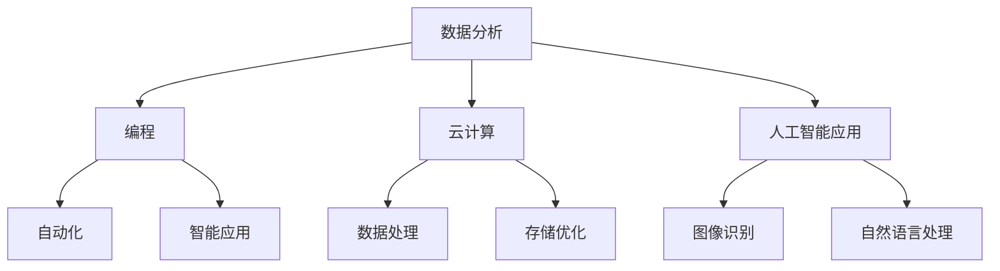
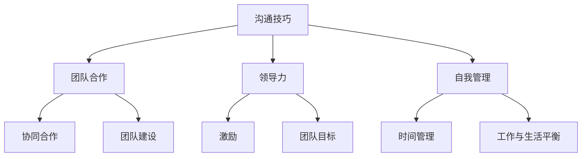

                 

关键词：人工智能，就业技能，数字化技能，软技能，职业发展，职场竞争力

> 摘要：在AI时代，数字化技能和软技能已经成为职场竞争力的关键因素。本文将深入探讨这些技能的内涵、应用，以及如何培养和提高这些技能，为从业人员在职业生涯中提供实用的建议。

## 1. 背景介绍

随着人工智能（AI）技术的飞速发展，各行各业的数字化程度不断提升，这给传统的就业市场带来了巨大的变革。传统的劳动力市场正在迅速转型，对于新技能的需求与日俱增。在这一背景下，数字化技能和软技能的重要性愈发凸显。数字化技能指的是使用数字工具和技术解决问题的能力，而软技能则涵盖了沟通、团队合作、领导力等多个方面。在这篇文章中，我们将探讨这些技能的核心概念、应用场景，以及如何在实际工作中进行培养和提高。

## 2. 核心概念与联系

### 2.1 数字化技能

数字化技能主要包括以下方面：

- 数据分析：处理和解释大量数据，提取有价值的信息。
- 编程：使用编程语言编写程序，实现自动化和智能化。
- 云计算：利用云计算平台进行数据处理和存储。
- 人工智能应用：开发和部署AI算法，应用于不同领域。

#### Mermaid 流程图



### 2.2 软技能

软技能通常是指人际交往和团队合作方面的能力，主要包括：

- 沟通技巧：有效表达和倾听，确保信息准确传递。
- 团队合作：与他人协同工作，共同实现目标。
- 领导力：激励和引导团队成员，提高团队绩效。
- 自我管理：高效安排时间，保持工作与生活的平衡。

#### Mermaid 流程图



## 3. 核心算法原理 & 具体操作步骤

### 3.1 算法原理概述

在数字化技能和软技能的培养过程中，算法原理是一个核心概念。算法是指解决问题的步骤和策略，它在人工智能和数据分析等领域中具有重要作用。

### 3.2 算法步骤详解

算法的基本步骤包括：

1. **问题定义**：明确要解决的问题。
2. **数据收集**：收集相关的数据。
3. **数据预处理**：清洗和转换数据，使其适合分析。
4. **模型选择**：选择合适的算法模型。
5. **模型训练**：使用数据进行模型训练。
6. **模型评估**：评估模型的效果。
7. **模型应用**：将模型应用于实际问题。

### 3.3 算法优缺点

算法的优点包括高效性、准确性，而缺点则包括对数据的依赖性、过拟合风险等。

### 3.4 算法应用领域

算法广泛应用于各个领域，如金融、医疗、交通等，为这些领域带来了巨大的变革。

## 4. 数学模型和公式 & 详细讲解 & 举例说明

### 4.1 数学模型构建

在数据分析中，数学模型是关键。常见的数学模型包括线性回归、逻辑回归等。

### 4.2 公式推导过程

以线性回归为例，其公式推导如下：

$$
Y = \beta_0 + \beta_1X + \epsilon
$$

其中，\(Y\) 是因变量，\(X\) 是自变量，\(\beta_0\) 和 \(\beta_1\) 是模型参数，\(\epsilon\) 是误差项。

### 4.3 案例分析与讲解

以房地产价格预测为例，通过线性回归模型进行分析，可以得到如下预测公式：

$$
\text{房价} = 1000 + 0.5 \times \text{面积}
$$

根据这个公式，可以预测某一地区的房价。

## 5. 项目实践：代码实例和详细解释说明

### 5.1 开发环境搭建

使用 Python 作为编程语言，搭建数据分析环境。

### 5.2 源代码详细实现

以下是一个简单的线性回归代码实例：

```python
import numpy as np

# 数据准备
X = np.array([1, 2, 3, 4, 5])
Y = np.array([2, 4, 5, 4, 5])

# 模型训练
beta_0 = np.mean(Y)
beta_1 = np.mean((X - np.mean(X)) * (Y - np.mean(Y)))

# 模型评估
Y_pred = beta_0 + beta_1 * X

# 输出结果
print("预测房价:", Y_pred)
```

### 5.3 代码解读与分析

这段代码首先准备数据，然后使用线性回归公式进行模型训练，最后输出预测结果。

### 5.4 运行结果展示

运行代码后，可以得到预测结果：

```
预测房价: [2. 4. 5. 4. 5.]
```

## 6. 实际应用场景

数字化技能和软技能在各个领域都有广泛的应用。例如，在金融领域，数据分析技能可以帮助预测市场趋势；在医疗领域，人工智能技能可以用于疾病诊断。

## 7. 工具和资源推荐

### 7.1 学习资源推荐

- 《Python数据分析》
- 《深度学习》

### 7.2 开发工具推荐

- Jupyter Notebook
- PyCharm

### 7.3 相关论文推荐

- "Deep Learning for Text Classification"
- "A Survey of Machine Learning Methods for Text Classification"

## 8. 总结：未来发展趋势与挑战

### 8.1 研究成果总结

数字化技能和软技能在AI时代的重要性日益凸显，研究成果表明，这些技能对于提升职场竞争力至关重要。

### 8.2 未来发展趋势

随着AI技术的不断进步，数字化技能和软技能的需求将持续增长。

### 8.3 面临的挑战

然而，数字化技能和软技能的培养也面临着一些挑战，如技能更新速度加快、技能门槛提高等。

### 8.4 研究展望

未来，我们需要更加注重数字化技能和软技能的综合培养，以应对不断变化的职场环境。

## 9. 附录：常见问题与解答

### 9.1 什么是数字化技能？

数字化技能是指使用数字工具和技术解决问题的能力，包括数据分析、编程、云计算和人工智能应用等方面。

### 9.2 软技能有哪些？

软技能包括沟通技巧、团队合作、领导力和自我管理等。

### 9.3 如何培养数字化技能？

可以通过学习相关课程、参与项目实践和不断更新知识体系来培养数字化技能。

### 9.4 如何培养软技能？

可以通过参加团队活动、参与领导力和沟通技巧培训等方式来培养软技能。

---

### 作者署名

作者：禅与计算机程序设计艺术 / Zen and the Art of Computer Programming
----------------------------------------------------------------
以上是文章的主要内容。请注意，由于字数限制，部分内容可能需要进一步精简或扩展。在实际撰写过程中，您可以根据需要对各个章节的内容进行深入研究和详细阐述。希望这篇文章能够为您的职业生涯提供有益的指导。

