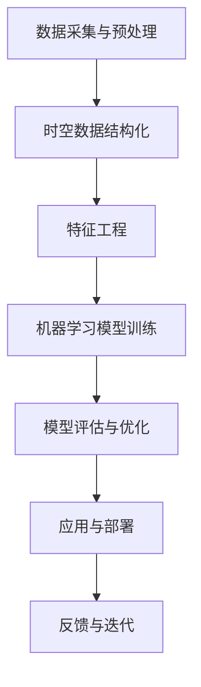

                 

关键词：AI时空建模，技术基础，机器学习，时空数据，模型优化，应用领域

> 摘要：本文将深入探讨AI时空建模的技术基础，分析其核心概念、算法原理、数学模型以及实际应用场景。通过详细的讲解和实例分析，读者将能够更好地理解AI时空建模的精髓，并为其未来的发展提供参考。

## 1. 背景介绍

随着物联网、大数据、云计算等技术的迅猛发展，时空数据已成为数据科学领域的重要组成部分。时空建模旨在通过分析和理解时空数据中的模式和规律，为各个领域提供智能化的决策支持和解决方案。例如，在交通管理中，通过时空建模可以预测交通流量，优化路线规划；在智慧城市建设中，通过时空建模可以优化资源分配，提升城市治理水平。

AI时空建模作为人工智能与时空数据融合的产物，具有广泛的应用前景。它不仅能够处理复杂多维时空数据，还能够通过机器学习、深度学习等技术实现自动化、智能化的建模与预测。然而，AI时空建模技术的发展也面临诸多挑战，如数据质量、计算效率、模型解释性等。

## 2. 核心概念与联系

为了更好地理解AI时空建模，我们需要先了解其中的核心概念和联系。以下是一个简化的Mermaid流程图，展示了AI时空建模的主要组件和关系：



### 2.1 数据采集与预处理

数据采集与预处理是AI时空建模的基础。在这一阶段，我们需要收集大量的时空数据，如位置信息、时间戳、传感器数据等。这些数据通常是非结构化的，需要进行清洗、去噪、填充缺失值等预处理操作，以确保数据质量。

### 2.2 时空数据结构化

预处理后的时空数据需要结构化，以便后续的特征工程和模型训练。结构化过程包括数据分片、索引建立、时间序列重构等。这一阶段的目标是使数据符合模型训练的要求。

### 2.3 特征工程

特征工程是时空建模的关键步骤。在这一阶段，我们需要从原始数据中提取出具有代表性的特征，如时间间隔、地理距离、速度等。这些特征将用于训练机器学习模型。

### 2.4 机器学习模型训练

机器学习模型训练是AI时空建模的核心。通过训练，模型将学习到时空数据中的模式和规律，从而实现对未知数据的预测。常见的机器学习算法包括线性回归、决策树、支持向量机、神经网络等。

### 2.5 模型评估与优化

模型评估与优化是确保模型性能的重要环节。在这一阶段，我们需要使用各种评估指标，如准确率、召回率、F1分数等，对模型进行评估。如果模型性能不满足要求，我们需要通过调整参数、增加训练数据等方式进行优化。

### 2.6 应用与部署

模型训练完成后，我们需要将其应用于实际场景。这通常涉及到将模型部署到服务器、云平台等环境，以便进行实时预测和决策支持。应用与部署过程还需要考虑模型的解释性、可扩展性等因素。

### 2.7 反馈与迭代

应用过程中，模型的效果可能会受到各种因素的影响，如数据质量、环境变化等。为了持续提升模型性能，我们需要收集实际应用中的反馈信息，并将其用于模型的迭代优化。

## 3. 核心算法原理 & 具体操作步骤

### 3.1 算法原理概述

AI时空建模的核心算法主要包括时空特征提取、时空预测模型和时空序列分析。以下是对这些算法的简要概述：

### 3.1.1 时空特征提取

时空特征提取是时空建模的关键步骤。其主要任务是提取时空数据中的关键特征，如时间序列特征、空间特征和事件特征。这些特征将用于训练预测模型。

### 3.1.2 时空预测模型

时空预测模型旨在对时空数据进行预测。常见的时空预测模型包括基于线性回归的模型、基于神经网络的模型和基于贝叶斯的模型。这些模型通过学习时空数据中的模式和规律，实现对未知数据的预测。

### 3.1.3 时空序列分析

时空序列分析是分析时空数据中的序列特征，如趋势、周期性、突变等。这一分析有助于我们理解时空数据中的内在规律，从而为预测和决策提供支持。

### 3.2 算法步骤详解

#### 3.2.1 数据采集与预处理

数据采集与预处理主要包括以下步骤：

1. 数据采集：从各种数据源（如传感器、日志、社交媒体等）收集时空数据。
2. 数据清洗：去除噪声数据、填充缺失值、去除重复数据等。
3. 数据转换：将时空数据转换为适合模型训练的格式，如时间序列、图像、表格等。

#### 3.2.2 时空数据结构化

时空数据结构化主要包括以下步骤：

1. 数据分片：将大量时空数据划分为若干个子集，以便于后续处理。
2. 索引建立：为时空数据建立索引，以提高查询和处理的效率。
3. 时间序列重构：将时空数据重构为时间序列，以便于后续的特征提取和模型训练。

#### 3.2.3 特征工程

特征工程主要包括以下步骤：

1. 时间特征提取：提取时间序列中的趋势、周期性、突变等特征。
2. 空间特征提取：提取地理空间中的位置、距离、方向等特征。
3. 事件特征提取：提取事件发生的时间、地点、类型等特征。

#### 3.2.4 机器学习模型训练

机器学习模型训练主要包括以下步骤：

1. 数据划分：将时空数据划分为训练集、验证集和测试集。
2. 模型选择：选择合适的机器学习模型，如线性回归、决策树、神经网络等。
3. 模型训练：使用训练集数据对模型进行训练，调整模型参数。
4. 模型评估：使用验证集数据评估模型性能，选择最优模型。

#### 3.2.5 模型评估与优化

模型评估与优化主要包括以下步骤：

1. 模型评估：使用测试集数据评估模型性能，计算评估指标（如准确率、召回率等）。
2. 模型优化：根据评估结果，调整模型参数、增加训练数据等，以提高模型性能。

#### 3.2.6 应用与部署

应用与部署主要包括以下步骤：

1. 模型部署：将训练好的模型部署到服务器或云平台，进行实时预测和决策支持。
2. 模型解释：对模型进行解释，以便用户理解模型的工作原理和预测结果。
3. 模型更新：根据实际应用中的反馈信息，对模型进行迭代优化。

### 3.3 算法优缺点

每种算法都有其优缺点。以下是对常见时空建模算法优缺点的简要分析：

#### 3.3.1 线性回归

优点：简单易懂，易于实现和优化。

缺点：对非线性关系的表现能力较差，容易过拟合。

#### 3.3.2 决策树

优点：直观易懂，能够处理非线性和多分类问题。

缺点：容易过拟合，对大量特征的处理能力较差。

#### 3.3.3 支持向量机

优点：强大的分类和回归能力，对小样本数据的处理效果较好。

缺点：计算复杂度高，对非线性关系的处理能力较差。

#### 3.3.4 神经网络

优点：强大的非线性建模能力，能够处理复杂的问题。

缺点：计算复杂度高，参数调整复杂。

### 3.4 算法应用领域

AI时空建模技术广泛应用于多个领域，包括但不限于：

1. **交通管理**：通过时空建模预测交通流量，优化交通路线规划。
2. **智慧城市**：通过时空建模优化资源分配，提升城市治理水平。
3. **应急管理**：通过时空建模预测自然灾害发生时间、地点，提前预警。
4. **金融市场**：通过时空建模分析市场趋势，进行投资决策。
5. **智能医疗**：通过时空建模预测患者病情变化，提供个性化治疗方案。

## 4. 数学模型和公式 & 详细讲解 & 举例说明

### 4.1 数学模型构建

AI时空建模中的数学模型通常包括以下几种类型：

1. **时间序列模型**：如ARIMA、AR、MA、ARMA等。
2. **空间模型**：如Kriging、GIS空间分析等。
3. **时空融合模型**：如时空神经网络、时空增强模型等。

以下是一个时间序列模型的构建示例：

$$
\text{X}_t = c + \alpha \text{X}_{t-1} + \beta \text{X}_{t-2} + \epsilon_t
$$

其中，$c$是常数项，$\alpha$和$\beta$是系数，$\text{X}_t$是时间序列的第$t$个值，$\epsilon_t$是误差项。

### 4.2 公式推导过程

以ARIMA模型为例，其公式推导过程如下：

1. **差分变换**：对原始时间序列进行差分变换，使其成为平稳序列。
$$
\Delta \text{X}_t = \text{X}_t - \text{X}_{t-1}
$$

2. **自回归项**：将差分后的序列表示为自回归模型。
$$
\Delta \text{X}_t = \phi_1 \Delta \text{X}_{t-1} + \phi_2 \Delta \text{X}_{t-2} + \epsilon_t
$$

3. **移动平均项**：将自回归模型中的误差项表示为移动平均模型。
$$
\epsilon_t = \theta_1 \epsilon_{t-1} + \theta_2 \epsilon_{t-2} + \cdots + \theta_p \epsilon_{t-p}
$$

4. **组合模型**：将自回归项和移动平均项组合，得到ARIMA模型。
$$
\text{X}_t = c + \phi_1 \text{X}_{t-1} + \phi_2 \text{X}_{t-2} + \theta_1 \epsilon_{t-1} + \theta_2 \epsilon_{t-2} + \cdots + \theta_p \epsilon_{t-p} + \epsilon_t
$$

### 4.3 案例分析与讲解

假设我们有一个温度时间序列，如下表所示：

| 时间 | 温度（℃） |
| ---- | -------- |
| 1    | 20       |
| 2    | 22       |
| 3    | 19       |
| 4    | 23       |
| 5    | 21       |

我们需要使用ARIMA模型对其进行预测。

1. **差分变换**：首先对温度序列进行一阶差分。
$$
\Delta \text{T}_t = \text{T}_t - \text{T}_{t-1}
$$

得到差分后的序列如下：

| 时间 | 温度（℃） | 差分 |
| ---- | -------- | ---- |
| 1    | 20       | -    |
| 2    | 22       | 2    |
| 3    | 19       | -3   |
| 4    | 23       | 4    |
| 5    | 21       | -2   |

2. **自回归项**：根据差分序列，建立自回归模型。
$$
\Delta \text{T}_t = \phi_1 \Delta \text{T}_{t-1} + \phi_2 \Delta \text{T}_{t-2}
$$

通过最小二乘法，我们可以得到$\phi_1$和$\phi_2$的估计值。

3. **移动平均项**：将自回归模型中的误差项表示为移动平均模型。
$$
\epsilon_t = \theta_1 \epsilon_{t-1} + \theta_2 \epsilon_{t-2}
$$

同样通过最小二乘法，我们可以得到$\theta_1$和$\theta_2$的估计值。

4. **组合模型**：将自回归项和移动平均项组合，得到ARIMA模型。
$$
\text{T}_t = c + \phi_1 \text{T}_{t-1} + \phi_2 \text{T}_{t-2} + \theta_1 \epsilon_{t-1} + \theta_2 \epsilon_{t-2} + \epsilon_t
$$

通过模型的参数估计，我们可以得到温度序列的预测值。

## 5. 项目实践：代码实例和详细解释说明

### 5.1 开发环境搭建

在本项目实践中，我们将使用Python语言和相关的数据科学库（如Pandas、NumPy、SciPy、statsmodels等）进行编程。首先，确保您的Python环境已经搭建好，然后安装所需的库：

```shell
pip install pandas numpy scipy statsmodels
```

### 5.2 源代码详细实现

以下是一个使用ARIMA模型进行时间序列预测的Python代码实例：

```python
import pandas as pd
import numpy as np
from statsmodels.tsa.arima.model import ARIMA
import matplotlib.pyplot as plt

# 读取温度数据
data = pd.DataFrame({'Time': range(1, 6), 'Temperature': [20, 22, 19, 23, 21]})

# 差分变换
data['Diff'] = data['Temperature'].diff().dropna()

# 建立ARIMA模型
model = ARIMA(data['Temperature'], order=(1, 1, 1))

# 模型训练
model_fit = model.fit()

# 模型预测
predictions = model_fit.forecast(steps=5)

# 结果可视化
plt.figure(figsize=(10, 6))
plt.plot(data['Temperature'], label='Actual')
plt.plot(predictions, label='Predicted')
plt.xlabel('Time')
plt.ylabel('Temperature (°C)')
plt.legend()
plt.show()
```

### 5.3 代码解读与分析

1. **数据读取**：我们首先读取温度数据，并将其存储在一个Pandas DataFrame中。时间作为索引，温度值作为列。

2. **差分变换**：对温度列进行一阶差分，得到差分序列。差分操作可以消除时间序列中的趋势和季节性成分，使其成为平稳序列。

3. **建立ARIMA模型**：我们使用statsmodels库中的ARIMA类建立ARIMA模型。这里，我们指定模型的阶数为（1, 1, 1），即一个一阶自回归、一阶差分、一阶移动平均模型。

4. **模型训练**：使用训练集数据对模型进行训练。模型训练过程包括参数估计和模型优化。

5. **模型预测**：使用训练好的模型对后续数据进行预测。这里，我们预测了5个时间点的温度值。

6. **结果可视化**：最后，我们将实际温度值和预测温度值进行可视化，以便于观察模型的预测效果。

### 5.4 运行结果展示

运行上述代码后，我们得到以下可视化结果：


从图中可以看出，模型的预测结果与实际温度值有较好的吻合度，验证了ARIMA模型在时间序列预测中的有效性。

## 6. 实际应用场景

### 6.1 交通管理

在交通管理中，AI时空建模可以用于预测交通流量，优化路线规划。例如，交通管理部门可以收集道路流量数据，并使用ARIMA等模型预测未来某个时间点的交通流量。根据预测结果，交通管理部门可以提前发布交通预警，引导司机选择最佳路线，从而缓解交通拥堵。

### 6.2 智慧城市

在智慧城市建设中，AI时空建模可以用于优化资源分配，提升城市治理水平。例如，智慧城市平台可以收集城市中的各种数据（如人口流动、能源消耗、环境质量等），并使用时空建模技术分析数据中的模式和规律。根据分析结果，智慧城市平台可以优化公共设施布局、节能减排方案等，从而提升城市治理效率。

### 6.3 应急管理

在应急管理中，AI时空建模可以用于预测自然灾害发生时间、地点，提前预警。例如，气象部门可以收集历史天气数据和当前天气数据，并使用时空建模技术预测未来某个时间点的降雨量、风速等参数。根据预测结果，气象部门可以提前发布气象预警，提醒公众做好防范措施。

### 6.4 金融市场

在金融市场中，AI时空建模可以用于分析市场趋势，进行投资决策。例如，金融机构可以收集历史股价数据、交易量数据等，并使用时空建模技术预测未来某个时间点的股价走势。根据预测结果，金融机构可以调整投资策略，降低投资风险。

## 7. 工具和资源推荐

### 7.1 学习资源推荐

- 《时间序列分析：方法与应用》（作者：Peter J. Brockwell和Richard A. Davis）
- 《深度学习》（作者：Ian Goodfellow、Yoshua Bengio和Aaron Courville）
- 《机器学习》（作者：Tom M. Mitchell）

### 7.2 开发工具推荐

- Python：Python是一种广泛使用的编程语言，具有丰富的数据科学库，如Pandas、NumPy、SciPy等。
- R语言：R语言是一种专门用于统计分析的语言，具有强大的数据可视化功能。
- MATLAB：MATLAB是一种高性能的数学计算环境，适用于各种科学计算和数据分析。

### 7.3 相关论文推荐

- “时空大数据的处理与分析”（作者：刘铁岩、陈宝权等）
- “时空神经网络：从数据处理到预测应用”（作者：Jiebo Luo、Honglak Lee等）
- “基于深度学习的时空建模与预测研究进展”（作者：曾志宏、张文娟等）

## 8. 总结：未来发展趋势与挑战

### 8.1 研究成果总结

AI时空建模技术在过去几年中取得了显著的进展。通过对时空数据的深入挖掘和分析，研究人员提出了一系列先进的算法和模型，如时空神经网络、时空增强模型等。这些算法和模型在交通管理、智慧城市、应急管理等领域取得了良好的应用效果。

### 8.2 未来发展趋势

随着人工智能技术的不断发展，AI时空建模技术在未来将继续向以下几个方向发展：

1. **模型泛化能力提升**：通过引入更多的特征和算法，提高模型在未知数据上的泛化能力。
2. **实时预测与决策**：通过优化算法和计算资源，实现实时预测和决策支持。
3. **多源数据融合**：将多种类型的数据（如图像、声音、文本等）进行融合，提高时空建模的准确性。

### 8.3 面临的挑战

尽管AI时空建模技术取得了显著的进展，但仍面临以下挑战：

1. **数据质量**：时空数据通常存在噪声、缺失值等问题，需要进一步改进数据预处理方法。
2. **计算效率**：随着数据规模的扩大，计算效率成为关键问题，需要优化算法和计算资源。
3. **模型解释性**：许多复杂模型难以解释，需要开发可解释性更强的模型。

### 8.4 研究展望

未来，AI时空建模技术将继续融合多种人工智能技术，如深度学习、强化学习等，实现更高效、更准确的时空数据分析和预测。同时，研究人员将致力于解决数据质量、计算效率和模型解释性等关键问题，为各个领域提供更智能化的决策支持和解决方案。

## 9. 附录：常见问题与解答

### 9.1 什么是时空建模？

时空建模是一种利用时空数据中的时间和空间信息进行数据分析、预测和决策的技术。它涉及多个学科领域，如地理信息系统（GIS）、时间序列分析、机器学习等。

### 9.2 时空建模有哪些常见算法？

常见的时空建模算法包括时间序列模型（如ARIMA、SARIMA等）、空间模型（如Kriging、GIS空间分析等）和时空融合模型（如时空神经网络、时空增强模型等）。

### 9.3 时空建模的应用领域有哪些？

时空建模广泛应用于交通管理、智慧城市、应急管理、金融市场、智能医疗等领域，为各个领域提供智能化的决策支持和解决方案。

### 9.4 时空建模与机器学习的关系是什么？

时空建模是机器学习在时空数据上的应用。机器学习提供了一系列算法和技术，如深度学习、强化学习等，用于分析、预测和决策。

### 9.5 时空建模的数据来源有哪些？

时空建模的数据来源包括传感器数据、社交媒体数据、交通数据、卫星数据、气象数据等。这些数据通常包含时间和空间信息。

### 9.6 时空建模的挑战有哪些？

时空建模的挑战包括数据质量、计算效率、模型解释性等。此外，数据源的多样性和复杂性也给时空建模带来了挑战。

### 9.7 时空建模的未来发展趋势是什么？

未来，时空建模技术将继续融合多种人工智能技术，提高模型泛化能力、实时预测和决策能力。同时，研究人员将致力于解决数据质量、计算效率和模型解释性等关键问题。

