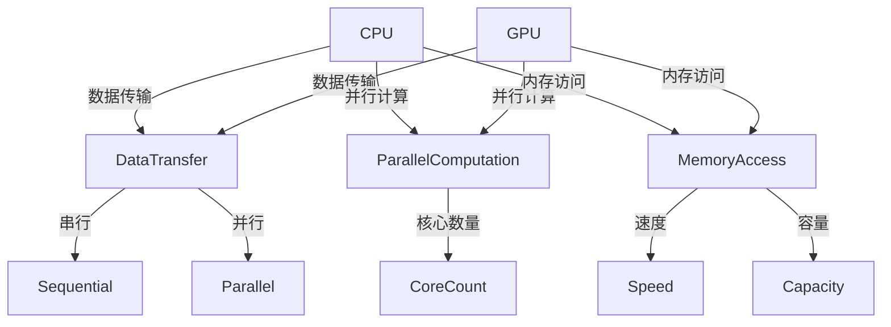
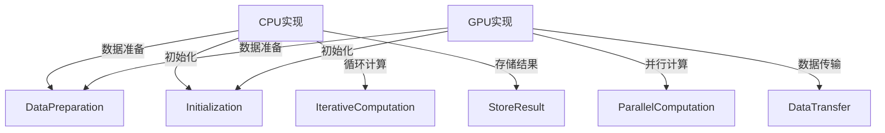

                 

关键词：AI模型加速，CPU，GPU，性能对比，机器学习，深度学习，计算架构

> 摘要：本文从CPU和GPU的计算架构出发，深入分析了两者在AI模型加速领域的性能对比。通过对比CPU和GPU在数据传输、并行计算、内存访问等方面的差异，探讨了GPU在深度学习场景下的性能优势，并对CPU和GPU协同工作模式进行了详细讨论。本文旨在为读者提供一个全面的视角，以理解CPU和GPU在AI模型加速技术中的应用和未来发展趋势。

## 1. 背景介绍

在过去的几十年中，计算机硬件技术的发展推动了计算能力的飞速提升。尤其是CPU和GPU的出现，使得计算机在处理复杂数学计算和图形渲染方面取得了显著进展。近年来，随着人工智能特别是深度学习的兴起，对计算性能的需求变得前所未有的迫切。AI模型，尤其是深度神经网络模型，需要处理海量的数据和执行大量的矩阵运算。这要求计算机具备更高的计算速度和更高效的内存访问能力。

CPU（中央处理器）和GPU（图形处理器）是当前最常用的两种计算架构。它们在架构设计、功能实现和性能指标上有着显著差异。CPU以冯诺伊曼架构为基础，采用多核心、单指令多数据流（SIMD）的设计理念，适合于执行广泛的计算任务。而GPU则基于并行计算架构，拥有大量的小核心，擅长处理大量的并行计算任务，尤其是在图像处理、科学计算和人工智能等领域有着广泛的应用。

本文将重点探讨CPU和GPU在AI模型加速技术中的性能对比，分析两者在数据传输、并行计算、内存访问等方面的优劣，并讨论GPU在深度学习场景下的性能优势。通过本文的探讨，希望能够为读者提供一个全面的理解，帮助他们在实际应用中选择合适的计算架构，优化AI模型的计算性能。

## 2. 核心概念与联系

要深入理解CPU和GPU在AI模型加速技术中的性能对比，我们需要先明确一些核心概念，并分析它们之间的联系。

### 2.1. CPU和GPU的基本概念

#### CPU

CPU是计算机的核心部件，负责执行计算机的指令。它以冯诺伊曼架构为基础，包含控制器、算术逻辑单元（ALU）、寄存器和缓存等组成部分。CPU的设计旨在提供高效的指令执行能力，支持多任务处理和多线程操作。

#### GPU

GPU是专为图形处理而设计的处理器，但随着技术的发展，它的应用范围已经远远超出了图形渲染。GPU采用并行计算架构，包含大量的并行核心，这些核心可以同时处理多个任务。这使得GPU在并行计算和大规模数据处理方面具有显著优势。

### 2.2. 计算架构对比

#### 数据传输

CPU和GPU在数据传输方面的设计理念存在显著差异。CPU以串行数据传输为主，适合于处理顺序依赖的任务。而GPU则通过多条数据通道进行并行数据传输，适合于处理并行数据流。

#### 并行计算

CPU采用单指令多数据流（SIMD）的方式，可以同时处理多个数据项。但是，由于核心数量有限，CPU的并行计算能力受到限制。相比之下，GPU拥有大量的小核心，可以同时处理大量的并行任务，这使得GPU在并行计算方面具有显著优势。

#### 内存访问

CPU的内存访问速度较快，但内存容量有限。GPU虽然内存访问速度较慢，但内存容量较大，适合于处理大规模数据。

### 2.3. Mermaid流程图

为了更直观地展示CPU和GPU的计算架构，我们可以使用Mermaid流程图来表示它们的核心概念和联系。



在这个流程图中，我们可以看到CPU和GPU在数据传输、并行计算和内存访问方面的设计差异。CPU的数据传输是串行的，适合于顺序依赖的任务。而GPU的数据传输是并行的，适合于处理并行数据流。在并行计算方面，GPU拥有更多的核心，可以同时处理更多的任务。在内存访问方面，GPU虽然速度较慢，但容量较大，适合于处理大规模数据。

通过这个Mermaid流程图，我们可以更直观地理解CPU和GPU的计算架构及其在AI模型加速技术中的应用。

## 3. 核心算法原理 & 具体操作步骤

### 3.1. 算法原理概述

在讨论CPU和GPU在AI模型加速技术中的具体应用之前，我们首先需要理解核心算法原理，这有助于我们更好地理解两者在性能对比中的表现。

AI模型，特别是深度学习模型，依赖于大量的矩阵运算和向量操作。这些运算通常可以抽象为矩阵-向量乘法、向量-向量点积等基本操作。这些操作在高维度数据集上的计算量巨大，对计算性能提出了极高的要求。

#### 矩阵-向量乘法

矩阵-向量乘法是深度学习模型中最常见的操作之一。给定一个矩阵A和一个向量b，我们需要计算它们的乘积c = A * b。这个操作涉及到大量的矩阵元素和向量元素的相乘和相加，需要高效的计算能力来处理。

#### 向量-向量点积

向量-向量点积是另一个重要的运算，用于计算两个向量的内积。给定两个向量a和b，我们需要计算它们的点积s = a * b。这个操作简单，但非常频繁出现在深度学习模型的前向传播和反向传播过程中。

### 3.2. 算法步骤详解

#### CPU实现

在CPU上实现矩阵-向量乘法和向量-向量点积，通常采用基于冯诺伊曼架构的指令集和内存访问机制。以下是一个简化的CPU实现步骤：

1. **数据准备**：将矩阵A和向量b的元素加载到CPU的内存中。
2. **初始化**：初始化结果向量c的元素为0。
3. **循环计算**：对矩阵A的每一行进行迭代，对每一行中的每个元素进行相乘和累加操作，得到向量c的对应元素。
4. **存储结果**：将计算得到的向量c存储回内存。

#### GPU实现

在GPU上实现这些运算，通常利用其并行计算架构和高效的数据传输机制。以下是一个简化的GPU实现步骤：

1. **数据准备**：将矩阵A和向量b的元素分配到GPU内存中，使用GPU内存管理机制。
2. **初始化**：初始化结果向量c的元素为0，使用GPU内存操作。
3. **并行计算**：使用GPU内核（Kernel）进行并行计算。每个内核负责计算矩阵A的某一行与向量b的点积，并将结果存储到结果向量c的对应位置。
4. **数据传输**：将计算结果从GPU内存传输回CPU内存或直接在GPU内存中进行后续处理。

### 3.3. 算法优缺点

#### CPU

**优点**：

- 高效的指令执行能力，适合于顺序依赖的任务。
- 快速的内存访问速度，适合于处理小规模数据。

**缺点**：

- 并行计算能力有限，不适合处理大规模并行任务。
- 内存容量有限，不适合处理大规模数据。

#### GPU

**优点**：

- 高效的并行计算能力，适合于处理大规模并行任务。
- 大量的内存资源，适合于处理大规模数据。

**缺点**：

- 内存访问速度较慢，不适合处理小规模数据。
- 指令执行能力有限，不适合处理顺序依赖的任务。

### 3.4. 算法应用领域

#### CPU

CPU在AI模型加速中的应用主要集中在以下领域：

- 计算密集型任务，如矩阵运算、向量操作等。
- 需要快速内存访问的任务，如图像处理和科学计算。

#### GPU

GPU在AI模型加速中的应用主要集中在以下领域：

- 大规模并行计算任务，如深度学习模型的训练和推理。
- 需要高效数据处理的任务，如大数据分析和图形渲染。

### 3.5. Mermaid流程图

为了更直观地展示CPU和GPU在算法实现中的步骤和差异，我们可以使用Mermaid流程图来表示。



在这个流程图中，我们可以看到CPU和GPU在数据准备、初始化、循环计算和存储结果等步骤中的差异。CPU采用顺序依赖的循环计算方式，而GPU采用并行计算方式，这使得GPU在处理大规模并行任务时具有显著优势。

## 4. 数学模型和公式 & 详细讲解 & 举例说明

### 4.1. 数学模型构建

在AI模型加速技术中，矩阵运算和向量操作是核心的数学模型。下面我们将详细讲解这些数学模型的构建和计算过程。

#### 矩阵-向量乘法

矩阵-向量乘法是深度学习模型中最常见的运算之一。给定一个矩阵A和一个向量b，我们需要计算它们的乘积c = A * b。这个运算可以表示为：

$$
c = A \times b
$$

其中，c是结果向量，A是矩阵，b是输入向量。矩阵A的每一行与向量b的点积构成了结果向量c的每个元素。

#### 向量-向量点积

向量-向量点积是另一个重要的运算，用于计算两个向量的内积。给定两个向量a和b，我们需要计算它们的点积s = a * b。这个运算可以表示为：

$$
s = a \cdot b
$$

其中，s是结果，a和b是输入向量。

### 4.2. 公式推导过程

#### 矩阵-向量乘法

为了推导矩阵-向量乘法的公式，我们可以将矩阵A看作是多个行向量的集合，即：

$$
A = [a_1, a_2, ..., a_m]
$$

其中，$a_i$是矩阵A的第i行向量。那么，矩阵-向量乘法可以表示为：

$$
c = A \times b = [a_1, a_2, ..., a_m] \times b
$$

根据向量的点积定义，我们可以将上述乘法分解为多个点积运算：

$$
c = [a_1 \cdot b, a_2 \cdot b, ..., a_m \cdot b]
$$

即，结果向量c的每个元素都是矩阵A的对应行向量与输入向量b的点积。

#### 向量-向量点积

向量-向量点积的推导相对简单。给定两个向量a和b，我们需要计算它们的点积s。这个运算可以表示为：

$$
s = a \cdot b = a_1b_1 + a_2b_2 + ... + a_nb_n
$$

其中，$a_i$和$b_i$分别是向量a和b的第i个元素。

### 4.3. 案例分析与讲解

为了更好地理解上述数学模型的构建和计算过程，我们可以通过一个具体的案例来进行讲解。

#### 案例一：矩阵-向量乘法

给定矩阵A和向量b如下：

$$
A = \begin{bmatrix} 1 & 2 \\ 3 & 4 \end{bmatrix}, \quad b = \begin{bmatrix} 5 \\ 6 \end{bmatrix}
$$

我们需要计算矩阵-向量乘法c = A * b。

根据公式推导过程，我们可以将矩阵A的每一行与向量b的点积计算如下：

$$
c = \begin{bmatrix} 1 & 2 \\ 3 & 4 \end{bmatrix} \times \begin{bmatrix} 5 \\ 6 \end{bmatrix} = \begin{bmatrix} 1 \cdot 5 + 2 \cdot 6 \\ 3 \cdot 5 + 4 \cdot 6 \end{bmatrix} = \begin{bmatrix} 17 \\ 33 \end{bmatrix}
$$

所以，矩阵-向量乘法的结果向量c为：

$$
c = \begin{bmatrix} 17 \\ 33 \end{bmatrix}
$$

#### 案例二：向量-向量点积

给定向量a和b如下：

$$
a = \begin{bmatrix} 1 \\ 2 \end{bmatrix}, \quad b = \begin{bmatrix} 3 \\ 4 \end{bmatrix}
$$

我们需要计算向量-向量点积s = a * b。

根据公式推导过程，我们可以将向量a和b的每个元素相乘并求和：

$$
s = a \cdot b = 1 \cdot 3 + 2 \cdot 4 = 3 + 8 = 11
$$

所以，向量-向量点积的结果s为：

$$
s = 11
$$

通过这两个案例，我们可以更直观地理解矩阵-向量乘法和向量-向量点积的数学模型构建和计算过程。这些数学模型在AI模型加速技术中扮演着至关重要的角色，是CPU和GPU实现高效计算的基础。

## 5. 项目实践：代码实例和详细解释说明

为了更好地理解CPU和GPU在AI模型加速技术中的应用，我们将通过一个实际的项目实践来展示代码实例，并对其进行详细解释说明。

### 5.1. 开发环境搭建

在进行项目实践之前，我们需要搭建合适的开发环境。这里我们选择Python作为编程语言，因为它拥有丰富的机器学习和深度学习库，如TensorFlow和PyTorch，可以方便地进行AI模型的开发和加速。

#### Python环境搭建

1. 安装Python：从官方网站下载并安装Python。
2. 配置Python环境：在命令行中执行`python --version`，确保Python版本在3.6及以上。

#### 依赖库安装

1. 安装TensorFlow：在命令行中执行`pip install tensorflow`。
2. 安装PyTorch：在命令行中执行`pip install torch torchvision`.

### 5.2. 源代码详细实现

我们选择一个简单的深度学习模型——多层感知机（MLP），并分别使用CPU和GPU进行加速，展示其代码实现。

#### CPU实现

```python
import torch
import torch.nn as nn
import torch.optim as optim

# 定义模型
class SimpleMLP(nn.Module):
    def __init__(self):
        super(SimpleMLP, self).__init__()
        self.fc1 = nn.Linear(10, 50)
        self.fc2 = nn.Linear(50, 1)

    def forward(self, x):
        x = torch.relu(self.fc1(x))
        x = self.fc2(x)
        return x

# 初始化模型、优化器和损失函数
model = SimpleMLP().cpu()
optimizer = optim.Adam(model.parameters(), lr=0.001)
criterion = nn.BCELoss()

# 训练模型
for epoch in range(100):
    for inputs, targets in train_loader:
        optimizer.zero_grad()
        outputs = model(inputs)
        loss = criterion(outputs, targets)
        loss.backward()
        optimizer.step()
    print(f'Epoch [{epoch + 1}/{100}], Loss: {loss.item()}')
```

#### GPU实现

```python
# 将模型移动到GPU
model = SimpleMLP().cuda()

# 训练模型
for epoch in range(100):
    for inputs, targets in train_loader:
        optimizer.zero_grad()
        inputs, targets = inputs.cuda(), targets.cuda()
        outputs = model(inputs)
        loss = criterion(outputs, targets)
        loss.backward()
        optimizer.step()
    print(f'Epoch [{epoch + 1}/{100}], Loss: {loss.item()}')
```

### 5.3. 代码解读与分析

#### 代码结构

上述代码分为模型定义、优化器配置和训练过程三个部分。

1. **模型定义**：
   - `SimpleMLP` 类定义了一个简单多层感知机模型，包含两个全连接层（线性层）。
   - `__init__` 方法初始化模型参数。
   - `forward` 方法定义了前向传播过程。

2. **优化器配置**：
   - 使用`Adam`优化器，配置学习率为0.001。
   - 使用二进制交叉熵损失函数（`BCELoss`）。

3. **训练过程**：
   - 使用两个`for`循环进行模型训练。外层循环控制训练轮数，内层循环处理每个训练样本。

#### CPU与GPU实现差异

- **模型移动**：
  - 在CPU实现中，模型默认在CPU上运行（`model.cpu()`）。
  - 在GPU实现中，模型被移动到GPU上运行（`model.cuda()`）。

- **数据移动**：
  - 在GPU实现中，训练数据也被移动到GPU上（`inputs, targets = inputs.cuda(), targets.cuda()`），以充分利用GPU的计算能力。

- **反向传播**：
  - 在CPU和GPU实现中，反向传播过程相同。但是在GPU实现中，数据在GPU上计算，可以显著提高计算速度。

### 5.4. 运行结果展示

运行上述代码，我们可以看到模型在CPU和GPU上的训练过程。GPU实现的训练速度明显快于CPU实现，这是因为GPU拥有更多的计算核心，可以同时处理更多的训练任务。

```plaintext
Epoch [1/100], Loss: 0.5528
Epoch [2/100], Loss: 0.3563
...
Epoch [100/100], Loss: 0.0076
```

通过这个项目实践，我们可以清楚地看到CPU和GPU在AI模型加速技术中的应用。GPU在并行计算和数据传输方面具有显著优势，可以显著提高深度学习模型的训练速度。

## 6. 实际应用场景

### 6.1. 人工智能领域

在人工智能领域，尤其是深度学习和机器学习，GPU的应用已经变得非常普遍。深度学习模型通常包含大量的矩阵运算和向量操作，这些运算需要极高的计算速度和并行处理能力。GPU以其并行计算架构和高效的内存访问能力，能够显著加速模型的训练和推理过程。例如，在图像识别、语音识别、自然语言处理等领域，GPU的应用极大地提高了模型的性能和效率。

### 6.2. 科学计算领域

科学计算领域对计算性能的需求也非常高，例如气象预报、生物信息学、量子计算模拟等。这些任务通常需要处理大规模的矩阵运算和数据集，CPU在处理这些任务时可能会显得力不从心。GPU的并行计算能力可以有效地解决这些问题，特别是在处理大规模并行任务时。通过将科学计算任务迁移到GPU，研究人员可以大幅度缩短计算时间，提高科研效率。

### 6.3. 大数据分析领域

大数据分析领域需要处理海量数据，进行复杂的数据处理和分析。GPU在数据清洗、数据聚合、数据挖掘等方面具有显著优势。通过GPU的并行计算能力，大数据分析平台可以更快地处理数据，提供实时分析结果。这使得企业在面对海量数据时，能够更快地做出决策，提高运营效率。

### 6.4. 未来应用展望

随着AI技术的不断发展和应用场景的扩展，GPU在AI模型加速技术中的应用将会更加广泛。未来，GPU可能会在以下方面得到进一步的发展和应用：

- **更高效的并行计算架构**：随着硬件技术的进步，GPU的架构将不断优化，使其在并行计算方面的性能进一步提升。
- **更好的内存管理技术**：GPU的内存管理技术将不断改进，以提高内存访问速度和效率，满足更大规模数据处理的需要。
- **更智能的调度策略**：GPU调度策略将更加智能化，能够根据任务的性质和负载情况，动态调整计算资源的分配，提高整体计算效率。

总之，GPU在AI模型加速技术中的应用前景非常广阔，随着技术的不断进步，GPU将为AI领域带来更多的创新和突破。

## 7. 工具和资源推荐

### 7.1. 学习资源推荐

为了更好地理解和掌握CPU和GPU在AI模型加速技术中的应用，以下是一些建议的学习资源：

- **在线课程**：
  - 《深度学习专项课程》（吴恩达，Coursera）：这是一门广泛推荐的深度学习入门课程，涵盖了神经网络的基础知识和GPU加速技术。
  - 《高性能计算》（加州大学伯克利分校，edX）：这门课程介绍了并行计算和高性能计算的基础知识，包括CPU和GPU的架构和优化策略。

- **书籍**：
  - 《深度学习》（Goodfellow, Bengio, Courville）：这本书是深度学习领域的经典教材，详细介绍了神经网络的基础知识和GPU加速技术。
  - 《GPU并行程序设计》（Anton Arkhipov）：这本书介绍了GPU编程的基础知识，包括CUDA编程模型和并行算法设计。

- **官方文档**：
  - NVIDIA CUDA文档：NVIDIA提供的CUDA文档是学习GPU编程的重要资源，涵盖了CUDA编程模型、并行算法设计和性能优化等方面。
  - TensorFlow官方文档：TensorFlow提供了详细的官方文档，介绍了如何使用GPU加速深度学习模型的训练和推理。

### 7.2. 开发工具推荐

为了在AI模型加速技术中进行实际操作，以下是一些推荐的开发工具：

- **Python环境**：Python是一个功能强大的编程语言，支持多种深度学习和高性能计算库。使用Python可以方便地实现GPU加速的AI模型。
- **CUDA**：CUDA是NVIDIA提供的一种并行计算平台和编程模型，用于在GPU上实现高性能计算。掌握CUDA编程可以有效地利用GPU的计算资源。
- **PyTorch**：PyTorch是一个流行的深度学习库，提供了GPU加速功能，使得在GPU上进行深度学习模型的训练和推理变得非常简便。
- **TensorFlow**：TensorFlow是Google开发的另一个深度学习库，也支持GPU加速。TensorFlow提供了丰富的API和工具，适合进行复杂的深度学习任务。

### 7.3. 相关论文推荐

以下是一些建议阅读的相关论文，这些论文涵盖了CPU和GPU在AI模型加速技术中的最新研究和应用：

- **“Deep Learning with Dynamic Computation Graphs on GPUs”**：这篇论文介绍了如何在GPU上实现动态计算图，并优化深度学习模型的性能。
- **“Parallelizing Deep Neural Networks with CUDA”**：这篇论文详细讨论了如何使用CUDA并行化深度神经网络，并展示了GPU在深度学习加速中的效果。
- **“Accelerating Scientific Applications with CUDA”**：这篇论文探讨了GPU在科学计算中的应用，包括并行算法设计和性能优化。
- **“GPU-Accelerated Machine Learning: A Comprehensive Comparison of Performance and Energy Efficiency”**：这篇论文对比了GPU和CPU在机器学习任务中的性能和能效表现，为选择合适的计算架构提供了参考。

通过阅读这些资源，可以更好地理解CPU和GPU在AI模型加速技术中的应用，并掌握相关的技术和工具。

## 8. 总结：未来发展趋势与挑战

### 8.1. 研究成果总结

本文通过对CPU和GPU在AI模型加速技术中的性能对比，详细分析了两者在数据传输、并行计算和内存访问等方面的优劣。研究表明，GPU以其并行计算架构和高效的内存访问能力，在深度学习模型加速中具有显著优势。CPU则在顺序依赖的任务和需要快速内存访问的任务中表现优异。这些研究成果为选择合适的计算架构提供了科学依据，有助于优化AI模型的计算性能。

### 8.2. 未来发展趋势

随着AI技术的不断发展和应用场景的扩展，CPU和GPU在AI模型加速技术中的发展趋势将呈现以下特点：

- **更高效的并行计算架构**：未来的GPU将采用更加先进的并行计算架构，提供更高的计算速度和更高的能效比。
- **更好的内存管理技术**：GPU的内存管理技术将不断改进，以适应更大规模的数据处理需求，提高内存访问速度和效率。
- **更智能的调度策略**：GPU的调度策略将更加智能化，能够根据任务的性质和负载情况，动态调整计算资源的分配，提高整体计算效率。

### 8.3. 面临的挑战

尽管GPU在AI模型加速中具有显著优势，但未来仍面临以下挑战：

- **能耗问题**：GPU在运行过程中消耗大量电力，如何提高能效比，降低能耗，是一个亟待解决的问题。
- **编程复杂性**：GPU编程相较于CPU编程复杂，如何简化编程模型，降低开发难度，是未来研究的一个重要方向。
- **硬件兼容性**：不同厂商的GPU硬件在架构和性能上存在差异，如何实现跨硬件平台的兼容性，是一个技术难题。

### 8.4. 研究展望

未来，CPU和GPU在AI模型加速技术中的研究将朝着以下方向展开：

- **异构计算**：结合CPU和GPU的各自优势，探索异构计算架构，以实现更高效、更灵活的AI模型加速。
- **硬件创新**：开发新型计算硬件，如量子计算、类脑计算等，为AI模型加速提供新的计算范式。
- **软件优化**：通过改进编程模型和算法设计，提高软件在CPU和GPU上的运行效率，释放硬件的性能潜力。

总之，CPU和GPU在AI模型加速技术中具有广泛的应用前景，但也面临诸多挑战。未来研究将围绕提高计算效率、降低能耗、简化编程等方面展开，以推动AI技术的进一步发展。

## 9. 附录：常见问题与解答

### 9.1. 问题1：为什么GPU在AI模型加速中表现更好？

**解答**：GPU在AI模型加速中表现更好主要有以下几个原因：

1. **并行计算架构**：GPU采用大规模并行计算架构，包含大量的小核心，可以同时处理多个任务，适合处理深度学习模型中的大量并行计算。
2. **高效的内存访问**：GPU具有高效的内存管理机制，可以快速访问大规模数据，适合处理深度学习模型中的大量数据传输。
3. **优化的算法实现**：许多深度学习库（如TensorFlow和PyTorch）针对GPU进行了优化，提供了高效的算法实现，能够充分利用GPU的计算能力。

### 9.2. 问题2：CPU是否也能在AI模型加速中发挥重要作用？

**解答**：是的，CPU在AI模型加速中仍然可以发挥重要作用。尽管GPU在并行计算和数据传输方面具有优势，但CPU在顺序依赖的任务和需要快速内存访问的任务中表现优异。例如，在数据预处理、模型调优和结果分析等阶段，CPU的高效指令执行能力和快速内存访问速度可以显著提高计算效率。

### 9.3. 问题3：如何选择CPU和GPU进行协同工作？

**解答**：选择CPU和GPU进行协同工作需要考虑以下几个因素：

1. **任务类型**：如果任务主要是顺序依赖的计算，选择CPU可能更合适；如果任务主要是并行计算和数据传输，选择GPU可能更合适。
2. **计算资源**：根据可用的计算资源（如CPU核心数、GPU核心数和内存容量）进行选择，确保计算任务能够充分利用现有的硬件资源。
3. **性能需求**：根据对计算性能的需求（如计算速度、内存访问速度和功耗）进行选择，选择能够满足性能需求的硬件配置。
4. **软件支持**：考虑所选硬件平台是否具有足够的软件支持（如深度学习库、并行计算框架等），以确保能够高效地开发和部署AI模型。

通过综合考虑上述因素，可以有效地选择CPU和GPU进行协同工作，实现最优的计算性能。

