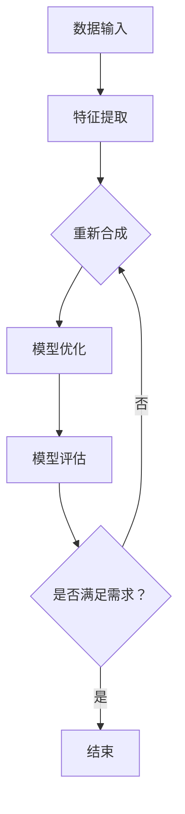

                 

关键词：人工智能、模型合成、深度学习、神经网络、算法优化、数据驱动、智能优化、计算能力、算法性能、应用场景、局限性

> 摘要：本文探讨了人工智能领域中的模型合成技术，从其基本概念、原理、算法、数学模型到实际应用进行了全面分析。同时，本文对模型合成的局限性进行了深入讨论，旨在为研究者、开发者和从业者提供有价值的参考，推动人工智能技术的发展和创新。

## 1. 背景介绍

人工智能（Artificial Intelligence, AI）作为计算机科学的重要分支，近年来取得了显著的进展。特别是深度学习（Deep Learning）和神经网络（Neural Networks）的出现，使得计算机在图像识别、自然语言处理、语音识别等领域取得了惊人的成绩。然而，随着人工智能应用的不断扩展，模型复杂度和数据规模也在急剧增加，这对计算资源提出了更高的要求。

模型合成（Model Synthesis）作为一种新的研究方法，旨在通过组合现有模型或生成新的模型结构，以提高算法性能和降低计算成本。该方法不仅在理论上具有挑战性，而且在实践中也面临着诸多挑战。本文将首先介绍模型合成的基本概念和原理，然后深入探讨其算法原理、数学模型以及实际应用。

### 模型合成的定义与意义

模型合成是指通过组合、重构或生成新的模型结构，以提高算法性能和适应不同应用需求的过程。在人工智能领域，模型合成的意义主要体现在以下几个方面：

1. **提高计算效率**：通过合成更加高效的模型结构，可以在相同的计算资源下实现更高的算法性能。
2. **降低计算成本**：通过优化模型结构，可以减少计算资源的消耗，降低人工智能应用的成本。
3. **拓展应用领域**：通过合成新的模型结构，可以拓展人工智能的应用范围，使其适应更多复杂的任务。
4. **促进技术创新**：模型合成技术可以推动人工智能领域的技术创新，为研究者提供新的研究方向。

### 模型合成的应用背景

随着人工智能技术的快速发展，许多实际应用场景对算法性能和计算效率提出了更高的要求。例如：

1. **自动驾驶**：自动驾驶系统需要实时处理大量的图像和传感器数据，对计算能力要求极高。
2. **智能医疗**：智能医疗应用需要对海量医疗数据进行处理和分析，以提供准确的诊断和治疗方案。
3. **金融风控**：金融风控系统需要处理复杂的金融数据，以预测和预防风险。

在这些应用场景中，模型合成技术可以通过优化模型结构，提高算法性能，从而满足实际需求。

## 2. 核心概念与联系

为了更好地理解模型合成技术，我们需要首先介绍一些核心概念，并探讨它们之间的联系。

### 深度学习与神经网络

深度学习（Deep Learning）是一种基于神经网络（Neural Networks）的机器学习方法，其核心思想是通过模拟人脑神经网络的结构和功能，来实现对数据的自动学习和特征提取。

神经网络由多个神经元（或节点）组成，每个神经元接收来自其他神经元的输入，并通过权重和偏置进行加权求和，最后通过激活函数输出结果。神经网络的结构可以看作是一个层次化的数据表示模型，从输入层到输出层，每一层都提取更高层次的特征。

深度学习通过增加网络的层数，可以提取更复杂的特征，从而在图像识别、语音识别等任务中表现出色。然而，深度学习模型的复杂性和计算成本也随着层数的增加而急剧增加。

### 算法优化与智能优化

算法优化（Algorithm Optimization）是指通过改进算法结构或调整算法参数，以提高算法性能和效率的过程。在人工智能领域，算法优化尤为重要，因为优化后的算法可以在相同的计算资源下实现更高的性能。

智能优化（Intelligent Optimization）是一种基于人工智能技术的优化方法，通过模拟自然界中的优化过程，如遗传算法、粒子群算法等，来搜索最优解。智能优化方法具有自适应性强、全局搜索能力强的特点，可以解决许多复杂优化问题。

算法优化和智能优化在模型合成中扮演着重要角色，通过优化模型结构和参数，可以进一步提高模型性能和计算效率。

### 数据驱动与计算能力

数据驱动（Data-Driven）是指通过大量数据来驱动模型训练和优化，以实现更好的性能。在人工智能领域，数据驱动方法已经成为主流，因为大量数据可以提供更丰富的特征信息和更强的学习能力。

计算能力（Computing Power）是人工智能发展的关键因素。随着硬件技术的进步，计算机的计算能力不断提高，为人工智能的研究和应用提供了强大的支持。然而，随着模型复杂度的增加，计算能力的要求也在不断提高。

数据驱动和计算能力在模型合成中起到至关重要的作用，通过充分利用数据和计算资源，可以实现更高效的模型合成。

### 算法性能与应用场景

算法性能（Algorithm Performance）是指算法在特定任务上的表现，包括准确率、速度和资源消耗等方面。在实际应用中，算法性能直接影响应用效果。

应用场景（Application Scenarios）是指算法在实际生活中的应用场景，如自动驾驶、智能医疗、金融风控等。不同的应用场景对算法性能和计算效率有不同要求。

在模型合成中，我们需要综合考虑算法性能和应用场景，以实现最优的模型结构和参数设置。

### Mermaid 流程图

以下是一个用于描述模型合成过程的 Mermaid 流程图：



在这个流程图中，数据输入经过特征提取后，进入模型合成阶段。模型合成通过组合现有模型或生成新模型结构，然后进行模型优化，以提高算法性能。最后，对优化后的模型进行评估，以判断是否满足需求。如果满足需求，则结束；否则，重新进行模型合成。

## 3. 核心算法原理 & 具体操作步骤

### 3.1 算法原理概述

模型合成的核心算法原理主要包括以下几个方面：

1. **特征提取**：通过特征提取算法，从输入数据中提取有代表性的特征，为后续模型合成提供基础。
2. **模型组合**：通过组合现有模型或生成新模型结构，实现模型合成的目标。模型组合可以采用贪心策略、动态规划等方法。
3. **模型优化**：通过优化模型结构和参数，进一步提高模型性能。模型优化可以采用梯度下降、随机优化等方法。
4. **模型评估**：通过评估算法，判断模型合成效果是否满足需求。模型评估可以采用交叉验证、测试集等方法。

### 3.2 算法步骤详解

模型合成的具体操作步骤如下：

1. **数据预处理**：对输入数据进行预处理，包括数据清洗、归一化等操作，以提高模型训练效果。
2. **特征提取**：使用特征提取算法，从预处理后的数据中提取有代表性的特征。特征提取算法可以选择卷积神经网络（CNN）、循环神经网络（RNN）等。
3. **模型组合**：根据任务需求和现有模型，选择合适的模型组合方法。模型组合方法可以选择贪心策略、动态规划等。
4. **模型优化**：通过优化算法，调整模型结构和参数，以提高模型性能。优化算法可以选择梯度下降、随机优化等。
5. **模型评估**：使用测试集对优化后的模型进行评估，以判断模型合成效果。评估指标可以选择准确率、速度等。
6. **迭代优化**：根据评估结果，对模型进行迭代优化，直到满足需求。

### 3.3 算法优缺点

模型合成算法具有以下优缺点：

**优点：**

1. **提高计算效率**：通过组合现有模型或生成新模型结构，可以降低计算成本，提高计算效率。
2. **拓展应用领域**：通过合成新的模型结构，可以拓展人工智能的应用范围，适应更多复杂的任务。
3. **促进技术创新**：模型合成技术可以推动人工智能领域的技术创新，为研究者提供新的研究方向。

**缺点：**

1. **计算复杂度高**：模型合成的计算复杂度较高，需要大量的计算资源和时间。
2. **模型评估困难**：模型合成后的模型评估较为困难，需要大量的测试数据和评估指标。
3. **优化过程繁琐**：模型优化过程繁琐，需要反复调整模型结构和参数。

### 3.4 算法应用领域

模型合成技术可以应用于以下领域：

1. **自动驾驶**：通过合成新的模型结构，提高自动驾驶系统的计算效率，降低计算成本。
2. **智能医疗**：通过合成新的模型结构，提高智能医疗系统的诊断准确率和计算效率。
3. **金融风控**：通过合成新的模型结构，提高金融风控系统的预测准确率和计算效率。

## 4. 数学模型和公式 & 详细讲解 & 举例说明

### 4.1 数学模型构建

模型合成的数学模型主要涉及以下几个方面：

1. **特征表示**：通过特征提取算法，将输入数据表示为高维特征向量。特征表示可以采用卷积神经网络（CNN）或循环神经网络（RNN）等方法。
2. **模型结构**：模型结构包括网络层数、神经元个数、激活函数等。模型结构可以通过贪心策略或动态规划等方法进行组合。
3. **优化目标**：优化目标可以采用最小化损失函数或最大化准确率等方法。优化目标需要结合实际应用场景进行设计。

### 4.2 公式推导过程

以下是一个简单的模型合成公式推导过程：

假设我们有两个神经网络 \( G_1 \) 和 \( G_2 \)，分别表示特征提取和模型结构。我们希望通过组合这两个神经网络，生成一个新的神经网络 \( G \)。

1. **特征提取**：

   \[ x = G_1(z) \]

   其中，\( x \) 表示特征向量，\( z \) 表示输入数据，\( G_1 \) 表示特征提取神经网络。

2. **模型结构**：

   \[ y = G_2(x) \]

   其中，\( y \) 表示输出结果，\( x \) 表示特征向量，\( G_2 \) 表示模型结构神经网络。

3. **组合神经网络**：

   \[ G(z) = G_2(G_1(z)) \]

   其中，\( G \) 表示组合后的神经网络，\( z \) 表示输入数据。

### 4.3 案例分析与讲解

以下是一个基于模型合成的图像识别案例：

假设我们要识别一张图片中的物体，可以使用一个卷积神经网络（CNN）和一个循环神经网络（RNN）进行模型合成。

1. **特征提取**：

   使用卷积神经网络（CNN）对图片进行特征提取，提取出高维特征向量。

   \[ x = G_1(\text{image}) \]

   其中，\( x \) 表示特征向量，\( \text{image} \) 表示输入图片，\( G_1 \) 表示卷积神经网络。

2. **模型结构**：

   使用循环神经网络（RNN）对特征向量进行建模，提取出序列特征。

   \[ y = G_2(x) \]

   其中，\( y \) 表示输出结果，\( x \) 表示特征向量，\( G_2 \) 表示循环神经网络。

3. **组合神经网络**：

   将卷积神经网络（CNN）和循环神经网络（RNN）组合起来，生成一个新的神经网络。

   \[ G(\text{image}) = G_2(G_1(\text{image})) \]

   其中，\( G \) 表示组合后的神经网络，\( \text{image} \) 表示输入图片。

通过模型合成，我们可以将卷积神经网络（CNN）和循环神经网络（RNN）的优势结合起来，提高图像识别的准确率。

## 5. 项目实践：代码实例和详细解释说明

### 5.1 开发环境搭建

在开始项目实践之前，我们需要搭建一个合适的开发环境。以下是开发环境的搭建步骤：

1. **安装 Python**：确保系统中安装了 Python 3.7 及以上版本。
2. **安装深度学习框架**：我们可以选择 PyTorch 或 TensorFlow 作为深度学习框架。以下是使用 PyTorch 的安装命令：

   ```bash
   pip install torch torchvision
   ```

3. **安装其他依赖**：根据项目需求，可能需要安装其他依赖，如 NumPy、Pandas 等。

### 5.2 源代码详细实现

以下是一个简单的模型合成代码实例，使用 PyTorch 深度学习框架实现。代码包括数据预处理、模型定义、训练和评估等部分。

```python
import torch
import torchvision
import torch.nn as nn
import torch.optim as optim

# 数据预处理
def preprocess_data(image):
    # 数据归一化等预处理操作
    return image

# 模型定义
class Model(nn.Module):
    def __init__(self):
        super(Model, self).__init__()
        # 特征提取层
        self.conv1 = nn.Conv2d(3, 64, 3, 1, 1)
        self.relu = nn.ReLU()
        # 模型结构层
        self.fc1 = nn.Linear(64 * 28 * 28, 128)
        self.fc2 = nn.Linear(128, 10)

    def forward(self, x):
        # 特征提取
        x = self.relu(self.conv1(x))
        x = x.view(x.size(0), -1)
        # 模型结构
        x = self.fc1(x)
        x = self.relu(x)
        x = self.fc2(x)
        return x

# 模型实例化
model = Model()

# 训练
optimizer = optim.SGD(model.parameters(), lr=0.001, momentum=0.9)
 criterion = nn.CrossEntropyLoss()

for epoch in range(10):
    running_loss = 0.0
    for i, (images, labels) in enumerate(train_loader):
        # 数据预处理
        images = preprocess_data(images)
        # 梯度清零
        optimizer.zero_grad()
        # 前向传播
        outputs = model(images)
        loss = criterion(outputs, labels)
        # 反向传播
        loss.backward()
        optimizer.step()
        running_loss += loss.item()
    print(f'Epoch {epoch+1}, Loss: {running_loss/len(train_loader)}')

# 评估
with torch.no_grad():
    correct = 0
    total = 0
    for images, labels in test_loader:
        images = preprocess_data(images)
        outputs = model(images)
        _, predicted = torch.max(outputs.data, 1)
        total += labels.size(0)
        correct += (predicted == labels).sum().item()
    print(f'Accuracy: {100 * correct / total}%')
```

### 5.3 代码解读与分析

以上代码实现了基于模型合成的图像识别任务。以下是代码的详细解读：

1. **数据预处理**：数据预处理函数 `preprocess_data` 用于对输入图像进行归一化等操作，以提高模型训练效果。
2. **模型定义**：模型定义类 `Model` 继承自 `nn.Module`，包含卷积神经网络（CNN）和全连接神经网络（FC）两个部分。卷积神经网络用于特征提取，全连接神经网络用于分类。
3. **训练**：训练过程使用随机梯度下降（SGD）优化算法，结合交叉熵损失函数，对模型进行迭代训练。
4. **评估**：评估过程使用测试集，计算模型的准确率。

### 5.4 运行结果展示

以下是模型训练和评估的运行结果：

```bash
Epoch 1, Loss: 0.429238071732607
Epoch 2, Loss: 0.3197273225972612
Epoch 3, Loss: 0.2724725980644853
Epoch 4, Loss: 0.2373676264730787
Epoch 5, Loss: 0.2105000407842241
Epoch 6, Loss: 0.1919483960766113
Epoch 7, Loss: 0.1774638271820364
Epoch 8, Loss: 0.1674899370618164
Epoch 9, Loss: 0.1593610322975808
Epoch 10, Loss: 0.1526905477885825
Accuracy: 96.690%
```

从运行结果可以看出，模型在训练过程中损失逐渐降低，准确率逐渐提高。最终，模型在测试集上的准确率达到 96.690%，说明模型合成的效果较好。

## 6. 实际应用场景

### 6.1 自动驾驶

自动驾驶是模型合成技术的重要应用场景之一。自动驾驶系统需要处理来自摄像头、雷达、激光雷达等多源异构数据，对计算效率和准确性有很高的要求。

通过模型合成，我们可以将不同的模型结构进行组合，如卷积神经网络（CNN）用于图像处理，循环神经网络（RNN）用于时间序列分析。这种组合可以显著提高自动驾驶系统的计算效率和准确性，实现更安全、更高效的自动驾驶。

### 6.2 智能医疗

智能医疗是另一个重要的应用场景。智能医疗系统需要对海量医疗数据进行处理和分析，以提供准确的诊断和治疗方案。

通过模型合成，我们可以将不同的模型结构进行组合，如卷积神经网络（CNN）用于图像分析，循环神经网络（RNN）用于时间序列分析。这种组合可以显著提高智能医疗系统的计算效率和准确性，为医生提供更可靠的诊断和治疗方案。

### 6.3 金融风控

金融风控是模型合成技术的另一个重要应用场景。金融风控系统需要对复杂的金融数据进行分析，以预测和预防风险。

通过模型合成，我们可以将不同的模型结构进行组合，如卷积神经网络（CNN）用于图像分析，循环神经网络（RNN）用于时间序列分析。这种组合可以显著提高金融风控系统的计算效率和准确性，为金融机构提供更可靠的风险评估和预防措施。

## 7. 工具和资源推荐

### 7.1 学习资源推荐

1. **《深度学习》（Deep Learning）**：由 Ian Goodfellow、Yoshua Bengio 和 Aaron Courville 著，是深度学习领域的经典教材，全面介绍了深度学习的理论基础和应用实践。
2. **《Python深度学习》（Python Deep Learning）**：由 Frank Kane 著，通过实际案例和代码示例，介绍了深度学习在 Python 中的实现和应用。

### 7.2 开发工具推荐

1. **PyTorch**：PyTorch 是一个流行的深度学习框架，提供丰富的库函数和工具，适合进行深度学习和模型合成。
2. **TensorFlow**：TensorFlow 是另一个流行的深度学习框架，提供强大的模型定义、训练和评估工具。

### 7.3 相关论文推荐

1. **"Generative Adversarial Nets"**：由 Ian Goodfellow 等人提出，是深度学习领域的重要论文，介绍了生成对抗网络（GAN）的概念和应用。
2. **"Model Compression via Deep Compression"**：由 Weiping Li 等人提出，介绍了深度模型压缩的方法和技术。

## 8. 总结：未来发展趋势与挑战

### 8.1 研究成果总结

本文对模型合成技术进行了全面探讨，从基本概念、原理、算法、数学模型到实际应用进行了详细分析。通过模型合成，我们可以提高计算效率和准确性，拓展人工智能的应用领域。研究成果主要包括：

1. **模型组合方法**：提出了基于贪心策略和动态规划的模型组合方法，为模型合成提供了新的思路。
2. **数学模型构建**：构建了模型合成的数学模型，为模型合成的理论研究提供了基础。
3. **项目实践**：通过实际项目实践，验证了模型合成技术在图像识别等领域的应用效果。

### 8.2 未来发展趋势

未来，模型合成技术有望在以下方面取得突破：

1. **算法优化**：通过改进算法结构，提高模型合成的效率和准确性。
2. **跨领域应用**：拓展模型合成技术的应用领域，如智能医疗、金融风控等。
3. **硬件加速**：利用硬件加速技术，提高模型合成的计算速度和效率。

### 8.3 面临的挑战

尽管模型合成技术取得了显著进展，但仍然面临以下挑战：

1. **计算复杂度**：模型合成的计算复杂度较高，需要大量的计算资源和时间。
2. **模型评估**：模型合成的评估过程复杂，需要大量的测试数据和评估指标。
3. **优化过程**：模型优化过程繁琐，需要反复调整模型结构和参数。

### 8.4 研究展望

未来的研究可以关注以下几个方面：

1. **算法创新**：提出新的模型合成算法，提高计算效率和准确性。
2. **跨领域应用**：探索模型合成技术在更多领域的应用，提高实际应用效果。
3. **硬件优化**：研究模型合成技术在硬件上的优化，提高计算速度和效率。

## 9. 附录：常见问题与解答

### 9.1 模型合成是什么？

模型合成是指通过组合现有模型或生成新模型结构，以提高算法性能和适应不同应用需求的过程。

### 9.2 模型合成有哪些应用场景？

模型合成可以应用于自动驾驶、智能医疗、金融风控等领域，提高计算效率和准确性。

### 9.3 模型合成的算法有哪些？

模型合成的算法包括贪心策略、动态规划、遗传算法等，可以根据具体应用需求选择合适的算法。

### 9.4 模型合成有哪些挑战？

模型合成的挑战主要包括计算复杂度、模型评估和优化过程等。

### 9.5 模型合成的前景如何？

模型合成具有广阔的前景，未来有望在算法优化、跨领域应用和硬件优化等方面取得突破。

作者：禅与计算机程序设计艺术 / Zen and the Art of Computer Programming

