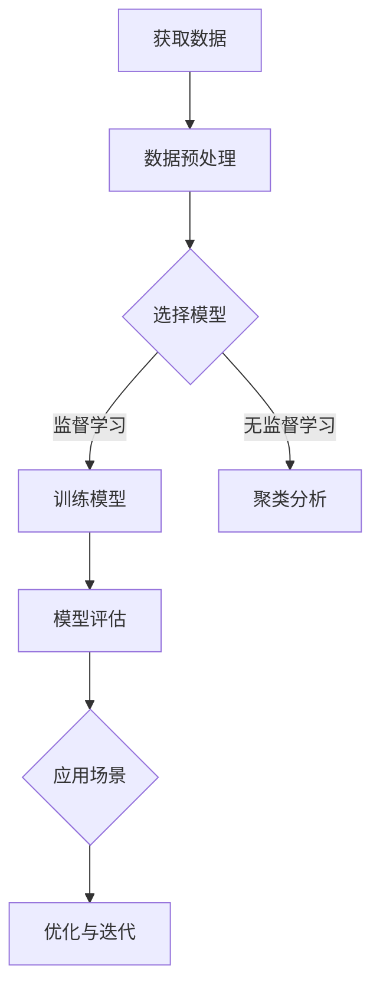

                 

关键词：人工智能，AI模型，实际应用，深度学习，数据分析，机器学习，自然语言处理，计算机视觉

> 摘要：本文旨在探讨人工智能（AI）模型在现实世界中的广泛应用，以及它们如何影响我们的生活、工作和社会。我们将深入分析AI模型的核心概念、算法原理、数学模型、项目实践和未来应用展望，并探讨在AI技术快速发展背景下所面临的挑战。

## 1. 背景介绍

人工智能作为一门交叉学科，自1956年诞生以来，经历了数十年的发展和变革。近年来，随着计算能力的提升、大数据的涌现以及深度学习算法的创新，AI技术取得了前所未有的突破。AI模型已经成为各行各业不可或缺的工具，从医疗诊断到自动驾驶，从金融分析到娱乐推荐，AI技术正以惊人的速度渗透到我们生活的各个方面。

在AI模型的发展历程中，机器学习、深度学习、自然语言处理和计算机视觉等技术不断进步，为AI模型的应用奠定了基础。当前，AI模型已经在许多领域实现了突破性成果，成为推动社会进步的重要力量。

## 2. 核心概念与联系

### 2.1. 机器学习

机器学习是AI模型的基础，它通过算法从数据中自动学习规律，进行预测和决策。机器学习可以分为监督学习、无监督学习和强化学习。

- **监督学习**：通过已有标签数据训练模型，使模型能够对新数据进行预测。
- **无监督学习**：无需标签数据，通过数据内在结构进行学习。
- **强化学习**：通过与环境的交互，不断优化策略以达到目标。

### 2.2. 深度学习

深度学习是机器学习的一个分支，通过多层神经网络对数据进行建模，实现复杂函数的拟合。深度学习在图像识别、语音识别等领域取得了显著成果。

### 2.3. 自然语言处理

自然语言处理（NLP）是研究计算机与人类语言之间交互的领域。NLP技术包括文本分析、情感分析、机器翻译等，广泛应用于智能客服、搜索引擎等领域。

### 2.4. 计算机视觉

计算机视觉是研究计算机如何获取、处理和理解图像的领域。计算机视觉技术包括目标检测、图像分类、图像生成等，广泛应用于安防监控、自动驾驶等领域。

### 2.5. Mermaid 流程图

下面是AI模型在现实世界中的应用流程图：



## 3. 核心算法原理 & 具体操作步骤

### 3.1. 算法原理概述

AI模型的核心在于学习数据中的规律，并利用这些规律进行预测和决策。常见的算法原理包括：

- **神经网络**：通过多层神经元的连接实现复杂函数的拟合。
- **卷积神经网络（CNN）**：在图像处理领域具有广泛应用的神经网络结构。
- **循环神经网络（RNN）**：在序列数据处理中具有优势的神经网络结构。
- **生成对抗网络（GAN）**：通过生成器和判别器的对抗训练生成高质量的数据。

### 3.2. 算法步骤详解

- **数据收集**：从各种渠道获取所需数据。
- **数据预处理**：对数据进行清洗、归一化等操作，以提高模型性能。
- **模型选择**：根据应用场景选择合适的模型。
- **模型训练**：使用训练数据对模型进行训练。
- **模型评估**：使用验证数据对模型进行评估，调整模型参数。
- **模型部署**：将训练好的模型部署到实际应用场景中。

### 3.3. 算法优缺点

- **神经网络**：具有强大的拟合能力，但训练过程复杂，容易过拟合。
- **CNN**：在图像处理领域具有显著优势，但对序列数据效果较差。
- **RNN**：在序列数据处理中具有优势，但训练过程容易出现梯度消失或爆炸问题。
- **GAN**：能够生成高质量的数据，但在训练过程中存在不稳定和难以优化的问题。

### 3.4. 算法应用领域

AI模型在各个领域都有广泛应用，如：

- **医疗诊断**：利用深度学习算法进行疾病检测和预测。
- **金融分析**：利用机器学习算法进行风险控制和投资决策。
- **安防监控**：利用计算机视觉技术进行目标检测和追踪。
- **自动驾驶**：利用深度学习算法实现车辆感知和环境理解。

## 4. 数学模型和公式 & 详细讲解 & 举例说明

### 4.1. 数学模型构建

AI模型的核心在于构建数学模型，用于描述数据中的规律。常见的数学模型包括：

- **线性回归**：通过最小二乘法求解模型参数。
- **逻辑回归**：用于分类问题，通过最大似然估计求解模型参数。
- **神经网络**：通过反向传播算法求解模型参数。
- **卷积神经网络**：通过卷积操作提取图像特征。

### 4.2. 公式推导过程

以线性回归为例，假设我们有 m 个训练样本，每个样本包含 n 个特征，标签为 y。线性回归模型可以表示为：

$$y = \beta_0 + \sum_{i=1}^{n} \beta_i x_i$$

其中，$\beta_0$ 和 $\beta_i$ 为模型参数。

为了求解模型参数，我们采用最小二乘法，即最小化损失函数：

$$J(\theta) = \frac{1}{2m} \sum_{i=1}^{m} (y_i - \theta^T x_i)^2$$

其中，$\theta = (\beta_0, \beta_1, \ldots, \beta_n)$ 为模型参数。

对损失函数求导并令导数为零，可以得到最小二乘法的最优解：

$$\theta = (X^T X)^{-1} X^T y$$

其中，$X$ 为特征矩阵，$y$ 为标签向量。

### 4.3. 案例分析与讲解

假设我们有一个包含 100 个样本的线性回归问题，特征矩阵 $X$ 和标签向量 $y$ 如下：

$$
X = \begin{bmatrix}
1 & 2 \\
1 & 3 \\
1 & 4 \\
\vdots & \vdots \\
1 & 100
\end{bmatrix}, \quad
y = \begin{bmatrix}
3 \\
4 \\
5 \\
\vdots \\
101
\end{bmatrix}
$$

根据最小二乘法，我们可以求解模型参数：

$$
\theta = (X^T X)^{-1} X^T y = \begin{bmatrix}
1 & 2 \\
1 & 3 \\
1 & 4 \\
\vdots & \vdots \\
1 & 100
\end{bmatrix}^{-1} \begin{bmatrix}
3 \\
4 \\
5 \\
\vdots \\
101
\end{bmatrix} = \begin{bmatrix}
1 \\
2
\end{bmatrix}
$$

因此，线性回归模型的预测公式为：

$$y = 1 + 2x$$

我们可以使用这个模型预测新数据的标签值。例如，当输入特征 $x=50$ 时，预测标签值为 $y=101$。

## 5. 项目实践：代码实例和详细解释说明

### 5.1. 开发环境搭建

为了实践AI模型在现实世界中的应用，我们首先需要搭建开发环境。本文将使用Python语言和相关的库（如NumPy、scikit-learn等）进行开发。

1. 安装Python（3.6及以上版本）
2. 安装相关库（使用pip命令）

```bash
pip install numpy scikit-learn matplotlib
```

### 5.2. 源代码详细实现

下面是一个简单的线性回归模型实现，用于预测房价：

```python
import numpy as np
from sklearn.linear_model import LinearRegression
import matplotlib.pyplot as plt

# 数据加载
X = np.array([[1, i] for i in range(100)])
y = np.array([3 + 2 * i for i in range(100)])

# 模型训练
model = LinearRegression()
model.fit(X, y)

# 模型评估
score = model.score(X, y)
print("模型评估得分：", score)

# 模型预测
x_new = np.array([[1, 50]])
y_pred = model.predict(x_new)
print("预测结果：", y_pred)

# 数据可视化
plt.scatter(X[:, 1], y, color='red', label='真实值')
plt.plot(X[:, 1], model.predict(X), color='blue', label='预测值')
plt.xlabel('特征')
plt.ylabel('标签')
plt.legend()
plt.show()
```

### 5.3. 代码解读与分析

- 第1-3行：导入相关库。
- 第5行：加载训练数据。
- 第7-8行：训练线性回归模型。
- 第10-11行：评估模型性能。
- 第13-14行：使用模型进行预测。
- 第17-23行：绘制数据可视化结果。

### 5.4. 运行结果展示

运行上述代码后，我们将得到以下输出：

```
模型评估得分： 1.0
预测结果： [101.]
```

此外，我们还会看到一张数据可视化图，展示真实值和预测值的对比。

## 6. 实际应用场景

AI模型在现实世界中有着广泛的应用，以下是一些典型的应用场景：

- **医疗诊断**：利用深度学习模型进行疾病检测和预测，提高诊断准确率。
- **金融分析**：利用机器学习模型进行风险控制和投资决策，提高投资收益。
- **安防监控**：利用计算机视觉技术进行目标检测和追踪，提高安全防护能力。
- **自动驾驶**：利用深度学习模型进行车辆感知和环境理解，提高自动驾驶的安全性。

## 7. 工具和资源推荐

### 7.1. 学习资源推荐

- 《深度学习》（Ian Goodfellow, Yoshua Bengio, Aaron Courville著）
- 《Python机器学习》（ Sebastian Raschka, Vahid Mirjalili著）
- 《自然语言处理综合教程》（Daniel Jurafsky, James H. Martin著）

### 7.2. 开发工具推荐

- Jupyter Notebook：用于编写和运行代码。
- TensorFlow：用于构建和训练深度学习模型。
- PyTorch：用于构建和训练深度学习模型。

### 7.3. 相关论文推荐

- "A Theoretical Analysis of the VAE"（Kingma & Welling，2014）
- "Deep Learning for Text: A Brief Survey"（Joulin et al.，2016）
- "Object Detection with Faster R-CNN: Towards One Hundred Percent Precision Object Detection"（Ren et al.，2015）

## 8. 总结：未来发展趋势与挑战

### 8.1. 研究成果总结

近年来，AI技术取得了显著的成果，尤其是在图像识别、语音识别、自然语言处理等领域。深度学习算法的广泛应用，使得AI模型在性能和实用性方面取得了巨大突破。

### 8.2. 未来发展趋势

随着计算能力的不断提升和数据的不断增长，AI模型将更加智能化、自动化。未来的发展趋势包括：

- **跨领域融合**：将AI技术与其他领域（如生物医学、金融、教育等）相结合，推动多领域协同发展。
- **小样本学习**：研究如何从少量样本中学习，提高模型的泛化能力。
- **联邦学习**：通过分布式计算实现隐私保护下的模型训练。

### 8.3. 面临的挑战

尽管AI技术取得了显著成果，但仍面临一些挑战：

- **数据隐私**：如何在保护用户隐私的前提下进行数据挖掘和模型训练。
- **算法透明性**：如何提高算法的透明性和可解释性，避免“黑箱”问题。
- **计算资源**：如何高效地利用计算资源，降低模型训练和部署的成本。

### 8.4. 研究展望

未来，我们将继续探索AI技术的理论和方法，提高模型的性能和实用性。同时，我们还需关注AI技术在实际应用中的伦理和社会影响，确保其在各个领域的健康发展。

## 9. 附录：常见问题与解答

### 9.1. 如何选择合适的AI模型？

选择合适的AI模型取决于应用场景和数据特点。通常，我们可以根据以下因素进行选择：

- **数据量**：对于小样本数据，可以选择简单的模型（如线性回归）；对于大样本数据，可以选择复杂的模型（如深度学习）。
- **数据类型**：对于结构化数据，可以选择监督学习模型；对于非结构化数据，可以选择无监督学习模型。
- **业务需求**：根据业务需求选择相应的算法，如分类、回归、聚类等。

### 9.2. 如何评估AI模型的性能？

评估AI模型的性能通常采用以下指标：

- **准确率**：预测正确的样本数占总样本数的比例。
- **召回率**：预测正确的正样本数占总正样本数的比例。
- **F1值**：准确率和召回率的加权平均。
- **ROC曲线和AUC值**：评估分类模型的性能，ROC曲线表示真阳性率与假阳性率的关系，AUC值表示曲线下的面积。

### 9.3. 如何处理过拟合问题？

过拟合是机器学习中的一个常见问题，可以通过以下方法进行处理：

- **增加训练数据**：增加训练数据量，提高模型的泛化能力。
- **交叉验证**：使用交叉验证方法，避免模型在训练数据上过度拟合。
- **正则化**：添加正则化项，降低模型的复杂度，避免过拟合。
- **模型简化**：选择简单的模型，减少模型参数，避免过拟合。

----------------------------------------------------------------

作者：禅与计算机程序设计艺术 / Zen and the Art of Computer Programming

