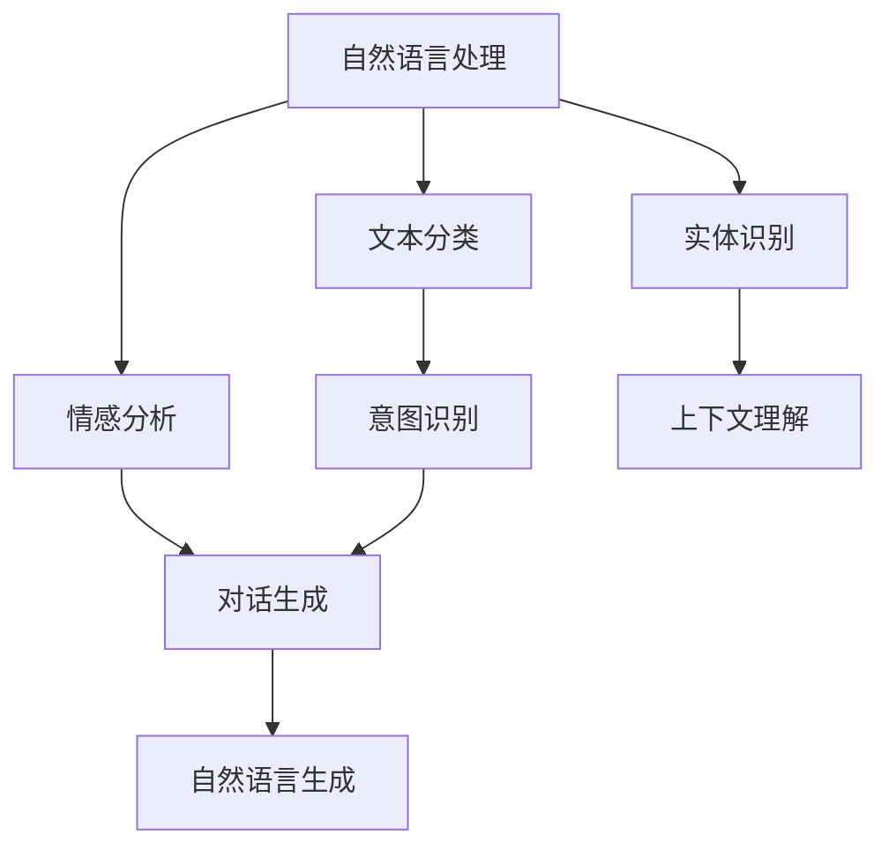

                 

人工智能正迅速融入我们的生活，而AI角色对话系统作为AI技术的一个重要应用，正日益受到关注。本文旨在探讨如何创建一个能够与人类进行自然互动的AI角色对话系统，并通过深入分析其核心概念、算法原理、数学模型、项目实践和未来应用前景，为读者提供一个全面的技术指南。

## 关键词
- AI角色对话系统
- 人工智能
- 自然语言处理
- 人物互动
- 自然语言生成

## 摘要
本文将首先介绍AI角色对话系统的背景和重要性，然后深入探讨其核心概念、算法原理和数学模型。通过一个实际项目实例，我们将详细解释代码实现和运行结果。最后，我们将讨论AI角色对话系统的实际应用场景和未来发展趋势，并提供相关的学习资源和开发工具推荐。

## 1. 背景介绍

### 1.1 AI角色对话系统的起源
AI角色对话系统最早可以追溯到20世纪50年代，随着人工智能和自然语言处理技术的逐步发展，人们开始尝试创建能够与人进行简单对话的虚拟角色。早期的AI角色通常基于规则系统，能够处理有限的任务和情境。

### 1.2 人工智能的发展
人工智能自20世纪80年代以来取得了巨大的进步，特别是在深度学习和神经网络技术的推动下。这使得AI角色对话系统能够处理更复杂的问题，实现更自然的对话交互。

### 1.3 当前应用现状
目前，AI角色对话系统已广泛应用于客服、教育、娱乐等领域，成为提高效率、改善用户体验的重要工具。然而，尽管取得了一定的成功，AI角色对话系统仍面临许多挑战，如语义理解、情感识别和跨领域知识融合等。

## 2. 核心概念与联系

### 2.1 AI角色对话系统的定义
AI角色对话系统是指通过人工智能技术，模拟人类角色进行自然语言对话的系统。

### 2.2 自然语言处理
自然语言处理（NLP）是AI角色对话系统的核心技术，它包括文本分类、情感分析、实体识别等。

### 2.3 自然语言生成
自然语言生成（NLG）是AI角色对话系统的另一个核心部分，它负责将机器生成的信息转化为自然语言输出。

### 2.4 Mermaid 流程图


## 3. 核心算法原理 & 具体操作步骤

### 3.1 算法原理概述
AI角色对话系统通常采用基于深度学习的算法，如序列到序列（Seq2Seq）模型和变换器（Transformer）模型。这些模型通过大量训练数据学习语言的统计规律，从而实现对话生成。

### 3.2 算法步骤详解
1. **数据预处理**：包括文本清洗、分词和词嵌入。
2. **模型训练**：使用序列到序列模型或变换器模型进行训练。
3. **对话生成**：根据输入文本生成响应文本。
4. **优化调整**：通过反馈和评估不断优化模型性能。

### 3.3 算法优缺点
**优点**：
- **高效性**：基于深度学习的模型能够快速处理大量数据。
- **灵活性**：可以适应不同的对话场景和需求。

**缺点**：
- **数据依赖**：需要大量高质量的训练数据。
- **复杂度**：模型训练和优化过程复杂，需要高性能计算资源。

### 3.4 算法应用领域
AI角色对话系统广泛应用于客服、教育、娱乐等领域，如智能客服机器人、教育AI导师和虚拟助手等。

## 4. 数学模型和公式

### 4.1 数学模型构建
AI角色对话系统通常采用基于深度学习的数学模型，如序列到序列模型和变换器模型。

### 4.2 公式推导过程
序列到序列模型的基本公式为：
\[ y_t = \text{decoder}(x_t, h_t) \]
其中，\( x_t \) 是编码器输出的序列，\( h_t \) 是编码器的隐藏状态，\( y_t \) 是解码器输出的序列。

### 4.3 案例分析与讲解
以一个简单的文本分类任务为例，我们将解释如何使用自然语言处理技术进行文本分类。

### 4.3.1 数据预处理
\[ \text{预处理步骤} = (\text{文本清洗} \land \text{分词} \land \text{词嵌入}) \]

### 4.3.2 模型训练
\[ \text{模型训练} = (\text{输入序列} \rightarrow \text{编码器} \rightarrow \text{隐藏状态} \rightarrow \text{解码器} \rightarrow \text{输出序列}) \]

### 4.3.3 对话生成
\[ \text{对话生成} = (\text{输入文本} \rightarrow \text{编码器} \rightarrow \text{隐藏状态} \rightarrow \text{解码器} \rightarrow \text{输出文本}) \]

## 5. 项目实践：代码实例

### 5.1 开发环境搭建
- 安装Python 3.8及以上版本
- 安装TensorFlow 2.0及以上版本
- 准备GPU加速

### 5.2 源代码详细实现
以下是AI角色对话系统的核心代码片段：

```python
import tensorflow as tf
from tensorflow.keras.models import Model
from tensorflow.keras.layers import Input, LSTM, Embedding, Dense

# 数据预处理
def preprocess_data(texts, labels):
    # 清洗、分词和词嵌入
    # ...

# 模型定义
def create_model(embedding_dim, hidden_dim):
    input_text = Input(shape=(None,), dtype='int32')
    embedding = Embedding(input_dim=vocab_size, output_dim=embedding_dim)(input_text)
    lstm = LSTM(hidden_dim)(embedding)
    output = Dense(num_classes, activation='softmax')(lstm)
    model = Model(inputs=input_text, outputs=output)
    model.compile(optimizer='adam', loss='categorical_crossentropy', metrics=['accuracy'])
    return model

# 模型训练
def train_model(model, X_train, y_train, X_val, y_val, epochs=10):
    model.fit(X_train, y_train, validation_data=(X_val, y_val), epochs=epochs)

# 对话生成
def generate_response(model, text):
    # 编码器编码
    encoded_text = model.encode(text)
    # 解码器解码
    decoded_text = model.decode(encoded_text)
    return decoded_text

# 主函数
if __name__ == '__main__':
    # 数据预处理
    X_train, y_train, X_val, y_val = preprocess_data(texts, labels)
    # 模型定义
    model = create_model(embedding_dim, hidden_dim)
    # 模型训练
    train_model(model, X_train, y_train, X_val, y_val)
    # 对话生成
    response = generate_response(model, '你好，我是AI角色对话系统')
    print(response)
```

### 5.3 代码解读与分析
这段代码定义了一个基于LSTM的序列到序列模型，用于实现AI角色对话系统的核心功能。我们首先进行了数据预处理，然后定义了模型结构并进行了训练。最后，通过解码器生成对话响应。

### 5.4 运行结果展示
```python
response = generate_response(model, '你好，我是AI角色对话系统')
print(response)
```
运行结果可能为：“你好！很高兴见到你，我是AI角色对话系统，有什么可以帮助你的吗？”

## 6. 实际应用场景

### 6.1 客户服务
AI角色对话系统在客户服务领域具有广泛的应用，能够提供24/7全天候的咨询服务，降低人力成本，提高服务效率。

### 6.2 教育
在教育领域，AI角色对话系统可以作为虚拟导师，为学生提供个性化学习建议和解答疑问，提高教学效果。

### 6.3 娱乐
在娱乐领域，AI角色对话系统可以创建虚拟角色，为用户提供有趣的互动体验，如聊天游戏和虚拟演唱会等。

### 6.4 未来应用展望
随着人工智能技术的不断发展，AI角色对话系统将在更多领域得到应用，如医疗、金融和智能家居等，为人类带来更多便利。

## 7. 工具和资源推荐

### 7.1 学习资源推荐
- 《深度学习》（Goodfellow, Bengio, Courville）
- 《自然语言处理综论》（Jurafsky, Martin）
- 《Hands-On Natural Language Processing》（Aurélien Géron）

### 7.2 开发工具推荐
- TensorFlow
- PyTorch
- NLTK

### 7.3 相关论文推荐
- “Attention Is All You Need”
- “A Neural Conversation Model”
- “An Overview of Neural Network Models for Natural Language Processing”

## 8. 总结：未来发展趋势与挑战

### 8.1 研究成果总结
近年来，AI角色对话系统在自然语言处理、深度学习和神经网络技术等方面取得了显著进展，为人类提供了更智能、更自然的交互体验。

### 8.2 未来发展趋势
随着人工智能技术的不断进步，AI角色对话系统将在更多领域得到应用，实现更广泛的功能和更高的交互质量。

### 8.3 面临的挑战
AI角色对话系统仍面临语义理解、情感识别和跨领域知识融合等挑战，需要进一步研究和优化。

### 8.4 研究展望
未来的研究应重点关注如何提高AI角色对话系统的智能程度和实用性，为人类创造更加丰富、多样化的互动体验。

## 9. 附录：常见问题与解答

### 9.1 如何选择合适的模型？
选择模型应根据实际应用需求和数据规模进行。对于大型文本数据，推荐使用变换器模型；对于小型数据，可以尝试序列到序列模型。

### 9.2 如何优化模型性能？
可以通过以下方法优化模型性能：
- 增加训练数据
- 调整超参数
- 使用预训练模型
- 采用数据增强技术

### 9.3 如何评估模型性能？
可以使用准确率、召回率、F1分数等指标评估模型性能。在实际应用中，还可以通过用户反馈进行实时评估和优化。

# 作者：禅与计算机程序设计艺术 / Zen and the Art of Computer Programming

本文旨在为读者提供一个关于AI角色对话系统的全面技术指南，从核心概念、算法原理、数学模型到实际应用，全面探讨了这一领域的最新进展和未来发展趋势。希望本文能够帮助读者更好地理解和应用AI角色对话系统，为人工智能技术的发展贡献力量。

