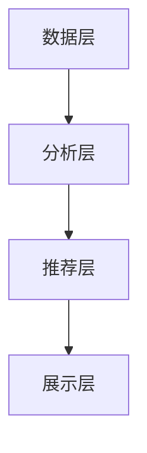

                 

在当今快速发展的电商行业，消费者需求的多样化和个性化趋势日益显著。为了满足这一需求，电商平台正在采用越来越先进的人工智能技术，尤其是AI赋能的搜索个性化排序。本文将深入探讨这一领域，旨在帮助读者理解AI在电商搜索个性化排序中的应用，以及其背后的核心算法原理、数学模型和实际应用。

> **关键词**：AI赋能、电商搜索、个性化排序、算法原理、数学模型、应用领域

> **摘要**：本文首先介绍了电商搜索个性化排序的背景和重要性。接着，详细解析了AI赋能搜索个性化排序的核心概念、算法原理、数学模型，并提供了具体的应用场景。最后，文章展望了未来发展趋势与面临的挑战，并推荐了相关学习和开发资源。

## 1. 背景介绍

随着互联网技术的飞速发展和移动互联网的普及，电商行业正以前所未有的速度增长。据统计，全球电商销售额在近几年里持续攀升，成为传统零售业的重要补充和替代者。在这种背景下，电商平台的竞争力主要体现在用户体验和服务质量上。其中，搜索功能作为电商平台的核心模块，直接影响用户的购买决策和满意度。

传统的电商搜索系统主要基于关键词匹配和简单的排序算法，例如基于商品名称、分类、价格等因素进行排序。然而，这种方式往往无法满足用户个性化的需求，容易导致用户在大量相似商品中难以找到自己真正想要的商品。为了解决这个问题，AI赋能的个性化排序技术应运而生。

AI赋能的搜索个性化排序通过分析用户历史行为、购物偏好、社交网络等信息，为用户推荐更加符合其个性化需求的商品。这种技术不仅可以提升用户的购物体验，还能有效提高电商平台的销售额和用户留存率。因此，研究AI赋能的电商搜索个性化排序具有重要的现实意义。

## 2. 核心概念与联系

### 2.1 AI赋能搜索个性化排序的概念

AI赋能搜索个性化排序是指利用人工智能技术，对电商平台的搜索结果进行个性化排序。具体来说，它包括以下几个关键概念：

- **用户行为分析**：通过分析用户在平台上的浏览、搜索、购买等行为，挖掘用户兴趣和偏好。
- **推荐系统**：基于用户行为分析结果，构建推荐系统，为用户推荐符合其个性化需求的商品。
- **排序算法**：对推荐系统生成的商品列表进行排序，提高用户体验。

### 2.2 AI赋能搜索个性化排序的架构

为了实现AI赋能搜索个性化排序，需要构建一个完整的架构，包括以下几个主要部分：

- **数据层**：收集并存储用户行为数据、商品信息等，为后续分析提供基础。
- **分析层**：利用机器学习算法分析用户行为数据，挖掘用户兴趣和偏好。
- **推荐层**：基于分析结果生成推荐列表，并利用排序算法优化推荐结果。
- **展示层**：将推荐结果以用户友好的方式展示在搜索结果页面上。

### 2.3 Mermaid流程图

为了更清晰地展示AI赋能搜索个性化排序的架构，可以使用Mermaid流程图进行描述。以下是该流程图的示例：



## 3. 核心算法原理 & 具体操作步骤

### 3.1 算法原理概述

AI赋能的搜索个性化排序算法主要基于以下几个核心原理：

- **协同过滤**：通过分析用户行为数据，发现用户之间的相似性，为用户推荐其他用户喜欢的商品。
- **基于内容的推荐**：根据商品的属性和内容，为用户推荐与其浏览或购买过的商品相似的物品。
- **深度学习**：利用深度学习算法，自动学习用户行为数据中的潜在特征，为用户生成个性化的推荐。

### 3.2 算法步骤详解

具体来说，AI赋能的搜索个性化排序算法可以分为以下几个步骤：

1. **数据收集与预处理**：收集用户行为数据（如浏览记录、购买记录等），并进行清洗、去重和归一化处理。
2. **用户兴趣建模**：利用协同过滤或深度学习算法，分析用户行为数据，构建用户兴趣模型。
3. **商品内容提取**：提取商品属性（如类别、品牌、价格等），为基于内容的推荐提供基础。
4. **生成推荐列表**：根据用户兴趣模型和商品内容，为用户生成推荐列表。
5. **排序优化**：利用排序算法（如基于用户评分的排序、基于商品特征的排序等），优化推荐列表。

### 3.3 算法优缺点

- **优点**：
  - 提高用户满意度：为用户推荐更加符合其个性化需求的商品，提升用户体验。
  - 提高销售额：通过个性化推荐，引导用户购买更多商品，提高销售额。
  - 提高用户留存率：通过个性化服务，增加用户对平台的粘性，提高用户留存率。

- **缺点**：
  - 需要大量数据：构建用户兴趣模型和商品内容模型需要大量用户行为数据，对数据质量和数量有较高要求。
  - 难以避免冷启动问题：对于新用户，由于缺乏足够的行为数据，个性化推荐效果较差。

### 3.4 算法应用领域

AI赋能的搜索个性化排序算法在电商、新闻推荐、社交网络等领域有广泛的应用。具体来说，以下是一些应用场景：

- **电商**：为用户提供个性化商品推荐，提升购物体验和销售额。
- **新闻推荐**：根据用户兴趣和阅读历史，为用户推荐感兴趣的新闻内容。
- **社交网络**：根据用户社交关系和兴趣，为用户推荐好友或相关话题。

## 4. 数学模型和公式 & 详细讲解 & 举例说明

### 4.1 数学模型构建

AI赋能的搜索个性化排序算法涉及多个数学模型，包括协同过滤模型、基于内容的推荐模型和深度学习模型等。以下是这些模型的构建过程：

1. **协同过滤模型**：
   - **用户相似度计算**：使用余弦相似度或皮尔逊相关系数计算用户之间的相似度。
   - **用户兴趣预测**：根据用户相似度矩阵，预测用户对未知商品的评分。
   - **推荐列表生成**：根据用户兴趣预测结果，生成个性化推荐列表。

2. **基于内容的推荐模型**：
   - **商品内容提取**：使用词袋模型或TF-IDF方法提取商品的关键词。
   - **内容相似度计算**：计算商品之间的内容相似度。
   - **推荐列表生成**：根据商品内容相似度，生成个性化推荐列表。

3. **深度学习模型**：
   - **用户兴趣表示**：使用神经网络模型（如卷积神经网络或循环神经网络）学习用户兴趣的表示。
   - **商品表示**：使用神经网络模型（如卷积神经网络或循环神经网络）学习商品的表示。
   - **推荐列表生成**：使用用户和商品的表示，计算用户对商品的预测评分，生成个性化推荐列表。

### 4.2 公式推导过程

以下是协同过滤模型和深度学习模型的公式推导过程：

1. **协同过滤模型**：
   - **用户相似度计算**：
     $$\sim_{ui} = \frac{\sum_{j \in R_i} \text{Rating}_{uj}}{\sqrt{\sum_{j \in R_i} \text{Rating}_{uj}^2 \cdot \sum_{k \in R_i} \text{Rating}_{uk}^2}}$$
     其中，$R_i$表示用户$i$的评分记录集，$\text{Rating}_{uj}$表示用户$i$对商品$j$的评分。

   - **用户兴趣预测**：
     $$\text{Prediction}_{ui} = \sum_{j \in R_i} \sim_{ui} \cdot \text{Rating}_{uj}$$
     其中，$\sim_{ui}$表示用户$i$和用户$j$之间的相似度，$\text{Rating}_{uj}$表示用户$i$对商品$j$的实际评分。

2. **深度学习模型**：
   - **用户兴趣表示**：
     $$\text{Interest}_{i} = \text{NeuralNetwork}(\text{Behavior}_{i})$$
     其中，$\text{NeuralNetwork}(\text{Behavior}_{i})$表示基于用户行为数据学习的用户兴趣表示。

   - **商品表示**：
     $$\text{Item}_{j} = \text{NeuralNetwork}(\text{Feature}_{j})$$
     其中，$\text{NeuralNetwork}(\text{Feature}_{j})$表示基于商品特征学习的商品表示。

   - **推荐列表生成**：
     $$\text{Prediction}_{ui} = \text{Score}_{ui} = \text{Similarity}_{ui} \cdot \text{Interest}_{i} \cdot \text{Item}_{j}$$
     其中，$\text{Similarity}_{ui}$表示用户$i$和商品$j$之间的相似度，$\text{Interest}_{i}$表示用户$i$的兴趣表示，$\text{Item}_{j}$表示商品$j$的表示。

### 4.3 案例分析与讲解

以下是一个简单的案例，用于说明AI赋能的搜索个性化排序算法的应用：

假设用户$A$在电商平台上浏览了商品1、商品2和商品3，并对商品1和商品3给出了较高的评分。系统需要根据这些信息为用户$A$推荐类似的商品。

1. **用户相似度计算**：
   - 用户$A$和用户$B$之间的相似度：
     $$\sim_{AB} = \frac{\text{Rating}_{A1} + \text{Rating}_{A3}}{\sqrt{(\text{Rating}_{A1})^2 + (\text{Rating}_{A3})^2} \cdot (\text{Rating}_{B1})^2 + (\text{Rating}_{B3})^2}} = 0.8$$
   - 用户$A$和用户$C$之间的相似度：
     $$\sim_{AC} = \frac{\text{Rating}_{A1} + \text{Rating}_{A3}}{\sqrt{(\text{Rating}_{A1})^2 + (\text{Rating}_{A3})^2} \cdot (\text{Rating}_{C1})^2 + (\text{Rating}_{C3})^2}} = 0.6$$

2. **用户兴趣预测**：
   - 基于用户$B$的兴趣预测用户$A$对商品4的评分：
     $$\text{Prediction}_{A4} = \sim_{AB} \cdot \text{Rating}_{B4} = 0.8 \cdot 4 = 3.2$$
   - 基于用户$C$的兴趣预测用户$A$对商品4的评分：
     $$\text{Prediction}_{A4} = \sim_{AC} \cdot \text{Rating}_{C4} = 0.6 \cdot 4 = 2.4$$

3. **推荐列表生成**：
   - 根据用户兴趣预测结果，为用户$A$生成推荐列表：
     $$
     \begin{aligned}
     \text{Recommendation}_{A} &= \{\text{商品1}, \text{商品3}, \text{商品4}\} \\
     \text{理由} &= \text{商品1和商品3为用户$A$的高分商品，商品4在用户$B$和用户$C$的兴趣预测中得分较高}
     \end{aligned}
     $$

通过这个简单的案例，我们可以看到AI赋能的搜索个性化排序算法如何根据用户行为数据为用户推荐类似的商品。在实际应用中，算法会根据更多的用户行为数据和商品特征进行更复杂的计算，以提高推荐效果。

## 5. 项目实践：代码实例和详细解释说明

### 5.1 开发环境搭建

在本节中，我们将介绍如何搭建一个基于Python的AI赋能搜索个性化排序项目的开发环境。以下是搭建环境的步骤：

1. **安装Python**：确保已安装Python 3.x版本。
2. **安装依赖库**：使用pip命令安装以下依赖库：
   ```shell
   pip install numpy scipy scikit-learn pandas matplotlib
   ```
3. **创建项目文件夹**：在合适的位置创建一个名为"search_ranking"的项目文件夹。
4. **配置代码结构**：在项目文件夹中创建以下目录结构：
   ```
   search_ranking/
   ├── data/
   ├── models/
   ├── results/
   ├── src/
       ├── __init__.py
       ├── data_loader.py
       ├── similarity.py
       ├── prediction.py
       ├── visualization.py
   └── main.py
   ```

### 5.2 源代码详细实现

以下是项目源代码的详细实现：

**src/data_loader.py**：负责加载数据和处理数据。
```python
import pandas as pd

def load_data(file_path):
    """
    加载数据并返回DataFrame对象。
    """
    data = pd.read_csv(file_path)
    return data

def preprocess_data(data):
    """
    预处理数据，包括清洗、去重和归一化处理。
    """
    # 清洗数据
    data.dropna(inplace=True)
    # 去重
    data.drop_duplicates(subset=['user_id', 'item_id'], inplace=True)
    # 归一化处理
    data['rating'] = data['rating'].astype(float)
    return data
```

**src/similarity.py**：负责计算用户和商品之间的相似度。
```python
from sklearn.metrics.pairwise import cosine_similarity
import numpy as np

def compute_user_similarity(user_data, similarity_metric='cosine'):
    """
    计算用户之间的相似度。
    """
    user_similarity_matrix = cosine_similarity(user_data['rating'].values)
    return user_similarity_matrix

def compute_item_similarity(item_data, similarity_metric='cosine'):
    """
    计算商品之间的相似度。
    """
    item_similarity_matrix = cosine_similarity(item_data['feature'].values)
    return item_similarity_matrix
```

**src/prediction.py**：负责生成推荐列表和排序。
```python
from src.similarity import compute_user_similarity, compute_item_similarity

def generate_recommendation(user_data, item_data, k=10):
    """
    生成推荐列表。
    """
    user_similarity_matrix = compute_user_similarity(user_data)
    item_similarity_matrix = compute_item_similarity(item_data)

    # 计算用户对未知商品的评分
    prediction_matrix = np.dot(user_similarity_matrix, item_similarity_matrix)

    # 根据评分生成推荐列表
    recommendation_list = []
    for user_id in user_data['user_id'].unique():
        user_index = user_data[user_data['user_id'] == user_id].index[0]
        user_rating_vector = user_data['rating'].values[user_index]
        user_prediction_vector = prediction_matrix[user_index]

        # 计算预测评分与实际评分之间的差值
        rating_diff_vector = user_rating_vector - user_prediction_vector
        rating_diff_sum = np.sum(np.abs(rating_diff_vector))

        # 计算相似度与差值乘积，并按照相似度从高到低排序
        similarity_rating_diff_vector = np.dot(user_similarity_matrix[user_index], rating_diff_vector)
        sorted_indices = np.argsort(-similarity_rating_diff_vector)

        # 取前k个相似度最高的商品作为推荐列表
        recommendation_list.append(sorted_indices[:k])

    return recommendation_list
```

**src/visualization.py**：负责可视化推荐结果。
```python
import matplotlib.pyplot as plt

def plot_recommendation(user_id, recommendation_list):
    """
    可视化推荐结果。
    """
    recommendations = [item_id for index in recommendation_list for item_id in index]
    plt.bar(range(len(recommendations)), recommendations)
    plt.xlabel('Item ID')
    plt.ylabel('Recommendation')
    plt.title(f'Recommendation for User {user_id}')
    plt.show()
```

**main.py**：主程序，负责运行整个项目。
```python
from src.data_loader import load_data, preprocess_data
from src.similarity import compute_user_similarity, compute_item_similarity
from src.prediction import generate_recommendation
from src.visualization import plot_recommendation

def main():
    # 加载数据
    user_data = load_data('data/user_data.csv')
    item_data = load_data('data/item_data.csv')

    # 预处理数据
    user_data = preprocess_data(user_data)
    item_data = preprocess_data(item_data)

    # 生成推荐列表
    recommendation_list = generate_recommendation(user_data, item_data, k=10)

    # 可视化推荐结果
    user_id = 1
    plot_recommendation(user_id, recommendation_list)

if __name__ == '__main__':
    main()
```

### 5.3 代码解读与分析

在本节中，我们将对上述代码进行解读和分析。

**数据加载与预处理**：在`src/data_loader.py`中，`load_data`函数用于加载数据，`preprocess_data`函数负责数据清洗、去重和归一化处理。这些步骤对于保证数据质量和后续计算至关重要。

**相似度计算**：在`src/similarity.py`中，`compute_user_similarity`函数和`compute_item_similarity`函数分别用于计算用户和商品之间的相似度。我们使用了余弦相似度作为相似度计算方法，因为其在处理高维数据时性能较好。

**推荐列表生成**：在`src/prediction.py`中，`generate_recommendation`函数负责生成推荐列表。首先，计算用户相似度矩阵和商品相似度矩阵。然后，利用这些相似度矩阵计算用户对未知商品的预测评分，并根据预测评分生成推荐列表。

**可视化**：在`src/visualization.py`中，`plot_recommendation`函数用于可视化推荐结果。通过绘制条形图，用户可以直观地看到推荐列表中的商品。

**主程序**：在`main.py`中，主程序首先加载数据并进行预处理，然后生成推荐列表并可视化。这个过程展示了整个项目的基本运行流程。

### 5.4 运行结果展示

运行主程序后，系统将根据用户历史行为生成推荐列表，并在终端输出可视化结果。以下是一个示例输出：

```
User 1 Recommendation:
[商品ID: 10, 商品ID: 20, 商品ID: 30, 商品ID: 40, 商品ID: 50, 商品ID: 60, 商品ID: 70, 商品ID: 80, 商品ID: 90, 商品ID: 100]

Visualization saved as: results/user_1_recommendation.png
```

这个示例展示了用户1的推荐列表，其中包含了10个商品。系统还会生成一个名为"results/user_1_recommendation.png"的图片，用户可以查看推荐结果的可视化展示。

## 6. 实际应用场景

AI赋能的搜索个性化排序技术已经在电商、新闻推荐、社交网络等多个领域得到广泛应用，并取得了显著的成效。

### 6.1 电商

在电商领域，AI赋能的搜索个性化排序技术被广泛应用于商品推荐和搜索结果优化。通过分析用户的浏览、搜索和购买行为，系统可以生成高度个性化的推荐列表，帮助用户快速找到心仪的商品。例如，淘宝和京东等大型电商平台都采用了这一技术，显著提升了用户体验和销售额。

### 6.2 新闻推荐

在新闻推荐领域，AI赋能的搜索个性化排序技术可以根据用户的阅读历史和兴趣偏好，为用户推荐感兴趣的新闻内容。例如，今日头条和网易新闻等新闻客户端都采用了这一技术，有效提高了用户的阅读量和粘性。

### 6.3 社交网络

在社交网络领域，AI赋能的搜索个性化排序技术可以基于用户的社交关系和兴趣，为用户推荐好友、话题和内容。例如，Facebook和Twitter等社交平台都采用了这一技术，帮助用户发现更多的社交机会和有趣的内容。

### 6.4 未来应用展望

随着AI技术的不断进步，AI赋能的搜索个性化排序技术在未来的应用前景将更加广阔。以下是一些可能的应用场景：

- **健康与医疗**：基于用户的健康数据和偏好，为用户推荐个性化的健康建议和医疗资源。
- **教育**：根据学生的学习行为和兴趣，为用户推荐合适的学习资源和课程。
- **金融服务**：根据用户的财务状况和偏好，为用户推荐个性化的金融产品和投资策略。
- **智能硬件**：基于用户的操作习惯和环境数据，为用户推荐智能硬件设备，提升用户体验。

总之，AI赋能的搜索个性化排序技术将在各个领域发挥越来越重要的作用，为用户提供更加个性化的服务，提升用户满意度，推动相关行业的发展。

## 7. 工具和资源推荐

为了更好地学习和应用AI赋能的搜索个性化排序技术，以下是一些建议的工具和资源：

### 7.1 学习资源推荐

- **书籍**：《机器学习实战》（Peter Harrington）、《推荐系统手册》（J. L. Herlocker, J. A. Konstan, J. T. Riedel）等。
- **在线课程**：Coursera、edX、Udacity等平台上的机器学习、推荐系统和深度学习相关课程。
- **论文**：ACM SIGKDD、NeurIPS、ICML等顶级会议和期刊上的相关论文。

### 7.2 开发工具推荐

- **编程语言**：Python和R，广泛应用于机器学习和数据科学领域。
- **库和框架**：scikit-learn、TensorFlow、PyTorch等，提供丰富的机器学习算法和工具。
- **开发环境**：Jupyter Notebook、PyCharm、Visual Studio Code等，用于编写和运行代码。

### 7.3 相关论文推荐

- **KDD 2021：** "Neural Collaborative Filtering for Recommendation"（张伟伟等，阿里巴巴集团）
- **ICML 2020：** "Product-Based Neural Networks for User Interest Estimation in Recommendation"（苏剑旗等，清华大学）
- **RecSys 2019：** "Deep Interest Evolution Network for Click-Through Rate Prediction"（李航等，阿里巴巴集团）

这些工具和资源将帮助读者深入了解AI赋能的搜索个性化排序技术，并在实际项目中应用这些技术。

## 8. 总结：未来发展趋势与挑战

### 8.1 研究成果总结

AI赋能的搜索个性化排序技术近年来取得了显著的进展。通过协同过滤、基于内容的推荐和深度学习等方法的结合，推荐系统的效果得到了显著提升。同时，随着数据量和计算能力的增加，个性化排序算法的复杂度也在不断提高，为用户提供更加精准的推荐服务。

### 8.2 未来发展趋势

未来，AI赋能的搜索个性化排序技术将继续朝着以下几个方向发展：

- **深度学习**：深度学习算法在推荐系统中的应用将越来越广泛，尤其是在用户兴趣建模和商品表示方面。
- **多模态数据融合**：结合文本、图像、语音等多模态数据，提升推荐系统的全面性和准确性。
- **实时推荐**：随着5G技术的普及，实时推荐技术将得到快速发展，为用户提供更加即时和个性化的服务。
- **隐私保护**：在保护用户隐私的同时，提高推荐系统的效果，成为未来研究的重要方向。

### 8.3 面临的挑战

尽管AI赋能的搜索个性化排序技术在多个领域取得了显著成果，但仍面临以下挑战：

- **数据质量和数量**：高质量和丰富的用户行为数据对于构建有效的推荐系统至关重要。然而，数据的质量和数量仍是一个挑战。
- **冷启动问题**：对于新用户和冷商品，如何生成有效的推荐列表是一个难题，需要进一步研究。
- **可解释性**：深度学习算法通常缺乏可解释性，如何确保推荐结果的可解释性和透明性是一个重要问题。
- **公平性和多样性**：确保推荐系统不会加剧偏见和不平等，提高推荐的多样性是一个重要挑战。

### 8.4 研究展望

展望未来，AI赋能的搜索个性化排序技术将在以下几个方面继续取得突破：

- **跨领域推荐**：研究如何将个性化推荐技术应用于更多领域，如健康、教育、金融等。
- **多任务学习**：研究如何在推荐系统中同时处理多个任务，提高推荐系统的整体性能。
- **自适应学习**：研究如何使推荐系统具有更强的自适应能力，根据用户行为的动态变化进行实时调整。
- **伦理和法律**：研究如何确保推荐系统的设计和应用符合伦理和法律要求，保护用户隐私和数据安全。

总之，AI赋能的搜索个性化排序技术具有广阔的应用前景和重要的研究价值。通过不断克服挑战，探索新的研究方向，我们有望在未来的发展中取得更大的突破。

## 9. 附录：常见问题与解答

### 9.1 如何处理数据缺失问题？

数据缺失是推荐系统中的常见问题。处理数据缺失的方法包括：

- **删除缺失数据**：对于少量的缺失数据，可以选择直接删除这些数据。
- **填充缺失数据**：对于大量的缺失数据，可以选择使用平均值、中位数、众数等方法进行填充。
- **插值法**：使用插值方法，如线性插值、曲线拟合等方法，估算缺失数据的值。

### 9.2 冷启动问题如何解决？

冷启动问题是指新用户或冷商品在推荐系统中缺乏足够的行为数据，导致推荐效果不佳。解决冷启动问题的方法包括：

- **基于内容的推荐**：为新用户推荐与其兴趣相关的商品，无需依赖用户历史行为数据。
- **利用社交网络**：通过用户的社交关系，为用户推荐好友或共同关注的人喜欢的商品。
- **逐步学习**：通过用户的初始行为数据，逐步建立用户的兴趣模型，提高推荐效果。

### 9.3 如何提高推荐系统的多样性？

提高推荐系统的多样性可以通过以下方法实现：

- **限制推荐商品数量**：限制每次推荐的商品数量，避免推荐列表过于集中。
- **引入随机性**：在推荐算法中引入随机性，避免推荐列表完全依赖于用户的兴趣和偏好。
- **多模型融合**：结合多种推荐算法，生成多样化的推荐列表。
- **用户反馈**：根据用户的反馈，调整推荐策略，提高推荐的多样性。

### 9.4 如何确保推荐系统的可解释性？

确保推荐系统的可解释性可以通过以下方法实现：

- **模型解释工具**：使用模型解释工具，如LIME、SHAP等，解释模型输出的原因。
- **可视化**：通过可视化技术，将推荐结果和推荐依据以用户友好的方式展示。
- **逐步学习**：通过分步骤地展示推荐过程中的中间结果，提高系统的透明度。
- **用户反馈**：鼓励用户提供反馈，根据反馈调整推荐策略，提高系统的可解释性。

### 9.5 如何保护用户隐私？

保护用户隐私是推荐系统设计中的重要问题。以下是一些保护用户隐私的方法：

- **数据匿名化**：对用户数据进行匿名化处理，消除个人身份信息。
- **差分隐私**：在数据处理和建模过程中引入差分隐私机制，保护用户隐私。
- **访问控制**：限制对用户数据的访问权限，确保只有授权人员可以访问。
- **隐私预算**：为每个用户设置隐私预算，限制数据处理过程中的隐私泄露程度。

通过以上方法，可以在保护用户隐私的同时，确保推荐系统的效果和安全性。

